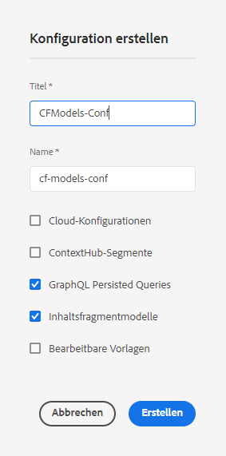
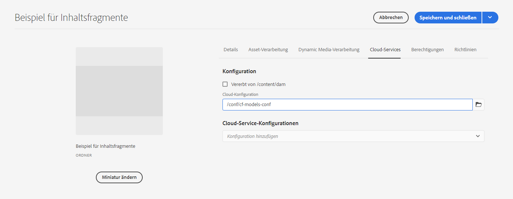

# Inhaltsfragmente - Konfigurationsbrowser{#content-fragments-configuration-browser}

## Inhaltsfragmentfunktionen für Ihre Instanz aktivieren {#enable-content-fragment-functionality-instance}

Bevor Sie Inhaltsfragmente verwenden können, müssen Sie den **Konfigurationsbrowser** verwenden, um Folgendes zu aktivieren:

* **Inhaltsfragmentmodelle**  - obligatorisch
* **GraphQL Persistente Abfragen**  - optional

>[!CAUTION]
>
>Wenn Sie **Inhaltsfragmentmodelle** nicht aktivieren, haben Sie keinen Zugriff auf die Option **Erstellen** für das Erstellen neuer Modelle.

Zum Aktivieren der Inhaltsfragmentfunktion benötigen Sie Folgendes:

* Aktivieren der Verwendung der Funktion für Inhaltsfragmente über den Konfigurationsbrowser
* Wenden Sie die Konfiguration auf Ihren Assets-Ordner an

### Content Fragment-Funktionen in Configuration Browser {#enable-content-fragment-functionality-in-configuration-browser} aktivieren

Um [bestimmte Inhaltsfragment-Funktionen zu verwenden, müssen Sie ](#creating-a-content-fragment-model) **diese zunächst über den** Konfigurationsbrowser **aktivieren:**

>[!NOTE]
>
>Weitere Informationen finden Sie unter [Konfigurationsbrowser:](/help/implementing/developing/introduction/configurations.md#using-configuration-browser).

>[!CAUTION]
>
>Unterkonfigurationen (eine in einer Konfiguration verschachtelte Konfiguration) werden für die Verwendung mit Inhaltsfragmenten nicht unterstützt.

1. Navigieren Sie zu **Tools** > **Allgemein** und öffnen Sie dann den **Konfigurations-Browser**.

1. Öffnen Sie über **Erstellen** das Dialogfeld, in dem Sie:

   1. einen **Titel** angeben,
   1. Um ihre Verwendung zu aktivieren, wählen Sie
      * **Inhaltsfragmentmodelle**
      * **GraphQL Persistente Abfragen**

      

1. Wählen Sie **Erstellen** aus, um die Definition zu speichern.

<!-- 1. Select the location appropriate to your website. -->

### Wenden Sie die Konfiguration auf Ihren Assets-Ordner an {#apply-the-configuration-to-your-assets-folder}

Wenn die Konfiguration **global** für die Funktionalität von Inhaltsfragmenten aktiviert ist, gilt dies für jeden beliebigen Asset-Ordner.

Um eine andere Konfiguration (d. h. nicht „Global“) mit einem vergleichbaren Assets-Ordner zu verwenden, müssen Sie die Verbindung definieren. Wählen Sie dazu die entsprechende **Konfiguration** in der Registerkarte **Cloud Services** der **Ordnereigenschaften** des entsprechenden Ordners aus.

