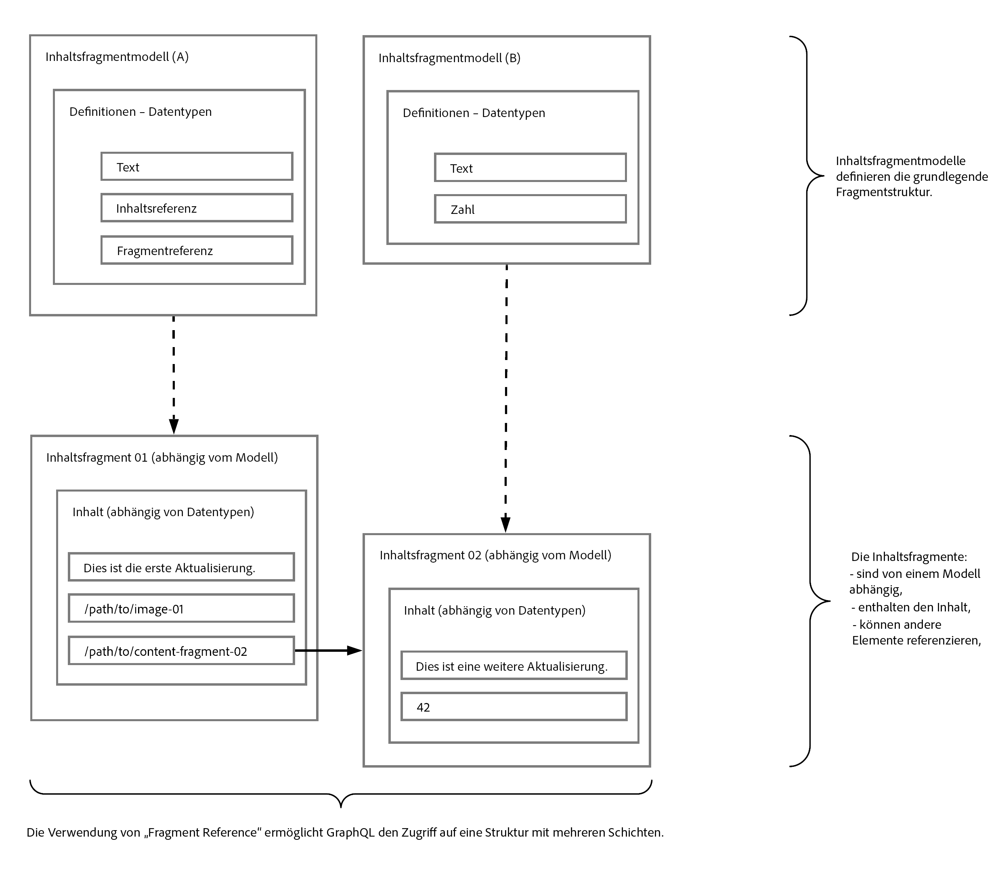

# Headless-Bereitstellung von Inhalten mithilfe von Inhaltsfragmenten mit GraphQL {#headless-content-delivery-using-content-fragments-with-graphQL}

Mit Adobe Experience Manager (AEM) als Cloud Service können Sie Inhaltsfragmente zusammen mit der AEM GraphQL API (eine auf GraphQL basierende benutzerdefinierte Implementierung) verwenden, um ohne Probleme strukturierte Inhalte für Ihre Anwendungen bereitzustellen. Durch die Möglichkeit, eine einzelne API-Abfrage anzupassen, können Sie den spezifischen Inhalt, den Sie rendern möchten/benötigen (als Antwort auf die einzelne API-Abfrage), abrufen und bereitstellen.

>[!NOTE]
>
>Eine Einführung in die Headless-Entwicklung für AEM Sites as a Cloud Service finden Sie unter [Headless und AEM](/help/implementing/developing/headless/introduction.md).

>[!NOTE]
>
>GraphQL wird derzeit in zwei (separaten) Szenarien in Adobe Experience Manager (AEM) als Cloud Service verwendet:
>
>* [AEM Commerce nutzt Daten von einer Commerce-Plattform über GraphQL](/help/commerce-cloud/architecture/magento.md).
>* [AEM Inhaltsfragmente arbeiten mit der AEM GraphQL API (einer auf GraphQL basierenden benutzerdefinierten Implementierung) zusammen, um strukturierte Inhalte für die Verwendung in Ihren Anwendungen](/help/assets/content-fragments/graphql-api-content-fragments.md) bereitzustellen.

## Headless-CMS {#headless-cms}

Ein Headless-Content-Management-System (CMS) ist:

* „*Ein Headless-Content-Management-System oder Headless-CMS ist ein Back-End-Content-Management-System (CMS), das von Grund auf als Content-Repository erstellt wurde und Inhalte über eine API für die Anzeige auf jedem Gerät zugänglich macht.*“

   Weitere Informationen finden Sie in [Wikipedia](https://en.wikipedia.org/wiki/Headless_content_management_system).

In Bezug auf das Erstellen von Inhaltsfragmenten in AEM bedeutet dies Folgendes:

* Sie können Inhaltsfragmente verwenden, um Inhalte zu erstellen, die nicht primär für die direkte Veröffentlichung (1:1) auf formatierten Seiten vorgesehen sind.

* Der Inhalt Ihrer Inhaltsfragmente wird in einer vorgegebenen Art und Weise strukturiert – entsprechend den Inhaltsfragmentmodellen. Dies vereinfacht den Zugriff für Ihre Programme, die Ihre Inhalte weiterverarbeiten werden.

## Ein Überblick über GraphQL {#graphql-overview}

GraphQL ist:

* „*... eine Abfragesprache für APIs und eine Laufzeitumgebung zur Erfüllung dieser Abfragen mit Ihren vorhandenen Daten.*“

   Weitere Informationen finden Sie unter [GraphQL.org](https://graphql.org)

Mit der [AEM GraphQL-API](#aem-graphql-api) können Sie (komplexe) Abfragen für Ihre [Inhaltsfragmente](/help/assets/content-fragments/content-fragments.md) durchführen, wobei jede Abfrage einem bestimmten Modelltyp entspricht. Die zurückgegebenen Inhalte können dann von Ihren Programmen verwendet werden.

## AEM GraphQL-API {#aem-graphql-api}

Für Adobe Experience as a Cloud Service wurde eine benutzerdefinierte Implementierung der Standard-GraphQL-API entwickelt. Weitere Informationen finden Sie unter [AEM GraphQL-API zur Verwendung mit Inhaltsfragmenten](/help/assets/content-fragments/graphql-api-content-fragments.md).

Die Implementierung der AEM GraphQL-API basiert auf den [GraphQL-Java-Bibliotheken](https://graphql.org/code/#java).

## Inhaltsfragmente zur Verwendung mit der AEM GraphQL-API {#content-fragments-use-with-aem-graphql-api}

[Inhaltsfragmente](#content-fragments) können als Grundlage für GraphQL-Abfragen für AEM verwendet werden:

* Sie ermöglichen Ihnen das Entwerfen, Erstellen, Kuratieren und Veröffentlichen seitenunabhängiger Inhalte.
* Die [Inhaltsfragmentmodelle](#content-fragments-models) stellen mithilfe definierter Datentypen die erforderliche Struktur bereit.
* Die [Fragmentreferenz](#fragment-references), die beim Definieren eines Modells verfügbar ist, kann zum Definieren zusätzlicher Strukturebenen verwendet werden.

### Inhaltsfragmente {#content-fragments}

Inhaltsfragmente:

* enthalten strukturierten Inhalt,

* basieren auf einem [Inhaltsfragmentmodell](#content-fragments-models), das die Struktur für das daraus entstehende Fragment vordefiniert.

### Inhaltsfragmentmodelle {#content-fragments-models}

Diese [Inhaltsfragmentmodelle](/help/assets/content-fragments/content-fragments-models.md):

* werden verwendet, um die [Schemas](https://graphql.org/learn/schema/) zu erzeugen, sobald sie **aktiviert** sind.

* stellen die für GraphQL erforderlichen Datentypen und Felder bereit. Sie stellen sicher, dass Ihr Programm nur das anfordert, was möglich ist, und das erhält, was erwartet wird.

* Der Datentyp **[Fragmentreferenzen](#fragment-references)** kann in Ihrem Modell verwendet werden, um auf ein anderes Inhaltsfragment zu verweisen und so zusätzliche Strukturebenen einzuführen.

### Fragmentreferenzen {#fragment-references}

Die **[Fragmentreferenz](/help/assets/content-fragments/content-fragments-models.md#fragment-reference-nested-fragments)**:

* ist vor allem in Verbindung mit GraphQL von Interesse,

* ist ein spezifischer Datentyp, der bei der Definition eines Inhaltsfragmentmodells verwendet werden kann,

* verweist auf ein anderes Fragment, abhängig von einem bestimmten Inhaltsfragmentmodell,

* ermöglicht Ihnen das Abrufen strukturierter Daten.

   * Wenn als **multifeed** definiert, können mehrere Unterfragmente vom primären Fragment referenziert (abgerufen) werden.

### JSON-Vorschau {#json-preview}

Als Hilfe beim Entwerfen und Entwickeln Ihrer Inhaltsfragmentmodelle können Sie eine Vorschau der [JSON-Ausgabe](/help/assets/content-fragments/content-fragments-json-preview.md) anzeigen.

## Verwendung von GraphQL mit AEM – Beispielinhalt und Abfragen {#learn-graphql-with-aem-sample-content-queries}

Eine Einführung in die Verwendung der AEM GraphQL-API finden Sie unter [Verwendung von GraphQL mit AEM – Beispielinhalt und Abfragen](/help/assets/content-fragments/content-fragments-graphql-samples.md).

## Tutorial – Erste Schritte mit AEM Headless und GraphQL

Suchen Sie nach einem praktischen Tutorial? Lesen Sie das umfassende Tutorial [Erste Schritte mit AEM Headless und GraphQL](https://experienceleague.adobe.com/docs/experience-manager-learn/getting-started-with-aem-headless/graphql/overview.html?lang=de), in dem veranschaulicht wird, wie Inhalte mithilfe der GraphQL-APIs von AEM erstellt und verfügbar gemacht und von einem externen Programm in einem Headless CMS-Szenario verwendet werden.