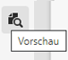
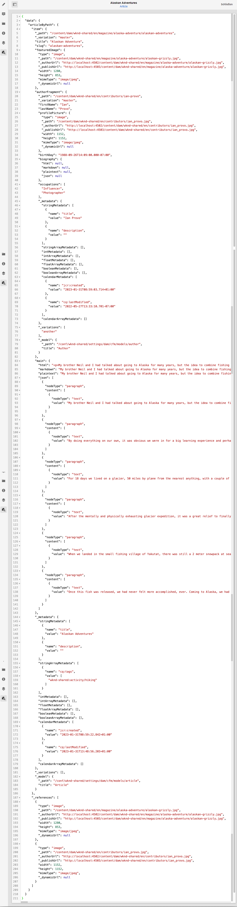

# Vorschau – JSON-Darstellung {#preview-json-representation}

Beim Entwickeln der Modelle für Inhaltsfragmente als Teil Ihrer AEM Headless-Implementierung sollten Sie ggf. eine JSON-Beispielausgabe für ein Inhaltsfragment auf der Grundlage eines Modells anzeigen. So erhalten Sie beispielsweise eine Vorstellung davon, wie die endgültige Ausgabe aussehen wird. Dies könnte bei der Validierung der Modell-JSON-Struktur hilfreich sein, ggf. mit standardmäßigen Beispielinhalten pro Datentyp.

>[!NOTE]
>
>Inhaltsfragmente sind eine Sites-Eigenschaft, werden jedoch als **Assets** gespeichert.
>
>Es gibt zwei Editoren für die Erstellung von Inhaltsfragmenten. Auch wenn die grundlegende Funktionalität gleich ist, gibt es einige Unterschiede. In diesem Abschnitt wird der ursprüngliche Editor behandelt. Der Zugriff auf diesen erfolgt hauptsächlich über die **Assets**-Konsole. Weitere Informationen zum neuen Editor (der Zugriff erfolgt hauptsächlich über die **Inhaltsfragmentkonsole**) finden Sie in der Sites-Dokumentation [Inhaltsfragmente – Authoring](/help/sites-cloud/administering/content-fragments/authoring.md).

Verwendung des **Vorschau**-Symbols:

Sie können die JSON-Repräsentation des aktuellen Fragments anzeigen. Zum Beispiel:

<!--
**Copy URL** lets you copy to clipboard the URL for either author or publish.
-->