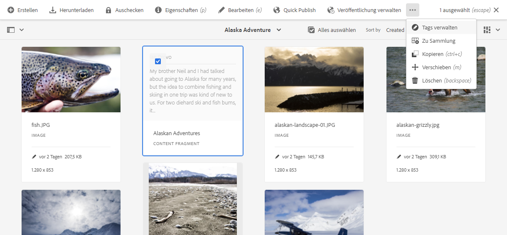

# Verwalten von Inhaltsfragmenten {#managing-content-fragments}

Erfahren Sie, wie Sie mit der Assets-Konsole Ihre AEM-Inhaltsfragmente verwalten können, entweder als Grundlage für Ihre Headless-Inhalte oder für die Erstellung von Seiten.

Nachdem Sie Ihre [Inhaltsfragmentmodelle](#creating-a-content-model) definiert haben, können Sie diese verwenden, um [Ihre Inhaltsfragmente](#creating-a-content-fragment) zu erstellen.

Der [Inhaltsfragment-Editor](#opening-the-fragment-editor) bietet verschiedene [Modi](#modes-in-the-content-fragment-editor), die Folgendes ermöglichen:

* [Bearbeiten der Inhalte](#editing-the-content-of-your-fragment) und [Verwalten von Varianten](#creating-and-managing-variations-within-your-fragment)
* [Hinzufügen von Anmerkungen zu Fragmenten](/help/assets/content-fragments/content-fragments-variations.md#annotating-a-content-fragment)
* [Verknüpfen von Inhalten mit Ihrem Fragment](#associating-content-with-your-fragment)
* [Konfigurieren der Metadaten](#viewing-and-editing-the-metadata-properties-of-your-fragment)
* [Strukturbaum anzeigen](/help/assets/content-fragments/content-fragments-structure-tree.md)
* [Anzeigen der JSON-Repräsentation in der Vorschau](/help/assets/content-fragments/content-fragments-json-preview.md)

>[!NOTE]
>
>Inhaltsfragmente können in folgenden Fällen verwendet werden:
>
>* Beim Erstellung von Seiten. Siehe [Seitenbearbeitung mit Inhaltsfragmenten](/help/sites-cloud/authoring/fragments/content-fragments.md).
>* Für [Headless-Bereitstellung mithilfe von Inhaltsfragmenten mit GraphQL](/help/assets/content-fragments/content-fragments-graphql.md).

>[!NOTE]
>
>Inhaltsfragmente sind eine Sites-Eigenschaft, werden jedoch als **Assets** gespeichert.
>
>Sie werden jetzt hauptsächlich mit der **[Inhaltsfragmentkonsole](/help/sites-cloud/administering/content-fragments/managing.md#content-fragments-console)** verwaltet, können jedoch weiterhin über die **Assets-Konsole** verwaltet werden. In diesem Abschnitt wird die Verwaltung über die **Assets**-Konsole beschrieben.
>
>Es gibt zwei Editoren für die Erstellung von Inhaltsfragmenten. Auch wenn die grundlegende Funktionalität gleich ist, gibt es einige Unterschiede. In diesem Abschnitt wird der ursprüngliche Editor behandelt. Der Zugriff auf diesen erfolgt hauptsächlich über die **Assets**-Konsole. Weitere Informationen zum neuen Editor (der Zugriff erfolgt hauptsächlich über die **Inhaltsfragmentkonsole**) finden Sie in der Sites-Dokumentation [Inhaltsfragmente – Authoring](/help/sites-cloud/administering/content-fragments/authoring.md). Beide Editoren verfügen in der oberen Symbolleiste über einen Umschalter, um einen Schnellzugriff auf den jeweils anderen Editor zu ermöglichen.

## Erstellen von Inhaltsfragmenten {#creating-content-fragments}

### Erstellen von Inhaltsmodellen {#creating-a-content-model}

[Inhaltsfragmentmodelle](/help/assets/content-fragments/content-fragments-models.md) können vor dem Erstellen von Inhaltsfragmenten mit strukturiertem Inhalt aktiviert und erstellt werden.

### Erstellen eines Inhaltsfragments {#creating-a-content-fragment}

Die Methode zum Erstellen eines Inhaltsfragments ist folgende:

1. Navigieren Sie zum Ordner **Assets**, in dem Sie das Fragment erstellen möchten.
1. Wählen Sie **Erstellen** und danach **Inhaltsfragment** aus, um den Assistenten zu öffnen.
1. Im ersten Schritt des Assistenten müssen Sie die Grundlage des neuen Fragments angeben.

   * [Modell](/help/assets/content-fragments/content-fragments-models.md) – wird verwendet, um ein Fragment zu erstellen, für das strukturierte Inhalte erforderlich sind; beispielsweise das **Adventure**-Modell

      * Alle verfügbaren Modelle werden angezeigt.

   Wählen Sie **Weiter** aus, wenn Sie Ihre Auswahl getroffen haben.

   

1. Geben Sie im Schritt **Eigenschaften** Folgendes an:

   * **Allgemein**

      * **Titel**

        Der Titel des Fragments.

        Obligatorisch.

      * **Beschreibung**

      * **Tags**

   * **Erweitert**

      * **Name**

        Der Name, der für die URL verwendet wird.

        Obligatorisch. Wird automatisch aus dem Titel abgeleitet, kann jedoch aktualisiert werden.

1. Wählen Sie **Erstellen** aus, um den Vorgang abzuschließen, und **öffnen** Sie das Fragment zur Bearbeitung oder wechseln Sie über **Fertig** wieder zur Konsole.

   >[!NOTE]
   >Im **Listenmodus** der Konsole können Sie die **Anzeigeeinstellungen** aktualisieren, um die Spalte **Inhaltsfragmentmodell** zu aktivieren.

## Aktionen für ein Inhaltsfragment in der Assets-Konsole {#actions-for-a-content-fragment-assets-console}

In der **Assets**-Konsole ist eine Reihe von Aktionen für Ihre Inhaltsfragmente verfügbar, und zwar entweder:

* In der Symbolleiste: Wenn Sie Ihr Fragment ausgewählt haben, sind alle passenden Aktionen verfügbar.
* Als [Schnellzugriffe](/help/sites-cloud/authoring/basic-handling.md#quick-actions): Eine Untergruppe von Aktionen, die für die einzelnen Fragmentkarten verfügbar sind.

Wählen Sie das Fragment aus, um die Symbolleiste mit entsprechenden Aktionen anzuzeigen:

* **Assets erneut verarbeiten**
* **Erstellen**
* **Download**

   * Speichern Sie das Fragment als ZIP-Datei. Sie können festlegen, ob die betreffenden Elemente, Varianten und Metadaten enthalten sein sollen.

* **Checkout**
* **Eigenschaften**

   * Ermöglicht es Ihnen, die Metadaten des Fragments anzuzeigen oder zu bearbeiten, oder beides.

* **Bearbeiten**

   * Ermöglicht das [Öffnen des Fragments zur Bearbeitung des Inhalts](/help/assets/content-fragments/content-fragments-variations.md) zusammen mit seinen Elementen, Variationen, zugehörigen Inhalten und Metadaten.

* **Quick Publish**
* **Veröffentlichung verwalten**
* **Tags verwalten**
* **Zu Sammlung**
* **Kopieren** (und **einfügen**)
* **Verschieben**
* **Löschen**

>[!NOTE]
>
>Viele sind [Standardaktionen für Assets](/help/assets/manage-digital-assets.md) bzw. das [AEM-Desktop-Programm](https://helpx.adobe.com/de/experience-manager/desktop-app/aem-desktop-app.html).

## Öffnen des Fragmenteditors {#opening-the-fragment-editor}

So öffnen Sie ein Fragment zur Bearbeitung:

>[!CAUTION]
>
>Um ein Inhaltsfragment zu bearbeiten, benötigen Sie [die entsprechenden Berechtigungen](/help/implementing/developing/extending/content-fragments-customizing.md#asset-permissions). Wenden Sie sich an Ihre Systemadmins, falls Probleme auftreten.

1. Navigieren Sie in der **Assets**-Konsole zum Speicherort des gewünschten Inhaltsfragments.
1. Öffnen Sie das Fragment zur Bearbeitung. Befolgen Sie dazu einen der folgenden Schritte:

   * Klicken/tippen Sie auf das Fragment oder den Fragment-Link (abhängig von der Konsolenansicht).
   * Wählen Sie das Fragment und anschließend in der Symbolleiste die Option **Bearbeiten** aus.

1. Der Fragmenteditor wird geöffnet. Nehmen Sie die gewünschten Änderungen vor:

   

1. Nachdem Sie Änderungen vorgenommen haben, verwenden Sie nach Bedarf die Optionen **Speichern**, **Speichern und schließen** oder **Schließen**.

   >[!NOTE]
   >
   >**Speichern und schließen** ist über die Dropdown-Liste **Speichern** verfügbar.

   >[!NOTE]
   >
   >Sowohl **Speichern und schließen** als auch **Schließen** beenden den Editor – siehe [Speichern, Schließen und Versionen](#save-close-and-versions) für ausführliche Informationen zur Funktionsweise beider Optionen für Inhaltsfragmente.

## Modi und Aktionen im Inhaltsfragment-Editor {#modes-actions-content-fragment-editor}

Im Inhaltsfragment-Editor stehen verschiedene Modi und Aktionen zur Verfügung.

### Modi im Inhaltsfragment-Editor {#modes-in-the-content-fragment-editor}

Navigieren Sie mit den Symbolen im seitlichen Bedienfeld durch die vier Modi:

* Varianten: [Bearbeiten des Inhalts](#editing-the-content-of-your-fragment) und [Verwalten Ihrer Varianten](#creating-and-managing-variations-within-your-fragment)

* [Anmerkungen](/help/assets/content-fragments/content-fragments-variations.md#annotating-a-content-fragment)
* [Zugehörige Inhalte](#associating-content-with-your-fragment)
* [Metadaten](#viewing-and-editing-the-metadata-properties-of-your-fragment)
* [Strukturbaum](/help/assets/content-fragments/content-fragments-structure-tree.md)
* [Vorschau](/help/assets/content-fragments/content-fragments-json-preview.md)

### Symbolleisten-Aktionen im Inhaltsfragment-Editor {#toolbar-actions-in-the-content-fragment-editor}

Einige Funktionen in der oberen Symbolleiste stehen in mehreren Modi zur Verfügung:

* Es wird eine Benachrichtigung angezeigt, wenn das Fragment bereits auf einer Inhaltsseite referenziert wird. Sie können die Nachricht **schließen**

* Das seitliche Bedienfeld kann über das Symbol **Seitliches Bedienfeld ein/aus** ein- oder ausgeblendet werden.

* Unter dem Fragmentnamen sehen Sie den Namen des [Inhaltsfragmentmodells](/help/assets/content-fragments/content-fragments-models.md), das zum Erstellen des aktuellen Fragments verwendet wurde:

   * Der Name ist auch ein Link, der den Modell-Editor öffnet.

* Zeigen Sie den Status des Fragments an, zum Beispiel Informationen zum Zeitpunkt der Erstellung, Änderung oder Veröffentlichung. Der Status ist auch farbcodiert:

   * **Neu**: grau
   * **Entwurf**: blau
   * **Veröffentlicht**: grün
   * **Geändert**: orange
   * **Deaktiviert**: rot

* Mit einer Schaltfläche können Sie den **neuen Editor testen**, indem Sie den *neuen* [Inhaltsfragmenteditor](/help/sites-cloud/administering/content-fragments/authoring.md) direkt öffnen. Auf ihn können Sie über die [Inhaltsfragmentkonsole](/help/sites-cloud/administering/content-fragments/managing.md#content-fragments-console) zugreifen.

  >[!WARNING]
  >
  >Der neue Editor wird auf derselben Registerkarte geöffnet. Es wird nicht empfohlen, beide Editoren gleichzeitig geöffnet zu haben.

* Über **Speichern** haben Sie Zugriff auf die Option **Speichern und schließen**.

* Über die drei Punkte (**...**) können Sie auf weitere Aktionen zugreifen:
   * **Seitenverweise aktualisieren**
      * Damit werden alle Seitenverweise aktualisiert.
   * **[Quick Publish](#publishing-and-referencing-a-fragment)**
   * **[Veröffentlichung verwalten](#publishing-and-referencing-a-fragment)**

<!--
This updates any page references and ensures that the Dispatcher is flushed as required. -->

## Speichern, Schließen und Versionen {#save-close-and-versions}

>[!NOTE]
>
>Versionen können [über die Zeitleiste auch erstellt, verglichen und zurückgesetzt werden](/help/assets/content-fragments/content-fragments-managing.md#timeline-for-content-fragments).

Der Editor bietet mehrere Optionen:

* **Speichern** und **Speichern und schließen**

   * Mit **Speichern** werden die aktuellen Änderungen gespeichert und der Editor bleibt geöffnet.
   * Mit **Speichern und schließen** werden die aktuellen Änderungen gespeichert und der Editor wird beendet.

  >[!CAUTION]
  >
  >Um ein Inhaltsfragment zu bearbeiten, benötigen Sie [die entsprechenden Berechtigungen](/help/implementing/developing/extending/content-fragments-customizing.md#asset-permissions). Wenden Sie sich an Ihre Systemadmins, falls Probleme auftreten.

  >[!NOTE]
  >
  >Es ist möglich, im Fragment-Editor zu bleiben und vor dem Speichern Änderungen vorzunehmen.

  >[!CAUTION]
  >
  >Mit der Aktion werden nicht nur einfach Ihre Änderungen gespeichert, sondern auch alle Verweise aktualisiert und sichergestellt, dass der Dispatcher nach Bedarf geleert wird. Es kann einige Zeit dauern, bis diese Änderungen verarbeitet werden. Aus diesem Grund kann die Leistung eines umfassenden, komplexen oder stark belasteten Systems beeinträchtigt werden.
  >
  >Beachten Sie dies, wenn Sie die Option **Speichern und schließen** auswählen und den Fragment-Editor danach schnell erneut aufrufen, um weitere Änderungen vorzunehmen und zu speichern.

* **Schließen**

  Damit wird der Editor beendet, ohne die neuesten Änderungen zu speichern (also die Änderungen seit dem letzten **Speichern**).

Beim Bearbeiten Ihres Inhaltsfragments erstellt AEM automatisch Versionen, damit ältere Inhalte werden können, falls Sie Ihre Änderungen verwerfen möchten (verwenden Sie dazu die Option **Schließen** ohne zu Speichern):

1. Wenn ein Inhaltsfragment zur Bearbeitung geöffnet ist, überprüft AEM, ob ein Cookie-basiertes Token vorliegt, das angibt, ob eine *Bearbeitungssitzung* vorhanden ist:

   1. Wenn das Token gefunden wird, wird das Fragment als Teil der vorhandenen Bearbeitungssitzung betrachtet.
   2. Wenn das Token *nicht* verfügbar ist und die Benutzerin bzw. der Benutzer mit der Inhaltsbearbeitung beginnt, wird eine Version erstellt, und ein Token für diese neue Bearbeitungssitzung wird an den Client gesendet, wo es in einem Cookie gespeichert wird.

2. Während einer *aktiven* Bearbeitungssitzung wird der bearbeitete Inhalt automatisch alle 600 Sekunden gespeichert (Standardeinstellung).

   >[!NOTE]
   >
   >Das Intervall für das automatische Speichern kann mit dem Mechanismus `/conf` konfiguriert werden.
   >
   >Den Standardwert finden Sie unter:
   >  `/libs/settings/dam/cfm/jcr:content/autoSaveInterval`

3. Wenn Anwender die Bearbeitung abbrechen, wird die am Anfang der Bearbeitungssitzung erstellte Version wiederhergestellt, und das Token wird zum Beenden der Bearbeitungssitzung entfernt.
4. Werden die Bearbeitungen über die Option **Speichern** gespeichert, werden die aktualisierten Elemente/Varianten beibehalten und das Token wird zum Beenden der Bearbeitungssitzung entfernt.

## Bearbeiten des Inhalts Ihres Fragments {#editing-the-content-of-your-fragment}

Wenn Sie das Fragment geöffnet haben, können Sie die Registerkarte [Varianten](/help/assets/content-fragments/content-fragments-variations.md) verwenden, um Ihren Inhalt zu erstellen.

## Erstellen und Verwalten von Varianten innerhalb Ihres Fragments {#creating-and-managing-variations-within-your-fragment}

Sobald Sie den primären Inhalt erstellt haben, können Sie [Varianten](/help/assets/content-fragments/content-fragments-variations.md) dieses Inhalts erstellen und verwalten.

## Verknüpfen von Inhalt mit Ihrem Fragment {#associating-content-with-your-fragment}

Sie können auch Inhalte mit einem Fragment [verknüpfen](/help/assets/content-fragments/content-fragments-assoc-content.md). So entsteht eine Verbindung, mit der Assets (d. h. Bilder) für ein Fragment verwendet werden können (falls gewünscht), wenn sie zu einer Inhaltsseite hinzugefügt werden.

## Anzeigen und Bearbeiten von Metadaten (Eigenschaften) des Fragments {#viewing-and-editing-the-metadata-properties-of-your-fragment}

Sie können die Eigenschaften eines Fragments über die Registerkarte [Metadaten](/help/assets/content-fragments/content-fragments-metadata.md) anzeigen und bearbeiten.

## Zeitleiste für Inhaltsfragmente {#timeline-for-content-fragments}

Neben den Standardoptionen enthält die [Zeitleiste](/help/assets/manage-digital-assets.md#timeline) Informationen und Aktionen für Inhaltsfragmente.

* Anzeigen von Informationen zu Versionen, Kommentaren und Anmerkungen
* Aktionen für Versionen

   * **[Auf diese Version zurück](#reverting-to-a-version)** (ein vorhandenes Fragment und eine bestimmte Version auswählen)

   * **[Mit aktueller Version vergleichen](#comparing-fragment-versions)** (ein vorhandenes Fragment und eine bestimmte Version auswählen)

   * **Beschriftung** und/oder **Kommentar** hinzufügen (ein vorhandenes Fragment und eine bestimmte Version auswählen)

   * **Als Version speichern** (ein vorhandenes Fragment und dann den Pfeil nach oben am unteren Rand der Zeitleiste auswählen)

* Aktionen für Anmerkungen

   * **Löschen**

>[!NOTE]
>
>Kommentare sind:
>
>* Standardfunktionen für alle Assets
>* In der Zeitleiste erstellt worden
>* mit dem Fragment-Asset verbunden
>
>Anmerkungen (für Inhaltsfragmente) sind:
>
>* Im Fragmenteditor eingegeben worden
>* spezifisch für ein ausgewähltes Textsegment innerhalb des Fragments
>

Zum Beispiel:

## Vergleichen von Fragment-Versionen {#comparing-fragment-versions}

Die Aktion **Mit aktueller Version vergleichen** ist in der [Zeitleiste](/help/assets/content-fragments/content-fragments-managing.md#timeline-for-content-fragments) verfügbar, sobald Sie eine bestimmte Version ausgewählt haben.

Dadurch wird Folgendes geöffnet:

* die **aktuelle** (neueste) Version (links)

* die ausgewählte Version **v&lt;*x.y*>** (rechts)

Sie werden nebeneinander angezeigt, wobei:

* Unterschiede hervorgehoben werden:

   * Gelöschter Text: Rot
   * Eingefügter Text: Grün
   * Ersetzter Text: Blau

* Über das Vollbildsymbol können Sie jede Version separat öffnen und dann wieder zur parallelen Ansicht wechseln.
* Sie die jeweilige Version **wiederherstellen** können.
* Sie über **Fertig** zur Konsole zurückkehren.

>[!NOTE]
>
>Sie können den Fragmentinhalt nicht bearbeiten, während Sie Fragmente vergleichen.

## Wiederherstellen einer früheren Version  {#reverting-to-a-version}

Sie können eine frühere Version Ihres Fragments wiederherstellen.

* Direkt über die [Zeitleiste](/help/assets/content-fragments/content-fragments-managing.md#timeline-for-content-fragments).

  Wählen Sie die gewünschte Version und dann die Aktion **Auf diese Version zurück** aus.

* Beim [Vergleichen einer Version mit der aktuellen Version](/help/assets/content-fragments/content-fragments-managing.md#comparing-fragment-versions) können Sie die ausgewählte Version **wiederherstellen**.

## Veröffentlichen und Referenzieren von Fragmenten {#publishing-and-referencing-a-fragment}

>[!CAUTION]
>
>Wenn das Fragment auf einem Modell basiert, sollten Sie sicherstellen, dass das [Modell veröffentlicht wurde](/help/assets/content-fragments/content-fragments-models.md#publishing-a-content-fragment-model).
>
>Wenn Sie Inhaltsfragmente veröffentlichen, deren Modell noch nicht veröffentlicht wurde, wird dies in der Auswahlliste angezeigt und das Modell wird mit dem Fragment veröffentlicht.

Inhaltsfragmente müssen veröffentlicht werden, um in der Publishing-Umgebung genutzt werden zu können. Dies geschieht mithilfe der standardmäßigen Assets-Funktionen:

* [Quick Publish](/help/assets/manage-publication.md#quick-publish)
* [Veröffentlichung verwalten](/help/assets/manage-publication.md#manage-publication)

Der Zugriff kann auf folgende Weisen erfolgen:

* Nach der Erstellung; Verwenden von [Aktionen, die in der Assets-Konsole verfügbar sind](#actions-for-a-content-fragment-assets-console).
* Im [Inhaltsfragment-Editor](#toolbar-actions-in-the-content-fragment-editor)

Wenn Sie [eine Seite veröffentlichen, in der das Fragment verwendet wird](/help/sites-cloud/authoring/fragments/content-fragments.md#publishing), wird das Fragment außerdem in den Seitenverweisen aufgeführt.

>[!CAUTION]
>
>Nachdem ein Fragment veröffentlicht und/oder referenziert wurde, zeigt AEM eine Warnmeldung an, wenn ein Autor das Fragment erneut zur Bearbeitung öffnet. Dies dient als Hinweis darauf, dass am Fragment vorgenommene Änderungen sich auch auf die referenzierten Seiten auswirken.

## Löschen von Fragmenten {#deleting-a-fragment}

So löschen Sie ein Fragment:

1. Navigieren Sie in der **Assets**-Konsole zum Speicherort des Inhaltsfragments.
2. Wählen Sie das Fragment aus.

   >[!NOTE]
   >
   >Die **Löschaktion** ist nicht als Schnellzugriff verfügbar.

3. Wählen Sie **Löschen** in der Symbolleiste aus.
4. Bestätigen Sie die **Löschaktion**.

   >[!CAUTION]
   >
   >Wenn das Fragment bereits in einer Seite referenziert wird, werden Sie in einer Warnung zur Bestätigung des **erzwungenen Löschens** aufgefordert. Das Fragment wird zusammen mit seiner Inhaltsfragmentkomponente aus allen Inhaltsseiten gelöscht.
