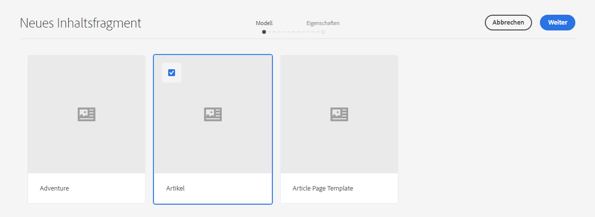
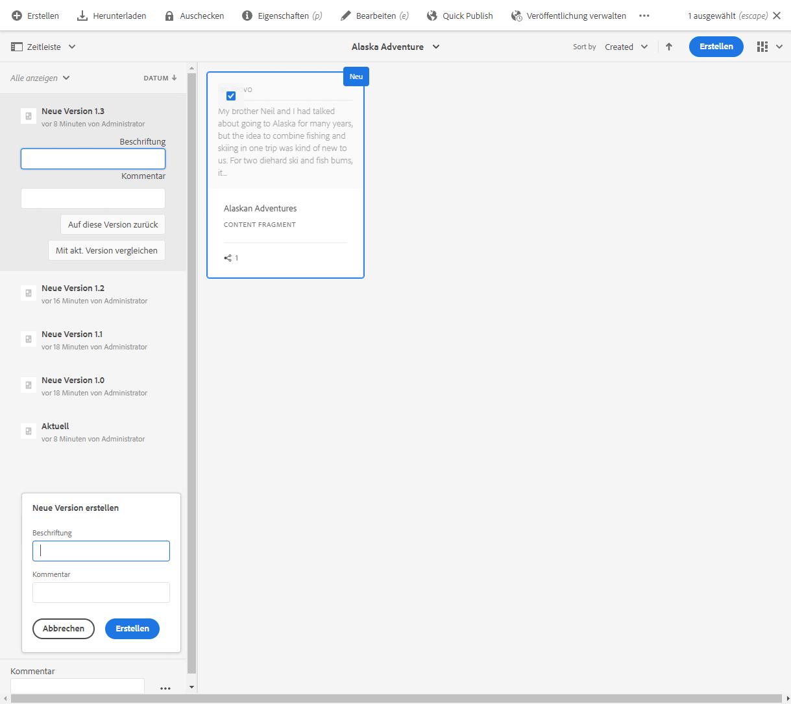

# Verwalten von Inhaltsfragmenten {#managing-content-fragments}

Erfahren Sie, wie Sie mit der Assets-Konsole Ihre AEM Inhaltsfragmente verwalten können, die die Grundlage für Ihre kostenlosen Inhalte bilden.

Nachdem Sie die [Inhaltsfragmentmodelle](#creating-a-content-model) definiert haben, können Sie diese verwenden, um [Ihre Inhaltsfragmente](#creating-a-content-fragment) zu erstellen.

Der [Inhaltsfragment-Editor](#opening-the-fragment-editor) bietet verschiedene [Modi](#modes-in-the-content-fragment-editor), um Ihnen Folgendes zu ermöglichen:

* [Bearbeiten des ](#editing-the-content-of-your-fragment) Inhalts und  [Verwalten von Variationen](#creating-and-managing-variations-within-your-fragment)
* [Fragmente kommentieren](/help/assets/content-fragments/content-fragments-variations.md#annotating-a-content-fragment)
* [Verknüpfen von Inhalten mit Ihrem Fragment](#associating-content-with-your-fragment)
* [Konfigurieren der Metadaten](#viewing-and-editing-the-metadata-properties-of-your-fragment)
* [Ansicht der Struktur](/help/assets/content-fragments/content-fragments-structure-tree.md)
* [Vorschau der JSON-Vertretung](/help/assets/content-fragments/content-fragments-json-preview.md)

>[!NOTE]
>
>Inhaltsfragmente können in folgenden Fällen verwendet werden:
>
>* Beim Erstellung von Seiten. Siehe [Seitenbearbeitung mit Inhaltsfragmenten](/help/sites-cloud/authoring/fundamentals/content-fragments.md).
>* Für [Headless-Bereitstellung mithilfe von Inhaltsfragmenten mit GraphQL](/help/assets/content-fragments/content-fragments-graphql.md).

>[!NOTE]
>
>Inhaltsfragmente werden als **Assets** gespeichert und daher hauptsächlich über die **Assets-Konsole** verwaltet.

## Erstellen von Inhaltsfragmenten  {#creating-content-fragments}

### Erstellen von Inhaltsmodellen {#creating-a-content-model}

[Inhaltsfragmentmodelle](/help/assets/content-fragments/content-fragments-models.md) können vor dem Erstellen von Inhaltsfragmenten mit strukturiertem Inhalt aktiviert und erstellt werden.

### Erstellen eines Inhaltsfragments {#creating-a-content-fragment}

Die Methode zum Erstellen eines Inhaltsfragments ist folgende:

1. Navigieren Sie zum Ordner **Assets**, in dem Sie das Fragment erstellen möchten.
1. Wählen Sie **Erstellen** und danach **Inhaltsfragment** aus, um den Assistenten zu öffnen.
1. Im ersten Schritt des Assistenten müssen Sie die Grundlage des neuen Fragments angeben.

   * [Modell](/help/assets/content-fragments/content-fragments-models.md) – wird verwendet, um ein Fragment zu erstellen, für das strukturierte Inhalte erforderlich sind; beispielsweise das **Abenteuer**-Modell

      * Alle verfügbaren Modelle werden angezeigt.

   Wählen Sie **Weiter** aus, wenn Sie Ihre Auswahl getroffen haben.

   

1. Geben Sie im Schritt **Eigenschaften** Folgendes an:

   * **Allgemein**

      * **Titel**

         Der Titel des Fragments.

         Obligatorisch.

      * **Beschreibung**

      * **Tags**
   * **Erweitert**

      * **Name**

         Der Name, der für die URL verwendet wird.

         Obligatorisch. Wird automatisch aus dem Titel abgeleitet, kann jedoch aktualisiert werden.

1. Wählen Sie **Erstellen** aus, um den Vorgang abzuschließen, und **öffnen** Sie das Fragment zur Bearbeitung oder wechseln Sie über **Fertig** wieder zur Konsole.

   >[!NOTE]
   >Im **Listenmodus** der Konsole können Sie die **Anzeigeeinstellungen** aktualisieren, um die Spalte **Inhaltsfragmentmodell** zu aktivieren.

## Aktionen für ein Inhaltsfragment in der Asset-Konsole {#actions-for-a-content-fragment-assets-console}

In der **Assets-Konsole** können Sie eine Reihe von Aktionen für Ihre Inhaltsfragmente vornehmen, die Sie wie folgt erreichen:

* Über die Symbolleiste – nachdem Sie das Fragment ausgewählt haben, sind alle geeigneten Aktionen verfügbar.
* Als [Schnellaktionen](/help/sites-cloud/authoring/getting-started/basic-handling.md#quick-actions) – ein Teil der Aktionen, die für die individuellen Fragmentkarten verfügbar sind.

Wählen Sie das Fragment aus, um die Symbolleiste mit entsprechenden Aktionen anzuzeigen:

* **Assets erneut verarbeiten**
* **Erstellen**
* **Download**

   * Speichern Sie das Fragment als ZIP-Datei. Sie können festlegen, ob die betreffenden Elemente, Varianten und Metadaten enthalten sein sollen.

* **Checkout**
* **Eigenschaften**

   * Ermöglicht das Anzeigen bzw. Bearbeiten der Metadaten des Fragments.

* **Bearbeiten**

   * Hier können Sie [das Fragment zum Bearbeiten des Inhalts](/help/assets/content-fragments/content-fragments-variations.md) zusammen mit seinen Elementen, Varianten, verknüpften Inhalten und Metadaten öffnen.

* **Quick Publish**
* **Veröffentlichung verwalten**
* **Tags verwalten**
* **Zu Sammlung**
* **Kopieren** (und **einfügen**)
* **Verschieben**
* **Löschen**

>[!NOTE]
>
>Viele sind [Standardaktionen für Assets](/help/assets/manage-digital-assets.md) bzw. das [AEM-Desktop-Programm](https://helpx.adobe.com/de/experience-manager/desktop-app/aem-desktop-app.html).

## Öffnen des Fragmenteditors {#opening-the-fragment-editor}

So öffnen Sie ein Fragment zur Bearbeitung:

>[!CAUTION]
>
>Um ein Inhaltsfragment zu bearbeiten, benötigen Sie [die entsprechenden Berechtigungen](/help/implementing/developing/extending/content-fragments-customizing.md#asset-permissions). Wenden Sie sich an Ihren Systemadministrator, falls Probleme auftreten.

>[!CAUTION]
>
>Um ein Inhaltsfragment zu bearbeiten, benötigen Sie die entsprechenden Berechtigungen. Wenden Sie sich an Ihren Systemadministrator, falls Probleme auftreten.

1. Navigieren Sie in der Konsole **Assets** zum Speicherort des gewünschten Inhaltsfragments.
1. Öffnen Sie das Fragment zur Bearbeitung. Befolgen Sie dazu einen der folgenden Schritte:

   * Klicken/tippen Sie auf das Fragment oder den Fragment-Link (abhängig von der Konsolenansicht).
   * Wählen Sie das Fragment und anschließend in der Symbolleiste die Option **Bearbeiten** aus.

1. Der Fragmenteditor wird geöffnet. Nehmen Sie die gewünschten Änderungen vor:

   

1. Nachdem Sie Änderungen vorgenommen haben, verwenden Sie nach Bedarf **Speichern**, **Speichern und schließen** oder **Schließen**.

   >[!NOTE]
   >
   >**Speichern und** Schließen über den  **** Savedropdown verfügbar.

   >[!NOTE]
   >
   >Sowohl **Save &amp; Close** als auch **Close** beenden den Editor - siehe [Save, Close and Versions](#save-close-and-versions), um ausführliche Informationen darüber zu erhalten, wie die verschiedenen Optionen für Inhaltsfragmente funktionieren.

## Modi und Aktionen im Inhaltsfragment-Editor {#modes-actions-content-fragment-editor}

Im Inhaltsfragment-Editor stehen verschiedene Modi und Aktionen zur Verfügung.

### Modi im Inhaltsfragment-Editor {#modes-in-the-content-fragment-editor}

Navigieren Sie mit den Symbolen im seitlichen Bedienfeld durch die vier Modi:

* Varianten: [Bearbeiten des Inhalts](#editing-the-content-of-your-fragment) und [Verwalten Ihrer Varianten](#creating-and-managing-variations-within-your-fragment)

* [Anmerkungen](/help/assets/content-fragments/content-fragments-variations.md#annotating-a-content-fragment)
* [Zugehörige Inhalte](#associating-content-with-your-fragment)
* [Metadaten](#viewing-and-editing-the-metadata-properties-of-your-fragment)
* [Strukturbaum](/help/assets/content-fragments/content-fragments-structure-tree.md)
* [Vorschau](/help/assets/content-fragments/content-fragments-json-preview.md)

### Symbolleistenaktionen im Inhaltsfragment-Editor {#toolbar-actions-in-the-content-fragment-editor}

Einige Funktionen in der oberen Symbolleiste stehen in mehreren Modi zur Verfügung:

* Es wird eine Benachrichtigung angezeigt, wenn das Fragment bereits auf einer Inhaltsseite referenziert wird. Sie können die Nachricht **Schließen** schließen.

* Das seitliche Bedienfeld kann über das Symbol **Seitliches Bedienfeld ein/aus** ein- oder ausgeblendet werden.

* Unter dem Fragmentnamen sehen Sie den Namen des [Inhaltsfragmentmodells](/help/assets/content-fragments/content-fragments-models.md), das zum Erstellen des aktuellen Fragments verwendet wurde:

   * Der Name ist auch ein Link, über den der Modell-Editor geöffnet wird.

* Zeigen Sie den Status des Fragments an, zum Beispiel Informationen zum Zeitpunkt der Erstellung, Änderung oder Veröffentlichung. Der Status ist auch farbcodiert:

   * **Neu**: grau
   * **Entwurf**: blau
   * **Veröffentlicht**: green
   * **Geändert**: orange
   * **Deaktiviert**: red

* **Mit** Save haben Sie Zugriff auf die Option  **Speichern und** Schließen.

* Die drei Punkte (**...**)-Dropdown bietet Zugriff auf zusätzliche Aktionen:
   * **Aktualisieren von Seitenverweisen**
      * Dadurch werden alle Seitenverweise aktualisiert.
   * **[Quick Publish](#publishing-and-referencing-a-fragment)**
   * **[Veröffentlichung verwalten](#publishing-and-referencing-a-fragment)**

<!--
This updates any page references and ensures that the Dispatcher is flushed as required. -->

## Speichern, Schließen und Versionen {#save-close-and-versions}

>[!NOTE]
>
>Versionen können [über die Zeitleiste auch erstellt, verglichen und zurückgesetzt werden](/help/assets/content-fragments/content-fragments-managing.md#timeline-for-content-fragments).

Der Editor verfügt über verschiedene Optionen:

* **Speichern** und  **Speichern &amp; Schließen**

   * **Speichern** Sie die neuesten Änderungen und bleiben Sie im Editor.
   * **Speichern und** schließen Sie die neuesten Änderungen und schließen Sie den Editor.

   >[!CAUTION]
   >
   >Um ein Inhaltsfragment zu bearbeiten, benötigen Sie [die entsprechenden Berechtigungen](/help/implementing/developing/extending/content-fragments-customizing.md#asset-permissions). Wenden Sie sich an Ihren Systemadministrator, falls Probleme auftreten.

   >[!NOTE]
   >
   >Es ist möglich, im Editor zu bleiben, eine Reihe von Änderungen vorzunehmen, bevor Sie speichern.

   >[!CAUTION]
   >
   >Neben dem einfachen Speichern der Änderungen werden bei den Aktionen auch alle Verweise aktualisiert und sichergestellt, dass der Dispatcher nach Bedarf geflaut wird. Es kann einige Zeit dauern, bis diese Änderungen verarbeitet werden. Aus diesem Grund kann die Leistung eines umfassenden/komplexen/stark belasteten Systems beeinträchtigt werden.
   >
   >Beachten Sie dies bei der Verwendung von **Speichern &amp; Schließen** und der schnellen erneuten Eingabe des Fragmenteditors, um weitere Änderungen vorzunehmen und zu speichern.

* **Schließen**

   Beendet den Editor, ohne die neuesten Änderungen zu speichern (d. h. seit dem letzten **Speichern**).

Beim Bearbeiten des Inhaltsfragments AEM automatisch Versionen erstellt, um sicherzustellen, dass vorherige Inhalte wiederhergestellt werden können, wenn Sie Ihre Änderungen abbrechen (ohne Speichern unter **Schließen** verwenden):

1. Wenn ein Inhaltsfragment zur Bearbeitung geöffnet ist, überprüft AEM, ob ein Cookie-basiertes Token vorliegt, das angibt, ob eine *Bearbeitungssitzung* vorhanden ist:

   1. Wird das entsprechende Token gefunden, gilt das Fragment als Teil der vorhandenen Bearbeitungssitzung.
   2. Wenn das Token *nicht* verfügbar ist und der Benutzer mit dem Bearbeiten von Inhalt beginnt, wird eine Version erstellt, und ein Token für diese neue Bearbeitungssitzung wird an den Client gesendet, wo er in einem Cookie gespeichert wird.

2. Während einer *aktiven* Bearbeitungssitzung wird der bearbeitete Inhalt automatisch alle 600 Sekunden gespeichert (Standardeinstellung).

   >[!NOTE]
   >
   >Das Intervall für das automatische Speichern kann mit dem Mechanismus `/conf` konfiguriert werden.
   >
   >Den Standardwert finden Sie unter:
   >  `/libs/settings/dam/cfm/jcr:content/autoSaveInterval`

3. Wenn der Benutzer die Bearbeitung abbricht, wird die am Beginn der Bearbeitungssitzung erstellte Version wiederhergestellt und das Token wird entfernt, um die Bearbeitungssitzung zu beenden.
4. Werden die Bearbeitungen über die Option **Speichern** gespeichert, werden die aktualisierten Elemente/Varianten beibehalten und das Token wird zum Beenden der Bearbeitungssitzung entfernt.

## Bearbeiten des Inhalts Ihres Fragments {#editing-the-content-of-your-fragment}

Wenn Sie das Fragment geöffnet haben, können Sie die Registerkarte [Varianten](/help/assets/content-fragments/content-fragments-variations.md) verwenden, um Ihren Inhalt zu erstellen.

## Erstellen und Verwalten von Varianten innerhalb Ihres Fragments   {#creating-and-managing-variations-within-your-fragment}

Sobald Sie den primären Inhalt erstellt haben, können Sie [Varianten](/help/assets/content-fragments/content-fragments-variations.md) dieses Inhalts erstellen und verwalten.

## Verknüpfen von Inhalt mit Ihrem Fragment   {#associating-content-with-your-fragment}

Sie können auch Inhalt mit einem Fragment [verknüpfen](/help/assets/content-fragments/content-fragments-assoc-content.md). So entsteht eine Verbindung, mit der Assets (d. h. Bilder) für ein Fragment verwendet werden können (falls gewünscht), wenn sie zu einer Inhaltsseite hinzugefügt werden.

## Anzeigen und Bearbeiten von Metadaten (Eigenschaften) des Fragments   {#viewing-and-editing-the-metadata-properties-of-your-fragment}

Sie können die Eigenschaften eines Fragments über die Registerkarte [Metadaten](/help/assets/content-fragments/content-fragments-metadata.md) anzeigen und bearbeiten.

## Zeitleiste für Inhaltsfragmente   {#timeline-for-content-fragments}

Neben den Standardoptionen enthält die [Zeitleiste](/help/assets/manage-digital-assets.md#timeline) Informationen und Aktionen für Inhaltsfragmente.

* Anzeigen von Informationen zu Versionen, Kommentaren und Anmerkungen
* Aktionen für Versionen

   * **[Auf diese Version zurück](#reverting-to-a-version)** (ein vorhandenes Fragment und eine bestimmte Version auswählen)

   * **[Mit aktueller Version vergleichen](#comparing-fragment-versions)** (ein vorhandenes Fragment und eine bestimmte Version auswählen)

   * **Beschriftung** und/oder **Kommentar** hinzufügen (ein vorhandenes Fragment und eine bestimmte Version auswählen)

   * **Als Version speichern** (ein vorhandenes Fragment und dann den Pfeil nach oben am unteren Rand der Zeitleiste auswählen)

* Aktionen für Anmerkungen

   * **Löschen**

>[!NOTE]
Kommentare sind:
* Standardfunktionen für alle Assets
* In der Zeitleiste erstellt worden
* Mit dem Fragment-Asset verbunden

Anmerkungen (für Inhaltsfragmente) sind:
* Im Fragmenteditor eingegeben worden
* Spezifisch für ein ausgewähltes Textsegment innerhalb des Fragments

Beispiel:

## Vergleichen von Fragment-Versionen {#comparing-fragment-versions}

Die Aktion **Mit aktueller Version vergleichen** ist in der [Zeitleiste](/help/assets/content-fragments/content-fragments-managing.md#timeline-for-content-fragments) verfügbar, sobald Sie eine bestimmte Version ausgewählt haben.

Folgendes wird geöffnet:

* die **aktuelle** (neueste) Version (links)

* die ausgewählte Version **v&lt;*x.y*>** (rechts)

Sie werden nebeneinander angezeigt, wo:

* Unterschiede werden hervorgehoben

   * Gelöschter Text: Rot
   * Eingefügter Text: Grün
   * Ersetzter Text: Blau

* Über das Vollbildsymbol können Sie jede Version separat öffnen. Wechseln Sie dann wieder zur parallelen Ansicht.
* Sie können die jeweilige Version **wiederherstellen**.
* Über **Fertig** kehren Sie zur Konsole zurück.

>[!NOTE]
Sie können den Fragmentinhalt nicht bearbeiten, während Sie Fragmente vergleichen.

## Wiederherstellen einer früheren Version {#reverting-to-a-version}

Sie können eine frühere Version wiederherstellen.

* Direkt über die [Zeitleiste](/help/assets/content-fragments/content-fragments-managing.md#timeline-for-content-fragments).

   Wählen Sie die gewünschte Version und dann die Aktion **Auf diese Version zurück** aus.

* Beim [Vergleichen einer Version mit der aktuellen Version](/help/assets/content-fragments/content-fragments-managing.md#comparing-fragment-versions) können Sie die ausgewählte Version **wiederherstellen**.

## Veröffentlichen und Referenzieren von Fragmenten {#publishing-and-referencing-a-fragment}

>[!CAUTION]
Wenn das Fragment auf einem Modell basiert, sollten Sie sicherstellen, dass das [Modell veröffentlicht wurde](/help/assets/content-fragments/content-fragments-models.md#publishing-a-content-fragment-model).
Wenn Sie Inhaltsfragmente veröffentlichen, deren Modell noch nicht veröffentlicht wurde, wird dies in der Auswahlliste angezeigt und das Modell wird mit dem Fragment veröffentlicht.

Inhaltsfragmente müssen zur Verwendung in der Umgebung &quot;Veröffentlichen&quot;veröffentlicht werden. Sie können folgendermaßen veröffentlicht werden:

* Nach der Erstellung; Verwenden von [Aktionen, die in der Assets-Konsole verfügbar sind](#actions-for-a-content-fragment-assets-console).
* Im [Inhaltsfragment-Editor](#toolbar-actions-in-the-content-fragment-editor)
* Wenn Sie [eine Seite veröffentlichen, in der das Fragment verwendet wird](/help/sites-cloud/authoring/fundamentals/content-fragments.md#publishing), wird das Fragment in den Seitenverweisen aufgeführt.

>[!CAUTION]
Nachdem ein Fragment veröffentlicht und/oder referenziert wurde, zeigt AEM eine Warnmeldung an, wenn ein Autor das Fragment erneut zur Bearbeitung öffnet. Dies dient als Hinweis darauf, dass am Fragment vorgenommene Änderungen sich auch auf die referenzierten Seiten auswirken.

## Löschen von Fragmenten {#deleting-a-fragment}

So löschen Sie ein Fragment:

1. Navigieren Sie in der Konsole **Assets** zum Speicherort des Inhaltsfragments.
2. Wählen Sie das Fragment aus.

   >[!NOTE]
   Die Aktion **Löschen** ist nicht als Schnellzugriff verfügbar.

3. Wählen Sie **Löschen** in der Symbolleiste aus.
4. Bestätigen Sie die **Löschaktion**.

   >[!CAUTION]
   Wenn das Fragment bereits in einer Seite referenziert wird, werden Sie in einer Warnung zur Bestätigung des **erzwungenen Löschens** aufgefordert. Das Fragment wird zusammen mit seiner Inhaltsfragmentkomponente aus allen Inhaltsseiten gelöscht.
