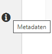
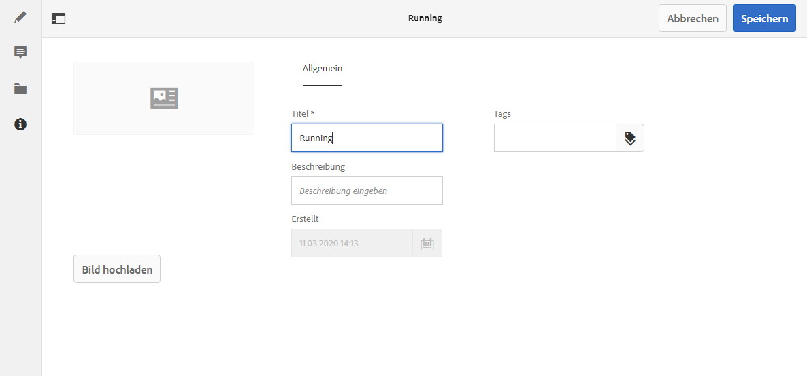

# Metadaten – Fragmenteigenschaften {#metadata-fragment-properties}

## Bearbeiten von Eigenschaften/Metadaten {#editing-properties-meta-data}

Sie können die Metadaten (Eigenschaften) für das Inhaltsfragment anzeigen und bearbeiten:

1. Navigieren Sie in der Konsole **Assets** zum Speicherort des Inhaltsfragments.
2. Führen Sie einen der folgenden Schritte durch:

   * Wählen Sie [**Eigenschaften anzeigen** aus, um das Dialogfeld zu öffnen](/help/assets/manage-digital-assets.md#editing-properties). Sobald es zur Anzeige geöffnet wurde, können Sie auch Bearbeitungen vornehmen.
   * Öffnen Sie das Inhaltsfragment zur Bearbeitung und wählen Sie dann **Metadaten** aus dem Seitenbedienfeld.

   

3. Auf der Registerkarte **Allgemein** können Sie die folgenden Optionen anzeigen oder bearbeiten:

   * Miniaturansicht, für die Sie ein **Bild hochladen** können
   * **Inhaltsfragmentmodell**, womit das zum Erstellen des aktuellen Fragments verwendete Modell angegeben wird
   * **Titel**
   * **Beschreibung**
   * **Tags**
   * Erstellt (nur Anzeige)
   
