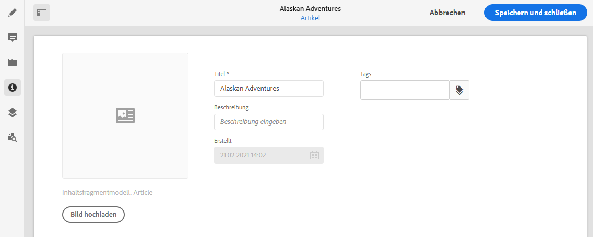

# Metadaten – Fragmenteigenschaften {#metadata-fragment-properties}

Erfahren Sie, wie Sie die Metadateneigenschaften für Inhaltsfragmente in AEM anzeigen und bearbeiten können, um Ihren Headless-Content anzupassen.

>[!NOTE]
>
>Inhaltsfragmente sind ein Sites-Feature, werden jedoch als **Assets** gespeichert.
>
>Es gibt zwei Editoren für die Erstellung von Inhaltsfragmenten. In diesem Abschnitt wird der ursprüngliche Editor behandelt. Der Zugriff auf diesen erfolgt hauptsächlich über die **Assets**-Konsole. Weitere Informationen zum neuen Editor (der Zugriff erfolgt hauptsächlich über die **Inhaltsfragmentkonsole**) finden Sie in der Sites-Dokumentation [Inhaltsfragmente – Authoring](/help/sites-cloud/administering/content-fragments/authoring.md).

## Bearbeiten von Eigenschaften/Metadaten {#editing-properties-meta-data}

Sie können die Metadaten (Eigenschaften) für das Inhaltsfragment anzeigen und bearbeiten:

1. Navigieren Sie in der **Assets**-Konsole zum Speicherort des Inhaltsfragments.
2. Sie haben folgende Möglichkeiten:

   * Wählen Sie [**Eigenschaften anzeigen** aus, um das Dialogfeld zu öffnen](/help/assets/manage-digital-assets.md#editing-properties). Sobald es zur Anzeige geöffnet wurde, können Sie auch Bearbeitungen vornehmen.
   * Öffnen Sie das Inhaltsfragment zum Bearbeiten und wählen Sie anschließend im seitlichen Bedienfeld **Metadaten** aus.

   

3. Auf der Registerkarte **Allgemein** können Sie die folgenden Optionen anzeigen oder bearbeiten:

   * Miniatur, für die Sie ein **Bild hochladen** können
   * **Inhaltsfragmentmodell**, womit das zum Erstellen des aktuellen Fragments verwendete Modell angegeben wird
   * **Titel**
   * **Beschreibung**
   * **Tags**
      * [Tags](/help/sites-cloud/authoring/features/tags.md) sind besonders leistungsstark bei der Organisation Ihrer Fragmente, da sie für die Inhaltsklassifizierung und -taxonomie verwendet werden können. Tags können zum Suchen von Inhalten (nach Tags) und zum Anwenden von Massenvorgängen verwendet werden.
Beispielsweise können Sie relevante Fragmente als „Weihnachts-Launch“ taggen, um nur diese als Teilmenge zu durchsuchen oder sie für einen anderen zukünftigen Launch in einen neuen Ordner zu kopieren.

        >[!NOTE]
        >
        >**Tags** können auch beim [Erstellen von Varianteninhalten](/help/assets/content-fragments/content-fragments-variations.md#authoring-your-content) und beim [Erstellen von Varianten](/help/assets/content-fragments/content-fragments-variations.md#creating-a-variation) hinzugefügt werden.

   * **Erstellt** (nur Anzeigen)

   Beispiel:
   
