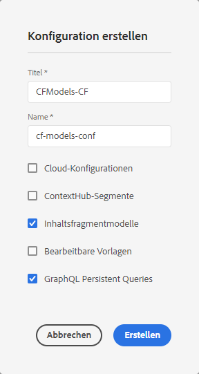

# Inhaltsfragmentmodelle{#content-fragment-models}

Inhaltsfragmentmodelle definieren die Struktur des Inhalts für Ihre [Inhaltsfragmente](/help/assets/content-fragments/content-fragments.md).

## Aktivieren von Inhaltsfragmentmodellen {#enable-content-fragment-models}

>[!CAUTION]
>
>Wenn Sie **Inhaltsfragmentmodelle** nicht aktivieren, haben Sie keinen Zugriff auf die Option **Erstellen** für das Erstellen neuer Modelle.

Gehen Sie wie folgt vor, um Inhaltsfragmentmodelle zu aktivieren:

* Aktivieren Sie die Verwendung von Inhaltsfragmentmodellen im Konfigurations-Manager
* Wenden Sie die Konfiguration auf Ihren Assets-Ordner an

### Aktivieren Sie Inhaltsfragmentmodelle im Konfigurations-Manager {#enable-content-fragment-models-in-configuration-manager}

Um [ein neues Inhaltsfragmentmodell zu erstellen](#creating-a-content-fragment-model), **müssen** Sie Inhaltsfragmentmodelle zunächst über den Konfigurations-Manager aktivieren:

1. Navigate to **Tools**, **General**, then open the **Configuration Browser**.
2. Wählen Sie den entsprechenden Speicherort für Ihre Webseite aus.
3. Use **Create** to open the dialog, where you:

   1. Geben Sie einen **Titel** an.
   2. Select **Content Fragment Models** to enable their use.
   

4. Select **Create** to save the definition.

### Wenden Sie die Konfiguration auf Ihren Assets-Ordner an {#apply-the-configuration-to-your-assets-folder}

Wenn die Konfiguration **Global** für Inhaltsfragmentmodelle aktiviert wurde, können alle von Benutzern erstellten Modelle in jedem beliebigen Assets-Ordner verwendet werden.

Um eine andere Konfiguration (d. h. nicht „Global“) mit einem vergleichbaren Assets-Ordner verwenden zu können, müssen Sie die Verbindung definieren. This is done by selecting the appropriate **Configuration** in the **Cloud Services** tab of the **Folder Properties** of the appropriate folder.

## Erstellen eines Inhaltsfragmentmodells {#creating-a-content-fragment-model}

1. Navigate to **Tools**, **Assets**, then open **Content Fragment Models**.
1. Navigieren Sie zu dem entsprechenden Ordner für Ihre [Konfiguration](#enable-content-fragment-models).
1. Öffnen Sie den Assistenten über **Erstellen**.

   >[!CAUTION]
   >
   >Wenn die [Verwendung von Inhaltsfragmentmodellen nicht aktiviert wurde](#enable-content-fragment-models), ist die Option **Erstellen** nicht verfügbar.

1. Legen Sie den **Modell-Titel** fest. Bei Bedarf können Sie auch **eine Beschreibung** hinzufügen.

   

1. Speichern Sie das leere Modell über **Erstellen**. Eine Benachrichtigung zeigt an, dass der Vorgang erfolgreich abgeschlossen wurde. Daraufhin können Sie das Modell über die Option **Öffnen** direkt bearbeiten oder über **Fertig** zur Konsole zurückkehren.

## Definieren Ihres Inhaltsfragmentmodells {#defining-your-content-fragment-model}

Das Inhaltsfragmentmodell definiert effektiv die Struktur des daraus entstehenden Inhaltsmodells. Mit dem Modell-Editor können Sie die erforderlichen Felder hinzufügen und konfigurieren:

>[!CAUTION]
>
>Die Bearbeitung eines vorhandenen Inhaltsfragmentmodells kann sich auf abhängige Fragmente auswirken.

1. Navigate to **Tools**, **Assets**, then open **Content Fragment Models**.

1. Navigieren Sie zu dem Ordner, der Ihr Inhaltsfragmentmodell enthält.
1. Öffnen Sie das zu **bearbeitende** Modell; nutzen Sie dazu entweder die entsprechende Schnellaktion oder wählen Sie das Modell und anschließend die Aktion aus der Anwendungssymbolleiste aus.

   Wenn das Modell geöffnet ist, finden Sie Folgendes im Editor:

   * Links: bereits definierte Felder
   * right: **Data Types** available for creating fields (and **Properties** for use once fields have been created)
   >[!NOTE]
   >
   >Wenn ein Feld ein **Pflichtfeld** ist, wird die **Bezeichnung** im linken Bereich mit einem Stern markiert (*****).

   

1. **So fügen Sie ein Feld hinzu**

   * Ziehen Sie einen erforderlichen Datentyp an die entsprechende Stelle für ein Feld:
   

   * Wenn ein Feld zum Modell hinzugefügt wurde, werden im rechten Fenster die **Eigenschaften** angezeigt, die für diesen speziellen Datentyp definiert werden können. Hier können Sie festlegen, was für dieses Feld erforderlich ist. Beispiel:
   

   >[!NOTE]
   Beim Datentyp **Mehrzeilentext** können Sie den **Standardtyp** folgendermaßen definieren:
   * **Rich-Text**
   * **Markdown**
   * **Nur Text**
   Wenn Sie keinen Typ angeben, wird der Standardwert **Rich-Text** in diesem Feld verwendet.
   Änderungen am **Standardtyp** in einem Fragmentmodell werden erst auf vorhandene, zugehörige Inhaltsfragmente angewendet, wenn das Fragment im Editor geöffnet und gespeichert wurde. 

1. **So entfernen Sie ein Feld**

   Wählen Sie das entsprechende Feld aus und klicken/tippen Sie auf das Papierkorb-Symbol. Sie werden aufgefordert, den Vorgang zu bestätigen.

   

1. After adding all required fields, and defining the properties, use **Save** to persist the definition. Beispiel:

   

## Löschen eines Inhaltsfragmentmodells {#deleting-a-content-fragment-model}

>[!CAUTION]
Das Löschen eines Inhaltsfragmentmodells wirkt sich unter Umständen auf abhängige Fragmente aus.

So löschen Sie ein Inhaltsfragmentmodell:

1. Navigate to **Tools**, **Assets**, then open **Content Fragment Models**.

1. Navigieren Sie zu dem Ordner, der Ihr Inhaltsfragmentmodell enthält.
1. Wählen Sie Ihr Modell und anschließend die Option **Löschen** aus der Anwendungssymbolleiste aus.

   >[!NOTE]
   Wenn es Verweise auf das Modell gibt, wird Ihnen ein Warnhinweis angezeigt. Ergreifen Sie die entsprechenden Maßnahmen.

## Veröffentlichen eines Inhaltsfragmentmodells {#publishing-a-content-fragment-model}

Inhaltsfragmentmodelle müssen zeitgleich mit oder im Vorfeld der Veröffentlichung abhängiger Inhaltsfragmente veröffentlicht werden.

So veröffentlichen Sie ein Inhaltsfragmentmodell:

1. Navigate to **Tools**, **Assets**, then open **Content Fragment Models**.

1. Navigieren Sie zu dem Ordner, der Ihr Inhaltsfragmentmodell enthält.
1. Wählen Sie Ihr Modell und anschließen die Option **Löschen** aus der Anwendungssymbolleiste aus.

   >[!NOTE]
   Wenn Sie Inhaltsfragmente veröffentlichen, deren Modell noch nicht veröffentlicht wurde, wird dies in der Auswahlliste angezeigt und das Modell wird mit dem Fragment veröffentlicht.
