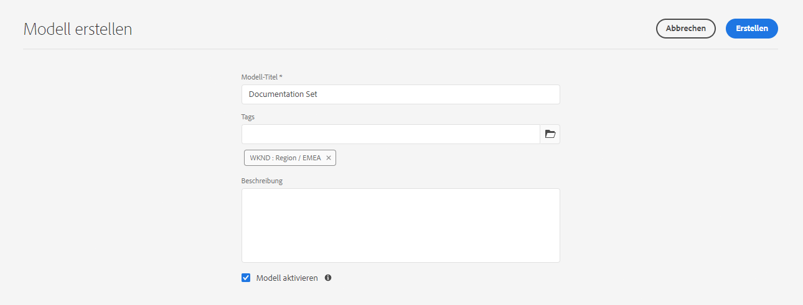
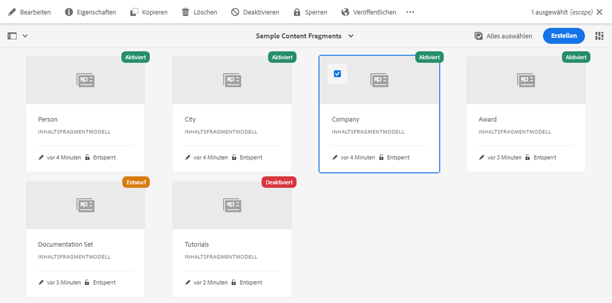

# Inhaltsfragmentmodelle {#content-fragment-models}

>[!CAUTION]
>
>Die AEM GraphQL-API für den Versand &quot;Inhaltsfragmente&quot;steht auf Anfrage zur Verfügung.
>
>Bitte wenden Sie sich an [Adobe Support](https://experienceleague.adobe.com/?lang=en&amp;support-solution=General#support), um die API für Ihre AEM als Cloud Service-Programm zu aktivieren.

Inhaltsfragmentmodelle definieren die Struktur des Inhalts für Ihre [Inhaltsfragmente](/help/assets/content-fragments/content-fragments.md).

So verwenden Sie Inhaltsfragmentmodelle:

1. [Funktionalität des Inhaltsfragmentmodells für Ihre Instanz aktivieren](/help/assets/content-fragments/content-fragments-configuration-browser.md)
1. [Erstellen](#creating-a-content-fragment-model) und  [konfigurieren](#defining-your-content-fragment-model) Sie Ihre Inhaltsfragmentmodelle
1. [Inhaltsfragmentmodelle ](#enabling-disabling-a-content-fragment-model) zur Verwendung beim Erstellen von Inhaltsfragmenten zur Verwendung beim Erstellen von Inhaltsfragmenten aktivieren

## Erstellen eines Inhaltsfragmentmodells {#creating-a-content-fragment-model}

1. Navigieren Sie zu **Tools** > **Assets** und öffnen Sie dann **Inhaltsfragmentmodelle**.
1. Navigieren Sie zu dem entsprechenden Ordner für Ihre [Konfiguration](/help/assets/content-fragments/content-fragments-configuration-browser.md).
1. Öffnen Sie den Assistenten über **Erstellen**.

   >[!CAUTION]
   >
   >Wenn die [Verwendung von Inhaltsfragmentmodellen nicht aktiviert wurde](/help/assets/content-fragments/content-fragments-configuration-browser.md), ist die Option **Erstellen** nicht verfügbar.

1. Geben Sie den **Modelltitel** an. Sie können bei Bedarf auch **Tags** und eine **Beschreibung** hinzufügen.

   

1. Speichern Sie das leere Modell über **Erstellen**. Eine Benachrichtigung zeigt an, dass der Vorgang erfolgreich abgeschlossen wurde. Daraufhin können Sie das Modell über die Option **Öffnen** direkt bearbeiten oder über **Fertig** zur Konsole zurückkehren.

## Definieren des Inhaltsfragmentmodells   {#defining-your-content-fragment-model}

Das Inhaltsfragmentmodell definiert die Struktur der resultierenden Inhaltsfragmente effektiv mithilfe einer Auswahl von **[Datentypen](#data-types)**. Mithilfe des Modelleditors können Sie Instanzen der Datentypen hinzufügen und diese dann so konfigurieren, dass die erforderlichen Felder erstellt werden:

>[!CAUTION]
>
>Die Bearbeitung eines vorhandenen Inhaltsfragmentmodells kann sich auf abhängige Fragmente auswirken.

1. Navigieren Sie zu **Tools** > **Assets** und öffnen Sie dann **Inhaltsfragmentmodelle**.

1. Navigieren Sie zu dem Ordner, der Ihr Inhaltsfragmentmodell enthält.
1. Öffnen Sie das zu **bearbeitende** Modell; nutzen Sie dazu entweder die entsprechende Schnellaktion oder wählen Sie das Modell und anschließend die Aktion aus der Anwendungssymbolleiste aus.

   Wenn das Modell geöffnet ist, finden Sie Folgendes im Editor:

   * Links: bereits definierte Felder
   * Rechts: verfügbare **Datentypen** für das Erstellen von Feldern (und **Eigenschaften**, die für erstellte Felder verwendet werden können)

   >[!NOTE]
   >
   >Wenn ein Feld ein **Pflichtfeld** ist, wird die **Bezeichnung** im linken Bereich mit einem Stern markiert (*****).

1. **So fügen Sie ein Feld hinzu**

   * Ziehen Sie einen erforderlichen Datentyp an die entsprechende Stelle für ein Feld.

   * Wenn ein Feld zum Modell hinzugefügt wurde, werden im rechten Fenster die **Eigenschaften** angezeigt, die für diesen speziellen Datentyp definiert werden können. Hier können Sie festlegen, was für dieses Feld erforderlich ist.
Viele Eigenschaften sind selbsterklärend. Weitere Informationen finden Sie unter [Eigenschaften](#properties).

1. **So entfernen Sie ein Feld**

   Wählen Sie das entsprechende Feld aus und klicken/tippen Sie auf das Papierkorb-Symbol. Sie werden aufgefordert, den Vorgang zu bestätigen.

1. hinzufügen Sie alle erforderlichen Felder und definieren Sie die entsprechenden Eigenschaften nach Bedarf.

1. Wählen Sie **Speichern**, um die Definition beizubehalten.

<!--
## Defining your Content Fragment Model {#defining-your-content-fragment-model}

The content fragment model effectively defines the structure of the resulting content fragments using a selection of **[Data Types](#data-types)**. Using the model editor you can add instances of the data types, then configure them to create the required fields:

>[!CAUTION]
>
>Editing an existing content fragment model can impact dependent fragments.

1. Navigate to **Tools**, **Assets**, then open **Content Fragment Models**.

1. Navigate to the folder holding your content fragment model.
1. Open the required model for **Edit**; use either the quick action, or select the model and then the action from the toolbar.

   Once open the model editor shows:

    * left: fields already defined
    * right: **Data Types** available for creating fields (and **Properties** for use once fields have been created)

   >[!NOTE]
   >
   >When a field as **Required**, the **Label** indicated in the left pane will be marked with an asterix (**&#42;**).

   

1. **To Add a Field**

    * Drag a required data type to the required location for a field:

      

    * Once a field has been added to the model, the right panel will show the **Properties** that can be defined for that particular data type. Here you can define what is required for that field. 
      Many properties are self-explanatory, for additional details see [Properties](#properties).
      For example:

      

1. **To Remove a Field**

   Select the required field, then click/tap the trash-can icon. You will be asked to confirm the action.

   

1. Add all required fields, and define the related properties, as required. For example:

   

1. Select **Save** to persist the definition.
-->

## Datentypen {#data-types}

Eine Auswahl an Datentypen steht zur Definition Ihres Modells zur Verfügung:

* **Einzeilentext**
   * hinzufügen eines oder mehrere Felder einer einzelnen Textzeile; die maximale Länge kann definiert werden
* **Mehrzeilentext**
   * Ein Textbereich, bei dem es sich um Rich Text, Nur-Text oder Markierungen handeln kann
* **Zahl**
   * hinzufügen eines oder mehrere numerische Felder
* **Boolesch**
   * hinzufügen eines booleschen Kontrollkästchens
* **Datum und Uhrzeit**
   * Datum und/oder Uhrzeit Hinzufügen
* **Aufzählung**
   * hinzufügen einer Reihe von Kontrollkästchen, Optionsfeldern oder Dropdown-Feldern
* **Tags**
   * Ermöglicht Fragmentautoren den Zugriff auf und die Auswahl von Bereichen von Tags
* **Inhaltsreferenz**
   * Verweise auf andere Inhalte jeder Art; kann für [Erstellung verschachtelter Inhalte](#using-references-to-form-nested-content) verwendet werden

<!--
* **Fragment Reference**
  * References other content fragments; can be used to [create nested content](#using-references-to-form-nested-content)
  * The data type can be configured to allow fragment authors to:
    * Edit the referenced fragment directly.
    * Create a new content fragment, based on the appropriate model  
* **JSON Object**
  * Allows the content fragment author to enter JSON syntax into the corresponding elements of a fragment. 
    * To allow AEM to store direct JSON that you have copy/pasted from another service.
    * The JSON will be passed through, and output as JSON in GraphQL.
    * Includes JSON syntax-highlighting, auto-complete and error-highlighting in the content fragment editor.
-->

## Eigenschaften {#properties}

Viele Eigenschaften sind selbsterklärend. Für bestimmte Eigenschaften sind folgende weitere Details verfügbar:

* **Rendern**
alsDie verschiedenen Optionen zum Realisieren/Rendern des Felds in einem Fragment. Auf diese Weise können Sie häufig festlegen, ob dem Autor eine einzelne Instanz des Felds angezeigt wird oder ob mehrere Instanzen erstellt werden dürfen.

* **Feldbeschriftung**
Eingeben eines 
**Feldbezeichnungen** generieren automatisch einen  **Eigenschaftsnamen**, der bei Bedarf manuell aktualisiert werden kann.

* **Die**
ValidationBasic-Validierung steht für Mechanismen wie die  **** Requiredproperty zur Verfügung. Einige Datentypen verfügen über zusätzliche Überprüfungsfelder. Weitere Informationen finden Sie unter [Validierung](#validation).

* Beim Datentyp **Mehrzeilentext** können Sie den **Standardtyp** folgendermaßen definieren:

   * **Rich-Text**
   * **Markdown**
   * **Nur Text**

   Wenn Sie keinen Typ angeben, wird der Standardwert **Rich-Text** in diesem Feld verwendet.

   Änderungen am **Standardtyp** in einem Fragmentmodell werden erst dann auf vorhandene, zugehörige Inhaltsfragmente angewendet, wenn das Fragment im Editor geöffnet und gespeichert wurde.

<!--
* **Translatable**
  Checking the "Translatable" checkbox on a field in CF model editor will

  * Ensure the field's property name is added in translation config, context `/content/dam/<tenant>`, if not already present. 
  * For GraphQL: set a `<translatable>` property on the Content Fragment field to `yes`, to allow GraphQL query filter for JSON output with only translatable content.

* See **[Fragment Reference (Nested Fragments)](#fragment-reference-nested-fragments)** for more details about that specific data type and its properties.
-->

## Validierung {#validation}

Verschiedene Datentypen bieten jetzt die Möglichkeit, Prüfanforderungen für den Zeitpunkt zu definieren, an dem Inhalt in das resultierende Fragment eingegeben wird:

* **Einzeilentext**
   * Vergleichen Sie mit einem vordefinierten Regex.
* **Zahl**
   * Suchen Sie nach bestimmten Werten.

<!--
* **Content Reference**
  * Test for specific types of content.
  * Only images within a predefined range of width and height (in pixels) can be referenced. 
  * Only assets of specified file size or smaller can be referenced. 
  * Only predefined file types can be referenced.
  * No more than the predefined number of assets can be referenced. 
  * No more than the predefined number of fragments can be referenced.
* **Fragment Reference**
  * Test for a specific content fragment model.
-->

<!--
## Using References to form Nested Content {#using-references-to-form-nested-content}

Content Fragments can form nested content, using either of the following data types:

* **[Content Reference](#content-reference)**
  * Provides a simple reference to other content; of any type.
  * Can be configured for a one or multiple references (in the resulting fragment).

* **[Fragment Reference](#fragment-reference-nested-fragments)** (Nested Fragments)
  * References other fragments, dependent on the specific models specified.
  * Allows you to include/retrieve structured data.
    >[!NOTE]
    >
    >This method is of particular interest in conjunction with [Headless Content Delivery using Content Fragments with GraphQL](/help/assets/content-fragments/content-fragments-graphql.md).
  * Can be configured for one or multiple references (in the resulting fragment)..

>[!NOTE]
>
>AEM has a recurrence protection for:
>
>* Content References
>  This prevents the user from adding a reference to the current fragment. This may lead to an empty Fragment Reference picker dialog.
>
>* Fragment References in GraphQL 
>  If you create a deep query that returns multiple Content Fragments referenced by each another, it will return null at first occurence.

### Content Reference {#content-reference}

The Content Reference allows you to render content from another source; for example, image or content fragment.

In addition to standard properties you can specify:

* The **Root Path** for any referenced content.
* The content types that can be referenced.
* Limitations for file sizes.
* Image restraints.
-->

<!-- Check screenshot - might need update

   
-->

<!--
### Fragment Reference (Nested Fragments) {#fragment-reference-nested-fragments}

The Fragment Reference references one, or more, content fragments. This feature of particular interest when retrieving content for use in your app, as it allows you to retrieve structured data with multiple layers.

For example:

* A model defining details for an employee; these include:
  * A reference to the model that defines the employer (company)

```xml
type EmployeeModel {
    name: String
    firstName: String
    company: CompanyModel
}

type CompanyModel {
    name: String
    street: String
    city: String
}
```

>[!NOTE]
>
>This is of particular interest in conjunction with [Headless Content Delivery using Content Fragments with GraphQL](/help/assets/content-fragments/content-fragments-graphql.md).

In addition to standard properties you can define:

* **Render As**:

  * **multifield** - the fragment author can create multiple, individual, references

  * **fragmentreference** - allows the fragment author to select a single reference to a fragment

* **Model Type**
  Multiple models can be selected. When authoring the Content Fragment any referenced fragments must have been created using these models.

* **Root Path**
  This specifies a root path for any fragments referenced.

* **Allow Fragment Creation**

  This will allow the fragment author to create a new fragment based on the appropriate model.
-->

<!--
  * **fragmentreferencecomposite** - allows the fragment author to build a composite, by selecting multiple fragments
-->

<!-- Check screenshot - might need update

   
-->

<!--
>[!NOTE]
>
>A recurrence protection mechanism is in place. It prohibits the user from selecting the current Content Fragment in the Fragment Reference. This may lead to an empty Fragment Reference picker dialog.
>
>There is also a recurrence protection for Fragment References in GraphQL. If you create a deep query across two Content Fragments that reference each other, it will return null.
-->

## Aktivieren oder Deaktivieren eines Inhaltsfragmentmodells {#enabling-disabling-a-content-fragment-model}

Zur vollständigen Kontrolle über die Verwendung Ihrer Inhaltsfragmentmodelle haben sie einen Status, den Sie festlegen können.

### Aktivieren eines Inhaltsfragmentmodells {#enabling-a-content-fragment-model}

Nachdem ein Modell erstellt wurde, muss es aktiviert werden, damit es:

* Ist zur Auswahl verfügbar, wenn ein neues Inhaltsfragment erstellt wird.
* Kann in einem Inhaltsfragmentmodell referenziert werden.
* ist für GraphQL verfügbar; damit das Schema generiert wird.

So aktivieren Sie ein Modell, das entweder als

* **Entwurf** : mew (nie aktiviert).
* **Deaktiviert** : speziell deaktiviert wurde.

Sie verwenden die Option **Aktivieren** aus einem der folgenden Schritte:

* Die obere Symbolleiste, wenn das gewünschte Modell ausgewählt ist.
* Die entsprechende Schnellaktion (Bewegen Sie den Mauszeiger über das gewünschte Modell).


### Deaktivieren eines Inhaltsfragmentmodells {#disabling-a-content-fragment-model}

Ein Modell kann auch deaktiviert werden, sodass:

* Das Modell ist nicht mehr als Grundlage für die Erstellung von Inhaltsfragmenten verfügbar.**
* However:
   * Das GraphQL-Schema wird weiterhin generiert und kann weiterhin abgefragt werden (um eine Beeinträchtigung der JSON-API zu vermeiden).
   * Inhaltsfragmente, die auf dem Modell basieren, können weiterhin abgefragt und vom GraphQL-Endpunkt zurückgegeben werden.
* Das Modell kann nicht mehr referenziert werden, vorhandene Referenzen bleiben jedoch unberührt und können weiterhin abgefragt und vom GraphQL-Endpunkt zurückgegeben werden.

Um ein Modell zu deaktivieren, das als **Aktiviert** gekennzeichnet ist, verwenden Sie die Option **Deaktivieren** entweder:

* Die obere Symbolleiste, wenn das gewünschte Modell ausgewählt ist.
* Die entsprechende Schnellaktion (Bewegen Sie den Mauszeiger über das gewünschte Modell).



## Löschen eines Inhaltsfragmentmodells {#deleting-a-content-fragment-model}

>[!CAUTION]
Das Löschen eines Inhaltsfragmentmodells wirkt sich unter Umständen auf abhängige Fragmente aus.

So löschen Sie ein Inhaltsfragmentmodell:

1. Navigieren Sie zu **Tools** > **Assets** und öffnen Sie dann **Inhaltsfragmentmodelle**.

1. Navigieren Sie zu dem Ordner, der Ihr Inhaltsfragmentmodell enthält.
1. Wählen Sie Ihr Modell und anschließend die Option **Löschen** aus der Anwendungssymbolleiste aus.

   >[!NOTE]
   Wenn es Verweise auf das Modell gibt, wird Ihnen ein Warnhinweis angezeigt. Ergreifen Sie die entsprechenden Maßnahmen.

## Veröffentlichen eines Inhaltsfragmentmodells    {#publishing-a-content-fragment-model}

Inhaltsfragmentmodelle müssen zeitgleich mit oder im Vorfeld der Veröffentlichung abhängiger Inhaltsfragmente veröffentlicht werden.

So veröffentlichen Sie ein Inhaltsfragmentmodell:

1. Navigieren Sie zu **Tools** > **Assets** und öffnen Sie dann **Inhaltsfragmentmodelle**.

1. Navigieren Sie zu dem Ordner, der Ihr Inhaltsfragmentmodell enthält.
1. Wählen Sie Ihr Modell und anschließen die Option **Löschen** aus der Anwendungssymbolleiste aus.
Der veröffentlichte Status wird in der Konsole angezeigt.

   >[!NOTE]
   Wenn Sie Inhaltsfragmente veröffentlichen, deren Modell noch nicht veröffentlicht wurde, wird dies in der Auswahlliste angezeigt und das Modell wird mit dem Fragment veröffentlicht.

## Rückgängigmachen der Veröffentlichung eines Inhaltsfragmentmodells {#unpublishing-a-content-fragment-model}

Die Veröffentlichung von Inhaltsfragmentmodellen kann rückgängig gemacht werden, wenn sie nicht von Fragmenten referenziert werden.

So machen Sie die Veröffentlichung eines Inhaltsfragmentmodells rückgängig:

1. Navigieren Sie zu **Tools** > **Assets** und öffnen Sie dann **Inhaltsfragmentmodelle**.

1. Navigieren Sie zu dem Ordner, der Ihr Inhaltsfragmentmodell enthält.
1. Wählen Sie Ihr Modell aus, gefolgt von **Veröffentlichung rückgängig machen** aus der Symbolleiste.
Der veröffentlichte Status wird in der Konsole angezeigt.
