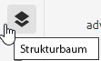
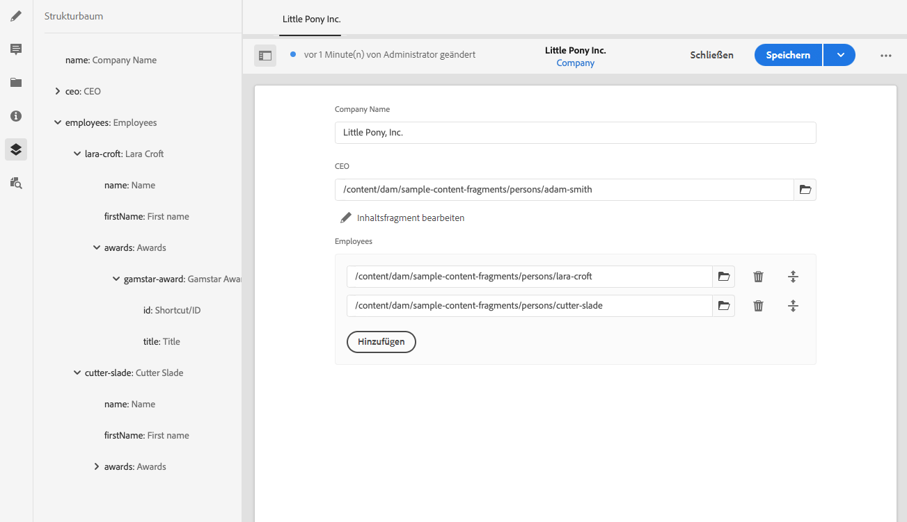

# Strukturbaum der Inhaltsfragmente {#content-fragment-structure-tree}

Verwenden Sie die Strukturbaum-Funktion des Inhaltsfragment-Editors in AEM, um den Inhalt ohne Kopf besser zu verstehen.

Im Inhaltsfragment-Editor können Sie das Strukturbaumsymbol auswählen:

Dadurch wird eine Darstellung der Fragmentstruktur im linken Fensterbereich geöffnet:

