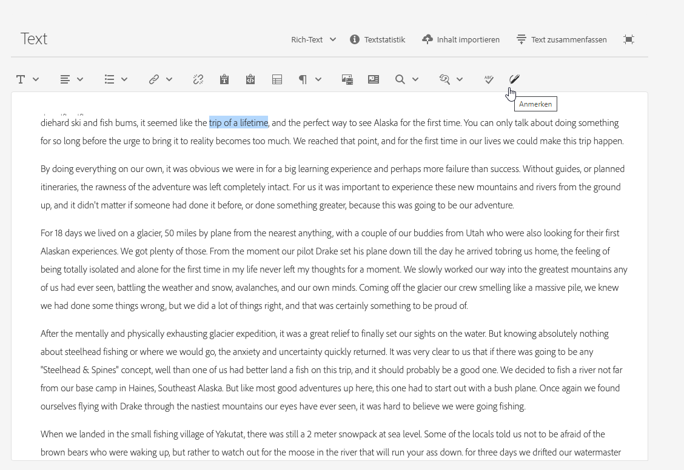

# Varianten – Erstellen von Fragmentinhalten{#variations-authoring-fragment-content}

[Varianten](/help/assets/content-fragments/content-fragments.md#constituent-parts-of-a-content-fragment) sind eine wichtige Funktion AEM Inhaltsfragmente. Der Grund dafür ist, dass Sie damit Kopien des Master-Inhalts erstellen und bearbeiten können, um sie in bestimmten Kanälen und Szenarien zu verwenden, wodurch die Bereitstellung von Headless Content noch flexibler wird.

>[!NOTE]
>
>Inhaltsfragmente sind eine Sites-Funktion, werden jedoch als **Assets**.
>
>Es gibt zwei Editoren für die Bearbeitung von Inhaltsfragmenten. In diesem Abschnitt wird der ursprüngliche Editor beschrieben, auf den Sie hauptsächlich über das **Assets** Konsole. Weitere Informationen finden Sie in der Sites-Dokumentation . [Inhaltsfragmente - Authoring](/help/sites-cloud/administering/content-fragments/authoring.md)für Details zum neuen Editor (hauptsächlich über die **Inhaltsfragmente** -Konsole).

Aus dem **Varianten** -Registerkarte können Sie Folgendes tun:

* [Eingeben von Inhalt](#authoring-your-content) für Ihr Fragment,
* [Erstellen und Verwalten von Varianten](#managing-variations) des **primären** Inhalts,

Führen Sie eine Vielzahl weiterer Aktionen abhängig vom bearbeiteten Datentyp aus, z. B.:

* [Einfügen von visuellen Assets in Ihr Fragment](#inserting-assets-into-your-fragment) (Bilder)

* Wählen Sie zwischen [Rich-Text](#rich-text), [Nur Text](#plain-text), und [Markdown](#markdown) zur Bearbeitung

* [Inhalt hochladen](#uploading-content)

* [Anzeigen von Schlüsselstatistiken](#viewing-key-statistics) (über mehrzeiligen Text)

* [Zusammenfassen von Text](#summarizing-text)

* [Synchronisieren von Varianten mit dem primären Inhalt](#synchronizing-with-master)

>[!CAUTION]
>
>Nachdem ein Fragment veröffentlicht und/oder referenziert wurde, zeigt AEM eine Warnung an, wenn ein Autor das Fragment erneut zur Bearbeitung öffnet. Dadurch soll darauf hingewiesen werden, dass sich Änderungen am Fragment auch auf die referenzierten Seiten auswirken.

## Verfassen Ihres Inhalts {#authoring-your-content}

Wenn Sie Ihr Inhaltsfragment zur Bearbeitung öffnen, ist die Registerkarte **Varianten** standardmäßig geöffnet. Hier können Sie den Inhalt bearbeiten, und zwar den der primären Version sowie sämtlicher Varianten. Das strukturierte Fragment enthält Felder verschiedener Datentypen, die im Inhaltsmodell definiert wurden.

Beispiel:

Sie haben folgende Möglichkeiten:

* Bearbeiten Sie Ihre Inhalte direkt auf der Registerkarte **Varianten**. Jeder Datentyp bietet verschiedene Bearbeitungsoptionen, z. B.:

   * für **Mehrzeiliger Text** -Felder, können Sie auch die [Vollbild-Editor](#full-screen-editor) an:

      * das [Format](#formats) auszuwählen
      * weitere Bearbeitungsoptionen anzuzeigen ([Rich-Text](#rich-text)-Format)
      * auf eine Reihe von [Aktionen](#actions) zuzugreifen

   * Für **Fragmentverweis** -Felder, die [Inhaltsfragment bearbeiten](#fragment-references-edit-content-fragment) je nach Modelldefinition verfügbar sein.

* Zuweisen **Tags** zur aktuellen Variante hinzugefügt, aktualisiert und entfernt werden.

   * [Tags](/help/sites-cloud/authoring/features/tags.md) sind bei der Organisation Ihrer Fragmente leistungsstark, da sie für die Inhaltsklassifizierung und Taxonomie verwendet werden können. Tags können zum Suchen von Inhalten (nach Tags) und zum Anwenden von Massenvorgängen verwendet werden.

      * Die Suche nach einem Tag gibt das Fragment zurück, wobei die Tag-Variante hervorgehoben ist.
      * Varianten-Tags können auch verwendet werden, um Varianten für ein bestimmtes CDN-Profil (Content Delivery Network) (für CDN-Caching) zu gruppieren, anstatt den Variantennamen zu verwenden.

     Beispielsweise können Sie relevante Fragmente als „Weihnachts-Launch“ taggen, um nur diese als Teilmenge zu durchsuchen oder sie für einen anderen zukünftigen Launch in einen neuen Ordner zu kopieren.

  >[!NOTE]
  >
  >**Tags** können auch (in der **primären** Variante) als Teil der [Metadaten](/help/assets/content-fragments/content-fragments-metadata.md) hinzugefügt werden

* [Erstellen und Verwalten von Varianten](#managing-variations) des **primären** Inhalts.

### Vollbild-Editor {#full-screen-editor}

Wenn Sie ein mehrzeiliges Textfeld bearbeiten, können Sie den Vollbild-Editor öffnen. Wählen Sie innerhalb des tatsächlichen Textes aus und wählen Sie dann das folgende Aktionssymbol aus:

Dadurch wird der Vollbild-Texteditor geöffnet:

Der Vollbild-Texteditor bietet Folgendes:

* Zugriff auf verschiedene [Aktionen](#actions)
* Zusätzliche Formatierungsoptionen ([Rich-Text](#rich-text)), je nach [Format](#formats)

### Aktionen {#actions}

Die folgenden Aktionen sind ebenfalls verfügbar (für sämtliche [Formate](#formats)), wenn der Vollbild-Editor (d. h. mehrzeiliger Text) geöffnet ist:

* [Format](#formats) auswählen ([Rich-Text](#rich-text), [Nur Text](#plain-text), [Markdown](#markdown))

* [Inhalt hochladen](#uploading-content)

* [Textstatistiken anzeigen](#viewing-key-statistics)

* [Mit primärer Version synchronisieren](#synchronizing-with-master) (beim Bearbeiten einer Variante)

* [Zusammenfassen von Text](#summarizing-text)

### Formate {#formats}

Die Optionen für das Bearbeiten von mehrzeiligem Text hängen vom ausgewählten Format ab:

* [Rich-Text](#rich-text)
* [Nur Text](#plain-text)
* [Markdown](#markdown)

Das Format kann im Vollbild-Editor ausgewählt werden.

### Rich-Text {#rich-text}

Die Rich-Text-Bearbeitung ermöglicht das Formatieren:

* Fett
* Kursiv
* Unterstrichen
* Ausrichtung: links, zentriert, rechts
* Stichpunktliste
* Nummerierte Liste
* Einzug: vergrößern, verringern
* Erstellen/Aufheben von Hyperlinks
* Einfügen von Text aus Word
* Einfügen einer Tabelle
* Absatzformat: Absatz, Überschrift 1/2/3
* [Asset einfügen](#inserting-assets-into-your-fragment)
* Öffnen Sie den Vollbild-Editor, in dem die folgenden Formatierungsoptionen zur Verfügung stehen:
   * Suchen
   * Suchen/Ersetzen
   * Rechtschreibprüfung
   * [Anmerkungen](/help/assets/content-fragments/content-fragments-variations.md#annotating-a-content-fragment)
* [Inhaltsfragment einfügen](#inserting-content-fragment-into-your-fragment); verfügbar, wenn Ihre **Mehrzeiliger Text** -Feld konfiguriert mit **Fragmentverweis zulassen**.

Die [Aktionen](#actions) sind ebenfalls über den Vollbild-Editor verfügbar.

### Nur Text {#plain-text}

Nur Text ermöglicht die schnelle Eingabe von Inhalt ohne Formatierungs- oder Markdown-Informationen. Für weitere [Aktionen](#actions) können Sie auch den Vollbild-Editor öffnen.

>[!CAUTION]
>
>Wenn Sie **Nur Text**, gehen möglicherweise alle Formatierungen, Markdown oder Assets verloren, die Sie in **Rich-Text** oder **Markdown**.

### Markdown {#markdown}

>[!NOTE]
>
>Umfassende Informationen finden Sie im [Markdown](/help/assets/content-fragments/content-fragments-markdown.md) Dokumentation.

Auf diese Weise können Sie Ihren Text mithilfe von Markdown formatieren. Sie können Folgendes definieren:

* Überschriften
* Absätze und Zeilenumbrüche
* Links
* Bilder
* Blockzitate
* Listen
* Hervorhebungen
* Code-Blöcke
* Umgekehrter Schrägstrich als Escape-Zeichen

Für weitere [Aktionen](#actions) können Sie auch den Vollbild-Editor öffnen.

>[!CAUTION]
>
>Wenn Sie zwischen **Rich-Text** und **Markdown** umschalten, treten möglicherweise unerwartete Effekte mit Blockzitaten und Code-Blöcken auf, da diese beiden Formate unterschiedlich verarbeitet werden.

### Fragmentreferenzen {#fragment-references}

Wenn das Inhaltsfragmentmodell Fragmentreferenzen enthält, stehen Ihren Fragmentautoren möglicherweise zusätzliche Optionen zur Verfügung:

* [Inhaltsfragment bearbeiten](#fragment-references-edit-content-fragment)
* [Neues Inhaltsfragment](#fragment-references-new-content-fragment)

#### Inhaltsfragment bearbeiten {#fragment-references-edit-content-fragment}

Die Option **Inhaltsfragment bearbeiten** öffnet dieses Fragment in einer neuen Editor-Registerkarte (innerhalb derselben Browser-Registerkarte).

Wählen Sie die ursprüngliche Registerkarte erneut aus (z. B. **Little Pony Inc.**) schließt diese sekundäre Registerkarte (in diesem Fall **Adam Smith**).

#### Neues Inhaltsfragment {#fragment-references-new-content-fragment}

Die Option **Neues Inhaltsfragment** erstellt ein Fragment. Zu diesem Zweck wird eine Variante des Assistenten zum Erstellen von Inhaltsfragmenten im Editor geöffnet.

**So erstellen Sie ein Inhaltsfragment:**

1. Navigieren Sie zum gewünschten Ordner und wählen Sie ihn aus.
1. Wählen Sie **Weiter** aus.
1. Festlegen von Eigenschaften, beispielsweise **Titel**.
1. Wählen Sie **Erstellen** aus.
1. Abschließend:
   1. **Fertig**:
      * zurück (zum ursprünglichen Fragment)
      * referenziert das neue Fragment
   1. **Öffnen**:
      * referenziert das neue Fragment
      * öffnet das neue Fragment zur Bearbeitung in einer neuen Browser-Registerkarte

### Anzeigen von wichtigen Statistiken {#viewing-key-statistics}

Wenn der Vollbild-Editor geöffnet ist, wird die Aktion **Textstatistiken** zeigt eine Reihe von Informationen zum Text an.

Beispiel:

### Hochladen von Inhalt {#uploading-content}

Um das Authoring von Inhaltsfragmenten zu vereinfachen, können Sie Text hochladen, der in einem externen Editor vorbereitet wurde, und ihn direkt zum Fragment hinzufügen.

### Zusammenfassung von Text {#summarizing-text}

Mithilfe der Zusammenfassung von Text können Benutzer die Länge des Textes auf eine vordefinierte Anzahl von Wörtern verringern, während die wichtigen Punkte und die allgemeine Bedeutung beibehalten werden.

>[!NOTE]
>
>Auf einer technischeren Ebene behält das System die Sätze bei, die es als Bereitstellung der *bestes Verhältnis von Informationsdichte und Eindeutigkeit* nach bestimmten Algorithmen.

>[!CAUTION]
>
>Das Inhaltsfragment muss einen gültigen Sprachordner (ISO-Code) als Vorgänger haben, der verwendet wird, um das zu verwendende Sprachmodell zu bestimmen.
>
>Beispiel: `en/` wie im folgenden Pfad:
>
>  `/content/dam/my-brand/en/path-down/my-content-fragment`

>[!CAUTION]
>
Englisch ist standardmäßig verfügbar.
>
Andere Sprachen sind als Sprachmodellpakete über Software Distribution verfügbar:
>
* [Französisch (fr)](https://experience.adobe.com/#/downloads/content/software-distribution/en/aem.html?lang=de?package=/content/software-distribution/en/details.html/content/dam/aem/public/adobe/packages/cq630/product/smartcontent-model-fr)
* [Deutsch (de)](https://experience.adobe.com/#/downloads/content/software-distribution/en/aem.html?lang=de?package=/content/software-distribution/en/details.html/content/dam/aem/public/adobe/packages/cq630/product/smartcontent-model-de)
* [Italienisch (it)](https://experience.adobe.com/#/downloads/content/software-distribution/en/aem.html?lang=de?package=/content/software-distribution/en/details.html/content/dam/aem/public/adobe/packages/cq630/product/smartcontent-model-it)
* [Spanisch (es)](https://experience.adobe.com/#/downloads/content/software-distribution/en/aem.html?lang=de?package=/content/software-distribution/en/details.html/content/dam/aem/public/adobe/packages/cq630/product/smartcontent-model-es)
>

1. Wählen Sie **Primäre Version** oder die erforderliche Variante aus.
1. Öffnen Sie den Vollbild-Editor.

1. Wählen Sie in der Symbolleiste die Option **Text zusammenfassen** aus.

   

1. Geben Sie den Zielwert der Wörter an und wählen Sie **Starten**:
1. Der ursprüngliche Text wird nebeneinander mit der vorgeschlagenen Zusammenfassung angezeigt:

   * Alle zu löschenden Sätze sind rot hervorgehoben und durchgestrichen.
   * Klicken Sie auf einen beliebigen markierten Satz, damit Sie ihn im zusammengefassten Inhalt behalten können.
   * Klicken Sie auf einen beliebigen nicht hervorgehobenen Satz, damit dieser entfernt werden kann.

1. Wählen Sie **Zusammenfassen** aus, um die Änderungen zu bestätigen.

1. Der ursprüngliche Text wird nebeneinander mit der vorgeschlagenen Zusammenfassung angezeigt:

   * Alle zu löschenden Sätze sind rot hervorgehoben und durchgestrichen.
   * Klicken Sie auf einen beliebigen markierten Satz, damit Sie ihn im zusammengefassten Inhalt behalten können.
   * Klicken Sie auf einen beliebigen nicht hervorgehobenen Satz, damit dieser entfernt werden kann.
   * Die Zusammenfassungsstatistiken werden gezeigt: **Actual** und **Target**.
   * Sie können die Änderungen in der **Vorschau** sehen.

   

### Anmerkungen zu Inhaltsfragmenten {#annotating-a-content-fragment}

So fügen Sie Anmerkungen zu Fragmenten hinzu:

1. Wählen Sie **Primäre Version** oder die erforderliche Variante aus.

1. Öffnen Sie den Vollbild-Editor.

1. Das Symbol **Anmerken** ist in der Symbolleiste oben verfügbar. Sie können bei Bedarf Text auswählen.

   

1. Ein Dialogfeld wird angezeigt. Hier können Sie Ihre Anmerkungen eingeben.

   

1. Wählen Sie **Anwenden** im Dialogfeld aus.

   

   Wenn die Anmerkung auf den ausgewählten Text angewendet wurde, bleibt dieser Text hervorgehoben.

   

1. Schließen Sie den Editor für den Vollbildmodus. Die Anmerkungen sind weiterhin hervorgehoben. Wenn diese Option aktiviert ist, wird ein Dialogfeld geöffnet, in dem Sie die Anmerkung weiter bearbeiten können.

1. Klicken Sie auf **Speichern**.

1. Schließen Sie den Editor für den Vollbildmodus. Die Anmerkungen sind weiterhin hervorgehoben. Wenn diese Option aktiviert ist, wird ein Dialogfeld geöffnet, in dem Sie die Anmerkung weiter bearbeiten können.

   

### Anzeigen, Bearbeiten und Löschen von Anmerkungen {#viewing-editing-deleting-annotations}

Anmerkungen:

* Sie werden durch die Markierung auf dem Text sowohl im Vollbildmodus als auch im normalen Modus des Editors angezeigt. Vollständige Details einer Anmerkung können angezeigt, bearbeitet und/oder gelöscht werden, indem Sie auf den markierten Text klicken, der das Dialogfeld erneut öffnet.

  >[!NOTE]
  >
  Eine Dropdown-Liste wird angezeigt, wenn mehrere Anmerkungen auf einen Textausschnitt angewendet wurden.

* Wenn Sie den gesamten Text löschen, auf den die Anmerkung angewendet wurde, wird der Kommentar ebenfalls gelöscht.

* Sie kann durch Auswahl der **Anmerkungen** im Fragment-Editor.

  

* Sie kann im [Timeline](/help/assets/content-fragments/content-fragments-managing.md#timeline-for-content-fragments) für das ausgewählte Fragment.

### Einfügen von Assets in das Fragment {#inserting-assets-into-your-fragment}

Um die Erstellung von Inhaltsfragmenten zu vereinfachen, können Sie [Assets](/help/assets/manage-digital-assets.md) (Bilder) direkt zum Fragment hinzu.

Sie werden der Absatzsequenz des Fragments ohne Formatierung hinzugefügt. Die Formatierung kann vorgenommen werden, wenn das [Fragment auf einer Seite verwendet/referenziert wird](/help/sites-cloud/authoring/fundamentals/content-fragments.md).

>[!CAUTION]
>
Diese Assets können auf einer referenzierenden Seite nicht verschoben oder gelöscht werden, sondern nur im Fragment-Editor.
>
Das Formatieren von Assets (z. B. Größe) muss im [Seiten-Editor](/help/sites-cloud/authoring/fundamentals/content-fragments.md) erfolgen. Die Darstellung des Assets im Fragment-Editor dient lediglich der Erstellung des Inhaltsflusses.

>[!NOTE]
>
Es gibt verschiedene Methoden, um [Bilder](/help/assets/content-fragments/content-fragments.md#fragments-with-visual-assets) zu einem Fragment und/oder einer Seite hinzuzufügen.

1. Positionieren Sie den Cursor an der Stelle, an der das Bild hinzugefügt werden soll.
1. Öffnen Sie das Suchdialogfeld mithilfe der Schaltfläche **Asset einfügen**.

   

1. Im Dialogfeld können Sie entweder zum gewünschten Asset in DAM navigieren oder in DAM nach dem Asset suchen.

   Wenn Sie das gewünschte Asset gefunden haben, wählen Sie es aus, indem Sie auf die Miniaturansicht klicken.

1. Verwenden Sie **Auswahl**, um das Asset dem Absatzsystem Ihres Inhaltsfragments am aktuellen Speicherort hinzuzufügen.

   >[!CAUTION]
   >
   Wenn Sie nach dem Hinzufügen eines Assets das Format ändern in:
   >
   * **Nur Text**: Das Asset geht aus dem Fragment verloren.
   * **Markdown**: Das Asset wird nicht angezeigt, ist aber immer noch vorhanden, wenn Sie zu **Rich-Text** zurückkehren.

### Einfügen eines Inhaltsfragments in ein Fragment {#inserting-content-fragment-into-your-fragment}

Um die Erstellung von Inhaltsfragmenten zu vereinfachen, können Sie Ihrem Fragment auch ein anderes Inhaltsfragment hinzufügen.

Sie werden als Referenz an Ihrer aktuellen Position in Ihrem Fragment hinzugefügt.

>[!NOTE]
>
Diese Option ist verfügbar, wenn Ihre **Mehrzeiliger Text** konfiguriert wurde mit **Fragmentverweis zulassen**.

>[!CAUTION]
>
Diese Assets können auf einer referenzierenden Seite nicht verschoben oder gelöscht werden, sondern nur im Fragment-Editor.
>
Das Formatieren von Assets (z. B. Größe) muss im [Seiten-Editor](/help/sites-cloud/authoring/fundamentals/content-fragments.md) erfolgen. Die Darstellung des Assets im Fragment-Editor dient lediglich der Erstellung des Inhaltsflusses.

>[!NOTE]
>
Es gibt verschiedene Methoden, um [Bilder](/help/assets/content-fragments/content-fragments.md#fragments-with-visual-assets) zu einem Fragment und/oder einer Seite hinzuzufügen.

1. Positionieren Sie den Cursor an der Stelle, an der das Fragment hinzugefügt werden soll.
1. Öffnen Sie das Suchdialogfeld mithilfe der Schaltfläche **Inhaltsfragment einfügen**.

   

1. Im Dialogfeld können Sie entweder zum gewünschten Fragment im Ordner &quot;Assets&quot;navigieren oder nach dem Fragment suchen.

   Wenn Sie sich befinden, wählen Sie das gewünschte Fragment aus, indem Sie auf die Miniaturansicht klicken.

1. Verwenden Sie **Auswahl**, um dem aktuellen Inhaltsfragment (an der aktuellen Position) eine Referenz zum ausgewählten Inhaltsfragment hinzuzufügen.

   >[!CAUTION]
   >
   Wenn Sie nach dem Hinzufügen eines Verweises zu einem anderen Fragment das Format ändern in:
   >
   * **Nur Text**: Die Referenz geht aus dem Fragment verloren.
   * **Markdown**: Die Referenz bleibt erhalten.

## Vererbung {#inheritance}

Die Vererbung ist der Mechanismus, bei dem Inhalte automatisch von einem Fragment in ein anderes verschoben werden können. Vererbte Felder und Varianten können das Produkt von [Multi-Site-Management](/help/assets/content-fragments/content-fragments.md#reusing-content-fragments-with-msm-assets).

Sie können die Vererbung deaktivieren (und dann wieder aktivieren). Je nach Kontext kann dies für eine Variante oder ein einzelnes Feld verfügbar sein, wenn das Fragment Teil einer Live Copy ist.

Beispiel:

* Vererbung abbrechen

  

* Erneutes Aktivieren der Vererbung (wenn die Vererbung bereits abgebrochen wurde)

  

<!--
* Rollout action is also available in Live Copy source

  
-->

## Verwalten von Varianten {#managing-variations}

### Erstellen einer Variante {#creating-a-variation}

Mithilfe von Varianten können Sie die **Master** Inhalt und variieren sie je nach Zweck (falls erforderlich).

**So erstellen Sie eine Variante:**

1. Öffnen Sie Ihr Fragment und stellen Sie sicher, dass das seitliche Bedienfeld sichtbar ist.
1. Wählen Sie im seitlichen Bedienfeld in der Symbolleiste die Option **Varianten** aus.
1. Wählen Sie **Variante erstellen** aus.
1. Ein Dialogfeld wird geöffnet, in dem Sie die **Titel** und **Beschreibung** für die neue Variante.
1. Wählen Sie **Hinzufügen** aus. Das Fragment **Primäre Version** wird in die neue Variante kopiert, die nun zur [Bearbeitung](#editing-a-variation) geöffnet ist.

   >[!NOTE]
   >
   Beim Erstellen einer Variante ist immer die **Master** kopiert wird, nicht die geöffnete Variante.

   >[!NOTE]
   >
   Wenn Sie eine Variante erstellen, werden alle **Tags** derzeit zugewiesen ist, **Master** -Variante in Ihre neue Variante kopiert werden.

### Bearbeiten einer Variante {#editing-a-variation}

Sie können den Varianteninhalt ändern, nachdem Sie entweder:

* [Erstellen einer Variante](#creating-a-variation).
* Öffnen eines vorhandenen Fragments und Auswahl der gewünschten Variante aus dem seitlichen Bedienfeld.

### Umbenennen einer Variante {#renaming-a-variation}

1. Öffnen Sie das Fragment und wählen Sie über den Seitenbereich die Option **Varianten** aus.
1. Wählen Sie die gewünschte Variante aus.
1. Wählen Sie im Dropdown-Menü **Aktionen** die Option **Umbenennen** aus.

1. Geben Sie im Dialogfeld den neuen **Titel** und/oder die **Beschreibung** ein.

1. Bestätigen Sie das **Umbenennen**.

>[!NOTE]
>
Dies betrifft nur den **Titel** der Variante.

### Löschen einer Variante {#deleting-a-variation}

1. Öffnen Sie das Fragment und wählen Sie über den Seitenbereich die Option **Varianten** aus.
1. Wählen Sie die gewünschte Variante aus.
1. Wählen Sie im Dropdown-Menü **Aktionen** die Option **Löschen** aus.

1. Bestätigen Sie im Dialogfeld die Aktion **Löschen**.

>[!NOTE]
>
**Primäre Version** kann nicht gelöscht werden.

### Mit primärer Version synchronisieren {#synchronizing-with-master}

**Master** ist Teil eines Inhaltsfragments und enthält definitionsgemäß die Masterkopie des Inhalts. Im Gegensatz dazu enthalten Varianten die einzelnen aktualisierten und maßgeschneiderten Versionen dieses Inhalts. Wenn der Master aktualisiert wird, ist es möglich, dass diese Änderungen auch für die Varianten relevant sind und daher an sie weitergeleitet werden müssen.

Beim Bearbeiten einer Variante haben Sie Zugriff auf die Aktion zum Synchronisieren des aktuellen Elements der Variante mit Master. Auf diese Weise können Sie Änderungen, die an Master vorgenommen wurden, automatisch in die gewünschte Variante kopieren.

>[!CAUTION]
>
Die Synchronisierung ist nur verfügbar, um Änderungen *von der **primären Version**in die Variante* zu kopieren.
>
Es wird nur das aktuelle Element der Variante synchronisiert.
>
Die Synchronisierung funktioniert nur auf der **Mehrzeiliger Text** Datentyp.
>
Es ist nicht möglich, Änderungen *von einer Variante auf die **primäre Version*** zu übertragen.

1. Öffnen Sie das Inhaltsfragment im Fragment-Editor. Stellen Sie sicher, dass die **primäre Version** bearbeitet wurde.

1. Es gibt folgende Möglichkeiten, eine bestimmte Variante sowie die entsprechende Synchronisierung auszuwählen:

   * über den Dropdown-Selektor **Aktionen** – **Aktuelles Element mit primärer Version synchronisieren**

     

   * über die Symbolleiste des Vollbild-Editors – **Mit primärer Version synchronisieren**

     

1. Primäre Version und Variante werden nebeneinander angezeigt:

   * Grün bedeutet, dass der Inhalt hinzugefügt wurde (zur Variante)
   * Rot zeigt an, dass der Inhalt entfernt wurde (aus der Variante)
   * Blau zeigt an, dass Text ersetzt wurde

   

1. Wählen Sie **Synchronisieren** aus. Die Variante wird dann aktualisiert und angezeigt.
