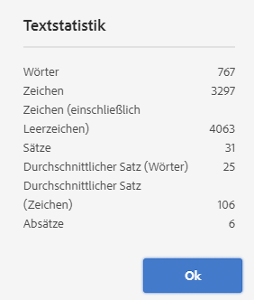

# Varianten – Erstellen von Fragmentinhalten{#variations-authoring-fragment-content}

[Varianten](/help/assets/content-fragments/content-fragments.md#constituent-parts-of-a-content-fragment) sind eine wichtige Funktion von Inhaltsfragmenten in Adobe Experience Manager (AEM) as a Cloud Service. Dies liegt daran, dass Sie damit Kopien der **Musterinhalte** für die Verwendung in bestimmten Kanälen und Szenarien erstellen und bearbeiten können. Insbesondere wird dadurch die Bereitstellung von Headless-Inhalten noch flexibler.

>[!NOTE]
>
>Inhaltsfragmente sind eine Sites-Eigenschaft, werden jedoch als **Assets** gespeichert.
>
>Es gibt zwei Editoren für das Erstellen von Inhaltsfragmenten - den neuen Editor und den ursprünglichen Editor. Der neue Editor ist der Standard. Obwohl die grundlegenden Funktionen identisch sind, gibt es einige Unterschiede.
>
>In diesem Abschnitt wird der ursprüngliche Editor behandelt. Dieser wird [über den neuen Editor geöffnet](/help/assets/content-fragments/content-fragments-managing.md#opening-the-fragment-editor).
>
>Ausführliche Informationen zum neuen Editor finden Sie in der Sites[Dokumentation ](/help/sites-cloud/administering/content-fragments/authoring.md)Inhaltsfragmente - Authoring).

Auf der Registerkarte **Varianten** können Sie Folgendes tun:

* [Eingeben des Inhalts](#authoring-your-content) für Ihr Fragment,
* [Erstellen und Verwalten von Varianten](#managing-variations) des **primären** Inhalts,

Führen Sie eine Vielzahl weiterer Aktionen abhängig vom bearbeiteten Datentyp aus, z. B.:

* [Einfügen von visuellen Assets in Ihr Fragment](#inserting-assets-into-your-fragment) (Bilder)

* Wählen zwischen [Rich-Text](#rich-text), [Nur Text](#plain-text) und [Markdown](#markdown) für die Bearbeitung

* [Inhalt hochladen](#uploading-content)

* [Anzeigen von Schlüsselstatistiken](#viewing-key-statistics) (über mehrzeiligen Text)

* [Zusammenfassen von Text](#summarizing-text)

* [Synchronisieren von Varianten mit dem primären Inhalt](#synchronizing-with-master)

>[!CAUTION]
>
>Nachdem ein Fragment veröffentlicht und/oder referenziert wurde, zeigt AEM eine Warnmeldung an, wenn eine Autorin bzw. ein Autor das Fragment erneut zur Bearbeitung öffnet. Dies dient als Hinweis darauf, dass am Fragment vorgenommene Änderungen sich auch auf die referenzierten Seiten auswirken.

## Verfassen Ihres Inhalts {#authoring-your-content}

Wenn Sie Ihr Inhaltsfragment zur Bearbeitung im ursprünglichen Editor öffnen, ist **Registerkarte** Varianten“ standardmäßig geöffnet. Hier können Sie den Inhalt bearbeiten, und zwar den der primären Version sowie sämtlicher Varianten. Das strukturierte Fragment enthält Felder mit verschiedenen Datentypen, die im Inhaltsmodell definiert wurden.

Zum Beispiel:

Sie haben folgende Möglichkeiten:

* Bearbeiten Sie Ihre Inhalte direkt auf der Registerkarte **Varianten**. Jeder Datentyp bietet verschiedene Bearbeitungsoptionen, z. B.:

   * Wenn im Modell (als mehrfach) konfiguriert, ermöglichen verschiedene Datentypen das **Hinzufügen** von Instanzen des relevanten Feldes.

   * Für **mehrzeilige Textfelder** können Sie auch den [Vollbild-Editor](#full-screen-editor) öffnen, um:

      * das [Format](#formats) auszuwählen
      * weitere Bearbeitungsoptionen anzuzeigen ([Rich-Text](#rich-text)-Format)
      * auf eine Reihe von [Aktionen](#actions) zuzugreifen

   * Für die Felder **Fragmentreferenz** kann je nach Modelldefinition die Option [Inhaltsfragment bearbeiten](#fragment-references-edit-content-fragment) verfügbar sein.

* Sie können der aktuellen Variante **Tags** zuweisen. Die Tags können hinzugefügt, aktualisiert und entfernt werden.

   * [Tags](/help/sites-cloud/authoring/sites-console/tags.md) sind leistungsstark bei der Organisation Ihrer Fragmente, da sie für die Inhaltsklassifizierung und -taxonomie verwendet werden können. Tags können zum Suchen von Inhalten (nach Tags) und zum Anwenden von Massenvorgängen verwendet werden.

      * Bei der Suche nach einem Tag wird das Fragment zurückgegeben, wobei die getaggte Variante hervorgehoben ist.
      * Varianten-Tags können auch verwendet werden, um Varianten für ein bestimmtes CDN-Profil (Content Delivery Network) (für CDN-Caching) zu gruppieren, anstatt den Variantennamen zu verwenden.

     Beispielsweise können Sie relevante Fragmente als „Weihnachts-Launch“ taggen, um nur diese als Teilmenge zu durchsuchen oder sie für einen anderen zukünftigen Launch in einen neuen Ordner zu kopieren.

  >[!NOTE]
  >
  >**Tags** können auch (in der **primären** Variante) als Teil der [Metadaten](/help/assets/content-fragments/content-fragments-metadata.md) hinzugefügt werden

* [Erstellen und Verwalten von Varianten](#managing-variations) des **primären** Inhalts.

>[!NOTE]
>
>Abhängig von den Definitionen im zugrunde liegenden Modell können Felder bestimmten Typen der [Validierung](/help/assets/content-fragments/content-fragments-models.md#validation) unterliegen.

### Vollbild-Editor {#full-screen-editor}

Beim Bearbeiten eines mehrzeiligen Textfelds können Sie den Vollbild-Editor öffnen. Wählen Sie den eigentlichen Text und dann das folgende Aktionssymbol aus:

Dadurch wird der Vollbild-Texteditor geöffnet:

Der Vollbild-Texteditor bietet Folgendes:

* Zugriff auf verschiedene [Aktionen](#actions)
* Je nach [Format](#formats) zusätzliche Formatierungsoptionen ([Rich-Text](#rich-text))

### Aktionen {#actions}

Die folgenden Aktionen sind ebenfalls verfügbar (für sämtliche [Formate](#formats)), wenn der Vollbild-Editor (d. h. mehrzeiliger Text) geöffnet ist:

* Wählen Sie das [Format](#formats) aus ([Rich-Text](#rich-text), [Nur Text](#plain-text), [Markdown](#markdown)).

* [Inhalt hochladen](#uploading-content)

* [Textstatistiken anzeigen](#viewing-key-statistics)

* [Mit primärer Version synchronisieren](#synchronizing-with-master) (beim Bearbeiten einer Variante)

* [Zusammenfassen von Text](#summarizing-text)

### Formate {#formats}

Die Optionen für das Bearbeiten von mehrzeiligem Text hängen vom ausgewählten Format ab:

* [Rich-Text](#rich-text)
* [Nur Text](#plain-text)
* [Markdown](#markdown)

Das Format kann im Vollbild-Editor ausgewählt werden.

### Rich-Text {#rich-text}

Die Rich-Text-Bearbeitung ermöglicht folgende Formatierungen:

* Fett
* Kursiv
* Unterstrichen
* Ausrichtung: links, zentriert, rechts
* Aufzählungsliste
* Nummerierte Liste
* Einzug: erhöhen, verringern
* Hyperlinks erstellen/unterbrechen
* Text aus Word einfügen
* Tabelle einfügen
* Absatzformat: Absatz, Überschrift 1/2/3
* [Asset einfügen](#inserting-assets-into-your-fragment)
* Öffnen Sie den Vollbild-Editor, in dem die folgenden Formatierungsoptionen zur Verfügung stehen:
   * Suchen
   * Suchen/Ersetzen
   * Rechtschreibprüfung
   * [Anmerkungen](/help/assets/content-fragments/content-fragments-variations.md#annotating-a-content-fragment)
* [Inhaltsfragment einfügen](#inserting-content-fragment-into-your-fragment): verfügbar, wenn das Feld **Mehrzeiliges Textfeld** mit **Fragmentverweise zulassen** konfiguriert wurde.

Die [Aktionen](#actions) sind ebenfalls über den Vollbild-Editor verfügbar.

### Nur Text {#plain-text}

Nur Text ermöglicht die schnelle Eingabe von Inhalt ohne Formatierungs- oder Markdown-Informationen. Für weitere [Aktionen](#actions) können Sie auch den Vollbild-Editor öffnen.

>[!CAUTION]
>
>Wenn Sie **Nur Text** wählen, gehen möglicherweise alle Formatierungen, Markdowns oder Assets verloren, die Sie in **Rich Text** oder **Markdown** eingefügt haben.

### Markdown {#markdown}

>[!NOTE]
>
>Umfassende Informationen finden Sie in der [Markdown](/help/assets/content-fragments/content-fragments-markdown.md)-Dokumentation.

Auf diese Weise können Sie Ihren Text mithilfe von Markdown formatieren. Sie können Folgendes definieren:

* Überschriften
* Absätze und Zeilenumbrüche
* Links
* Bilder
* Blockzitate
* Listen
* Hervorhebungen
* Code-Blöcke
* Umgekehrter Schrägstrich als Escape-Zeichen

Für weitere [Aktionen](#actions) können Sie auch den Vollbild-Editor öffnen.

>[!CAUTION]
>
>Wenn Sie zwischen **Rich-Text** und **Markdown** umschalten, treten möglicherweise unerwartete Effekte mit Blockzitaten und Code-Blöcken auf, da diese beiden Formate unterschiedlich verarbeitet werden.

### Fragmentreferenzen {#fragment-references}

Wenn das Inhaltsfragmentmodell Fragmentreferenzen enthält, stehen Ihren Fragmentautoren möglicherweise zusätzliche Optionen zur Verfügung:

* [Inhaltsfragment bearbeiten](#fragment-references-edit-content-fragment)
* [Neues Inhaltsfragment](#fragment-references-new-content-fragment)

#### Inhaltsfragment bearbeiten {#fragment-references-edit-content-fragment}

Durch die Option **Inhaltsfragment bearbeiten** wird dieses Fragment in einer neuen Editor-Registerkarte (innerhalb derselben Browser-Registerkarte) geöffnet.

Wenn Sie die ursprüngliche Registerkarte erneut auswählen (z. B. **Little Pony Inc.**), wird diese sekundäre Registerkarte (in diesem Fall **Adam Smith**) geschlossen.

#### Neues Inhaltsfragment {#fragment-references-new-content-fragment}

Mit der Option **Neues Inhaltsfragment** können Sie ein Fragment erstellen. Dazu öffnet sich im Editor eine Variante des Assistenten zum Erstellen von Inhaltsfragmenten.

**So erstellen Sie ein Inhaltsfragment:**

1. Navigieren Sie zum gewünschten Ordner und wählen Sie ihn aus.
1. Wählen Sie **Weiter** aus.
1. Legen Sie Eigenschaften fest, z. B. **Titel**.
1. Wählen Sie **Erstellen** aus.
1. Abschließend:
   1. **Fertig**:
      * zurück (zum ursprünglichen Fragment)
      * referenziert das neue Fragment
   1. **Öffnen**:
      * referenziert das neue Fragment
      * öffnet das neue Fragment zur Bearbeitung in einer neuen Browser-Registerkarte

### Anzeigen von wichtigen Statistiken {#viewing-key-statistics}

Wenn der Vollbild-Editor geöffnet ist, zeigt die Aktion **Textstatistik** eine Reihe von Informationen über den Text an.

Zum Beispiel:

### Hochladen von Inhalt {#uploading-content}

Um die Erstellung von Inhaltsfragmenten zu vereinfachen, können Sie Text hochladen, der in einem externen Editor vorbereitet wurde, und ihn direkt in das Fragment einfügen.

### Zusammenfassung von Text {#summarizing-text}

Mithilfe der Zusammenfassung von Text können Benutzende die Länge des Textes auf eine vordefinierte Anzahl von Wörtern verringern, während die wichtigsten Punkte und die allgemeine Bedeutung beibehalten werden.

>[!NOTE]
>
>Auf technischer Ebene behält das System die Sätze bei, die in Übereinstimmung mit bestimmten Algorithmen das *beste Verhältnis von Informationsdichte und Eindeutigkeit* bieten.

>[!CAUTION]
>
>Das Inhaltsfragment muss einen gültigen Sprachordner (ISO-Code) als Vorgänger haben, der verwendet wird, um das zu verwendende Sprachmodell zu bestimmen.
>
>Beispiel: `en/` wie im folgenden Pfad:
>
>  `/content/dam/my-brand/en/path-down/my-content-fragment`

>[!CAUTION]
>
>Englisch ist standardmäßig verfügbar.
>
>Andere Sprachen sind als Sprachmodellpakete über Software Distribution verfügbar:
>
>* [Französisch (fr)](https://experience.adobe.com/#/downloads/content/software-distribution/en/aem.html?lang=de?package=/content/software-distribution/en/details.html/content/dam/aem/public/adobe/packages/cq630/product/smartcontent-model-fr)
>* [Deutsch (de)](https://experience.adobe.com/#/downloads/content/software-distribution/en/aem.html?lang=de?package=/content/software-distribution/en/details.html/content/dam/aem/public/adobe/packages/cq630/product/smartcontent-model-de)
>* [Italienisch (it)](https://experience.adobe.com/#/downloads/content/software-distribution/en/aem.html?lang=de?package=/content/software-distribution/en/details.html/content/dam/aem/public/adobe/packages/cq630/product/smartcontent-model-it)
>* [Spanisch (es)](https://experience.adobe.com/#/downloads/content/software-distribution/en/aem.html?lang=de?package=/content/software-distribution/en/details.html/content/dam/aem/public/adobe/packages/cq630/product/smartcontent-model-es)
>

1. Wählen Sie **Primäre Version** oder die erforderliche Variante aus.
1. Öffnen Sie den Vollbild-Editor.

1. Wählen Sie in der Symbolleiste die Option **Text zusammenfassen** aus.

   

1. Geben Sie den Zielwert der Wörter an und wählen Sie **Starten**:
1. Der ursprüngliche Text wird neben der vorgeschlagenen Zusammenfassung angezeigt:

   * Alle zu löschenden Sätze sind rot hervorgehoben und durchgestrichen.
   * Klicken Sie auf einen beliebigen markierten Satz, damit Sie ihn im zusammengefassten Inhalt beibehalten können.
   * Klicken Sie auf einen beliebigen, nicht hervorgehobenen Satz, damit dieser entfernt werden kann.

1. Wählen Sie **Zusammenfassen** aus, um die Änderungen zu bestätigen.

1. Der ursprüngliche Text wird neben der vorgeschlagenen Zusammenfassung angezeigt:

   * Alle zu löschenden Sätze sind rot hervorgehoben und durchgestrichen.
   * Klicken Sie auf einen beliebigen markierten Satz, damit Sie ihn im zusammengefassten Inhalt beibehalten können.
   * Klicken Sie auf einen beliebigen, nicht hervorgehobenen Satz, damit dieser entfernt werden kann.
   * Die Zusammenfassungsstatistiken werden gezeigt: **Actual** und **Target**.
   * Sie können die Änderungen in der **Vorschau** sehen.

   

### Anmerkungen zu Inhaltsfragmenten {#annotating-a-content-fragment}

So fügen Sie eine Anmerkung zu einem Fragment hinzu:

1. Wählen Sie **Primäre Version** oder die erforderliche Variante aus.

1. Öffnen Sie den Vollbild-Editor.

1. Das Symbol **Anmerken** ist in der Symbolleiste oben verfügbar. Sie können bei Bedarf Text auswählen.

   

1. Ein Dialogfeld wird angezeigt. Hier können Sie Ihre Anmerkungen eingeben.

   

1. Wählen Sie **Anwenden** im Dialogfeld aus.

   

   Wenn die Anmerkung auf den ausgewählten Text angewendet wurde, bleibt dieser Text hervorgehoben.

   

1. Schließen Sie den Vollbild-Editor. Die Anmerkungen sind weiterhin hervorgehoben. Wenn diese Option aktiviert ist, wird ein Dialogfeld geöffnet, in dem Sie die Anmerkung weiter bearbeiten können.

1. Klicken Sie auf **Speichern**.

1. Schließen Sie den Vollbild-Editor. Die Anmerkungen sind weiterhin hervorgehoben. Wenn diese Option aktiviert ist, wird ein Dialogfeld geöffnet, in dem Sie die Anmerkung weiter bearbeiten können.

   

>[!NOTE]
>
>Die Funktion „Anmerkungen“ zeigt keine im neuen [Inhaltsfragmenteditor](/help/sites-cloud/administering/content-fragments/authoring.md#commenting-on-your-fragment) eingegebenen Kommentare an.

### Anzeigen, Bearbeiten und Löschen von Anmerkungen {#viewing-editing-deleting-annotations}

Anmerkungen:

* Sie werden sowohl im Vollbildmodus als auch im Normalmodus des Editors als hervorgehobener Text angezeigt. Die vollständigen Details einer Anmerkung können dann angezeigt, bearbeitet und/oder gelöscht werden, indem Sie auf den hervorgehobenen Text klicken. Dadurch wird das Dialogfeld erneut geöffnet.

  >[!NOTE]
  >
  >Eine Dropdown-Liste wird angezeigt, wenn mehrere Anmerkungen auf einen Textausschnitt angewendet wurden.

* Wenn Sie den gesamten Text löschen, auf den die Anmerkung angewendet wurde, wird der Kommentar ebenfalls gelöscht.

* Sie kann aufgelistet und gelöscht werden, indem die Registerkarte **Anmerkungen** im Fragment-Editor ausgewählt wird.

  

* Sie können in der [Timeline](/help/assets/content-fragments/content-fragments-managing.md#timeline-for-content-fragments) für das ausgewählte Fragment angezeigt und gelöscht werden.

### Einfügen von Assets in das Fragment {#inserting-assets-into-your-fragment}

Um die Erstellung von Inhaltsfragmenten zu vereinfachen, können Sie [Assets](/help/assets/manage-digital-assets.md) (Bilder) direkt zum Fragment hinzufügen.

Sie werden der Absatzsequenz des Fragments ohne Formatierung hinzugefügt. Formatierungen können vorgenommen werden, wenn das [Fragment auf einer Seite verwendet/referenziert wird](/help/sites-cloud/authoring/fragments/content-fragments.md).

>[!CAUTION]
>
>Diese Assets können auf einer referenzierenden Seite nicht verschoben oder gelöscht werden, sondern nur im Fragment-Editor.
>
>Das Formatieren von Assets (z. B. Größe) muss im [Seiten-Editor](/help/sites-cloud/authoring/fragments/content-fragments.md) erfolgen. Die Darstellung des Assets im Fragment-Editor dient lediglich der Erstellung des Inhaltsflusses.

>[!NOTE]
>
>Es gibt verschiedene Methoden, um [Bilder](/help/assets/content-fragments/content-fragments.md#fragments-with-visual-assets) zu einem Fragment und/oder einer Seite hinzuzufügen.

1. Positionieren Sie den Cursor an der Stelle, an der Sie das Bild hinzufügen möchten.
1. Öffnen Sie das Suchdialogfeld mithilfe der Schaltfläche **Asset einfügen**.

   

1. Im Dialogfeld können Sie entweder zum gewünschten Asset in DAM navigieren oder in DAM nach dem Asset suchen.

   Wenn Sie das gewünschte Asset gefunden haben, wählen Sie es aus, indem Sie auf die Miniatur klicken.

1. Verwenden Sie **Auswählen**, um das Asset dem Absatzsystem Ihres Inhaltsfragments am aktuellen Speicherort hinzuzufügen.

   >[!CAUTION]
   >
   >Wenn Sie nach dem Hinzufügen eines Assets das Format ändern, kann Folgendes auftreten:
   >
   >* **Nur Text**: Das Asset geht im Fragment vollständig verloren.
   >* **Markdown**: Das Asset wird nicht angezeigt, ist aber immer noch vorhanden, wenn Sie zu **Rich-Text** zurückkehren.

### Einfügen eines Inhaltsfragments in ein Fragment {#inserting-content-fragment-into-your-fragment}

Um die Erstellung von Inhaltsfragmenten zu vereinfachen, können Sie Ihrem Fragment auch ein anderes Inhaltsfragment hinzufügen.

Es wird an der aktuellen Position in Ihrem Fragment als Referenz hinzugefügt.

>[!NOTE]
>
>Diese Option ist verfügbar, wenn Ihr **mehrzeiliges Textfeld** mit **Fragmentreferenz zulassen** konfiguriert wurde.

>[!CAUTION]
>
>Diese Assets können auf einer referenzierenden Seite nicht verschoben oder gelöscht werden, sondern nur im Fragment-Editor.
>
>Das Formatieren von Assets (z. B. Größe) muss im [Seiten-Editor](/help/sites-cloud/authoring/fragments/content-fragments.md) erfolgen. Die Darstellung des Assets im Fragment-Editor dient lediglich der Erstellung des Inhaltsflusses.

>[!NOTE]
>
>Es gibt verschiedene Methoden, um [Bilder](/help/assets/content-fragments/content-fragments.md#fragments-with-visual-assets) zu einem Fragment und/oder einer Seite hinzuzufügen.

1. Positionieren Sie den Cursor an der Stelle, an der Sie das Fragment hinzufügen möchten.
1. Öffnen Sie das Suchdialogfeld mithilfe der Schaltfläche **Inhaltsfragment einfügen**.

   

1. Im Dialogfeld können Sie entweder zum gewünschten Fragment im Ordner „Assets“ navigieren oder nach dem Fragment suchen.

   Wenn Sie das gewünschte Fragment gefunden haben, klicken Sie auf die Miniaturansicht, um es auszuwählen.

1. Verwenden Sie **Auswählen**, um dem aktuellen Inhaltsfragment (an der aktuellen Position) eine Referenz zum ausgewählten Inhaltsfragment hinzuzufügen.

   >[!CAUTION]
   >
   >Wenn Sie nach dem Hinzufügen einer Referenz zu einem anderem Fragment das Format ändern, kann Folgendes auftreten:
   >
   >* **Nur Text**: Die Referenz geht im Fragment vollständig verloren.
   >* **Markdown**: Die Referenz bleibt erhalten.

## Vererbung {#inheritance}

Vererbung ist der Mechanismus, bei dem Inhalte automatisch von einer Komponente in eine andere verschoben werden können. Vererbte Felder und Varianten können das Produkt von [Multi-Site-Management](/help/assets/content-fragments/content-fragments-msm.md) sein.

Sie können die Vererbung deaktivieren (und dann wieder aktivieren). Je nach Kontext kann dies für eine Variante oder ein einzelnes Feld verfügbar sein, wenn das Fragment Teil einer Live Copy ist.

Zum Beispiel:

* Vererbung abbrechen

  

* Vererbung erneut aktivieren (wenn sie bereits abgebrochen wurde)

  

<!--
* Rollout action is also available in Live Copy source

  
-->

## Verwalten von Varianten {#managing-variations}

### Erstellen einer Variante {#creating-a-variation}

Varianten ermöglichen die Abänderung von **primärem** Inhalt für einen bestimmten Zweck (sofern notwendig).

**So erstellen Sie eine Variante:**

1. Öffnen Sie Ihr Fragment und stellen Sie sicher, dass das seitliche Bedienfeld sichtbar ist.
1. Wählen Sie im seitlichen Bedienfeld in der Symbolleiste die Option **Varianten** aus.
1. Wählen Sie **Variante erstellen** aus.
1. Ein Dialogfeld wird geöffnet, in dem Sie den **Titel** und die **Beschreibung** für die neue Variante festlegen können.
1. Wählen Sie **Hinzufügen** aus. Das Fragment **Primäre Version** wird in die neue Variante kopiert, die nun zur [Bearbeitung](#editing-a-variation) geöffnet ist.

   >[!NOTE]
   >
   >Wenn eine neue Variante erstellt wird, wird immer die **primäre Version** kopiert, nicht die gerade geöffnete Variante.

   >[!NOTE]
   >
   >Wenn Sie eine Variante erstellen, werden alle **Tags**, die derzeit der **primären** Variante zugewiesen sind, in Ihre neue Variante kopiert.

### Bearbeiten einer Variante {#editing-a-variation}

Sie können nach einer der folgenden Aktionen den Inhalt der Variante ändern:

* [Erstellen einer Variante](#creating-a-variation)
* Öffnen eines vorhandenen Fragments und Auswahl der gewünschten Variante über das seitliche Bedienfeld

### Umbenennen einer Variante {#renaming-a-variation}

1. Öffnen Sie das Fragment und wählen Sie über den Seitenbereich die Option **Varianten** aus.
1. Wählen Sie die gewünschte Variante aus.
1. Wählen Sie im Dropdown-Menü **Aktionen** die Option **Umbenennen** aus.

1. Geben Sie im Dialogfeld den neuen **Titel** und/oder die **Beschreibung** ein.

1. Bestätigen Sie die Aktion **Umbenennen**.

>[!NOTE]
>
>Dies betrifft nur den **Titel** der Variante.

### Löschen einer Variante {#deleting-a-variation}

1. Öffnen Sie das Fragment und wählen Sie über den Seitenbereich die Option **Varianten** aus.
1. Wählen Sie die gewünschte Variante aus.
1. Wählen Sie im Dropdown-Menü **Aktionen** die Option **Löschen** aus.

1. Bestätigen Sie im Dialogfeld die Aktion **Löschen**.

>[!NOTE]
>
>**Primäre Version** kann nicht gelöscht werden.

### Mit primärer Version synchronisieren {#synchronizing-with-master}

Die **primäre Version** ist Teil eines Inhaltsfragments und enthält definitionsgemäß die primäre Kopie des Inhalts. Im Gegensatz dazu enthalten Varianten die einzelnen aktualisierten und maßgeschneiderten Versionen dieses Inhalts. Wenn die primäre Version aktualisiert wird, sind diese Änderungen möglicherweise auch für die Varianten relevant sein und müssen dementsprechend auf diese übertragen werden.

Beim Bearbeiten einer Variante haben Sie Zugriff auf die Aktion zur Synchronisierung des aktuellen Elements der Variante mit der primären Version. Dadurch können Sie die an der primären Version vorgenommenen Änderungen automatisch in die entsprechende Variante kopieren.

>[!CAUTION]
>
>Die Synchronisierung ist nur verfügbar, um Änderungen *von der **primären Version**&#x200B;in die Variante* zu kopieren.
>
>Nur das aktuelle Element der Variante wird synchronisiert.
>
>Die Synchronisierung funktioniert nur mit dem Datentyp **Mehrzeiliger Text**.
>
>Es ist nicht möglich, Änderungen *von einer Variante auf die **primäre Version*** zu übertragen.

1. Öffnen Sie das Inhaltsfragment im Fragment-Editor. Stellen Sie sicher, dass die **primäre Version** bearbeitet wurde.

1. Es gibt folgende Möglichkeiten, eine bestimmte Variante sowie die entsprechende Synchronisierung auszuwählen:

   * über den Dropdown-Selektor **Aktionen** – **Aktuelles Element mit primärer Version synchronisieren**

     

   * über die Symbolleiste des Vollbild-Editors – **Mit primärer Version synchronisieren**

     

1. Primäre Version und Variante werden nebeneinander angezeigt:

   * Grün bedeutet, dass der Inhalt (zur Variante) hinzugefügt wurde
   * Rot bedeutet, dass Inhalt (aus der Variante) entfernt wurde
   * Blau zeigt an, dass Text ersetzt wurde

   

1. Wählen Sie **Synchronisieren**. Die Variante wird dann aktualisiert und angezeigt.
