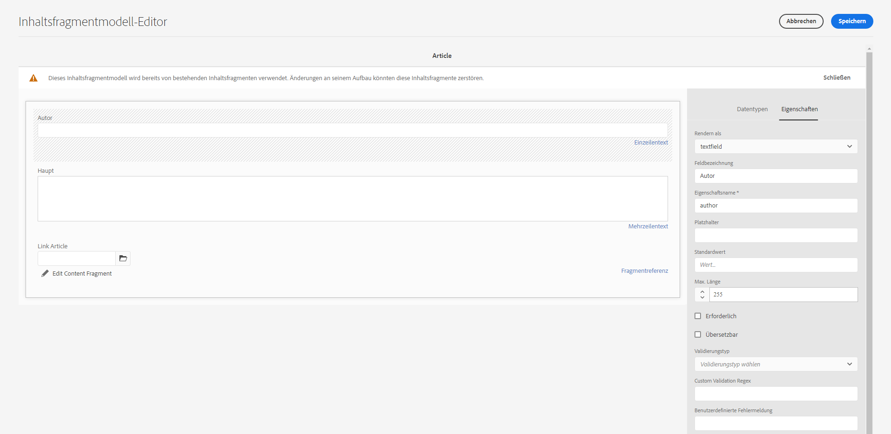
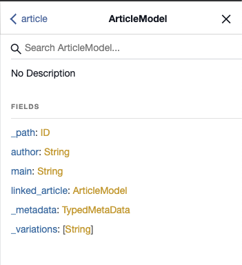

# AEM GraphQL-API zur Verwendung mit Inhaltsfragmenten {#graphql-api-for-use-with-content-fragments}

Erfahren Sie, wie Sie Inhaltsfragmente in Adobe Experience Manager (AEM) als Cloud Service mit der AEM GraphQL-API für die Bereitstellung Headless Content verwenden.

AEM als Cloud Service-GraphQL-API, die mit Inhaltsfragmenten verwendet wird, basiert stark auf der standardmäßigen Open-Source-GraphQL-API.

Die Verwendung der GraphQL-API in AEM ermöglicht die effiziente Bereitstellung von Inhaltsfragmenten an JavaScript-Clients in Headless-CMS-Implementierungen:

* Vermeiden von iterativen API-Anfragen wie bei REST,
* Sicherstellen, dass die Bereitstellung auf die spezifischen Anforderungen beschränkt ist,
* Ermöglichen der Massenbereitstellung von genau dem, was zum Rendern als Antwort auf eine einzelne API-Anfrage benötigt wird.

>[!NOTE]
>
>GraphQL wird derzeit in zwei (separaten) Szenarien in Adobe Experience Manager (AEM) as a Cloud Service verwendet:
>
>* [AEM Commerce nutzt Daten aus einer Commerce-Plattform über GraphQL](/help/commerce-cloud/integrating/magento.md).
>* AEM-Inhaltsfragmente arbeiten mit der AEM GraphQL-API (einer auf GraphQL basierenden benutzerdefinierten Implementierung) zusammen, um strukturierte Inhalte für die Verwendung in Ihren Programmen bereitzustellen.


## Die GraphQL-API {#graphql-api}

GraphQL ist:

* „*...eine Abfragesprache für APIs und eine Laufzeitumgebung zur Erfüllung dieser Abfragen mit Ihren vorhandenen Daten. GraphQL bietet eine vollständige und verständliche Beschreibung der Daten in Ihrer API, gibt Kunden die Möglichkeit, genau das abzufragen, was sie benötigen, und nicht mehr, macht es einfacher, APIs im Laufe der Zeit weiterzuentwickeln, und ermöglicht leistungsstarke Entwicklerwerkzeuge.*“

   Weitere Informationen finden Sie unter [GraphQL.org](https://graphql.org)

* „*...eine offene Spezifikation für eine flexible API-Schicht. Legen Sie GraphQL über Ihre bestehenden Backends, um Produkte schneller als je zuvor zu erstellen ...*“

   Weitere Informationen finden Sie unter [GraphQL entdecken](https://www.graphql.com).

* *„... eine Datenabfragesprache und -spezifikation, die 2012 intern von Facebook entwickelt wurde, bevor sie 2015 öffentlich als Open Source zur Verfügung gestellt wurde. Sie bietet eine Alternative zu REST-basierten Architekturen mit dem Ziel, die Produktivität von Entwicklern zu erhöhen und die Menge der übertragenen Daten zu minimieren. GraphQL wird von Hunderten von Unternehmen aller Größenordnungen in der Produktion eingesetzt ...“*

   Siehe [GraphQL Foundation](https://foundation.graphql.org/).

<!--
"*Explore GraphQL is maintained by the Apollo team. Our goal is to give developers and technical leaders around the world all of the tools they need to understand and adopt GraphQL.*". 
-->

Weitere Informationen zur GraphQL-API finden Sie in den folgenden Abschnitten (neben vielen anderen Ressourcen):

* Unter [graphql.org](https://graphql.org):

   * [Einführung in GraphQL](https://graphql.org/learn)

   * [GraphQL-Spezifikation](http://spec.graphql.org/)

* Unter [graphql.com](https://graphql.com):

   * [Handbücher](https://www.graphql.com/guides/)

   * [Tutorials](https://www.graphql.com/tutorials/)

   * [Fallstudien](https://www.graphql.com/case-studies/)

Die Implementierung von GraphQL für AEM basiert auf der standardmäßigen GraphQL-Java-Bibliothek. Siehe:

* [graphQL.org – Java](https://graphql.org/code/#java)

* [GraphQL-Java auf GitHub](https://github.com/graphql-java)

### GraphQL-Terminologie {#graphql-terminology}

GraphQL verwendet Folgendes:

* **[Abfragen](https://graphql.org/learn/queries/)**

* **[Schemas und Typen](https://graphql.org/learn/schema/)**:

   * Schemas werden von AEM basierend auf den Inhaltsfragmentmodellen generiert.
   * GraphQL stellt mithilfe Ihrer Schemas die Typen und Vorgänge dar, die für die GraphQL-Implementierung für AEM zulässig sind.

* **[Felder](https://graphql.org/learn/queries/#fields)**

* **[GraphQL-Endpunkt](#graphql-aem-endpoint)**
   * Der Pfad in AEM, der auf GraphQL-Abfragen antwortet und Zugriff auf die GraphQL-Schemas bietet.

   * Weitere Informationen finden Sie unter [Aktivieren des GraphQL-Endpunkts](#enabling-graphql-endpoint).

In der [(GraphQL.org) Einführung in GraphQL](https://graphql.org/learn/) finden Sie ausführliche Informationen, einschließlich der [Best Practices](https://graphql.org/learn/best-practices/).

### GraphQL-Abfragetypen {#graphql-query-types}

Mit GraphQL können Sie Abfragen für Folgendes durchführen:

* Einen **einzelnen Eintrag**

* Eine **[Liste von Einträgen](https://graphql.org/learn/schema/#lists-and-non-null)**

Sie können auch Folgendes ausführen:

* [Persistente Abfragen, die zwischengespeichert werden](#persisted-queries-caching)

>[!NOTE]
>Sie können GraphQL-Abfragen mit der [GraphiQL IDE](#graphiql-interface) testen und debuggen.

## Der GraphQL-Endpunkt für AEM {#graphql-aem-endpoint}

Der Endpunkt ist der Pfad, der für den Zugriff auf GraphQL für AEM verwendet wird. Mit diesem Pfad können Sie (oder Ihr Programm):

* auf das GraphQL-Schema zugreifen,
* Ihre GraphQL-Abfragen senden,
* Antworten (auf Ihre GraphQL-Abfragen) empfangen.

Es gibt zwei Arten von Endpunkten in AEM:

* Global
   * Verfügbar für alle Sites.
   * Dieser Endpunkt kann alle Inhaltsfragmentmodelle aus allen Sites-Konfigurationen verwenden (definiert im [Konfigurations-Browser](/help/assets/content-fragments/content-fragments-configuration-browser.md#enable-content-fragment-functionality-in-configuration-browser)).
   * Wenn es Inhaltsfragmentmodelle gibt, die unter Sites-Konfigurationen freigegeben werden sollen, sollten diese unter den globalen Sites-Konfigurationen erstellt werden.
* Sites-Konfigurationen:
   * Entspricht einer Sites-Konfiguration, wie im [Konfigurations-Browser](/help/assets/content-fragments/content-fragments-configuration-browser.md#enable-content-fragment-functionality-in-configuration-browser) definiert.
   * Spezifisch für eine bestimmte Site/ein bestimmtes Projekt.
   * Ein konfigurationsspezifischer Endpunkt für Sites verwendet die Inhaltsfragmentmodelle aus dieser spezifischen Sites-Konfiguration zusammen mit denen aus der globalen Sites-Konfiguration.

>[!CAUTION]
>
>Der Inhaltsfragment-Editor kann zulassen, dass ein Inhaltsfragment einer Sites-Konfiguration (über Richtlinien) auf ein Inhaltsfragment einer anderen Sites-Konfiguration verweist.
>
>In diesem Fall können nicht alle Inhalte mithilfe eines Sites-Konfigurations-spezifischen Endpunkts abgerufen werden.
>
>Der Inhaltsautor sollte dieses Szenario steuern. Beispielsweise kann es nützlich sein, freigegebene Inhaltsfragmentmodelle unter die globale Sites-Konfiguration zu stellen.

Der Repository-Pfad der GraphQL für AEM globalen Endpunkt lautet:

`/content/cq:graphql/global/endpoint`

Für die Ihre App den folgenden Pfad in der Anfrage-URL verwenden kann:

`/content/_cq_graphql/global/endpoint.json`

Um einen Endpunkt für GraphQL für AEM zu aktivieren, müssen Sie Folgendes tun:

* [Aktivieren des GraphQL-Endpunkts](#enabling-graphql-endpoint)
* [Veröffentlichen des GraphQL-Endpunkts](#publishing-graphql-endpoint)

### Aktivieren des GraphQL-Endpunkts {#enabling-graphql-endpoint}

Um einen GraphQL-Endpunkt zu aktivieren, benötigen Sie zunächst eine entsprechende Konfiguration. Siehe [Inhaltsfragmente - Konfigurationsbrowser](/help/assets/content-fragments/content-fragments-configuration-browser.md).

>[!CAUTION]
>
>Wenn die [Verwendung von Inhaltsfragmentmodellen nicht aktiviert wurde](/help/assets/content-fragments/content-fragments-configuration-browser.md), ist die Option **Erstellen** nicht verfügbar.

So aktivieren Sie den entsprechenden Endpunkt:

1. Navigieren Sie zu **Tools**, **Assets** und wählen Sie **GraphQL** aus.
1. Wählen Sie **Erstellen**.
1. Das Dialogfeld **GraphQL-Endpunkt** erstellen wird geöffnet. Hier können Sie Folgendes angeben:
   * **Name**: Name des Endpunkts; können Sie einen beliebigen Text eingeben.
   * **Verwenden Sie das von** bereitgestellte GraphQL-Schema: Verwenden Sie das Dropdown-Menü, um die gewünschte Site/das gewünschte Projekt auszuwählen.

   >[!NOTE]
   >
   >Die folgende Warnung wird im Dialogfeld angezeigt:
   >
   >* *GraphQL-Endpunkte können Datensicherheits- und Leistungsprobleme hervorrufen, wenn sie nicht sorgfältig verwaltet werden. Stellen Sie sicher, dass nach dem Erstellen eines Endpunkts die entsprechenden Berechtigungen festgelegt werden.*


1. Bestätigen Sie mit **Erstellen**.
1. Das Dialogfeld **Nächste Schritte** stellt einen direkten Link zur Sicherheitskonsole bereit, sodass Sie sicherstellen können, dass der neu erstellte Endpunkt über geeignete Berechtigungen verfügt.

   >[!CAUTION]
   >
   >Der Endpunkt ist für jeden zugänglich. Dies kann – insbesondere bei Veröffentlichungsinstanzen – Sicherheitsbedenken aufwerfen, da GraphQL-Abfragen eine hohe Server-Belastung verursachen können.
   >
   >Sie können am Endpunkt geeignete ACLs für Ihr Programm einrichten.

### Veröffentlichen des GraphQL-Endpunkts {#publishing-graphql-endpoint}

Wählen Sie den neuen Endpunkt und **Publish** aus, um ihn in allen Umgebungen vollständig verfügbar zu machen.

>[!CAUTION]
>
>Der Endpunkt ist für jeden zugänglich.
>
>Bei Veröffentlichungsinstanzen kann dies ein Sicherheitsproblem darstellen, da GraphQL-Abfragen den Server stark belasten können.
>
>Sie müssen ACLs entsprechend Ihrem Anwendungsfall am -Endpunkt einrichten.

## GraphiQL-Schnittstelle {#graphiql-interface}

Eine Implementierung der [GraphiQL](https://graphql.org/learn/serving-over-http/#graphiql)-Standardschnittstelle steht zur Verwendung mit AEM GraphQL zur Verfügung. Sie kann [mit AEM installiert werden](#installing-graphiql-interface).

>[!NOTE]
>
>GraphiQL ist an den globalen Endpunkt gebunden (und funktioniert bei bestimmten Sites-Konfigurationen nicht mit anderen Endpunkten).

Über diese Schnittstelle können Sie Abfragen direkt eingeben und testen.

Beispiel:

* `http://localhost:4502/content/graphiql.html`

Dies bietet Funktionen wie Syntaxhervorhebung, automatische Vervollständigung, automatische Vorschläge sowie einen Verlauf und eine Online-Dokumentation:


### AEM GraphiQL-Schnittstelle installieren {#installing-graphiql-interface}

Die Benutzeroberfläche von GraphiQL kann AEM mit einem dedizierten Paket installiert werden: das Paket [GraphiQL Content Package v0.0.6 (2021.3)](https://experience.adobe.com/#/downloads/content/software-distribution/en/aemcloud.html?package=/content/software-distribution/en/details.html/content/dam/aemcloud/public/aem-graphql/graphiql-0.0.6.zip) .

## Anwendungsfälle für Autoren- und Veröffentlichungsumgebungen {#use-cases-author-publish-environments}

Die Anwendungsfälle können vom Typ der AEM as a Cloud Service-Umgebung abhängig sein:

* Veröffentlichungsumgebung; wird verwendet, um:
   * Daten für das JS-Programm (Standardanwendungsfall) abzufragen

* Autorenumgebung; wird verwendet, um:
   * Daten für „Content-Management-Zwecke“ abzufragen:
      * GraphQL in AEM as a Cloud Service ist derzeit eine schreibgeschützte API.
      * Die REST-API kann für CR(u)D-Vorgänge verwendet werden.

## Berechtigungen {#permission}

Die Berechtigungen sind diejenigen, die für den Zugriff auf Assets erforderlich sind.

## Schema-Generierung {#schema-generation}

GraphQL ist eine stark typisierte API, was bedeutet, dass die Daten klar strukturiert und nach Typ geordnet sein müssen.

Die GraphQL-Spezifikation enthält eine Reihe von Richtlinien zum Erstellen einer robusten API zum Abfragen von Daten in einer bestimmten Instanz. Dazu muss ein Client das [Schema](#schema-generation) abrufen, das alle für eine Abfrage erforderlichen Typen enthält.

Bei Inhaltsfragmenten basieren die GraphQL-Schemas (Struktur und Typen) auf **aktivierten** [Inhaltsfragmentmodellen](/help/assets/content-fragments/content-fragments-models.md) und deren Datentypen.

>[!CAUTION]
>
>Alle GraphQL-Schemas (abgeleitet von Inhaltsfragmentmodellen, die **aktiviert** wurden) sind über den GraphQL-Endpunkt lesbar.
>
>Das bedeutet, dass Sie sicherstellen müssen, dass keine vertraulichen Daten verfügbar sind, da sie auf diese Weise an die Öffentlichkeit gelangen könnten. Dazu gehören beispielsweise Informationen, die als Feldnamen in der Modelldefinition vorhanden sein könnten.

Wenn ein Benutzer beispielsweise ein Inhaltsfragmentmodell mit dem Namen `Article` erstellt hat, generiert AEM das Objekt `article`, das dem Typ `ArticleModel` entspricht. Die Felder dieses Typs entsprechen den im Modell definierten Feldern und Datentypen.

1. Ein Inhaltsfragmentmodell:

   

1. Das entsprechende GraphQL-Schema (Ausgabe aus der automatischen GraphiQL-Dokumentation):
   

   Dies zeigt, dass der generierte Typ `ArticleModel` mehrere [Felder](#fields) enthält.

   * Drei davon wurden vom Benutzer kontrolliert: `author`, `main` und `referencearticle`.

   * Die anderen Felder wurden automatisch von AEM hinzugefügt und stellen hilfreiche Methoden dar, um Informationen zu einem bestimmten Inhaltsfragment bereitzustellen. In diesem Beispiel `_path`, `_metadata` und `_variations`. Diese [Hilfsfelder](#helper-fields) sind mit einem vorangestellten `_` gekennzeichnet, um zu unterscheiden, was vom Benutzer definiert und was automatisch generiert wurde.

1. Nachdem ein Benutzer ein Inhaltsfragment basierend auf dem Modell „Article“ erstellt hat, kann es über GraphQL abgefragt werden. Beispiele finden Sie in den [Beispielabfragen](/help/assets/content-fragments/content-fragments-graphql-samples.md#graphql-sample-queries) (basierend auf einer [Beispielstruktur für Inhaltsfragmente zur Verwendung mit GraphQL](/help/assets/content-fragments/content-fragments-graphql-samples.md#content-fragment-structure-graphql)).

In GraphQL für AEM ist das Schema flexibel. Dies bedeutet, dass es jedes Mal automatisch generiert wird, wenn ein Inhaltsfragmentmodell erstellt, aktualisiert oder gelöscht wird. Die Datenschema-Caches werden auch aktualisiert, wenn Sie ein Inhaltsfragmentmodell aktualisieren.

Der Sites GraphQL-Service überwacht (im Hintergrund) alle Änderungen, die an einem Inhaltsfragmentmodell vorgenommen werden. Wenn Aktualisierungen erkannt werden, wird nur dieser Teil des Schemas neu generiert. Diese Optimierung spart Zeit und sorgt für Stabilität.

Wenn Sie zum Beispiel:

1. ein Paket installieren, das `Content-Fragment-Model-1` und `Content-Fragment-Model-2` enthält:

   1. Es werden GraphQL-Typen für `Model-1` und `Model-2` generiert.

1. anschließend `Content-Fragment-Model-2` ändern:

   1. Nur der GraphQL-Typ `Model-2` wird aktualisiert.

   1. `Model-1` bleibt unverändert.

>[!NOTE]
>
>Dies ist wichtig, wenn Sie Massenaktualisierungen von Inhaltsfragmentmodellen über die REST-API oder auf andere Weise durchführen möchten.

Das Schema wird über denselben Endpunkt wie die GraphQL-Abfragen bereitgestellt, wobei der Client die Tatsache behandelt, dass das Schema mit der `GQLschema`-Erweiterung aufgerufen wird. Wenn Sie beispielsweise eine einfache `GET`-Anfrage an `/content/cq:graphql/global/endpoint.GQLschema` ausführen, wird das Schema mit dem Inhaltstyp ausgegeben: `text/x-graphql-schema;charset=iso-8859-1`.

### Schemagenerierung - Nicht veröffentlichte Modelle {#schema-generation-unpublished-models}

Wenn Inhaltsfragmente verschachtelt sind, kann es vorkommen, dass ein übergeordnetes Inhaltsfragmentmodell veröffentlicht wird, ein referenziertes Modell jedoch nicht.

>[!NOTE]
>
>Die AEM-Benutzeroberfläche verhindert dies, aber wenn die Veröffentlichung programmgesteuert oder mit Inhaltspaketen erfolgt, kann es vorkommen.

In diesem Fall generiert AEM ein *unvollständiges*-Schema für das übergeordnete Inhaltsfragmentmodell. Das bedeutet, dass die Fragmentreferenz, die vom nicht veröffentlichten Modell abhängt, aus dem Schema entfernt wird.

## Felder {#fields}

Innerhalb des Schemas gibt es einzelne Felder, die zwei grundlegenden Kategorien angehören:

* Von Ihnen generierte Felder.

   Eine Auswahl von [Feldtypen](#field-types) wird verwendet, um Felder basierend auf der Konfiguration des Inhaltsfragmentmodells zu erstellen. Die Feldnamen werden aus dem Feld **Eigenschaftsname** des **Datentyps** entnommen.

   * Es ist auch die Eigenschaft **Rendern als** zu berücksichtigen, da Benutzer bestimmte Datentypen konfigurieren können, beispielsweise als einzeiligen oder mehrzeiligen Text.

* GraphQL für AEM generiert auch eine Reihe von [Hilfsfeldern](#helper-fields).

   Diese werden verwendet, um ein Inhaltsfragment zu identifizieren oder um weitere Informationen zu einem Inhaltsfragment abzurufen.

### Feldtypen {#field-types}

GraphQL für AEM unterstützt eine Liste von Typen. Alle unterstützten Datentypen für Inhaltsfragmentmodelle und die entsprechenden GraphQL-Typen werden dargestellt:

| Datentyp für Inhaltsfragmentmodelle | GraphQL-Typ | Beschreibung |
|--- |--- |--- |
| Einzelzeilentext | Zeichenfolge, [Zeichenfolge] |  Wird für einfache Zeichenfolgen wie Autorennamen, Ortsnamen usw. verwendet. |
| Mehrzeiliger Text | Zeichenfolge |  Wird für die Ausgabe von Text verwendet, z. B. für den Textkörper eines Artikels |
| Zahl |  Gleitkommazahl, [Gleitkommazahl] | Wird für die Anzeige von Gleitkommazahlen und regulären Zahlen verwendet |
| Boolesch |  Boolesch |  Wird für die Anzeige von Kontrollkästchen → einfachen Wahr/Falsch-Aussagen verwendet |
| Datum und Uhrzeit | Kalender |  Wird verwendet, um Datum und Uhrzeit in einem ISO 8086-Format anzuzeigen. Je nach ausgewähltem Typ stehen in GraphQL drei Varianten zur Verwendung AEM GraphQL zur Verfügung: `onlyDate`, `onlyTime`, `dateTime` |
| Aufzählung |  Zeichenfolge |  Wird verwendet, um eine Option aus einer Liste von Optionen anzuzeigen, die bei der Modellerstellung definiert wurde |
|  Tags |  [Zeichenfolge] |  Wird verwendet, um eine Liste von Zeichenfolgen anzuzeigen, die in AEM verwendete Tags darstellen |
| Inhaltsreferenz |  Zeichenfolge |  Wird verwendet, um den Pfad zu einem anderen Asset in AEM anzuzeigen |
| Fragmentreferenz |  *Ein Modelltyp* |  Wird verwendet, um auf ein anderes Inhaltsfragment eines bestimmten Modelltyps zu verweisen, das beim Erstellen des Modells definiert wurde |

### Hilfsfelder {#helper-fields}

Zusätzlich zu den Datentypen für benutzergenerierte Felder generiert GraphQL für AEM eine Reihe von *Hilfsfeldern*, um ein Inhaltsfragment zu identifizieren oder zusätzliche Informationen zu einem Inhaltsfragment bereitzustellen.

#### Pfad {#path}

Das Feld „path“ (Pfad) wird in GraphQL als Bezeichner verwendet. Es stellt den Pfad des Inhaltsfragment-Assets im AEM Repository dar. Wir haben es als Bezeichner für ein Inhaltsfragment ausgewählt, da es:

* innerhalb von AEM eindeutig ist,
* leicht abgerufen werden kann.

Der folgende Code zeigt die Pfade aller Inhaltsfragmente an, die auf der Grundlage des Inhaltsfragmentmodells `Person` erstellt wurden.

```xml
{
  personList {
    items {
      _path
    }
  }
}
```

Um ein einzelnes Inhaltsfragment eines bestimmten Typs abzurufen, müssen Sie auch zuerst dessen Pfad bestimmen. Beispiel:

```xml
{
  personByPath(_path: "/content/dam/path/to/fragment/john-doe") {
    item {
      _path
      firstName
      name
    }
  }
}
```

Siehe [Beispielabfrage – ein Einzelstadtfragment](/help/assets/content-fragments/content-fragments-graphql-samples.md#sample-single-specific-city-fragment).

#### Metadaten   {#metadata}

Mit GraphQL stellt AEM auch die Metadaten eines Inhaltsfragments zur Verfügung. Metadaten sind die Informationen, die ein Inhaltsfragment beschreiben, z. B. der Titel eines Inhaltsfragments, der Pfad der Miniaturansicht, die Beschreibung eines Inhaltsfragments, das Erstellungsdatum usw.

Da Metadaten über den Schema-Editor generiert werden und daher keine bestimmte Struktur haben, wurde der GraphQL-Typ `TypedMetaData` implementiert, um die Metadaten eines Inhaltsfragments anzuzeigen. `TypedMetaData` stellt die Informationen gruppiert nach den folgenden Skalartypen bereit:

| Feld |
|--- |
| `stringMetadata:[StringMetadata]!` |
| `stringArrayMetadata:[StringArrayMetadata]!` |
| `intMetadata:[IntMetadata]!` |
| `intArrayMetadata:[IntArrayMetadata]!` |
| `floatMetadata:[FloatMetadata]!` |
| `floatArrayMetadata:[FloatArrayMetadata]!` |
| `booleanMetadata:[BooleanMetadata]!` |
| `booleanArrayMetadata:[booleanArrayMetadata]!` |
| `calendarMetadata:[CalendarMetadata]!` |
| `calendarArrayMetadata:[CalendarArrayMetadata]!` |

Jeder Skalartyp repräsentiert entweder ein einzelnes Name-Wert-Paar oder ein Array von Name-Wert-Paaren, wobei der Wert dieses Paares dem Typ entspricht, in dem er gruppiert wurde.

Wenn Sie beispielsweise den Titel eines Inhaltsfragments abrufen möchten, wissen wir, dass diese Eigenschaft eine Zeichenfolgeneigenschaft ist. Daher würden wir eine Abfrage für alle Zeichenfolgenmetadaten durchführen:

Abfragen von Metadaten:

```xml
{
  personByPath(_path: "/content/dam/path/to/fragment/john-doe") {
    item {
      _path
      _metadata {
        stringMetadata {
          name
          value
        }
      }
    }
  }
}
```

Sie können alle GraphQL-Typen für Metadaten anzeigen, wenn Sie das generierte GraphQL-Schema anzeigen. Alle Modelltypen haben dieselben `TypedMetaData`.

>[!NOTE]
>
>**Unterschied zwischen normalen und Array-Metadaten**
>Beachten Sie, dass sich `StringMetadata` und `StringArrayMetadata` beide auf das beziehen, was im Repository gespeichert ist, und nicht darauf, wie Sie sie abrufen.
>
>Wenn Sie beispielsweise das Feld `stringMetadata` aufrufen, erhalten Sie ein Array aller im Repository gespeicherten Metadaten als `String` und wenn Sie `stringArrayMetadata` aufrufen, erhalten Sie ein Array aller Metadaten, die im Repository als `String[]` gespeichert wurden.

Weitere Informationen finden Sie unter [Beispielabfrage für Metadaten – Liste der Metadaten für Auszeichnungen mit dem Titel „GB“](/help/assets/content-fragments/content-fragments-graphql-samples.md#sample-metadata-awards-gb).

#### Varianten {#variations}

Das Feld `_variations` wurde implementiert, um die Abfrage der Varianten eines Inhaltsfragments zu vereinfachen. Beispiel:

```xml
{
  personByPath(_path: "/content/dam/path/to/fragment/john-doe") {
    item {
      _variations
    }
  }
}
```

Weitere Informationen finden Sie unter [Beispielabfrage – Alle Städte mit einer gegebenen Variante.](/help/assets/content-fragments/content-fragments-graphql-samples.md#sample-cities-named-variation)

<!--
## Security Considerations {#security-considerations}
-->

## GraphQL-Variablen {#graphql-variables}

Mit GraphQL können Variablen in die Abfrage eingefügt werden. Weitere Informationen finden Sie in der [GraphQL-Dokumentation für Variablen](https://graphql.org/learn/queries/#variables).

Um beispielsweise alle Inhaltsfragmente vom Typ `Article` abzurufen, die eine bestimmte Variante aufweisen, können Sie die Variable `variation` in GraphiQL angeben.


```xml
### query
query GetArticlesByVariation($variation: String!) {
    articleList(variation: $variation) {
        items {
            _path
            author
        }
    }
}
 
### in query variables
{
    "variation": "uk"
}
```

## GraphQL-Anweisungen {#graphql-directives}

In GraphQL besteht die Möglichkeit, die Abfrage basierend auf Variablen zu ändern, die als GraphQL-Anweisungen bezeichnet werden.

Sie können beispielsweise das Feld `adventurePrice` basierend auf einer Variablen `includePrice` in eine Abfrage für alle `AdventureModels` einfügen.


```xml
### query
query GetAdventureByType($includePrice: Boolean!) {
  adventureList {
    items {
      adventureTitle
      adventurePrice @include(if: $includePrice)
    }
  }
}
 
### in query variables
{
    "includePrice": true
}
```

## Filtern {#filtering}

Sie können auch Filterung in Ihren GraphQL-Abfragen verwenden, um bestimmte Daten zurückzugeben.

Beim Filtern wird eine Syntax verwendet, die auf logischen Operatoren und Ausdrücken basiert.

Beispielsweise werden mit der folgenden (einfachen) Abfrage alle Personen mit dem Namen `Jobs` oder `Smith` gefiltert:

```xml
query {
  personList(filter: {
    name: {
      _logOp: OR
      _expressions: [
        {
          value: "Jobs"
        },
        {
          value: "Smith"
        }
      ]
    }
  }) {
    items {
      name
      firstName
    }
  }
}
```

Weitere Beispiele finden Sie unter:

* Details zu den [Erweiterungen von GraphQL für AEM](#graphql-extensions)

* [Beispielabfragen unter Verwendung dieses Beispielinhalts und dieser Beispielstruktur](/help/assets/content-fragments/content-fragments-graphql-samples.md#graphql-sample-queries-sample-content-fragment-structure)

   * Und [Beispielinhalt und -struktur](/help/assets/content-fragments/content-fragments-graphql-samples.md#content-fragment-structure-graphql) speziell für die Verwendung in Beispielabfragen

* [Beispielabfragen basierend auf dem WKND-Projekt](/help/assets/content-fragments/content-fragments-graphql-samples.md#sample-queries-using-wknd-project)

## GraphQL für AEM – Zusammenfassung der Erweiterungen {#graphql-extensions}

Die grundlegende Funktionsweise von Abfragen mit GraphQL für AEM entspricht der Standard-GraphQL-Spezifikation. Für GraphQL-Abfragen mit AEM gibt es einige Erweiterungen:

* Wenn Sie ein einzelnes Ergebnis benötigen:
   * Verwenden Sie den Modellnamen, z. B. „city“

* Wenn Sie eine Ergebnisliste erwarten:
   * Fügen Sie `List` zum Modellnamen hinzu, z. B. `cityList`
   * Siehe [Beispielabfrage – Alle Informationen zu allen Städten](#sample-all-information-all-cities)

* Wenn Sie ein logisches ODER verwenden möchten:
   * Verwenden Sie ` _logOp: OR`
   * [Beispielabfrage – Alle Personen mit dem Namen „Jobs“ oder „Smith“](#sample-all-persons-jobs-smith)

* Es gibt ebenfalls ein logisches UND, es ist aber (oft) implizit.

* Sie können Feldnamen abfragen, die den Feldern im Inhaltsfragmentmodell entsprechen.
   * [Beispielabfrage – Vollständige Details über den CEO und die Mitarbeiter eines Unternehmens](#sample-full-details-company-ceos-employees)

* Zusätzlich zu den Feldern aus Ihrem Modell gibt es einige vom System generierte Felder (denen ein Unterstrich vorangestellt ist):

   * Für Inhalte:

      * `_locale`: Anzeigen der Sprache; basierend auf Language Manager
         * Siehe [Beispielabfrage für mehrere Inhaltsfragmente eines bestimmten Gebietsschemas](#sample-wknd-multiple-fragments-given-locale)
      * `_metadata`: Anzeigen von Metadaten für Ihr Fragment
         * Siehe [Beispielabfrage für Metadaten – Liste der Metadaten für Auszeichnungen mit dem Titel „GB“](#sample-metadata-awards-gb)
      * `_model`: Zulassen von Abfragen nach einem Inhaltsfragmentmodell (Pfad und Titel)
         * Siehe [Beispielabfrage für ein Inhaltsfragmentmodell anhand eines Modells](#sample-wknd-content-fragment-model-from-model)
      * `_path`: Der Pfad zu Ihrem Inhaltsfragment im Repository
         * Siehe [Beispielabfrage – ein Einzelstadtfragment](#sample-single-specific-city-fragment)
      * `_reference`: Anzeigen von Verweisen; einschließlich Inline-Verweisen im Rich-Text-Editor
         * Siehe [Beispielabfrage für mehrere Inhaltsfragmente mit vorab abgerufenen Verweisen](#sample-wknd-multiple-fragments-prefetched-references)
      * `_variation`: Anzeige bestimmter Varianten in Ihrem Inhaltsfragment
         * Weitere Informationen finden Sie unter [Beispielabfrage – Alle Städte mit einer gegebenen Variante](#sample-cities-named-variation)
   * Und Operationen:

      * `_operator`: bestimmte Operatoren anwenden; `EQUALS`, `EQUALS_NOT`, `GREATER_EQUAL`, `LOWER`, `CONTAINS`, `STARTS_WITH`
         * Siehe [Beispielabfrage – Alle Personen, die nicht den Namen „Jobs“ haben](#sample-all-persons-not-jobs)
         * Siehe [Beispielabfrage - Alle Abenteuer, bei denen `_path` mit einem bestimmten Präfix](#sample-wknd-all-adventures-cycling-path-filter) beginnt
      * `_apply`: bestimmte Bedingungen anwenden; zum Beispiel `AT_LEAST_ONCE`
         * Siehe [Beispielabfrage – Filtern eines Arrays nach einem Element, das mindestens einmal vorkommen muss](#sample-array-item-occur-at-least-once)
      * `_ignoreCase`: Groß-/Kleinschreibung bei der Abfrage ignorieren
         * Siehe [Beispielabfrage – Alle Städte mit SAN im Namen, unabhängig von der Groß-/Kleinschreibung](#sample-all-cities-san-ignore-case)


* GraphQL-Vereinigungstypen werden unterstützt:

   * Verwenden Sie `... on`
      * Siehe [Beispielabfrage für ein Inhaltsfragment eines bestimmten Modells mit einer Inhaltsreferenz](#sample-wknd-fragment-specific-model-content-reference)

## Persistente Abfragen (Caching) {#persisted-queries-caching}

Nachdem eine Abfrage mit einer POST-Anfrage vorbereitet wurde, kann sie mit einer GET-Anfrage ausgeführt werden, die von HTTP-Caches oder einem CDN zwischengespeichert werden kann.

Dies ist erforderlich, da POST-Abfragen normalerweise nicht zwischengespeichert werden. Wenn Sie GET mit der Abfrage als Parameter verwenden, besteht ein erhebliches Risiko, dass der Parameter für HTTP-Services und Vermittler zu groß wird.

Beständige Abfragen müssen immer den Endpunkt verwenden, der mit der [entsprechenden Sites-Konfiguration](#graphql-aem-endpoint) verknüpft ist. damit sie entweder oder beide verwenden können:

* Globale Konfiguration und Endpunkt
Die Abfrage hat Zugriff auf alle Inhaltsfragmentmodelle.
* Spezifische Sites-Konfigurationen und -Endpunkte
Das Erstellen einer persistenten Abfrage für eine bestimmte Sites-Konfiguration erfordert einen entsprechenden Sites-konfigurationsspezifischen Endpunkt (um Zugriff auf die zugehörigen Inhaltsfragmentmodelle zu gewähren).
Um beispielsweise eine persistente Abfrage speziell für die WKND Sites-Konfiguration zu erstellen, müssen eine entsprechende WKND-spezifische Sites-Konfiguration und ein WKND-spezifischer Endpunkt im Voraus erstellt werden.

>[!NOTE]
>
>Weitere Informationen finden Sie unter [Aktivieren der Inhaltsfragmentfunktionen im Konfigurations-Browser](/help/assets/content-fragments/content-fragments-configuration-browser.md#enable-content-fragment-functionality-in-configuration-browser).
>
>Die **GraphQL-Persistenzabfragen** müssen für die entsprechende Sites-Konfiguration aktiviert werden.

Wenn es beispielsweise eine bestimmte Abfrage namens `my-query` gibt, die ein Modell `my-model` aus der Sites-Konfiguration `my-conf` verwendet:

* Sie können eine Abfrage mit dem `my-conf`-spezifischen Endpunkt erstellen und die Abfrage wird dann wie folgt gespeichert:
   `/conf/my-conf/settings/graphql/persistentQueries/my-query`
* Sie können dieselbe Abfrage mit dem `global`-Endpunkt erstellen, die Abfrage wird jedoch wie folgt gespeichert:
   `/conf/global/settings/graphql/persistentQueries/my-query`

>[!NOTE]
>
>Hierbei handelt es sich um zwei verschiedene Abfragen, die unter verschiedenen Pfaden gespeichert werden.
>
>Sie verwenden zufällig dasselbe Modell - aber über verschiedene Endpunkte.


Die folgenden Schritte sind erforderlich, um eine bestimmte Abfrage beizubehalten:

1. Bereiten Sie die Abfrage mittels einer PUT-Anfrage an die neue Endpunkt-URL `/graphql/persist.json/<config>/<persisted-label>` vor.

   Erstellen Sie beispielsweise eine persistente Abfrage:

   ```xml
   $ curl -X PUT \
       -H 'authorization: Basic YWRtaW46YWRtaW4=' \
       -H "Content-Type: application/json" \
       "http://localhost:4502/graphql/persist.json/wknd/plain-article-query" \
       -d \
   '{
     articleList {
       items{
           _path
           author
           main {
               json
           }
       }
     }
   }'
   ```

1. Überprüfen Sie an dieser Stelle die Antwort.

   Prüfen Sie zum Beispiel auf Erfolg:

   ```xml
   {
     "action": "create",
     "configurationName": "wknd",
     "name": "plain-article-query",
     "shortPath": "/wknd/plain-article-query",
     "path": "/conf/wknd/settings/graphql/persistentQueries/plain-article-query"
   }
   ```

1. Sie können die persistente Abfrage dann erneut ausführen, indem Sie die URL `/graphql/execute.json/<shortPath>` per GET-Anfrage abrufen.

   Verwenden Sie zum Beispiel die persistente Abfrage:

   ```xml
   $ curl -X GET \
       http://localhost:4502/graphql/execute.json/wknd/plain-article-query
   ```

1. Aktualisieren Sie eine persistente Abfrage mittels POST-Anfrage an einen bereits vorhandenen Abfragepfad.

   Verwenden Sie zum Beispiel die persistente Abfrage:

   ```xml
   $ curl -X POST \
       -H 'authorization: Basic YWRtaW46YWRtaW4=' \
       -H "Content-Type: application/json" \
       "http://localhost:4502/graphql/persist.json/wknd/plain-article-query" \
       -d \
   '{
     articleList {
       items{
           _path
           author
           main {
               json
           }
         referencearticle {
           _path
         }
       }
     }
   }'
   ```

1. Erstellen Sie eine umschlossene einfache Abfrage.

   Beispiel:

   ```xml
   $ curl -X PUT \
       -H 'authorization: Basic YWRtaW46YWRtaW4=' \
       -H "Content-Type: application/json" \
       "http://localhost:4502/graphql/persist.json/wknd/plain-article-query-wrapped" \
       -d \
   '{ "query": "{articleList { items { _path author main { json } referencearticle { _path } } } }"}'
   ```

1. Erstellen Sie eine umschlossene Abfrage mit Cache-Steuerung.

   Beispiel:

   ```xml
   $ curl -X PUT \
       -H 'authorization: Basic YWRtaW46YWRtaW4=' \
       -H "Content-Type: application/json" \
       "http://localhost:4502/graphql/persist.json/wknd/plain-article-query-max-age" \
       -d \
   '{ "query": "{articleList { items { _path author main { json } referencearticle { _path } } } }", "cache-control": { "max-age": 300 }}'
   ```

1. Erstellen Sie eine persistente Abfrage mit Parametern:

   Beispiel:

   ```xml
   $ curl -X PUT \
       -H 'authorization: Basic YWRtaW46YWRtaW4=' \
       -H "Content-Type: application/json" \
       "http://localhost:4502/graphql/persist.json/wknd/plain-article-query-parameters" \
       -d \
   'query GetAsGraphqlModelTestByPath($apath: String!, $withReference: Boolean = true) {
     articleByPath(_path: $apath) {
       item {
         _path
           author
           main {
           plaintext
           }
           referencearticle @include(if: $withReference) {
           _path
           }
         }
       }
     }'
   ```

1. Ausführen einer Abfrage mit Parametern.

   Beispiel:

   ```xml
   $ curl -X POST \
       -H 'authorization: Basic YWRtaW46YWRtaW4=' \
       -H "Content-Type: application/json" \
       "http://localhost:4502/graphql/execute.json/wknd/plain-article-query-parameters;apath=%2fcontent2fdam2fwknd2fen2fmagazine2falaska-adventure2falaskan-adventures;withReference=false"
   
   $ curl -X GET \
       "http://localhost:4502/graphql/execute.json/wknd/plain-article-query-parameters;apath=%2fcontent2fdam2fwknd2fen2fmagazine2falaska-adventure2falaskan-adventures;withReference=false"
   ```

1. Um die Abfrage bei der Veröffentlichung auszuführen, muss der zugehörige Persistenzbaum repliziert werden

   * Verwenden einer POST-Anfrage für die Replikation:

      ```xml
      $curl -X POST   http://localhost:4502/bin/replicate.json \
        -H 'authorization: Basic YWRtaW46YWRtaW4=' \
        -F path=/conf/wknd/settings/graphql/persistentQueries/plain-article-query \
        -F cmd=activate
      ```

   * Verwenden eines Pakets:
      1. Erstellen Sie eine neue Paketdefinition.
      1. Fügen Sie die Konfiguration ein (z. B. `/conf/wknd/settings/graphql/persistentQueries`).
      1. Erstellen Sie das Paket.
      1. Replizieren Sie das Paket.
   * Verwenden eines Replikations-/Verteilungs-Tools:
      1. Wechseln Sie zum Verteilungs-Tool.
      1. Wählen Sie die Baumaktivierung für die Konfiguration (z. B. `/conf/wknd/settings/graphql/persistentQueries`) aus.
   * Verwenden eines Workflows (über die Workflow-Starter-Konfiguration):
      1. Definieren Sie eine Workflow-Starterregel zum Ausführen eines Workflow-Modells, das die Konfiguration für verschiedene Ereignisse repliziert (z. B. Erstellen, Ändern).


1. Sobald die Abfragekonfiguration veröffentlicht wurde, gelten dieselben Prinzipien, nur unter Verwendung des Veröffentlichungsendpunkts.

   >[!NOTE]
   >
   >Für den anonymen Zugriff geht das System davon aus, dass „jeder“ über die ACL Zugriff auf die Abfragekonfiguration hat.
   >
   >Ist dies nicht der Fall, kann sie nicht ausgeführt werden.

   >[!NOTE]
   >
   >Alle Semikolons („;“) in den URLs müssen kodiert werden.
   >
   >Beispiel: Wie in der Anfrage zum Ausführen einer persistenten Abfrage:
   >
   >
   ```xml
   >curl -X GET \ "http://localhost:4502/graphql/execute.json/wknd/plain-article-query-parameters%3bapath=%2fcontent2fdam2fwknd2fen2fmagazine2falaska-adventure2falaskan-adventures;withReference=false"
   >```

## Abfragen des GraphQL-Endpunkts von einer externen Website {#query-graphql-endpoint-from-external-website}

Für den Zugriff auf den GraphQL-Endpunkt über eine externe Website müssen Sie Folgendes konfigurieren:

* [CORS-Filter](#cors-filter)
* [Referrer-Filter](#referrer-filter)

### CORS-Filter {#cors-filter}

>[!NOTE]
>
>Einen detaillierten Überblick über die CORS-Richtlinie zur gemeinsamen Nutzung von Ressourcen in AEM finden Sie unter [Grundlegendes zur gemeinsamen Nutzung gemeinsamer Ressourcen (Cross-Origin Resource Sharing – CORS)](https://experienceleague.adobe.com/docs/experience-manager-learn/foundation/security/understand-cross-origin-resource-sharing.html?lang=de#understand-cross-origin-resource-sharing-(cors)).

Um auf den GraphQL-Endpunkt zugreifen zu können, muss eine CORS-Richtlinie im Git-Repository des Kunden konfiguriert werden. Dazu wird eine entsprechende OSGi-CORS-Konfigurationsdatei für den/die gewünschten Endpunkt(e) hinzugefügt.

Diese Konfiguration muss eine vertrauenswürdige Website-Herkunft `alloworigin` oder `alloworiginregexp` angeben, für die der Zugriff gewährt werden muss.

Um beispielsweise Zugriff auf den GraphQL-Endpunkt und den Endpunkt für persistente Abfragen für `https://my.domain` zu gewähren, können Sie Folgendes verwenden:

```xml
{
  "supportscredentials":true,
  "supportedmethods":[
    "GET",
    "HEAD",
    "POST"
  ],
  "exposedheaders":[
    ""
  ],
  "alloworigin":[
    "https://my.domain"
  ],
  "maxage:Integer":1800,
  "alloworiginregexp":[
    ""
  ],
  "supportedheaders":[
    "Origin",
    "Accept",
    "X-Requested-With",
    "Content-Type",
    "Access-Control-Request-Method",
    "Access-Control-Request-Headers"
  ],
  "allowedpaths":[
    "/content/_cq_graphql/global/endpoint.json",
    "/graphql/execute.json/.*"
  ]
}
```

Wenn Sie einen Vanity-Pfad für den Endpunkt konfiguriert haben, können Sie ihn auch in `allowedpaths` verwenden.

### Referrer-Filter {#referrer-filter}

Zusätzlich zur CORS-Konfiguration muss ein Referrer-Filter konfiguriert werden, um den Zugriff von Drittanbieter-Hosts zu ermöglichen.

Dazu fügen Sie eine entsprechende OSGi-Referrer-Filter-Konfigurationsdatei hinzu, die:

* einen vertrauenswürdigen Website-Hostnamen angibt (entweder `allow.hosts` oder `allow.hosts.regexp`),
* Zugriff auf diesen Hostnamen gewährt.

Um beispielsweise Zugriff auf Anfragen mit dem Referrer `my.domain` zu gewähren, können Sie:

```xml
{
    "allow.empty":false,
    "allow.hosts":[
      "my.domain"
    ],
    "allow.hosts.regexp":[
      ""
    ],
    "filter.methods":[
      "POST",
      "PUT",
      "DELETE",
      "COPY",
      "MOVE"
    ],
    "exclude.agents.regexp":[
      ""
    ]
}
```

>[!CAUTION]
>
>Der Kunde ist für Folgendes verantwortlich:
>
>* Nur Zugriff auf vertrauenswürdige Domains gewähren
>* Sicherstellen, dass keine vertraulichen Informationen offengelegt werden
>* Keine Platzhaltersyntax [*] verwenden. Dadurch wird der authentifizierte Zugriff auf den GraphQL-Endpunkt deaktiviert und zusätzlich der Öffentlichkeit zugänglich gemacht.


>[!CAUTION]
>
>Alle GraphQL-[Schemas](#schema-generation) (abgeleitet von Inhaltsfragmentmodellen, die **aktiviert** wurden) können über den GraphQL-Endpunkt gelesen werden.
>
>Das bedeutet, dass Sie sicherstellen müssen, dass keine vertraulichen Daten verfügbar sind, da sie auf diese Weise an die Öffentlichkeit gelangen könnten. Dazu gehören beispielsweise Informationen, die als Feldnamen in der Modelldefinition vorhanden sein könnten.

## Authentifizierung {#authentication}

Siehe [Authentifizierung für AEM GraphQL-Remote-Abfragen in Inhaltsfragmenten](/help/assets/content-fragments/graphql-authentication-content-fragments.md).

<!-- to be addressed later -->

<!--
## Sorting {#sorting}
-->

<!-- to be addressed later -->

<!--
## Paging {#paging}
-->

## Häufig gestellte Fragen {#faqs}

Es wurden folgende Fragen aufgeworfen:

1. **F**: „*Wie unterscheidet sich die GraphQL-API für AEM von der Query Builder-API?*“

   * **A**:
„*Die AEM-GraphQL-API bietet vollständige Kontrolle über die JSON-Ausgabe und ist ein Industriestandard für die Abfrage von Inhalten.
Für die Zukunft plant AEM, in die AEM GraphQL-API zu investieren.*“

## Tutorial – Erste Schritte mit AEM Headless und GraphQL {#tutorial}

Suchen Sie nach einem praktischen Tutorial? Lesen Sie das umfassende Tutorial [Erste Schritte mit AEM Headless und GraphQL](https://experienceleague.adobe.com/docs/experience-manager-learn/getting-started-with-aem-headless/graphql/overview.html?lang=de), in dem veranschaulicht wird, wie Inhalte mithilfe der GraphQL-APIs von AEM erstellt und verfügbar gemacht und von einem externen Programm in einem Headless CMS-Szenario verwendet werden.
