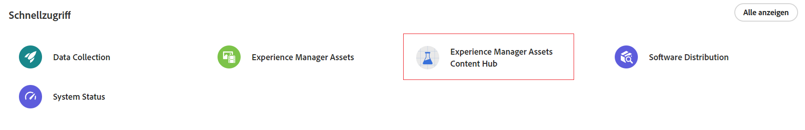

# Bereitstellen von Content Hub {#deploy-content-hub}

Content Hub ist als Teil von Experience Manager Assets as a Cloud Service verfügbar, um den Zugriff auf markeninterne Inhalte für Unternehmen und ihre Geschäftspartner zu demokratisieren.

Die Assets, die in Experience Manager Assets as a Cloud Service als „Genehmigt“ markiert sind, sind in Content Hub für die Asset-Verteilung verfügbar.

Dieser Artikel enthält einen durchgängigen Arbeitsablauf zur Bereitstellung von Content Hub-Assets für Benutzende, einschließlich der Berechtigungsvarianten basierend auf ihren Anforderungen.

Zu den verschiedenen Berechtigungen für Content Hub gehören:

* [Content Hub-Benutzende](#onboard-content-hub-users): Haben Zugriff auf markenkonforme Assets im Content Hub-Portal.

* [Content Hub-Admins](#onboard-content-hub-administrator): Haben Zugriff auf die [Benutzeroberfläche „Konfiguration“](/help/assets/configure-content-hub-ui-options.md) in Content Hub. Außerdem können sie auf markenkonforme Assets zugreifen, Assets in Content Hub hochladen und die Adobe Express-Integration zum Bearbeiten von Bildern verwenden (wenn sie über Adobe Express-Berechtigungen verfügen).

* [Content Hub-Benutzende mit Berechtigungen zum Hinzufügen von Assets](#onboard-content-hub-users-add-assets): Können [Assets in Content Hub hochladen](/help/assets/upload-brand-approved-assets.md) sowie auf markenkonforme Assets im Content Hub-Portal zugreifen.

* [Content Hub-Benutzende mit Berechtigungen zum Remixen von Assets in neue Varianten](#onboard-content-hub-users-remix-assets): [Adobe Express-Integration](/help/assets/edit-images-content-hub.md) (wenn sie über Adobe Express-Berechtigungen verfügen) sowie Zugriff auf markenkonforme Assets im Content Hub-Portal.

* [Experience Manager Assets-Benutzende](#experience-manager-assets-users): Können Assets in Experience Manager Assets as a Cloud Service genehmigen, um diese Assets in Content Hub verfügbar zu machen.

In der folgenden Tabelle sind die verfügbaren Content Hub-Benutzertypen, ihre Berechtigungen und die Produktprofile zusammengefasst, die zum Erhalt dieser Berechtigungen erforderlich sind:

| Benutzerrolle | Content Hub-Benutzende | Content Hub-Benutzende mit Berechtigungen zum Hinzufügen von Assets | Content Hub-Benutzende mit Berechtigungen zum Remixen von Assets | Content Hub-Admins |
|---------------|----------|----------|-------------------------|---|
| **Funktionen** |
| Zugriff auf markenkonforme Assets im Content Hub-Portal | ✓ | ✓ | ✓ | ✓ |
| Hochladen von Assets aus dem Content Hub-Portal | − | ✓ | ✓ | ✓ |
| Verwenden der Adobe Express-Integration zum Bearbeiten von Bildern | − | − | ✓ | − |
| Zugriff auf die Konfigurations-Benutzeroberfläche von Content Hub | − | − | − | ✓ |
| **Die Person muss diesen Produktprofilen angehören (Admin Console)** |
| AEM > Bereitstellungsinstanz > Eingeschränkte AEM Assets-Benutzende | ✓ | ✓ | ✓ | ✓ |
| AEM > Produktions-Autoreninstanz > AEM-Benutzende | − | ✓ | ✓ | − |
| AEM > Produktions-Autoreninstanz > AEM-Admins | − | − | − | ✓ |
| Adobe Express | − | − | ✓ | − |
| **Weitere Informationen** | Siehe [Content Hub-Benutzende](#onboard-content-hub-users) | Siehe [Content Hub-Benutzende mit Berechtigungen zum Hinzufügen von Assets](#onboard-content-hub-users-add-assets) | Siehe [Content Hub-Benutzende mit Berechtigungen zum Remixen von Assets in neue Varianten](#onboard-content-hub-users-remix-assets) | Siehe [Content Hub-Admins](#onboard-content-hub-administrator) |

>[!NOTE]
>
>[Experience Manager Assets-Benutzende](#experience-manager-assets-users) haben die Möglichkeit, Assets in einer Umgebung von Experience Manager Assets as a Cloud Service zu genehmigen, um diese Assets in Content Hub zur Verfügung zu stellen. Diese Benutzende müssen über die Admin Console unter AEM in der Produktions-Autoreninstanz als AEM-Benutzerprofil hinzugefügt werden.

## Schritt 1: Aktivieren von Content Hub für Experience Manager Assets mithilfe von Cloud Manager {#enable-content-hub}

Für den Zugriff auf das Content Hub-Portal müssen Administratoren zunächst Content Hub für Experience Manager Assets as a Cloud Service mithilfe von Cloud Manager aktivieren.

### Berechtigungen {#permissions-edit-program}

Sie müssen über die Rolle Geschäftsinhaber verfügen, um Programme in Cloud Manager zu bearbeiten. Weitere Informationen finden Sie unter [Programme bearbeiten](/help/implementing/cloud-manager/getting-access-to-aem-in-cloud/editing-programs.md).

So aktivieren Sie Content Hub für Experience Manager Assets:

1. Melden Sie sich bei Cloud Manager an. Stellen Sie sicher, dass Sie beim Anmelden die richtige Organisation auswählen. Cloud Manager listet alle Ihre Programme auf.

1. Navigieren Sie zum Programm Experience Manager Assets as a Cloud Service, klicken Sie auf das Symbol für weitere Optionen (…) und wählen Sie **[!UICONTROL Programm bearbeiten]** aus.

   

1. Wählen Sie im Dialogfeld [!UICONTROL Programm bearbeiten] die Registerkarte **[!UICONTROL Lösungen und Add-ons]** aus.

1. Erweitern Sie **[!UICONTROL Assets]** und wählen Sie **[!UICONTROL Content Hub]** aus.
   

   >[!NOTE]
   >
   >Wenn **[!UICONTROL Aktualisieren]** nach Auswahl von Content Hub nicht für Sie aktiviert ist, stellen Sie sicher, dass Sie die Go-Live-Einstellungen für das Programm festgelegt haben.

1. Klicken Sie auf **[!UICONTROL Aktualisieren]**.

Content Hub ist nun für Experience Manager Assets as a Cloud Service aktiviert. Nachdem Sie Content Hub in einer Produktionsumgebung aktiviert haben, ist eine Deaktivierung in einer Self-Service-Umgebung nicht mehr möglich.

>[!NOTE]
>
>Bis zu 250 Content Hub-Benutzende können auf Content Hub zugreifen und dieses Produkt verwenden. Wenden Sie sich bei weiteren Fragen an den Adobe-Support.

Wenn Sie neu bei Experience Manager Assets sind, klicken Sie auf **[!UICONTROL Programm hinzufügen]**, geben Sie dann Programmdetails an (Programmname, für die Produktion eingerichtet) und klicken Sie auf **[!UICONTROL Weiter]**. Anschließend können Sie auf der Registerkarte **[!UICONTROL Lösungen und Add-ons]** die Optionen **[!UICONTROL Assets]** und **[!UICONTROL Content Hub]** auswählen.

### Content Hub-Instanz und -Produktprofil in der Admin Console{#content-hub-instance-product-profile}

Nach der [Aktivierung von Content Hub für Assets as a Cloud Service mithilfe von Cloud Manager](#enable-content-hub) wird in AEM Assets as a Cloud Service eine neue Instanz mit `delivery` als Suffix erstellt:

>[!NOTE]
>
>Wenn Sie Content Hub vor dem 14. August 2024 bereitgestellt haben, wird die neue Instanz mit `contenthub` als Suffix erstellt.

Beachten Sie, dass der Instanzname für Content Hub weder `author` noch `publish` enthält.

Klicken Sie auf den Instanznamen, um das Content Hub-Produktprofil anzuzeigen.

>[!NOTE]
>
>Wenn Sie Content Hub vor dem 14. August 2024 bereitgestellt haben, wird für das Content Hub-Produktprofil nach `Limited Users` anstelle von `delivery` `contenthub` angegeben.

## Schritt 2: Integrieren von Content Hub-Admins {#onboard-content-hub-administrator}

Content Hub-Admins haben Zugriff auf die [Benutzeroberfläche „Konfiguration“](/help/assets/configure-content-hub-ui-options.md) in Content Hub. Außerdem können sie auf markenkonforme Assets zugreifen, Assets in Content Hub hochladen und die Adobe Express-Integration zum Bearbeiten von Bildern verwenden (wenn sie über Adobe Express-Berechtigungen verfügen).

So integrieren Sie eine Person als Content Hub-Admin:

1. [Greifen Sie auf das Content Hub-Benutzerproduktprofil zu und klicken Sie darauf.](#content-hub-instance-product-profile)

1. Klicken Sie auf **[!UICONTROL Benutzer hinzufügen]**, um dem Produktprofil Benutzende oder Benutzergruppen hinzuzufügen.

1. Klicken Sie auf **[!UICONTROL Speichern]**, um die Änderungen zu speichern.

1. Nachdem Sie die Person zum Content Hub-Produktprofil hinzugefügt haben, greifen Sie auf Experience Manager Assets-Produktprofile zu, indem Sie in der Produktliste in der Admin Console auf den Produktnamen AEM as a Cloud Service klicken.

1. Klicken Sie auf die Produktions-Autoreninstanz für AEM as a Cloud Service:
   

   Die Admin Console zeigt zwei Produktprofile für AEM as a Cloud Service an: „Admins“ und „Benutzer“.
1. Klicken Sie auf das Produktprofil „Admins“ und dann auf **[!UICONTROL Benutzer hinzufügen]**, um die Person zum Produktprofil hinzuzufügen.
   

1. Klicken Sie auf **[!UICONTROL Speichern]**, um die Änderungen zu speichern.

## Schritt 3: Integrieren von Content Hub-Benutzenden {#onboard-content-hub-users}

Content Hub-Benutzende können auf Assets zugreifen, die im Portal verfügbar sind, jedoch keine neuen Assets hinzufügen oder vorhandene Assets ändern.

So integrieren Sie Content Hub-Benutzende:

1. [Greifen Sie auf das Content Hub-Benutzerproduktprofil zu und klicken Sie darauf](#content-hub-instance-product-profile).

1. Klicken Sie auf **[!UICONTROL Benutzer hinzufügen]**, um dem Produktprofil Benutzende oder Benutzergruppen hinzuzufügen.

1. Klicken Sie auf **[!UICONTROL Speichern]**, um die Änderungen zu speichern.

Diese Benutzenden können jetzt auf die Assets zugreifen, die im Content Hub-Portal verfügbar sind.

>[!NOTE]
>
>Sie können alle erweiterten Unternehmensfunktionen verwenden, z. B. die Synchronisierung mit externen Identitätsanbietern.

### Wie erfolgt der Zugriff auf Content Hub? {#access-content-hub}

Sie können auf die folgenden Arten auf Content Hub zugreifen:

* Zugriff auf Content Hub über den folgenden Link:

  `https://experience.adobe.com/#/assets/contenthub`

* Melden Sie sich bei `experience.adobe com` an und klicken Sie im Abschnitt **[!UICONTROL Schnellzugriff]** auf **[!UICONTROL Experience Manager Assets Content Hub]**:
  

* Melden Sie sich bei `experience.adobe com` an und klicken Sie im Produktumschalter auf **[!UICONTROL Experience Manager Assets Content Hub]**:
  

### Deaktivieren von E-Mail-Benachrichtigungen für Benutzende {#disable-email-notifications}

Wenn Admins beim Hinzufügen von Benutzenden zum Content Hub-Produktprofil E-Mail-Benachrichtigungen deaktivieren müssen:

Klicken Sie auf das Suchsymbol neben dem Namen des Produktprofils und deaktivieren Sie den Umschalter **[!UICONTROL Benutzer per E-Mail benachrichtigen]**.

## Schritt 4: Integrieren von Content Hub-Benutzenden mit Berechtigungen zum Hinzufügen von Assets (optional) {#onboard-content-hub-users-add-assets}

Content Hub-Benutzende mit Berechtigungen zum Hinzufügen von Assets können [neue markenkonforme Assets in Content Hub hochladen](/help/assets/upload-brand-approved-assets.md).

So integrieren Sie Content Hub-Benutzende mit Berechtigungen zum Hinzufügen von Benutzenden:

1. [Nachdem Sie die Person zum Content Hub-Produktprofil hinzugefügt haben](#onboard-content-hub-users), greifen Sie auf Experience Manager Assets-Produktprofile zu, indem Sie in der Produktliste in der Admin Console auf den Produktnamen AEM as a Cloud Service klicken.

1. Klicken Sie auf die Produktions-Autoreninstanz für AEM as a Cloud Service:
   

   Die Admin Console zeigt zwei Produktprofile für AEM as a Cloud Service an: „Admins“ und „Benutzer“.
1. Klicken Sie auf das Produktprofil „Benutzer“ und klicken Sie auf **[!UICONTROL Benutzer hinzufügen]**, um die Person zum Produktprofil hinzuzufügen.
   

1. Klicken Sie auf **[!UICONTROL Speichern]**, um die Änderungen zu speichern.

## Schritt 4: Integrieren von Content Hub-Benutzenden mit Berechtigungen zum Remixen von Assets in neue Varianten (optional) {#onboard-content-hub-users-remix-assets}

Content Hub-Benutzende mit Berechtigungen zum Remixen von Assets in neue Varianten können [vorhandene Assets mit Adobe Express ändern und das Asset im Repository speichern](/help/assets/edit-images-content-hub.md). Das Bearbeiten von Assets mit Adobe Express ist nur verfügbar, wenn die Person über Adobe Express-Berechtigungen verfügt.

So integrieren Sie Content Hub-Benutzende mit Berechtigungen zum Remixen von Assets in neue Varianten:

1. [Nachdem Sie die Person zum Content Hub-Produktprofil hinzugefügt haben](#onboard-content-hub-users), greifen Sie auf Experience Manager Assets-Produktprofile zu, indem Sie in der Produktliste in der Admin Console auf den Produktnamen AEM as a Cloud Service klicken.

1. Klicken Sie auf die Produktions-Autoreninstanz für AEM as a Cloud Service:
   

   Die Admin Console zeigt zwei Produktprofile für AEM as a Cloud Service an: „Admins“ und „Benutzer“.
1. Klicken Sie auf das Produktprofil „Benutzer“ und klicken Sie auf **[!UICONTROL Benutzer hinzufügen]**, um die Person zum Produktprofil hinzuzufügen.
   

1. Klicken Sie auf **[!UICONTROL Speichern]**, um die Änderungen zu speichern.

## Experience Manager Assets-Benutzende {#experience-manager-assets-users}

Experience Manager Assets-Benutzende können Assets in AEM as a Cloud Service genehmigen, sodass sie in Content Hub verfügbar sind.

So konfigurieren Sie Experience Manager Assets-Benutzende:

1. Greifen Sie auf Experience Manager Assets-Produktprofile zu, indem Sie in der Produktliste in der Admin Console auf den AEM as a Cloud Service-Produktnamen klicken.

1. Klicken Sie auf die Produktions-Autoreninstanz für AEM as a Cloud Service:
   

   Die Admin Console zeigt zwei Produktprofile für AEM as a Cloud Service an: „Admins“ und „Benutzer“.
1. Klicken Sie auf das Produktprofil „Benutzer“ und klicken Sie auf **[!UICONTROL Benutzer hinzufügen]**, um die Person zum Produktprofil hinzuzufügen.
   

1. Klicken Sie auf **[!UICONTROL Speichern]**, um die Änderungen zu speichern.

   >[!NOTE]
   >
   > Sie müssen nicht zum [Content Hub-Produktprofil](#onboard-content-hub-users) für Experience Manager Assets-Benutzende hinzugefügt werden.
