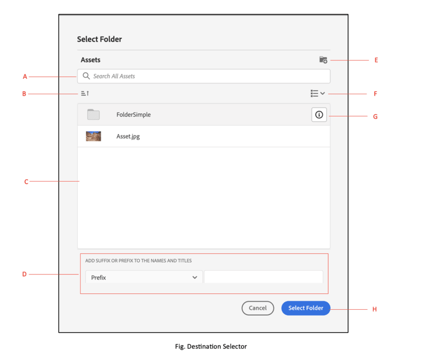

# Zielauswahl für Micro-Frontend {#Overview}

| [Best Practices für die Suche](/help/assets/search-best-practices.md) | [Best Practices für Metadaten](/help/assets/metadata-best-practices.md) | [Content Hub](/help/assets/product-overview.md) | [Dynamic Media mit OpenAPI-Funktionen](/help/assets/dynamic-media-open-apis-overview.md) | [Entwicklerdokumentation zu AEM Assets](https://developer.adobe.com/experience-cloud/experience-manager-apis/) |
| ------------- | --------------------------- |---------|----|-----|

Die Zielauswahl für Micro-Frontend bietet eine Benutzeroberfläche innerhalb Ihrer Anwendung, die sich leicht in das [!DNL Experience Manager Assets as a Cloud Service]-Repository integrieren lässt. Sie können den entsprechenden Ordner im [!DNL Experience Manager Assets as a Cloud Service]-Repository suchen oder durchsuchen und Assets aus Ihrer Anwendung hochladen.

Die Micro-Frontend-Benutzeroberfläche wird über das Zielauswahl-Paket in Ihrer Anwendung verfügbar gemacht. Alle Aktualisierungen des Pakets werden automatisch importiert, und die zuletzt bereitgestellte Zielauswahl wird automatisch in Ihrer Anwendung geladen.


Die Zielauswahl bietet viele Vorteile, z. B.:

* Einfache Integration in Adobe- oder Nicht-Adobe-Anwendungen unter Verwendung der Vanilla JavaScript-Bibliothek.
* Einfach zu verwalten, da Updates des Zielauswahl-Pakets automatisch für die Zielauswahl bereitgestellt werden, die für Ihre Anwendung verfügbar ist. Es sind keine Aktualisierungen innerhalb Ihrer Anwendung erforderlich, um die neuesten Änderungen zu laden.
* Einfachere Anpassung, da Eigenschaften verfügbar sind, die die Anzeige der Zielauswahl in Ihrer Anwendung steuern.
* Volltextsuche, um schnell zu Ordnern zu navigieren, um Assets aus Ihrer Anwendung hochzuladen.
* Möglichkeit, Ordner zu erstellen, Ordner in auf- oder absteigender Reihenfolge zu sortieren und sie in der Listen-, Raster-, Galerie- oder Wasserfallansicht anzuzeigen.

In diesem Artikel soll gezeigt werden, wie die Zielauswahl mit einer [!DNL Adobe]-Anwendung unter Unified Shell verwendet werden kann oder wenn Sie bereits ein imsToken für die Authentifizierung generiert haben. Ein solcher Workflow wird in diesem Artikel als Nicht-SUSI-Fluss bezeichnet.

Führen Sie die folgenden Aufgaben aus, um die Zielauswahl in Ihr [!DNL Experience Manager Assets as a Cloud Service]-Repository zu integrieren und zu verwenden:

* [Zielauswahl mit Vanilla JS integrieren](#integration-with-vanilla-js)
* [Anzeigeeigenschaften der Zielauswahl definieren](#destination-selector-properties)
* [Zielauswahl verwenden](#using-destination-selector)

## Zielauswahl mit Vanilla JS integrieren {#integration-with-vanilla-js}

Sie können jede [!DNL Adobe] oder Nicht-Adobe-Anwendung mit [!DNL Experience Manager Assets] als [!DNL Cloud Service]-Repository integrieren und Assets aus der Anwendung heraus auswählen.

Die Integration erfolgt durch den Import des Zielauswahl-Pakets und die Verbindung zu Assets as a Cloud Service unter Verwendung der Vanilla JavaScript-Bibliothek. Sie müssen eine `index.html` oder eine andere geeignete Datei innerhalb Ihrer Anwendung bearbeiten, um:

* Authentifizierungsdetails zu definieren
* Zugriff auf das Assets as a Cloud Service-Repository zu erhalten
* Anzeigeeigenschaften der Zielauswahl zu konfigurieren

Sie können eine Authentifizierung durchführen, ohne einige der IMS-Eigenschaften zu definieren, wenn:

* Sie eine [!DNL Adobe]-Applikation auf [Unified Shell](https://experienceleague.adobe.com/docs/experience-manager-cloud-service/content/overview/aem-cloud-service-on-unified-shell.html?lang=de) integrieren.
* Für die Authentifizierung wurde bereits ein IMS-Token generiert.

## Voraussetzungen {#prerequisites}

Definieren Sie die Voraussetzungen in der `index.html`-Datei oder einer ähnlichen Datei innerhalb Ihrer Anwendungsimplementierung, um die Authentifizierungsdetails für den Zugriff auf das [!DNL Experience Manager Assets] als [!DNL Cloud Service]-Repository festzulegen. Zu den Voraussetzungen gehören:

* imsOrg
* imsToken
* apikey

## Installation {#installation}

Die Zielauswahl ist sowohl über die ESM CDN-Version (z. B. [esm.sh](https://esm.sh/)/[skypack](https://www.skypack.dev/)) als auch über die [UMD](https://github.com/umdjs/umd)-Version verfügbar.

In Browsern mit **UMD-Version** (empfohlen):

In Browsern mit **UMD-Version** (empfohlen):

```
<script src="https://experience.adobe.com/solutions/CQ-assets-selectors/static-assets/resources/assets-selectors.js"></script>

<script>
  const { renderAssetSelector } = PureJSSelectors;
</script>
```

In Browsern mit `import maps`-Unterstützung mit **ESM CDN-Version**:

```
<script type="module">
  import { AssetSelector } from 'https://experience.adobe.com/solutions/CQ-assets-selectors/static-assets/resources/@assets/selectors/index.js'
</script>
```

In der Deno/Webpack Module Federation mit **ESM CDN-Version**:

```
import { AssetSelector } from 'https://experience.adobe.com/solutions/CQ-assets-selectors/static-assets/resources/@assets/selectors/index.js'
```

### Ausgewähltes Ziel {#selected-destination}

Die Zielauswahl empfängt einen Rückruf von `onItemSelect`, `onTreeToggleItem` oder `onTreeSelectionChange` durch das ausgewählte Verzeichnis, das das Objekt enthält (Verzeichnis, Bild usw.).

**Schemasyntax**

```
interface SelectedDestination {
  id: string;
  children: SelectedDestination[];
  'repo:repositoryId': string;
  'dc:format': string;
  'repo:assetClass': string;
  'storage:directoryType': string;
  'storage:region': string;
  'repo:name': string;
  'repo:path': string;
  'repo:ancestors': string[];
  'repo:createDate': string;
  'storage:assignee':

  { type: string; id: string; }
  ;
  'repo:assetId': string;
  'aem:published': boolean;
  'repo:createdBy': string;
  'repo:state': string;
  'repo:id': string;
  'repo:modifyDate': string;
  _page:

  { orderBy: string; count: number; };
}
```

Die folgende Tabelle beschreibt einige der wichtigen Eigenschaften des ausgewählten Ziels.

| Eigenschaft | Typ | Erklärung |
|---|---|---|
| *repo:repositoryId* | Zeichenfolge | Eindeutige Kennung für das Repository, in dem das Asset gespeichert ist. |
| *repo:id* | Zeichenfolge | Eindeutige Kennung für das Asset. |
| *repo:assetClass* | Zeichenfolge | Die Klassifizierung des Assets (z. B. Bild oder Video, Dokument). |
| *repo:name* | Zeichenfolge | Der Name des Assets, einschließlich der Dateierweiterung. |
| *repo:size* | Number (Zahl) | Die Größe des Assets in Bytes. |
| *repo:path* | Zeichenfolge | Der Speicherort des Assets im Repository. |
| *repo:ancestors* | `Array<string>` | Ein Array von Vorgängerelementen für das Asset im Repository. |
| *repo:state* | Zeichenfolge | Aktueller Status des Assets im Repository (z. B. aktiv, gelöscht). |
| *repo:createdBy* | Zeichenfolge | Die Person oder das System, welches das Asset erstellt hat. |
| *repo:createDate* | Zeichenfolge | Datum und Uhrzeit der Erstellung des Assets. |
| *repo:modifiedBy* | Zeichenfolge | Die Person oder das System, welches das Asset zuletzt geändert hat. |
| *repo:modifyDate* | Zeichenfolge | Datum und Uhrzeit der letzten Änderung des Assets. |
| *dc:format* | Zeichenfolge | Das Format des Assets. |
| *_Seite* | orderBy: Zeichenfolge; Anzahl; Nummer; | Enthält die Seitenzahl des Dokuments. |

Eine vollständige Liste der Eigenschaften und ein ausführliches Beispiel finden Sie unter [Code-Beispiel für Zielauswahl](https://github.com/adobe/aem-assets-selectors-mfe-examples).

### Beispiel für Nicht-SUSI-Fluss {#non-ims-vanilla}

Dieses Beispiel zeigt, wie die Zielauswahl mit einem Nicht-SUSI-Fluss verwendet wird, wenn eine [!DNL Adobe]-Anwendung unter Unified Shell läuft oder wenn Sie bereits `imsToken` für die Authentifizierung generiert haben.

Fügen Sie das Zielauswahl-Paket mit dem `script`-Tag in Ihren Code ein, wie in den _Zeilen 6 bis 15_ des folgenden Beispiels gezeigt. Sobald das Skript geladen ist, kann die globale Variable `PureJSSelectors` verwendet werden. Definieren Sie die [Eigenschaften](#destination-selector-properties) der Zielauswahl, wie in den _Zeilen 16 bis 23_ gezeigt. Die Eigenschaften `imsOrg` und `imsToken` sind beide für die Authentifizierung im Nicht-SUSI-Fluss erforderlich. Die `handleSelection`-Eigenschaft wird verwendet, um die ausgewählten Assets zu behandeln. Um die Zielauswahl zu rendern, rufen Sie die Funktion `renderDestinationSelector` auf, wie in _Zeile 17_ erwähnt. Die Zielauswahl wird im Container-Element `<div>` angezeigt, wie in den _Zeilen 21 und 22_ zu sehen ist.

Wenn Sie diese Schritte befolgen, können Sie die Zielauswahl mit einem Nicht-SUSI-Fluss in Ihrer [!DNL Adobe]-Anwendung verwenden.

```html {line-numbers="true"}
<!DOCTYPE html>
<html>
<head>
    <title>Destination Selector</title>
    <script src="https://experience.adobe.com/solutions/CQ-assets-selectors/assets/resources/assets-selectors.js"></script>
    <script>
        // get the container element in which we want to render the DestinationSelector component
        const container = document.getElementById('destination-selector-container');
        // imsOrg and imsToken are required for authentication in non-SUSI flow
        const destinationSelectorProps = {
            imsOrg: 'example-ims@AdobeOrg',
            imsToken: "example-imsToken",
            apiKey: "example-apiKey-associated-with-imsOrg",
            handleSelection: (assets: SelectedAssetType[]) => {},
        };
        // Call the `renderDestinationSelector` available in PureJSSelectors globals to render DestinationSelector
        PureJSSelectors.renderDestinationSelector(container, destinationselectorprops);
    </script>
</head>

<body>
    <div id="destination-selector-container" style="height: calc(100vh - 80px); width: calc(100vw - 60px); margin: -20px;">
    </div>
</body>

</html>
```

Ein ausführliches Beispiel finden Sie unter [Code-Beispiel für Zielauswahl](https://github.com/adobe/aem-assets-selectors-mfe-examples).

## Verwenden von Zielauswahl-Eigenschaften {#destination-selector-properties}

Sie können die Zielauswahl-Eigenschaften verwenden, um die Wiedergabe der Zielauswahl anzupassen. In der folgenden Tabelle sind die Eigenschaften aufgeführt, mit denen Sie die Zielauswahl anpassen und verwenden können:

| Eigenschaft | Typ | Erforderlich | Standard | Beschreibung |
|---|---|---|---|---|
| *imsOrg* | Zeichenfolge | Ja | | Die Adobe Identity Management System (IMS)-ID, die bei der Bereitstellung von [!DNL Adobe Experience Manager] als [!DNL Cloud Service] für Ihre Organisation zugewiesen wird. Der `imsOrg`-Schlüssel ist erforderlich, damit authentifiziert wird, ob sich die Organisation, auf die Sie zugreifen, unter Adobe IMS befindet oder nicht. |
| *imsToken* | Zeichenfolge | Nein | | Für die Authentifizierung verwendeter IMS-Bearer-Token. `imsToken` ist nicht erforderlich, wenn Sie den SUSI-Fluss verwenden. Es ist jedoch erforderlich, wenn Sie den Nicht-SUSI-Fluss verwenden. |
| *apiKey* | Zeichenfolge | Nein | | API-Schlüssel, der für den Zugriff auf den AEM Discovery-Dienst verwendet wird. `apiKey` ist nicht erforderlich, wenn Sie den SUSI-Fluss verwenden. In einem Nicht-SUSI-Fluss ist es jedoch erforderlich. |
| *rootPath* | Zeichenfolge | Nein | /content/dam/ | Ordnerpfad, aus dem die Zielauswahl Ihre Assets anzeigt. `rootPath` kann auch in Form einer Verkapselung verwendet werden. Beispielsweise lässt bei dem Pfad `/content/dam/marketing/subfolder/` die Zielauswahl nicht zu, dass ein übergeordneter Ordner durchlaufen wird, sondern zeigt nur die untergeordneten Ordner an. |
| *hasMore* | Boolesch | Nein | | Wenn die Anwendung mehr Inhalt anzeigen muss, können Sie diese Eigenschaft verwenden, um ein Ladeprogramm hinzuzufügen, das den Inhalt lädt, damit er in der Anwendung sichtbar wird. Es handelt sich um einen Indikator, der angibt, dass gerade Inhalte geladen werden. |
| *orgName* | Boolesch | Nein | | Es ist der Name der Organisation (wahrscheinlich orgID), die mit AEM verknüpft ist. |
| *initRepoID* | Zeichenfolge | Nein | | Dies ist der Pfad des Assets-Repositorys, den Sie in einer standardmäßigen ersten Ansicht verwenden können. |
| *onCreateFolder* | Zeichenfolge | Nein | | Mit der Eigenschaft `onCreateFolder` können Sie ein Symbol hinzufügen, mit dem ein neuer Ordner in der Anwendung hinzugefügt wird. |
| *onConfirm* | Zeichenfolge | Nein | | Dies ist ein Rückruf, wenn Sie auf die Schaltfläche „Bestätigen“ klicken. |
| *confirmDisabled* | Zeichenfolge | Nein | | Diese Eigenschaft steuert den Umschalter der Schaltfläche „Bestätigen“. |
| *viewType* | Zeichenfolge | Nein | | Die Eigenschaft `viewType` wird verwendet, um die Ansichten anzugeben, die Sie zum Anzeigen von Assets verwenden. |
| *viewTypeOptions* | Zeichenfolge | Nein | | Diese Eigenschaft steht mit der Eigenschaft `viewType` in Beziehung. Sie können eine oder mehrere Ansichten angeben, um Assets anzuzeigen. Verfügbare viewTypeOptions sind: Listenansicht, Rasteransicht, Galerieansicht, Wasserfallansicht und Baumansicht. |
| *itemNameFormatter* | Zeichenfolge | Nein | | Mit dieser Eigenschaft können Sie den Elementnamen formatieren |
| *i18nSymbols* | `Object<{ id?: string, defaultMessage?: string, description?: string}>` | Nein |  | Wenn die OOTB-Übersetzungen für die Bedürfnisse Ihrer Applikation unzureichend sind, können Sie eine Schnittstelle bereitstellen, über die Sie Ihre eigenen lokalisierten Werte durch die `i18nSymbols`-Eigenschaft übergeben können. Wenn Sie über diese Schnittstelle einen Wert übergeben, werden die bereitgestellten Standardübersetzungen überschrieben und stattdessen Ihre eigenen verwendet. Um die Überschreibung vorzunehmen, müssen Sie ein gültiges [Message Descriptor](https://formatjs.io/docs/react-intl/api/#message-descriptor)-Objekt an den Schlüssel von `i18nSymbols` übergeben, den Sie überschreiben möchten. |
| *inlineAlertSetup* | Zeichenfolge | Nein | | Es wird eine Warnmeldung hinzugefügt, die Sie in der Anwendung übermitteln können. Beispielsweise können Sie die Warnmeldung „Sie haben keine Zugriffsberechtigung für diesen Ordner“ hinzufügen. |
| *intl* | Objekt | Nein | | Die Zielauswahl bietet standardmäßige, vorkonfigurierte Übersetzungen. Sie können die Übersetzungssprache auswählen, indem Sie eine gültige Gebietsschema-Zeichenfolge durch die `intl.locale`-Eigenschaft bereitstellen. Zum Beispiel: `intl={{ locale: "es-es" }}` </br></br> Die unterstützten Gebietsschema-Zeichenfolgen folgen den [ISO 639 – Codes](https://www.iso.org/iso-639-language-codes.html) für die Darstellung von Namen von Sprachen. </br></br> Liste der unterstützten Gebietsschemata: Englisch: „en-us“ (Standard), Spanisch: „es-es“, Deutsch: „de-de“, Französisch: „fr-fr“, Italienisch: „it-it“, Japanisch: „ja-jp“, Koreanisch: „ko-kr“, Portugiesisch: „pt-br“, Chinesisch (Vereinfacht): „zh-cn“, Chinesisch (Taiwan): „zh-tw“ |

## Beispiele für die Verwendung der Zielauswahl-Eigenschaften {#usage-examples}

Sie können die [Eigenschaften](#destination-selector-properties) der Zielauswahl in der Datei `index.html` definieren, um die Anzeige der Zielauswahl in Ihrer Anwendung anzupassen.

### Beispiel 1: Erstellen eines Ordners in der Zielauswahl

Mit der Zielauswahl können Sie einen Ordner erstellen, in den Sie Assets an einem bestimmten Speicherort hochladen, verschieben oder kopieren können.


### Beispiel 2: Festlegen des Ansichtstyps der Zielauswahl

Die Zielauswahl zeigt ein breites Spektrum an Assets in vier verschiedenen Ansichten an, einschließlich Listenansicht, Rasteransicht, Galerieansicht und Wasserfallansicht. Um den standardmäßigen Ansichtstyp festzulegen, können Sie die Eigenschaft `viewType` verwenden. Die Eigenschaft `viewTypeOptions` wird zusammen mit der Eigenschaft `viewType` verwendet, um andere Ansichtstypen festzulegen, sodass andere Ansichtstypen in einer Dropdown-Liste angezeigt werden können. Es kann ein einzelnes Argument verwendet werden, wenn nur eine Option angezeigt werden soll.


### Beispiel 3: Initialisieren des Pfads des Asset-Ordners

Verwenden Sie die Eigenschaft `path`, um den Ordnernamen festzulegen, der beim Rendern der Zielauswahl automatisch angezeigt wird.


## Verwenden der Zielauswahl {#using-destination-selector}

Sobald die Zielauswahl eingerichtet ist und Sie für die Verwendung mit Ihrer [!DNL Adobe Experience Manager] as a [!DNL Cloud Service]-Anwendung authentifiziert sind, können Sie Assets auswählen oder verschiedene andere Vorgänge durchführen, um Ihre Assets im Repository zu suchen.



* **A**: [Suchleiste](#search-bar)
* **B**: [Sortierung](#sorting)
* **C**: [Assets](#assets-repo)
* **D**: [Suffix oder Präfix hinzufügen](#add-suffix-or-prefix)
* **E**: [Neuen Ordner erstellen](#create-new-folder)
* **F**: [Ansicht](#types-of-view)
* **G**: [Info](#info)
* **H**: [Ordner auswählen](#select-folder)

### Suchleiste {#search-bar}

Mit der Zielauswahl können Sie eine Volltextsuche nach Assets im ausgewählten Repository durchführen. Wenn Sie zum Beispiel den Suchbegriff `wave` in die Suchleiste eingeben, werden alle Assets angezeigt, die den Suchbegriff `wave` in einer der Metadateneigenschaften enthalten.

### Sortierung {#sorting}

Sie können Assets in der Zielauswahl nach Namen, Dimension oder Größe eines Assets sortieren. Sie können die Assets auch in auf- oder absteigender Reihenfolge sortieren.

### Assets-Repository {#assets-repo}

Mit der Zielauswahl können Sie auch Daten des Repositorys Ihrer Wahl anzeigen, das in der AEM-Anwendung verfügbar ist. Sie können die Eigenschaft `repositoryID` verwenden, um den Pfad des Zielordners zu initialisieren, den Sie in der ersten Instanz der Zielauswahl anzeigen möchten.

### Suffix oder Präfix hinzufügen {#add-suffix-or-prefix}

Dies ist ein Beispiel für die Eigenschaft `optionsFormSetup`. Sie können sie verwenden, um die Auswahl zu bestätigen, und sie wird an das Ereignis `onConfirm` weitergegeben.

### Einee Ordner erstellen {#create-new-folder}

Damit können Sie einen Ordner im Zielordner Ihrer Anwendung [!DNL Adobe Experience Manager] as a [!DNL Cloud Service] erstellen.

### Ansichtstypen {#types-of-view}

Mit der Zielauswahl können Sie das Asset in vier verschiedenen Ansichten anzeigen:

*  [!UICONTROL **Listenansicht**]: Die Listenansicht zeigt scrollbare Dateien und Ordner in einer Spalte an.
*  [!UICONTROL **Rasteransicht**]: Die Rasteransicht zeigt scrollbare Dateien und Ordner in einem Raster aus Zeilen und Spalten an.
*  [!UICONTROL **Galerieansicht**]: Die Galerie-Ansicht zeigt Dateien oder Ordner in einer zentrierten horizontalen Liste an.
*  [!UICONTROL **Wasserfallansicht**]: Die Wasserfallansicht zeigt Dateien oder Ordner in Form einer Brücke an.

### Info {#info}

Über das Informations- oder Infosymbol können Sie die Metadaten des ausgewählten Assets anzeigen. Sie enthalten verschiedene Details wie Dimensionen, Größe, Beschreibung, Pfad, Änderungsdatum und Erstellungsdatum. Die Metadateninformationen werden beim Hochladen, Kopieren oder Erstellen eines Assets bereitgestellt.

### Ordner auswählen {#select-folder}

Mit der Schaltfläche „Ordner auswählen“ können Sie Assets für verschiedene Vorgänge auswählen, die mit [Eigenschaften](#destination-selector-properties) in der Zielauswahl verbunden sind.
