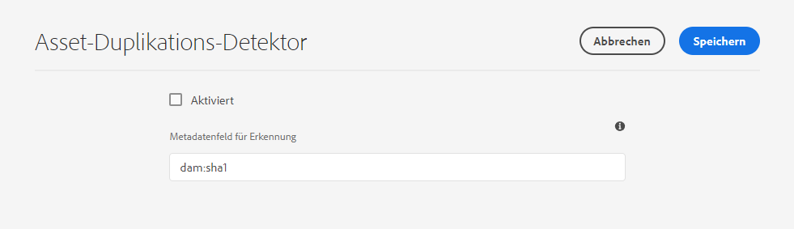
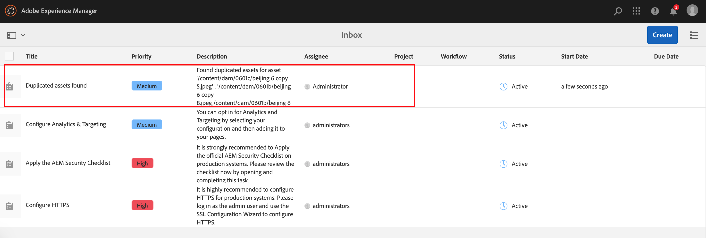

# Erkennen doppelter Assets {#detect-duplicate-assets}

<table>
    <tr>
        <td>
            <i>Neu</i> <a href="/help/assets/dynamic-media/dm-prime-ultimate.md"><b>Dynamic Media Prime und Ultimate</b></a>
        </td>
        <td>
            <i>Neu</i> <a href="/help/assets/assets-ultimate-overview.md"><b>AEM Assets Ultimate</b></a>
        </td>
        <td>
            <i>Neu</i> <a href="/help/assets/integrate-aem-assets-edge-delivery-services.md"><b>AEM Assets-Integration mit Edge Delivery Services</b></a>
        </td>
        <td>
            <i>Neu</i> <a href="/help/assets/aem-assets-view-ui-extensibility.md"><b>Erweiterbarkeit der Benutzeroberfläche</b></a>
        </td>
          <td>
            <i>Neu</i> <a href="/help/assets/dynamic-media/enable-dynamic-media-prime-and-ultimate.md"><b>Aktivieren von Dynamic Media Prime und Ultimate</b></a>
        </td>
    </tr>
    <tr>
        <td>
            <a href="/help/assets/search-best-practices.md"><b>Best Practices für die Suche</b></a>
        </td>
        <td>
            <a href="/help/assets/metadata-best-practices.md"><b>Best Practices für Metadaten</b></a>
        </td>
        <td>
            <a href="/help/assets/product-overview.md"><b>Content Hub</b></a>
        </td>
        <td>
            <a href="/help/assets/dynamic-media-open-apis-overview.md"><b>Dynamic Media mit OpenAPI-Funktionen</b></a>
        </td>
        <td>
            <a href="https://developer.adobe.com/experience-cloud/experience-manager-apis/"><b>Entwicklerdokumentation zu AEM Assets</b></a>
        </td>
    </tr>
</table>

| Version | Artikel-Link |
| -------- | ---------------------------- |
| AEM 6.5 | [Hier klicken](https://experienceleague.adobe.com/docs/experience-manager-65/assets/managing/duplicate-detection.html?lang=de) |
| AEM as a Cloud Service | Dieser Artikel |

Wenn ein DAM-Benutzer ein oder mehrere Assets hochlädt, die bereits im Repository vorhanden sind, erkennt [!DNL Experience Manager] das Duplikat und benachrichtigt den Benutzer. Die Erkennung von Duplikaten ist standardmäßig deaktiviert, da sie je nach Größe des Repositorys und der Anzahl der hochgeladenen Assets die Leistung beeinträchtigen kann.

So aktivieren Sie die Funktion:

1. Gehen Sie zu **[!UICONTROL Tools > Assets > Assets-Konfigurationen]**.

1. Klicken Sie auf **[!UICONTROL Asset-Duplikaterkennung]**.

1. Klicken Sie auf der [!UICONTROL Seite zur Asset-Duplikaterkennung] auf **[!UICONTROL Aktiviert]**.

   Der `dam:sha1`-Wert für das Feld „Metadaten erkennen“ stellt sicher, dass doppelte Assets erkannt werden, auch wenn die Dateinamen unterschiedlich sind.

1. Klicken Sie auf **[!UICONTROL Speichern]**.

   

>[!NOTE]
>
>Wenn Sie die Duplikaterkennung mit der Konfigurationsdatei `/apps/example/config.author/com.adobe.cq.assetcompute.impl.assetprocessor.AssetDuplicationDetector.cfg.json` (OSGi-Konfiguration) verwenden, können Sie sie weiterhin verwenden. Adobe empfiehlt jedoch die Verwendung der neuen Methode.

Nach der Aktivierung sendet Experience Manager Benachrichtigungen über doppelte Assets an den Posteingang von Experience Manager. Dabei handelt es sich um ein aggregiertes Ergebnis für mehrere Duplikate. Benutzer können die Assets anhand der Ergebnisse entfernen.

>[!NOTE]
>
>Wenn Sie Assets in das Repository hochladen, erkennt Experience Manager Duplikate und benachrichtigt Sie über die ersten 100 doppelt vorhandenen Assets.
