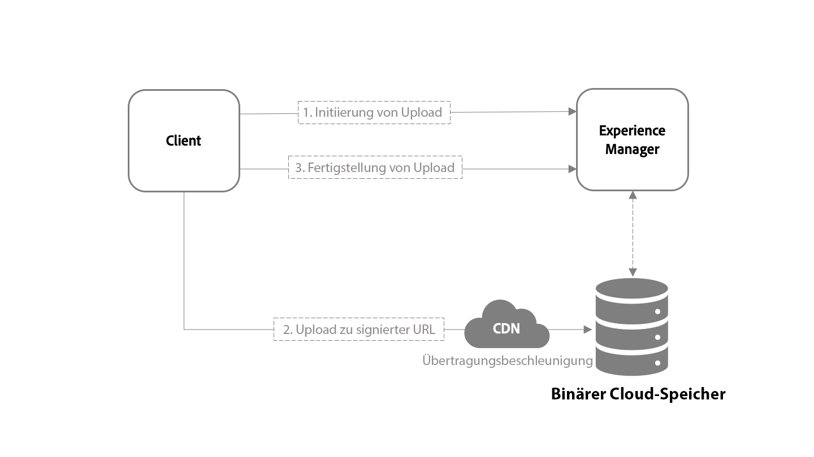

# [!DNL Adobe Experience Manager Assets] Nutzungsszenarien, APIs und Referenzmaterial für Entwickelnde {#assets-cloud-service-apis}

| [Best Practices für die Suche](/help/assets/search-best-practices.md) | [Best Practices für Metadaten](/help/assets/metadata-best-practices.md) | [Content Hub](/help/assets/product-overview.md) | [Dynamic Media mit OpenAPI-Funktionen](/help/assets/dynamic-media-open-apis-overview.md) | [Entwicklerdokumentation zu AEM Assets](https://developer.adobe.com/experience-cloud/experience-manager-apis/) |
| ------------- | --------------------------- |---------|----|-----|

Der Artikel enthält Empfehlungen, Referenzmaterialien und Ressourcen für Entwickler von [!DNL Assets] as a [!DNL Cloud Service]. Er enthält ein neues Modul für den Asset-Upload, eine API-Referenz und Informationen über die Unterstützung, die in Nachbearbeitungs-Workflows bereitgestellt wird.

## [!DNL Experience Manager Assets]-APIs und -Vorgänge {#use-cases-and-apis}

[!DNL Assets] as a [!DNL Cloud Service] bietet mehrere APIs für die programmgesteuerte Interaktion mit digitalen Assets. Jede API unterstützt spezifische Anwendungsfälle, wie in der folgenden Tabelle beschrieben. Die [!DNL Assets]-Benutzeroberfläche, das [!DNL Experience Manager]-Desktop-Programm und [!DNL Adobe Asset Link] unterstützen alle oder einige der Vorgänge.

>[!CAUTION]
>
>Einige APIs existieren weiterhin, werden jedoch nicht aktiv unterstützt (mit einem × gekennzeichnet). Verwenden Sie diese APIs nach Möglichkeit nicht.

| Unterstützungsebene | Beschreibung |
| ------------- | --------------------------- |
| ✓ | Unterstützt |
| × | Nicht unterstützt. Nicht verwenden. |
| - | Nicht verfügbar |

| Nutzungsszenario | [aem-upload](https://github.com/adobe/aem-upload) | [Experience Manager/Sling/JCR](https://www.adobe.io/experience-manager/reference-materials/cloud-service/javadoc/index.html)-Java-APIs | [Asset Compute Service](https://experienceleague.adobe.com/docs/asset-compute/using/extend/understand-extensibility.html?lang=de) | [[!DNL Assets] HTTP-API](https://experienceleague.adobe.com/docs/experience-manager-cloud-service/assets/admin/mac-api-assets.html?lang=de#create-an-asset) | Sling [GET](https://sling.apache.org/documentation/bundles/rendering-content-default-get-servlets.html)/[POST](https://sling.apache.org/documentation/bundles/manipulating-content-the-slingpostservlet-servlets-post.html) Servlets | [GraphQL](https://experienceleague.adobe.com/docs/experience-manager-learn/getting-started-with-aem-headless/graphql/overview.html?lang=de) |
| ----------------|:---:|:---:|:---:|:---:|:---:|:---:|
| **Ursprüngliche Binärdatei** |  |  |  |  |  |  |
| Original erstellen | ✓ | × | - | × | × | - |
| Original lesen | - | × | ✓ | ✓ | ✓ | - |
| Original aktualisieren | ✓ | × | ✓ | × | × | - |
| Original löschen | - | ✓ | - | ✓ | ✓ | - |
| Original kopieren | - | ✓ | - | ✓ | ✓ | - |
| Original verschieben | - | ✓ | - | ✓ | ✓ | - |
| **Metadaten** |  |  |  |  |  |  |
| Metadaten erstellen | - | ✓ | ✓ | ✓ | ✓ | - |
| Metadaten lesen | - | ✓ | - | ✓ | ✓ | - |
| Metadaten aktualisieren | - | ✓ | ✓ | ✓ | ✓ | - |
| Metadaten löschen | - | ✓ | ✓ | ✓ | ✓ | - |
| Metadaten kopieren | - | ✓ | - | ✓ | ✓ | - |
| Metadaten verschieben | - | ✓ | - | ✓ | ✓ | - |
| **Inhaltsfragmente** |  |  |  |  |  |  |
| Inhaltsfragmente erstellen | - | ✓ | - | ✓ | - | - |
| Inhaltsfragmente lesen | - | ✓ | - | ✓ | - | ✓ |
| Inhaltsfragmente aktualisieren | - | ✓ | - | ✓ | - | - |
| Inhaltsfragmente löschen | - | ✓ | - | ✓ | - | - |
| Inhaltsfragmente kopieren | - | ✓ | - | ✓ | - | - |
| Inhaltsfragmente verschieben | - | ✓ | - | ✓ | - | - |
| **Versionen** |  |  |  |  |  |  |
| Version erstellen | ✓ | ✓ | - | - | - | - |
| Version lesen | - | ✓ | - | - | - | - |
| Version löschen | - | ✓ | - | - | - | - |
| **Ordner** |  |  |  |  |  |  |
| Ordner erstellen | ✓ | ✓ | - | ✓ | - | - |
| Ordner lesen | - | ✓ | - | ✓ | - | - |
| Ordner löschen | ✓ | ✓ | - | ✓ | - | - |
| Ordner kopieren | ✓ | ✓ | - | ✓ | - | - |
| Ordner verschieben | ✓ | ✓ | - | ✓ | - | - |

## Asset-Upload {#asset-upload}

In [!DNL Experience Manager] as a [!DNL Cloud Service] können Sie die Assets mithilfe der HTTP-API direkt in den Cloud-Speicher hochladen. Die Schritte zum Hochladen einer Binärdatei werden unten beschrieben. Führen Sie diese Schritte in einer externen Anwendung und nicht in der [!DNL Experience Manager] JVM aus.

1. [Senden einer HTTP-Anfrage](#initiate-upload). Diese informiert die [!DNL Experience Manage]r-Bereitstellung über Ihre Absicht, eine neue Binärdatei hochzuladen.
1. [Bereitstellen (PUT) des Inhalts der Binärdatei](#upload-binary) an einen oder mehrere URIs, die von der Initiierungsanfrage bereitgestellt werden.
1. [Senden einer HTTP-Anfrage](#complete-upload), um den Server darüber zu informieren, dass der Inhalt der Binärdatei erfolgreich hochgeladen wurde.



>[!IMPORTANT]
>
>Führen Sie die oben genannten Schritte in einer externen Anwendung und nicht in der [!DNL Experience Manager] JVM aus.

Der Ansatz bietet eine skalierbare und leistungsfähigere Handhabung von Asset-Uploads. Die Unterschiede im Vergleich zu [!DNL Experience Manager] 6.5 sind:

* Binärdateien durchlaufen nicht [!DNL Experience Manager], das jetzt lediglich den Upload-Prozess mit dem für die Bereitstellung konfigurierten binären Cloud-Speicher koordiniert.
* Der binäre Cloud-Speicher funktioniert mit einem Content Delivery Network (CDN) oder einem Edge-Netzwerk. Ein CDN wählt einen Upload-Endpunkt aus, der für einen Client näher liegt. Wenn Daten eine kürzere Entfernung zu einem nahe gelegenen Endpunkt zurücklegen, verbessern sich die Upload-Leistung und das Benutzererlebnis, insbesondere für geografisch verteilte Teams.

>[!NOTE]
>
>Informationen zum Implementieren dieses Ansatzes finden Sie im Client-Code in der Open-Source-Bibliothek [aem-upload](https://github.com/adobe/aem-upload).
>
>[!IMPORTANT]
>
>Unter bestimmten Umständen werden Änderungen zwischen den Anforderungen an Experience Manager aufgrund der konsistenten Speicherung im Cloud Service nicht vollständig weitergegeben. Dies führt zu 404-Antworten bei der Initiierung oder Beendigung von Upload-Aufrufen, da die erforderlichen Ordnererstellungen nicht weitergegeben werden. Kunden sollten mit 404-Antworten rechnen und diese durch die Implementierung einer Wiederholung mit einer Back-off-Strategie handhaben.

### Initiieren des Uploads {#initiate-upload}

Senden Sie eine HTTP-POST-Anfrage an den gewünschten Ordner. Assets werden in diesem Ordner erstellt oder aktualisiert. Schließen Sie den Selektor `.initiateUpload.json` ein, um anzugeben, dass die Anfrage darin besteht, den Upload einer Binärdatei zu starten. Der Pfad zum Ordner, in dem das Asset erstellt werden soll, lautet beispielsweise `/assets/folder`. Die POST-Anfrage ist `POST https://[aem_server]:[port]/content/dam/assets/folder.initiateUpload.json`.

Der Content-Typ des Anfragetexts sollte `application/x-www-form-urlencoded`-Formulardaten sein, die die folgenden Felder enthalten:

* `(string) fileName`: Erforderlich. Der Name des Assets, wie er in [!DNL Experience Manager] angezeigt wird.
* `(number) fileSize`: Erforderlich. Die Dateigröße des hochgeladenen Assets in Byte.

Eine einzige Anfrage kann dazu verwendet werden, Uploads für mehrere Binärdateien zu initiieren, solange jede Binärdatei die erforderlichen Felder enthält. Bei Erfolg wird die Anfrage mit einem `201`-Status-Code und einem Text mit JSON-Daten im folgenden Format beantwortet:

```json
{
    "completeURI": "(string)",
    "folderPath": "(string)",
    "files": [
        {
            "fileName": "(string)",
            "mimeType": "(string)",
            "uploadToken": "(string)",
            "uploadURIs": [
                "(string)"
            ],
            "minPartSize": (number),
            "maxPartSize": (number)
        }
    ]
}
```

* `completeURI` (Zeichenfolge): Diese URI aufrufen, wenn das Hochladen der Binärdatei abgeschlossen ist. Die URI kann eine absolute oder relative URI sein. Clients sollten in der Lage sein, beide Fälle zu handhaben. Das heißt, dass der Wert `"https://[aem_server]:[port]/content/dam.completeUpload.json"` oder `"/content/dam.completeUpload.json"` sein kann. Siehe [Abschließen des Hochladens ](#complete-upload).
* `folderPath` (Zeichenfolge): Vollständiger Pfad zum Ordner, in den die Binärdatei hochgeladen wird.
* `(files)` (Array): Eine Liste der Elemente, deren Länge und Reihenfolge mit der Länge und Reihenfolge der Liste der binären Informationen übereinstimmen, die in der Anfrage zum Initiieren bereitgestellt werden.
* `fileName` (Zeichenfolge): Der Name der entsprechenden Binärdatei, wie in der Anfrage zum Initiieren angegeben. Dieser Wert sollte in der vollständigen Anfrage enthalten sein.
* `mimeType` (Zeichenfolge): Der Mime-Typ der entsprechenden Binärdatei, wie der Initiierungsanfrage angegeben. Dieser Wert sollte in der vollständigen Anfrage enthalten sein.
* `uploadToken` (Zeichenfolge): Ein Upload-Token für die entsprechende Binärdatei. Dieser Wert sollte in der vollständigen Anfrage enthalten sein.
* `uploadURIs` (Array): Eine Liste der Zeichenfolgen, deren Werte vollständige URIs sind, in die der binäre Inhalt hochgeladen werden soll (siehe [Hochladen der Binärdatei](#upload-binary)).
* `minPartSize` (Zahl): Die Mindestlänge (in Byte) der Daten, die für einen der `uploadURIs` bereitgestellt werden können, wenn mehr als ein URI vorhanden ist.
* `maxPartSize` (Zahl): Die maximale Länge (in Byte) der Daten, die für einen der `uploadURIs` bereitgestellt werden können, wenn mehr als ein URI vorhanden ist.

### Hochladen der Binärdatei {#upload-binary}

Die Ausgabe beim Initiieren eines Uploads umfasst einen oder mehrere Upload-URI-Werte. Wenn mehr als ein URI angegeben wird, teilt der Client die Binärdatei auf und sendet PUT-Anfragen für jeden Teil in der richtigen Reihenfolge an die bereitgestellten Upload-URIs. Wenn Sie die Binärdatei in Teile aufteilen, beachten Sie die folgenden Richtlinien:

* Jeder Teil, mit Ausnahme des letzten, muss eine Größe haben, die größer oder gleich `minPartSize` ist.
* Jeder Teil muss kleiner oder gleich `maxPartSize` sein.
* Wenn die Größe Ihrer Binärdatei `maxPartSize` überschreitet, teilen Sie die Binärdatei in Teile auf, um sie hochzuladen.
* Sie müssen nicht alle URIs verwenden.

Wenn die Größe Ihrer Binärdatei kleiner oder gleich `maxPartSize` ist, können Sie stattdessen die gesamte Binärdatei in einen einzelnen Upload-URI hochladen. Wenn mehr als ein Upload-URI angegeben wird, verwenden Sie den ersten und ignorieren Sie den Rest. Sie müssen nicht alle URIs verwenden.

CDN-Edge-Knoten beschleunigen das angeforderte Hochladen von Binärdateien.

Die einfachste Möglichkeit, dies zu erreichen, besteht darin, den Wert von `maxPartSize` als Größe der Teile zu verwenden. Der API-Vertrag garantiert, dass ausreichend Upload-URIs zum Hochladen Ihrer Binärdatei vorhanden sind, wenn Sie diesen Wert als Größe der Teile verwenden. Teilen Sie dazu die Binärdatei in Teile mit der Größe `maxPartSize` auf, wobei für jeden Teil ein URI in der richtigen Reihenfolge verwendet wird. Der letzte Teil kann kleiner oder gleich `maxPartSize` sein. Angenommen, die Gesamtgröße der Binärdatei beträgt 20.000 Bytes, die `minPartSize` ist 5.000 Bytes, `maxPartSize` ist 8.000 Bytes und die Anzahl der Upload-URIs beträgt 5. Führen Sie die folgenden Schritte aus:

* Laden Sie die ersten 8.000 Byte der Binärdatei mit dem ersten Upload-URI hoch.
* Laden Sie die zweiten 8.000 Byte der Binärdatei mit dem zweiten Upload-URI hoch.
* Laden Sie die letzten 4.000 Byte der Binärdatei mit dem dritten Upload-URI hoch. Da dies der letzte Teil ist, muss er nicht größer als `minPartSize` sein.
* Sie müssen die letzten beiden Upload-URIs nicht verwenden. Sie können sie ignorieren.

Ein häufiger Fehler ist die Berechnung der Größe der Teile auf der Grundlage der Anzahl der von der API bereitgestellten Upload-URIs. Der API-Vertrag garantiert nicht, dass dieser Ansatz funktioniert, und kann tatsächlich zu Teilegrößen führen, die außerhalb des Bereichs zwischen `minPartSize` und `maxPartSize` liegen. Dies kann zu Fehlern beim Hochladen von Binärdateien führen.

Noch einmal: Am einfachsten und sichersten ist es, einfach Teile mit der Größe der `maxPartSize` zu verwenden.

Bei erfolgreicher Ausführung des Uploads antwortet der Server auf jede Anfrage mit Status-Code `201`.

>[!NOTE]
>
>Weitere Informationen zum Upload-Algorithmus finden Sie in der [Offiziellen Funktionsdokumentation](https://jackrabbit.apache.org/oak/docs/features/direct-binary-access.html#Upload) und in der [API-Dokumentation](https://jackrabbit.apache.org/oak/docs/apidocs/org/apache/jackrabbit/api/binary/BinaryUpload.html) im Apache Jackrabbit Oak-Projekt.

### Abschließen des Uploads {#complete-upload}

Nachdem alle Teile einer Binärdatei hochgeladen wurden, senden Sie eine HTTP-POST-Anfrage an den vollständigen URI, der von den Initiierungsdaten bereitgestellt wird. Der Content-Typ des Anfragetexts sollte `application/x-www-form-urlencoded`-Formulardaten sein, die die folgenden Felder enthalten.

| Felder | Typ | Erforderlich oder nicht | Beschreibung |
|---|---|---|---|
| `fileName` | Zeichenfolge | Erforderlich | Der Name des Assets, wie in den Initiierungsdaten angegeben. |
| `mimeType` | Zeichenfolge | Erforderlich | Der HTTP-Content-Typ der Binärdatei, wie in den Initiierungsdaten angegeben. |
| `uploadToken` | Zeichenfolge | Erforderlich | Upload-Token für die Binärdatei, wie in den Initiierungsdaten angegeben. |
| `createVersion` | Boolesch | Optional | Wenn `True` und ein Asset mit dem angegebenen Namen existiert, erstellt [!DNL Experience Manager] eine neue Version des Assets. |
| `versionLabel` | Zeichenfolge | Optional | Wenn eine neue Version erstellt wird, die Bezeichnung, die der neuen Version eines Assets zugeordnet ist. |
| `versionComment` | Zeichenfolge | Optional | Wenn eine neue Version erstellt wird, die Kommentare, die der Version zugeordnet sind. |
| `replace` | Boolesch | Optional | Wenn `True` und ein Asset mit dem angegebenen Namen existiert, löscht [!DNL Experience Manager] das Asset und erstellt es dann erneut. |
| `uploadDuration` | Zahl | Optional | Die Gesamtzeit in Millisekunden, in der die Datei vollständig hochgeladen wurde. Falls angegeben, wird die Upload-Dauer zur Analyse der Übertragungsrate in die Protokolldateien des Systems aufgenommen. |
| `fileSize` | Zahl | Optional | Die Größe der Datei in Byte. Falls angegeben, wird die Dateigröße zur Analyse der Übertragungsrate in die Protokolldateien des Systems aufgenommen. |

>[!NOTE]
>
>Wenn das Asset existiert und weder `createVersion` noch `replace` angegeben ist, aktualisiert [!DNL Experience Manager] die aktuelle Version des Assets mit der neuen Binärdatei.

Wie beim Initiierungsprozess können die vollständigen Anfragedaten Informationen zu mehr als einer Datei enthalten.

Das Hochladen einer Binärdatei wird erst durchgeführt, wenn die vollständige URL für die Datei aufgerufen wurde. Ein Asset wird verarbeitet, nachdem der Upload-Vorgang abgeschlossen ist. Die Verarbeitung wird nicht gestartet, auch wenn die Binärdatei des Assets vollständig hochgeladen wurde, der Upload-Vorgang jedoch nicht abgeschlossen ist. Bei erfolgreichem Upload antwortet der Server mit dem Status-Code `200`.

### Beispiel-Shell-Skript zum Hochladen von Assets in AEM as a Cloud Service {#upload-assets-shell-script}

Der mehrstufige Hochladeprozess für den direkten Binärzugriff innerhalb von AEM as a Cloud Service ist im folgenden Beispiel-Shell-Skript `aem-upload.sh` dargestellt:

```bash
#!/bin/bash

# Check if pv is installed
if ! command -v pv &> /dev/null; then
    echo "Error: 'pv' command not found. Please install it before running the script."
    exit 1
fi

# Check if jq is installed
if ! command -v jq &> /dev/null; then
    echo "Error: 'jq' command not found. Please install it before running the script."
    exit 1
fi

# Set DEBUG to true to enable debug statements
DEBUG=true

# Function for printing debug statements
function debug() {
    if [ "${DEBUG}" = true ]; then
        echo "[DEBUG] $1"
    fi
}

# Function to check if a file exists
function file_exists() {
    [ -e "$1" ]
}

# Function to check if a path is a directory
function is_directory() {
    [ -d "$1" ]
}

# Check if the required number of parameters are provided
if [ "$#" -ne 4 ]; then
    echo "Usage: $0 <aem-url> <asset-folder> <file-to-upload> <bearer-token>"
    exit 1
fi

AEM_URL="$1"
ASSET_FOLDER="$2"
FILE_TO_UPLOAD="$3"
BEARER_TOKEN="$4"

# Extracting file name or folder name from the file path
NAME=$(basename "${FILE_TO_UPLOAD}")

# Step 1: Check if "file-to-upload" is a folder
if is_directory "${FILE_TO_UPLOAD}"; then
    echo "Uploading files from the folder recursively..."
    
    # Recursively upload files in the folder
    find "${FILE_TO_UPLOAD}" -type f | while read -r FILE_PATH; do
        FILE_NAME=$(basename "${FILE_PATH}")
        debug "Uploading file: ${FILE_PATH}"
        
        # You can choose to initiate upload for each file here
        # For simplicity, let's assume you use the same ASSET_FOLDER for all files
        ./aem-upload.sh "${AEM_URL}" "${ASSET_FOLDER}" "${FILE_PATH}" "${BEARER_TOKEN}"
    done
else
    # "file-to-upload" is a single file
    FILE_NAME="${NAME}"

    # Step 2: Calculate File Size
    FILE_SIZE=$(stat -c %s "${FILE_TO_UPLOAD}")

    # Step 3: Initiate Upload
    INITIATE_UPLOAD_ENDPOINT="${AEM_URL}/content/dam/${ASSET_FOLDER}.initiateUpload.json"

    debug "Initiating upload..."
    debug "Initiate Upload Endpoint: ${INITIATE_UPLOAD_ENDPOINT}"
    debug "File Name: ${FILE_NAME}"
    debug "File Size: ${FILE_SIZE}"

    INITIATE_UPLOAD_RESPONSE=$(curl -X POST \
        -H "Authorization: Bearer ${BEARER_TOKEN}" \
        -H "Content-Type: application/x-www-form-urlencoded; charset=UTF-8" \
        -d "fileName=${FILE_NAME}" \
        -d "fileSize=${FILE_SIZE}" \
        ${INITIATE_UPLOAD_ENDPOINT})

    # Continue with the rest of the script...
fi


# Check if the response body contains the specified HTML content for a 404 error
if echo "${INITIATE_UPLOAD_RESPONSE}" | grep -q "<title>404 Specified folder not found</title>"; then
    echo "Folder not found. Creating the folder..."

    # Attempt to create the folder
    CREATE_FOLDER_ENDPOINT="${AEM_URL}/api/assets/${ASSET_FOLDER}"

    debug "Creating folder..."
    debug "Create Folder Endpoint: ${CREATE_FOLDER_ENDPOINT}"

    CREATE_FOLDER_RESPONSE=$(curl -X POST \
        -H "Content-Type: application/json" \
        -H "Authorization: Bearer ${BEARER_TOKEN}" \
        -d '{"class":"'${ASSET_FOLDER}'","properties":{"title":"'${ASSET_FOLDER}'"}}' \
        ${CREATE_FOLDER_ENDPOINT})

    # Check the response code and inform the user accordingly
    STATUS_CODE_CREATE_FOLDER=$(echo "${CREATE_FOLDER_RESPONSE}" | jq -r '.properties."status.code"')
    case ${STATUS_CODE_CREATE_FOLDER} in
        201)
            echo "Folder created successfully. Initiating upload again..."

            # Retry Initiate Upload after creating the folder
            INITIATE_UPLOAD_RESPONSE=$(curl -X POST \
                -H "Authorization: Bearer ${BEARER_TOKEN}" \
                -H "Content-Type: application/x-www-form-urlencoded; charset=UTF-8" \
                -d "fileName=${FILE_NAME}" \
                -d "fileSize=${FILE_SIZE}" \
                ${INITIATE_UPLOAD_ENDPOINT})
            ;;
        409)
            echo "Error: Folder already exists."
            ;;
        412)
            echo "Error: Precondition failed. Root collection cannot be found or accessed."
            exit 1
            ;;
        500)
            echo "Error: Internal Server Error. Something went wrong."
            exit 1
            ;;
        *)
            echo "Error: Unexpected response code ${STATUS_CODE_CREATE_FOLDER}"
            exit 1
            ;;
    esac
fi

# Extracting values from the response
FOLDER_PATH=$(echo "${INITIATE_UPLOAD_RESPONSE}" | jq -r '.folderPath')
UPLOAD_URIS=($(echo "${INITIATE_UPLOAD_RESPONSE}" | jq -r '.files[0].uploadURIs[]'))
UPLOAD_TOKEN=$(echo "${INITIATE_UPLOAD_RESPONSE}" | jq -r '.files[0].uploadToken')
MIME_TYPE=$(echo "${INITIATE_UPLOAD_RESPONSE}" | jq -r '.files[0].mimeType')
MIN_PART_SIZE=$(echo "${INITIATE_UPLOAD_RESPONSE}" | jq -r '.files[0].minPartSize')
MAX_PART_SIZE=$(echo "${INITIATE_UPLOAD_RESPONSE}" | jq -r '.files[0].maxPartSize')
COMPLETE_URI=$(echo "${INITIATE_UPLOAD_RESPONSE}" | jq -r '.completeURI')

# Extracting "Affinity-cookie" from the response headers
AFFINITY_COOKIE=$(echo "${INITIATE_UPLOAD_RESPONSE}" | grep -i 'Affinity-cookie' | awk '{print $2}')

debug "Folder Path: ${FOLDER_PATH}"
debug "Upload Token: ${UPLOAD_TOKEN}"
debug "MIME Type: ${MIME_TYPE}"
debug "Min Part Size: ${MIN_PART_SIZE}"
debug "Max Part Size: ${MAX_PART_SIZE}"
debug "Complete URI: ${COMPLETE_URI}"
debug "Affinity Cookie: ${AFFINITY_COOKIE}"
if $DEBUG; then
    i=1
    for UPLOAD_URI in "${UPLOAD_URIS[@]}"; do
        debug "Upload URI $i: "$UPLOAD_URI
        i=$((i+1))
    done
fi


# Calculate the number of parts needed
NUM_PARTS=$(( (FILE_SIZE + MAX_PART_SIZE - 1) / MAX_PART_SIZE ))
debug "Number of Parts: $NUM_PARTS"

# Calculate the part size for the last chunk
LAST_PART_SIZE=$(( FILE_SIZE % MAX_PART_SIZE ))
if [ "${LAST_PART_SIZE}" -eq 0 ]; then
    LAST_PART_SIZE=${MAX_PART_SIZE}
fi

# Step 4: Upload binary to the blob store in parts
PART_NUMBER=1
for i in $(seq 1 $NUM_PARTS); do
    PART_SIZE=${MAX_PART_SIZE}
    if [ ${PART_NUMBER} -eq ${NUM_PARTS} ]; then
        PART_SIZE=${LAST_PART_SIZE}
        debug "Last part size: ${PART_SIZE}"
    fi

    PART_FILE="/tmp/${FILE_NAME}_part${PART_NUMBER}"

    # Creating part file 
    SKIP=$((PART_NUMBER - 1))
    SKIP=$((MAX_PART_SIZE * SKIP))
    dd if="${FILE_TO_UPLOAD}" of="${PART_FILE}"  bs="${PART_SIZE}" skip="${SKIP}" count="${PART_SIZE}" iflag=skip_bytes,count_bytes  > /dev/null 2>&1
    debug "Creating part file: ${PART_FILE} with size ${PART_SIZE}, skipping first ${SKIP} bytes."

    
    UPLOAD_URI=${UPLOAD_URIS[$PART_NUMBER-1]}

    debug "Uploading part ${PART_NUMBER}..."
    debug "Part Size: $PART_SIZE"
    debug "Part File: ${PART_FILE}"
    debug "Part File Size: $(stat -c %s "${PART_FILE}")"
    debug "Upload URI: ${UPLOAD_URI}"

    # Upload the part in the background
    if command -v pv &> /dev/null; then
        pv "${PART_FILE}" | curl --progress-bar -X PUT --data-binary "@-" "${UPLOAD_URI}" &
    else
        curl -# -X PUT --data-binary "@${PART_FILE}" "${UPLOAD_URI}" &
    fi

    PART_NUMBER=$((PART_NUMBER + 1))
done

# Wait for all background processes to finish
wait

# Step 5: Complete the upload in AEM
COMPLETE_UPLOAD_ENDPOINT="${AEM_URL}${COMPLETE_URI}"

debug "Completing the upload..."
debug "Complete Upload Endpoint: ${COMPLETE_UPLOAD_ENDPOINT}"

RESPONSE=$(curl -X POST \
    -H "Authorization: Bearer ${BEARER_TOKEN}" \
    -H "Content-Type: application/x-www-form-urlencoded; charset=UTF-8" \
    -H "Affinity-cookie: ${AFFINITY_COOKIE}" \
    --data-urlencode "uploadToken=${UPLOAD_TOKEN}" \
    --data-urlencode "fileName=${FILE_NAME}" \
    --data-urlencode "mimeType=${MIME_TYPE}" \
    "${COMPLETE_UPLOAD_ENDPOINT}")
    
debug $RESPONSE

echo "File upload completed successfully."
```

### Open-Source-Upload-Bibliothek {#open-source-upload-library}

Um mehr über die Upload-Algorithmen zu erfahren oder eigene Upload-Skripte und -Tools zu erstellen, stellt Adobe Open-Source-Bibliotheken und -Tools bereit:

* [Open-Source-AEM-Upload-Bibliothek](https://github.com/adobe/aem-upload).
* [Open-Source-Befehlszeilen-Tool](https://github.com/adobe/aio-cli-plugin-aem).

>[!NOTE]
>
>Die aem-upload-Bibliothek und das Befehlszeilen-Tool verwenden beide die [node-httransfer-Bibliothek](https://github.com/adobe/node-httptransfer/).

### Veraltete APIs zum Hochladen von Assets {#deprecated-asset-upload-api}

<!-- #ENGCHECK review / update the list of deprecated APIs below. -->

Die neue Upload-Methode wird nur für [!DNL Adobe Experience Manager] as a [!DNL Cloud Service] unterstützt. Die APIs aus [!DNL Adobe Experience Manager] 6.5 werden nicht mehr unterstützt. Die Methoden im Zusammenhang mit dem Hochladen oder Aktualisieren von Assets oder Ausgabedarstellungen (alle binären Uploads) werden in den folgenden APIs nicht mehr unterstützt:

* [Experience Manager Assets-HTTP-API](mac-api-assets.md)
* `AssetManager`-Java-API, z. B. `AssetManager.createAsset(..)`, `AssetManager.createAssetForBinary(..)`, `AssetManager.getAssetForBinary(..)`, `AssetManager.removeAssetForBinary(..)`, `AssetManager.createOrUpdateAsset(..)` oder `AssetManager.createOrReplaceAsset(..)`

>[!MORELIKETHIS]
>
>* [Open-Source-AEM-Upload-Bibliothek](https://github.com/adobe/aem-upload).
>* [Open-Source-Befehlszeilen-Tool](https://github.com/adobe/aio-cli-plugin-aem).
>* [Apache Jackrabbit Oak-Dokumentation für den direkten Upload](https://jackrabbit.apache.org/oak/docs/features/direct-binary-access.html#Upload).

## Asset-Verarbeitungs- und Nachbearbeitungs-Workflows {#post-processing-workflows}

In [!DNL Experience Manager] basiert die Asset-Verarbeitung auf der Konfiguration von **[!UICONTROL Verarbeitungsprofilen]**, die [Asset-Microservices](asset-microservices-configure-and-use.md#get-started-using-asset-microservices) verwendet. Für die Verarbeitung sind keine Entwicklererweiterungen erforderlich.

Verwenden Sie die standardmäßigen Workflows mit Erweiterungen mit benutzerdefinierten Schritten für die Konfiguration des Nachbearbeitungs-Workflows.

## Unterstützung von Workflow-Schritten im Nachbearbeitungs-Workflow {#post-processing-workflows-steps}

Wenn Sie von einer früheren Version von [!DNL Experience Manager] aktualisieren, können Sie Asset-Microservices zur Verarbeitung von Assets verwenden. Die Cloud-nativen Asset-Microservices sind einfacher zu konfigurieren und zu verwenden. Einige Workflow-Schritte, die im [!UICONTROL DAM-Update-Asset]-Workflow in der vorherigen Version verwendet wurden, werden nicht unterstützt. Weitere Informationen zu unterstützten Klassen finden Sie in der [Java-API-Referenz oder in den Javadocs](https://www.adobe.io/experience-manager/reference-materials/cloud-service/javadoc/index.html).

Die folgenden technischen Workflow-Modelle werden entweder durch Asset-Microservices ersetzt oder es ist kein Support verfügbar:

* `com.day.cq.dam.cameraraw.process.CameraRawHandlingProcess`
* `com.day.cq.dam.core.process.CommandLineProcess`
* `com.day.cq.dam.pdfrasterizer.process.PdfRasterizerHandlingProcess`
* `com.day.cq.dam.core.process.AddPropertyWorkflowProcess`
* `com.day.cq.dam.core.process.CreateSubAssetsProcess`
* `com.day.cq.dam.core.process.DownloadAssetProcess`
* `com.day.cq.dam.word.process.ExtractImagesProcess`
* `com.day.cq.dam.word.process.ExtractPlainProcess`
* `com.day.cq.dam.ids.impl.process.IDSJobProcess`
* `com.day.cq.dam.indd.process.INDDMediaExtractProcess`
* `com.day.cq.dam.indd.process.INDDPageExtractProcess`
* `com.day.cq.dam.core.impl.lightbox.LightboxUpdateAssetProcess`
* `com.day.cq.dam.pim.impl.sourcing.upload.process.ProductAssetsUploadProcess`
* `com.day.cq.dam.core.process.SendDownloadAssetEmailProcess`
* `com.day.cq.dam.similaritysearch.internal.workflow.smarttags.StartTrainingProcess`
* `com.day.cq.dam.similaritysearch.internal.workflow.smarttags.TransferTrainingDataProcess`
* `com.day.cq.dam.switchengine.process.SwitchEngineHandlingProcess`
* `com.day.cq.dam.core.process.GateKeeperProcess`
* `com.day.cq.dam.s7dam.common.process.DMEncodeVideoWorkflowCompletedProcess`
* `com.day.cq.dam.core.process.DeleteImagePreviewProcess`
* `com.day.cq.dam.video.FFMpegTranscodeProcess`
* `com.day.cq.dam.core.process.ThumbnailProcess`
* `com.day.cq.dam.video.FFMpegThumbnailProcess`
* `com.day.cq.dam.core.process.CreateWebEnabledImageProcess`
* `com.day.cq.dam.core.process.CreatePdfPreviewProcess`
* `com.day.cq.dam.s7dam.common.process.VideoUserUploadedThumbnailProcess`
* `com.day.cq.dam.s7dam.common.process.VideoThumbnailDownloadProcess`
* `com.day.cq.dam.s7dam.common.process.VideoProxyServiceProcess`
* `com.day.cq.dam.scene7.impl.process.Scene7UploadProcess`
* `com.day.cq.dam.s7dam.common.process.S7VideoThumbnailProcess`
* `com.day.cq.dam.core.process.MetadataProcessorProcess`
* `com.day.cq.dam.core.process.AssetOffloadingProcess`
* `com.adobe.cq.dam.dm.process.workflow.DMImageProcess`

<!-- Commenting the previous list documented at the time of GA. Replacing it with the updated list via cqdoc-18231.

* `com.day.cq.dam.core.process.DeleteImagePreviewProcess`
* `com.day.cq.dam.s7dam.common.process.DMEncodeVideoWorkflowCompletedProcess`
* `com.day.cq.dam.core.process.GateKeeperProcess`
* `com.day.cq.dam.core.process.AssetOffloadingProcess`
* `com.day.cq.dam.core.process.MetadataProcessorProcess`
* `com.adobe.cq.dam.dm.process.workflow.DMImageProcess`
* `com.day.cq.dam.s7dam.common.process.S7VideoThumbnailProcess`
* `com.day.cq.dam.scene7.impl.process.Scene7UploadProcess`
* `com.day.cq.dam.s7dam.common.process.VideoProxyServiceProcess`
* `com.day.cq.dam.s7dam.common.process.VideoThumbnailDownloadProcess`
* `com.day.cq.dam.s7dam.common.process.VideoUserUploadedThumbnailProcess`
* `com.day.cq.dam.core.process.CreatePdfPreviewProcess`
* `com.day.cq.dam.core.process.CreateWebEnabledImageProcess`
* `com.day.cq.dam.video.FFMpegThumbnailProcess`
* `com.day.cq.dam.core.process.ThumbnailProcess`
* `com.day.cq.dam.cameraraw.process.CameraRawHandlingProcess`
* `com.day.cq.dam.core.process.CommandLineProcess`
* `com.day.cq.dam.pdfrasterizer.process.PdfRasterizerHandlingProcess`
* `com.day.cq.dam.core.process.AddPropertyWorkflowProcess`
* `com.day.cq.dam.core.process.CreateSubAssetsProcess`
* `com.day.cq.dam.core.process.DownloadAssetProcess`
* `com.day.cq.dam.word.process.ExtractImagesProcess`
* `com.day.cq.dam.word.process.ExtractPlainProcess`
* `com.day.cq.dam.video.FFMpegTranscodeProcess`
* `com.day.cq.dam.ids.impl.process.IDSJobProcess`
* `com.day.cq.dam.indd.process.INDDMediaExtractProcess`
* `com.day.cq.dam.indd.process.INDDPageExtractProcess`
* `com.day.cq.dam.core.impl.lightbox.LightboxUpdateAssetProcess`
* `com.day.cq.dam.pim.impl.sourcing.upload.process.ProductAssetsUploadProcess`
* `com.day.cq.dam.core.process.ScheduledPublishBPProcess`
* `com.day.cq.dam.core.process.ScheduledUnPublishBPProcess`
* `com.day.cq.dam.core.process.SendDownloadAssetEmailProcess`
-->

<!-- PPTX source: slide in add-assets.md - overview of direct binary upload section of
https://adobe-my.sharepoint.com/personal/gklebus_adobe_com/_layouts/15/guestaccess.aspx?guestaccesstoken=jexDC5ZnepXSt6dTPciH66TzckS1BPEfdaZuSgHugL8%3D&docid=2_1ec37f0bd4cc74354b4f481cd420e07fc&rev=1&e=CdgElS
-->

**Siehe auch**

* [Assets übersetzen](translate-assets.md)
* [Assets-HTTP-API](mac-api-assets.md)
* [Von AEM Assets unterstützte Dateiformate](file-format-support.md)
* [Suchen von Assets](search-assets.md)
* [Connected Assets](use-assets-across-connected-assets-instances.md)
* [Asset-Berichte](asset-reports.md)
* [Metadatenschemata](metadata-schemas.md)
* [Herunterladen von Assets](download-assets-from-aem.md)
* [Verwalten von Metadaten](manage-metadata.md)
* [Suchfacetten](search-facets.md)
* [Verwalten von Sammlungen](manage-collections.md)
* [Massenimport von Metadaten](metadata-import-export.md)
* [Veröffentlichen von Assets in AEM und Dynamic Media](/help/assets/publish-assets-to-aem-and-dm.md)

>[!MORELIKETHIS]
>
>* [[!DNL Experience Cloud]  as a  [!DNL Cloud Service] -SDK](/help/implementing/developing/introduction/aem-as-a-cloud-service-sdk.md).