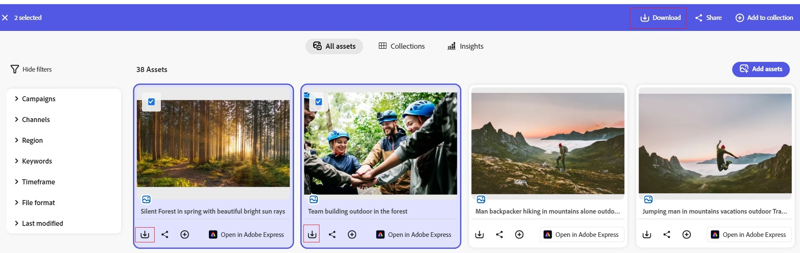

# Herunterladen von Assets aus Content Hub {#download-assets}

<!--  -->

Mit Content Hub können Sie Assets herunterladen und freigeben. Diese Assets können Bilder, Videos oder andere digitale Inhalte umfassen. Die Content Hub verbessert Barrierefreiheit und Anpassungsfähigkeit für eine effektive Asset-Verteilung.

Sie können ein einzelnes Asset oder mehrere Assets mit der Content Hub herunterladen. Die Originalversionen des Assets werden heruntergeladen.

## Voraussetzungen {#prerequisites}

[Content Hub-Benutzer](deploy-content-hub.md#onboard-content-hub-users) kann die in diesem Artikel erwähnten Aktionen ausführen.

## Asset herunterladen {#download-single-asset}

1. Wählen Sie die Assets aus, die Sie herunterladen müssen.
   
1. Klicken Sie auf **[!UICONTROL Herunterladen]**.   Alternativ können Sie auf das auf der Asset-Karte verfügbare Download-Symbol klicken, um ein Asset herunterzuladen.
Alle Assets werden in ihrer ursprünglichen Ausgabe heruntergeladen.
