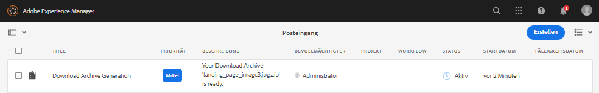

# Herunterladen von Assets aus [!DNL Adobe Experience Manager] {#download-assets-from-aem}

Sie können Assets einschließlich der statischen und dynamischen Ausgabedarstellungen herunterladen. Sie haben auch die Möglichkeit, eine E-Mail mit Links zu Assets direkt von [!DNL Adobe Experience Manager Assets] aus zu senden. Heruntergeladene Assets werden in einer ZIP-Datei gebündelt. Die komprimierte ZIP-Datei hat eine maximale Dateigröße von 1 GB für den Exportauftrag. Es sind maximal 500 Assets pro Exportauftrag zulässig.

>[!NOTE]
>
>Empfänger von E-Mails müssen Mitglieder der Gruppe `dam-users` sein, um auf den ZIP-Download-Link in der E-Mail zugreifen zu können. Um die Assets herunterladen zu können, müssen diese Mitglieder über die Berechtigung zum Starten von Workflows verfügen, die das Herunterladen von Assets auslösen.

Die Asset-Typen „Bildset“, „Rotationsset“ „Set für gemischte Medien“ und „Karussellset“ können nicht heruntergeladen werden.

Sie können Experience Manager-Assets mit den folgenden Methoden herunterladen:

* [Experience Manager-Benutzeroberfläche](#download-in-aem)
* Asset Link Share-Benutzeroberfläche
* [Asset Share Commons](https://adobe-marketing-cloud.github.io/asset-share-commons/)
* [Brand Portal](https://experienceleague.adobe.com/docs/experience-manager-brand-portal/using/introduction/brand-portal.html?lang=de)
* [Desktop-Programm](https://experienceleague.adobe.com/docs/experience-manager-desktop-app/using/using.html?lang=de#download-assets)

## Herunterladen von Assets über die [!DNL Experience Manager]-Oberfläche {#download-in-aem}

Der Service für asynchronen Download bietet ein Framework für den nahtlosen Download großer Assets. Kleinere Dateien werden in Echtzeit von der Benutzeroberfläche heruntergeladen. Große Dateien werden asynchron heruntergeladen und die Benutzer werden über Experience Manager-Benachrichtigungen im Posteingang über den Abschluss informiert. Weitere Informationen finden Sie unter [Grundlegendes zum Experience Manager-Posteingang](https://experienceleague.adobe.com/docs/experience-manager-cloud-service/sites/authoring/getting-started/inbox.html?lang=de).



*Abbildung: Download-Benachrichtigung über den [!DNL Experience Manager]-Posteingang.*

Asynchrone Downloads werden in einem der folgenden Fälle ausgelöst:

* Wenn mehr als 10 Assets oder mehr als 100 MB heruntergeladen werden müssen.
* Wenn die Vorbereitung des Downloads mehr als 30 Sekunden dauert.

Gehen Sie wie folgt vor, um Assets herunterzuladen:

1. Klicken Sie in der [!DNL Experience Manager]-Benutzeroberfläche auf **[!UICONTROL Assets]** > **[!UICONTROL Dateien]**.
1. Navigieren Sie zu den Assets, die Sie herunterladen möchten. Wählen Sie den Ordner oder ein oder mehrere Assets im Ordner aus. Klicken Sie in der Symbolleiste auf **[!UICONTROL Herunterladen]**.

   ![Verfügbare Optionen beim Herunterladen von Assets aus [!DNL Experience Manager Assets]](/help/assets/assets/asset-download1.png)

   *Abbildung: Optionen des Dialogfelds „Herunterladen“.*

1. Wählen Sie im Dialogfeld „Herunterladen“ die gewünschten Download-Optionen aus.

   | Download-Option | Beschreibung |
   |---|---|
   | **[!UICONTROL Separaten Ordner für jedes Asset erstellen]** | Wählen Sie diese Option, um jedes Asset, das Sie herunterladen – einschließlich der Assets in Unterordnern, die unter dem übergeordneten Ordner des Assets verschachtelt sind – in einen Ordner auf Ihrem lokalen Computer aufzunehmen. Wenn diese Option *nicht* ausgewählt ist, wird standardmäßig die Ordnerhierarchie ignoriert und alle Assets werden in einen Ordner auf Ihrem lokalen Computer heruntergeladen. |
   | **[!UICONTROL E-Mail]** | Wählen Sie diese Option, um eine E-Mail-Benachrichtigung an den Empfänger zu senden. Standardmäßige E-Mail-Vorlagen finden Sie in folgenden Ordnern:<ul><li>`/libs/settings/dam/workflow/notification/email/downloadasset`.</li><li>`/libs/settings/dam/workflow/notification/email/transientworkflowcompleted`.</li></ul> Vorlagen, die Sie während der Implementierung anpassen, stehen an den folgenden Speicherorten zur Verfügung: <ul><li>`/apps/settings/dam/workflow/notification/email/downloadasset`.</li><li>`/apps/settings/dam/workflow/notification/email/transientworkflowcompleted`.</li></ul>Sie können mandantenspezifische benutzerdefinierte Vorlagen in folgenden Ordnern speichern:<ul><li>`/conf/<tenant_specific_config_root>/settings/dam/workflow/notification/email/downloadasset`.</li><li>`/conf/<tenant_specific_config_root>/settings/dam/workflow/notification/email/transientworkflowcompleted`.</li></ul> |
   | **[!UICONTROL Asset(s)]** | Wählen Sie diese Option, um das Asset in seiner Originalform ohne Ausgabedarstellungen herunterzuladen.<br>Die Option „Teilassets“ ist verfügbar, wenn das Asset Teil-Asset enthält. |
   | **[!UICONTROL Ausgabedarstellung(en)]** | Eine Ausgabedarstellung ist die binäre Darstellung eines Assets. Assets haben eine primäre Darstellung – die einer hochgeladenen Datei. Sie können außerdem mehrere Darstellungen aufweisen. <br> Mit dieser Option können Sie die Ausgabedarstellungen auswählen, die heruntergeladen werden sollen. Die verfügbaren Ausgabedarstellungen hängen vom ausgewählten Asset ab. |
   | **[!UICONTROL Smartes Zuschneiden]** | Wählen Sie diese Option aus, um alle Ausgabedarstellungen des ausgewählten Assets, die mit der Funktion „Smartes Zuschneiden“ erstellt wurden, aus [!DNL Experience Manager] herunterzuladen. Eine ZIP-Datei mit den Ausgabedarstellungen, die mit der Funktion „Smartes Zuschneiden“ erstellt wurden, wird erstellt und auf Ihren lokalen Computer heruntergeladen. |
   | **[!UICONTROL Dynamische Ausgabedarstellung(en)]** | Wählen Sie diese Option, um eine Reihe von alternativen Ausgabedarstellungen in Echtzeit zu erstellen. Wenn Sie diese Option wählen, wählen Sie durch Auswahl aus der Liste [Bildvorgabe](/help/assets/dynamic-media/image-presets.md) auch die Ausgabedarstellungen, die Sie dynamisch erstellen möchten. <br>Außerdem können Sie Größe und Einheit, Format, Farbraum, Auflösung und beliebige Bild-Modifikatoren auswählen (um das Bild z. B. umzukehren). Die Option ist nur verfügbar, wenn Sie [!DNL Dynamic Media] aktiviert haben. |

1. Klicken Sie im Dialogfeld auf **[!UICONTROL Herunterladen]**.

## Aktivieren des Asset-Download-Servlets {#enable-asset-download-servlet}

Das Standard-Servlet in [!DNL Experience Manager] ermöglicht es authentifizierten Benutzern, beliebig große, gleichzeitige Download-Anfragen zur Erstellung von ZIP-Dateien von Assets zu stellen. Die Vorbereitung des Herunterladens kann sich auf die Leistung auswirken oder sogar den Server und das Netzwerk überlasten. Um solche potenziellen DoS-ähnlichen Risiken zu reduzieren, die durch diese Funktion verursacht werden, ist die `AssetDownloadServlet`-OSGi-Komponente für Veröffentlichungsinstanzen standardmäßig deaktiviert.

Um das Herunterladen von Assets aus dem DAM zuzulassen, z. B. wenn Sie die Asset-Freigabe oder eine andere portalähnliche Implementierung verwenden, aktivieren Sie das Servlet manuell über eine OSGi-Konfiguration. Adobe empfiehlt, die zulässige Download-Größe so gering wie möglich zu halten, ohne dass dabei die täglichen Download-Anforderungen beeinträchtigt werden. Ein hoher Wert kann sich auf die Leistung auswirken.

1. Erstellen Sie einen Ordner mit einer Benennungsregel, die auf den Veröffentlichungslaufmodus zielt, d. h. `config.publish`:

   `/apps/<your-app-name>/config.publish`

1. Erstellen Sie im Konfigurationsordner eine neue Datei des Typs `nt:file` mit dem Namen `com.day.cq.dam.core.impl.servlet.AssetDownloadServlet.config`.
1. Füllen Sie `com.day.cq.dam.core.impl.servlet.AssetDownloadServlet.config` wie folgt. Legt eine maximale Größe (in Byte) für den Download als Wert von `asset.download.prezip.maxcontentsize` fest. Im folgenden Beispiel wird die maximale Größe des ZIP-Downloads auf maximal 100 KB konfiguriert.

   ```java
   enabled=B"true"
   asset.download.prezip.maxcontentsize=I"102400"
   ```

## Deaktivieren des Asset-Download-Servlets {#disable-asset-download-servlet}

Das `Asset Download Servlet` kann in einer [!DNL Experience Manager]-Veröffentlichungsinstanz deaktiviert werden, indem die Dispatcher-Konfiguration so aktualisiert wird, dass sie alle Asset-Download-Anfragen blockiert. Das Servlet kann auch manuell direkt über die OSGi-Konsole deaktiviert werden.

1. Um Asset-Download-Anfragen über eine Dispatcher-Konfiguration zu blockieren, bearbeiten Sie die Konfiguration `dispatcher.any` und fügen Sie dem [Filterabschnitt](https://experienceleague.adobe.com/docs/experience-manager-dispatcher/using/configuring/dispatcher-configuration.html?lang=de#configuring) eine neue Regel hinzu.

   `/0100 { /type "deny" /url "*.assetdownload.zip/assets.zip*" }`

>[!MORELIKETHIS]
>
>* [Herunterladen von DRM-geschützten Assets](drm.md)
>* [Herunterladen von Assets mit dem Experience Manager-Desktop-Programm auf einem Windows- oder Mac-Desktop](https://helpx.adobe.com/de/experience-manager/desktop-app/aem-desktop-app.html)
>* [Herunterladen von Assets mit Adobe Assets Link aus den unterstützten Adobe Creative Cloud-Programmen](https://helpx.adobe.com/de/enterprise/using/manage-assets-using-adobe-asset-link.html)

