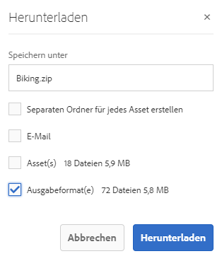

# Herunterladen von Assets aus AEM  {#download-assets-from-aem}

Sie können Assets einschließlich der statischen und dynamischen Ausgabeformate herunterladen. Heruntergeladene Assets werden in einer ZIP-Datei gebündelt. Die komprimierte ZIP-Datei hat eine maximale Dateigröße von 1 GB für den Exportauftrag. Maximal 500 Gesamt-Assets pro Exportauftrag sind zulässig.

>[!NOTE]
>
>Um die Assets herunterladen zu können, müssen diese Mitglieder über die Berechtigung zum Starten von Workflows verfügen, die das Herunterladen von Assets auslösen.

Um Assets herunterzuladen, navigieren Sie zu einem Asset, wählen Sie das Asset aus und tippen/klicken Sie in der Symbolleiste auf das Symbol **[!UICONTROL Herunterladen]**. Geben Sie im dann angezeigten Dialogfeld die Download-Optionen an.

Die Asset-Typen „Bildset“, „Rotationsset“ „Gemischtes Medienset“ und „Karussellset“ können nicht heruntergeladen werden.


*Abbildung: Verfügbare Optionen beim Herunterladen von Assets aus AEM Assets*

Im Folgenden finden Sie die Export-/Download-Optionen. Dynamische Ausgabeformate gibt es nur in Dynamic Media. Damit können Sie Ausgabeformate zusätzlich zum ausgewählten Asset direkt generieren. Diese Option steht nur zur Verfügung, wenn Sie Dynamic Media aktiviert haben.

| Export- oder Download-Optionen | Beschreibungen |
|---|---|
| [!UICONTROL Assets] | Wählen Sie diese Option, um das Asset in seiner Originalform ohne Ausgabeformate herunterzuladen. |
| [!UICONTROL Ausgabeformate] | Das Ausgabeformat ist die binäre Darstellung eines Assets. Assets haben eine primäre Darstellung – die einer hochgeladenen Datei. Sie können außerdem mehrere Darstellungen aufweisen. <br> Mit dieser Option können Sie die Ausgabeformate auswählen, die heruntergeladen werden sollen. Die verfügbaren Ausgabeformate hängen von dem von Ihnen ausgewählten Asset ab. |
| [!UICONTROL Dynamische Ausgabeformate] | Ein dynamisches Ausgabeformat generiert direkt andere Ausgabeformate. Wenn Sie diese Option auswählen, wählen Sie auch die Ausgabeformate aus, die Sie dynamisch erstellen möchten, indem Sie aus der Liste der Bildvorgaben auswählen. Außerdem können Sie Größe und Einheit, Format, Farbraum, Auflösung und beliebige Bild-Modifikatoren auswählen (um das Bild z. B. umzukehren). |
| [!UICONTROL Separaten Ordner für jedes Asset erstellen] | Wählen Sie diese Option aus, um die Ordnerhierarchie beim Herunterladen der Assets beizubehalten. Standardmäßig wird die Ordnerhierarchie ignoriert und alle Assets werden in einen Ordner auf Ihrem lokalen System heruntergeladen. |

Die Option „Ausgabeformate“ ist verfügbar, wenn das Asset über Ausgabeformate verfügt. Die Option „Teilassets“ ist verfügbar, wenn das Asset Teilassets enthält.

Wenn Sie einen Ordner zum Herunterladen auswählen, wird die komplette Asset-Hierarchie unter dem Ordner heruntergeladen. Um jedes heruntergeladene Asset (einschließlich Assets in untergeordneten Ordnern) in einem eigenen Ordner abzulegen, wählen Sie die Option **[!UICONTROL Separaten Ordner für jedes Asset erstellen]**.

## Aktivieren des Asset-Download-Servlets {#enable-asset-download-servlet}

Das Standard-Servlet in AEM ermöglicht es authentifizierten Benutzern, beliebig große, gleichzeitige Download-Anforderungen für die Erstellung von ZIP-Dateien mit für sie sichtbaren Assets zu stellen, die den Server und das Netzwerk überlasten können. Um potenzielle DoS-Risiken zu reduzieren, die durch diese Funktion verursacht werden, ist die `AssetDownloadServlet`-OSGi-Komponente für Veröffentlichungsinstanzen standardmäßig deaktiviert.

Um das Herunterladen von Assets aus dem DAM zuzulassen, z. B. wenn Sie die Asset-Freigabe oder eine andere portalähnliche Implementierung verwenden, aktivieren Sie das Servlet manuell über eine OSGi-Konfiguration. Adobe empfiehlt, die zulässige Download-Größe so gering wie möglich zu halten, ohne dass dabei die täglichen Download-Anforderungen beeinträchtigt werden. Ein hoher Wert kann sich auf die Leistung auswirken.

1. Erstellen Sie einen Ordner mit einer Benennungsregel, die auf den Veröffentlichungslaufmodus zielt, d. h. `config.publish`:

   `/apps/<your-app-name>/config.publish`

1. Erstellen Sie im Konfigurationsordner eine neue Datei des Typs `nt:file` mit dem Namen `com.day.cq.dam.core.impl.servlet.AssetDownloadServlet.config`.
1. Füllen Sie `com.day.cq.dam.core.impl.servlet.AssetDownloadServlet.config` wie folgt. Legt eine maximale Größe (in Byte) für den Download als Wert von `asset.download.prezip.maxcontentsize` fest. Im folgenden Beispiel wird die maximale Größe des ZIP-Downloads auf maximal 100 KB konfiguriert.

   ```
   enabled=B"true"
   asset.download.prezip.maxcontentsize=I"102400"
   ```

## Deaktivieren des Asset-Download-Servlets {#disable-asset-download-servlet}

Das `Asset Download Servlet` kann auf einer AEM-Veröffentlichungsinstanz deaktiviert werden, indem die Dispatcher-Konfiguration so aktualisiert wird, dass sie alle Asset-Download-Anforderungen blockiert. Das Servlet kann auch manuell direkt über die OSGi-Konsole deaktiviert werden.

1. Um Asset-Download-Anforderungen über eine Dispatcher-Konfiguration zu blockieren, bearbeiten Sie die Konfiguration `dispatcher.any` und fügen Sie dem [Filterabschnitt](https://docs.adobe.com/content/help/en/experience-manager-dispatcher/using/configuring/dispatcher-configuration.html#defining-a-filter) eine neue Regel hinzu.

   `/0100 { /type "deny" /url "*.assetdownload.zip/assets.zip*" }`

>[!MORELIKETHIS]
>
>* [Herunterladen von DRM-geschützten Assets](drm.md)
>* [Herunterladen von Assets mit dem AEM-Desktop-Programm auf einem Windows- oder Mac-Desktop](https://helpx.adobe.com/de/experience-manager/desktop-app/aem-desktop-app.html)
>* [Herunterladen von Assets mit Adobe Assets Link aus den unterstützten Adobe Creative Cloud-Programmen](https://helpx.adobe.com/de/enterprise/using/manage-assets-using-adobe-asset-link.html)


<!-- FULL ARTICLE ARCHIVE IS BELOW 

You can download assets including static and dynamic renditions. Alternatively, you can send emails with links to assets directly from AEM Assets. Downloaded assets are bundled in a ZIP file. The compressed ZIP file has a maximum file size of 1 GB for the export job. You are allowed a maximum of 500 total assets per export job.

>[!NOTE]
>
>Recipients of emails must be members of the `dam-users` group to access the ZIP download link in the email message. To be able to download the assets, the members must have permissions to launch workflows that trigger downloading of assets.

To download assets, navigate to an asset, select the asset, and tap/click the **[!UICONTROL Download]** icon from the toolbar. In the resulting dialog, specify your download options.

The asset types Image Sets, Spin Sets, Mixed Media Sets, and Carousel Sets cannot be downloaded.


*Figure: Available options when downloading assets from AEM Assets*

The following are the Export/Download options. Dynamic renditions are unique to Dynamic Media and let you generate renditions on-the-fly in addition to the asset you selected - that option is only available if you have Dynamic Media enabled.

|Export or download options|Descriptions|
|---|---|
| [!UICONTROL Assets]| Select this to download the asset in its original form without any renditions.|
| [!UICONTROL Renditions] |A rendition is the binary representation of an asset. Assets have a primary representation - that of the uploaded file. They can have any number of representations. <br> With this option, you can select the renditions you want downloaded. The renditions available depend on the asset you select.|
| [!UICONTROL Dynamic Renditions] |A dynamic rendition generates other renditions on-the-fly. When you select this option, you also select the renditions you want to create dynamically by selecting from the image presets list. In addition, you can select the size and unit of measurement, format, color space, resolution, and any image modifiers (for example to invert the image)|
| [!UICONTROL Email] |An email notification is sent to the user. Standard emails templates are available at the following locations:<ul><li>`/libs/settings/dam/workflow/notification/email/downloadasset`</li><li>`/libs/settings/dam/workflow/notification/email/transientworkflowcompleted`</li></ul> Templates that you customize during deployment should be present at these locations: <ul><li>`/apps/settings/dam/workflow/notification/email/downloadasset`</li><li>`/apps/settings/dam/workflow/notification/email/transientworkflowcompleted`</li></ul>You can store tenant-specific custom templates at these locations:<ul><li>`/conf/<tenant_specific_config_root>/settings/dam/workflow/notification/email/downloadasset`</li><li>`/conf/<tenant_specific_config_root>/settings/dam/workflow/notification/email/transientworkflowcompleted`</li></ul>|
| [!UICONTROL Create separate folder for each asset] |Select this to preserve the folder hierarchy while downloading assets. By default, the folder hierarchy is ignored and all assets are downloaded in one folder in your local system.|

The option renditions option is available if the asset has any renditions. The subassets option is available if the asset includes subassets.

When you select a folder to download, the complete asset hierarchy under the folder is downloaded. To include each asset you download (including assets in child folders nested under the parent folder) in an individual folder, select **[!UICONTROL Create separate folder for each asset]**.

## Enable asset download servlet {#enable-asset-download-servlet}

The default servlet in AEM allows authenticated users to issue arbitrarily-large, concurrent download requests for creating ZIP files of assets visible to them that can overload the server and the network. To mitigate potential DoS risks caused by this feature, `AssetDownloadServlet` OSGi component is disabled by default for publish instances.

To allow downloading assets from your DAM, say when using something like Asset Share Commons or other portal-like implementation, manually enable the servlet via an OSGi configuration. Adobe recommends setting the permissible download size as low as possible without affecting the day-to-day download requirements. A high value may impact performance.

1. Create a folder with a naming convention that targets the publish runmode, that is, `config.publish`:

   `/apps/<your-app-name>/config.publish`

1. In the config folder, create a new file of type `nt:file` named `com.day.cq.dam.core.impl.servlet.AssetDownloadServlet.config`.
1. Populate `com.day.cq.dam.core.impl.servlet.AssetDownloadServlet.config` with the following. Sets a maximum size (in bytes) for the download as value of `asset.download.prezip.maxcontentsize`. The below sample configures the maximum size of the ZIP download to not exceed 100 kB.

   ```
   enabled=B"true"
   asset.download.prezip.maxcontentsize=I"102400"
   ```

## Disable asset download servlet {#disable-asset-download-servlet}

The `Asset Download Servlet` can be disabled on an AEM Publish instances by updating the dispatcher configuration to block any asset download requests. The servlet can also be manually disabled via the OSGi console directly.

1. To block asset download requests via a dispatcher configuration edit the `dispatcher.any` configuration and add a new rule to the [filter section](https://docs.adobe.com/content/help/en/experience-manager-dispatcher/using/configuring/dispatcher-configuration.html#defining-a-filter).

   `/0100 { /type "deny" /url "*.assetdownload.zip/assets.zip*" }`

>[!MORELIKETHIS]
>
>* [Download DRM protected assets](drm.md)
>* [Download assets using AEM desktop app on Win or Mac desktop](https://helpx.adobe.com/experience-manager/desktop-app/aem-desktop-app.html)
>* [Download assets using Adobe Assets Link from within the supported Adobe Creative Cloud apps](https://helpx.adobe.com/enterprise/using/manage-assets-using-adobe-asset-link.html)


-->