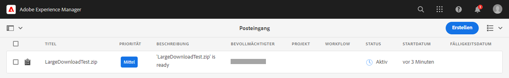

# Herunterladen von Assets aus [!DNL Adobe Experience Manager] {#download-assets-from-aem}

| [Best Practices für die Suche](/help/assets/search-best-practices.md) | [Best Practices für Metadaten](/help/assets/metadata-best-practices.md) | [Content Hub](/help/assets/product-overview.md) | [Dynamic Media mit OpenAPI-Funktionen](/help/assets/dynamic-media-open-apis-overview.md) | [Entwicklerdokumentation zu AEM Assets](https://developer.adobe.com/experience-cloud/experience-manager-apis/) |
| ------------- | --------------------------- |---------|----|-----|

| Version | Artikel-Link |
| -------- | ---------------------------- |
| AEM 6.5 | [Hier klicken](https://experienceleague.adobe.com/docs/experience-manager-65/assets/managing/download-assets-from-aem.html?lang=de) |
| AEM as a Cloud Service | Dieser Artikel |

Sie können Assets einschließlich der statischen und dynamischen Ausgabedarstellungen herunterladen. Sie haben auch die Möglichkeit, eine E-Mail mit Links zu Assets direkt von [!DNL Adobe Experience Manager Assets] aus zu senden. Heruntergeladene Assets werden in einer ZIP-Datei gebündelt. <!-- The compressed ZIP file has a maximum file size of 1 GB for the export job. A maximum of 500 total assets per export job are allowed. -->

<!--
>[!NOTE]
>
>Recipients of emails must be members of the `dam-users` group to access the ZIP download link in the email message. To be able to download the assets, the members must have permissions to launch workflows that trigger downloading of assets.
-->

Die folgenden Asset-Typen können nicht heruntergeladen werden: Bildsets, Rotationssets, gemischte Mediensets und Karussellsets.

Sie können mit den folgenden Methoden Assets aus Experience Manager herunterladen:

<!-- * [Link Share](#link-share-download) -->

* [Experience Manager-Benutzeroberfläche](#download-assets)
* [Asset Share Commons](https://adobe-marketing-cloud.github.io/asset-share-commons/)
* [Brand Portal](https://experienceleague.adobe.com/docs/experience-manager-brand-portal/using/introduction/brand-portal.html?lang=de)
* [Desktop-Programm](https://experienceleague.adobe.com/docs/experience-manager-desktop-app/using/using.html?lang=de#download-assets)

## Herunterladen von Assets über die [!DNL Experience Manager]-Oberfläche {#download-assets}

Experience Manager optimiert das Download-Erlebnis basierend auf der Menge und Größe der Assets. Kleinere Dateien werden in Echtzeit von der Benutzeroberfläche heruntergeladen. [!DNL Experience Manager] lädt direkt einzelne Asset-Anforderungen für die Originaldatei herunter, anstatt einzelne Assets in ein ZIP-Archiv zu integrieren, um schnellere Downloads zu ermöglichen. Experience Manager unterstützt große Downloads mit asynchronen Anfragen. Download-Anfragen mit mehr als 100 GB werden in mehrere ZIP-Archive mit einer maximalen Größe von jeweils 100 MB aufgeteilt.

Standardmäßig löst [!DNL Experience Manager] eine Benachrichtigung im [[!DNL Experience Manager] Posteingang](/help/sites-cloud/authoring/inbox.md) aus, nachdem ein Download-Archiv erstellt wurde.




### Aktivieren von E-Mail-Benachrichtigungen für große Downloads {#enable-emails-for-large-downloads}

Asynchrone Downloads werden in einem der folgenden Fälle ausgelöst:

* Wenn mehr als zehn Assets vorhanden sind
* Wenn die Download-Größe mehr als 100 MB beträgt
* Wenn die Vorbereitung des Downloads mehr als 30 Sekunden dauert

Während der asynchrone Download im Backend läuft, kann der Benutzer Experience Manager weiter erkunden und darin arbeiten. Zusätzlich zu den Experience Manager-Posteingangsbenachrichtigungen kann Experience Manager E-Mails senden, um Benutzer über den Abschluss des Download-Prozesses zu benachrichtigen. Um diese Funktion zu aktivieren, können Admins den E-Mail-Service durch [Konfigurieren einer SMTP-Server-Verbindung](https://experienceleague.adobe.com/docs/experience-manager-cloud-service/content/implementing/developing/development-guidelines.html?lang=de#sending-email) konfigurieren.

Sobald der E-Mail-Service konfiguriert ist, können Administratoren und Benutzer über die Benutzeroberfläche von Experience Manager E-Mail-Benachrichtigungen aktivieren.

So aktivieren Sie E-Mail-Benachrichtigungen:

1. Melden Sie sich bei [!DNL Experience Manager Assets] an.
1. Klicken Sie oben rechts auf das Benutzersymbol und dann auf **[!UICONTROL Eigene Voreinstellungen]**, um das Fenster „Benutzereinstellungen“ zu öffnen.
1. Aktivieren Sie das Kontrollkästchen **[!UICONTROL E-Mail-Benachrichtigungen zum Asset-Download]** und klicken Sie auf **[!UICONTROL Akzeptieren]**.

   


Gehen Sie wie folgt vor, um Assets herunterzuladen:

1. Klicken Sie in der [!DNL Experience Manager]-Benutzeroberfläche auf **[!UICONTROL Assets]** > **[!UICONTROL Dateien]**.
1. Navigieren Sie zu den Assets, die Sie herunterladen möchten. Wählen Sie den Ordner oder ein oder mehrere Assets im Ordner aus. Klicken Sie in der Symbolleiste auf **[!UICONTROL Herunterladen]**.

   ![Verfügbare Optionen beim Herunterladen von Assets aus [!DNL Experience Manager Assets]](/help/assets/assets/asset-download1.png)

1. Wählen Sie im Dialogfeld „Herunterladen“ die gewünschten Download-Optionen aus.

   | Download-Option | Beschreibung |
   |---|---|
   | **[!UICONTROL Separaten Ordner für jedes Asset erstellen]** | Wählen Sie diese Option aus, um für jedes Asset einen Ordner mit allen heruntergeladenen Ausgabedarstellungen für das Asset herunterzuladen. Wenn die Auswahl aufgehoben wird, sind alle Assets (und deren Ausgabedarstellungen, sofern für den Download ausgewählt) im übergeordneten Ordner des generierten Archivs enthalten. |
   | **[!UICONTROL E-Mail]** | Wählen Sie diese Option, um einem anderen Benutzer eine E-Mail-Benachrichtigung (mit einem Link zu Ihrem Download) zu senden. Der angemeldete Benutzer muss Mitglied der Gruppe `dam-users` sein. Standardmäßige E-Mail-Vorlagen finden Sie in folgenden Ordnern:<ul><li>`/libs/settings/dam/workflow/notification/email/downloadasset`.</li><li>`/libs/settings/dam/workflow/notification/email/transientworkflowcompleted`.</li></ul> Vorlagen, die Sie während der Bereitstellung anpassen, stehen an den folgenden Speicherorten zur Verfügung: <ul><li>`/apps/settings/dam/workflow/notification/email/downloadasset`.</li><li>`/apps/settings/dam/workflow/notification/email/transientworkflowcompleted`.</li></ul>Sie können mandantenspezifische benutzerdefinierte Vorlagen in folgenden Ordnern speichern:<ul><li>`/conf/<tenant_specific_config_root>/settings/dam/workflow/notification/email/downloadasset`.</li><li>`/conf/<tenant_specific_config_root>/settings/dam/workflow/notification/email/transientworkflowcompleted`.</li></ul> |
   | **[!UICONTROL Asset(s)]** | Wählen Sie diese Option, um das Asset in seiner Originalform herunterzuladen.<br>Die Option „Teilassets“ ist verfügbar, wenn das Asset Teil-Asset enthält. |
   | **[!UICONTROL Ausgabedarstellung(en)]** | Eine Ausgabedarstellung ist die binäre Darstellung eines Assets. Assets verfügen über eine primäre Darstellung, nämlich die der hochgeladenen Datei. Sie können außerdem mehrere Darstellungen aufweisen. <br> Mit dieser Option können Sie die Ausgabedarstellungen auswählen, die heruntergeladen werden sollen. Die verfügbaren Ausgabedarstellungen hängen vom ausgewählten Asset ab. |
   | **[!UICONTROL Smartes Zuschneiden]** | Wählen Sie diese Option aus, um alle Ausgabedarstellungen des ausgewählten Assets, die mit der Funktion „Smartes Zuschneiden“ erstellt wurden, aus [!DNL Experience Manager] herunterzuladen. Eine ZIP-Datei mit den Ausgabedarstellungen, die mit der Funktion „Smartes Zuschneiden“ erstellt wurden, wird erstellt und auf Ihren lokalen Computer heruntergeladen. |
   | **[!UICONTROL Dynamische Ausgabedarstellung(en)]** | Wählen Sie diese Option, um eine Reihe von alternativen Ausgabedarstellungen in Echtzeit zu erstellen. Wenn Sie diese Option wählen, wählen Sie durch Auswahl aus der Liste [Bildvorgabe](/help/assets/dynamic-media/image-presets.md) auch die Ausgabedarstellungen, die Sie dynamisch erstellen möchten. <br>Außerdem können Sie Größe und Einheit, Format, Farbraum, Auflösung und beliebige Bild-Modifikatoren auswählen (um das Bild z. B. umzukehren). Die Option ist nur verfügbar, wenn Sie [!DNL Dynamic Media] aktiviert haben. |

1. Klicken Sie im Dialogfeld auf **[!UICONTROL Herunterladen]**.

   Wenn die E-Mail-Benachrichtigung für große Downloads aktiviert ist, wird in Ihrem Posteingang eine E-Mail mit einer Download-URL des archivierten ZIP-Ordners angezeigt. Klicken Sie in der E-Mail auf den Download-Link, um das ZIP-Archiv herunterzuladen.

   

   Sie können die Benachrichtigung ebenfalls in Ihrem [!DNL Experience Manager]-Posteingang sehen.

   

## Herunterladen von Assets, die über eine Verknüpfung freigegeben wurden {#link-share-download}

Die Freigabe von Assets über einen Link ist eine praktische Methode, um diese für Interessenten verfügbar zu machen, ohne dass diese sich dabei bei [!DNL Assets] anmelden müssen. Siehe [Funktion „Linkfreigabe“](/help/assets/share-assets.md#sharelink).

Wenn Benutzer Assets über freigegebene Links herunterladen, verwendet [!DNL Assets] einen asynchronen Service, der schnellere und unterbrechungsfreie Downloads ermöglicht. Die herunterzuladenden Assets werden im Hintergrund in eine Warteschlange in ZIP-Archiven mit angemessener Dateigröße aufgenommen. Bei größeren Downloads wird der Download in Dateien mit jeweils 100 GB unterteilt.

Der Verarbeitungsstatus jedes Archivs wird im [!UICONTROL Download-Posteingang] angezeigt. Nach Abschluss der Verarbeitung können Sie die Archive aus dem Posteingang herunterladen.


## Aktivieren des Asset-Download-Servlets {#enable-asset-download-servlet}

Das Standard-Servlet in [!DNL Experience Manager] ermöglicht es authentifizierten Benutzern, beliebig große, gleichzeitige Download-Anfragen zur Erstellung von ZIP-Dateien von Assets zu stellen. Die Vorbereitung des Herunterladens kann sich auf die Leistung auswirken oder sogar den Server und das Netzwerk überlasten. Um solche potenziellen DoS-ähnlichen Risiken zu reduzieren, die durch diese Funktion verursacht werden, ist die `AssetDownloadServlet`-OSGi-Komponente für Veröffentlichungsinstanzen standardmäßig deaktiviert. Wenn Sie die Download-Funktion nicht in Autoreninstanzen benötigen, deaktivieren Sie das Servlet in der Autoreninstanz.

Um das Herunterladen von Assets aus Ihrem DAM zu ermöglichen (z. B. bei Verwendung von Asset Share Commons oder einer anderen portalähnlichen Implementierung), aktivieren Sie das Servlet manuell über eine OSGi-Konfiguration. Adobe empfiehlt, die zulässige Download-Größe so gering wie möglich zu halten, ohne dass dabei die täglichen Download-Anforderungen beeinträchtigt werden. Ein hoher Wert kann sich auf die Leistung auswirken.

1. Erstellen Sie einen Ordner mit einer Namenskonvention, die auf den Veröffentlichungsausführungsmodus zielt, d. h. `config.publish`:

   `/apps/<your-app-name>/config.publish`

1. Erstellen Sie im Konfigurationsordner eine neue Datei des Typs `nt:file` mit dem Namen `com.day.cq.dam.core.impl.servlet.AssetDownloadServlet.config`.
1. Füllen Sie `com.day.cq.dam.core.impl.servlet.AssetDownloadServlet.config` wie folgt. Legt eine maximale Größe (in Byte) für den Download als Wert von `asset.download.prezip.maxcontentsize` fest. Im folgenden Beispiel wird die maximale Größe des ZIP-Downloads auf 100 KB begrenzt.

   ```java
   enabled=B"true"
   asset.download.prezip.maxcontentsize=I"102400"
   ```

## Deaktivieren des Asset-Download-Servlets {#disable-asset-download-servlet}

Wenn Sie die Download-Funktion nicht benötigen, deaktivieren Sie das Servlet, um DoS-ähnliche Risiken zu vermeiden. Das `Asset Download Servlet` kann in einer [!DNL Experience Manager]-Autoren- und -Veröffentlichungsinstanz deaktiviert werden, indem die Dispatcher-Konfiguration so aktualisiert wird, dass sie alle Asset-Download-Anfragen blockiert. Das Servlet kann auch manuell direkt über die OSGi-Konsole deaktiviert werden.

1. Um Asset-Download-Anfragen über eine Dispatcher-Konfiguration zu blockieren, bearbeiten Sie die Konfiguration `dispatcher.any` und fügen Sie dem [Filterabschnitt](https://experienceleague.adobe.com/docs/experience-manager-dispatcher/using/configuring/dispatcher-configuration.html?lang=de#configuring) eine neue Regel hinzu.

   `/0100 { /type "deny" /url "*.assetdownload.zip/assets.zip*" }`

## OnTime- oder OffTime-Ausgabedarstellung {#on-off-time-rendition}

Zum Aktivieren des Dienstes `OnOffTimeAssetAccessFilter` müssen Sie eine OSGi-Konfiguration erstellen. Dieser Dienst ermöglicht das Blockieren des Zugriffs auf Ausgabedarstellungen und Metadaten zusätzlich zum Asset selbst, basierend auf den Zeiteinstellungen für das Ein-/Ausschalten. Die OSGi-Konfiguration sollte für `com.day.cq.dam.core.impl.servlet.OnOffTimeAssetAccessFilter` sein. Führen Sie dazu folgende Schritte durch:

1. Erstellen Sie in Ihrem Projekt-Code in Git eine Konfigurationsdatei unter `/apps/system/config/com.day.cq.dam.core.impl.servlet.OnOffTimeAssetAccessFilter.cfg.json`. Die Datei sollte `{}` als Inhalt umfassen, das heißt eine leere OSGi-Konfiguration für die entsprechende OSGi-Komponente. Diese Aktion aktiviert den Dienst.
1. Stellen Sie Ihren Code einschließlich dieser neuen Konfiguration durch [!DNL Cloud Manager] bereit.
1. Nach der Bereitstellung sind die Ausgabedarstellungen und Metadaten gemäß den Zeiteinstellungen für das Ein-/Ausschalten der Assets verfügbar. Wenn das aktuelle Datum bzw. die aktuelle Uhrzeit vor der Einschaltzeit oder hinter der Ausschaltzeit liegt, wird eine Fehlermeldung angezeigt.
Weitere Informationen zum Hinzufügen einer leeren OSGi-Konfiguration finden Sie in diesem [Handbuch](https://experienceleague.adobe.com/docs/experience-manager-cloud-service/content/implementing/deploying/configuring-osgi.html?lang=de).

## Tipps und Einschränkungen {#tips-limitations}

* Wenn Sie einen leeren Ordner herunterladen, sendet [!DNL Experience Manager] eine Erfolgsmeldung über das Erstellen eines ZIP-Archivs, das Archiv wird jedoch nicht erstellt.

**Siehe auch**

* [Assets übersetzen](translate-assets.md)
* [Assets-HTTP-API](mac-api-assets.md)
* [Von AEM Assets unterstützte Dateiformate](file-format-support.md)
* [Suchen von Assets](search-assets.md)
* [Connected Assets](use-assets-across-connected-assets-instances.md)
* [Asset-Berichte](asset-reports.md)
* [Metadatenschemata](metadata-schemas.md)
* [Verwalten von Metadaten](manage-metadata.md)
* [Suchfacetten](search-facets.md)
* [Verwalten von Sammlungen](manage-collections.md)
* [Massenimport von Metadaten](metadata-import-export.md)
* [Veröffentlichen von Assets in AEM und Dynamic Media](/help/assets/publish-assets-to-aem-and-dm.md)

>[!MORELIKETHIS]
>
>* [Herunterladen von DRM-geschützten Assets](drm.md)
>* [Herunterladen von Assets mit dem Experience Manager-Desktop-Programm auf einem Windows- oder Mac-Desktop](https://experienceleague.adobe.com/docs/experience-manager-desktop-app/using/using.html?lang=de)
>* [Herunterladen von Assets mit Adobe Assets Link aus den unterstützten Adobe Creative Cloud-Programmen](https://helpx.adobe.com/de/enterprise/using/manage-assets-using-adobe-asset-link.html)
