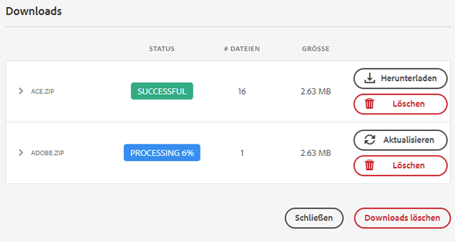

# Herunterladen von Assets aus [!DNL Adobe Experience Manager] {#download-assets-from-aem}

Sie können Assets einschließlich der statischen und dynamischen Ausgabedarstellungen herunterladen. Sie haben auch die Möglichkeit, eine E-Mail mit Links zu Assets direkt von [!DNL Adobe Experience Manager Assets] aus zu senden. Heruntergeladene Assets werden in einer ZIP-Datei gebündelt. <!-- The compressed ZIP file has a maximum file size of 1 GB for the export job. A maximum of 500 total assets per export job are allowed. -->

<!--
>[!NOTE]
>
>Recipients of emails must be members of the `dam-users` group to access the ZIP download link in the email message. To be able to download the assets, the members must have permissions to launch workflows that trigger downloading of assets.
-->

Die Asset-Typen „Bildset“, „Rotationsset“ „Set für gemischte Medien“ und „Karussellset“ können nicht heruntergeladen werden.

Sie können Experience Manager-Assets mit den folgenden Methoden herunterladen:

<!-- * [Link Share](#link-share-download) -->

* [Experience Manager-Benutzeroberfläche](#download-assets)
* [Asset Share Commons](https://adobe-marketing-cloud.github.io/asset-share-commons/)
* [Brand Portal](https://experienceleague.adobe.com/docs/experience-manager-brand-portal/using/introduction/brand-portal.html?lang=de)
* [Desktop-Programm](https://experienceleague.adobe.com/docs/experience-manager-desktop-app/using/using.html?lang=de#download-assets)

## Herunterladen von Assets über die [!DNL Experience Manager]-Oberfläche {#download-assets}

Der Service für asynchronen Download bietet ein Framework für den nahtlosen Download großer Assets. Die Download-Archive mit einer Größe von mehr als 100 GB teilen sich in mehrere ZIP-Archive mit einer Maximalgröße von jeweils 100 GB auf. Diese können einzeln heruntergeladen werden. Kleinere Dateien werden in Echtzeit von der Benutzeroberfläche heruntergeladen. [!DNL Experience Manager] archiviert keine einzelnen Asset-Downloads, wenn die Originaldatei heruntergeladen wurde. Diese Funktion ermöglicht schnellere Downloads.

Standardmäßig [!DNL Experience Manager] Trigger einer Benachrichtigung nach Abschluss des Download-Workflows. Die Download-Benachrichtigung wird im  [[!DNL Experience Manager] Posteingang](/help/sites-cloud/authoring/getting-started/inbox.md).


### E-Mail-Benachrichtigungen für große Downloads aktivieren {#enable-emails-for-large-downloads}

>[!NOTE]
>
>Diese Funktion ist im Vorversionskanal verfügbar. Siehe [Dokumentation zum Vorabversionskanal](https://experienceleague.adobe.com/docs/experience-manager-cloud-service/content/release-notes/prerelease.html#enable-prerelease) für Informationen zur Aktivierung der Funktion für Ihre Umgebung.

Asynchrone Downloads werden in einem der folgenden Fälle ausgelöst:

* Wenn mehr als zehn Assets vorhanden sind
* Wenn die Download-Größe größer ist als 100 MB
* Wenn die Vorbereitung des Downloads mehr als 30 Sekunden dauert

Während der asynchrone Download im Backend ausgeführt wird, kann der Benutzer weiter untersuchen und in Experience Manager weiter arbeiten. Es ist ein vordefinierter Mechanismus erforderlich, um den Benutzer nach Abschluss des Download-Prozesses zu benachrichtigen. Um dieses Ziel zu erreichen, können Administratoren den E-Mail-Dienst durch Einrichtung eines SMTP-Servers konfigurieren. Siehe [Mail-Dienst konfigurieren](https://experienceleague.adobe.com/docs/experience-manager-cloud-service/content/implementing/developing/development-guidelines.html#sending-email).

Sobald der E-Mail-Dienst konfiguriert ist, können Administratoren und Benutzer E-Mail-Benachrichtigungen über die Benutzeroberfläche von Experience Manager aktivieren.

So aktivieren Sie E-Mail-Benachrichtigungen:

1. Melden Sie sich bei [!DNL Experience Manager Assets] an.
1. Klicken Sie oben rechts auf das Benutzersymbol und dann auf **[!UICONTROL Benutzereinstellungen]**. Das Fenster Benutzereinstellungen wird geöffnet.
1. Wählen Sie die **[!UICONTROL Asset-Download-E-Mail-Benachrichtigungen]** aktivieren und auf **[!UICONTROL Accept]**.

   


Gehen Sie wie folgt vor, um Assets herunterzuladen:

1. Klicken Sie in der [!DNL Experience Manager]-Benutzeroberfläche auf **[!UICONTROL Assets]** > **[!UICONTROL Dateien]**.
1. Navigieren Sie zu den Assets, die Sie herunterladen möchten. Wählen Sie den Ordner oder ein oder mehrere Assets im Ordner aus. Klicken Sie in der Symbolleiste auf **[!UICONTROL Herunterladen]**.

   ![Verfügbare Optionen beim Herunterladen von Assets aus [!DNL Experience Manager Assets]](/help/assets/assets/asset-download1.png)

1. Wählen Sie im Dialogfeld „Herunterladen“ die gewünschten Download-Optionen aus.

   | Download-Option | Beschreibung |
   |---|---|
   | **[!UICONTROL Separaten Ordner für jedes Asset erstellen]** | Wählen Sie diese Option, um jedes Asset, das Sie herunterladen – einschließlich der Assets in Unterordnern, die unter dem übergeordneten Ordner des Assets verschachtelt sind – in einen Ordner auf Ihrem lokalen Computer aufzunehmen. Wenn diese Option *nicht* ausgewählt ist, wird standardmäßig die Ordnerhierarchie ignoriert und alle Assets werden in einen Ordner auf Ihrem lokalen Computer heruntergeladen. |
   | **[!UICONTROL E-Mail]** | Wählen Sie diese Option, um eine E-Mail-Benachrichtigung (mit einem Link zu Ihrem Download) an einen anderen Benutzer zu senden. Der Empfänger muss Mitglied der `dam-users` hinzugefügt. Standardmäßige E-Mail-Vorlagen finden Sie in folgenden Ordnern:<ul><li>`/libs/settings/dam/workflow/notification/email/downloadasset`.</li><li>`/libs/settings/dam/workflow/notification/email/transientworkflowcompleted`.</li></ul> Vorlagen, die Sie während der Implementierung anpassen, stehen an den folgenden Speicherorten zur Verfügung: <ul><li>`/apps/settings/dam/workflow/notification/email/downloadasset`.</li><li>`/apps/settings/dam/workflow/notification/email/transientworkflowcompleted`.</li></ul>Sie können mandantenspezifische benutzerdefinierte Vorlagen in folgenden Ordnern speichern:<ul><li>`/conf/<tenant_specific_config_root>/settings/dam/workflow/notification/email/downloadasset`.</li><li>`/conf/<tenant_specific_config_root>/settings/dam/workflow/notification/email/transientworkflowcompleted`.</li></ul> |
   | **[!UICONTROL Asset(s)]** | Wählen Sie diese Option, um das Asset in seiner Originalform ohne Ausgabedarstellungen herunterzuladen.<br>Die Option „Teilassets“ ist verfügbar, wenn das Asset Teil-Asset enthält. |
   | **[!UICONTROL Ausgabedarstellung(en)]** | Eine Ausgabedarstellung ist die binäre Darstellung eines Assets. Assets haben eine primäre Darstellung – die einer hochgeladenen Datei. Sie können außerdem mehrere Darstellungen aufweisen. <br> Mit dieser Option können Sie die Ausgabedarstellungen auswählen, die heruntergeladen werden sollen. Die verfügbaren Ausgabedarstellungen hängen vom ausgewählten Asset ab. |
   | **[!UICONTROL Smartes Zuschneiden]** | Wählen Sie diese Option aus, um alle Ausgabedarstellungen des ausgewählten Assets, die mit der Funktion „Smartes Zuschneiden“ erstellt wurden, aus [!DNL Experience Manager] herunterzuladen. Eine ZIP-Datei mit den Ausgabedarstellungen, die mit der Funktion „Smartes Zuschneiden“ erstellt wurden, wird erstellt und auf Ihren lokalen Computer heruntergeladen. |
   | **[!UICONTROL Dynamische Ausgabedarstellung(en)]** | Wählen Sie diese Option, um eine Reihe von alternativen Ausgabedarstellungen in Echtzeit zu erstellen. Wenn Sie diese Option wählen, wählen Sie durch Auswahl aus der Liste [Bildvorgabe](/help/assets/dynamic-media/image-presets.md) auch die Ausgabedarstellungen, die Sie dynamisch erstellen möchten. <br>Außerdem können Sie Größe und Einheit, Format, Farbraum, Auflösung und beliebige Bild-Modifikatoren auswählen (um das Bild z. B. umzukehren). Die Option ist nur verfügbar, wenn Sie [!DNL Dynamic Media] aktiviert haben. |

1. Klicken Sie im Dialogfeld auf **[!UICONTROL Herunterladen]**.

   Wenn die E-Mail-Benachrichtigung für große Downloads aktiviert ist, wird in Ihrem Posteingang eine E-Mail mit einer Download-URL des archivierten ZIP-Ordners angezeigt. Klicken Sie in der E-Mail auf den Downloadlink, um den ZIP-Ordner herunterzuladen.

   

   Sie können die Benachrichtigung auch in der [!DNL Experience Manager] Posteingang.

   

## Herunterladen von über die Link-Freigabe freigegeben Assets {#link-share-download}

Die Freigabe von Assets über einen Link ist eine praktische Methode, um sie für interessierte Personen verfügbar zu machen, ohne dass sie sich bei anmelden müssen. [!DNL Assets]. Siehe [Funktion zur Linkfreigabe](/help/assets/share-assets.md#sharelink).

Wenn Benutzer Assets von freigegebenen Links herunterladen, [!DNL Assets] verwendet einen asynchronen Dienst, der schnellere und unterbrechungsfreie Downloads bietet. Die herunterzuladenden Assets werden im Hintergrund in eine Warteschlange in ZIP-Archiven mit angemessener Dateigröße aufgenommen. Bei sehr großen Downloads wird der Download in Dateien mit einer Größe von 100 GB aufgeteilt.

Die [!UICONTROL Posteingang herunterladen] zeigt den Verarbeitungsstatus jedes Archivs an. Nach Abschluss der Verarbeitung können Sie die Archive aus dem Posteingang herunterladen.



## Aktivieren des Asset-Download-Servlets {#enable-asset-download-servlet}

Das Standard-Servlet in [!DNL Experience Manager] ermöglicht es authentifizierten Benutzern, beliebig große, gleichzeitige Download-Anfragen zur Erstellung von ZIP-Dateien von Assets zu stellen. Die Vorbereitung des Herunterladens kann sich auf die Leistung auswirken oder sogar den Server und das Netzwerk überlasten. Um solche potenziellen DoS-ähnlichen Risiken zu reduzieren, die durch diese Funktion verursacht werden, ist die `AssetDownloadServlet`-OSGi-Komponente für Veröffentlichungsinstanzen standardmäßig deaktiviert. Wenn Sie die Download-Funktion nicht in Autoreninstanzen benötigen, deaktivieren Sie das Servlet in der Autoreninstanz.

Um das Herunterladen von Assets aus dem DAM zuzulassen, z. B. wenn Sie die Asset-Freigabe oder eine andere portalähnliche Implementierung verwenden, aktivieren Sie das Servlet manuell über eine OSGi-Konfiguration. Adobe empfiehlt, die zulässige Download-Größe so gering wie möglich zu halten, ohne dass dabei die täglichen Download-Anforderungen beeinträchtigt werden. Ein hoher Wert kann sich auf die Leistung auswirken.

1. Erstellen Sie einen Ordner mit einer Benennungsregel, die auf den Veröffentlichungslaufmodus zielt, d. h. `config.publish`:

   `/apps/<your-app-name>/config.publish`

1. Erstellen Sie im Konfigurationsordner eine neue Datei des Typs `nt:file` mit dem Namen `com.day.cq.dam.core.impl.servlet.AssetDownloadServlet.config`.
1. Füllen Sie `com.day.cq.dam.core.impl.servlet.AssetDownloadServlet.config` wie folgt. Legt eine maximale Größe (in Byte) für den Download als Wert von `asset.download.prezip.maxcontentsize` fest. Im folgenden Beispiel wird die maximale Größe des ZIP-Downloads auf maximal 100 KB konfiguriert.

   ```java
   enabled=B"true"
   asset.download.prezip.maxcontentsize=I"102400"
   ```

## Deaktivieren des Asset-Download-Servlets {#disable-asset-download-servlet}

Wenn Sie die Download-Funktion nicht benötigen, deaktivieren Sie das Servlet, um DoS-ähnliche Risiken zu vermeiden. Das `Asset Download Servlet` kann in einer [!DNL Experience Manager]-Autoren- und -Veröffentlichungsinstanz deaktiviert werden, indem die Dispatcher-Konfiguration so aktualisiert wird, dass sie alle Asset-Download-Anfragen blockiert. Das Servlet kann auch manuell direkt über die OSGi-Konsole deaktiviert werden.

1. Um Asset-Download-Anfragen über eine Dispatcher-Konfiguration zu blockieren, bearbeiten Sie die Konfiguration `dispatcher.any` und fügen Sie dem [Filterabschnitt](https://experienceleague.adobe.com/docs/experience-manager-dispatcher/using/configuring/dispatcher-configuration.html?lang=de#configuring) eine neue Regel hinzu.

   `/0100 { /type "deny" /url "*.assetdownload.zip/assets.zip*" }`

## Tipps und Einschränkungen {#tips-limitations}

* Wenn Sie einen leeren Ordner herunterladen, [!DNL Experience Manager] vermittelt eine Erfolgsmeldung über das Erstellen eines ZIP-Archivs, das Archiv wird jedoch nicht erstellt.

>[!MORELIKETHIS]
>
>* [Herunterladen von DRM-geschützten Assets](drm.md)
>* [Herunterladen von Assets mit dem Experience Manager-Desktop-Programm auf einem Windows- oder Mac-Desktop](https://experienceleague.adobe.com/docs/experience-manager-desktop-app/using/using.html?lang=de)
>* [Herunterladen von Assets mit Adobe Assets Link aus den unterstützten Adobe Creative Cloud-Programmen](https://helpx.adobe.com/de/enterprise/using/manage-assets-using-adobe-asset-link.html)

