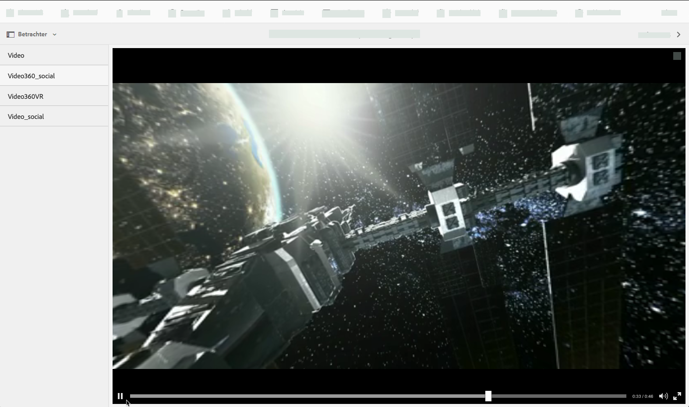
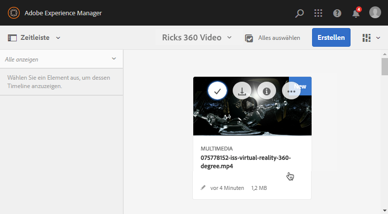
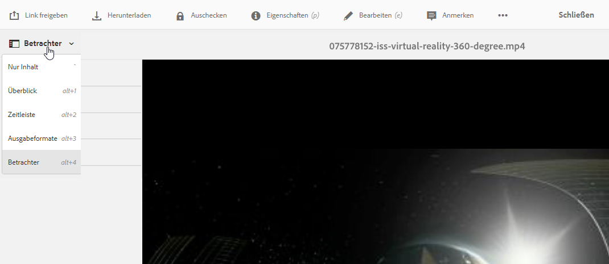
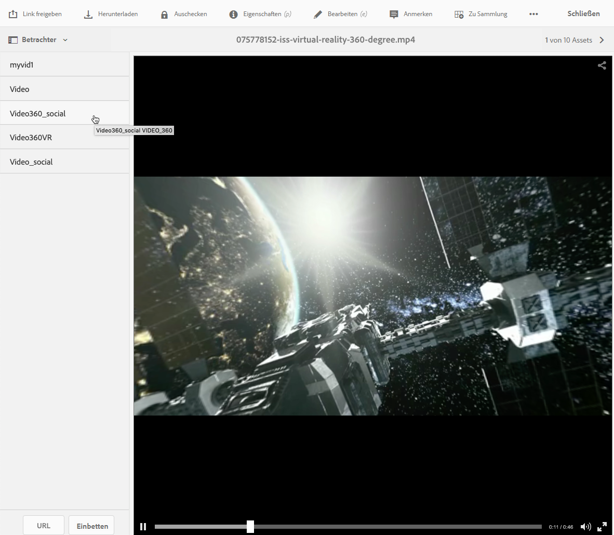
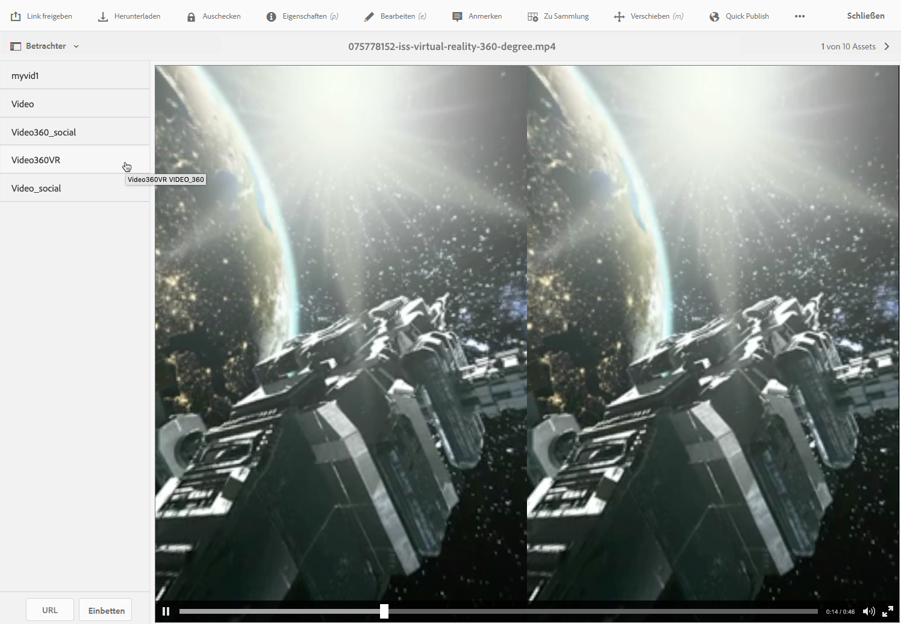

# 360-Grad-/VR-Video {#vr-video}

360-Grad-Videos zeichnen ein Motiv aus allen Richtungen gleichzeitig auf. Sie werden mit einer omnidirektionalen Kamera oder mit mehreren Kameras aufgenommen. Während der Wiedergabe auf einer flachen Anzeige kann der Benutzer den Anzeigewinkel bestimmen; bei der Wiedergabe auf Mobilgeräten werden in der Regel die integrierten gyroskopischen Funktionen verwendet.

Dynamic Media bietet native Unterstützung für die Bereitstellung von 360-Grad-Video-Assets. Standardmäßig ist keine weitere Konfiguration für die Anzeige oder die Wiedergabe erforderlich. 360-Grad-Videos werden mit Standardvideoerweiterungen wie .mp4, .mkv und .mov bereitgestellt. Der am häufigsten verwendete Codec ist H.264.

In diesem Abschnitt erfahren Sie, wie Sie mit dem 360-Grad-/VR-Video-Viewer ein Panoramavideo für eine interaktive Anzeige eines Raums, einer Eigenschaft, eines Standorts, einer Landschaft oder eines medizinischen Verfahrens rendern.

Räumliches Audio wird derzeit nicht unterstützt. Falls Audio in Stereo gemischt wird, ändert sich die Balance (L/R) nicht, wenn der Kunde den Anzeigewinkel der Kamera ändert.

Siehe [Verwenden von Dynamic Media-360-Grad-Videos und benutzerdefinierten Videominiaturen mit AEM Assets](https://docs.adobe.com/content/help/de-DE/experience-manager-learn/assets/dynamic-media/dynamic-media-360-video-custom-thumbnail-feature-video-use.html).

Informationen hierzu finden Sie in [Verwalten von Viewer-Vorgaben](/help/assets/dynamic-media/managing-viewer-presets.md).

## 360-Grad-Video in Aktion  {#video-in-action}

Tippen Sie auf [Space Station 360](http://mobiletest.scene7.com/s7viewers/html5/Video360Viewer.html?asset=Viewers/space_station_360-AVS), um ein Browser-Fenster zu öffnen und ein 360-Grad-Video anzusehen. Ziehen Sie während der Videowiedergabe den Mauszeiger an eine neue Position, um den Anzeigewinkel zu ändern.

-*Videoframe aus Space Station 360*

## 360-Grad-/VR-Video und Adobe Premiere Pro {#vr-video-and-adobe-premiere-pro}

Sie können 360-Grad-/VR-Videos mit Adobe Premiere Pro anzeigen und bearbeiten. Beispielsweise können Sie Logos und Text in einer Szene platzieren sowie speziell für Panoramavideos entwickelte Effekte und Überblendungen anwenden.

Weitere Informationen finden Sie unter [Bearbeiten von 360-Grad-/VR-Videos](https://helpx.adobe.com/de/premiere-pro/how-to/edit-360-vr-video.html).

## Hochladen von Assets für die Verwendung mit dem 360-Grad-Video-Viewer {#uploading-assets-for-use-with-the-video-viewer}

Beim Hochladen in Adobe Experience Manager werden 360-Grad-Video-Assets wie normale Video-Assets auf der Asset-Seite als **Multimedia** gekennzeichnet.

*Ein hochgeladenes 360-Grad-Video-Asset in der Kartenansicht. Das Asset wird als „Multimedia“ gekennzeichnet.*

**So laden Sie Assets für die Verwendung mit dem 360-Grad-Video-Viewer hoch:**

1. Erstellen Sie einen Ordner für Ihr 360-Grad-Video-Asset.
1. [Wenden Sie ein adaptives Videoprofil auf den Ordner an](/help/assets/dynamic-media/video-profiles.md#applying-a-video-profile-to-folders).

   Das Rendern von 360-Grad-Videos ist mit höheren Anforderungen an die Auflösung des Quellvideos sowie der kodierten Ausgabedarstellungen verbunden als Standard-Videoinhalte.

   Sie können das vordefinierte adaptive Videoprofil von Dynamic Media verwenden. Mit diesem erzielen Sie jedoch eine etwas schlechtere Qualität bei 360-Grad-Videos als bei normalen Videos, die mit den gleichen Einstellungen kodiert und mit einem normalen Video-Viewer gerendert wurden. Wenn Sie hochwertige 360-Grad-Videos benötigen, gehen Sie wie folgt vor:

   * Idealerweise sollten Ihre ursprünglichen 360-Grad-Videoinhalte eine der folgenden Auflösungen aufweisen:

      * 1080p – 1920 x 1080 (Full HD- oder FHD-Auflösung) oder
      * 2160p – 3840 x 2160 (4K-, UHD- oder Ultra HD-Auflösung). Diese besonders hohe Auflösung ist häufig auf Premium-Fernsehgeräten und Computermonitoren verfügbar. Die 2160p-Auflösung wird häufig als „4K“ bezeichnet, da die Breite fast 4000 Pixel beträgt. Das heißt, sie bietet viermal so viele Pixel wie 1080p.
   * [Erstellen Sie ein benutzerdefiniertes adaptives Videoprofil](/help/assets/dynamic-media/video-profiles.md#creating-a-video-encoding-profile-for-adaptive-streaming) mit hochwertigeren Ausgabedarstellungen. Angenommen, Sie möchten ein adaptives Videoprofil erstellen, das diese drei Einstellungen enthält:

      * width=auto; height=720; bitrate=2500 kbps
      * width=auto; height=1080; bitrate=5000 kbps
      * width=auto; height=1440; bitrate=6600 kbps
   * Verarbeiten Sie 360-Grad-Videoinhalte in einem Ordner, der ausschließlich 360-Grad-Video-Assets enthält.

   Beachten Sie, dass sich durch diese Vorgehensweise auch steigenden Anforderungen an Netzwerk und CPU beim Anwender ergeben.

1. [Laden Sie Ihr Video in den Ordner hoch](/help/assets/manage-video-assets.md#upload-and-preview-video-assets).

<!--

## Overriding the default aspect ratio of 360 videos  {#overriding-the-default-aspect-ratio-of-videos}

For an uploaded asset to qualify as a 360 video that you intend to use with the 360 Video viewer, the asset must have an aspect ratio of 2.

By default, AEM detects video as "360" if its aspect ratio (width/height) is 2.0. If you are an Administrator, you can override the default aspect ratio setting of 2 by setting the optional `s7video360AR` property in CRXDE Lite at the following:

* `/conf/global/settings/cloudconfigs/dmscene7/jcr:content`

  * **Property type**: Double
  * **Value**: floating-point aspect ratio, default 2.0.

After you set this property, it takes effect immediately on both existing videos and newly uploaded videos.

The aspect ratio applies to 360 video assets for the asset details page and the [Video 360 Media WCM component](/help/assets/dynamic-media/adding-dynamic-media-assets-to-pages.md#dynamic-media-components).

Start by uploading 360 Videos.

-->

## Anzeigen einer Vorschau für 360-Grad-Videos {#previewing-video}

Mit der Vorschau können Sie prüfen, wie das 360-Grad-Video bei Ihren Kunden aussieht, und sicherstellen, dass es sich wie erwartet verhält.

Siehe auch [Bearbeiten von Viewer-Vorgaben](/help/assets/dynamic-media/managing-viewer-presets.md#editing-viewer-presets).

Wenn das 360-Grad-Video Ihren Vorstellungen entspricht, können Sie es veröffentlichen.

Siehe [Einbetten des Video- oder Bild-Viewers auf einer Web-Seite](/help/assets/dynamic-media/embed-code.md).
Siehe [Verknüpfen von URLs mit einer Web-Anwendung](/help/assets/dynamic-media/linking-urls-to-yourwebapplication.md). Beachten Sie, dass die URL-basierte Verknüpfungsmethode nicht möglich ist, wenn Ihr interaktiver Inhalt über Links mit relativen URLs verfügt, insbesondere über Links zu Seiten in Adobe Experience Manager Sites.
Siehe [Hinzufügen von Dynamic Media-Assets zu Seiten](/help/assets/dynamic-media/adding-dynamic-media-assets-to-pages.md).

**So zeigen Sie eine Vorschau von 360-Grad-Videos an**

1. Navigieren Sie in **[!UICONTROL Assets]** zu einem von Ihnen erstellten 360-Grad-Video. Tippen Sie auf das 360-Grad-Videoasset, um es im Vorschaumodus zu öffnen.

   

   Tippen Sie auf das 360-Grad-Videoasset, um die Videovorschau anzuzeigen.

1. Tippen Sie links oben auf der Vorschauseite auf die Dropdown-Liste und wählen Sie **[!UICONTROL Viewer]** aus.

   

   Tippen Sie in der Viewer-Liste auf **[!UICONTROL Video360_social]** und führen Sie einen der folgenden Schritte aus:

   * Ziehen Sie den Mauszeiger über das Video, um den Anzeigewinkel der statischen Szene zu ändern.
   * Tippen Sie auf die Schaltfläche **[!UICONTROL Abspielen]**, um die Wiedergabe des Videos zu starten. Ziehen Sie dann den Mauszeiger über das Video, um den Anzeigewinkel zu ändern.

   *Screenshot eines 360-Grad-Videos.*

   * Tippen Sie in der Viewer-Liste auf **[!UICONTROL Video360VR]**.

      Virtual Reality (VR)-Videos sind interaktive Videoinhalte, die auf Virtual Reality-Headsets angezeigt werden. Wie bei herkömmlichen Videos erstellen Sie VR-Videos zu Beginn, wenn ein Video mit 360-Grad-Videokameras aufgezeichnet oder erfasst wird.
   
   *Screenshot eines 360-Grad-VR-Videos.*

1. Tippen Sie oben rechts auf **[!UICONTROL Schließen]**.

## Veröffentlichen von 360-Grad-Videos {#publishing-video}

Sie müssen das 360-Grad-Video veröffentlichen, um es zu verwenden. Die Veröffentlichung eines 360-Grad-Videos aktiviert die URL und den Einbettungs-Code. Außerdem wird das 360-Grad-Video in der Dynamic Media-Cloud veröffentlicht, die für eine skalierbare und leistungsfähige Bereitstellung mit einem CDN integriert ist.

Unter [Veröffentlichen von Dynamic Media-Assets](/help/assets/dynamic-media/publishing-dynamicmedia-assets.md) finden Sie Details zum Veröffentlichen von 360-Grad-Videos.
Siehe auch [Einbetten des Video- oder Bild-Viewers auf einer Web-Seite](/help/assets/dynamic-media/embed-code.md).
Siehe auch [Verknüpfen von URLs mit einer Web-Anwendung](/help/assets/dynamic-media/linking-urls-to-yourwebapplication.md). Beachten Sie, dass die URL-basierte Verknüpfungsmethode nicht möglich ist, wenn Ihr interaktiver Inhalt über Links mit relativen URLs verfügt, insbesondere über Links zu Seiten in Adobe Experience Manager Sites.
Siehe auch [Hinzufügen von Dynamic Media-Assets zu Seiten](/help/assets/dynamic-media/adding-dynamic-media-assets-to-pages.md).
