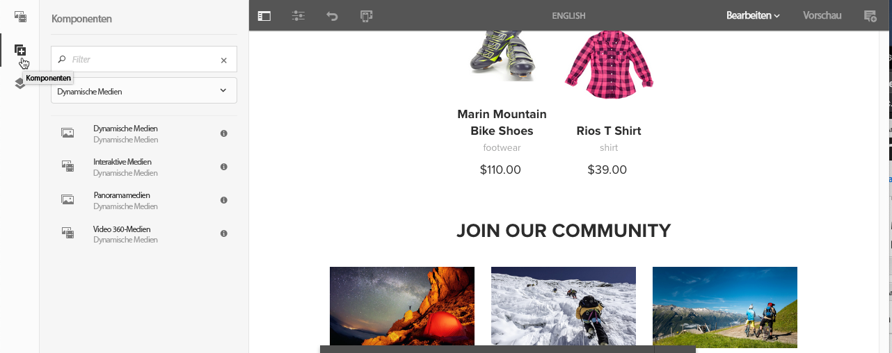
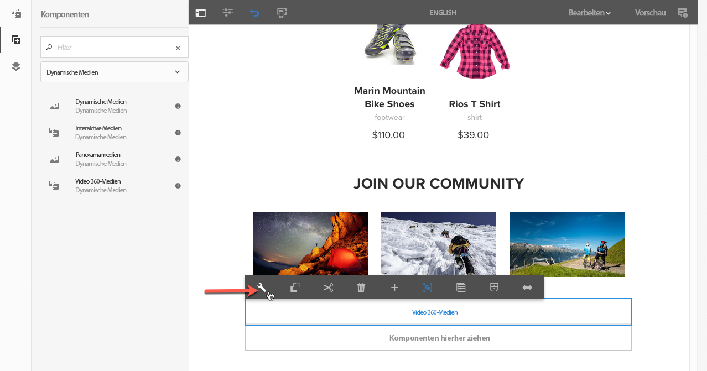
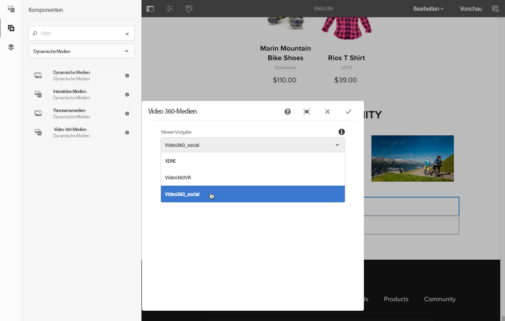
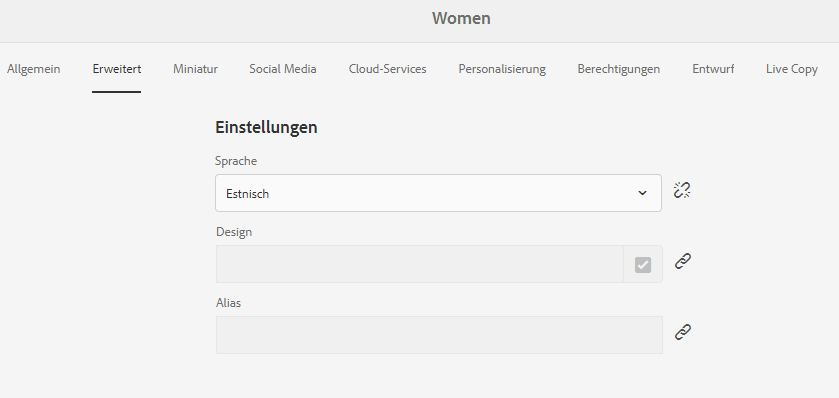
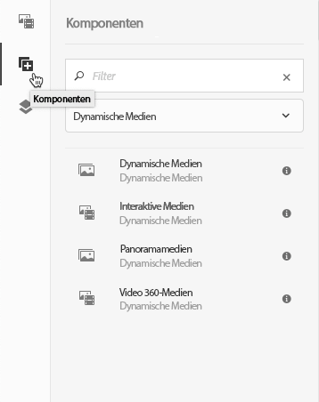
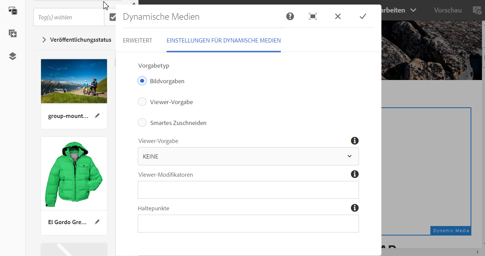
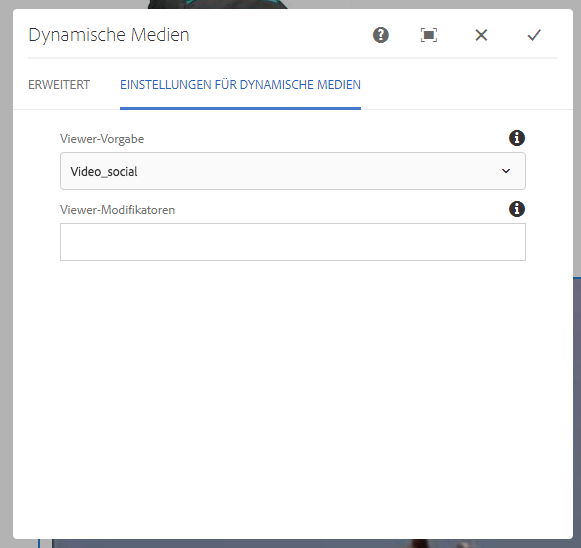
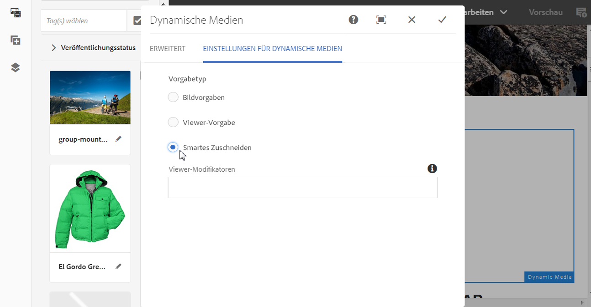
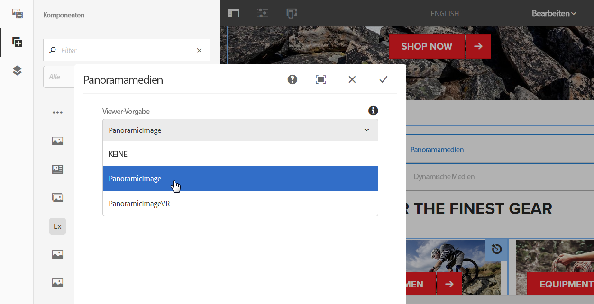
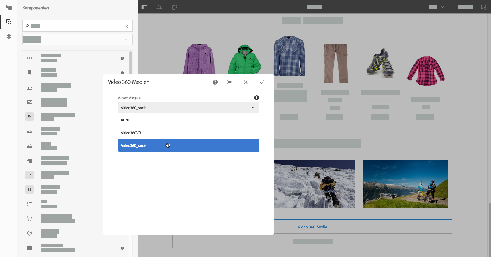

# Hinzufügen von Dynamic Media-Assets zu Seiten{#adding-dynamic-media-assets-to-pages}

<table>
    <tr>
        <td>
            <i>Neu</i> <a href="/help/assets/dynamic-media/dm-prime-ultimate.md"><b>Dynamic Media Prime und Ultimate</b></a>
        </td>
        <td>
            <i>Neu</i> <a href="/help/assets/assets-ultimate-overview.md"><b>AEM Assets Ultimate</b></a>
        </td>
        <td>
            <i>Neu</i> <a href="/help/assets/integrate-aem-assets-edge-delivery-services.md"><b>AEM Assets-Integration mit Edge Delivery Services</b></a>
        </td>
        <td>
            <i>Neu</i> <a href="/help/assets/aem-assets-view-ui-extensibility.md"><b>Erweiterbarkeit der Benutzeroberfläche</b></a>
        </td>
          <td>
            <i>Neu</i> <a href="/help/assets/dynamic-media/enable-dynamic-media-prime-and-ultimate.md"><b>Aktivieren von Dynamic Media Prime und Ultimate</b></a>
        </td>
    </tr>
    <tr>
        <td>
            <a href="/help/assets/search-best-practices.md"><b>Best Practices für die Suche</b></a>
        </td>
        <td>
            <a href="/help/assets/metadata-best-practices.md"><b>Best Practices für Metadaten</b></a>
        </td>
        <td>
            <a href="/help/assets/product-overview.md"><b>Content Hub</b></a>
        </td>
        <td>
            <a href="/help/assets/dynamic-media-open-apis-overview.md"><b>Dynamic Media mit OpenAPI-Funktionen</b></a>
        </td>
        <td>
            <a href="https://developer.adobe.com/experience-cloud/experience-manager-apis/"><b>Entwicklerdokumentation zu AEM Assets</b></a>
        </td>
    </tr>
</table>

Um die Dynamic Media-Funktionen zu Assets hinzuzufügen, die Sie auf Ihren Websites verwenden, können Sie die Komponente für **Dynamic Media**, **Interaktive Medien**, **Panorama Medien** oder **360-Grad-Videomedien** direkt auf der Seite hinzufügen. Sie wechseln in den Layout-Modus und aktivieren die Dynamic Media-Komponenten. Anschließend fügen Sie der Seite diese Komponenten und der Komponente Assets hinzu. Die Komponenten für Dynamic Media sind smart – sie erkennen, ob Sie ein Bild oder ein Video hinzufügen. Die verfügbaren Konfigurationsoptionen ändern sich entsprechend.

Sie fügen Dynamic Media-Assets direkt zur Seite hinzu, wenn Sie [!DNL Adobe Experience Manager] als WCM verwenden. Wenn Sie einen Drittanbieter für Ihr WCM verwenden, [verknüpfen](/help/assets/dynamic-media/linking-urls-to-yourwebapplication.md) Sie Ihre Assets oder [betten Sie sie ein](/help/assets/dynamic-media/embed-code.md). Eine responsive Website von Drittanbietern finden Sie unter [Bereitstellen optimierter Bilder für eine responsive Site](/help/assets/dynamic-media/responsive-site.md).

>[!NOTE]
>
>Stellen Sie sicher, dass Sie Assets veröffentlichen, bevor Sie sie zu Seiten in [!DNL Experience Manager] hinzuzufügen. Weitere Informationen finden Sie unter [Veröffentlichen von Dynamic Media-Assets](/help/assets/dynamic-media/publishing-dynamicmedia-assets.md).

## Hinzufügen einer Dynamic Media-Komponente zu einer Seite {#adding-a-dynamic-media-component-to-a-page}

Beim Hinzufügen einer Komponente für 3D Media, Dynamic Media, interaktive Medien, Panoramamedien, Smart-Zuschnitt-Videos oder 360-Grad-Videomedien gehen Sie genauso vor wie beim Hinzufügen einer Komponente zu einer beliebigen Seite.

**So fügen Sie einer Seite eine Dynamic Media-Komponente hinzu:**

1. Öffnen Sie in [!DNL Experience Manager] die Seite, auf der Sie die Dynamic Media-Komponente hinzufügen möchten.
1. Klicken Sie im linken Bereich auf das Symbol **[!UICONTROL Komponenten]** und filtern Sie nach „Dynamic Media“.

   Wenn keine Liste der Dynamic Media-Komponenten verfügbar ist, müssen Sie wahrscheinlich die zu verwendenden Dynamic Media-Komponenten aktivieren. Informationen hierzu finden Sie unter [Aktivieren von Dynamic Media-Komponenten](#enabling-dynamic-media-components).

   

1. Ziehen Sie eine **[!UICONTROL Dynamic Media]**-Komponente per Drag-and-Drop an die gewünschte Position auf der Seite.

1. Bewegen Sie den Zeiger direkt über die Komponente. Wenn die Komponente blau hervorgehoben wird, klicken Sie einmal darauf, um die Symbolleiste der Komponente anzuzeigen. Klicken Sie auf das Symbol **[!UICONTROL Konfiguration]** (Schraubenschlüssel).

   

1. Je nachdem, welche Dynamic Media-Komponente Sie auf der Seite abgelegt haben, wird ein Konfigurationsdialogfeld geöffnet. [Legen Sie bei Bedarf die Optionen der Komponente fest](/help/assets/dynamic-media/adding-dynamic-media-assets-to-pages.md#dynamic-media-components).

   Im folgenden Beispiel sehen Sie das Dialogfeld der Dynamic Media-Komponente **[!UICONTROL Video-360-Medien]** und die verfügbaren Optionen in der Dropdown-Liste für Viewer-Vorgaben.

   

   Die Dynamic Media-Komponente für 360-Grad-Videomedien

1. Wenn Sie fertig sind, klicken Sie oben rechts im Dialogfeld auf das Häkchen, um Ihre Änderungen zu speichern.

### Aktivieren von Dynamic Media-Komponenten {#enabling-dynamic-media-components}

Wenn keine Dynamic Media-Komponenten zum Hinzufügen zu einer Seite verfügbar sind, bedeutet dies wahrscheinlich, dass Sie zunächst die zu verwendenden Komponenten aktivieren müssen.

1. Öffnen Sie in [!DNL Experience Manager] die Seite, auf der Sie die Dynamic Media-Komponente hinzufügen möchten.
1. Klicken Sie links oben auf der Seite in der Symbolleiste auf das Symbol „Seiteninformationen“ und wählen Sie dann in der Dropdown-Liste **[!UICONTROL Vorlage bearbeiten]** aus.

   

1. Wählen Sie oben rechts auf der Seite in der Symbolleiste in der Dropdown-Liste **[!UICONTROL Struktur]** aus.

   

1. Wählen Sie unten auf der Seite **[!UICONTROL Layout-Container]**, um die Symbolleiste zu öffnen. Wählen Sie anschließend das Symbol „Richtlinie“.
1. Stellen Sie auf der Seite **[!UICONTROL Layout-Container]** unter der Überschrift **[!UICONTROL Eigenschaften]** sicher, dass die Registerkarte **[!UICONTROL Zugelassene Komponenten]** ausgewählt ist.

   

1. Scrollen Sie nach unten, bis **[!UICONTROL Dynamic Media]** angezeigt wird.
1. Klicken Sie links neben **[!UICONTROL Dynamic Media]** auf das Symbol „>“ und wählen Sie die Dynamic Media-Komponenten aus, die Sie aktivieren möchten.

   

1. Klicken Sie rechts oben auf der Seite **[!UICONTROL Layout-Container]** auf das Symbol „Fertig“ (Häkchen).

1. Wählen Sie oben rechts auf der Seite in der Symbolleiste in der Dropdown-Liste **[!UICONTROL Anfangsinhalt]** aus.
1. [Fügen Sie wie gewohnt eine Dynamic Media-Komponente zu einer Seite hinzu](#adding-a-dynamic-media-component-to-a-page).

## Lokalisieren von Komponenten vom Typ „Dynamische Medien“ {#localizing-dynamic-media-components}

Zum Lokalisieren von Dynamic Media-Komponenten stehen Ihnen zwei Möglichkeiten zur Verfügung:

* Öffnen Sie auf einer Web-Seite unter „Sites“ die Option **[!UICONTROL Eigenschaften]** und wählen Sie die Registerkarte **[!UICONTROL Erweitert]** aus. Wählen Sie die gewünschte Sprache für die Lokalisierung aus.

  

* Wählen Sie über den Site-Selector die gewünschte Seite oder Seitengruppe aus. Klicken Sie auf **[!UICONTROL Eigenschaften]** und wählen Sie die Registerkarte **[!UICONTROL Erweitert]** aus. Wählen Sie die gewünschte Sprache für die Lokalisierung aus.

  >[!NOTE]
  >
  >Nicht allen Sprachen, die im Menü **[!UICONTROL Sprache]** verfügbar sind, sind Token zugewiesen.

## Verfügbare Dynamic Media-Komponenten {#dynamic-media-components}

Dynamic Media-Komponenten sind verfügbar, wenn Sie auf das Symbol **[!UICONTROL Komponenten]** klicken und nach **[!UICONTROL Dynamic Media]** filtern.

Zu den verfügbaren Dynamic Media-Komponenten zählen:

* **[!UICONTROL Dynamic Media]**: Assets wie Bilder, Videos, E-Kataloge und Rotationssets.
* **[!UICONTROL Interaktive Medien]**: interaktive Assets wie interaktive Videos, interaktive Bilder oder Karussellsets.
* **[!UICONTROL Panoramamedien]**: Panoramabilder oder VR-Panoramabilder.
* **[!UICONTROL Video-360-Medien]**: 360-Grad-Videos und 360-Grad-VR-Videos.

>[!NOTE]
>
>Diese Komponenten sind nicht standardmäßig verfügbar und müssen zunächst über den Vorlageneditor bereitgestellt werden. Nachdem sie im Vorlageneditor verfügbar gemacht wurden, können Sie die Komponenten wie jede andere [!DNL Experience Manager]-Komponente Ihrer Seite hinzufügen.

### Komponente: Dynamic Media {#dynamic-media-component}

Die Dynamic Media-Komponente ist intelligent. In Abhängigkeit davon, ob Sie ein Bild oder Video hinzufügen, haben Sie verschiedene Optionen. Die Komponente unterstützt Bildvorgaben, bildbasierte Viewer wie Bildsets sowie Rotationssets, Sets für gemischte Medien und Videos. Zudem ist der Viewer dynamisch. Die Größe des Bildschirms ändert sich demnach automatisch auf Grundlage der Bildschirmgröße. Bei allen Viewern handelt es sich um HTML5-Viewer.

>[!NOTE]
>
>Wenn Folgendes auf Ihre Web-Seite zutrifft:
>
>* Mehrere Instanzen der Dynamic Media-Komponente werden auf derselben Seite verwendet.
>* Jede Instanz verwendet denselben Asset-Typ.
>
>Sie können den einzelnen Dynamic Media-Komponenten auf dieser Seite nicht unterschiedliche Viewer-Vorgaben zuweisen.
>
>Sie können jedoch dieselbe Viewer-Vorgabe für alle Dynamic Media-Komponenten, die Assets desselben Typs verwenden, auf der Seite verwenden.

Wenn Sie die Dynamic Media-Komponente hinzufügen und **[!UICONTROL Einstellungen für Dynamic Media]** leer ist, ist es nicht möglich, ein Asset ordnungsgemäß hinzuzufügen. Überprüfen Sie Folgendes:

* das Bild eine Pyramid TIFF-Datei aufweist. Bilder, die vor der Aktivierung von Dynamic Media importiert wurden, verfügen nicht über eine Pyramid TIFF-Datei.

#### Arbeiten mit Bildern {#when-working-with-images}

Mit der Komponente „Dynamic Media“ können Sie dynamische Bilder, einschließlich Bildsets, Rotationssets und Sets für gemischte Medien, hinzufügen. Sie können Vergrößerungen sowie Verkleinerungen vornehmen und (sofern zutreffend) ein Bild in einem Rotationsset drehen oder ein Bild aus einem anderen Set auswählen.

Sie können zudem die Viewer-Vorgabe, Bildvorgabe oder das Bildformat direkt in der Komponente konfigurieren. Um ein Bild dynamisch zu machen, können Sie die Breakpoints festlegen oder eine dynamische Bildvorgabe anwenden.

Sie können die folgenden Einstellungen für Dynamic Media bearbeiten, indem Sie in der Komponente auf das Symbol **[!UICONTROL Bearbeiten]** und dann auf **[!UICONTROL Einstellungen für Dynamic Media]** klicken.

>[!NOTE]
>
>Standardmäßig ist die Bildkomponente für Dynamic Media adaptiv. Wenn Sie eine feste Größe einrichten möchten, legen Sie sie auf der Registerkarte **[!UICONTROL Erweitert]** in der Komponente mit der **[!UICONTROL Breite]** und **[!UICONTROL Höhe]** fest.

* **[!UICONTROL Viewer-Vorgabe]**: Wählen Sie in der Dropdown-Liste eine vorhandene Viewer-Vorgabe aus. Wenn die gewünschte Viewer-Vorgabe nicht sichtbar ist, müssen Sie sie möglicherweise sichtbar machen. Siehe „Verwalten von Viewer-Vorgaben“. Es ist nicht möglich, eine Viewer-Vorgabe auszuwählen, wenn Sie eine Bildvorgabe verwenden, und umgekehrt.

  Diese Option ist beim Anzeigen von Bildsets, Rotationssets oder Sets für gemischte Medien die einzig verfügbare Option. Die angezeigten Viewer-Vorgaben sind ebenfalls intelligent – es werden nur relevante Viewer-Vorgaben angezeigt.

* **[!UICONTROL Viewer-Modifikatoren]**: Viewer-Modifikatoren haben die Form „name=value pair with a &amp; delimiter“ (Name=Wertepaar mit einem &amp;-Trennzeichen ) und ermöglichen eine Viewer-Bearbeitung, wie im Viewers-Referenzhandbuch beschrieben. Ein Beispiel für einen Viewer-Modifikator ist `posterimage=img.jpg&caption=text.vtt,1`. Damit wird ein anderes Bild für die Videominiatur festgelegt und eine Datei für verdeckte Untertitel mit dem Video verknüpft.

* **[!UICONTROL Bildvorgabe]**: Wählen Sie in der Dropdown-Liste eine vorhandene Bildvorgabe aus. Wenn die gewünschte Bildvorgabe nicht sichtbar ist, müssen Sie sie sichtbar machen. Siehe [Verwalten von Bildvorgaben](/help/assets/dynamic-media/managing-image-presets.md). Es ist nicht möglich, eine Viewer-Vorgabe auszuwählen, wenn Sie eine Bildvorgabe verwenden, und umgekehrt.

  Diese Option ist beim Anzeigen von Bildsets, Rotationssets oder Sets für gemischte Medien nicht verfügbar.

* **[!UICONTROL Bildmodifikatoren]**: Sie können Bildeffekte anwenden, indem Sie weitere Bildbefehle bereitstellen. Diese Befehle werden unter „Bildvorgaben“ und in der Referenz zum Image-Serving-Befehl beschrieben.

  Diese Option ist beim Anzeigen von Bildsets, Rotationssets oder Sets für gemischte Medien nicht verfügbar.

* **[!UICONTROL Breakpoints]**: Wenn Sie dieses Asset auf einer responsiven Website verwenden, müssen Sie die Bild-Breakpoints hinzufügen. Bild-Breakpoints müssen durch Kommas (,) voneinander getrennt werden. Diese Option kann verwendet werden, wenn in einer Bildvorgabe keine Höhe oder Breite festgelegt ist.

  Diese Option ist beim Anzeigen von Bildsets, Rotationssets oder Sets für gemischte Medien nicht verfügbar.

  Sie können die folgenden erweiterten Einstellungen bearbeiten, indem Sie in der Komponente auf **[!UICONTROL Bearbeiten]** klicken.

* **[!UICONTROL Für Geräte mit höherer Auflösung optimieren]** – Aktivieren Sie das Kontrollkästchen (Standard), um die Optimierung des DPR (Device Pixel Ratio, Gerätepixelverhältnis) zu ermöglichen.

  Die Option **[!UICONTROL Für Geräte mit höherer Auflösung optimieren]** wird nur angezeigt, wenn Folgendes zutrifft:
   * Unter „Vorgabetyp“ ist **[!UICONTROL Bildvorgabe]** ausgewählt und **[!UICONTROL RESS_IP]** wird aus der Dropdownliste **[!UICONTROL Bildvorgabe]** ausgewählt.

  

  Siehe auch [Informationen zur Optimierung des DPR](/help/assets/dynamic-media/imaging-faq.md#dpr).

  Alle [!DNL Experience Manager] Dynamic Media-DPR-Werte für die intelligente Bildbearbeitung werden ignoriert.

* **[!UICONTROL Titel]**: Ändern Sie den Bildtitel.

* **[!UICONTROL Alternativer Text]**: Geben Sie dem Bild einen Titel, für die Benutzer, deren Grafiken deaktiviert sind.

  Diese Option ist beim Anzeigen von Bildsets, Rotationssets oder Sets für gemischte Medien nicht verfügbar.

* **[!UICONTROL URL, Öffnen in]**: Sie können ein Asset so einrichten, dass ein Link geöffnet wird. Legen Sie die URL fest. Geben Sie in „Öffnen in“ an, ob der Link im selben oder einem neuen Fenster geöffnet werden soll.

  Diese Option ist beim Anzeigen von Bildsets, Rotationssets oder Sets für gemischte Medien nicht verfügbar.

* **[!UICONTROL Breite]**: Geben Sie einen Wert in Pixeln an, wenn das Bild eine feste Größe aufweisen soll. Wenn die Werte leer gelassen werden, ist das Asset adaptiv.

* **[!UICONTROL Höhe]**: Geben Sie einen Wert in Pixeln an, wenn das Bild eine feste Größe aufweisen soll. Wenn die Werte leer gelassen werden, ist das Asset adaptiv.

#### Arbeiten mit Videos {#when-working-with-video}

Verwenden Sie die Dynamic Media-Komponente, um Ihren Web-Seiten dynamische Videos hinzuzufügen. Beim Bearbeiten der Komponente können Sie eine vordefinierte Video-Viewer-Vorgabe für das Wiedergeben des Videos auf der Seite verwenden.

Sie können die folgenden Dynamic Media-Einstellungen bearbeiten, indem Sie in der Komponente auf **[!UICONTROL Bearbeiten]** klicken.

>[!NOTE]
>
>Die Videokomponente für Dynamic Media ist standardmäßig adaptiv. Wenn sie eine feste Größe aufweisen soll, müssen Sie dies in der Komponente auf der Registerkarte **[!UICONTROL Erweitert]** mit **[!UICONTROL Breite]** und **[!UICONTROL Höhe]** festlegen.

* **[!UICONTROL Viewer-Vorgabe]**: Wählen Sie in der Dropdown-Liste eine vorhandene Video-Viewer-Vorgabe aus. Wenn die gewünschte Viewer-Vorgabe nicht sichtbar ist, müssen Sie sie möglicherweise sichtbar machen. Siehe „Verwalten von Viewer-Vorgaben“.

* **[!UICONTROL Viewer-Modifikatoren]**: Viewer-Modifikatoren haben die Form eines `name=value`-Paars mit einem `&`-Trennzeichen. Sie können die Viewer ändern, wie im Viewers-Referenzhandbuch von Adobe beschrieben. Ein Beispiel für einen Viewer-Modifikator ist `posterimage=img.jpg&caption=text.vtt,1`.

  Viewer-Modifikatoren ermöglichen z. B. Folgendes:

   * Verknüpfen einer Untertiteldatei mit einem Video: [Untertitel](https://experienceleague.adobe.com/docs/dynamic-media-developer-resources/library/viewers-aem-assets-dmc/video/command-reference-url-video/r-html5-video-viewer-url-caption.html?lang=de)
   * Verknüpfen einer Navigationsdatei mit einem Video: [Navigation](https://experienceleague.adobe.com/docs/dynamic-media-developer-resources/library/viewers-aem-assets-dmc/video/command-reference-url-video/r-html5-video-viewer-url-navigation.html?lang=de)

     Sie können die folgenden erweiterten Einstellungen bearbeiten, indem Sie in der Komponente auf **[!UICONTROL Bearbeiten]** klicken.

* **[!UICONTROL Titel]**: Ändern Sie den Videotitel.

* **[!UICONTROL Breite]**: Geben Sie einen Wert in Pixeln an, wenn das Bild eine feste Größe aufweisen soll. Wenn die Werte leer gelassen werden, ist das Asset adaptiv.

* **[!UICONTROL Höhe]**: Geben Sie einen Wert in Pixeln an, wenn das Bild eine feste Größe aufweisen soll. Wenn die Werte leer gelassen werden, ist das Asset adaptiv.

#### Bei der Arbeit mit smartem Zuschneiden {#when-working-with-smart-crop}

Verwenden Sie die Dynamic Media-Komponente, um Bild-Assets für smartes Zuschneiden zu Ihren Web-Seiten hinzuzufügen. Beim Bearbeiten der Komponente können Sie eine vordefinierte Video-Viewer-Vorgabe für das Wiedergeben des Videos auf der Seite verwenden.

Weitere Informationen finden Sie unter [Verwenden von smartem Zuschneiden mit Experience Manager Assets Dynamic Media](https://experienceleague.adobe.com/docs/experience-manager-learn/assets/dynamic-media/images/smart-crop-feature-video-use.html?lang=de)

Weitere Informationen finden Sie unter [Bildprofile](/help/assets/dynamic-media/image-profiles.md).

Sie können die folgende Dynamic Media-Einstellung bearbeiten, indem Sie in der Komponente auf **[!UICONTROL Bearbeiten]** klicken.

>[!NOTE]
>
>Standardmäßig ist die Bildkomponente für Dynamic Media adaptiv. Wenn Sie eine feste Größe einrichten möchten, legen Sie sie auf der Registerkarte **[!UICONTROL Erweitert]** in der Komponente mit der **[!UICONTROL Breite]** und **[!UICONTROL Höhe]** fest.

* **[!UICONTROL Bildmodifikatoren]**: Sie können Bildeffekte anwenden, indem Sie weitere Bildbefehle bereitstellen. Diese Befehle werden unter „Bildvorgaben“ und in der Referenz zum Image-Serving-Befehl beschrieben.

  Diese Option ist beim Anzeigen von Bildsets, Rotationssets oder Sets für gemischte Medien nicht verfügbar.

  Sie können die folgenden erweiterten Einstellungen bearbeiten, indem Sie in der Komponente auf **[!UICONTROL Bearbeiten]** klicken.

* **[!UICONTROL Seitenverhältnisübereinstimmung aktivieren]**: Wählen Sie diese Option aus, damit Dynamic Media eine intelligente zugeschnittene (Smart-Crop) Ausgabedarstellung mit einem Seitenverhältnis auswählt, das dem Seitenverhältnis des Originalbilds am besten entspricht.

* **[!UICONTROL Für Geräte mit höherer Auflösung optimieren]** – Aktivieren Sie das Kontrollkästchen (Standard), um die Optimierung des DPR (Device Pixel Ratio, Gerätepixelverhältnis) zu ermöglichen.

  Die Option **[!UICONTROL Für Geräte mit höherer Auflösung optimieren]** wird nur angezeigt, wenn Folgendes zutrifft:

   * Unter „Vorgabetyp“ ist die Option **[!UICONTROL Smartes Zuschneiden]** ausgewählt.

  

  Siehe auch [Informationen zur Optimierung des DPR](/help/assets/dynamic-media/imaging-faq.md#dpr).

  Alle [!DNL Experience Manager] Dynamic Media-DPR-Werte für die intelligente Bildbearbeitung werden ignoriert.

* **[!UICONTROL Titel]**: Ändern Sie den Titel des Smart-Crop-Bildes.

* **[!UICONTROL Alternativer Text]**: Geben Sie dem Smart-Crop-Bild einen Titel, für die Benutzer, deren Grafiken deaktiviert sind.

  Diese Option ist beim Anzeigen von Bildsets, Rotationssets oder Sets für gemischte Medien nicht verfügbar.

* **[!UICONTROL URL, Öffnen in]**: Sie können ein Asset so einrichten, dass ein Link geöffnet wird. Legen Sie die URL fest. Geben Sie in „Öffnen in“ an, ob der Link im selben oder einem neuen Fenster geöffnet werden soll.

  Diese Option ist beim Anzeigen von Bildsets, Rotationssets oder Sets für gemischte Medien nicht verfügbar.

* **[!UICONTROL Breite]**: Geben Sie einen Wert in Pixeln an, wenn das Bild eine feste Größe aufweisen soll. Wenn die Werte leer gelassen werden, ist das Asset adaptiv.

* **[!UICONTROL Höhe]**: Geben Sie einen Wert in Pixeln an, wenn das Bild eine feste Größe aufweisen soll. Wenn die Werte leer gelassen werden, ist das Asset adaptiv.

### Komponente: Interaktive Medien {#interactive-media-component}

Die interaktive Medienkomponente eignet sich für Assets, die interaktiv sind, wie Hotspots oder Imagemaps. Verwenden Sie bei interaktiven Bildern, interaktiven Videos oder Karussellbannern die Komponente **[!UICONTROL Interaktive Medien]**.

Die Komponente Interaktives Medium ist intelligent. In Abhängigkeit davon, ob Sie ein Bild oder Video hinzufügen, haben Sie verschiedene Optionen. Zudem ist der Viewer responsiv. Die Größe des Bildschirms ändert sich demnach automatisch auf Grundlage der Bildschirmgröße. Bei allen Viewern handelt es sich um HTML5-Viewer.

>[!NOTE]
>
>Wenn Folgendes auf Ihre Web-Seite zutrifft:
>
>* Mehrere Instanzen der interaktiven Medienkomponente werden auf derselben Seite verwendet.
>* Jede Instanz verwendet denselben Asset-Typ.
>
>Sie können den einzelnen Komponenten für interaktive Medien auf dieser Seite nicht unterschiedliche Viewer-Vorgaben zuweisen.
>
>Sie können jedoch dieselbe Viewer-Vorgabe für alle interaktiven Medienkomponenten, die Assets desselben Typs verwenden, auf der Seite verwenden.

Sie können die folgenden **[!UICONTROL allgemeinen]** Einstellungen bearbeiten, indem Sie in der Komponente auf **[!UICONTROL Bearbeiten]** klicken.

* **[!UICONTROL Viewer-Vorgabe]**: Wählen Sie in der Dropdown-Liste eine vorhandene Viewer-Vorgabe aus. Wenn die gewünschte Viewer-Vorgabe nicht sichtbar ist, müssen Sie sie möglicherweise sichtbar machen. Viewer-Vorgaben müssen veröffentlicht werden, bevor sie verwendet werden können. Siehe „Verwalten von Viewer-Vorgaben“.

* **[!UICONTROL Titel]**: Ändern Sie den Videotitel.

* **[!UICONTROL Breite]**: Geben Sie einen Wert in Pixeln an, wenn das Bild eine feste Größe aufweisen soll. Wenn die Werte leer gelassen werden, ist das Asset adaptiv.

* **[!UICONTROL Höhe]**: Geben Sie einen Wert in Pixeln an, wenn das Bild eine feste Größe aufweisen soll. Wenn die Werte leer gelassen werden, ist das Asset adaptiv.

  Sie können die folgenden Einstellungen von **[!UICONTROL Zu Warenkorb hinzufügen]** bearbeiten, indem Sie in der Komponente auf **[!UICONTROL Bearbeiten]** klicken.

* **[!UICONTROL Produkt-Asset anzeigen]**: Dieser Wert ist standardmäßig ausgewählt. Das Produkt-Asset zeigt ein Bild des Produkts an, wie im Commerce-Modul definiert. Deaktivieren Sie das Kontrollkästchen, um das Produkt-Asset nicht anzuzeigen.

* **[!UICONTROL Produktpreis anzeigen]**: Dieser Wert ist standardmäßig ausgewählt. Der Produktpreis gibt den Preis des Artikels an, wie im Commerce-Modul definiert. Deaktivieren Sie das Kontrollkästchen, um den Produktpreis nicht anzuzeigen.

* **[!UICONTROL Produktformular anzeigen]**: Dieser Wert ist standardmäßig nicht ausgewählt. Das Produktformular beinhaltet jegliche Produktvarianten, etwa hinsichtlich der Größe und der Farbe. Deaktivieren Sie das Kontrollkästchen, um die Produktvarianten nicht anzuzeigen.

### Komponente: Panoramamedien {#panoramic-media-component}

Die Panoramamedienkomponente ist für die Assets bestimmt, bei denen es sich um kugelförmige Panoramabilder handelt. Solche Bilder bieten ein 360°-Betrachtungserlebnis eines Raums, einer Immobile, eines Ortes oder einer Landschaft. Damit ein Bild als kugelförmiges Panoramabild gilt, muss MINDESTENS eine der beiden folgenden Eigenschaften zutreffen:

* Ein Seitenverhältnis von 2:1.
* Mit den Keywords `equirectangular` oder (`spherical` + `panorama`) oder (`spherical` + `panoramic`) markiert. Weitere Informationen finden Sie unter [Verwenden von Tags](/help/sites-cloud/authoring/sites-console/tags.md).

Die Kriterien für das Seitenverhältnis sowie die Keywords gelten für Panorama-Assets für die Asset-Detailseite und die WCM-Komponente **[!UICONTROL Panoramamedien]**.

>[!NOTE]
>
>Wenn Folgendes auf Ihre Web-Seite zutrifft:
>
>* Mehrere Instanzen der Komponente für **[!UICONTROL Panoramamedien]** werden auf derselben Seite verwendet.
>* Jede Instanz verwendet denselben Asset-Typ.
>
>Sie können den einzelnen Komponenten für **[!UICONTROL Panoramamedien]** auf dieser Seite nicht unterschiedliche Viewer-Vorgaben zuweisen.
>
>Sie können jedoch dieselbe Viewer-Vorgabe für alle Komponenten für Panoramamedien, die Assets desselben Typs verwenden, auf der Seite verwenden.

Sie können die folgenden Einstellungen bearbeiten, indem Sie in der Komponente auf **[!UICONTROL Konfigurieren]** klicken.

* **[!UICONTROL Viewer-Vorgabe]**: Wählen Sie einen vorhandenen Viewer aus der Dropdown-Liste „Viewer-Vorgaben“ aus.

Wenn die gesuchte Viewer-Vorgabe nicht angezeigt wird, stellen Sie sicher, dass sie veröffentlicht wurde. Veröffentlichen Sie Viewer-Vorgaben, bevor Sie sie verwenden. Siehe [Verwalten von Viewer-Vorgaben](/help/assets/dynamic-media/managing-viewer-presets.md).

### Komponente: 360-Grad-Videomedien {#video-media-component}

Verwenden Sie die Komponente für **[!UICONTROL 360-Grad-Videomedien]**, um äquirektanguläre Videos auf Ihrer Web-Seite wiederzugeben. Auf diese Weise können Sie einen Raum, eine Immobilie, einen Ort, eine Landschaft oder einen medizinischen Eingriff in ein immersives Anwendererlebnis verwandeln.

Während der Wiedergabe auf einer flachen Anzeige kann der Benutzer den Anzeigewinkel bestimmen; bei der Wiedergabe auf Mobilgeräten werden in der Regel die integrierten gyroskopischen Funktionen verwendet.

Der Viewer bietet native Unterstützung für die Bereitstellung von 360-Grad-Video-Assets. Standardmäßig ist keine weitere Konfiguration für die Anzeige oder die Wiedergabe erforderlich. 360-Grad-Videos werden mit Standardvideoerweiterungen wie .mp4, .mkv und .mov bereitgestellt. Der häufigste Codec ist H.264.

Sie können die folgenden Einstellungen bearbeiten, indem Sie in der Komponente auf **[!UICONTROL Konfigurieren]** klicken.

* **[!UICONTROL Viewer-Vorgabe]**: Wählen Sie einen vorhandenen Viewer aus der Dropdown-Liste „Viewer-Vorgaben“ aus. Verwenden Sie „Video360VR“ für Endbenutzer, die Virtual-Reality-Brillen verwenden. Enthält grundlegende Steuerelemente für die Videowiedergabe und Social-Media-Eigenschaften. Verwenden Sie „Video360_social“ mit grundlegenden Steuerelementen für die Videowiedergabe. Das Video-Rendering erfolgt im Stereo-Modus. Die manuelle Perspektivensteuerung ist deaktiviert, aber die gyroskopische Steuerung ist aktiviert. Es sind keine Eigenschaften für Social Media verfügbar.

Wenn die gesuchte Viewer-Vorgabe nicht angezeigt wird, stellen Sie sicher, dass sie veröffentlicht wurde. Veröffentlichen Sie Viewer-Vorgaben, bevor Sie sie verwenden. Siehe [Verwalten von Viewer-Vorgaben](/help/assets/dynamic-media/managing-viewer-presets.md).

### Verwenden von HTTP/2, um Dynamic Media-Assets bereitzustellen {#using-http-to-delivery-dynamic-media-assets}

HTTP/2 ist das neue, aktualisierte Web-Protokoll, das die Kommunikation zwischen Browser und Servern verbessert. Es beschleunigt die Übertragung von Informationen und reduziert die erforderliche Prozessorleistung. Die Bereitstellung von Dynamic Media-Assets kann über HTTP/2 erfolgen, das schnellere Antwort- und Ladezeiten bietet.

Siehe [Bereitstellung von Inhalt über HTTP/2](/help/assets/dynamic-media/http2faq.md), um ausführliche Informationen zu den ersten Schritten mit HTTP/2 mit Ihrem Dynamic Media-Konto zu erhalten.

>[!MORELIKETHIS]
>
>* [Verwenden des Video-Players in Experience Manager Dynamic Media](https://experienceleague.adobe.com/docs/experience-manager-learn/assets/dynamic-media/video/dynamic-media-video-player-feature-video-use.html?lang=de)
>* [Verwenden von interaktiven Videos mit Experience Manager Dynamic Media](https://experienceleague.adobe.com/docs/experience-manager-learn/assets/dynamic-media/video/dynamic-media-interactive-video-feature-video-use.html?lang=de)
>* [Grundlegendes zum Asset-Viewer mit Experience Manager Dynamic Media](https://experienceleague.adobe.com/docs/experience-manager-learn/assets/dynamic-media/viewers/dynamic-media-viewer-feature-video-understand.html?lang=de)
>* [Verwenden benutzerdefinierter Videominiaturen mit Experience Manager Dynamic Media](https://experienceleague.adobe.com/docs/experience-manager-learn/assets/dynamic-media/video/dynamic-media-video-thumbnails-feature-video-use.html?lang=de)
>* [Grundlegendes zum Farb-Management mit Experience Manager Dynamic Media](https://experienceleague.adobe.com/docs/experience-manager-learn/assets/dynamic-media/images/dynamic-media-color-management-technical-video-setup.html?lang=de#dynamic-media)
>* [Verwenden des Scharfzeichnens von Bildern mit Experience Manager Dynamic Media](https://experienceleague.adobe.com/docs/experience-manager-learn/assets/dynamic-media/images/dynamic-media-image-sharpening-feature-video-use.html?lang=de)
