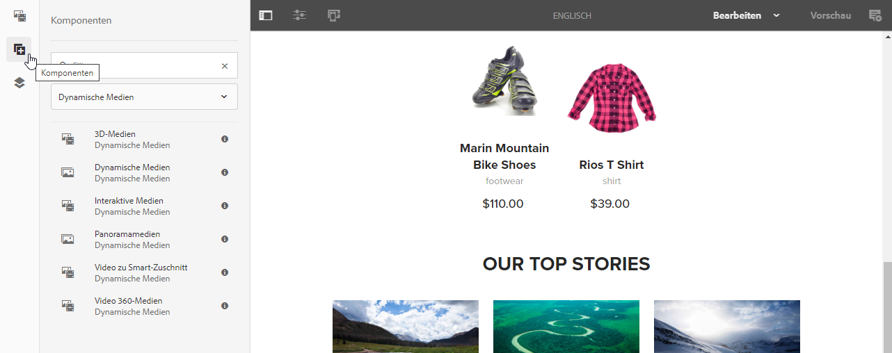

# Hinzufügen von Dynamic Media-Assets zu Seiten{#adding-dynamic-media-assets-to-pages}

Wenn Sie Assets auf Ihren Websites Dynamic Media-Funktionen hinzufügen möchten, können Sie die Komponente für **Dynamic Media**, **interaktive Medien**, **Panoramamedien** oder **Video-360-Medien** direkt auf der Seite hinzufügen. Sie wechseln in den Layoutmodus und aktivieren die Dynamic Media-Komponenten. Anschließend fügen Sie der Seite diese Komponenten hinzu und der Komponente Assets hinzu. Die Komponenten für Dynamic Media sind smart – sie erkennen, ob Sie ein Bild oder ein Video hinzufügen. Die verfügbaren Konfigurationsoptionen ändern sich entsprechend.

Sie fügen Dynamic Media-Assets direkt zur Seite hinzu, wenn Sie Experience Manager als WCM verwenden. Wenn Sie einen Drittanbieter für Ihren WCM verwenden, können Sie entweder [link](/help/assets/dynamic-media/linking-urls-to-yourwebapplication.md) oder [embed](/help/assets/dynamic-media/embed-code.md) Ihre Assets verwenden. Eine responsive Website von Drittanbietern finden Sie unter [Bereitstellen optimierter Bilder für eine responsive Site](/help/assets/dynamic-media/responsive-site.md).

>[!NOTE]
>
>Vergewissern Sie sich, dass Sie Assets veröffentlichen, bevor Sie sie in Experience Manager zu Seiten hinzufügen. Siehe [Veröffentlichen von Dynamic Media-Assets](/help/assets/dynamic-media/publishing-dynamicmedia-assets.md).

## Hinzufügen einer Dynamic Media-Komponente zu einer Seite  {#adding-a-dynamic-media-component-to-a-page}

Beim Hinzufügen einer Komponente für 3D Media, Dynamic Media, interaktive Medien, Panoramamedien, Smart-Zuschnitt-Videos oder 360-Grad-Videomedien gehen Sie genauso vor wie beim Hinzufügen einer Komponente zu einer beliebigen Seite.

**So fügen Sie einer Seite eine Dynamic Media-Komponente hinzu:**

1. Öffnen Sie in Experience Manager die Seite, auf der Sie die Dynamic Media-Komponente hinzufügen möchten.
1. Tippen Sie im linken Bereich auf das Symbol **[!UICONTROL Komponenten]** und filtern Sie nach „Dynamic Media“.

   Wenn keine Liste von Dynamic Media-Komponenten verfügbar ist, müssen Sie die Dynamic Media-Komponenten aktivieren, die Sie verwenden möchten. Informationen hierzu finden Sie unter [Aktivieren von Dynamic Media-Komponenten](#enabling-dynamic-media-components).

   

1. Ziehen Sie eine **[!UICONTROL Dynamic Media]**-Komponente per Drag-and-Drop an die gewünschte Position auf der Seite.

1. Bewegen Sie den Mauszeiger direkt auf die Komponente. Wenn die Komponente blau hervorgehoben wird, tippen Sie einmal darauf, um die Symbolleiste der Komponente anzuzeigen. Tippen Sie auf das Symbol **[!UICONTROL Konfiguration]**(Schraubenschlüssel).

   

1. Je nachdem, welche Dynamic Media-Komponente Sie auf der Seite abgelegt haben, wird ein Konfigurationsdialogfeld geöffnet. [Legen Sie die Optionen der Komponente](/help/assets/dynamic-media/adding-dynamic-media-assets-to-pages.md#dynamic-media-components) wie gewünscht fest.

   Im folgenden Beispiel sehen Sie das Dialogfeld der Dynamic Media-Komponente **[!UICONTROL Video-360-Medien]** und die verfügbaren Optionen in der Dropdown-Liste für Viewer-Vorgaben.

   

   Die Dynamic Media-Komponente für 360-Grad-Videomedien

1. Wenn Sie fertig sind, tippen Sie oben rechts im Dialogfeld auf das Häkchen, um die Änderungen zu speichern.

### Aktivieren von Dynamic Media-Komponenten {#enabling-dynamic-media-components}

Wenn keine Dynamic Media-Komponenten zum Hinzufügen zu einer Seite verfügbar sind, müssen Sie die Komponenten, die Sie verwenden möchten, aktivieren.

1. Öffnen Sie in Experience Manager die Seite, auf der Sie die Dynamic Media-Komponente hinzufügen möchten.
1. Tippen Sie links in der Symbolleiste am oberen Seitenrand auf das Symbol &quot;Seiteninformationen&quot;und dann in der Dropdown-Liste auf **[!UICONTROL Vorlage bearbeiten]**.

   

1. Tippen Sie oben rechts auf der Seite in der Symbolleiste in der Dropdown-Liste auf **[!UICONTROL Struktur]**.

   

1. Tippen Sie unten auf der Seite auf **[!UICONTROL Layout-Container]**, um die Symbolleiste zu öffnen. Tippen Sie anschließend auf das Symbol „Richtlinie“.
1. Stellen Sie auf der Seite **[!UICONTROL Layout Container]** unter der Überschrift **[!UICONTROL Eigenschaften]** sicher, dass die Registerkarte **[!UICONTROL Zulässige Komponenten]** ausgewählt ist.

   

1. Scrollen Sie nach unten, bis **[!UICONTROL Dynamic Media]** angezeigt wird.
1. Tippen Sie auf das Symbol > links von **[!UICONTROL Dynamic Media]** und wählen Sie dann die Dynamic Media-Komponenten aus, die Sie aktivieren möchten.

   

1. Tippen Sie rechts oben auf der Seite **[!UICONTROL Layout Container]** auf das Symbol Fertig (Häkchen).

1. Tippen Sie auf der rechten Seite der Symbolleiste am oberen Seitenrand aus der Dropdown-Liste auf **[!UICONTROL Anfänglicher Inhalt]**.
1. [hinzufügen eine Dynamic Media-Komponente wie gewohnt auf eine ](#adding-a-dynamic-media-component-to-a-page) Seite.

## Lokalisieren von Dynamic Media-Komponenten {#localizing-dynamic-media-components}

Zum Lokalisieren von Dynamic Media-Komponenten stehen Ihnen zwei Möglichkeiten zur Verfügung:

* Öffnen Sie auf einer Web-Seite unter „Sites“ die Option **[!UICONTROL Eigenschaften]** und wählen Sie die Registerkarte **[!UICONTROL Erweitert]** aus. Wählen Sie die gewünschte Sprache für die Lokalisierung aus.

   

* Wählen Sie über den Site-Selector die gewünschte Seite oder Seitengruppe aus. Tippen Sie auf **[!UICONTROL Eigenschaften]** und wählen Sie die Registerkarte **[!UICONTROL Erweitert]** aus. Wählen Sie die gewünschte Sprache für die Lokalisierung aus.

   >[!NOTE]
   >
   >Nicht allen Sprachen, die im Menü **[!UICONTROL Sprache]** verfügbar sind, sind Token zugewiesen.

## Verfügbare Dynamic Media-Komponenten {#dynamic-media-components}

Dynamic Media-Komponenten sind verfügbar, wenn Sie auf das Symbol **[!UICONTROL Komponenten]** tippen und nach **[!UICONTROL Dynamic Media]** filtern.

Zu den verfügbaren Dynamic Media-Komponenten zählen:

* **[!UICONTROL Dynamic Media]**: Assets wie Bilder, Videos, E-Kataloge und Rotationssets.
* **[!UICONTROL Interaktive Medien]**: interaktive Assets wie interaktive Videos, interaktive Bilder oder Karussellsets.
* **[!UICONTROL Panoramamedien]**: Panoramabilder oder VR-Panoramabilder.
* **[!UICONTROL Video-360-Medien]**: 360-Grad-Videos und 360-Grad-VR-Videos.

>[!NOTE]
>
>Diese Komponenten sind standardmäßig nicht verfügbar und müssen vor der Verwendung über den Vorlageneditor verfügbar gemacht werden. Nachdem sie im Vorlageneditor zur Verfügung gestellt wurden, können Sie die Komponenten wie jede andere Experience Manager-Komponente Ihrer Seite hinzufügen.

### Komponente: Dynamic Media {#dynamic-media-component}

Die Dynamic Media-Komponente ist intelligent. In Abhängigkeit davon, ob Sie ein Bild oder Video hinzufügen, haben Sie verschiedene Optionen. Die Komponente unterstützt Bildvorgaben, bildbasierte Viewer wie Bildsets sowie Rotationssets, Sets für gemischte Medien und Videos. Darüber hinaus reagiert der Viewer sofort - die Bildschirmgröße ändert sich automatisch je nach Bildschirmgröße. Bei allen Viewern handelt es sich um HTML5-Viewer.

>[!NOTE]
>
>Wenn Folgendes auf Ihre Web-Seite zutrifft:
>
>* Mehrere Instanzen der Dynamic Media-Komponente werden auf derselben Seite verwendet.
>* Jede Instanz verwendet denselben Asset-Typ.

>
>
Das Zuweisen einer anderen Viewer-Vorgabe zu jeder Dynamic Media-Komponente auf dieser Seite wird nicht unterstützt.
>
>Sie können jedoch dieselbe Viewer-Vorgabe für alle Dynamic Media-Komponenten, die Assets desselben Typs verwenden, auf der Seite verwenden.

Wenn Sie die Dynamic Media-Komponente hinzufügen und **[!UICONTROL Einstellungen für Dynamic Media]** leer ist, ist es nicht möglich, ein Asset ordnungsgemäß hinzuzufügen. Überprüfen Sie Folgendes:

* das Bild eine Pyramid TIFF-Datei aufweist. Bilder, die importiert werden, bevor Sie Dynamic Media aktivieren, haben keine Pyramidenzeitsdatei.

#### Arbeiten mit Bildern   {#when-working-with-images}

Mit der Komponente „Dynamic Media“ können Sie dynamische Bilder, einschließlich Bildsets, Rotationssets und Sets für gemischte Medien, hinzufügen. Sie können Vergrößerungen sowie Verkleinerungen vornehmen und (sofern zutreffend) ein Bild in einem Rotationsset drehen oder ein Bild aus einem anderen Set auswählen.

Sie können zudem die Viewer-Vorgabe, Bildvorgabe oder das Bildformat direkt in der Komponente konfigurieren. Damit ein Bild responsiv ist, können Sie entweder die Haltepunkte festlegen oder eine Vorgabe für ein interaktives Bild anwenden.

Sie können die folgenden Einstellungen für Dynamic Media bearbeiten, indem Sie in der Komponente auf das Symbol **[!UICONTROL Bearbeiten]** und dann auf **[!UICONTROL Einstellungen für Dynamic Media]** tippen.

>[!NOTE]
>
>Standardmäßig ist die Bildkomponente für Dynamic Media adaptiv. Wenn Sie eine feste Größe einrichten möchten, legen Sie sie auf der Registerkarte **[!UICONTROL Erweitert]** in der Komponente mit der **[!UICONTROL Breite]** und **[!UICONTROL Höhe]** fest.

* **[!UICONTROL Viewer-Vorgabe]** : Wählen Sie eine vorhandene Viewer-Vorgabe aus der Dropdown-Liste aus. Wenn die Viewer-Vorgabe, nach der Sie suchen, nicht sichtbar ist, müssen Sie sie sichtbar machen. Siehe „Verwalten von Viewer-Vorgaben“. Sie können keine Viewer-Vorgabe auswählen, wenn Sie eine Bildvorgabe verwenden und umgekehrt.

   Diese Option ist die einzige verfügbare Option, wenn Sie Bildsätze, Rotationssets oder gemischte Mediensets anzeigen. Bei den angezeigten Viewer-Vorgaben handelt es sich auch um rein intelligente Viewer-Vorgaben, die angezeigt werden.

* **[!UICONTROL Viewer-Modifikatoren]**  - Viewer-Modifikatoren haben die Form eines &quot;name=value&quot;-Paars mit einem &amp;-Trennzeichen und ermöglichen das Ändern von Viewern, wie im Viewer-Referenzhandbuch beschrieben. Ein Beispiel für einen Viewer-Modifikator ist `posterimage=img.jpg&caption=text.vtt,1`. Damit wird ein anderes Bild für die Videominiatur festgelegt und eine Untertiteldatei mit dem Video verknüpft.

* **[!UICONTROL Bildvorgabe]** : Wählen Sie eine vorhandene Bildvorgabe aus der Dropdown-Liste aus. Wenn die Bildvorgabe, nach der Sie suchen, nicht sichtbar ist, müssen Sie sie sichtbar machen. Siehe „Verwalten von Bildvorgaben“. Sie können keine Viewer-Vorgabe auswählen, wenn Sie eine Bildvorgabe verwenden und umgekehrt.

   Diese Option ist beim Anzeigen von Bildsets, Rotationssets oder Sets für gemischte Medien nicht verfügbar.

* **[!UICONTROL Bildmodifikatoren]** : Sie können Bildeffekte anwenden, indem Sie mehr Bildbefehle bereitstellen. Diese Befehle werden in den Bildvorgaben und der Referenz des Image Serving-Befehls beschrieben.

   Diese Option ist beim Anzeigen von Bildsets, Rotationssets oder Sets für gemischte Medien nicht verfügbar.

* **[!UICONTROL Haltepunkte]** : Wenn Sie dieses Asset auf einer responsiven Site verwenden, müssen Sie die Bild-Haltepunkte hinzufügen. BildHaltepunkte müssen durch Kommas (,) getrennt werden. Diese Option kann verwendet werden, wenn in einer Bildvorgabe keine Höhe oder Breite festgelegt ist.

   Diese Option ist beim Anzeigen von Bildsets, Rotationssets oder Sets für gemischte Medien nicht verfügbar.

   Sie können die folgenden erweiterten Einstellungen bearbeiten, indem Sie in der Komponente auf **[!UICONTROL Bearbeiten]** tippen.

* **[!UICONTROL Titel]**  - Ändern Sie den Titel des Bildes.

* **[!UICONTROL Alt-Text]** : Hinzufügen einen Titel für die Benutzer, die Grafiken deaktiviert haben.

   Diese Option ist beim Anzeigen von Bildsets, Rotationssets oder Sets für gemischte Medien nicht verfügbar.

* **[!UICONTROL URL, Öffnen in]** : Sie können ein Asset so einrichten, dass ein Link geöffnet wird. Legen Sie die URL fest. Geben Sie in „Öffnen in“ an, ob der Link im selben oder einem neuen Fenster geöffnet werden soll.

   Diese Option ist beim Anzeigen von Bildsets, Rotationssets oder Sets für gemischte Medien nicht verfügbar.

* **[!UICONTROL Breite]** : Geben Sie den Wert in Pixel ein, wenn das Bild eine feste Größe haben soll. Wenn die Werte leer gelassen werden, ist das Asset adaptiv.

* **[!UICONTROL Höhe]** : Geben Sie den Wert in Pixel ein, wenn das Bild eine feste Größe haben soll. Wenn die Werte leer gelassen werden, ist das Asset adaptiv.

#### Arbeiten mit Videos {#when-working-with-video}

Verwenden Sie die Dynamic Media-Komponente, um Ihren Web-Seiten dynamische Videos hinzuzufügen. Wenn Sie die Komponente bearbeiten, können Sie eine vordefinierte Video-Viewer-Vorgabe verwenden, um das Video auf der Seite wiederzugeben.

Sie können die folgende Dynamic Media-Einstellung bearbeiten, indem Sie in der Komponente auf **[!UICONTROL Bearbeiten]** klicken.

>[!NOTE]
>
>Die Videokomponente für Dynamic Media ist standardmäßig adaptiv. Wenn sie eine feste Größe aufweisen soll, müssen Sie dies in der Komponente auf der Registerkarte **[!UICONTROL Erweitert]** mit **[!UICONTROL Breite]** und **[!UICONTROL Höhe]** festlegen.

* **[!UICONTROL Viewer-Vorgabe]** : Wählen Sie eine vorhandene Video-Viewer-Vorgabe aus der Dropdown-Liste aus. Wenn die Viewer-Vorgabe, nach der Sie suchen, nicht sichtbar ist, müssen Sie sie sichtbar machen. Siehe „Verwalten von Viewer-Vorgaben“.

* **[!UICONTROL Viewer-Modifikatoren]**  - Viewer-Modifikatoren haben die Form eines  `name=value` Paars mit einem  `&` Trennzeichen. Sie können die Viewer ändern, wie im Viewer-Referenzhandbuch für Adoben beschrieben. Ein Beispiel für einen Viewer-Modifikator ist `posterimage=img.jpg&caption=text.vtt,1`.

   Mit Viewer-Modifikatoren können Sie beispielsweise folgende Schritte ausführen:

   * Verknüpfen einer Untertiteldatei mit einem Video: [Untertitel](https://experienceleague.adobe.com/docs/dynamic-media-developer-resources/library/viewers-aem-assets-dmc/video/command-reference-url-video/r-html5-video-viewer-url-caption.html?lang=de)
   * Verknüpfen einer Navigationsdatei mit einem Video: [Navigation](https://experienceleague.adobe.com/docs/dynamic-media-developer-resources/library/viewers-aem-assets-dmc/video/command-reference-url-video/r-html5-video-viewer-url-navigation.html?lang=de)

      Sie können die folgenden erweiterten Einstellungen bearbeiten, indem Sie in der Komponente auf **[!UICONTROL Bearbeiten]** klicken.

* **[!UICONTROL Titel]**  - Ändern Sie den Titel des Videos.

* **[!UICONTROL Breite]** : Geben Sie den Wert in Pixel ein, wenn das Bild eine feste Größe haben soll. Wenn die Werte leer gelassen werden, ist das Asset adaptiv.

* **[!UICONTROL Höhe]** : Geben Sie den Wert in Pixel ein, wenn das Bild eine feste Größe haben soll. Wenn die Werte leer gelassen werden, ist das Asset adaptiv.

#### Bei der Arbeit mit smartem Zuschneiden {#when-working-with-smart-crop}

Verwenden Sie die Dynamic Media-Komponente, um Bild-Assets für smartes Zuschneiden zu Ihren Web-Seiten hinzuzufügen. Wenn Sie die Komponente bearbeiten, können Sie eine vordefinierte Video-Viewer-Vorgabe verwenden, um das Video auf der Seite wiederzugeben.

Weitere Informationen finden Sie unter [Verwenden von smartem Zuschneiden mit Experience Manager Assets Dynamic Media](https://experienceleague.adobe.com/docs/experience-manager-learn/assets/dynamic-media/smart-crop-feature-video-use.html#dynamic-media)

Weitere Informationen finden Sie unter [Bildprofile](/help/assets/dynamic-media/image-profiles.md).

Sie können die folgende Dynamic Media-Einstellung bearbeiten, indem Sie in der Komponente auf **[!UICONTROL Bearbeiten]** klicken.

>[!NOTE]
>
>Standardmäßig ist die Bildkomponente für Dynamic Media adaptiv. Wenn Sie eine feste Größe einrichten möchten, legen Sie sie auf der Registerkarte **[!UICONTROL Erweitert]** in der Komponente mit der **[!UICONTROL Breite]** und **[!UICONTROL Höhe]** fest.

* **[!UICONTROL Bildmodifikatoren]** : Sie können Bildeffekte anwenden, indem Sie mehr Bildbefehle bereitstellen. Diese Befehle werden in den Bildvorgaben und der Referenz des Image Serving-Befehls beschrieben.

   Diese Option ist beim Anzeigen von Bildsets, Rotationssets oder Sets für gemischte Medien nicht verfügbar.

   Sie können die folgenden erweiterten Einstellungen bearbeiten, indem Sie in der Komponente auf **[!UICONTROL Bearbeiten]** klicken.

* **[!UICONTROL Seitenverhältnis aktivieren]** : Wenn Dynamic Media eine intelligente Schnittdarstellung mit einem Seitenverhältnis wählen soll, das dem Seitenverhältnis des Originalbilds am besten entspricht, wählen Sie diese Option.

* **[!UICONTROL Titel]** : Ändern Sie den Titel des Smart-Freistellungsbilds.

* **[!UICONTROL Alt-Text]** : Hinzufügen einen Titel für das intelligente Beschneidungsbild für Benutzer, die Grafiken deaktiviert haben.

   Diese Option ist beim Anzeigen von Bildsets, Rotationssets oder Sets für gemischte Medien nicht verfügbar.

* **[!UICONTROL URL, Öffnen in]** : Sie können ein Asset so einrichten, dass ein Link geöffnet wird. Legen Sie die URL fest. Geben Sie in „Öffnen in“ an, ob der Link im selben oder einem neuen Fenster geöffnet werden soll.

   Diese Option ist beim Anzeigen von Bildsets, Rotationssets oder Sets für gemischte Medien nicht verfügbar.

* **[!UICONTROL Breite]** : Geben Sie den Wert in Pixel ein, wenn das Bild eine feste Größe haben soll. Wenn die Werte leer gelassen werden, ist das Asset adaptiv.

* **[!UICONTROL Höhe]** : Geben Sie den Wert in Pixel ein, wenn das Bild eine feste Größe haben soll. Wenn die Werte leer gelassen werden, ist das Asset adaptiv.

### Komponente: Interaktive Medien {#interactive-media-component}

Die Komponente „Interaktive Medien“ ist für Assets mit interaktiven Elementen wie Hotspots oder Imagemaps vorgesehen. Verwenden Sie bei interaktiven Bildern, interaktiven Videos oder Karussellbannern die Komponente **[!UICONTROL Interaktive Medien]**.

Die Komponente „Interaktive Medien“ ist eine intelligente Komponente. Je nachdem, ob Sie ein Bild oder Video hinzufügen, werden Ihnen unterschiedliche Optionen zur Verfügung gestellt. Darüber hinaus reagiert der Viewer sofort - die Bildschirmgröße ändert sich automatisch je nach Bildschirmgröße. Bei allen Viewern handelt es sich um HTML5-Viewer.

>[!NOTE]
>
>Wenn Folgendes auf Ihre Web-Seite zutrifft:
>
>* Mehrere Instanzen der Komponente für interaktive Medien werden auf derselben Seite verwendet.
>* Jede Instanz verwendet denselben Asset-Typ.

>
>
Das Zuweisen einer anderen Viewer-Vorgabe zu jeder interaktiven Medienkomponente auf dieser Seite wird nicht unterstützt.
>
>Sie können jedoch dieselbe Viewer-Vorgabe für alle interaktiven Medienkomponenten, die Assets desselben Typs verwenden, auf der Seite verwenden.

Sie können die folgenden allgemeinen **[!UICONTROL Einstellungen]** bearbeiten, indem Sie in der Komponente auf **[!UICONTROL Bearbeiten]** tippen.

* **[!UICONTROL Viewer-Vorgabe]** : Wählen Sie eine vorhandene Viewer-Vorgabe aus der Dropdown-Liste aus. Wenn die Viewer-Vorgabe, nach der Sie suchen, nicht sichtbar ist, müssen Sie sie sichtbar machen. Viewer-Vorgaben müssen veröffentlicht werden, bevor sie verwendet werden können. Siehe „Verwalten von Viewer-Vorgaben“.

* **[!UICONTROL Titel]**  - Ändern Sie den Titel des Videos.

* **[!UICONTROL Breite]** : Geben Sie den Wert in Pixel ein, wenn das Bild eine feste Größe haben soll. Wenn die Werte leer gelassen werden, ist das Asset adaptiv.

* **[!UICONTROL Höhe]** : Geben Sie den Wert in Pixel ein, wenn das Bild eine feste Größe haben soll. Wenn die Werte leer gelassen werden, ist das Asset adaptiv.

   Sie können die folgenden Einstellungen von **[!UICONTROL Zu Warenkorb hinzufügen]** bearbeiten, indem Sie in der Komponente auf **[!UICONTROL Bearbeiten]** klicken.

* **[!UICONTROL Produktelement]**  anzeigen: Standardmäßig ist dieser Wert ausgewählt. Das Produkt-Asset zeigt ein Bild des Produkts, wie im Commerce-Modul definiert. Deaktivieren Sie das Kontrollkästchen, um das Produkt-Asset nicht anzuzeigen.

* **[!UICONTROL Produktpreis]**  anzeigen: Dieser Wert ist standardmäßig ausgewählt. Der Produktpreis gibt den Preis des Artikels an, wie im Commerce-Modul definiert. Deaktivieren Sie das Kontrollkästchen, um den Produktpreis nicht anzuzeigen.

* **[!UICONTROL Produktformular]**  anzeigen: Standardmäßig ist dieser Wert nicht ausgewählt. Das Produktformular beinhaltet jegliche Produktvarianten, etwa hinsichtlich der Größe und der Farbe. Deaktivieren Sie das Kontrollkästchen, um die Produktvarianten nicht anzuzeigen.

### Komponente: Panoramamedien {#panoramic-media-component}

Die Panoramamedienkomponente bezieht sich auf Kugelpanoramen. Solche Bilder bieten ein 360°-Zuschauererlebnis eines Raums, einer Immobile, eines Ortes oder einer Landschaft. Damit ein Bild als Kugelpanorama gilt, muss MINDESTENS eine der beiden folgenden Eigenschaften zutreffen:

* Ein Seitenverhältnis von 2:1.
* Mit den Keywords `equirectangular` oder (`spherical` + `panorama`) oder (`spherical` + `panoramic`) markiert. Weitere Informationen finden Sie unter [Verwenden von Tags](/help/sites-cloud/authoring/features/tags.md).

Die Kriterien für das Seitenverhältnis sowie die Keywords gelten für Panorama-Assets für die Asset-Detailseite und die WCM-Komponente **[!UICONTROL Panoramamedien]**.

>[!NOTE]
>
>Wenn Folgendes auf Ihre Web-Seite zutrifft:
>
>* Mehrere Instanzen der Komponente für **[!UICONTROL Panoramamedien]** werden auf derselben Seite verwendet.
>* Jede Instanz verwendet denselben Asset-Typ.

>
>
Das Zuweisen einer anderen Viewer-Vorgabe zu jeder **[!UICONTROL Panorama-Media]**-Komponente auf dieser Seite wird nicht unterstützt.
>
>Sie können jedoch dieselbe Viewer-Vorgabe für alle Komponenten für Panoramamedien, die Assets desselben Typs verwenden, auf der Seite verwenden.

Sie können die folgenden erweiterten Einstellungen bearbeiten, indem Sie in der Komponente auf **[!UICONTROL Konfigurieren]** tippen.

* **[!UICONTROL Viewer-Vorgabe]** : Wählen Sie einen vorhandenen Viewer aus der Dropdown-Liste &quot;Viewer-Vorgabe&quot;aus.

Wenn die gesuchte Viewer-Vorgabe nicht angezeigt wird, stellen Sie sicher, dass sie veröffentlicht wurde. Veröffentlichen Sie Viewer-Vorgaben, bevor Sie sie verwenden. Siehe [Verwalten von Viewer-Vorgaben](/help/assets/dynamic-media/managing-viewer-presets.md).

### Komponente: 360-Grad-Videomedien {#video-media-component}

Verwenden Sie die Komponente **[!UICONTROL Video 360 Media]**, um gleichmäßige Videos auf Ihrer Webseite wiederzugeben. Dadurch wird eine eindrucksvolle Sicht auf einen Raum, eine Immobilie, einen Ort, eine Landschaft oder eine medizinische Prozedur gewährleistet.

Während der Wiedergabe auf einem Flachbildschirm hat der Benutzer die Kontrolle über den Anzeigewinkel; Die Wiedergabe auf Mobilgeräten verwendet in der Regel die integrierten gyroskopischen Steuerelemente.

Der Viewer bietet native Unterstützung für die Bereitstellung von 360-Grad-Video-Assets. Standardmäßig ist keine weitere Konfiguration für die Anzeige oder die Wiedergabe erforderlich. 360-Grad-Videos werden mit Standardvideoerweiterungen wie .mp4, .mkv und .mov bereitgestellt. Der am häufigsten verwendete Codec ist H.264.

Sie können die folgenden erweiterten Einstellungen bearbeiten, indem Sie in der Komponente auf **[!UICONTROL Konfigurieren]** tippen.

* **[!UICONTROL Viewer-Vorgabe]** : Wählen Sie einen vorhandenen Viewer aus der Dropdown-Liste &quot;Viewer-Vorgabe&quot;aus. Verwenden Sie „Video360VR“ für Endbenutzer, die Virtual-Reality-Brillen verwenden. Enthält grundlegende Steuerelemente für die Videowiedergabe und Social-Media-Eigenschaften. Verwenden Sie „Video360_social“ mit grundlegenden Steuerelementen für die Videowiedergabe. Videorendering erfolgt im Stereomodus. Die manuelle Blickwinkelsteuerung ist deaktiviert, aber gyroskopische Steuerelemente sind aktiviert. Es gibt keine Funktionen für soziale Medien.

Wenn die gesuchte Viewer-Vorgabe nicht angezeigt wird, stellen Sie sicher, dass sie veröffentlicht wurde. Veröffentlichen Sie Viewer-Vorgaben, bevor Sie sie verwenden. Siehe [Verwalten von Viewer-Vorgaben](/help/assets/dynamic-media/managing-viewer-presets.md).

### Bereitstellen von Dynamic Media-Assets mit HTTP/2 {#using-http-to-delivery-dynamic-media-assets}

HTTP/2 ist das neue, aktualisierte Web-Protokoll, das die Kommunikation zwischen Browser und Servern verbessert. Es beschleunigt die Übertragung von Informationen und reduziert die erforderliche Prozessorleistung. Es ist jetzt möglich, Dynamic Media-Assets über HTTP/2 bereitzustellen, das schnellere Reaktions- und Ladezeiten bietet.

Vollständige Informationen zu den ersten Schritten mit HTTP/2 und Ihrem Dynamic Media-Konto finden Sie unter [Bereitstellung von Inhalt über HTTP/2](/help/assets/dynamic-media/http2faq.md).

>[!MORELIKETHIS]
>
>* [Verwenden des Video-Players in Experience Manager Dynamic Media](https://experienceleague.adobe.com/docs/experience-manager-learn/assets/dynamic-media/dynamic-media-video-player-feature-video-use.html#dynamic-media)
>* [Verwenden von interaktiven Videos mit Experience Manager Dynamic Media](https://experienceleague.adobe.com/docs/experience-manager-learn/assets/dynamic-media/dynamic-media-interactive-video-feature-video-use.html#dynamic-media)
>* [Asset-Viewer mit Experience Manager Dynamic Media](https://experienceleague.adobe.com/docs/experience-manager-learn/assets/dynamic-media/dynamic-media-viewer-feature-video-understand.html#dynamic-media)
>* [Verwenden benutzerdefinierter Videominiaturen mit Experience Manager Dynamic Media](https://experienceleague.adobe.com/docs/experience-manager-learn/assets/dynamic-media/dynamic-media-video-thumbnails-feature-video-use.html#dynamic-media)
>* [Farb-Management mit Experience Manager Dynamic Media](https://experienceleague.adobe.com/docs/experience-manager-learn/assets/dynamic-media/dynamic-media-color-management-technical-video-setup.html#dynamic-media)
>* [Verwenden des Scharfzeichnens von Bildern mit Experience Manager Dynamic Media](https://experienceleague.adobe.com/docs/experience-manager-learn/assets/dynamic-media/dynamic-media-image-sharpening-feature-video-use.html#dynamic-media)

