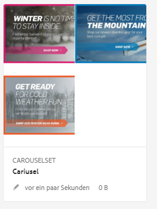
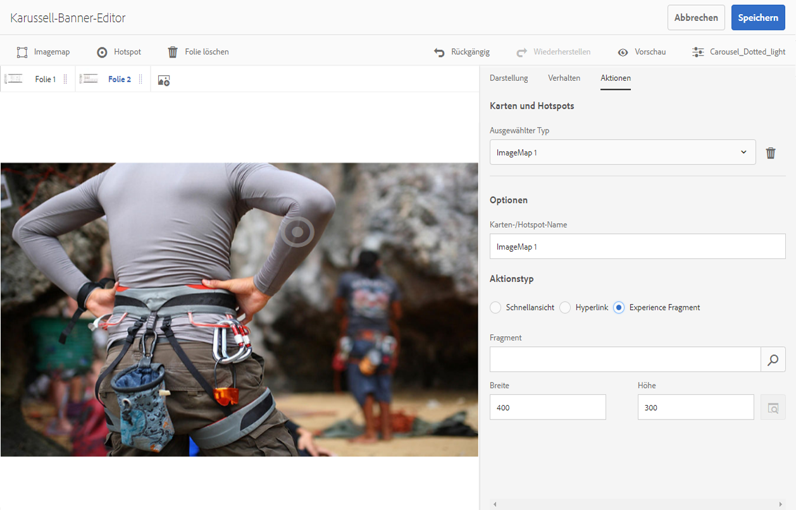
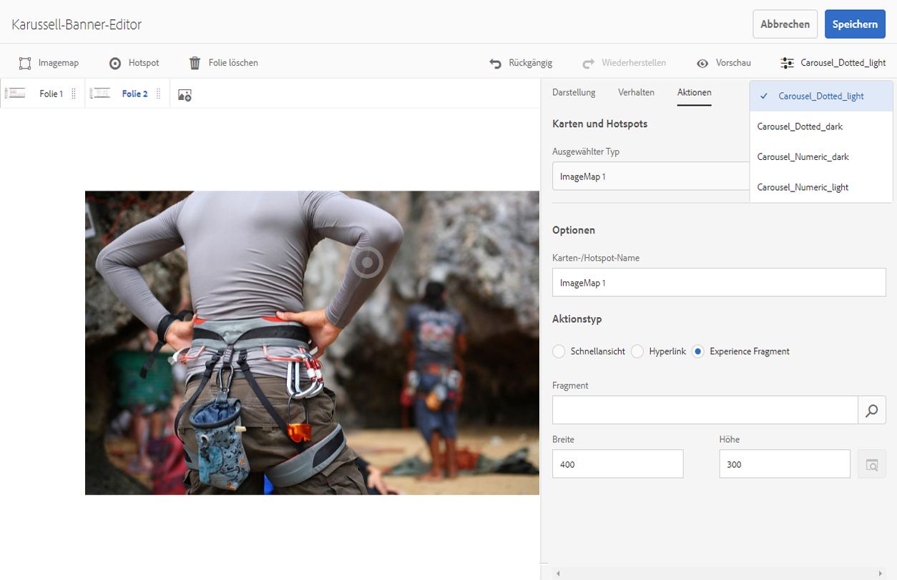

# Karussellbanner {#carousel-banners}

Mit Karussellbannern können Marketingexperten die Konversionsrate steigern, indem sie auf einfache Art Drehbanner mit Promo-Inhalten erstellen, die auf beliebigen Bildschirmen bereitgestellt werden können.

Das Erstellen und Ändern von Inhalten auf Werbebannern kann zeitaufwendig sein und Ihre Fähigkeit beeinträchtigen, neue Inhalte schnell zu veröffentlichen oder zielgerichteter zu gestalten. Mit Karussellbannern können Sie rasch Drehbanner erstellen oder ändern sowie interaktive Elemente wie Hotspots zur Verknüpfung von Produktdetails oder ähnlichen Ressourcen hinzufügen und auf beliebigen Bildschirmen bereitstellen. Dadurch sind neue Promo-Inhalte schneller auf dem Markt verfügbar.

Karussellbanner sind Banner, die durch die Bezeichnung **[!UICONTROL CAROUSELSET]** gekennzeichnet sind:

Auf Ihrer Website kann ein Karussellbanner wie folgt aussehen:

Hier können Sie durch die Bilder navigieren (durch Klicken auf die Zahlen). Zusätzlich drehen sich die Folien automatisch basierend auf einem Intervall, das Sie anpassen können. Bilder, die Sie im Karussellbanner einfügen, unterstützen sowohl Hotspots als auch Imagemaps, in denen Benutzer auf einen Hyperlink tippen oder klicken oder auf ein Schnellansichtsfenster zugreifen können.

In diesem Beispiel hat der Benutzer auf eine Imagemap geklickt oder getippt und das Schnellansichtsfenster für Handschuhe aufgerufen:

## Video zur Erstellung von Karussellbannern {#watch-how-carousel-banners-are-created}

Sehen Sie sich eine exemplarische Vorgehensweise (10 Minuten und 33 Sekunden) zur [Erstellung von Karussellbannern](https://s7d5.scene7.com/s7viewers/html5/VideoViewer.html?videoserverurl=https://s7d5.scene7.com/is/content/&amp;emailurl=https://s7d5.scene7.com/s7/emailFriend&amp;serverUrl=https://s7d5.scene7.com/is/image/&amp;config=Scene7SharedAssets/Universal_HTML5_Video_social&amp;contenturl=https://s7d5.scene7.com/skins/&amp;asset=S7tutorials/InteractiveCarouselBanner) an. Sie erfahren außerdem, wie eine Vorschau auf Karussellbannern angezeigt wird und wie diese bearbeitet und bereitgestellt werden.

>[!NOTE]
>
>Benutzer, die keine Administratoren sind, müssen der Gruppe **[!UICONTROL dam-users]** hinzugefügt werden, damit sie Karussellbanner erstellen oder bearbeiten können. Sollten Sie Schwierigkeiten beim Erstellen oder Bearbeiten haben, wenden Sie sich an den Systemadministrator, der Sie der Gruppe **d[!UICONTROL am-users]** hinzufügen kann.

## Schnellstart: Karussellbanner {#quick-start-carousel-banners}

So schaffen Sie einen schnellen Einstieg:

1. [Ermitteln Sie Hotspot- und Imagemap-Variablen](#identifying-hotspot-and-image-map-variables) (nur für Kunden, die AEM Assets und Dynamic Media verwenden).

   Ermitteln Sie zunächst die von der vorhandenen Schnellansichtsimplementierung verwendeten dynamischen Variablen, damit Sie die Hotspots und Imagemap-Daten beim Erstellen von Karussellbannern in AEM Assets korrekt eingeben können.

<!-- LEAVE; COMMERCE BEING ADDED AGAIN IN THE FUTURE

   >[!NOTE]
   >
   >If you are an AEM Sites or Ecommerce customer, you can use the built-in feature to navigate to product pages and lookup the existing skus in the product catalog. You do not need to manually enter hotspot or image map variables.
   >
   >
   >If you are an AEM Assets and Dynamic Media customer, you will manually enter data for hotspots and image maps, and then integrate the published URL or Embed code with your third-party content management system.

-->

1. Optional: [Erstellen Sie eine Viewer-Vorgabe für Karussellsets](/help/assets/dynamic-media/managing-viewer-presets.md) bei Bedarf.

   Wenn Sie ein Administrator sind, können Sie das Verhalten und das Erscheinungsbild des Karussells anpassen, indem Sie eine eigene Karussell-Viewer-Vorgabe erstellen. Der größte Vorteil besteht darin, dass diese benutzerdefinierte Viewer-Vorgabe für mehrere Karussells wiederverwendet werden kann. Benutzer haben jedoch auch die Möglichkeit, das Verhalten und das Erscheinungsbild des Karussells direkt bei der Erstellung anzupassen. Dies ist der bevorzugte Ansatz, wenn Sie ein spezifisches Design für ein bestimmtes Karussell wünschen.

1. [Laden Sie ein Bildbanner hoch](#uploading-image-banners).

   Laden Sie Bildbanner hoch, die interaktiv sein sollen.

1. [Erstellen Sie ein Karussellset](#creating-carousel-sets).

   In Karussellsets navigieren Benutzer durch Bannerbilder und tippen auf Hotspots oder Imagemaps, um auf relevante Inhalte zuzugreifen.

   Um ein Karussellset in Assets zu erstellen, tippen Sie auf **[!UICONTROL Erstellen]** und wählen Sie dann **[!UICONTROL Karussellsets]**. Fügen Sie den Folien dann Assets hinzu und tippen Sie auf **[!UICONTROL Speichern]**. Sie können das Erscheinungsbild und Verhalten des Karussells auch direkt im Editor bearbeiten.

1. [Fügen Sie Hotspots oder Imagemaps in einem Bildbanner hinzu.](#adding-hotspots-or-image-maps-to-an-image-banner)

   Fügen Sie einem Bildbanner mindestens einen Hotspot oder eine Imagemap hinzu und weisen Sie allen von ihnen eine Aktion wie einen Link, eine Schnellansicht oder ein Experience Fragment zu. Nachdem Sie Hotspots oder Imagemaps hinzugefügt haben, schließen Sie diese Aufgabe ab, indem Sie das Karussellset veröffentlichen. Durch das Veröffentlichen wird der Einbettungs-Code erstellt, den Sie kopieren und auf die Landingpage Ihrer Website anwenden können.

   Siehe [(Optional) Anzeigen einer Vorschau für Karussellbanner](#optional-previewing-carousel-banners) – Optional. Bei Bedarf können Sie eine Darstellung des Karussellsets anzeigen und dessen Interaktivität testen.

1. [Veröffentlichen Sie Karussellbanner](#publishing-carousel-banners).

   Sie veröffentlichen ein Karussellset wie jedes andere Asset. Navigieren Sie in Assets zum Karussellset, wählen Sie es aus und tippen Sie auf **[!UICONTROL Veröffentlichen]**. Durch Veröffentlichen eines Karussellsets wird die URL und die Einbettungszeichenfolge aktiviert.

1. Führen Sie einen der folgenden Schritte aus:

   * [Fügen Sie ein Karussellbanner zu Ihrer Website-Seite hinzu.](#adding-a-carousel-banner-to-your-website-page)Sie können die Karussellbanner-URL oder den Einbettungs-Code hinzufügen, die oder den Sie auf die Website-Seite kopiert haben.

      * [Integrieren Sie das Karussellbanner in eine Schnellansicht.](#integrating-the-carousel-banner-with-an-existing-quickview) Wenn Sie ein Drittanbietersystem für Web Content Management verwenden, müssen Sie das neue Karussellbanner in der vorhandenen Schnellansichtsimplementierung auf Ihrer Website integrieren.
   * [Fügen Sie ein Karussellbanner zu einer Website in AEM hinzu.](/help/assets/dynamic-media/adding-dynamic-media-assets-to-pages.md)Wenn Sie AEM Sites-Kunde sind, können Sie das Karussellset direkt zur Seite in AEM hinzufügen, indem Sie die Komponente für interaktive Medien verwenden.

Wenn Sie Karussellsets bearbeiten müssen, finden Sie weitere Informationen unter [Bearbeiten von Karussellsets](#editing-carousel-sets). Darüber hinaus können Sie [Eigenschaften von Karussellsets](/help/assets/manage-digital-assets.md#editing-properties) anzeigen und bearbeiten.

## Ermitteln von Hotspot- und Imagemap-Variablen {#identifying-hotspot-and-image-map-variables}

Ermitteln Sie zunächst die von der vorhandenen Schnellansichtsimplementierung verwendeten dynamische Variablen, damit Sie die Hotspots oder Imagemap-Daten beim Erstellen von Karussellsets in AEM Assets korrekt eingeben können.

Beim Hinzufügen von Hotspots oder Imagemaps zu einem Bannerbild in AEM Assets müssen Sie jedem Hotspot und jeder Imagemap eine SKU und optional zusätzliche Variablen zuweisen. Mithilfe dieser Variablen werden Hotspots oder Imagemaps später Schnellansichtsinhalte zugeordnet.

<!-- LEAVE; COMMERCE BEING ADDED LATER

>[!NOTE]
>
>If you are an AEM Sites and/or AEM Ecommerce customer, skip this step. You do not need to manually identify hotspot or image map variables; you can use the integration with Ecommerce for product integration. See information on [setting up eCommerce](/help/sites-cloud/administering/generic.md). In addition, you can use the Interactive component and add it to your web page.
>
>If you are an AEM Assets or Media customer, you publish the URL or Embed code and then integrate with your third-party content management system and identify hotspots and image maps manually.

-->

Es ist wichtig, die Anzahl und den Typ der Variablen, denen Hotspot- oder Imagemap-Daten zugewiesen werden sollen, korrekt zu ermitteln. Jeder Hotspot bzw. jede Imagemap, der/die einem Bannerbild hinzugefügt wird, muss genügend Informationen enthalten, um das Produkt im vorhandenen Backend-System eindeutig zu identifizieren. Gleichzeitig sollten Hotspots oder Imagemaps nicht mehr Daten enthalten als unbedingt notwendig. Dies würde die Dateneingabe unnötig erschweren und bei der Verwaltung von Hotspots und Imagemaps könnten leichter Fehler auftreten.

Es gibt verschiedene Möglichkeiten, den für Hotspot- oder Imagemap-Daten zu verwendenden Variablensatz zu ermitteln,

Manchmal ist es ausreichend, IT-Experten zu konsultieren, die für die vorhandene Schnellansichtsimplementierung verantwortlich sind. Diese kennen wahrscheinlich den Mindestsatz an Daten, die erforderlich sind, um die Schnellansicht im System zu ermitteln. In den meisten Fällen ist es jedoch auch möglich, einfach das vorhandene Verhalten des Frontend-Codes zu analysieren.

Der Großteil der Schnellansichtsimplementierungen verwendet das folgende Modell:

* Benutzer aktiviert ein Benutzeroberflächenelement auf der Website. Beispielsweise durch Klicken auf die Schaltfläche für eine **[!UICONTROL Schnellansicht]**.
* Die Website sendet eine Ajax-Anfrage an das Backend, um bei Bedarf die Schnellansichtsdaten oder -inhalte zu laden.
* Die Schnellansichtsdaten werden in den Inhalt übersetzt, um für das Rendern auf der Web-Seite vorbereitet zu werden.
* Schließlich zeigt der Frontend-Code diesen Inhalt visuell auf dem Bildschirm an.

Dann werden unterschiedliche Bereiche der vorhandenen Website besucht, auf denen die Schnellansichtsfunktion implementiert wird, die Schnellansicht wird ausgelöst und die Ajax-URL, die durch die Web-Seite zum Laden der Schnellansichtsdaten oder -inhalte gesendet wurde, wird erfasst.

Normalerweise müssen Sie keine speziellen Debugging-Tools verwenden. Moderne Webbrowser verfügen über Web-Inspektoren, die dafür ausreichend sind. Die folgenden Webbrowser beispielsweise umfassen Web-Inspektoren:

* Drücken Sie zum Anzeigen aller ausgehenden HTTP-Anfragen in Google Chrome die Taste F12 (Windows) oder Befehlstaste+Wahltaste+I (Mac), um den Bereich für Entwickler-Tools anzuzeigen, und klicken Sie dann auf die Registerkarte „Netzwerk“.
* In Firefox können Sie das Firebug-Plug-in aktivieren, indem Sie F12 (Windows) bzw. Befehlstaste + Wahltaste + I (Mac) drücken und die Registerkarte „Netz“ öffnen, oder Sie öffnen die Registerkarte „Netzwerk“ im integrierten Inspektor-Tool.

Wenn die Netzwerküberwachung im Browser aktiviert ist, lösen Sie die Schnellansicht auf der Seite aus.

Suchen Sie nun die Schnellansichts-Ajax-URL im Netzwerkprotokoll und kopieren Sie die aufgezeichnete URL für die zukünftige Analyse. In den meisten Fällen werden beim Auslösen der Schnellansicht zahlreiche Anfragen an den Server gesendet. Normalerweise ist die Schnellansichts-Ajax-URL die erste in der Liste. Sie weist einen Teil oder Pfad mit einer komplexen Abfragezeichenfolge auf und ihr MIME-Typ lautet entweder `text/xml`, `text/html` oder `text/javascript`.

Während dieses Vorgangs müssen Sie verschiedene Bereiche der Website mit verschiedenen Produktkategorien und -typen besuchen. Grund dafür ist, dass Schnellansichts-URLs möglicherweise Teile aufweisen, die für eine bestimmte Website-Kategorie häufig vorkommen, sich aber nur ändern, wenn Sie einen anderen Bereich der Website besuchen.

Im einfachsten Fall ist der einzige variable Teil der Schnellansichts-URL die Produkt-SKU. In diesem Fall ist der SKU-Wert der einzige Datenteil, den Sie benötigen, um dem Bannerbild Hotspots oder Imagemaps hinzuzufügen.

In komplexen Fällen hat die Schnellansichts-URL allerdings mehrere verschiedene Elemente zusätzlich zur SKU, wie Kategorie-ID, Farb-Code, Größen-Code usw. In diesen Fällen ist jedes Element eine separate Variable in der Hotspot- oder Imagemap-Datendefinition innerhalb der Karussellbanner-Funktion.

Im Folgenden finden Sie einige Beispiele für Schnellansichts-URLs und die resultierenden Hotspot- oder Imagemap-Variablen:

<table>
 <tbody>
  <tr>
   <td>Einzelne SKU, befindet sich in der Abfragezeichenfolge.</td>
   <td>
Die aufgezeichneten Schnellansichts-URLs enthalten Folgendes:

    <ul>
     <li>
<code>https://server/json?productId=866558&amp;source=100</code>
 </li>
     <li>
<code>https://server/json?productId=1196184&amp;source=100</code>
 </li>
     <li>
<code>https://server/json?productId=1081492&amp;source=100</code>
 </li>
     <li>
<code>https://server/json?productId=1898294&amp;source=100</code>
 </li>
    </ul> 
Der einzige variable Teil der URL ist der Wert des Abfrageparameters <code>productId=</code> und es ist offensichtlich ein SKU-Wert. Daher müssen Sie nur die SKU-Felder der Hotspots oder Imagemaps ausfüllen mit Werten wie <code>866558,</code> <code>1196184,</code> <code>1081492,</code> <code>1898294.</code>
 </td>
  </tr>
  <tr>
   <td>Einzelne SKU, befindet sich im URL-Pfad.</td>
   <td>
Die aufgezeichneten Schnellansichts-URLs enthalten Folgendes:

    <ul>
     <li>
<code>https://server/product/6422350843</code>
 </li>
     <li>
<code>https://server/product/1607745002</code>
 </li>
     <li>
<code>https://server/product/0086724882</code>
 </li>
    </ul> 
Der variable Teil befindet sich im letzten Abschnitt des Pfads und wird zum SKU-Wert der Hotspots/Imagemaps:<strong><code>6422350843</code>, <code>1607745002,</code> </strong><code>0086724882.</code>
 </td>
  </tr>
  <tr>
   <td>SKU und Kategorie-ID in der Abfragezeichenfolge.</td>
   <td>
Die aufgezeichneten Schnellansichts-URLs enthalten Folgendes:

    <ul>
     <li>
<code>https://server/quickView/product/?category=1100004&amp;prodId=305466</code>
 </li>
     <li>
<code>https://server/quickView/product/?category=1100004&amp;prodId=310181</code>
 </li>
     <li>
<code>https://server/quickView/product/?category=1740148&amp;prodId=308706</code>
 </li>
    </ul> 
In diesem Fall liegen zwei abweichende Teile in der URL vor. Die SKU wird im Parameter <code>prodId</code> gespeichert, während die Kategorie-ID im Parameter <code>category=</code> gespeichert wird.
 
Bei den Hotspot- oder Imagemap-Definitionen selbst handelt es sich um Paare. Also einen SKU-Wert und eine zusätzliche Variable mit dem Namen <code>categoryId</code>. Die resultierenden Paare lauten wie folgt:

    <ul>
     <li>
Die SKU lautet <strong><code>305466</code></strong> und <code>categoryId</code> lautet <code>1100004</code>.
 </li>
     <li>
Die SKU lautet <strong><code>310181</code></strong> und <code>categoryId</code> lautet <strong><code>1100004</code></strong>.
 </li>
     <li>
Die SKU lautet <strong><code>308706</code></strong> und <code>categoryId</code> lautet <strong><code>1740148</code></strong>.
 </li>
    </ul> </td>
  </tr>
 </tbody>
</table>

## Hochladen von Bildbannern {#uploading-image-banners}

Wenn Sie bereits die Bilder hochgeladen haben, die Sie verwenden möchten, fahren Sie mit dem nächsten Schritt [Erstellen von Karussellsets](#creating-carousel-sets) fort. Beachten Sie, dass die im Karussell verwendeten Bilder nach dem Aktivieren von Dynamic Media hochgeladen werden müssen.

Informationen zum Hochladen von Bildbannern finden Sie unter [Hochladen von Assets](/help/assets/manage-digital-assets.md).

## Erstellen von Karussellsets  {#creating-carousel-sets}

>[!NOTE]
>
>Benutzer, die keine Administratoren sind, müssen der Gruppe **[!UICONTROL dam-users]** hinzugefügt werden, damit sie Karussellbanner erstellen oder bearbeiten können. Sollten Sie Schwierigkeiten beim Erstellen oder Bearbeiten haben, wenden Sie sich an den Systemadministrator, der Sie der Gruppe **[!UICONTROL dam-users]** hinzufügen kann.

**So erstellen Sie ein Karussellset**

1. Navigieren Sie in Assets zu dem Ordner, in dem Sie das Karussellset erstellen möchten, und tippen Sie auf **[!UICONTROL Erstellen > Karussellset]**.
1. Tippen Sie im Karussellbanner-Editor auf **[!UICONTROL Tippen, um die Asset-Auswahl zu öffnen]**, um das Bild für die erste Folie auszuwählen.

   Führen Sie im Karussellbanner-Editor eine der folgenden Aktionen aus:

   * Tippen Sie oben links auf **[!UICONTROL Folie hinzufügen]**.

   * Tippen Sie in der Mitte der Seite auf **[!UICONTROL Tippen, um die Asset-Auswahl zu öffnen]**.
   Tippen Sie zur Auswahl von Assets, die Sie in das Karussellset aufnehmen möchten. Die ausgewählten Assets sind mit einem Häkchen versehen. Wenn Sie die Assets ausgewählt haben, tippen Sie auf **[!UICONTROL Auswählen]**.

   Mit der Asset-Auswahl können Sie nach Assets suchen, indem Sie ein Keyword eingeben und auf **[!UICONTROL Zurück]** tippen/klicken. Sie können auch Filter anwenden, um Ihre Suchergebnisse genauer abzustimmen. Sie können nach Pfad, Sammlung, Dateityp und Tag filtern. Wählen Sie den Filter und tippen Sie in der Symbolleiste auf das Symbol **[!UICONTROL Filter]**. Ändern Sie die Ansicht, indem Sie das Symbol „Ansicht“ tippen und dann **[!UICONTROL Spaltenansicht]**, **[!UICONTROL Kartenansicht]** oder **[!UICONTROL Listenansicht]** wählen.

   Weitere Informationen finden Sie unter [Arbeiten mit Selektoren](/help/assets/dynamic-media/working-with-selectors.md).

1. Fügen Sie weitere Folien hinzu, bis Sie alle gewünschten Bilder für das Karussellset ausgewählt haben.
1. (Optional) Führen Sie einen der folgenden Schritte aus:

   * Ziehen Sie bei Bedarf Folien, um Bilder in der Set-Liste neu anzuordnen.
   * Um ein Bild zu löschen, wählen Sie es aus und tippen Sie in der Symbolleiste auf **[!UICONTROL Folie löschen]**.

   * Um eine Vorgabe anzuwenden, tippen Sie oben rechts auf die Dropdown-Liste mit den Vorgaben. Wählen Sie anschließend eine Vorgabe aus, um sie auf das ganze Set anzuwenden.
   Um eine Folie zu löschen, tippen oder klicken Sie auf die Folie und tippen und klicken Sie auf **[!UICONTROL Folie löschen]** in der Symbolleiste. Um eine Folie zu verschieben, tippen Sie auf das Symbol zur Neuanordnung und halten und bewegen Sie das Element an die gewünschte Position.

1. Nachdem Sie die Bilder in den Folien hinzugefügt haben, können Sie einen Hotspot, eine Imagemap oder beides in die Bilder einfügen. Siehe [Hinzufügen von Hotspots oder Imagemaps](#adding-hotspots-or-image-maps-to-an-image-banner).
1. Sie können das visuelle Design und das Verhalten von Karussellsets ändern, indem Sie auf die Registerkarten „Verhalten“ und „Darstellung“ tippen oder klicken und Anpassungen am Aussehen des Karussellbanners oder am Verhalten bestimmter Komponenten vornehmen. Weitere Informationen zum Verwenden des Viewer-Editors finden Sie unter [Verwalten von Viewer-Vorgaben](/help/assets/dynamic-media/viewer-presets.md).

   >[!NOTE]
   >
   >Für Karussellbanner sollten Sie folgende Elemente anpassen:
   >    * Dauer der Anzeige eines Bildes Standardmäßig wird jedes Bild für 9 Sekunden angezeigt.
   >    * Animation. Standardmäßig sind alle Folienübergänge Überblendungen. Sie können einen anderen Übergang auswählen.
   >    * Stil der Schaltflächen Benutzer können die Banner durchlaufen, indem sie auf die jeweiligen Punkte oder Zahlen tippen. Sie können ändern, wo die Set-Indikatoren angezeigt werden (und ob es sich um einen numerischen oder Punktstil handelt). Sie können auch ihre Größe bestimmen.
   >    * Ändern des Markierungsstils einer Imagemap oder des Symbols für Hotspots.
   >    * Wählen Sie vor dem Bearbeiten einer Viewer-Vorgabe das Format aus, auf dem die Vorgabe basieren soll. Wenn Sie diese Auswahl nicht treffen, wenn Sie mit dem Bearbeiten der Viewer-Vorgabe beginnen, werden alle Ihre Änderungen verworfen, wenn Sie eine andere Vorgabe festlegen.

   Sie können in einer Vorschau anzeigen, wie das Karussellbanner aussehen wird. Siehe [(Optional) Anzeigen einer Vorschau für Karussellbanner](#optional-previewing-carousel-banners).

1. Tippen Sie auf **[!UICONTROL Speichern]**, wenn Sie fertig sind.

## Hinzufügen von Hotspots oder Imagemaps in einem Bildbanner {#adding-hotspots-or-image-maps-to-an-image-banner}

Sie können einem Banner mithilfe des Karussellset-Editors Hotspots oder Imagemaps hinzufügen.

Beim Hinzufügen von Hotspots oder Imagemaps können Sie sie als eine Schnellansichts-Popup-Anzeige, als einen Hyperlink oder als Experience Fragment definieren.

Siehe [Experience Fragment](/help/sites-cloud/authoring/fundamentals/experience-fragments.md).

>[!NOTE]
>
>Beachten Sie, dass die Tools zur Freigabe in Social Media im Karussellbanner nicht unterstützt werden, wenn Sie den Viewer in ein Experience Fragment einbetten.
>
>Um dies zu vermeiden, können Sie Viewer-Vorgaben verwenden oder erstellen, die keine Tools zur Freigabe in Social Media aufweisen. Mit diesen Viewer-Vorgaben können Sie sie erfolgreich in Experience Fragments einbetten.

Vergessen Sie nicht, Ihre Arbeit zu speichern, wenn Sie einem Bild Hotspots oder Imagemaps hinzufügen. Die Optionen „Rückgängig“ und „Wiederholen“ in der Nähe der oberen rechten Ecke der Seite werden während der aktuellen Erstellungs-/Bearbeitungssitzung unterstützt.

Wenn Sie die Erstellung des Karussellbanners abgeschlossen haben, können Sie optional eine Vorschau anzeigen, um das Karussellbanner aus der Perspektive der Kunden zu sehen.

Siehe [(Optional) Anzeigen einer Vorschau für Karussellbanner](#optional-previewing-carousel-banners).

>[!NOTE]
>
>Wenn Sie einem Bild in einem [interaktiven Bild](/help/assets/dynamic-media/interactive-images.md) oder einem Karussellbanner Hotspots hinzufügen, werden die Hotspot-Informationen immer am selben Metadatenspeicherort gespeichert, der relativ zum Speicherort des Bildes ist, unabhängig davon, ob es sich um ein interaktives Bild oder um ein Karussellbanner handelt. Das bedeutet, dass Sie dasselbe Bild zusammen mit den definierten Hotspot-Daten in beiden Viewern einfach wiederverwenden können.
Beachten Sie jedoch, dass Karussellbanner Imagemaps auf Bildern unterstützen, die auch Hotspots enthalten können. Bei interaktiven Bildern wird dies dagegen nicht unterstützt. Dies sollten Sie beachten, wenn Sie ein interaktives Bild oder ein Karussellbanner mit demselben Bild erstellen möchten. Stattdessen sollten Sie separate Kopien desselben Bildes verwenden, um interaktive Bilder und Karussellbilder zu erstellen.

>[!NOTE]
Wenn Sie interaktive Bilder mit Hotspots bearbeiten, um das Bild zu beschneiden, werden die Hotspots entfernt.

<!-- See also [Adding Image Maps](/help/assets/image-maps.md). -->

**So fügen Sie Hotspots oder Imagemaps in einem Bildbanner hinzu**

1. Navigieren Sie in Assets zu dem Karussellset, das interaktiv werden soll.
1. Wählen Sie das Karussellset aus und tippen Sie auf **[!UICONTROL Bearbeiten]**. Der Karussell-Viewer-Editor wird geöffnet.
1. Wählen Sie die Folie aus, die interaktiv sein soll.
1. Tippen Sie in der Nähe der linken oberen Ecke der Seite auf **[!UICONTROL Hotspot]** oder **[!UICONTROL Imagemap]**.
1. Führen Sie einen der folgenden Schritte aus:

   * Hotspots: Tippen Sie auf dem Bild auf eine Stelle, an der der Hotspot angezeigt werden soll.
   * Imagemaps: Klicken Sie auf das Bild und ziehen Sie dann von oben links nach unten rechts, um den Bereich für die Imagemap zu erstellen. Sie können die Größe der Imagemap anpassen, indem Sie an den Ecken ziehen.

   Ziehen Sie den Hotspot oder die Imagemap ggf. an eine neue Position. Sie können auch die Pfeiltasten verwenden, um die Position eines ausgewählten Hotspots zu steuern. Fügen Sie weitere Hotspots oder Imagemaps nach Bedarf hinzu.

   Um einen Hotspot oder eine Image Map zu löschen, tippen Sie auf die Registerkarte **[!UICONTROL Aktionen]**. Wählen Sie unter der Überschrift **[!UICONTROL Maps und Hotspots]** aus dem Dropdown-Menü **[!UICONTROL Ausgewählter Typ]** den Namen des Hotspots oder der Landkarte aus, den/die Sie entfernen möchten. Tippen Sie auf das **[!UICONTROL Papierkorb]**-Symbol neben dem Menü und dann auf **[!UICONTROL Löschen]**.

1. Geben Sie im Textfeld „Name“ den Namen des Hotspots oder der Imagemap ein. Dieser Name wird auch in der Dropdown-Liste **[!UICONTROL Karten und Hotspots]** angezeigt. Wenn Sie einen Namen angeben, können Sie den Hotspot oder die Imagemap einfach erkennen, sollten Sie später Änderungen vornehmen.
1. Führen Sie einen der folgenden Schritte auf der Registerkarte **[!UICONTROL Aktion]** aus:

   * Tippen Sie auf **[!UICONTROL Schnellansicht]**.

      * Wenn Sie AEM Sites <!-- and Ecommerce customer--> sind, tippen Sie auf das Produktauswahlsymbol (Lupe), um die Seite „Produkt wählen“ zu öffnen. Tippen Sie auf das Produkt, das Sie verwenden möchten, und tippen Sie auf das Häkchen in der rechten oberen Ecke der Seite, um zum Karussellbanner-Editor zurückzukehren.
      * Wenn Sie kein AEM Sites <!-- or Ecommerce customer --> sind:

         * Lesen Sie [Ermitteln von Hotspot-Variablen](#identifying-hotspot-and-image-map-variables), da Sie diese Variablen ggf. definieren müssen.
         * Geben Sie anschließend manuell den SKU-Wert ein. Geben Sie im Textfeld „SKU-Wert“ die Bestandseinheit (Stock Keeping Unit, SKU) des Produkts ein. Hierbei handelt es sich um eine eindeutige Kennung für die jeweiligen von Ihnen angebotenen Produkte oder Services. Der variable Teil der Schnellansichtsvorlage wird automatisch mit dem eingegebenen SKU-Wert ausgefüllt, sodass das System den Hotspot, auf den getippt wird, mit der Schnellansicht einer bestimmten SKU verbinden kann.
         * (Optional) Wenn die Schnellansicht andere Variablen enthält, die Sie zur weiteren Identifikation eines Produkts benötigen, tippen Sie auf **[!UICONTROL Generische Variable hinzufügen]**. Geben Sie eine zusätzliche Variable im Textfeld an. Beispielsweise ist category=Men eine hinzugefügte Variable.

         * Weitere Informationen finden Sie unter [Arbeiten mit Selektoren](/help/assets/dynamic-media/working-with-selectors.md).
   * Tippen Sie auf **[!UICONTROL Hyperlink]**.

      * Wenn Sie AEM Sites-Kunde sind, tippen Sie auf das Symbol zur Site-Auswahl (Ordner), um zu einer URL zu navigieren.

         >[!NOTE]
         Die URL-basierte Verknüpfungsmethode ist nicht möglich, wenn Ihr interaktiver Inhalt über Links mit relativen URLs verfügt, insbesondere über Links zu Seiten in AEM Sites.

      * Wenn Sie Einzelkunde sind, geben Sie im Textfeld „HREF“ den vollständigen URL-Pfad zu einer verknüpften Web-Seite an.

   Vergessen Sie nicht anzugeben, ob der Link auf einer neuen Browser-Registerkarte (empfohlener Standard) oder auf derselben Registerkarte geöffnet werden soll.

   Weitere Informationen finden Sie unter [Arbeiten mit Selektoren](/help/assets/dynamic-media/working-with-selectors.md).

   * Tippen Sie auf **[!UICONTROL Experience Fragment]**.

      * Wenn Sie AEM Sites-Kunde sind, tippen Sie auf das Suchsymbol (Lupe), um die Seite „Experience Fragment“ zu öffnen. Tippen oder klicken Sie auf das Experience Fragment, das Sie verwenden möchten, und tippen Sie in der rechten oberen Ecke der Seite auf „Auswählen“, um zur Seite „Hotspot-Verwaltung“ zurückzukehren.
Weitere Informationen finden Sie unter [Experience Fragments](/help/sites-cloud/authoring/fundamentals/experience-fragments.md).

      * Legen Sie die Breite und Höhe des Experience Fragment fest, so wie es im Banner angezeigt werden soll.

         >[!NOTE]
         Beachten Sie, dass die Tools zur Freigabe in Social Media im Karussellbanner nicht unterstützt werden, wenn Sie den Viewer in ein Experience Fragment einbetten.
         Um dies zu vermeiden, können Sie Viewer-Vorgaben verwenden oder erstellen, die keine Tools zur Freigabe in Social Media aufweisen. Mit diesen Viewer-Vorgaben können Sie sie erfolgreich in Experience Fragments einbetten.
   

   Sie können in einer Vorschau anzeigen, wie das Karussellbanner aussehen wird. Siehe [(Optional) Anzeigen einer Vorschau für Karussellbanner](#optional-previewing-carousel-banners).

1. Tippen Sie auf **[!UICONTROL Speichern]**.
1. Veröffentlichen Sie das Karussellset. Durch das Veröffentlichen wird der Einbettungs-Code oder die URL erstellt, den/die Sie auf der Web-Seite verwenden können. Wenn Sie ein AEM Sites-Kunde sind, können Sie Ihrer Web-Seite das Karussellset direkt hinzufügen.

   Siehe [Veröffentlichen von Assets](/help/assets/dynamic-media/publishing-dynamicmedia-assets.md).

   Siehe [Hinzufügen eines Karussellsets zur Landingpage Ihrer Website](#adding-a-carousel-banner-to-your-website-page).

## Bearbeiten von Karussellsets   {#editing-carousel-sets}

>[!NOTE]
Benutzer, die keine Administratoren sind, müssen der Gruppe **[!UICONTROL dam-users]** hinzugefügt werden, damit sie Karussellbanner erstellen oder bearbeiten können. Sollten Sie Schwierigkeiten beim Erstellen oder Bearbeiten haben, wenden Sie sich an den Systemadministrator, der Sie der Gruppe **[!UICONTROL dam-users]** hinzufügen kann.

Sie können mehrere Bearbeitungsaufgaben für Karussellsets ausführen, z. B.:

* einem Karussellset Folien hinzufügen. Siehe auch [Arbeiten mit Selektoren](/help/assets/dynamic-media/working-with-selectors.md).
* die Anordnung der Folien im Karussellset ändern.
* Assets im Karussellset löschen
* Viewer-Vorgaben anwenden.
* das Karussellset löschen.
* Hotspots und Imagemaps hinzufügen oder bearbeiten. Siehe auch [Arbeiten mit Selektoren](/help/assets/dynamic-media/working-with-selectors.md).

**So bearbeiten Sie ein Karussellset**

1. Führen Sie einen der folgenden Schritte aus:

   * Bewegen Sie den Mauszeiger über ein Karussell-Asset und tippen Sie auf **[!UICONTROL Bearbeiten]** (Stiftsymbol).
   * Bewegen Sie den Mauszeiger über ein Karussell-Asset, wählen Sie **[!UICONTROL Tippen]** (Kontrollkästchensymbol) und dann **[!UICONTROL Bearbeiten]** in der Symbolleiste.

   * Tippen Sie auf ein Karussell-Asset und dann links oben auf der Seite auf **[!UICONTROL Bearbeiten]** (Bleistiftsymbol).

1. Um das Karussellset zu bearbeiten, führen Sie einen der folgenden Schritte aus:

   * Um eine Folie hinzuzufügen, klicken Sie auf das Symbol **[!UICONTROL Folie hinzufügen]**, navigieren Sie dann zu dem Asset, das Sie der Folie hinzufügen möchten, und tippen oder klicken Sie auf das Häkchen.
   * Um die Folien neu anzuordnen, ziehen Sie eine Folie an eine neue Position (wählen Sie das Symbol für die Neuanordnung aus, um Elemente zu verschieben).
   * Um einen Hotspot oder eine Imagemap hinzuzufügen, klicken Sie auf die Hotspot- oder Imagemap-Symbole und lesen Sie [Hinzufügen von Hotspots und Imagemaps](#adding-hotspots-or-image-maps-to-an-image-banner).
   * Um das Erscheinungsbild und das Verhalten des Karussellsets zu bearbeiten, tippen Sie auf die Registerkarte **[!UICONTROL Erscheinungsbild]** oder **[!UICONTROL Verhalten]** und legen Sie dann die gewünschten Optionen fest.
   * Um Hotspots oder Imagemaps zu bearbeiten, wählen Sie auf der entsprechenden Folie einen Hotspot oder eine Imagemap aus und nehmen Sie die erforderlichen Änderungen auf der Registerkarte **[!UICONTROL Aktionen]** vor.
   * Um eine Folie zu löschen, wählen Sie sie aus und tippen Sie in der Symbolleiste auf **[!UICONTROL Folie löschen]**.
   * Um eine Vorgabe anzuwenden, tippen Sie oben rechts auf der Seite auf die Dropdown-Liste **[!UICONTROL Vorgaben]** und wählen Sie eine Viewer-Vorgabe aus.
   * Um ein ganzes Karussellset zu löschen, navigieren Sie zum Karussellset, wählen Sie es aus und tippen Sie auf **[!UICONTROL Löschen]**.

   >[!NOTE]
   Wenn Sie interaktive Bilder mit Hotspots bearbeiten, um das Bild zu beschneiden, werden die Hotspots entfernt.

## (Optional) Anzeigen einer Vorschau für Karussellbanner {#optional-previewing-carousel-banners}

Mithilfe der Vorschau können Sie eine Darstellung des Karussellbanners aus der Perspektive der Kunden anzeigen und die Hotspots und Imagemaps des Karussellbanners testen, um sicherzustellen, dass sie sich wie erwartet verhalten.

Wenn das Karussellbanner Ihren Vorstellungen entspricht, können Sie es veröffentlichen.
Siehe [Einbetten des Video- oder Bild-Viewers auf einer Web-Seite](/help/assets/dynamic-media/embed-code.md).
Siehe [Verknüpfen von URLs mit einer Web-Anwendung](/help/assets/dynamic-media/linking-urls-to-yourwebapplication.md). Beachten Sie, dass die URL-basierte Verknüpfungsmethode nicht möglich ist, wenn Ihr interaktiver Inhalt über Links mit relativen URLs verfügt, insbesondere über Links zu Seiten in AEM Sites.
Siehe [Hinzufügen von Dynamic Media-Assets zu Seiten](/help/assets/dynamic-media/adding-dynamic-media-assets-to-pages.md).

Um eine Vorschau für ein Karussellbanner anzuzeigen, verwenden Sie entweder den Karusselleditor (bevorzugte Methode) oder die **[!UICONTROL Viewer]**-Liste.

**So erstellen Sie eine Vorschau von Karussellbannern**

1. In **[!UICONTROL Assets]** navigieren Sie zu einem vorhandenen Karussellbanner, das Sie erstellt haben, und tippen Sie darauf, um das Banner zu öffnen.
1. Tippen Sie auf **[!UICONTROL Bearbeiten]**.
1. Wählen Sie in der Liste der Viewer-Vorgaben in der rechten Ecke der Symbolleiste einen Viewer, um das Karussellbanner auszuwählen.

   

1. Tippen Sie auf **[!UICONTROL Vorschau]**.
1. Tippen Sie auf die Hotspots oder Imagemaps im Bild, um die verbundenen Aktionen zu prüfen.

**So zeigen Sie eine Vorschau für Karussellbanner über die Viewer-Liste an**

1. In **[!UICONTROL Assets]** navigieren Sie zu einem vorhandenen Karussellbanner, das Sie erstellt haben, und tippen Sie darauf, um das Banner zu öffnen.
1. Klicken Sie in der linken oberen Ecke der Seite „Vorschau“ auf das Symbol „Inhalt“.
1. Tippen Sie in der **[!UICONTROL Viewer]**-Liste im Bedienfeld links auf der Seite auf den Namen der Viewer-Vorgabe für Karussellbanner, die Sie verwenden möchten.
1. Tippen Sie auf die Hotspots oder Imagemaps im Bild, um die verbundenen Aktionen zu prüfen.

## Veröffentlichen von Karussellbannern {#publishing-carousel-banners}

Sie müssen das Karussell veröffentlichen, um es verwenden zu können. Durch Veröffentlichen eines Karussellsets werden die URL und der Einbettungs-Code aktiviert. Außerdem wird das Karussell in der Dynamic Media-Cloud veröffentlicht, die für skalierbare und leistungsfähige Bereitstellung in ein CDN integriert ist.

>[!NOTE]
Wenn Sie ein vorhandenes interaktives Bild mit Hotspots für Ihr Karussellbanner verwenden, müssen Sie das interaktive Bild separat veröffentlichen, nachdem Sie das Karussellbanner veröffentlicht haben.
Wenn Sie ein bereits vorhandenes und veröffentlichtes interaktives Bild ändern, das Sie in einem Karussellbanner verwenden, müssen Sie das interaktive Bild veröffentlichen, bevor die Änderungen im Karussellbanner sichtbar werden.

Unter [Veröffentlichen von Dynamic Media-Assets](/help/assets/dynamic-media/publishing-dynamicmedia-assets.md) finden sie Informationen zum Veröffentlichen von Karussellbannern.

## Hinzufügen eines Karussellbanners zu Ihrer Website {#adding-a-carousel-banner-to-your-website-page}

Nachdem Sie Bannerbilder hochgeladen haben, um ein Karussell zu erstellen, dem Banner Hotspots und/oder Imagemaps hinzugefügt und das Karussellset veröffentlicht haben, können Sie es jetzt einer vorhandenen Website hinzufügen.

>[!NOTE]
Wenn Sie AEM Sites-Kunde sind, können Sie das Karussellbanner direkt Ihrer Seite hinzufügen, indem Sie die interaktive Medienkomponente auf die Seite ziehen. Siehe [Hinzufügen von Dynamic Media-Assets zu Seiten](/help/assets/dynamic-media/adding-dynamic-media-assets-to-pages.md).

Wenn Sie jedoch nur AEM Assets verwenden, können Sie das Karussellbanner manuell der Landingpage Ihrer Website hinzufügen, wie im folgenden Abschnitt beschrieben.

1. Kopieren Sie den Einbettungs-Code des veröffentlichten Karussellsets.
Siehe [Einbetten des Video- oder Bild-Viewers auf einer Web-Seite](/help/assets/dynamic-media/embed-code.md).

1. Fügen Sie den Einbettungs-Code, den Sie aus AEM Assets kopiert haben, auf Ihrer Web-Seite ein.
Der kopierte Einbettungs-Code ist responsiv und sollte sich automatisch an den Einbettungsbereich der Seite anpassen.

## Integrieren des Karussellbanners mit einer Schnellansicht {#integrating-the-carousel-banner-with-an-existing-quickview}

Hinweis: Dieser Schritt ist nur anwendbar, wenn Sie ausschließlich AEM Assets verwenden.

Der letzte Schritt in diesem Prozess ist die Integration des Karussellbanners in eine vorhandene Schnellansichtsimplementierung auf Ihrer Website. Jede Schnellansichtsimplementierung ist einzigartig. Daher ist ein spezifischer Ansatz erforderlich, wofür höchstwahrscheinlich die Unterstützung einer Frontend-IT-Person nötig ist.

Die vorhandene Schnellansichtsimplementierung stellt normalerweise eine Kette von untereinander verknüpften Aktionen dar, die auf der Web-Seite in der folgenden Reihenfolge stattfinden:

1. Ein Benutzer löst ein Element auf der Benutzeroberfläche Ihrer Website aus.
1. Der Frontend-Code ruft anhand des in Schritt 1 ausgelösten Benutzeroberflächenelements eine Schnellansichts-URL auf.
1. Der Frontend-Code sendet mithilfe der in Schritt 2 abgerufenen URL eine Ajax-Anfrage.
1. Die Backend-Logik gibt dem Frontend-Code die entsprechenden Schnellansichtsdaten oder -inhalte zurück.
1. Der Frontend-Code lädt die Schnellansichtsdaten oder -inhalte.
1. Optional wandelt der Frontend-Code die geladenen Schnellansichtsdaten in eine HTML-Darstellung um.
1. Der Frontend-Code zeigt ein modales Dialogfeld an und rendert den HTML-Inhalt auf dem Bildschirm für den Endbenutzer.

Diese Aufrufe stellen möglicherweise keine unabhängigen öffentlichen API-Aufrufe dar, die durch die Web-Seitenlogik in einem beliebigen Schritt aufgerufen werden können. Vielmehr handelt es sich um einen verketteten Aufruf, in dem der jeweils nächste Schritte in der letzten Phase (Callback) des vorherigen Schritts ausgeblendet ist.

Sobald das interaktive Karussellbanner Schritt 1 und teilweise Schritt 2 ersetzt, sofern ein Benutzer auf einen Hotspot oder eine Imagemap im Karussellbanner klickt, wird eine solche Benutzerinteraktion durch den Viewer verarbeitet. Der Viewer gibt ein Ereignis an die Web-Seite zurück, das die gesamten Hotspot- oder Imagemap-Daten enthält, die zuvor hinzugefügt wurden.

In einem solchen Ereignis-Handler nimmt der Frontend-Code Folgendes vor:

* Er lauscht am Ereignis, das durch das Karussellbanner ausgegeben wird.
* Er erstellt eine Schnellansichts-URL anhand der Hotspot- oder Imagemap-Daten.
* Er löst den Schnellansichts-Ladevorgang vom Backend aus und rendert die Schnellansicht auf dem Bildschirm, um sie anzuzeigen.

Der von AEM Assets zurückgegebene Einbettungs-Code verfügt über einen einsatzbereiten Ereignis-Handler, der auskommentiert ist.

Daher ist es nur erforderlich, die Auskommentierung des Codes aufzuheben und den Platzhalter-Handlertext durch den Code zu ersetzen, der für die bestimmte Web-Seite spezifisch ist.

Der Prozess der Erstellung der Schnellansichts-URL ist im Prinzip das Gegenteil des Prozesses, der verwendet wird, um die zuvor erläuterten Hotspot-und Imagemap-Variablen zu ermitteln.

Siehe [Ermitteln von Hotspot- und Imagemap-Variablen](#identifying-hotspot-and-image-map-variables).

Der letzte Schritt besteht darin, die Schnellansichts-URL auszulösen, und für das Aktivieren des Schnellansichtsbereichs ist höchstwahrscheinlich die Unterstützung einer Frontend-IT-Person aus Ihrer IT-Abteilung erforderlich. Sie verfügt am ehesten über das entsprechende Fachwissen, um die Schnellansichtsimplementierung aus dem entsprechenden Schritt entsprechend auszulösen, um über eine einsatzbereite Schnellansichts-URL zu verfügen.

## Verwenden von Schnellansichten zum Erstellen benutzerdefinierter Popups {#using-quickviews-to-create-custom-pop-ups}

Siehe [Popups mithilfe von benutzerspezifischen Schnellansichten erstellen](/help/assets/dynamic-media/custom-pop-ups.md).