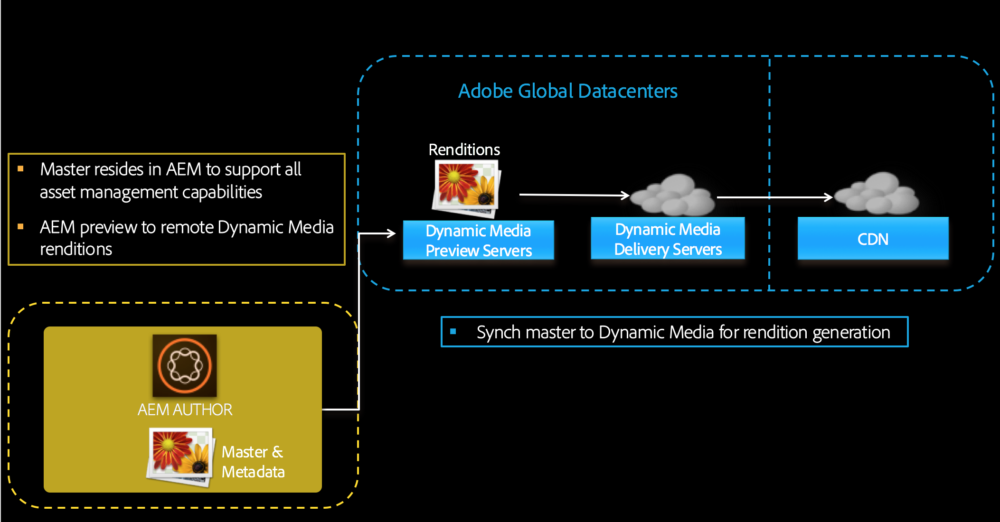

# Konfigurieren von Dynamic Media Cloud Service {#configuring-dynamic-media}

{{work-with-dynamic-media}}

Wenn Sie Adobe Experience Manager as a Cloud Service für verschiedene Umgebungen wie Entwicklung, Staging und Live-Produktion verwenden, müssen Sie Dynamic Media Cloud Services für jede dieser Umgebungen konfigurieren.

Siehe auch [Konfigurieren eines Firmen-Alias-Kontos für Dynamic Media](/help/assets/dynamic-media/dm-alias-account.md)

>[!IMPORTANT]
>
>**Dynamic Media (Scene7) wird in erweiterten Sicherheitsumgebungen nicht unterstützt**
>
>Dynamic Media (Scene7) auf AEM as a Cloud Service ist nicht HIPAA-fähig und kann nicht in AEM-Umgebungen verwendet werden, in denen die erweiterte Sicherheit aktiviert ist.
>
>Ab der AEM as a Cloud Service-Version vom April 2025 verhindert eine technische Einschränkung, dass Dynamic Media (Scene7) in Umgebungen mit verbesserter Sicherheit konfiguriert wird. Infolgedessen ist die Karte **Dynamic Media-Konfiguration** unter **Tools** > **Cloud Services** in diesen Umgebungen nicht mehr sichtbar.
>
>Kunden, die AEM 6.5 verwenden, sollten außerdem beachten, dass der Dynamic Media (Scene7)-Stack nicht HIPAA-fähig ist.

## Architekturgrafik von Dynamic Media {#architecture-diagram-of-dynamic-media}

Die folgende Architekturgrafik beschreibt die Funktionsweise von Dynamic Media.

Mit der neuen Architektur ist Experience Manager für Assets aus Primärquellen und Synchronisierungen mit Dynamic Media für die Verarbeitung und Veröffentlichung von Assets zuständig:

1. Wenn das Primärquellen-Asset in Adobe Experience Manager as a Cloud Service hochgeladen wird, wird es nach Dynamic Media repliziert. Ab diesem Punkt übernimmt Dynamic Media die gesamte Asset-Verarbeitung und die Erstellung von Ausgabedarstellungen, z. B. Videokodierung und dynamische Varianten eines Bilds.
1. Nachdem die Ausgabedarstellungen generiert wurden, kann Experience Manager as a Cloud Service sicher auf die Remote-Dynamic Media-Ausgabedarstellungen zugreifen und eine Vorschau davon anzeigen (es werden keine Binärdateien an die Experience Manager as a Cloud Service-Instanz zurückgesendet).
1. Nachdem der Inhalt bereit zur Genehmigung und Veröffentlichung ist, wird der Dynamic Media-Service ausgelöst und pusht Inhalte an Bereitstellungs-Server und Cache-Inhalte in das CDN (Content Delivery Network).

>[!NOTE]
>
>Für die folgende Liste von Funktionen müssen Sie das im Lieferumfang von Adobe Experience Manager – Dynamic Media enthaltene vorkonfigurierte CDN verwenden. Andere benutzerdefinierte CDN werden von diesen Funktionen nicht unterstützt.
>
>* [Intelligente Bildbearbeitung](/help/assets/dynamic-media/imaging-faq.md)
>* [Cache-Invalidierung](/help/assets/dynamic-media/invalidate-cdn-cache-dynamic-media.md)
>* [Hotlink-Schutz](/help/assets/dynamic-media/hotlink-protection.md)
>* [Bereitstellung von Inhalten per HTTP/2](/help/assets/dynamic-media/http2faq.md)
>* URL-Umleitung auf CDN-Ebene
>* Akamai ChinaCDN (für optimalen Versand in China)

<!-- OBSOLETE CONTENT

## (Optional) Migrating Dynamic Media presets and configurations from 6.3 to 6.5 Zero Downtime {#optional-migrating-dynamic-media-presets-and-configurations-from-to-zero-downtime}

If you are upgrading Experience Manager as a Cloud Service Dynamic Media from 6.3 to 6.4 or 6.5 (which now includes the ability for zero downtime deployments), you are required to run the following curl command to migrate all your presets and configurations from `/etc` to `/conf` in CRXDE Lite.

>[!NOTE]
>
>If you run your Experience Manager as a Cloud Service instance in compatibility mode--that is, you have the compatibility packaged installed--you do not need to run these commands.

For all upgrades, either with or without the compatibility package, you can copy the default, out-of-the-box viewer presets that originally came with Dynamic Media by running the following Linux curl command:

`curl -u admin:admin -X POST https://<server_address>:<server_port>/libs/settings/dam/dm/presets/viewer.pushviewerpresets.json`

To migrate any custom viewer presets and configurations that you have created from `/etc` to `/conf`, run the following Linux curl command:

`curl -u admin:admin -X POST https://<server_address>:<server_port>/libs/settings/dam/dm/presets.migratedmcontent.json`

-->

## Erstellen einer Dynamic Media-Konfiguration in Cloud Services {#configuring-dynamic-media-cloud-services}

<!-- **Before you creating a Dynamic Media Configuration in Cloud Services**: After you receive your provisioning email with Dynamic Media credentials, you must open the [Dynamic Media Classic desktop application](https://experienceleague.adobe.com/docs/dynamic-media-classic/using/getting-started/signing-out.html#getting-started), then sign in to your account to change your password. The password provided in the provisioning email is system-generated and intended to be a temporary password only. It is important that you update the password so that Dynamic Media Cloud Service is set up with the correct credentials. -->

1. Wählen Sie in Experience Manager as a Cloud Service das Experience Manager as a Cloud Service-Logo aus, um auf die globale Navigationskonsole zuzugreifen.
1. Wählen Sie auf der linken Seite der Konsole das Symbol „Tools“ und anschließend **[!UICONTROL Cloud Services > Dynamic Media-Konfiguration]** aus.
1. Wählen Sie auf der Seite zur Dynamic Media-Konfiguration im linken Bereich **[!UICONTROL global]** aus (wählen Sie nicht das Ordnersymbol links neben **[!UICONTROL global]** aus). Wählen Sie dann **[!UICONTROL Erstellen]** aus.
1. Geben Sie auf der Seite **[!UICONTROL Konfiguration für Dynamic Media erstellen]** den Titel, die E-Mail-Adresse für das Dynamic Media-Konto und das Passwort des Unternehmensadministrators für das Dynamic Media-Konto ein und wählen Sie dann Ihre Region aus. Diese Informationen erhalten Sie in der Bereitstellungs-E-Mail von Adobe. Wenden Sie sich an den Support von Adobe, falls Sie diese E-Mail nicht erhalten haben.
1. Wählen Sie **[!UICONTROL Mit Dynamic Media verbinden]** aus.
1. Geben Sie im Dialogfeld **[!UICONTROL Kennwort ändern]** im Feld **[!UICONTROL Neues Kennwort]** ein neues Kennwort ein, das aus 8-25 Zeichen besteht. Das Kennwort muss je mindestens eines der folgenden Elemente enthalten:

   * Großbuchstabe
   * Kleinbuchstabe
   * Zahl
   * Sonderzeichen: `# $ & . - _ : { }`

   Das Feld **[!UICONTROL Aktuelles Kennwort]** wird absichtlich vorab ausgefüllt und ausgeblendet.

   Bei Bedarf können Sie die Schreibweise eines von Ihnen eingegebenen oder erneut eingegebenen Kennworts überprüfen, indem Sie das Augensymbol auswählen, um das Kennwort anzuzeigen. Wählen Sie das Symbol erneut aus, um das Kennwort auszublenden.

1. Geben Sie im Feld **[!UICONTROL Kennwort wiederholen]** das neue Kennwort erneut ein und wählen Sie dann **[!UICONTROL Fertig]** aus.

   Das neue Kennwort wird gespeichert, wenn Sie oben rechts auf der Seite **[!UICONTROL Dynamic Media-Konfiguration erstellen]** die Option **[!UICONTROL Speichern]** auswählen.

   Wenn Sie im Dialogfeld **[!UICONTROL Kennwort ändern]** die Option **[!UICONTROL Abbrechen]** ausgewählt haben, müssen Sie dennoch ein neues Kennwort eingeben, wenn Sie die erstellte Dynamic Media-Konfiguration speichern.

   Weitere Informationen finden Sie unter [Ändern des Kennworts für Dynamic Media](#change-dm-password).

1. Nachdem die Verbindung erfolgreich hergestellt wurde, können Sie Folgendes einrichten:

   | Eigenschaft | Beschreibung |
   |---|---|
   | Unternehmen | Der Name des Dynamic Media-Kontos. **Wichtig**: In einer Instanz von Experience Manager wird nur eine Dynamic Media-Konfiguration in Cloud Services unterstützt. Fügen Sie nicht mehr als eine Konfiguration hinzu. Adobe unterstützt *nicht* oder empfiehlt die Konfiguration mehrerer Dynamic Media-Konfigurationen auf einer einzelnen Experience Manager-Instanz.<!-- CQDOC-19579 and CQDOC-19612 --> Siehe auch [Konfigurieren eines Firmen-Alias-Kontos für Dynamic Media](/help/assets/dynamic-media/dm-alias-account.md). |
   | Pfad zum Stammordner des Unternehmens | Pfad zum Stammordner Ihres Unternehmens. |
   | Veröffentlichen von Assets | Sie können aus den folgenden drei Optionen auswählen: **[!UICONTROL Sofort &#x200B;]**: Wenn Assets hochgeladen werden, nimmt das System die Assets auf und stellt die URL / den Link zur Einbettung sofort bereit. Zum Veröffentlichen von Assets ist kein Benutzereingriff erforderlich. **[!UICONTROL Bei Aktivierung]**: Sie müssen das Asset zuerst explizit veröffentlichen, bevor eine URL/ein Link zur Einbettung bereitgestellt wird. **[!UICONTROL Selektive Veröffentlichung &#x200B;]**: Assets werden nur zur sicheren Vorschau automatisch veröffentlicht. Sie können auch explizit in Experience Manager as a Cloud Service veröffentlicht werden, ohne sie in DMS7 zur Bereitstellung im öffentlichen Bereich zu veröffentlichen. In Zukunft wird diese Option dazu verwendet, Assets in Experience Manager as a Cloud Service und andere Assets in Dynamic Media zu veröffentlichen, wobei sich die beiden gegenseitig ausschließen. Das heißt, Sie können Assets in DMS7 veröffentlichen, damit Sie Funktionen wie smartes Zuschneiden oder dynamische Ausgabedarstellungen verwenden können. Sie können Assets auch ausschließlich in Experience Manager as a Cloud Service zur Vorschau veröffentlichen. Die gleichen Assets werden nicht in DMS7 veröffentlicht, um sie im öffentlich zugänglichen Bereich bereitzustellen. |
   | Sicherer Vorschau-Server | Damit können Sie den URL-Pfad zu Ihrem Vorschau-Server für sichere Ausgabedarstellungen angeben. Das heißt, nachdem Ausgabedarstellungen generiert wurden, kann AEM as a Cloud Service sicher auf die Remote-Dynamic Media-Ausgabedarstellungen zugreifen und eine Vorschau davon anzeigen (es werden keine Binärdateien an die Experience Manager as a Cloud Service-Instanz zurückgesendet). Sofern Sie keine gesonderte Vereinbarung zum Verwenden Ihrer eigenen Unternehmens-Server oder eines speziellen Servers getroffen haben, empfiehlt Adobe, diese Einstellung nicht zu verändern. |
   | Alle Inhalte synchronisieren | Standardmäßig ausgewählt. Deaktivieren Sie diese Option, wenn Sie Assets aus der Synchronisierung mit Dynamic Media gezielt ein- oder ausschließen möchten. Wenn Sie diese Option deaktivieren, können Sie aus den folgenden beiden Synchronisierungsmodi für Dynamic Media wählen **[!UICONTROL Synchronisierungsmodus für Dynamic Media]** **[!UICONTROL Standardmäßig aktiviert &#x200B;]**- Die Konfiguration wird standardmäßig auf alle Ordner angewendet, es sei denn, Sie markieren einen Ordner speziell zum Ausschließen. <!-- you can then deselect the folders that you do not want the configuration applied to.--> **[!UICONTROL Standardmäßig deaktiviert]**: Die Konfiguration wird auf einen Ordner erst dann angewendet, wenn Sie einen ausgewählten Ordner explizit zur Synchronisierung mit Dynamic Media markieren. Um einen ausgewählten Ordner zur Synchronisierung mit Dynamic Media zu markieren, wählen Sie einen Asset-Ordner aus und wählen Sie dann in der Symbolleiste **[!UICONTROL Eigenschaften]** aus. Wählen Sie auf der Registerkarte **[!UICONTROL Details]** in der Dropdown-Liste **[!UICONTROL Synchronisierungsmodus für Dynamic Media]** eine der folgenden drei Optionen aus. Wenn Sie fertig sind, wählen Sie **[!UICONTROL Speichern]** aus. _Denken Sie daran: Diese drei Optionen stehen nicht zur Verfügung, wenn Sie zuvor **Alle Inhalte synchronisieren**&#x200B;ausgewählt haben._ Weitere Informationen finden Sie unter [Arbeiten mit selektiver Veröffentlichung auf Ordnerebene in Dynamic Media](/help/assets/dynamic-media/selective-publishing.md). **[!UICONTROL Vererbt &#x200B;]**: Kein expliziter Synchronisierungswert für den Ordner. Stattdessen übernimmt der Ordner den Synchronisierungswert von einem seiner Vorgängerordner oder den Standardmodus in der Cloud-Konfiguration. Der detaillierte Status für geerbte Daten wird als QuickInfo angezeigt. **[!UICONTROL Aktivieren für Unterordner]**: Schließt alle Elemente in dieser Unterstruktur zur Synchronisierung mit Dynamic Media ein. Die ordnerspezifischen Einstellungen setzen den Standardmodus in der Cloud-Konfiguration außer Kraft. **[!UICONTROL Deaktiviert für Unterordner &#x200B;]**: Schließt alle Elemente in dieser Unterstruktur von der Synchronisierung mit Dynamic Media aus. |

   >[!NOTE]
   >
   >Die Versionierung wird in Dynamic Media nicht unterstützt. Eine verzögerte Aktivierung gilt nur, wenn auf der Seite „Konfiguration für Dynamic Media bearbeiten“ die Option **[!UICONTROL Elemente veröffentlichen]** auf **[!UICONTROL Bei Aktivierung]** eingestellt ist, und nur bis zur ersten Aktivierung des Assets.
   >
   >
   >Wenn ein Asset aktiviert wurde, werden alle Aktualisierungen automatisch live in der S7-Bereitstellung übernommen.

   

1. Klicken Sie auf **[!UICONTROL Speichern]**. Das neue Kennwort und die Konfiguration für Dynamic Media werden gespeichert. Wenn Sie stattdessen **[!UICONTROL Abbrechen]** ausgewählt haben, wird das Kennwort nicht aktualisiert.
1. Wählen Sie im Dialogfeld **[!UICONTROL Konfigurieren von Dynamic Media]** die Option **[!UICONTROL OK]** aus, um die Konfiguration zu starten.

   >[!IMPORTANT]
   >
   >Wenn die neue Dynamic Media-Konfiguration abgeschlossen ist, erhalten Sie eine Statusbenachrichtigung innerhalb des Posteingangs von Experience Manager as a Cloud Service.
   >
   >Diese Benachrichtigung im Posteingang informiert Sie darüber, ob die Konfiguration erfolgreich war oder nicht.
   > Weitere Informationen finden Sie unter [Fehlerbehebung bei einer neuen Dynamic Media-Konfiguration](#troubleshoot-dm-config) und [Ihr Posteingang](/help/sites-cloud/authoring/inbox.md).

1. Um Dynamic Media-Inhalte sicher in der Vorschau anzuzeigen, bevor sie veröffentlicht werden, verwendet Experience Manager as a Cloud Service eine Token-basierte Validierung und daher zeigt Experience Manager Author Dynamic Media-Inhalte standardmäßig in der Vorschau an. Auf die Zulassungsliste setzen Sie können jedoch *weitere IPs*, um Benutzern Zugriff auf eine sichere Vorschau von Inhalten zu ermöglichen. Informationen zum Einrichten dieser Aktion in Experience Manager as a Cloud Service finden Sie unter [Konfigurieren von Dynamic Media-Veröffentlichungseinstellungen für Image-Server - Registerkarte Sicherheit](/help/assets/dynamic-media/dm-publish-settings.md#security-tab). <!-- To securely preview Dynamic Media content before it gets published, you must "allowlist" the Experience Manager as a Cloud Service author instance to connect to Dynamic Media. To set up this action, do the following: -->

<!--
    * Open the [Dynamic Media Classic desktop application](https://experienceleague.adobe.com/docs/dynamic-media-classic/using/getting-started/signing-out.html#getting-started), then sign in to your account. Your credentials and sign-in details were provided by Adobe at the time of provisioning. If you do not have this information, contact Adobe Customer Support.
    * On the navigation bar near the upper right corner of the page, go to **[!UICONTROL Setup]** > **[!UICONTROL Application Setup]** > **[!UICONTROL Publish Setup]** > **[!UICONTROL Image Server]**.
    * On the Image Server Publish page, in the **[!UICONTROL Publish Context]** drop-down list, select **[!UICONTROL Test Image Serving]**.
    * For the Client Address Filter, select **[!UICONTROL Add]**.
    * To enable (turn on) the address, select the check box, then enter the IP address of the Experience Manager Author instance (not Dispatcher IP).
    * Select **[!UICONTROL Save]**. -->

Sie haben nun die Grundkonfiguration abgeschlossen und können Dynamic Media verwenden.

Wenn Sie Ihre Konfiguration weiter anpassen möchten, wie etwa Berechtigungen auf die Zugriffskontrollliste (ACL) aktivieren, können Sie auch eine der Aufgaben unter &quot;[ Einstellungen in Dynamic Media konfigurieren“ ](#optional-configuring-advanced-settings-in-dynamic-media-scene-mode).

### Fehlerbehebung bei einer neuen Dynamic Media-Konfiguration {#troubleshoot-dm-config}

Wenn die Einrichtung einer neuen Dynamic Media-Konfiguration abgeschlossen ist, erhalten Sie eine Statusbenachrichtigung im Posteingang von Experience Manager as a Cloud Service. Diese Benachrichtigung informiert Sie darüber, ob die Konfiguration erfolgreich war oder nicht, wie in den folgenden Bildern aus dem Posteingang dargestellt.

Weitere Informationen finden Sie unter [Ihr Posteingang](/help/sites-cloud/authoring/inbox.md).

**Fehlerbehebung bei einer neuen Dynamic Media-Konfiguration:**

1. Wählen Sie oben rechts auf der Experience Manager as a Cloud Service-Seite das Glockensymbol und dann **[!UICONTROL Alle anzeigen]** aus.
1. Wählen Sie auf der Seite „Posteingang“ die Erfolgsbenachrichtigung aus, um einen Überblick über den Status und die Protokolle der Konfiguration zu erhalten.

   Wenn die Konfiguration fehlschlug, wählen Sie die Fehlerbenachrichtigung ähnlich dem folgenden Screenshot aus.

   

1. Überprüfen Sie auf der Seite **[!UICONTROL DMSETUP]** die Konfigurationsdetails, die den Fehler beschreiben. Beachten Sie insbesondere alle Fehlermeldungen oder Fehler-Codes. Wenden Sie sich mit diesen Informationen an den Support von Adobe.

   

### Ändern des Kennworts für Dynamic Media {#change-dm-password}

Das Ablaufdatum des Kennworts wird in Dynamic Media auf 100 Jahre ab dem aktuellen Systemdatum gesetzt.

Das Kennwort muss je mindestens eines der folgenden Elemente enthalten:

* Großbuchstabe
* Kleinbuchstabe
* Zahl
* Sonderzeichen: `# $ & . - _ : { }`

Bei Bedarf können Sie die Schreibweise eines von Ihnen eingegebenen oder erneut eingegebenen Kennworts überprüfen, indem Sie das Augensymbol auswählen, um das Kennwort anzuzeigen. Wählen Sie das Symbol erneut aus, um das Kennwort auszublenden.

Das geänderte Kennwort wird gespeichert, wenn Sie **[!UICONTROL Speichern]** oben rechts auf der Seite **[!UICONTROL Dynamic Media-Konfiguration bearbeiten]** auswählen.

1. Wählen Sie in Experience Manager as a Cloud Service das Experience Manager as a Cloud Service-Logo aus, um auf die globale Navigationskonsole zuzugreifen.
1. Wählen Sie auf der linken Seite der Konsole das Symbol „Tools“ und anschließend **[!UICONTROL Cloud Services > Dynamic Media-Konfiguration]** aus.
1. Wählen Sie im Browser für die Dynamic Media-Konfiguration im Bedienfeld links **[!UICONTROL global]**. Wählen Sie nicht das Ordnersymbol links neben **[!UICONTROL global]** aus. Wählen Sie dann **[!UICONTROL Bearbeiten]** aus.
1. Wählen Sie auf der Seite **[!UICONTROL Dynamic Media-Konfiguration bearbeiten]** direkt unter dem Feld **[!UICONTROL Kennwort]** die Option **[!UICONTROL Kennwort ändern]** aus.
1. Gehen Sie im Dialogfeld **[!UICONTROL Kennwort ändern]** wie folgt vor:

   * Geben Sie im Feld **[!UICONTROL Neues Kennwort]** ein neues Kennwort ein.

     Das Feld **[!UICONTROL Aktuelles Kennwort]** wird absichtlich vorab ausgefüllt und ausgeblendet.

   * Geben Sie im Feld **[!UICONTROL Kennwort wiederholen]** das neue Kennwort erneut ein und wählen Sie dann **[!UICONTROL Fertig]** aus.

1. Wählen Sie oben rechts auf der Seite **[!UICONTROL Dynamic Media-Konfiguration bearbeiten]** die Option **[!UICONTROL Speichern]** und dann **[!UICONTROL OK]** aus.

## (Optional) Konfigurieren der erweiterten Einstellungen in Dynamic Media{#optional-configuring-advanced-settings-in-dynamic-media-scene-mode}

Um die Konfiguration und Einrichtung von Dynamic Media weiter anzupassen oder die Leistung zu optimieren, können Sie eine oder mehrere der folgenden _optionalen_ Aufgaben durchführen:

* [(Optional) Aktivieren von ACL-Berechtigungen in Dynamic Media](#optional-enable-acl)
* [(Optional) Einrichtung und Konfiguration der Einstellungen von Dynamic Media](#optional-setup-and-configuration-of-dynamic-media-scene-mode-settings)
* [(Optional) Steigern der Leistung von Dynamic Media](#optional-tuning-the-performance-of-dynamic-media-scene-mode)

<!--

* [(Optional) Filtering assets for replication](#optional-filtering-assets-for-replication)

-->

<!-- Removed as per CQDOC-20701 - May need to revisit and update. In Adobe Experience Manager (AEM) as a Cloud Service, enabling Access Control List (ACL) permissions for Dynamic Media requires a different approach compared to on-premise versions (which was described below), as direct editing of OSGi configurations via the UI is not supported. Not sure how this is done now. For example, you can manage ACLs using tools like the Netcentric Access Control Tool (AC Tool), which simplifies the specification and deployment of complex ACLs in AEM but I doubt that's the recommended method.

### (Optional) Enable Access Control List permissions in Dynamic Media {#optional-enable-acl}

When you run Dynamic Media on AEM as a Cloud Service, it currently forwards `/is/image` requests to Secure Preview Image Serving without checking ACL (Access Control List) permissions on the PlatformServerServlet. You can, however, _enable_ ACL permissions. Doing so forwards the authorized `/is/image` requests. If a user is not authorized to access the asset, a "403 - Forbidden" error is displayed.

**To enable Access Control List permissions in Dynamic Media on AEM as a Cloud Service:**

1. From Adobe Experience Manager, navigate to **[!UICONTROL Tools]** > **[!UICONTROL Operations]** > **[!UICONTROL Web Console]**.

   

1. A new browser tab opens to the **[!UICONTROL Adobe Experience Manager Web Console Configuration]** page.

   

1. On the page, scroll to the name _Adobe CQ Scene7 PlatformServer_.

1. To the right of the name, select the pencil icon (**[!UICONTROL Edit the configuration values]**).

1. On the **com.adobe.cq.dam.s7imaging.impl.ps.PlatformServerServlet.name** page, select the check box for the following two settings:

   * `com.adobe.cq.dam.s7imaging.impl.ps.PlatformServerServlet.cache.enable.name` &ndash; When enabled, this setting caches permission results for two minutes (default) to save.
   * `com.adobe.cq.dam.s7imaging.impl.ps.PlatformServerServlet.validate.userAccess.name` &ndash; When enabled, this setting validates a user's access while they preview assets by way of Dynamic Media Image Server.

   

1. Near the lower-right corner of the page, select **[!UICONTROL Save]**.
-->

### (Optional) Einrichtung und Konfiguration der Einstellungen von Dynamic Media {#optional-setup-and-configuration-of-dynamic-media-scene-mode-settings}

Verwenden Sie die Benutzeroberfläche von Dynamic Media Classic, um Änderungen an Ihren Einstellungen für Dynamic Media vorzunehmen.

<!-- Some of the tasks above require that you open the [Dynamic Media Classic desktop application](https://experienceleague.adobe.com/docs/dynamic-media-classic/using/getting-started/signing-out.html#getting-started), then sign in to your account. -->

Die Einrichtungs- und Konfigurationsaufgaben umfassen Folgendes:

* [Konfigurieren der Dynamic Media-Veröffentlichungseinstellungen für Imageserver](#publishing-setup-for-image-server)
* [Konfigurieren allgemeiner Einstellungen für Dynamic Media](#configuring-application-general-settings)
* [Konfigurieren des Farb-Managements](#configuring-color-management)
* [Bearbeiten von MIME-Typen für unterstützte Formate](#editing-mime-types-for-supported-formats)
* [Hinzufügen von MIME-Typen für nicht unterstützte Formate](#adding-mime-types-for-unsupported-formats)
<!-- OBSOLETE BUT LEAVE FOR POSSIBLE FUTURE* [Creating batch set presets to auto-generate Image Sets and Spin Sets](#creating-batch-set-presets-to-auto-generate-image-sets-and-spin-sets) -->

#### Konfigurieren der Dynamic Media-Veröffentlichungseinstellungen für Imageserver {#publishing-setup-for-image-server}

Auf der Seite „Veröffentlichungseinstellungen von Dynamic Media“ werden Standardeinstellungen festgelegt, die festlegen, wie Assets von Adobe Dynamic Media-Servern für Websites oder Programme bereitgestellt werden.

Siehe [Konfigurieren der Dynamic Media-Veröffentlichungseinstellungen für Imageserver](/help/assets/dynamic-media/dm-publish-settings.md).

#### Konfigurieren allgemeiner Einstellungen für Dynamic Media {#configuring-application-general-settings}

Konfigurieren der URL **[!UICONTROL Veröffentlichungsservername]** und der URL **[!UICONTROL Name des ursprünglichen Servers]** für Dynamic Media. Sie können auch Einstellungen unter **[!UICONTROL In Programm hochladen]** und **[!UICONTROL Standardmäßige Upload-Optionen]** basierend auf Ihrem jeweiligen Anwendungsfall angeben.

Siehe [Konfigurieren allgemeiner Dynamic Media-Einstellungen](/help/assets/dynamic-media/dm-general-settings.md).

#### Konfigurieren des Farb-Managements {#configuring-color-management}

Beim Farb-Management für Dynamic Media können Sie die Farben von Assets korrigieren. Bei der Farbkorrektur behalten übernommene Assets ihren Farbraum (RGB, CMYK, Grau) und das eingebettete Farbprofil bei. Wenn Sie eine dynamische Ausgabedarstellung anfordern, wird die Bildfarbe gemäß dem Zielfarbraum korrigiert, indem eine CMYK-, RGB- oder Grau-Ausgabe verwendet wird.

Siehe [Konfigurieren von Bildvorgaben](/help/assets/dynamic-media/managing-image-presets.md).

So konfigurieren Sie die Standardfarbeigenschaften, damit die Farbkorrektur beim Anfordern von Bildern aktiviert ist:

1. Öffnen Sie das [Dynamic Media Classic-Desktop-Programm](https://experienceleague.adobe.com/de/docs/dynamic-media-classic/using/getting-started/signing-out#getting-started) und melden Sie sich mit den Anmeldedaten, die Sie zum Zeitpunkt der Bereitstellung erhalten haben, bei Ihrem Konto an.
1. Navigieren Sie zu **[!UICONTROL Einrichtung > Anwendungseinstellungen]**.
1. Erweitern Sie den Bereich **[!UICONTROL Veröffentlichungseinstellungen]** und wählen Sie **[!UICONTROL Image-Server]**. Legen Sie **[!UICONTROL Veröffentlichungskontext]** beim Festlegen von Standardwerten für Veröffentlichungsinstanzen auf **[!UICONTROL Image Serving]** fest.
1. Scrollen Sie zu der Eigenschaft, die Sie ändern müssen, z. B. einer Eigenschaft im Bereich **[!UICONTROL Farb-Management-Attribute]**.
Sie können die folgenden Farbkorrektureigenschaften festlegen:

   | Eigenschaft | Beschreibung |
   |---|---|
   | CMYK-Standardfarbraum | Name des standardmäßigen CMYK-Farbprofils. |
   | Graustufen-Standardfarbraum | Name des standardmäßigen grauen Farbprofils. |
   | RGB-Standardfarbraum | Name des standardmäßigen RGB-Profils. |
   | Rendering-Absicht der Farbkonvertierung | Gibt die Rendering-Absicht an. Zulässige Werte sind: **[!UICONTROL wahrnehmungsorientiert]**, **[!UICONTROL relativ farbmetrisch]**, **[!UICONTROL Sättigung]**, **[!UICONTROL absolut farbmetrisch]**. Adobe empfiehlt **[!UICONTROL relativ]** als Standard. |

1. Klicken Sie auf **[!UICONTROL Speichern]**.

So können Sie beispielsweise den **[!UICONTROL RGB-Standardfarbraum]** auf *sRGB* und den **[!UICONTROL CMYK-Standardfarbraum]** auf *WebCoated* festlegen.

Dies hat folgende Auswirkungen:

* Die Farbkorrektur für RGB- und CMYK-Bilder wird aktiviert.
* Für RGB-Bilder ohne Farbprofil wird angenommen, dass sie sich im Farbraum *sRGB* befinden.
* Für CMYK-Bilder ohne Farbprofil wird angenommen, dass sie sich im Farbraum *WebCoated* befinden.
* Für dynamische Ausgabedarstellungen, bei denen eine RGB-Ausgabe zurückgegeben wird, erfolgt dies im Farbraum *sRGB*.
* Für dynamische Ausgabedarstellungen, bei denen eine CMYK-Ausgabe zurückgegeben wird, erfolgt dies im Farbraum *WebCoated*.

#### Bearbeiten von MIME-Typen für unterstützte Formate {#editing-mime-types-for-supported-formats}

Sie können die Asset-Typen angeben, die von Dynamic Media verarbeitet werden, und die erweiterten Asset-Verarbeitungsparameter anpassen. Beispielsweise können Sie Asset-Verarbeitungsparameter für folgende Aktionen festlegen:

* Konvertieren eines Adobe PDF-Dokuments in ein E-Katalog-Asset
* Konvertieren eines Adobe Photoshop-Dokuments (.PSD) in ein Bannervorlagen-Asset für Personalisierung
* Rastern einer Adobe Illustrator- (.AI) oder Adobe Photoshop Encapsulated PostScript®-Datei (.EPS)
* [Videoprofile](/help/assets/dynamic-media/video-profiles.md) und [Bildprofile](/help/assets/dynamic-media/image-profiles.md) können jeweils zum Definieren der Verarbeitung von Videos und Bildern verwendet werden.

Siehe [Hochladen von Assets](/help/assets/add-assets.md).

**Gehen Sie folgendermaßen vor, um MIME-Typen für unterstützte Formate zu bearbeiten:**

1. Melden Sie sich bei Ihrem Experience Manager as a Cloud Service als Produktadministrator an.
1. Wählen Sie in Experience Manager as a Cloud Service das Experience Manager as a Cloud Service-Logo aus, um auf die globale Navigationskonsole zuzugreifen. Navigieren Sie dann zu **[!UICONTROL Allgemein > CRXDE Lite]**.

   Wenn Sie keinen Zugriff auf CRXDE Lite haben, lesen Sie [Verwenden von CRXDE Lite](/help/implementing/developing/tools/crxde.md).

1. Navigieren Sie in der linken Leiste zu:

   `/conf/global/settings/cloudconfigs/dmscene7/jcr:content/mimeTypes`

   

1. Wählen Sie unter dem Ordner „mimeTypes“ einen MIME-Typ aus:
1. Im rechten unteren Bereich der Seite „CRXDE Lite“:

   * Wählen Sie das Feld **[!UICONTROL Aktiviert]** doppelt aus. Alle Asset-MIME-Typen sind standardmäßig aktiviert (auf **[!UICONTROL true]** festgelegt). Dies bedeutet, dass die Assets zur Verarbeitung mit Dynamic Media synchronisiert werden. Wenn Sie diesen Asset-MIME-Typ von der Verarbeitung ausschließen möchten, ändern Sie diese Einstellung in **[!UICONTROL false]**.

   * Wählen Sie **[!UICONTROL jobParam]** doppelt aus, um das zugehörige Textfeld zu öffnen. Unter [Unterstützte MIME-Typen](/help/assets/file-format-support.md) finden Sie eine Liste mit zulässigen Werten für Verarbeitungsparameter, die Sie für einen bestimmten MIME-Typ verwenden können.

1. Führen Sie einen der folgenden Schritte aus:
   * Wiederholen Sie die Schritte 3–4, um weitere MIME-Typen zu bearbeiten.
   * Wählen Sie in der Menüleiste der Seite „CRXDE Lite“ die Option **[!UICONTROL Alle speichern]** aus.

1. Wählen Sie oben links auf der Seite die Option **[!UICONTROL CRXDE Lite]** aus, um zu Experience Manager as a Cloud Service zurückzukehren.

#### Hinzufügen von MIME-Typen für nicht unterstützte Formate {#adding-mime-types-for-unsupported-formats}

Sie können in Experience Manager Assets benutzerdefinierte MIME-Typen für nicht unterstützte Formate hinzufügen. Um zu verhindern, dass Experience Manager einen neuen Knoten löscht, den Sie in CRXDE Lite hinzufügen, verschieben Sie den MIME-Typ vor dem `image_`. Stellen Sie außerdem sicher, dass der aktivierte Wert auf **[!UICONTROL false]** eingestellt ist.

**So fügen Sie MIME-Typen für nicht unterstützte Formate hinzu:**

1. Melden Sie sich bei Ihrem Experience Manager as a Cloud Service als Produktadministrator an.
1. Navigieren Sie in Experience Manager as a Cloud Service zu **[!UICONTROL Tools > Vorgänge > Web-Konsole]**.

   

1. Auf der Seite **[!UICONTROL Adobe Experience Manager-Web-Konsolen-Konfiguration]** wird eine neue Browser-Registerkarte geöffnet.

   

1. Scrollen Sie auf der Seite nach unten zum Namen *Adobe CQ Scene7 Asset MIME type Service* wie im folgenden Screenshot gezeigt. Klicken Sie rechts neben dem Namen auf **[!UICONTROL Konfigurationswerte bearbeiten]** (Stiftsymbol).

   

1. Wählen Sie auf der Seite **Adobe CQ Scene7 Asset MIME type Service** ein beliebiges Pluszeichen &lt;+> aus. Die Position in der Tabelle, an der Sie das Pluszeichen auswählen, um den neuen MIME-Typ hinzuzufügen, ist unerheblich.

   

1. Geben Sie `DWG=image/vnd.dwg` in das leere Textfeld ein, das Sie soeben hinzugefügt haben.

   Der MIME-Typ `DWG=image/vnd.dwg` dient nur zu Beispielzwecken. Der hier hinzugefügte MIME-Typ kann ein beliebiges anderes nicht unterstütztes Format sein.

   

1. Wählen Sie unten rechts auf der Seite **[!UICONTROL Speichern]** aus.

   An dieser Stelle können Sie die Registerkarte des Browsers schließen, auf der die Seite „Adobe Experience Manager-Web-Konsolen-Konfiguration“ geöffnet ist.

1. Kehren Sie zur Browser-Registerkarte zurück, auf der sich Ihre geöffnete Experience Manager as a Cloud Service-Konsole befindet.
1. Wählen Sie in Experience Manager as a Cloud Service die Option **[!UICONTROL Tools > Allgemein > CRXDE Lite]** aus.

   Wenn Sie keinen Zugriff auf CRXDE Lite haben, lesen Sie [Verwenden von CRXDE Lite](/help/implementing/developing/tools/crxde.md).

   

1. Navigieren Sie in der linken Leiste zu:

   `conf/global/settings/cloudconfigs/dmscene7/jcr:content/mimeTypes`

1. Ziehen Sie den MIME-Typ `image_vnd.dwg` und legen Sie ihn direkt über `image_` in der Baumstruktur ab, wie im folgenden Screenshot gezeigt.

   

1. Während der MIME-Typ `image_vnd.dwg` noch ausgewählt ist, wählen Sie auf der Registerkarte **[!UICONTROL Eigenschaften]** in der Zeile **[!UICONTROL Aktiviert]** unter der Spaltenüberschrift **[!UICONTROL Wert]** den Wert doppelt aus. Die Dropdown-Liste **[!UICONTROL Wert]** wird geöffnet.
1. Geben Sie `false` in das Feld ein (oder wählen Sie **[!UICONTROL false]** aus der Dropdown-Liste).

   

1. Wählen Sie in der oberen linken Ecke der Seite „CRXDE Lite“ die Option **[!UICONTROL Alle speichern]** aus.

### (Optional) Steigern der Leistung von Dynamic Media {#optional-tuning-the-performance-of-dynamic-media-scene-mode}

Für die reibungslose Ausführung von Dynamic Media empfiehlt Adobe die folgenden Maßnahmen zur Optimierung der Synchronisierungsleistung/-skalierbarkeit:

* [Aktualisieren der vordefinierten Vorgangsparameter zur Verarbeitung verschiedener Dateiformate](#update-job-para).
* [Aktualisieren der vordefinierten Warteschlangen-Workerthreads des Granite-Workflows (Videoelemente)](#update-granite-workflow-queue-worker-threads-video)
* [Aktualisieren der vordefinierten Warteschlangen-Workerthreads des Granite-Verlaufs-Workflows (Bilder und Nicht-Videoelemente)](#update-granite-transient-workflow-queue-worker-threads-images)
* [Aktualisieren der maximalen Upload-Verbindungen mit dem Dynamic Media Classic (Scene7)-Server](#update-max-s7-upload-connections)

#### Aktualisieren der vordefinierten Auftragsparameter zur Verarbeitung verschiedener Dateiformate {#update-job-para}

Beim Hochladen von Dateien können Sie die Auftragsparameter für eine schnellere Verarbeitung anpassen. Wenn Sie beispielsweise PSD-Dateien hochladen, diese jedoch nicht als Vorlagen verarbeiten möchten, können Sie die Ebenenextraktion auf „false“ (falsch/aus) setzen. In diesem Fall wird der angepasste Vorgangsparameter wie folgt angezeigt: `process=None&createTemplate=false`.

Wenn Sie die Vorlagenerstellung aktivieren möchten, verwenden Sie die folgenden Parameter: `process=MaintainLayers&layerNaming=AppendName&createTemplate=true`.

<!-- THIS PARAGRAPH WAS REPLACED WITH THE TWO PARAGRAPHS DIRECTLY ABOVE BASED ON CQDOC-17657 You can tune job parameters for faster processing when you upload files. For example, if you are uploading PSD files, but do not want to process them as templates, you can set layer extraction to false (off). In such case, the tuned job parameter would appear as `process=None&createTemplate=false`. -->

Adobe empfiehlt die Verwendung der folgenden „angepassten“ Auftragsparameter für PDF-, PostScript®- und PSD-Dateien:

| Dateityp | Empfohlene Auftragsparameter |
| ---| ---|
| PDF | `pdfprocess=Rasterize&resolution=150&colorspace=Auto&pdfbrochure=false&keywords=false&links=false` |
| PostScript® | `psprocess=Rasterize&psresolution=150&pscolorspace=Auto&psalpha=false&psextractsearchwords=false&aiprocess=Rasterize&airesolution=150&aicolorspace=Auto&aialpha=false` |
| PSD | `process=None&layerNaming=AppendName&anchor=Center&createTemplate=false&extractText=false&extendLayers=false` |

<!-- CQDOC-17657 for PSD entry in table above -->

Informationen zum Aktualisieren dieser Parameter finden Sie unter [Bearbeiten von MIME-Typen für unterstützte Formate](#editing-mime-types-for-supported-formats).

Siehe auch [Hinzufügen von MIME-Typen für nicht unterstützte Formate](#adding-mime-types-for-unsupported-formats).

#### Aktualisieren der vordefinierten Warteschlangen-Workerthreads des Granite-Workflows (Videoelemente) {#update-granite-workflow-queue-worker-threads-video}

Die Granite-Workflow-Warteschlange wird für Workflows ohne Übergang verwendet. In Dynamic Media wird sie zum Verarbeiten von Videos mit dem Workflow **[!UICONTROL Dynamic Media-Videokodierung“]**.

>[!NOTE]
>
>Sie müssen bei Experience Manager as a Cloud Service als Produktadministrator angemeldet sein, um diese Aufgabe durchführen zu können.

Wenn Sie keinen Zugriff auf OSGi haben, lesen Sie [OSGi-Konfiguration](/help/implementing/developing/components/overview.md#osgi-configuration).

**So aktualisieren Sie die vordefinierten Warteschlangen-Workerthreads des Granite-Workflows (Videoelemente):**

1. Navigieren Sie zu `https://<server>/system/console/configMgr` und suchen Sie nach **Warteschlange: Granite-Workflow-Warteschlange**.

   >[!NOTE]
   >
   >Anstelle einer direkten URL ist eine Textsuche erforderlich, da die OSGi-PID dynamisch generiert wird.

1. Ändern Sie im Feld **[!UICONTROL Maximale Anzahl an parallelen Aufträgen]** die Zahl in den gewünschten Wert.

   Die maximale Anzahl der parallelen Aufträge hängt standardmäßig von der Anzahl der verfügbaren CPU-Kerne ab. Auf einem Server mit 4 Kernen werden z. B. zwei Workerthreads zugewiesen. (Ein Wert zwischen 0,0 und 1,0 ist verhältnisbasiert, alle Zahlen über eins weisen die Anzahl der Workerthreads zu.)

   In den meisten Fällen ist die Standardeinstellung 0,5 ausreichend.

   

1. Klicken Sie auf **[!UICONTROL Speichern]**.

#### Aktualisieren der vordefinierten Warteschlangen-Workerthreads der Granite-Verlaufs-Workflows {#update-granite-transient-workflow-queue-worker-threads-images}

Die Transit-Workflow-Warteschlange von Granite wird für den Workflow **[!UICONTROL DAM-Update-Asset]** verwendet. In Dynamic Media wird sie für die Aufnahme und Verarbeitung von Bildern und Nicht-Videoelementen verwendet.

>[!NOTE]
>
>Sie müssen bei Experience Manager as a Cloud Service als Produktadministrator angemeldet sein, um diese Aufgabe durchführen zu können.

**So aktualisieren Sie die vordefinierten Warteschlangen-Workerthreads des Granite-Verlaufs-Workflows:**

1. Gehen Sie zur **Konfiguration der Adobe Experience Manager-Web-Konsole** unter `http://<host>:<port>/system/console/configMgr`.
1. Suchen Sie nach **Warteschlange: Granite-Verlaufs-Workflow-Warteschlange**.

   >[!NOTE]
   >
   >Anstelle einer direkten URL ist eine Textsuche erforderlich, da die OSGi-PID dynamisch generiert wird.

1. Ändern Sie im Feld **[!UICONTROL Maximale Anzahl an parallelen Aufträgen]** die Zahl in den gewünschten Wert.

   Sie können **[!UICONTROL Maximale Anzahl an parallelen Aufträgen]** erhöhen, um das Hochladen von Dateien zu Dynamic Media ausreichend zu unterstützen. Der genaue Wert hängt von der Hardware-Kapazität ab. In bestimmten Fällen, z. B. bei der ersten Migration oder einem einmaligen Massen-Upload, können Sie einen großen Wert verwenden. Beachten Sie jedoch, dass die Verwendung eines großen Werts (z. B. die doppelte Anzahl an Kernen) negative Auswirkungen auf andere gleichzeitige Aktivitäten haben kann. Daher sollten Sie den Wert basierend auf Ihrem jeweiligen Anwendungsfall testen und anpassen.

<!--    By default, the maximum number of parallel jobs depends on the number of available CPU cores. For example, on a 4-core server, it assigns 2 worker threads. (A value between 0.0 and 1.0 is ratio based, or any numbers greater than 1 will assign the number of worker threads.)

   Adobe recommends that 32 **[!UICONTROL Maximum Parallel Jobs]** be configured to adequately support heavy upload of files to Dynamic Media Classic. -->

1. Klicken Sie auf **[!UICONTROL Speichern]**.

#### Aktualisieren der maximalen Upload-Verbindungen mit dem Dynamic Media Classic (Scene7)-Server {#update-max-s7-upload-connections}

Die Einstellung der Upload-Verbindung für Dynamic Media Classic (Scene7) synchronisiert Experience Manager Assets mit Dynamic Media Classic-Servern.

>[!NOTE]
>
>Sie müssen bei Experience Manager as a Cloud Service als Produktadministrator angemeldet sein, um diese Aufgabe durchführen zu können.

**So aktualisieren Sie die maximalen Upload-Verbindungen mit dem Dynamic Media Classic (Scene7)-Server:**

1. Navigieren Sie zu `https://<server>/system/console/configMgr/com.day.cq.dam.scene7.impl.Scene7UploadServiceImpl`
1. Ändern Sie im Feld **[!UICONTROL Anzahl der Verbindungen]** oder im Feld **[!UICONTROL Zeitüberschreitung bei aktiven Aufträgen]** oder beiden den Wert in die gewünschte Anzahl.

   Die Einstellung **[!UICONTROL Anzahl der Verbindungen]** bestimmt die maximale Anzahl der HTTP-Verbindungen, die für Experience Manager zum Dynamic Media-Upload zulässig sind. Normalerweise ist der vordefinierte Wert von zehn Verbindungen ausreichend.

   Die Einstellung **[!UICONTROL Zeitüberschreitung bei aktiven Aufträgen]** definiert, wie lange das System darauf wartet, dass der Bereitstellungs-Server hochgeladene Dynamic Media-Assets veröffentlicht. Dieser Wert beträgt standardmäßig 2.100 Sekunden oder 35 Minuten.

   In den meisten Fällen ist die Einstellung „2100“ausreichend.

   

1. Klicken Sie auf **[!UICONTROL Speichern]**.

<!-- NOTE - OBSOLETE that customisations to replication agents to transform content are no longer used; the following content is obsolete now 

### (Optional) Filtering assets for replication {#optional-filtering-assets-for-replication}

In non-Dynamic Media deployments, you replicate *all* assets (both images and video) from your Experience Manager as a Cloud Service author environment to the Experience Manager as a Cloud Service publish node. This workflow is necessary because the Experience Manager as a Cloud Service publish servers also deliver the assets.

However, in Dynamic Media deployments, because assets are delivered by way of the cloud service, there is no need to replicate those same assets to Experience Manager as a Cloud Service publish nodes. Such a "hybrid publishing" workflow avoids extra storage costs and longer processing times to replicate assets. Other content, such as Site pages, continue to be served from the Experience Manager as a Cloud Service publish nodes.

The filters provide a way for you to *exclude* assets from being replicated to the Experience Manager as a Cloud Service publish node.

#### Using default asset filters for replication {#using-default-asset-filters-for-replication}

If you are using Dynamic Media for imaging and/or video, then you can use the default filters that we provide as-is. The following filters are active by default:

<table>
 <tbody>
  <tr>
   <td> </td>
   <td><strong>Filter</strong></td>
   <td><strong>Mimetype</strong></td>
   <td><strong>Renditions</strong></td>
  </tr>
  <tr>
   <td>Dynamic Media Image Delivery</td>
   <td>
filter-images
 
filter-sets
 
 
 </td>
   <td>
Starts with <strong>image/</strong>
 
Contains <strong>application/</strong> and ends with <strong>set</strong>.
 </td>
   <td>The out-of-the-box "filter-images" (applies to single images assets, including interactive images) and "filter-sets" (applies to Spin Sets, Image Sets, Mixed Media Sets, and Carousel Sets) will:
    <ul>
     <li>Exclude from replication the original image and static image renditions.</li>
    </ul> </td>
  </tr>
  <tr>
   <td>Dynamic Media Video Delivery</td>
   <td>filter-video</td>
   <td>Starts with <strong>video/</strong></td>
   <td>The out-of-the-box "filter-video" will:
    <ul>
     <li>Exclude from replication the original video and static thumbnail renditions.    </li>
    </ul> </td>
  </tr>
 </tbody>
</table>

>[!NOTE]
>
>Filters apply to mime types and cannot be path specific.

#### Customizing asset filters for replication {#customizing-asset-filters-for-replication}

1. In Experience Manager as a Cloud Service, select the Experience Manager as a Cloud Service logo to access the global navigation console and select the **[!UICONTROL Tools > General > CRXDE Lite]**.
1. In the left folder tree, navigate to `/etc/replication/agents.author/publish/jcr:content/damRenditionFilters` to review the filters.

   

1. To define the Mime Type for the filter, you can locate the Mime Type as follows:

   In the left rail, expand `content > dam > <locate_your_asset> > jcr:content > metadata`, and then in the table, locate `dc:format`.

   The following graphic is an example of an asset's path to `dc:format`.

   

   Notice that the `dc:format` for the asset `Fiji Red.jpg` is `image/jpeg`.

   To have this filter apply to all images, regardless of their format, set the value to `image/*` where `*` is a regular expression that is applied to all images of any format.

   To have the filter apply only to images of the type JPEG, enter a value of `image/jpeg`.

1. Define what renditions you want to include or exclude from replication.

   Characters that you can use to filter for replication include the following:

<table>
 <tbody>
  <tr>
   <td><strong>Character to use</strong></td>
   <td><strong>How it filters assets for replication</strong></td>
  </tr>
  <tr>
   <td>*</td>
   <td>Wildcard character  </td>
  </tr>
  <tr>
   <td>+</td>
   <td>Includes assets for replication.</td>
  </tr>
  <tr>
   <td>-</td>
   <td>Excludes assets from replication.</td>
  </tr>
 </tbody>
</table>

   Navigate to `content/dam/<locate your asset>/jcr:content/renditions`.

   The following graphic is an example of an asset's renditions.

   

   If you only wanted to replicate the original, then you would enter `+original`.

   -->
