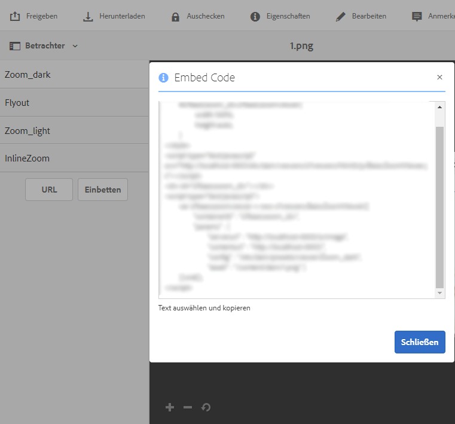

# Erstellen eines benutzerdefinierten Popup-Fensters mithilfe einer Schnellansicht {#using-quickviews-to-create-custom-pop-ups}

Die standardmäßige Schnellansicht wird in E-Commerce-Erlebnissen eingesetzt, in denen ein Popup-Fenster mit Produktinformationen angezeigt wird, um eine Kaufentscheidung zu fördern. Sie können jedoch benutzerdefinierte Inhalte auslösen, die in Popup-Fenstern angezeigt werden. Abhängig vom verwendeten Viewer können Kunden auf einen Hotspot, ein Miniaturbild oder eine Imagemap klicken, um Informationen oder verwandte Inhalte anzuzeigen.

Schnellansichten werden in Dynamic Media von folgenden Viewern unterstützt:

* Interaktive Bilder (klickbare Hotspots)
* Interaktives Video (klickbare Miniaturbilder während der Videowiedergabe)
* Karussellbanner (klickbare Hotspots oder Imagemaps)

Auch wenn die Funktionalität der Viewer unterschiedlich ist, ist der Prozess zum Erstellen einer Schnellansicht für alle drei unterstützten Viewer identisch.

**Erstellen eines benutzerdefinierten Popup-Fensters mithilfe einer Schnellansicht:**

1. Erstellen Sie eine Schnellansicht für ein hochgeladenes Asset.

   In der Regel erstellen Sie eine Schnellansicht, wenn Sie ein Asset zur Verwendung mit dem Viewer, den Sie gerade benutzen, bearbeiten.

   <table>
    <tbody>
    <tr>
    <td><strong>Derzeit verwendeter Viewer</strong></td>
    <td><strong>Führen Sie die folgenden Schritte aus, um die Schnellansicht zu erstellen</strong></td>
    </tr>
    <tr>
    <td>Interaktive Bilder</td>
    <td><a href="/help/assets/dynamic-media/interactive-images.md#adding-hotspots-to-an-image-banner" target="_blank">Hinzufügen von Hotspots zu einem Bildbanner</a>.</td>
    </tr>
    <tr>
    <td>Interaktive Videos</td>
    <td><a href="/help/assets/dynamic-media/interactive-videos.md#adding-interactivity-to-your-video" target="_blank">Hinzufügen von Interaktivität zum Video</a>.</td>
    </tr>
    <tr>
    <td>Karussellbanner</td>
    <td><a href="/help/assets/dynamic-media/carousel-banners.md#adding-hotspots-or-image-maps-to-an-image-banner" target="_blank">Hinzufügen von Hotspots oder Imagemaps zu einem Banner</a>.<br /> </td>
    </tr>
    </tbody>
   </table>

1. Rufen Sie den Einbettungs-Code für den Viewer ab, um den Viewer in Ihre Website zu integrieren.

   <table>
    <tbody>
    <tr>
    <td><strong>Derzeit verwendeter Viewer</strong><br /> </td>
    <td><strong>Führen Sie die folgenden Schritte aus, um den Viewer in Ihre Website zu integrieren.</strong></td>
    </tr>
    <tr>
    <td>Interaktives Bild</td>
    <td><a href="/help/assets/dynamic-media/interactive-images.md#integrating-an-interactive-image-with-your-website" target="_blank">Integrieren eines interaktiven Bildes auf Ihrer Website</a>.<br /> </td>
    </tr>
    <tr>
    <td>Interaktives Video<br /> </td>
    <td><a href="/help/assets/dynamic-media/interactive-videos.md#integrating-an-interactive-video-with-your-website" target="_blank">Integrieren eines interaktiven Videos mit Ihrer Website</a>.<br /> </td>
    </tr>
    <tr>
    <td>Karussellbanner</td>
    <td><a href="/help/assets/dynamic-media/carousel-banners.md#adding-a-carousel-banner-to-your-website-page" target="_blank">Hinzufügen eines Karussellbanners zu Ihrer Website</a>.<br /> </td>
    </tr>
    </tbody>
   </table>

1. Der von Ihnen verwendete Viewer muss wissen, wie die Schnellansicht zu verwenden ist.

   Der Viewer verwendet einen Handler mit dem Namen `QuickViewActive`.

   **Beispiel**
Angenommen, Sie verwenden auf Ihrer Web-Seite für ein interaktives Bild den folgenden Einbettungs-Code:

   

   Der Handler wird mit `setHandlers` in den Viewer geladen:

   `*viewerInstance*.setHandlers({ *handler 1*, *handler 2*}, ...`

   **Mit dem obigen Einbettungs-Code-Beispiel erhalten Sie folgenden Code:**

   ```xml {.line-numbers}
   s7interactiveimageviewer.setHandlers({
       quickViewActivate": function(inData) {
           var sku=inData.sku;
           var genericVariable1=inData.genericVariable1;
           var genericVariable2=inData.genericVariable2;
          loadQuickView(sku,genericVariable1,genericVariable2);
       }
   })
   ```

   Hier finden Sie weitere Informationen zur Methode `setHandlers()`:

   * Interaktiver Bild-Viewer – [Sethandler](https://experienceleague.adobe.com/docs/dynamic-media-developer-resources/library/viewers-for-aem-assets-only/interactive-images/jsapi-interactive-image/r-html5-aem-int-image-viewer-javascriptapiref-sethandlers.html?lang=de)
   * Interaktiver Video-Viewer – [Sethandler](https://experienceleague.adobe.com/docs/dynamic-media-developer-resources/library/viewers-for-aem-assets-only/interactive-video/jsapi-interactive-video/r-html5-aem-int-video-javascriptapiref-sethandlers.html?lang=de)

1. Konfigurieren Sie jetzt den `quickViewActivate`-Handler.

   Der Handler `quickViewActivate` steuert die Schnellansichten im Viewer. Der Handler enthält die Variablenliste und die Funktionsaufrufe, die mit der Schnellansicht verwendet werden. Der Einbettungs-Code stellt eine Zuordnung für die SKU-Variable bereit, die in der Schnellansicht festgelegt wurde. Er führt auch einen Beispielfunktionsaufruf `loadQuickView` durch.

   **Variablenzuordnung**
Ordnen Sie Variablen für die Verwendung auf Ihrer Web-Seite dem in der Schnellansicht enthaltenen SKU-Wert und den allgemeinen Variablen zu:

   `var *variable1*= inData.*quickviewVariable*`

   Der bereitgestellte Einbettungs-Code enthält ein Zuordnungsbeispiel für die SKU-Variable:

   `var sku=inData.sku`

   Ordnen Sie weitere Variablen aus der Schnellansicht wie folgt zu:

   ```xml {.line-numbers}
   var <i>variable2</i>= inData.<i>quickviewVariable2</i>
    var <i>variable3</i>= inData.<i>quickviewVariable3</i>
   ```

   **Funktionsaufruf**
Der Handler benötigt außerdem einen Funktionsaufruf, damit die Schnellansicht funktioniert. Die Host-Seite muss auf diese Funktion zugreifen können. Der Einbettungs-Code bietet ein Beispiel für einen Funktionsaufruf:

   `loadQuickView(sku)`

   Im Beispiel für einen Funktionsaufruf wird davon ausgegangen, dass die Funktion `loadQuickView()` vorhanden und verfügbar ist.

   Hier finden Sie weitere Informationen zur Methode `quickViewActivate`:

   * Interaktiver Bild-Viewer – [Ereignisrückrufe](https://experienceleague.adobe.com/docs/dynamic-media-developer-resources/library/viewers-for-aem-assets-only/interactive-images/c-html5-aem-interactive-image-event-callbacks.html?lang=de)
   * Interaktiver Video-Viewer – [Ereignisrückrufe](https://experienceleague.adobe.com/docs/dynamic-media-developer-resources/library/viewers-for-aem-assets-only/interactive-video/c-html5-aem-int-video-event-callbacks.html?lang=de)
   * Unterstützung interaktiver Daten im interaktiven Video-Viewer – [Unterstützung interaktiver Daten](https://experienceleague.adobe.com/docs/dynamic-media-developer-resources/library/viewers-for-aem-assets-only/interactive-video/c-html5-aem-int-video-int-data-support.html?lang=de)

1. Gehen Sie folgendermaßen vor:

   * Entfernen Sie im Einbettungs-Code die Auskommentierung des Abschnitts „setHandlers“.
   * Ordnen Sie alle weiteren Variablen zu, die in der Schnellansicht enthalten sind.

      * Aktualisieren Sie den `loadQuickView(sku,*var1*,*var2*)`-Aufruf, wenn Sie weitere Variablen hinzufügen.

   * Erstellen Sie auf der Seite eine einfache `loadQuickView` ()-Funktion außerhalb des Viewers.

     Die folgende Funktion schreibt z. B. den SKU-Wert in die Browser-Konsole:

   ```xml {.line-numbers}
   function loadQuickView(sku){
       console.log ("quickview sku value is " + sku);
   }
   ```

   * Laden Sie eine HTML-Testseite auf einen Webserver hoch und öffnen Sie sie.

     Die Variablen aus der Schnellansicht werden zugeordnet. Der Funktionsaufruf ist vorhanden. Die Browser-Konsole schreibt den Variablenwert in die Browser-Konsole. Dies erfolgt mithilfe der bereitgestellten Beispielfunktion.

1. Sie können jetzt eine Funktion verwenden, um ein einfaches Popup in der Schnellansicht aufzurufen. Im folgenden Beispiel wird ein `DIV` für ein Popup-Fenster verwendet.
1. Gestalten Sie das Popup-Fenster `DIV` wie folgt. Fügen Sie nach Wunsch zusätzliches Styling hinzu.

   ```xml {.line-numbers}
   <style type="text/css">
       #quickview_div{
           position: absolute;
           z-index: 99999999;
           display: none;
       }
   </style>
   ```

1. Platzieren Sie das Popup-Fesnter `DIV` im Textbereich Ihrer HTML-Seite.

   Für eines der Elemente ist eine ID festgelegt, die mit den SKU-Wert aktualisiert wird, wenn der Benutzer eine Schnellansicht aufruft. Das Beispiel beinhaltet auch eine einfache Schaltfläche, um das Popup-Fenster wieder auszublenden.

   ```xml {.line-numbers}
   <div id="quickview_div" >
       <table>
           <tr><td><input id="btnClosePopup" type="button" value="Close"        onclick='document.getElementById("quickview_div").style.display="none"' /><br /></td></tr>
           <tr><td>SKU</td><td><input type="text" id="txtSku" name="txtSku"></td></tr>
       </table>
   </div>
   ```

1. Um den SKU-Wert im Popup-Fenster zu aktualisieren, fügen Sie eine Funktion hinzu. Machen Sie das Popup-Fenster sichtbar, indem Sie die in Schritt 5 erstellte einfache Funktion durch die folgende ersetzen:

   ```xml {.line-numbers}
   <script type="text/javascript">
       function loadQuickView(sku){
           document.getElementById("txtSku").setAttribute("value",sku); // write sku value
           document.getElementById("quickview_div").style.display="block"; // show pop-up
       }
   </script>
   ```

1. Laden Sie eine HTML-Testseite auf Ihren Webserver hoch und öffnen Sie sie. Der Viewer zeigt das Popup-`DIV` an, wenn ein Benutzer eine Schnellansicht aufruft.
1. **Anzeigen des benutzerdefinierten Popup-Fensters im Vollbildmodus**

   Einige Viewer, wie der interaktive Video-Viewer, unterstützen die Anzeige im Vollbildmodus. Wenn Sie das Popup-Fenster jedoch verwenden, wie in den vorherigen Schritten beschrieben, wird es im Vollbildmodus hinter dem Viewer angezeigt.

   Damit das Popup-Fenster im Standard- und im Vollbildmodus im Vordergrund angezeigt wird, müssen Sie das Popup-Fenster mit dem Viewer-Container verbinden. Verwenden Sie in diesem Fall eine zweite Handler-Methode `initComplete`.

   Der Handler `initComplete` wird aufgerufen, nachdem der Viewer initialisiert wurde.

   ```xml {.line-numbers}
   "initComplete":function() { code block }
   ```

   Hier finden Sie weitere Informationen zur Methode `init()`:

   * Interaktiver Bild-Viewer – [init](https://experienceleague.adobe.com/docs/dynamic-media-developer-resources/library/viewers-for-aem-assets-only/interactive-images/jsapi-interactive-image/r-html5-aem-int-image-viewer-javascriptapiref-init.html?lang=de)
   * Interaktiver Video-Viewer – [init](https://experienceleague.adobe.com/docs/dynamic-media-developer-resources/library/viewers-for-aem-assets-only/interactive-video/jsapi-interactive-video/r-html5-aem-int-video-javascriptapiref-init.html?lang=de)

1. Um das in den vorherigen Schritten beschriebene Popup-Fenster mit dem Viewer zu verbinden, verwenden Sie den folgenden Code:

   ```xml {.line-numbers}
   "initComplete":function() {
       var popup = document.getElementById('quickview_div');
       popup.parentNode.removeChild(popup);
       var sdkContainerId = s7interactivevideoviewer.getComponent("container").getInnerContainerId();
       var inner_container = document.getElementById(sdkContainerId);
       inner_container.appendChild(popup);
   }
   ```

   Im obigen Code haben Sie Folgendes gemacht:

   * Das benutzerdefinierte Popup-Fenster wurde identifiziert.
   * Es wurde aus dem DOM entfernt.
   * Den Viewer-Container erkannt.
   * Das Popup-Fenster ist mit dem Viewer-Container verbunden.

1. Ihr fertiger setHandlers-Code sieht etwa wie folgt aus (für den interaktiven Video-Viewer):

   ```xml {.line-numbers}
   s7interactivevideoviewer.setHandlers({
       "quickViewActivate": function(inData) {
           var sku=inData.sku;
           loadQuickView(sku);
   
       },
       "initComplete":function() {
           var popup = document.getElementById('quickview_div'); // get custom quick view container
           popup.parentNode.removeChild(popup); // remove it from current DOM
           var sdkContainerId = s7interactivevideoviewer.getComponent("container").getInnerContainerId();
           var inner_container = document.getElementById(sdkContainerId);
           inner_container.appendChild(popup);
       }
   });
   ```

1. Nachdem die Handler geladen wurden, initialisieren Sie den Viewer:

   `*viewerInstance.*init()`

   **Beispiel**
Dieses Beispiel verwendet den interaktiven Bild-Viewer.

   `s7interactiveimageviewer.init()`

   Nachdem Sie den Viewer in Ihre Host-Seite eingebettet haben, stellen Sie sicher, dass die Viewer-Instanz erstellt wurde. Stellen Sie außerdem sicher, dass die Handler geladen werden, bevor der Viewer mit `init()` aufgerufen wird.
