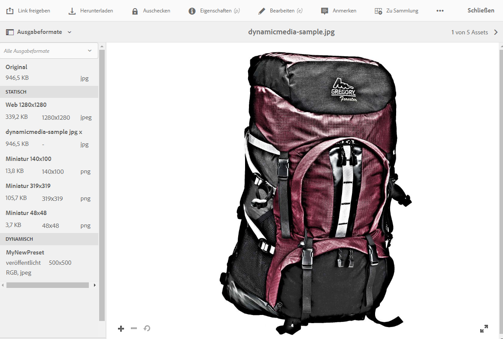
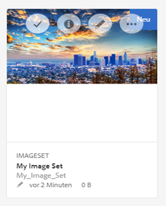

# Arbeiten mit Dynamic Media {#working-with-dynamic-media}

Mit [Dynamic Media](https://business.adobe.com/products/experience-manager/assets/dynamic-media.html) können Sie visuell ansprechende Merchandising- und Marketing-Assets nach Bedarf bereitstellen, die automatisch für die Anzeige auf Web- sowie Mobile- und Social-Media-Sites skaliert werden. Anhand eines Sets von Assets aus Primärquellen können Sie mit Dynamic Media mehrere Varianten ansprechender Inhalte in Echtzeit über das globale, skalierbare und leistungsoptimierte Netzwerk generieren und bereitstellen.

Dynamic Media bietet interaktive Anzeigeerlebnisse wie Zoom, 360-Grad-Rotationsset und Video. Dynamic Media verfügt über die Workflows der Adobe Experience Manager Digital Asset Management (Assets)-Lösung, um die digitale Kampagnenverwaltung zu vereinfachen und zu optimieren.

<!-- >[!NOTE]
>
>A Community article is available on [Working with Adobe Experience Manager and Dynamic Media](https://helpx.adobe.com/experience-manager/using/aem_dynamic_media.html). -->

## Einsatzmöglichkeiten für Dynamic Media     {#what-you-can-do-with-dynamic-media}

Mit Dynamic Media können Sie Assets vor ihrer Veröffentlichung verwalten. Eine ausführliche Beschreibung der allgemeinen Arbeit mit digitalen Assets finden Sie in [Arbeiten mit digitalen Assets](/help/assets/manage-digital-assets.md). Die allgemeinen Themen umfassen das Hochladen, Herunterladen, Bearbeiten und Veröffentlichen von Assets, das Anzeigen und Bearbeiten von Eigenschaften und die Suche nach Assets.

Funktionen, die nur für Dynamic Media vorgesehen sind:

* [Karussellbanner](carousel-banners.md)
* [Bild-Sets](image-sets.md)
* [Interaktive Bilder](interactive-images.md)
* [Interaktive Videos](interactive-videos.md)
* [Sets für gemischte Medien](mixed-media-sets.md)
* [Panoramabilder](panoramic-images.md)

* [Rotationssets](spin-sets.md)
* [Video](video.md)
* [Bereitstellen von Dynamic Media-Assets](delivering-dynamic-media-assets.md)
* [Verwalten von Assets](managing-assets.md)
* [Verwenden von Quick-Ansichten zum Erstellen eines benutzerdefinierten Popup-Windows®](custom-pop-ups.md)

Siehe auch [Einrichten dynamischer Medien](administering-dynamic-media.md).

<!-- 

OBSOLETE UNTIL INTEGRATING SCENE7 TOPIC GETS A MAJOR UPDATE
>[!NOTE]
>
>To understand the differences between using Dynamic Media and integrating Dynamic Media Classic with AEM, see [Dynamic Media Classic integration versus Dynamic Media](/help/sites-cloud/administering/integrating-scene7.md#aem-scene-integration-versus-dynamic-media).

-->

## Aktivierte und deaktivierte Dynamic Media-Funktion im Vergleich {#dynamic-media-on-versus-dynamic-media-off}

Anhand der folgenden Merkmale können Sie erkennen, ob Dynamic Media aktiviert ist:

* Dynamische Ausgabeformate sind beim Herunterladen oder Anzeigen von Assets in der Vorschau verfügbar.
* Bild-Sets, Rotations-Sets und Sets für gemischte Medien sind verfügbar.
* PTIFF-Ausgabeformate werden erstellt.

Wenn Sie auf ein Bild-Asset klicken, sieht die Ansicht des Assets mit aktivierter Dynamic Media-Funktion anders aus. Dynamic Media nutzt die On-Demand-HTML5-Viewer.

### Dynamische Ausgabeformate {#dynamic-renditions}

Dynamische Ausgabeformate wie Bild- und Viewer-Vorgaben (unter **[!UICONTROL Dynamisch]**) sind verfügbar, wenn Dynamic Media aktiviert ist.

### Bild-Sets, Rotations-Sets und Sets für gemischte Medien {#image-sets-spins-sets-mixed-media-sets}

Bild-Sets, Rotations-Sets und Sets für gemischte Medien sind verfügbar, wenn Dynamic Media aktiviert ist.

### PTIFF-Ausgabeformate {#ptiff-renditions}

Zu den für Dynamic Media aktivierten Assets zählen `pyramid.tiffs`.

### Änderung der Asset-Ansichten {#asset-views-change}

Wenn Dynamic Media aktiviert ist, können Sie ein- und auszoomen, indem Sie auf die Schaltflächen `+` und `-` klicken. Sie können auch auf klicken/tippen, um in einen bestimmten Bereich zu zoomen. Mit &quot;Zurück&quot;gelangen Sie zur Originalversion und Sie können das Bild im Vollbildmodus anzeigen, indem Sie auf die diagonalen Pfeile klicken. Dynamic Media aktiviert wird wie folgt angezeigt:

Wenn Dynamic Media deaktiviert ist, können Sie die Ansicht vergrößern und verkleinern und die Originalgröße wiederherstellen:

