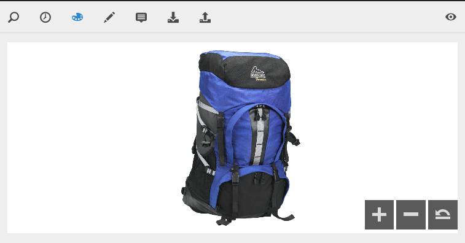

# Arbeiten mit Dynamic Media  {#working-with-dynamic-media}

Mit [Dynamic Media](https://business.adobe.com/de/products/experience-manager/assets/dynamic-media.html) können Sie visuell ansprechende Merchandising- und Marketing-Assets nach Bedarf bereitstellen, die automatisch für die Anzeige auf Web- sowie Mobile- und Social-Media-Sites skaliert werden. Anhand eines Sets von Assets aus Primärquellen können Sie mit Dynamic Media mehrere Varianten ansprechender Inhalte in Echtzeit über das globale, skalierbare und leistungsoptimierte Netzwerk generieren und bereitstellen.

Dynamic Media ermöglicht interaktive Anzeigeerlebnisse wie Zoom, Drehen um 360 Grad und Videos. Dynamic Media bindet die Workflows der Adobe Experience Manager-Lösung für Digital Asset Management (DAM, Verwaltung digitaler Assets) auf einzigartige Weise ein, um das Management digitaler Kampagnen zu vereinfachen und zu optimieren.

<!-- >[!NOTE]
>
>A Community article is available on [Working with Adobe Experience Manager and Dynamic Media](https://helpx.adobe.com/experience-manager/using/aem_dynamic_media.html). -->

## Was ist Dynamic Media?

Dynamic Media in Adobe Experience Manager (AEM) as a Cloud Service ist eine leistungsstarke Lösung, mit der Sie Rich-Media-Assets wie Bilder und Videos auf verschiedenen digitalen Plattformen verwalten, bereitstellen und optimieren können. Sie wandelt statische Medien in dynamische, ansprechende Erlebnisse um, indem sie Echtzeitänderungen ermöglichen, z. B. Größenanpassung, Zuschneiden und Anpassen der Qualität entsprechend dem Gerät oder der Bildschirmgröße des Benutzers. Mit Dynamic Media passen sich Ihre Assets automatisch an, um das beste visuelle Erlebnis zu bieten, unabhängig davon, ob sich Benutzer auf einem Desktop, einem Mobilgerät oder Tablet befinden.

Ein großer Vorteil von Dynamic Media besteht darin, dass die Medienverwaltung optimiert werden kann. Sie müssen nicht mehrere Versionen von Bildern oder Videos erstellen - Dynamic Media übernimmt alles, indem es für jede Situation das passende Format bereitstellt. E-Commerce-Unternehmen können beispielsweise 360-Grad-Produktansichten oder Zoombilder nutzen, um interaktive Erlebnisse zu erstellen, während inhaltslastige Websites schnelles und hochwertiges Video-Streaming gewährleisten können. Dies führt zu schnelleren Ladezeiten und ansprechenderen Benutzererlebnissen, was letztendlich zu höherer Kundenzufriedenheit und besseren Konversionsraten führt.

Dynamic Media lässt sich nahtlos in Ihr DAM-System (Digital Asset Management) in AEM integrieren und bietet Ihnen eine Plattform zum Speichern, Organisieren und Bereitstellen Ihrer Medien. Dieser zentralisierte Ansatz vereinfacht die Teamzusammenarbeit und bietet Echtzeiteinblicke in die Asset-Leistung. Unabhängig davon, ob Sie sich auf die Bereitstellung attraktiver Visualisierungen oder die Verbesserung mediengesteuerter Benutzerinteraktionen konzentrieren, hilft Dynamic Media bei der Optimierung Ihrer Inhalte für jeden Kanal und macht sie zu einem wichtigen Werkzeug für Unternehmen, die ihre digitale Präsenz steigern möchten.

## Einsatzmöglichkeiten für Dynamic Media {#what-you-can-do-with-dynamic-media}

Mit Dynamic Media können Sie Assets vor ihrer Veröffentlichung verwalten. Eine ausführliche Beschreibung der allgemeinen Arbeit mit digitalen Assets finden Sie in [Arbeiten mit digitalen Assets](/help/assets/manage-digital-assets.md). Die allgemeinen Themen umfassen das Hochladen, Herunterladen, Bearbeiten und Veröffentlichen von Assets, das Anzeigen und Bearbeiten von Eigenschaften und die Suche nach Assets.

Funktionen, die nur für Dynamic Media vorgesehen sind:

* [Karussellbanner](carousel-banners.md)
* [Bildsets](image-sets.md)
* [Interaktive Bilder](interactive-images.md)
* [Interaktive Videos](interactive-videos.md)
* [Gemischte Mediensets](mixed-media-sets.md)
* [Panoramabilder](panoramic-images.md)
* [Rotationssets](spin-sets.md)
* [Video](video.md)
* [Bereitstellen von Dynamic Media-Assets](delivering-dynamic-media-assets.md)
* [Verwalten von Assets](managing-assets.md)
* [Verwenden von Schnellansichten zum Erstellen benutzerdefinierter Popup-Fenster](custom-pop-ups.md)

Siehe auch [Einrichten von Dynamic Media](administering-dynamic-media.md).

<!-- 

OBSOLETE UNTIL INTEGRATING SCENE7 TOPIC GETS A MAJOR UPDATE
>[!NOTE]
>
>To understand the differences between using Dynamic Media and integrating Dynamic Media Classic with AEM, see [Dynamic Media Classic integration versus Dynamic Media](/help/sites-cloud/administering/integrating-scene7.md#aem-scene-integration-versus-dynamic-media).

-->

## Aktivierte und deaktivierte Dynamic Media-Funktion im Vergleich {#dynamic-media-on-versus-dynamic-media-off}

Anhand der folgenden Merkmale können Sie erkennen, ob Dynamic Media aktiviert ist:

* Dynamische Ausgabedarstellungen sind beim Herunterladen oder Anzeigen von Assets in der Vorschau verfügbar.
* Bildsets, Rotationssets und Sets für gemischte Medien sind verfügbar.
* PTIFF-Ausgabedarstellungen werden erstellt.

Wenn Sie auf ein Bild-Asset klicken, sieht die Ansicht des Assets mit aktivierter Dynamic Media-Funktion anders aus. Dynamic Media nutzt die On-Demand-HTML5-Viewer.

### Dynamische Ausgabedarstellungen {#dynamic-renditions}

Dynamische Ausgabedarstellungen wie Bild- und Viewer-Vorgaben (unter **[!UICONTROL Dynamisch]**) sind verfügbar, wenn Dynamic Media aktiviert ist.

### Dynamic Media-Bildsets, Rotationssets, Sets für gemischte Medien {#image-sets-spins-sets-mixed-media-sets}

Bildsets, Rotationssets und Sets für gemischte Medien sind verfügbar, wenn Dynamic Media aktiviert ist.

### Dynamic Media-fähige PTIFF-Ausgabeformate {#ptiff-renditions}

Für Dynamic Media aktivierte Assets enthalten `pyramid.tiffs`.

### Änderung der Dynamic Media-Asset-Ansichten {#asset-views-change}

Wenn „Dynamische Medien“ aktiviert ist, können Sie durch Klicken auf die Schaltflächen `+` und `-` ein- bzw. auszoomen. Sie können auch durch Auswählen in einen bestimmten Bereich einzoomen. Durch „Wiederherstellen“ können Sie zur Originalansicht zurückkehren und durch Klicken auf die diagonalen Pfeile das Bild im Vollbildmodus anzeigen. Das aktivierte Dynamic Media sieht wie folgt aus:

Wenn Dynamic Media deaktiviert ist, können Sie die Ansicht vergrößern und verkleinern und die Originalgröße wiederherstellen:

