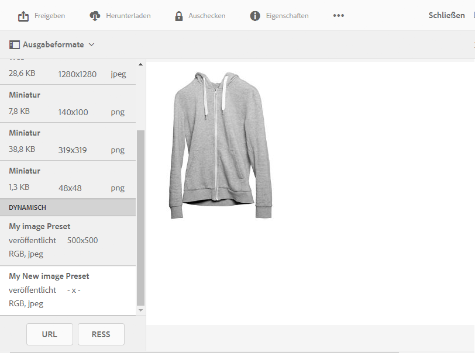

# Anwenden von Dynamic Media-Bildvorgaben {#applying-image-presets}

<table>
    <tr>
        <td>
            <i>Neu</i> <a href="/help/assets/dynamic-media/dm-prime-ultimate.md"><b>Dynamic Media Prime und Ultimate</b></a>
        </td>
        <td>
            <i>Neu</i> <a href="/help/assets/assets-ultimate-overview.md"><b>AEM Assets Ultimate</b></a>
        </td>
        <td>
            <i>Neu</i> <a href="/help/assets/integrate-aem-assets-edge-delivery-services.md"><b>AEM Assets-Integration mit Edge Delivery Services</b></a>
        </td>
        <td>
            <i>Neu</i> <a href="/help/assets/aem-assets-view-ui-extensibility.md"><b>Erweiterbarkeit der Benutzeroberfläche</b></a>
        </td>
          <td>
            <i>Neu</i> <a href="/help/assets/dynamic-media/enable-dynamic-media-prime-and-ultimate.md"><b>Aktivieren von Dynamic Media Prime und Ultimate</b></a>
        </td>
    </tr>
    <tr>
        <td>
            <a href="/help/assets/search-best-practices.md"><b>Best Practices für die Suche</b></a>
        </td>
        <td>
            <a href="/help/assets/metadata-best-practices.md"><b>Best Practices für Metadaten</b></a>
        </td>
        <td>
            <a href="/help/assets/product-overview.md"><b>Content Hub</b></a>
        </td>
        <td>
            <a href="/help/assets/dynamic-media-open-apis-overview.md"><b>Dynamic Media mit OpenAPI-Funktionen</b></a>
        </td>
        <td>
            <a href="https://developer.adobe.com/experience-cloud/experience-manager-apis/"><b>Entwicklerdokumentation zu AEM Assets</b></a>
        </td>
    </tr>
</table>

Anhand von Bildvorgaben kann Assets Bilder mit unterschiedlichen Größen, Formaten oder Bildeigenschaften dynamisch bereitstellen. Sie können beim Exportieren eine Vorgabe wählen, um Bilder nach den Spezifikationen umzuformatieren, die Ihr Administrator festgelegt hat.

Darüber hinaus können Sie eine responsive Bildvorgabe auswählen (nach der Auswahl durch die Schaltfläche **[!UICONTROL RESS]** gekennzeichnet).

[Administratoren können Bildvorgaben erstellen und konfigurieren](managing-image-presets.md).

>[!NOTE]
>
>Die intelligente Bildbearbeitung funktioniert mit Ihren vorhandenen Bildvorgaben. Sie nutzt die intelligenten Funktionen ganz zum Schluss, um die Größe der Bilddatei abhängig vom Browser oder der Geschwindigkeit der Netzverbindung noch weiter zu verringern. Weitere Informationen finden Sie unter [Intelligente Bildbearbeitung](imaging-faq.md).

Sie können jederzeit bei der Vorschau eines Bildes eine Bildvorgabe darauf anwenden.

**So wenden Sie Dynamic Media-Bildvorgaben an:**

1. Öffnen Sie das Asset und klicken Sie in der linken Leiste auf die Dropdown-Liste und w#hlen Sie anschließend **[!UICONTROL Ausgabeformate]** aus.

   >[!NOTE]
   >
   >* Statische Ausgabedarstellungen werden in der oberen Hälfte angezeigt. Dynamische Ausgabedarstellungen werden in der unteren Hälfte angezeigt. Bei dynamischen Ausgabedarstellungen (und nur bei diesen) können Sie das Bild mit der URL anzeigen. Die Schaltfläche **[!UICONTROL URL]** wird nur angezeigt, wenn Sie eine dynamische Ausgabedarstellung auswählen. Die Schaltfläche **[!UICONTROL RESS]** wird nur angezeigt, wenn Sie eine responsive Bildvorgabe auswählen.
   >
   >* Das System zeigt mehrere Ausgabedarstellungen, wenn Sie **[!UICONTROL Ausgabedarstellungen]** in der Detailansicht eines Assets auswählen. Sie können die Anzahl der angezeigten Vorgaben erhöhen. Siehe [Erhöhung der Anzahl der angezeigten Bildvorgaben](managing-image-presets.md#increasing-or-decreasing-the-number-of-image-presets-that-display).

   

1. Führen Sie einen der folgenden Schritte aus:

   * Um eine Vorschau der Bildvorgabe anzuzeigen, wählen Sie ein dynamisches Ausgabeformat aus.
   * Um das Popupfenster anzuzeigen, wählen Sie **[!UICONTROL URL]**, **[!UICONTROL Einbetten]** oder **[!UICONTROL RESS]**.

   >[!NOTE]
   >
   >Wenn das Asset *und* die Bildvorgabe noch nicht veröffentlicht wurden, ist die Schaltfläche **[!UICONTROL URL]** (bzw. die Schaltflächen „URL“ und „RESS“, falls zutreffend) nicht verfügbar.
   >
   >Beachten Sie auch, dass Bildvorgaben automatisch auf einem S7-Server für Dynamic Media veröffentlicht werden.
