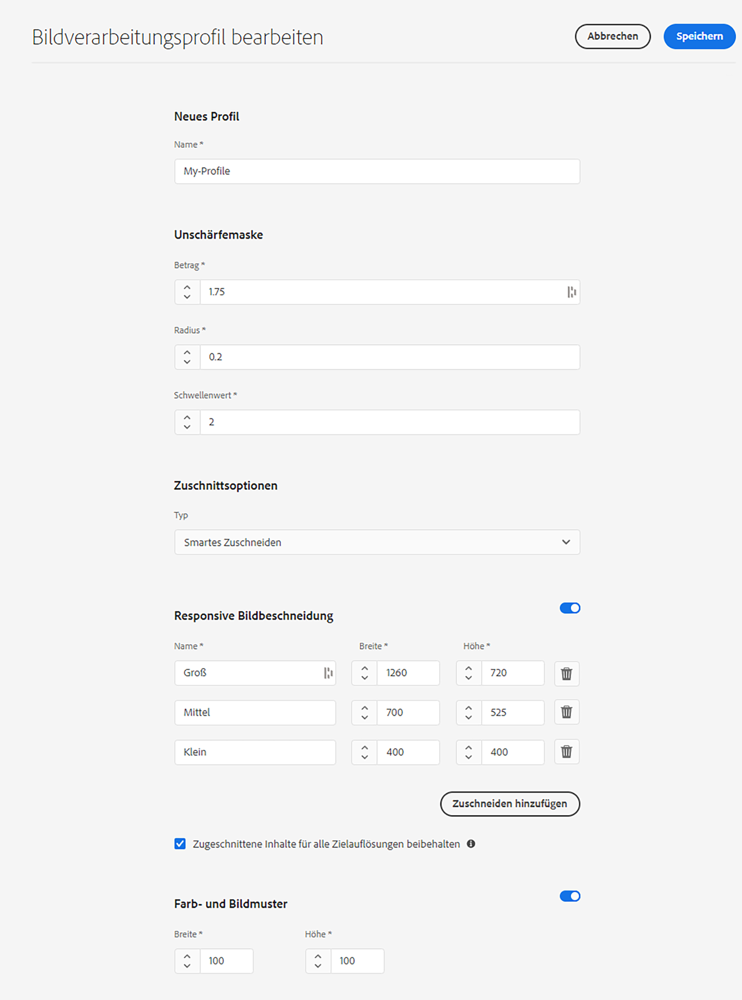
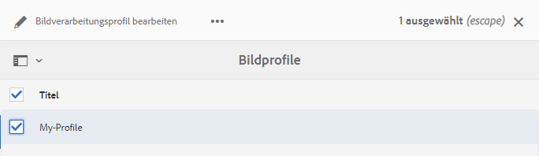
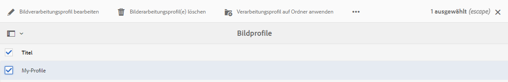
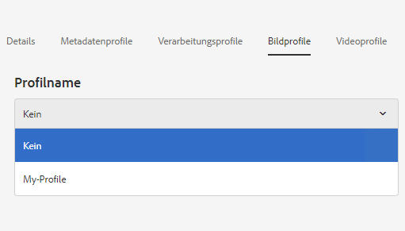
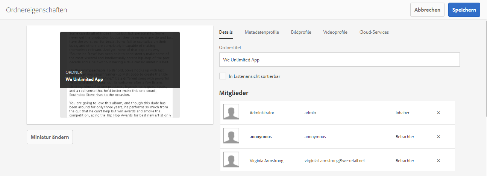
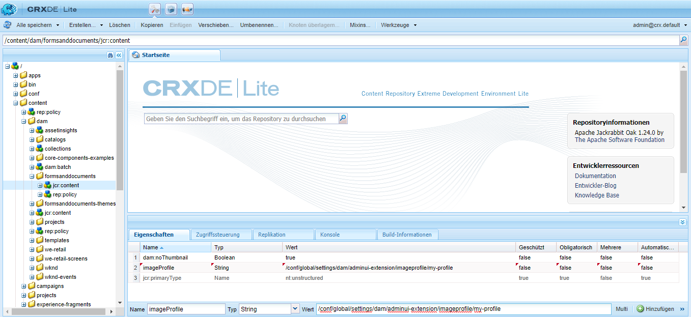
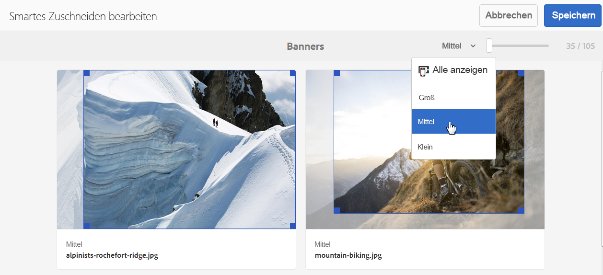
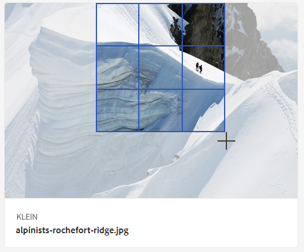
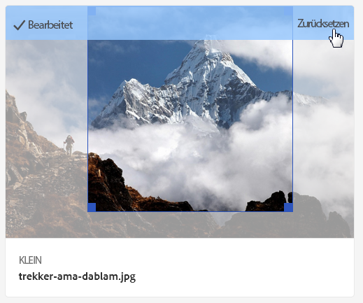

# Dynamic Media-Bildprofile {#image-profiles}

Wenn Sie Bilder hochladen, können Sie das Bild nach dem Hochladen automatisch zuschneiden, indem Sie ein neues Bildprofil auf den Ordner anwenden.

>[!IMPORTANT]
>
>Bildprofile können nicht auf PDF-, animierte GIF- oder INDD-Dateien (Adobe InDesign) angewendet werden.

## Optionen für das Zuschneiden {#crop-options}

<!-- CQDOC-16069 for the paragraph directly below -->

Die Koordinaten für das smarte Zuschneiden hängen vom Seitenverhältnis ab. Wenn bei den Einstellungen für intelligente Beschneidung in einem Image-Profil das Seitenverhältnis für die hinzugefügten Dimensionen im Image-Profil gleich ist, wird dasselbe Seitenverhältnis an Dynamic Media gesendet. Adobe empfiehlt, denselben Anbaubereich zu verwenden. Dadurch wird sichergestellt, dass sich die verschiedenen im Image-Profil verwendeten Dimensionen nicht ändern.

Für jede von Ihnen erstellte Smart-Zuschneidegeneration ist eine zusätzliche Verarbeitung erforderlich. Wenn Sie z. B. mehr als fünf Seitenverhältnisse für die intelligente Zuschneidung hinzufügen, wird die Asset-Erfassungsrate verlangsamt. Es kann auch zu einer erhöhten Belastung der Systeme führen. Da Sie smartes Zuschneiden auf Ordnerebene anwenden können, empfiehlt Adobe, es *nur* dort anzuwenden, wo es benötigt werden.

Es stehen zwei Optionen zum Beschneiden zur Auswahl. Außerdem können Sie die Erstellung von Farb- und Bildfeldern automatisieren.

<table>
 <tbody>
  <tr>
   <td><strong>Option</strong></td>
   <td><strong>Wann ist sie einzusetzen?</strong></td>
   <td><strong>Beschreibung</strong></td>
  </tr>
  <tr>
   <td>Pixelzuschnitt</td>
   <td>Nur Massenzuschnitt von Bildern basierend auf Dimensionen.</td>
   <td>
Um diese Option zu verwenden, wählen Sie aus dem Dropdownmenü „Zuschnittsoptionen“ <strong>Pixelzuschnitt</strong> aus.
 
Um die Seiten eines Bildes zu beschneiden, geben Sie die Anzahl der Pixel ein, die von einer oder von allen Seiten des Bildes abgeschnitten werden sollen. Um wie viel das Bild beschnitten wird, hängt von der ppi-Einstellung (Pixel per Inch; Pixel pro Zoll) in der Bilddatei ab.
 
Ein Bildprofil-Pixelzuschnitt wird wie folgt gerendert:  

    <ul>
     <li>Werte: oben, unten, links und rechts.</li>
     <li>Oben links wird als 0,0 und die Pixelabnahme von dort berechnet.</li>
     <li>Startpunkt des Zuschnitts: Links ist X und oben ist Y</li>
     <li>Horizontale Berechnung: Horizontale Pixelabmessungen des Originalbilds abzüglich des Werts für links und dann abzüglich des Werts für rechts.</li>
     <li>Vertikale Berechnung: Die vertikale Pixelhöhe abzüglich des Werts für oben und dann abzüglich des Werts für unten.</li>
    </ul> 
Beispiel: Sie haben ein Bild in der Größe 4000 x 3000 Pixel. Sie verwenden folgende Werte: Oben = 250, Unten = 500, Links = 300, Rechts = 700.
 
Von oben links (300.250) Ernte unter Verwendung der Füllfläche von (4000-300-700, 3000-250-500 oder 3000.2250).
 </td>
  </tr>
  <tr>
   <td>Smartes Zuschneiden</td>
   <td>Massenzuschnitt von Bildern basierend auf ihrem visuellen Fokus.</td>
   <td>
Smartes Zuschneiden nutzt die Möglichkeiten künstlicher Intelligenz in Adobe Sensei, um den Massenzuschnitt von Bildern schnell zu automatisieren. Smartes Zuschneiden erkennt automatisch den Fokus in jedem Bild und schneidet es entsprechend zu, um das Bildmotiv richtig zu erfassen – unabhängig von der Bildschirmgröße.
 
Um smartes Zuschneiden zu verwenden, wählen Sie aus der Dropdown-Liste „Zuschnittsoptionen“ die Option <strong>Smartes Zuschneiden</strong> aus und aktivieren Sie „Responsive Bildbeschneidung“.
 
Die Standardgrößen für Haltepunkte (Groß, Mittel, Klein) decken alle Größen ab, die die meisten Bilder auf Mobilgeräten, Tablets, Desktops und Bannern verwenden. Sie können die Standardnamen „Groß“, „Mittel“ und „Klein“ beliebig anpassen.
 
Um weitere Breakpoints hinzuzufügen, klicken Sie auf <strong>Zuschnitt hinzufügen</strong>. Wenn Sie einen Zuschnitt löschen möchten, klicken Sie auf das Papierkorb-Symbol.
 </td>
  </tr>
  <tr>
   <td>Farb- und Bildmuster</td>
   <td>"Bulk"generiert für jedes Bild ein Bildfeld.</td>
   <td>
<strong>Hinweis:</strong> Smarte Muster werden in Dynamic Media Classic nicht unterstützt.
 
Erkennen und generieren Sie automatisch hochwertige Bildmuster aus Produktbildern, die Farbe oder Material zeigen.
 
Um Farbe und Bildfeld zu verwenden, wählen Sie <strong>Smart-Zuschneiden</strong> aus der Dropdown-Liste "Beschneidungsoptionen"aus. Aktivieren Sie dann rechts neben "Farbe und Bildfeld"die Funktion (aktivieren). Geben Sie in den Feldern „Breite“ und „Höhe“ einen Pixelwert an.
 
Zwar sind alle Bildzuschnitte über die Leiste „Ausgabedarstellungen“ verfügbar, jedoch können Farb- und Bildmuster nur über die Funktion „URL kopieren“ verwendet werden. Verwenden Sie Ihre eigene Ansichtskomponente, um das Farbfeld auf Ihrer Site zu rendern. Die Ausnahme von dieser Regel sind Karussellbanner. Dynamic Media bietet die Anzeigekomponente für in entsprechenden Bannern verwendete Farb-/Bildmuster.
 
<strong>Verwendung von Bildmustern</strong>
 
Die URL für Bildmuster ist einfach:
 
<code>/is/image/company/&lt;asset_name&gt;:Swatch</code>
 
Dabei wird <code>:Swatch</code> an die Asset-Anforderung angehängt.
 
<strong>Verwendung von Farbmustern</strong>
 
Um Farbmuster zu verwenden, stellen Sie wie folgt eine <code>req=userdata</code>-Anfrage:
 
<code>/is/image/&lt;company_name&gt;/&lt;swatch_asset_name&gt;:Swatch?req=userdata</code>
 
Folgendes ist beispielsweise ein Farbmuster-Asset in Dynamic Media Classic:
 
<code>https://my.company.com:8080/is/image/DemoCo/Sleek:Swatch</code>
 
Und hier ist die entsprechende URL des Musterassets <code>req=userdata</code>:
 
<code>https://my.company.com:8080/is/image/DemoCo/Sleek:Swatch?req=userdata</code>
 
Die <code>req=userdata</code>-Antwort sieht wie folgt aus:
 
<code class="code">SmartCropDef=Swatch
       SmartCropHeight=200.0
       SmartCropRect=0.421671,0.389815,0.0848564,0.0592593,200,200
       SmartCropType=Swatch
       SmartCropWidth=200.0
       SmartSwatchColor=0xA56DB2</code>
 
Sie können wie in den folgenden URL-Beispielen auch eine <code>req=userdata</code>-Antwort im XML- oder JSON-Format anfordern:
 
<code>https://my.company.com:8080/is/image/DemoCo/Sleek:Swatch?req=userdata,xml</code>

<code>SmartSwatchColor</code>

</td></tr></tbody></table>

## Unschärfemaske {#unsharp-mask}

Mit **[!UICONTROL Unscharf maskieren]** können Sie einen Scharfzeichnungsfiltereffekt für das endgültige heruntergesampelte Bild optimieren. Sie können die Intensität des Effekts, den Radius des Effekts (gemessen in Pixel) und einen Schwellenwert für den Kontrast festlegen, der ignoriert wird. Dieser Effekt verwendet dieselben Optionen wie der Adobe Photoshop-Filter „Unscharf maskieren“.

>[!NOTE]
>
>Die Unschärfemaske wird nur auf herunterskalierte Ausgabedarstellungen im PTIFF (Pyramiden-TIFF) angewendet, die mehr als 50 % heruntergesampelt sind. Das bedeutet, dass die großformatigen Darstellungen innerhalb des Titels nicht von einer Unschärfemaske betroffen sind. Dagegen werden kleinere Darstellungen wie Miniaturansichten geändert (und zeigen die unscharfe Maske an).

In **[!UICONTROL Unschärfemaske]** sind die folgenden Filteroptionen verfügbar:

<table>
 <tbody>
  <tr>
   <td><strong>Option</strong></td>
   <td><strong>Beschreibung</strong></td>
  </tr>
  <tr>
   <td>Stärke</td>
   <td>Steuert den auf die Kantenpixel angewendeten Kontrastwert. Der Standardwert ist 1,75. Bei hochauflösenden Bildern können Sie ihn auf bis zu 5 erhöhen. Der Wert dient hierbei als ein Maß für die Filterintensität. Bereich: 0-5.</td>
  </tr>
  <tr>
   <td>Radius</td>
   <td>Bestimmt die Anzahl der Pixel um die Kantenpixel, auf die sich die Scharfzeichnung auswirkt. Bei hochauflösenden Bildern geben Sie einen Wert zwischen 1 und 2 ein. Bei einem niedrigen Wert werden lediglich die Kantenpixel scharfgezeichnet, bei einem hohen Wert werden mehr Pixel scharfgezeichnet. Der korrekte Wert hängt von der Bildgröße ab. Der Standardwert ist 0,2.  Bereich: 0-250.</td>
  </tr>
  <tr>
   <td>Schwelle</td>
   <td>
Bestimmt den Kontrastbereich, der bei der Anwendung des Filters „Unschärfemaske“ ignoriert werden soll. In anderen Worten: Die Option bestimmt, wie stark sich die scharfgezeichneten Pixel vom Umgebungsbereich unterscheiden müssen, damit sie als Kantenpixel eingestuft und scharfgezeichnet werden. Um Rauschen zu vermeiden, experimentieren Sie mit Werten zwischen 0 und 255.
 </td>
  </tr>
 </tbody>
</table>

Das Scharfzeichnen wird im Thema über das [Scharfzeichnen von Bildern](/help/assets/dynamic-media/assets/sharpening_images.pdf) beschrieben.

## Erstellen von Dynamic Media-Bildprofilen {#creating-image-profiles}

Informationen zur Definition von erweiterten Verarbeitungsparametern für andere Asset-Typen finden Sie unter [Konfigurieren der Asset-Verarbeitung](config-dm.md#configuring-asset-processing).

Siehe [Informationen zu Dynamic Media – Bildprofile und Videoprofile](/help/assets/dynamic-media/about-image-video-profiles.md).

Informationen hierzu finden Sie auch im Thema über die [Best Practices für die Organisation Ihrer digitalen Assets zur Verwendung von Verarbeitungsprofilen](/help/assets/dynamic-media/best-practices-for-file-management.md).

**So erstellen Sie Bildprofile für Dynamic Media**:

1. Tippen Sie auf das AEM-Logo und navigieren Sie zu **[!UICONTROL Tools > Assets > Bildprofile]**.
1. Um ein Image-Profil hinzuzufügen, tippen Sie auf **[!UICONTROL Erstellen]**.
1. Geben Sie einen Profilnamen und Werte für Unschärfemasken, Zuschneiden oder Farb-/Bildmuster (oder beides) an.

   Tipp: Verwenden Sie einen für den Verwendungszweck spezifischen Profil. Angenommen, Sie möchten ein Profil erstellen, das nur Farbfelder generiert. Das heißt, &quot;Smart-Zuschneiden&quot;ist deaktiviert (deaktiviert) und &quot;Farbe und Bildfeld&quot;ist aktiviert (aktiviert). In solchen Fällen können Sie den Profil &quot;Smart-Farbfelder&quot;verwenden.

   Siehe auch Optionen für [Smartes Zuschneiden und smarte Farb-/Bildmuster](#crop-options) sowie [Unscharf maskieren](#unsharp-mask).

   

1. Tippen Sie auf **[!UICONTROL Speichern]**. Das neu erstellte Profil wird in der Liste der verfügbaren Profile angezeigt.

## Bearbeiten oder Löschen von Bildprofilen für Dynamic Media {#editing-or-deleting-image-profiles}

1. Tippen Sie auf das AEM-Logo und navigieren Sie zu **[!UICONTROL Tools > Assets > Bildprofile]**.
1. Wählen Sie das Bildprofil aus, das Sie bearbeiten oder entfernen möchten. Um es zu bearbeiten, wählen Sie **[!UICONTROL Bildverarbeitungsprofil bearbeiten]**. Wählen Sie **[!UICONTROL Bildverarbeitungsprofil löschen]** aus, um es zu entfernen.

   

1. Wenn Sie das Profil bearbeitet haben, speichern Sie die Änderungen. Wenn Sie das Profil löschen, bestätigen Sie, dass Sie es entfernen möchten.

## Anwenden eines Dynamic Media-Bildprofils auf Ordner {#applying-an-image-profile-to-folders}

Wenn Sie einem Ordner ein Image-Profil zuweisen, übernehmen alle Unterordner automatisch das Profil aus dem übergeordneten Ordner. Daher können Sie einem Profil nur ein Bild zuweisen. Daher sollten Sie die Ordnerstruktur sorgfältig planen, in der Sie Assets hochladen, speichern, verwenden und archivieren.

Wenn Sie einem Ordner ein anderes Bildprofil zugewiesen haben, überschreibt das neue das vorherige Profil. Die zuvor vorhandenen Ordner-Assets verbleiben unverändert. Das neue Profil wird auf die Assets angewendet, die dem Ordner später hinzugefügt werden.

Ordner, denen ein Profil zugewiesen ist, werden in der Benutzeroberfläche mit dem Namen des Profils auf der Karte angezeigt.

<!-- When you add smart crop to an existing Image Profile, you need to re-trigger the [DAM Update Asset workflow](assets-workflow.md) if you want to generate crops for existing assets in your asset repository. -->

Sie können Bildprofile auf bestimmte Ordner oder global auf alle Assets anwenden.

Sie können Assets in einem Ordner erneut verarbeiten, der bereits über ein vorhandenes Bildprofil verfügt, das Sie nachträglich geändert haben. Informationen hierzu finden Sie unter [Erneutes Verarbeiten von Assets in einem Ordner nach Bearbeitung des zugehörigen Verarbeitungsprofils](/help/assets/dynamic-media/about-image-video-profiles.md#reprocessing-assets).

### Anwenden von Dynamic Media-Bildprofilen auf bestimmte Ordner {#applying-image-profiles-to-specific-folders}

Sie können im Menü **[!UICONTROL Tools]** oder, wenn Sie sich im Ordner befinden, über **[!UICONTROL Eigenschaften]** ein Bildprofil auf einen Ordner anwenden.

Ordner, denen bereits ein Profil zugewiesen ist, werden durch die Anzeige des Profilnamens direkt unter dem Ordnernamen gekennzeichnet.

Sie können Assets in einem Ordner erneut verarbeiten, der bereits über ein vorhandenes Videoprofil verfügt, das Sie nachträglich geändert haben. Informationen hierzu finden Sie unter [Erneutes Verarbeiten von Assets in einem Ordner nach Bearbeitung des zugehörigen Verarbeitungsprofils](/help/assets/dynamic-media/about-image-video-profiles.md#reprocessing-assets).

#### Anwenden von Dynamic Media-Bildprofilen auf Ordner über die Benutzeroberfläche „Profile“ {#applying-image-profiles-to-folders-from-profiles-user-interface}

1. Tippen Sie auf das AEM-Logo und navigieren Sie zu **[!UICONTROL Tools > Assets > Bildprofile]**.
1. Wählen Sie ein Bildprofil aus, das Sie auf einen oder mehrere Ordner anwenden möchten.

   

1. Tippen Sie auf **[!UICONTROL Verarbeitendes Profil auf Ordner]** anwenden und wählen Sie den Ordner bzw. mehrere Ordner aus, die Sie zum Empfangen der neu hochgeladenen Assets verwenden möchten, und tippen/klicken Sie auf **[!UICONTROL Anwenden]**. Ordner, denen bereits ein Profil zugewiesen ist, werden durch die Anzeige des Profilnamens direkt unter dem Ordnernamen gekennzeichnet.

#### Anwenden von Dynamic Media-Bildprofilen auf Ordner über „Eigenschaften“ {#applying-image-profiles-to-folders-from-properties}

1. Tippen Sie auf das AEM-Logo und navigieren Sie zu **[!UICONTROL Assets]** und dann zu dem Ordner, auf den Sie ein Bildprofil anwenden möchten.
1. Tippen Sie im Ordner auf das Kontrollkästchen, um es zu aktivieren, und tippen Sie anschließend auf **[!UICONTROL Eigenschaften]**.
1. Tippen Sie auf die Registerkarte **[!UICONTROL Bildprofile]**. Wählen Sie in der Dropdown-Liste **[!UICONTROL Profilname]** das gewünschte Profil aus und klicken Sie auf **[!UICONTROL Speichern und schließen]**. Ordner, denen bereits ein Profil zugewiesen ist, werden durch die Anzeige des Profilnamens direkt unter dem Ordnernamen gekennzeichnet.

   

### Globales Anwenden eines Dynamic Media Image-Profils {#applying-an-image-profile-globally}

Sie können ein Profil nicht nur auf einen Ordner anwenden, sondern auch global anwenden. Auf alle Inhalte, die in Experience Manager Assets in einem beliebigen Ordner hochgeladen werden, wird das ausgewählte Profil angewendet.

Sie können Assets in einem Ordner erneut verarbeiten, der bereits über ein vorhandenes Videoprofil verfügt, das Sie nachträglich geändert haben. Informationen hierzu finden Sie unter [Erneutes Verarbeiten von Assets in einem Ordner nach Bearbeitung des zugehörigen Verarbeitungsprofils](/help/assets/dynamic-media/about-image-video-profiles.md#reprocessing-assets).

**So wenden Sie ein Dynamic Media Image-Profil global** an

1. Führen Sie einen der folgenden Schritte aus:

   * Navigieren Sie zu `https://&lt;AEM server&gt;/mnt/overlay/dam/gui/content/assets/foldersharewizard.html/content/dam` und wenden Sie das entsprechende Profil an und klicken Sie auf **[!UICONTROL Speichern]**.

      

   * Navigieren Sie in CRXDE Lite zum folgenden Knoten: `/content/dam/jcr:content`.

      Fügen Sie die Eigenschaft `imageProfile:/conf/global/settings/dam/adminui-extension/imageprofile/<name of image profile>` hinzu und tippen Sie auf **[!UICONTROL Alle speichern]**.

      

## Bearbeiten von smarten Zuschnitten oder smarten Farb-/Bildmustern eines einzelnen Bildes {#editing-the-smart-crop-or-smart-swatch-of-a-single-image}

Sie können das Zuschnittsfenster eines Bildes manuell neu ausrichten oder die Größe ändern, um den Fokus präziser zu bestimmen.

Nachdem Sie einen smarten Zuschnitt bearbeitet und gespeichert haben, wird die Änderung überall dort angewendet, wo Sie den Zuschnitt für bestimmte Bilder verwenden.

Sie können die intelligente Beschneidung erneut ausführen, um bei Bedarf weitere Ernten zu generieren.

Siehe auch [Bearbeiten von smarten Zuschnitten oder smarten Farb-/Bildmustern mehrerer Bilder](#editing-the-smart-crop-or-smart-swatch-of-multiple-images).

**So bearbeiten Sie smarte Zuschnitte oder smarte Farb-/Bildmuster eines einzelnen Bildes**

1. Tippen Sie auf das AEM-Logo und navigieren Sie zu **[!UICONTROL Assets]** und dann zu dem Ordner, auf den das Bildprofil „Smartes Zuschneiden“ oder „Smartes Farb-/Bildmuster“ angewendet wurde.

1. Um den Inhalt zu öffnen, tippen Sie auf den Ordner.
1. Tippen Sie auf das Bild, dessen smarten Zuschnitt oder smartes Farb-/Bildmuster Sie anpassen möchten.
1. Tippen Sie in der Symbolleiste auf **[!UICONTROL Smartes Zuschneiden]**.

1. Führen Sie einen der folgenden Schritte aus:

   * Ziehen Sie den Schieberegler in der oberen rechten Ecke der Seite nach links oder rechts, um die Bildanzeige zu erweitern oder zu reduzieren.
   * Ziehen Sie im Bild eine Ecke, um die Größe des sichtbaren Bereichs des Zuschnitts oder Farb-/Bildmusters anzupassen.
   * Ziehen Sie das Feld bzw. Farb-/Bildmuster im Bild an eine neue Position. Sie können nur Bildmuster bearbeiten. Farbmuster sind statisch.
   * Tippen Sie über dem Bild auf **[!UICONTROL Wiederherstellen]**, um all Ihre Änderungen rückgängig zu machen und den ursprünglichen Zuschnitt bzw. das Farb-/Bildmuster wiederherzustellen.
   * Verwenden Sie die Pfeiltasten, um die Rahmengröße zu beschneiden oder das Bild neu zu positionieren.

1. Tippen Sie in der oberen rechten Ecke der Seite auf **[!UICONTROL Speichern]** und anschließend auf **[!UICONTROL Schließen]**, um zum Asset-Ordner zurückzukehren.

## Bearbeiten von smarten Zuschnitten oder smarten Farb-/Bildmustern mehrerer Bilder {#editing-the-smart-crop-or-smart-swatch-of-multiple-images}

Nachdem Sie ein Bildprofil (mit der Funktion „Smartes Zuschneiden“) auf einen Ordner angewendet haben, wird der Zuschnitt auf alle Bilder in diesem Ordner angewendet. Sie können das Zuschnittsfenster in mehreren Bildern *manuell* neu ausrichten oder die Größe verändern, um den Fokus präziser zu bestimmen.

Nachdem Sie einen smarten Zuschnitt bearbeitet und gespeichert haben, wird die Änderung überall dort angewendet, wo Sie den Zuschnitt für bestimmte Bilder verwenden.

Sie können die intelligente Beschneidung erneut ausführen, um bei Bedarf weitere Ernten zu generieren.

**So bearbeiten Sie smarte Zuschnitte oder smarte Farb-/Bildmuster mehrerer Bilder**

1. Tippen Sie auf das AEM-Logo und navigieren Sie zu **[!UICONTROL Assets]** und dann zu einem Ordner, auf den das Bildprofil „Smartes Zuschneiden“ oder „Smartes Farb-/Bildmuster“ angewendet wurde.
1. Tippen Sie beim entsprechenden Ordner auf das Symbol **[!UICONTROL Mehr Aktionen]** (...) und anschließend auf **[!UICONTROL Smartes Zuschneiden]**.

1. Führen Sie auf der Seite **[!UICONTROL Smartes Zuschneiden bearbeiten]** eine der folgenden Aktionen durch:

   * Passen Sie die Anzeigegröße von Bildern auf der Seite an.

      Ziehen Sie den Schieberegler rechts neben der Dropdown-Liste mit Breakpoint-Namen nach links oder rechts, um den sichtbaren Bildbereich anzupassen.

      

   * Filtern Sie die Liste sichtbarer Bilder basierend auf Breakpoint-Namen. Im unten stehenden Beispiel werden die Bilder nach dem Breakpoint-Namen „Mittel“ gefiltert.

      Wählen Sie aus der Dropdown-Liste in der oberen rechten Ecke der Seite einen Breakpoint-Namen aus, um zu filtern, welche Bilder Ihnen angezeigt werden. (Siehe Abbildung oben.)

      

   * Passen Sie die Größe des Zuschnittsfeldes an. Führen Sie einen der folgenden Schritte aus:

      * Wenn das Bild nur über eine intelligente Beschneidung oder ein intelligentes Farbfeld verfügt, ziehen Sie auf dem Bild den Eckgriff des Maskenrahmens. Passen Sie die Größe des sichtbaren Bereichs der Beschneidung an.
      * Wenn das Bild sowohl über eine intelligente Beschneidung als auch über ein intelligentes Farbfeld verfügt, ziehen Sie auf dem Bild den Eckgriff des Maskenrahmens. Passen Sie die Größe des sichtbaren Bereichs der Beschneidung an. Oder tippen Sie auf das intelligente Farbfeld unter dem Bild (Farbfelder sind statisch) und ziehen Sie dann den Eckgriff des Maskenrahmens. Passen Sie die Größe des sichtbaren Bereichs des Farbfelds an.

      

   * Verschieben Sie das smarte Zuschnittsfeld. Führen Sie einen der folgenden Schritte aus:

      * Wenn das Bild nur über einen smarten Zuschnitt oder ein smartes Farb-/Bildmuster verfügt, ziehen Sie das Zuschnittsfeld im Bild an eine neue Position.
      * Wenn das Bild sowohl über einen smarten Zuschnitt als auch über ein smartes Farb-/Bildmuster verfügt, ziehen Sie das Zuschnittsfeld im Bild an eine neue Position. Oder tippen oder klicken Sie unter dem Bild auf das smarte Bildmuster (Farbmuster sind statisch) und ziehen Sie das smarte Zuschnittsfeld an eine neue Position.

      

   * Machen Sie all Ihre Änderungen rückgängig und stellen Sie den ursprünglichen smarten Zuschnitt bzw. das smarte Farb-/Bildmuster wieder her (gilt nur für die aktuelle Bearbeitungssitzung).

      Tippen Sie über dem Bild auf **[!UICONTROL Wiederherstellen]**.

      

1. Tippen Sie in der oberen rechten Ecke der Seite auf **[!UICONTROL Speichern]** und anschließend auf **[!UICONTROL Schließen]**, um zum Asset-Ordner zurückzukehren.

## Entfernen eines Bildprofils aus Ordnern {#removing-an-image-profile-from-folders}

Wenn Sie ein Bildprofil aus einem Ordner entfernen, erben automatisch alle Unterordner das Entfernen des Profils aus dem übergeordneten Ordner. Die Verarbeitung der Dateien, die in den Ordnern stattgefunden hat, verbleibt jedoch intakt.

Sie können im Menü **[!UICONTROL Tools]** oder, wenn Sie sich im Ordner befinden, über **[!UICONTROL Eigenschaften]** ein Bildprofil aus einem Ordner entfernen.

### Entfernen von Dynamic Media-Bildprofilen aus Ordnern über die Benutzeroberfläche „Profile“ {#removing-image-profiles-from-folders-via-profiles-user-interface}

1. Tippen Sie auf das AEM-Logo und navigieren Sie zu **[!UICONTROL Tools > Assets > Bildprofile]**.
1. Wählen Sie ein Bildprofil aus, das Sie aus einem Ordner oder mehreren Ordnern entfernen möchten.
1. Tippen Sie auf **[!UICONTROL Verarbeitendes Profil aus Ordner]** entfernen und wählen Sie den Ordner bzw. mehrere Ordner aus, aus denen Sie das Profil entfernen möchten. Tippen Sie anschließend auf **[!UICONTROL Entfernen]**.

   Sie können überprüfen, ob das Bildprofil nicht länger auf einen Ordner angewendet wird, da der Name in diesem Fall nicht mehr unter dem Ordner angezeigt wird.

### Entfernen von Dynamic Media-Bildprofilen aus Ordnern über „Eigenschaften“ {#removing-image-profiles-from-folders-via-properties}

1. Tippen Sie auf das AEM-Logo und navigieren Sie zu **[!UICONTROL Assets]** und dann zu dem Ordner, aus dem Sie ein Bildprofil entfernen möchten.
1. Tippen Sie im Ordner auf das Kontrollkästchen, um es zu aktivieren, und tippen Sie anschließend auf **[!UICONTROL Eigenschaften]**.
1. Wählen Sie die Registerkarte **[!UICONTROL Bildprofile]**.
1. Wählen Sie in der Dropdown-Liste **[!UICONTROL Profilname]** die Option **[!UICONTROL Kein]** aus und klicken Sie dann auf **[!UICONTROL Speichern und schließen]**.

   Ordner, denen bereits ein Profil zugewiesen ist, werden durch die Anzeige des Profilnamens direkt unter dem Ordnernamen gekennzeichnet.
