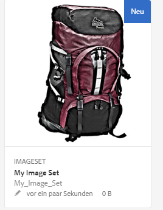
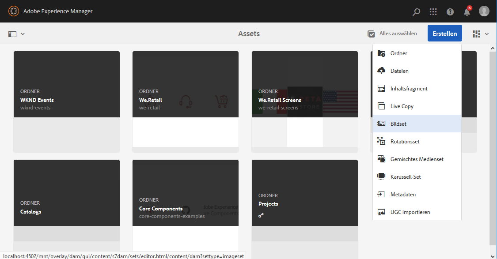
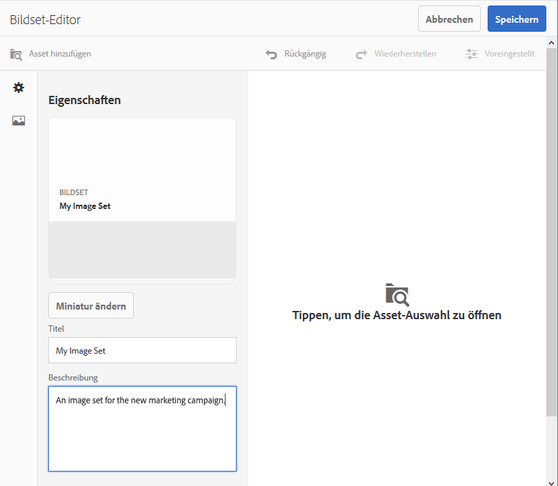
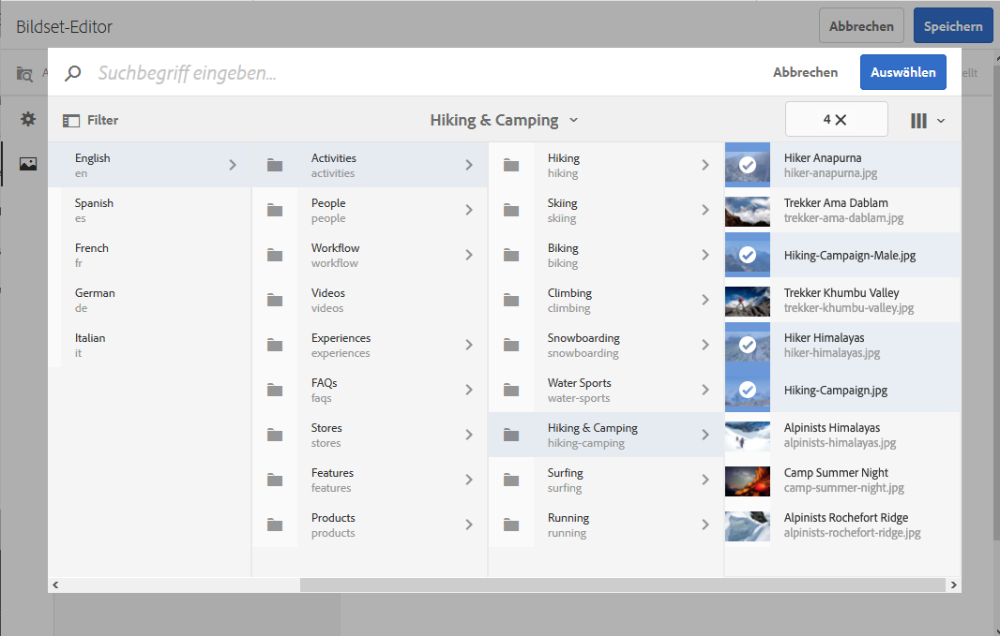
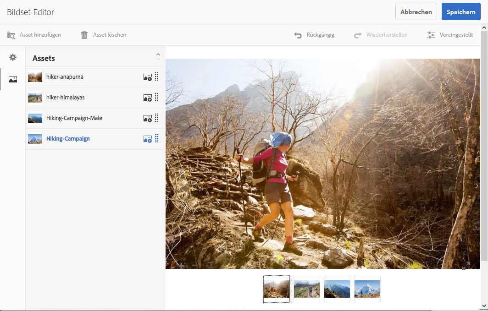
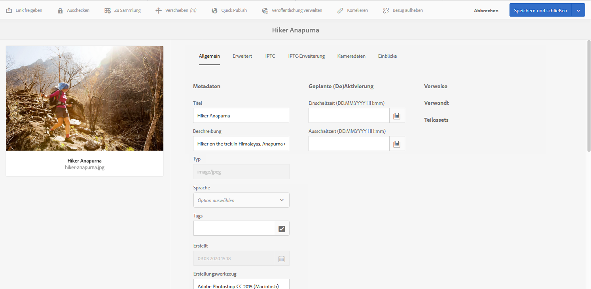
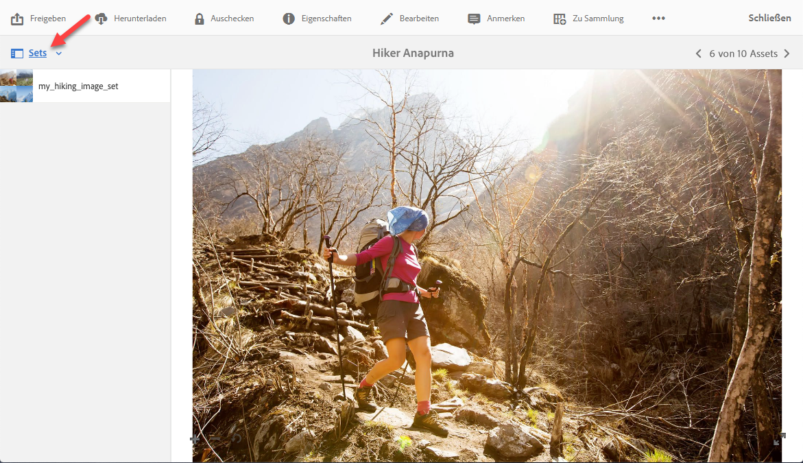
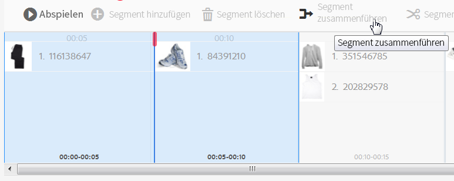

# Bild-Sets {#image-sets}

Über Bildsets erhalten Benutzer ein integriertes Anzeigeerlebnis, bei dem sie unterschiedliche Ansichten eines Elements durch Klicken auf eine Miniatur anzeigen können. Mit Bildsets können Sie alternative Ansichten eines Elements darstellen. Dabei enthält der Viewer Zoomtools, mit denen Bilder genauer betrachtet werden können.

Bildsets werden durch ein Banner mit dem Wort `IMAGESET` gekennzeichnet. Bei veröffentlichten Bildsets befindet sich das Veröffentlichungsdatum, das durch das Symbol **[!UICONTROL Welt]** gekennzeichnet wird, im Banner. Außerdem wird das letzte Änderungsdatum angezeigt, das durch das Symbol **[!UICONTROL Bleistift]** gekennzeichnet wird.

Innerhalb des Bildsets können Sie auch Muster erstellen, indem Sie ein Bildset erstellen und Miniaturen hinzufügen.

Dies ist nützlich, wenn Sie einen Artikel in einer anderen Farbe, einem anderen Muster oder mit anderer Endverarbeitung darstellen möchten. Um ein Bildset mit Farbmustern zu erstellen, benötigen Sie ein Bild für alle Farben, Muster oder Endverarbeitungen, die den Benutzern dargestellt werden sollen. Sie benötigen außerdem ein Farb-, Muster- oder Oberflächenfarbfeld für jede Farbe, jedes Muster oder jede Oberfläche.

Nehmen wir zum Beispiel an, Sie möchten Bilder von Kappen mit verschiedenfarbigen Schirmen präsentieren; die Schirme sind rot, grün und blau. In diesem Fall benötigen Sie drei Aufnahmen derselben Kappe. Sie brauchen eine Aufnahme mit einem roten Schirm, eine mit einem grünen Schirm und eine mit einem blauen Schirm. Außerdem benötigen Sie ein rotes, grünes und blaues Farbfeld. Die Farbmuster dienen als Miniaturen, auf die Benutzer im Musterset-Viewer klicken, um die Kappe mit rotem, grünem oder blauem Schirm anzuzeigen.

>[!NOTE]
>
>Weitere Informationen zur Assets-Benutzeroberfläche finden Sie in [Verwalten von Assets mit der Touch-optimierten Benutzeroberfläche](/help/assets/manage-digital-assets.md).

Beim Erstellen eines Bild-Sets empfiehlt Adobe die folgenden Best Practices und setzt die folgenden Limits um:

| Begrenzungstyp | Best Practice | Grenzwert |
| --- | --- | --- |
| Anzahl der doppelten Assets pro Satz | Keine Duplikate | 20 |
| Maximale Anzahl an Bildern pro Set | 5–10 Bilder pro Set | 1000 |

Siehe auch [Grenzwerte für Dynamic Media](/help/assets/dynamic-media/limitations.md).

## Schnellstart: Bildsets {#quick-start-image-sets}

So schaffen Sie einen schnellen Einstieg:

1. Optional. [Erstellen Sie eine Stapelsatzvorgabe](/help/assets/dynamic-media/batch-set-presets-dm.md) und wenden Sie sie auf einen neuen Ordner an, in den Ihre Rotationsset-Bilder hochgeladen werden.

   Eine Stapelsatzvorgabe kann Ihnen dabei helfen, die Erstellung Ihres Bildsets zu automatisieren.

   >[!IMPORTANT]
   >
   >Stapelsätze werden vom IPS (Image Production System) bei der Asset-Erfassung erstellt.

1. [Laden Sie die Primärquellen-Bilder für mehrere Ansichten hoch](#uploading-assets-in-image-sets).

   Laden Sie die Bilder für Ihre Bildsets hoch. Denken Sie daran, dass Benutzer im Bildset-Viewer auf Bilder zoomen können. Wählen Sie daher die Bilder sorgfältig aus. Achten Sie darauf, dass die längste Seite der Bilder mindestens 2.000 Pixel aufweist.

   Siehe [Dynamic Media - Unterstützte Rasterbildformate](/help/assets/file-format-support.md#image-support-dynamic-media) für eine Liste der von Bildsets unterstützten Formate.

1. [Erstellen Sie Bildsets](#creating-image-sets).

   In Bildsets klicken Benutzer im Bildset-Viewer auf Miniaturen.

   Kicken Sie zum Erstellen eines Bildsets in Assets auf **[!UICONTROL Erstellen]** > **[!UICONTROL Bildsets]**. Fügen Sie anschließend Bilder hinzu und klicken Sie auf **[!UICONTROL Speichern]**.

   Siehe [Vorbereiten von Bildset-Assets auf das Hochladen und Hochladen von Dateien](#uploading-assets-in-image-sets).

   Siehe [Arbeiten mit Selektoren](/help/assets/dynamic-media/working-with-selectors.md).

1. Fügen Sie nach Bedarf [Bildset-Viewer-Vorgaben](/help/assets/dynamic-media/managing-viewer-presets.md) hinzu.

   Administratoren können Bildset-Viewer-Vorgaben erstellen oder ändern. Wählen Sie zum Anzeigen Ihres Bildsets mit einer Viewer-Vorgabe das Bildset und links in der Leiste über die Dropdown-Liste die Option **[!UICONTROL Viewer]**.

   Informationen zum Erstellen oder Bearbeiten von Viewer-Vorgaben finden Sie unter **[!UICONTROL Tools]** > **[!UICONTROL Assets]** > **[!UICONTROL Viewer-Vorgaben]**.

1. (Optional) [Anzeigen von Bildsets](/help/assets/dynamic-media/image-sets.md#viewing-image-sets), die mit Stapelsatzvorgaben erstellt wurden.
1. [Zeigen Sie Bildsets in einer Vorschau an](/help/assets/dynamic-media/previewing-assets.md).

   Wählen Sie das Bildset aus, um dessen Vorschau anzuzeigen. Um das Bildset im ausgewählten Viewer zu überprüfen, klicken Sie auf die Miniaturen. Sie können verschiedene Viewer im Menü **[!UICONTROL Viewer]** auswählen, das Sie auf der linken Schiene über die Dropdown-Liste aufrufen können.

1. [Veröffentlichen Sie Bildsets](/help/assets/dynamic-media/publishing-dynamicmedia-assets.md).

   Beim Veröffentlichen eines Bildsets wird die URL- und Einbettungszeichenfolge aktiviert. Darüber hinaus müssen Sie alle [benutzerdefinierten Viewer-Vorgaben veröffentlichen](/help/assets/dynamic-media/managing-viewer-presets.md), die Sie erstellt haben. Standardmäßig vorhandene Viewer-Vorgaben sind bereits veröffentlicht.

1. [Verknüpfen Sie URLs mit einer Web-Anwendung](/help/assets/dynamic-media/linking-urls-to-yourwebapplication.md) oder [betten Sie den Video- oder Bild-Viewer ein](/help/assets/dynamic-media/embed-code.md).

   Experience Manager Assets erstellt URL-Aufrufe für Bildsets und aktiviert diese, nachdem Sie die Bildsets veröffentlicht haben. Sie können diese URLs während der Asset-Vorschau kopieren. Sie können sie alternativ in Ihre Website einbetten.

   Wählen Sie das Bildset und dann links auf der linken Schiene über die Dropdown-Liste die Option **[!UICONTROL Viewer]**.

   Siehe [Verknüpfen von Bildsets mit Web-Seiten](/help/assets/dynamic-media/linking-urls-to-yourwebapplication.md) und [Einbetten des Video- oder Bild-Viewers](/help/assets/dynamic-media/embed-code.md).

Informationen zum Bearbeiten von Bildsets finden Sie unter [Bearbeiten von Bildsets](#editing-image-sets). Darüber hinaus können Sie [Eigenschaften von Bildsets](/help/assets/manage-digital-assets.md#editing-properties) anzeigen und bearbeiten.

Wenn Sie beim Erstellen von Sets Probleme haben, lesen Sie den Abschnitt zu Bildern und Sets unter [Problembehandlung in Dynamic Media](/help/assets/dynamic-media/troubleshoot-dm.md#images-and-sets).

## Hochladen von Assets für Bildsets {#uploading-assets-in-image-sets}

Laden Sie zunächst die Bild-Assets für die Bildsets hoch. Denken Sie daran, dass Benutzer im Bildset-Viewer auf Bilder zoomen können. Wählen Sie daher die Bilder sorgfältig aus. Achten Sie darauf, dass die längste Seite der Bilder mindestens 2.000 Pixel aufweist, um optimale Zoom-Details zu erzielen. Mit Dynamic Media können Bilder mit einer Auflösung von jeweils bis zu 25 Megapixel gerendert werden. Sie können beispielsweise ein Bild mit 5000 x 5000 Megapixel oder eine beliebige andere Größenkombination mit bis zu 25 Megapixel verwenden.

<!-- Image Sets supports many image file formats, but lossless TIFF, PNG, and EPS images are recommended. -->

Siehe [Dynamic Media - Unterstützte Rasterbildformate](/help/assets/file-format-support.md#image-support-dynamic-media) für eine Liste der von Bildsets unterstützten Formate.

Sie können Bilder für Bildsets genau wie [jedes andere Asset in Assets hochladen](/help/assets/manage-digital-assets.md#uploading-assets).

### Vorbereiten von Bildset-Assets auf das Hochladen {#preparing-image-set-assets-for-upload}

Bevor Sie Bildsets erstellen, achten Sie darauf, dass die Bilder die richtige Größe und das richtige Format aufweisen.

Um ein Bildset mit mehreren Ansichten zu erstellen, benötigen Sie Bilder, die einen Artikel aus unterschiedlichen Blickwinkeln zeigen oder unterschiedliche Aspekte desselben Artikels darstellen. Ziel ist es, die wichtigen Merkmale eines Artikels so hervorzuheben, dass Benutzer einen umfassen Einblick in das Aussehen oder die Funktion des Gegenstands erhalten.

Stellen Sie sicher, dass die längste Seite der Bilder in Bildsets mindestens 2.000 Pixel aufweist, da Benutzer sie einzoomen können. Experience Manager Assets unterstützt zahlreiche Bilddateiformate, empfohlen werden aber verlustfreie TIFF-, PNG- und EPS-Bilder.

>[!NOTE]
>
>Wenn Sie Miniaturen verwenden, um Produktmuster anzuzeigen, führen Sie die folgenden Schritte aus:
>
>Erstellen Sie Vignetten oder unterschiedliche Aufnahmen desselben Bildes, in denen dieses in verschiedenen Farben, Mustern oder Endverarbeitungen dargestellt wird. Außerdem benötigen Sie Miniaturdateien, die den verschiedenen Farben, Mustern oder Endverarbeitungen entsprechen. Um beispielsweise Miniaturen in einem Bildset zu präsentieren, die eine Jacke in Schwarz, Braun und Grün anzeigen, benötigen Sie:
>
>* Eine schwarze, braune und grüne Aufnahme der Jacke,
>* eine schwarze, braune und grüne Miniatur

## Erstellen Sie Bildsets {#creating-image-sets}

Sie können Bildsets über die Benutzeroberfläche oder die API erstellen.

>[!NOTE]
>
>Sie können Bildsets auch automatisch über [Stapelsatzvorgaben](/help/assets/dynamic-media/batch-set-presets-dm.md) erstellen.
>**Wichtig:** Stapelsätze werden vom IPS (Image Production System) bei der Asset-Erfassung erstellt.

Assets, die Sie Ihrem Set hinzufügen, werden automatisch in alphanumerischer Reihenfolge hinzugefügt. Sie können die Anordnung oder Sortierung der Assets manuell ändern, nachdem sie hinzugefügt wurden.

>[!NOTE]
>
>Bildsets werden nicht unterstützt, wenn Assets im Dateinamen ein „,“ (Komma) enthalten.

Beim Erstellen eines Bild-Sets empfiehlt Adobe die folgenden Best Practices und setzt die folgenden Limits um:

| Begrenzungstyp | Best Practice | Grenzwert |
| --- | --- | --- |
| Anzahl der doppelten Assets pro Satz | Keine Duplikate | 20 |
| Maximale Anzahl an Bildern pro Set | 5–10 Bilder pro Set | 1000 |

Siehe auch [Einschränkungen bei Dynamic Media](/help/assets/dynamic-media/limitations.md).

**So erstellen Sie Bildsets:**

1. Klicken Sie in Adobe Experience Manager auf das Experience Manager-Logo, um auf die Konsole für die globale Navigation zuzugreifen.
1. Wählen Sie **[!UICONTROL Navigation]** > **[!UICONTROL Assets]**. Gehen Sie zu dem Verzeichnis, in dem Sie ein Bildset erstellen möchten, und gehen Sie dann zu **[!UICONTROL Erstellen]** > **[!UICONTROL Bildset]**, um die Seite mit dem Bildset-Editor zu öffnen.

   Sie können das Set auch in einem Ordner erstellen, der die gewünschten Assets enthält.

   

1. Geben Sie im Bildset-Editor im Feld **[!UICONTROL Titel]** einen Namen für das Bildset ein. Der Name wird im Banner über dem Bildset angezeigt. Geben Sie optional eine Beschreibung ein.

   

1. Führen Sie eine der folgenden Aktionen aus:

   * Klicken Sie oben links auf der Seite des Bildset-Editors auf **[!UICONTROL Asset hinzufügen]**.

   * Klicken Sie in der Mitte des Bildset-Editors auf **[!UICONTROL Hier tippen, um die Asset-Auswahl zu öffnen]**.

   Wählen Sie die Assets aus, die Sie in Ihr Bild-Set aufnehmen möchten. Die ausgewählten Assets sind mit einem Häkchen versehen. Wenn Sie die Assets ausgewählt haben, klicken Sie oben rechts auf **[!UICONTROL Auswählen]**.

   Mit der Asset-Auswahl können Sie nach Assets suchen, indem Sie einen Suchbegriff eingeben und die **[!UICONTROL Eingabetaste]** drücken. Sie können auch Filter anwenden, um Ihre Suchergebnisse genauer abzustimmen. Sie können nach Pfad, Sammlung, Dateityp und Tag filtern. Wählen Sie den Filter und klicken Sie in der Symbolleiste auf das Symbol **[!UICONTROL Filter]**. Ändern Sie die Ansicht, indem Sie auf das Symbol „Ansicht“ klicken und dann **[!UICONTROL Spaltenansicht]**, **[!UICONTROL Kartenansicht]** oder **[!UICONTROL Listenansicht]** wählen.

   Siehe [Arbeiten mit Selektoren](/help/assets/dynamic-media/working-with-selectors.md).

   

1. Assets, die Sie Ihrem Set hinzufügen, werden automatisch in alphanumerischer Reihenfolge hinzugefügt. Sie können die Anordnung oder Sortierung der Assets manuell ändern, nachdem sie hinzugefügt wurden.

   Ziehen Sie gegebenenfalls das Symbol „Neu anordnen“ rechts neben den Dateinamen des Assets, um Bilder in der Setliste nach oben oder unten zu bewegen.

   

   Wenn Sie Miniaturen oder Muster hinzufügen möchten, klicken Sie auf das **Plussymbol** zum **Hinzufügen von Miniaturen** neben dem Bild und navigieren Sie zur gewünschten Miniatur oder zum gewünschten Muster. Wenn Sie alle Bilder ausgewählt haben, klicken Sie auf **[!UICONTROL Speichern]**.

1. (Optional) Führen Sie einen der folgenden Schritte aus:

   * Wenn Sie ein Bild löschen möchten, wählen Sie das Bild aus und klicken Sie auf **[!UICONTROL Asset löschen]**.

   * Wenn Sie eine Vorgabe anwenden möchten, wählen Sie oben rechts **[!UICONTROL Vorgabe]** aus. Wählen Sie anschließend eine Vorgabe aus, um sie auf alle Elemente gleichzeitig anzuwenden.

   >[!NOTE]
   >
   >Beim Erstellen des Bildsets können Sie die Miniatur des Bildsets ändern. Alternativ können Sie festlegen, dass Experience Manager die Miniatur automatisch anhand der im Bildset enthaltenen Assets auswählt. Um eine Miniatur auszuwählen, klicken Sie auf der Seite Bildset-Editor über dem Feld Titel auf **[!UICONTROL Miniatur ändern]**. Wählen Sie dann ein beliebiges Bild aus (Sie können auch zu anderen Ordnern gehen, um nach Bildern zu suchen). Wenn Sie eine Miniatur ausgewählt haben und dann mit Experience Manager aus dem Bildset eine generieren möchten, wählen Sie **[!UICONTROL Zu automatischer]** **[!UICONTROL Miniatur wechseln]**.

1. Klicken Sie auf **[!UICONTROL Speichern]**. Das erstellte Bildset wird in dem Ordner angezeigt, in dem es erstellt wurde.

## Anzeigen von Bildsets {#viewing-image-sets}

Sie können Bildsets entweder in der Benutzeroberfläche oder automatisch über [Stapelsatzvorgaben](/help/assets/dynamic-media/batch-set-presets-dm.md) erstellen.

>[!IMPORTANT]
>
>Stapelsätze werden vom IPS [Image Production System] bei der Asset-Erfassung erstellt.

Mit Stapelsatzvorgaben erstellte Sets werden jedoch *nicht* in der Benutzeroberfläche angezeigt. Sie können diese Sets auf drei verschiedene Arten anzeigen. (Diese Methoden sind auch verfügbar, wenn Sie die Bildsets in der Benutzeroberfläche erstellt haben.)

* Öffnen Sie die Eigenschaften eines Assets. Die Eigenschaften zeigen an, auf welche Sets das ausgewählte Asset verweist oder welchen Sets es angehört. Um das gesamte Set anzuzeigen, klicken Sie auf den Namen des Sets.

  

* Von einem zugehörigen Bild eines beliebigen Sets. Wählen Sie das Menü **[!UICONTROL Sets]** aus, um die Sets anzuzeigen, denen das Asset angehört.

  

* Über die Suche können Sie **[!UICONTROL Filter]** auswählen, dann **[!UICONTROL Dynamic Media]** erweitern und **[!UICONTROL Sets]** auswählen.

  Die Suche gibt als Ergebnis Sets zurück, die in der Benutzeroberfläche manuell oder mit Stapelsatzvorgaben automatisch erstellt wurden. Bei automatisierten Sets wird die Abfrage mit „Beginnt mit“ ausgeführt. Diese Suchkriterien unterscheiden sich von Experience Manager, der auf der Verwendung von „Enthält“ basiert. Automatisierte Sets können nur durchsucht werden, wenn der Filter auf **[!UICONTROL Sets]** eingestellt ist.

  

>[!NOTE]
>
>Sets können über die Benutzeroberfläche angezeigt werden, wie unter [Bearbeiten von Bildsets](#editing-image-sets) beschrieben.

## Bearbeiten von Bildsets {#editing-image-sets}

Sie können mehrere Bearbeitungsaufgaben für Bildsets ausführen, z. B. die folgenden:

* Fügen Sie dem Bildset Bilder hinzu.
* Ordnen Sie Bilder im Bildset neu an.
* Löschen Sie Assets im Bildset.
* Wenden Sie Viewer-Vorgaben an.
* Löschen Sie das Bildset.

**So bearbeiten Sie Bildsets:**

1. Führen Sie einen der folgenden Schritte aus:

   * Zeigen Sie mit der Maus auf ein Bildset-Asset und klicken Sie auf **[!UICONTROL Bearbeiten]** (Stiftsymbol).
   * Zeigen Sie mit der Maus auf ein Bildset-Asset und klicken Sie auf **[!UICONTROL Auswählen]** (Häkchensymbol) und dann auf **[!UICONTROL Bearbeiten]** in der Symbolleiste.
   * Wählen Sie ein Bild-Set-Asset aus und dann **[!UICONTROL Bearbeiten]** (Stiftsymbol) in der Symbolleiste.

1. Führen Sie eine der folgenden Aktionen aus, um die Bilder im Bildset zu bearbeiten:

   * Um Assets neu zu ordnen, ziehen Sie ein Bild an eine neue Position (wählen Sie zum Verschieben von Elementen das Symbol zum Neuanordnen aus).
   * Um Elemente in auf- oder absteigender Reihenfolge zu sortieren, klicken Sie auf die Spaltenüberschrift.
   * Um ein Asset hinzuzufügen oder ein vorhandenes Asset zu aktualisieren, klicken Sie auf **[!UICONTROL Asset hinzufügen]**. Gehen Sie zu einem Asset, wählen Sie es aus und klicken Sie oben rechts auf **[!UICONTROL Auswählen]**.
     >[!NOTE]
     >
     >Wenn Sie das in Experience Manager als Miniatur verwendete Bild löschen und durch ein anderes ersetzen, wird das Original-Asset weiterhin angezeigt.
   * Um ein Asset zu löschen, wählen Sie es aus und wählen Sie **[!UICONTROL Asset löschen]**.
   * Um eine Vorgabe anzuwenden, klicken Sie oben rechts auf der Seite auf **[!UICONTROL Vorgabe]** und wählen Sie eine Viewer-Vorgabe aus.
   * Um eine Miniatur hinzuzufügen oder zu ändern, wählen Sie die Miniatur rechts neben dem Asset. Gehen Sie zur neuen Miniatur oder zum neuen Farbmuster-Asset, wählen Sie es aus und klicken Sie dann auf **[!UICONTROL Auswählen]**.
   * Um ein ganzes Bildset zu löschen, gehen Sie zum Bildset, wählen Sie es aus und klicken Sie auf **[!UICONTROL Löschen]**.

   >[!NOTE]
   >
   >Sie können die Bilder in einem Bildset bearbeiten. Gehen Sie zum Bildset und klicken Sie in der linken Leiste auf **[!UICONTROL Mitglieder des Sets]**. Um das Bearbeitungsfenster zu öffnen, klicken Sie auf das Stiftsymbol eines Assets.

1. Klicken Sie auf **[!UICONTROL Speichern]**, wenn Sie mit der Bearbeitung fertig sind.

## Zeigen Sie Bildsets in einer Vorschau an {#previewing-image-sets}

Siehe [Anzeigen von Assets in der Vorschau](/help/assets/dynamic-media/previewing-assets.md).

## Veröffentlichen von Bildsets {#publishing-image-sets}

Siehe [Veröffentlichen von Assets](/help/assets/dynamic-media/publishing-dynamicmedia-assets.md).
