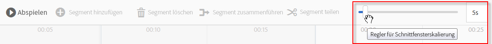
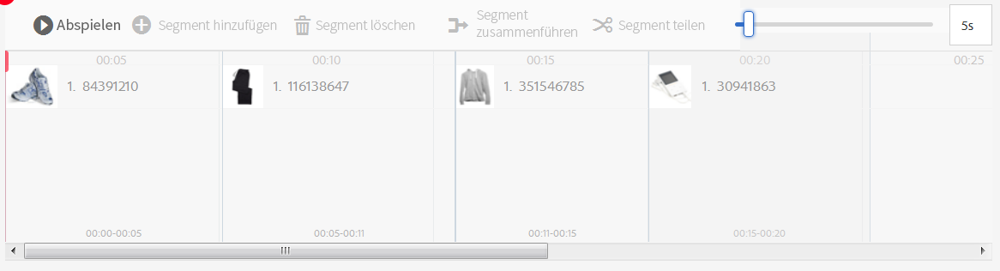
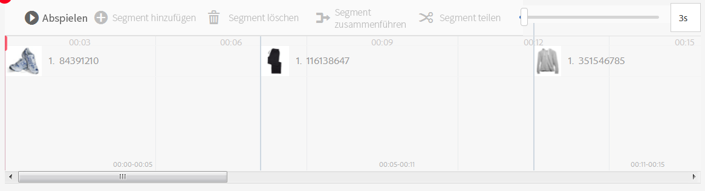
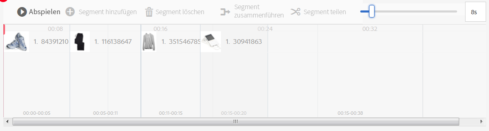
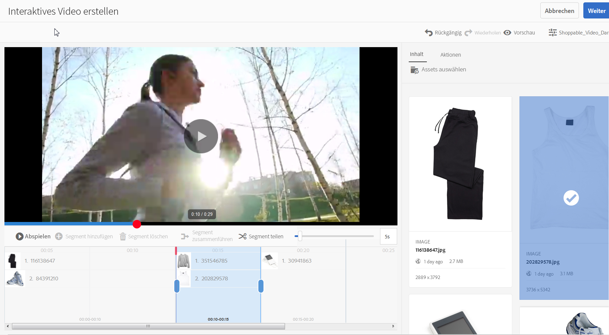
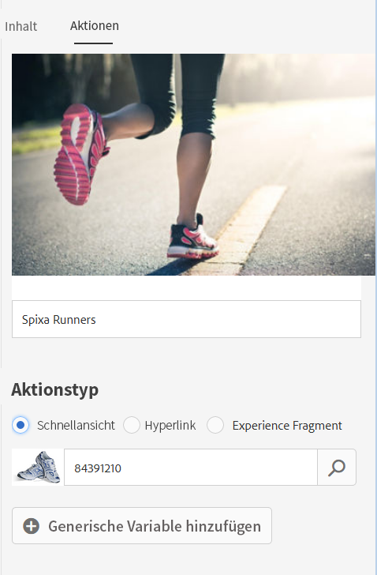
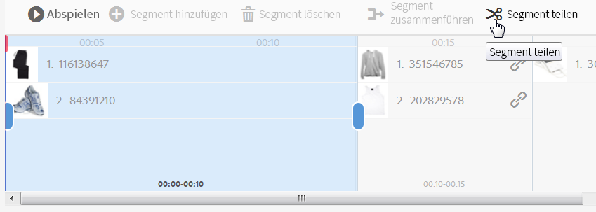

# Interaktive Videos {#interactive-videos}


Sie können auf einfache Weise interaktive Videos (auch als Videos mit Shopping-Funktion bekannt) erstellen, die direkt aus dem Video die Konversion fördern. Die Kundeninteraktion mit dem Video erfolgt in einem Feld neben dem Videoplayer, in dem die zugehörigen Services, Informationen oder Produktminiaturen auf Grundlage des Umfangs im Video per Bildlauf in die Ansicht einfließen. Kunden können auf die Miniatur tippen und werden direkt mit dem Service verbunden. Alternativ können sie den Artikel für den direkten Erwerb zu einem Warenkorb hinzufügen oder sie werden mit einer Web-Seite verbunden, um weitere Informationen zu erhalten.

Wenn das Video beendet wird, wird eine visuelle Zusammenfassung sämtlicher Angebote angezeigt, um den Aktionsaufruf zu unterstützen. Kunden haben eine weitere Möglichkeit, auf den gewünschten Artikel zu tippen. Umsetzbare und spezifische Erlebnisse wie diese erhöhen die Kundenbindung und Konversionen.

Informationen hierzu finden Sie auch unter [Interaktive Bilder](/help/assets/dynamic-media/interactive-images.md).

## Interaktives Video in Aktion  {#interactive-video-in-action}

Um ein interaktives Video mit Shopping-Funktion anzuzeigen, klicken Sie auf [Live-Demos](https://landing.adobe.com/en/na/dynamic-media/ctir-2755/live-demos.html), scrollen Sie auf der Seite zur Überschrift **[!UICONTROL Shop-fähige Medien]** und klicken Sie dann auf das gewünschte Video mit Shopping-Funktion, um die Wiedergabe zu starten.

* Wenn während der Wiedergabe Produkte im Video verwendet werden, wird das gleiche Produkt auf der rechten Seite als Miniaturansicht angezeigt.

* Um das Video anzuhalten und die Quick-Ansicht des Produkts zu öffnen, tippen Sie auf die Miniaturansicht. Tippen Sie beispielsweise auf das Miniaturbild von &quot;KitchenAid&quot;im Video, um eine 360-Grad-Rotation des Mixers zu erhalten, oder zoomen Sie heran, um Details zum Mixer anzuzeigen.

Siehe auch [Verwenden von interaktiven Videos mit Dynamic Media](https://experienceleague.adobe.com/docs/experience-manager-learn/assets/dynamic-media/dynamic-media-interactive-video-feature-video-use.html?lang=en#dynamic-media)

<!-- 

There was a link here that showed the video frame of an interactive video and when the reader clicked the frame the video would play https://marketing.adobe.com/resources/help/en_US/dm/shoppable-video/AXIS/index.html. This now needs to call a new interactive video

-->

<!-- 

[A frame from an interactive, shoppable video](assets/chlimage_1-126.png) *A video frame capture from an interactive, shoppable video.*

-->

>[!NOTE]
>
>Wenn Sie ein interaktives Video erstellen, um eine Webseite zu starten, wenn ein Benutzer auf ein Miniaturbild tippt, wird das Öffnen der Popup-Webseite von einigen Geräten blockiert. Ändern Sie in solchen Fällen die Einstellung für den Popup-Blocker auf dem Gerät. Auf einem Apple iPhone 6 tippen Sie beispielsweise auf **[!UICONTROL Einstellungen > Safari > Popups blockieren]** und schieben das Steuerelement auf **[!UICONTROL Aus]**. Wenn Sie ein interaktives Video wiedergeben und auf eine Miniaturansicht klicken, werden Sie gefragt, ob das Popup geöffnet werden soll. Wenn Sie dies akzeptieren, wird die Web-Seite geöffnet.

### Erstellen von interaktiven Videos   {#watch-how-interactive-videos-are-created}

Hier erhalten Sie eine Einführung (7 Min., 30 Sek.) in die [Erstellung interaktiver Videos](https://s7d5.scene7.com/s7viewers/html5/VideoViewer.html?videoserverurl=https://s7d5.scene7.com/is/content/&amp;emailurl=https://s7d5.scene7.com/s7/emailFriend&amp;serverUrl=https://s7d5.scene7.com/is/image/&amp;config=Scene7SharedAssets/Universal_HTML5_Video_social&amp;contenturl=https://s7d5.scene7.com/skins/&amp;asset=S7tutorials/InteractiveVideo) [](https://outv.omniture.com?v=s4NHQ2dzqd7hIqWjeG2sIdyNWsTWyupA).
(Obwohl die Videoanleitung mit Assets on Demand gekennzeichnet ist, gelten die Prinzipien und Schritte weiterhin für interaktive Videos in Adobe Experience Manager Assets.)

### Kundenerfolgs-Webinar von Adobe {#adobe-customer-success-webinar}

Das Webinar [Verwenden von interaktivem Video, Linkfreigabe und YouTube-Freigabe in Experience Manager Assets](https://adobecustomersuccess.adobeconnect.com/p1yxzdo4aec/) lehrt Sie, wie Sie interaktive Videos und andere Funktionen verwenden, um konversionsgesteuerte Ereignis mit Ihren Videomarketinginhalten zu verknüpfen.

## Schnellstart: interaktive Videos {#quick-start-interactive-videos}

Die folgende schrittweise Workflow-Beschreibung soll Ihnen dabei helfen, interaktive Videos in Dynamic Media einzurichten und schnell auszuführen.

Suchen Sie nach der Überschrift **Beispiele** in einigen der Schnellstartaufgaben. Hier finden Sie ein kurzes Tutorial, [das auf dieser Demo-Web-Seite basiert, der noch *keine* Interaktivität hinzugefügt wurde](https://marketing.adobe.com/resources/help/de_DE/dm/shoppable-video/john-lewis/landing-0.html).

Die **Beispiele** veranschaulichen die Schritte zur Integration interaktiver Videos auf Ihrer Website.

Wenn Sie das Lernprogramm im letzten Beispielabschnitt abgeschlossen haben, wird [Ihre letzte Demo-Webseite mit dem vollständig integrierten interaktiven Video auf diese Weise](https://marketing.adobe.com/resources/help/de_DE/dm/shoppable-video/john-lewis/landing-3.html) angezeigt.


Schritte zum Erstellen interaktiver Videos:

1. **(Optional) Identifizieren von Variablen**  zur schnellen Ansicht - Beginn durch Identifizieren von dynamischen Variablen, die von Ihrer vorhandenen Quick Ansicht-Implementierung verwendet werden. Mithilfe der Variablen können Sie Produktminiaturen bei der Erstellung des interaktiven Videos der jeweiligen Produkt-Quick-Ansicht zuordnen. Siehe [(Optional) Identifizieren von Quick Ansicht-Variablen](#optional-identifying-quickview-variables).
   **Dieser Schritt ist nur erforderlich, wenn alle folgenden Punkte zutreffen**: ・ Sie möchten Interaktivität zu Ihrem Video hinzufügen, indem Sie Quick Ansichten starten.
・ Ihre Implementierung von Experience Manager verwendet *nicht* ein eCommerce-Integrationsframework, um Produktdaten aus einer beliebigen eCommerce-Lösung wie IBM WebSphere® Commerce, Elastic Path, hybris oder Intershop in den Experience Manager zu ziehen.

1. **(Optional) Erstellen einer Viewer-Vorgabe für ein interaktives Video**: Passen Sie das Aussehen und Verhalten verschiedener Komponenten im Player an, beispielsweise den Video-Scrubber und die interaktiven Miniaturansichten.
Die Erstellung einer eigenen Viewer-Vorgabe für ein interaktives Video ist nicht erforderlich, wenn Sie stattdessen die standardmäßig bereitgestellten Viewer-Vorgaben für interaktive Videos namens `Shoppable_Video_Light` oder `Shoppable_Video_Dark` verwenden möchten.
Siehe [Erstellen einer neuen Viewer-Vorgabe](/help/assets/dynamic-media/managing-viewer-presets.md#creating-a-new-viewer-preset) (optional) und [Besondere Überlegungen zum Erstellen einer interaktiven Viewer-Vorgabe](/help/assets/dynamic-media/managing-viewer-presets.md#special-considerations-for-creating-an-interactive-viewer-preset).

1. **Hochladen eines Videos und der zugehörigen Bild-Assets**: Laden Sie ein Video und die zugehörigen Bilder hoch, die interaktiv sein sollen.
Informationen hierzu finden Sie unter [Hochladen eines Videos und der zugehörigen Miniatur-Assets](#uploading-a-video-and-its-associated-thumbnail-assets).

1. **Hinzufügen von Interaktivität zum Video**: Fügen Sie dem Video mindestens ein Zeitsegment hinzu. Verknüpfen Sie dann Miniaturansichten mit diesen Zeitsegmenten. Weisen Sie jede Bildminiatur einer Aktion wie einem Hyperlink, einer Quick-Ansicht oder einem Erlebnisfragment zu.
(Die URL-basierte Linkmethode ist nicht möglich, wenn der interaktive Inhalt Links mit relativen URLs, insbesondere Links zu Experience Manager-Siteseiten, enthält.)
Schließen Sie den Vorgang ab, indem Sie die interaktiven Video-Assets veröffentlichen. Beim Veröffentlichen wird der Einbettungscode oder die URL erstellt, den Sie kopieren und auf Ihre Website-Landingpage anwenden. Informationen hierzu finden Sie unter [Hinzufügen von Interaktivität zum Video](#adding-interactivity-to-your-video).
Siehe [Veröffentlichen von Assets](/help/assets/dynamic-media/publishing-dynamicmedia-assets.md).

1. **Hinzufügen eines interaktiven Videos zu Ihrer Website oder Ihrer Website in Experience Manager**  - Wenn Sie Experience Manager-Sites, Experience Manager-E-Commerce oder beides verwenden, können Sie das interaktive Video direkt zu einer Webseite in Experience Manager hinzufügen. Ziehen Sie die Komponente Interaktive Medien auf die Seite. Siehe [Hinzufügen von Dynamic Media-Assets zu Seiten.](/help/assets/dynamic-media/adding-dynamic-media-assets-to-pages.md)
Verwenden Sie den Einbettungs-Code, um das interaktive Video auf Ihrer Website zu integrieren. Siehe [Integrieren eines interaktiven Videos auf Ihrer Website](#integrating-an-interactive-video-with-your-website).
Wenn Sie einen WCM (Web Content Manager) eines Drittanbieters verwenden, müssen Sie das neue interaktive Video in die vorhandene Implementierung der Schnellfunktion integrieren, die auf Ihrer Website verwendet wird. Siehe [Integrieren eines interaktiven Videos mit einer vorhandenen Quick-Ansicht](#integrating-an-interactive-video-with-an-existing-quickview).
   [Hinzufügen von Dynamic Media-Assets zu Seiten](/help/assets/dynamic-media/adding-dynamic-media-assets-to-pages.md)

## (Optional) Identifizieren von Variablen für die schnelle Ansicht {#optional-identifying-quickview-variables}

>[!NOTE]
Diese Aufgabe ist nur erforderlich, wenn Folgendes zutrifft:
* Sie möchten Interaktivität zu Ihrem Video hinzufügen, indem Sie Quick-Ansichten starten.
* Ihre Implementierung von Experience Manager verwendet *nicht* ein eCommerce-Integrationsframework, um Produktdaten aus einer beliebigen eCommerce-Lösung wie IBM WebSphere® Commerce, Elastic Path, hybris oder Intershop in den Experience Manager zu ziehen. <!-- See [eCommerce concepts in Experience Manager Assets](/help/sites-administering/concepts.md).-->

Wenn Ihre Implementierung von Experience Manager eCommerce verwendet, können Sie diese Aufgabe überspringen und mit der nächsten Aufgabe fortfahren.

Beginn durch Identifizieren dynamischer Variablen, die von Ihrer vorhandenen Quick Ansicht-Implementierung verwendet werden, sodass Sie Produktminiaturen während der interaktiven Videoerstellung der entsprechenden Quick-Ansicht zuordnen können.

Wenn Sie einem Video Zeitsegmente hinzufügen, weisen Sie jeder Miniaturansicht, die Sie einem Segment hinzufügen, eine SKU (Stock Keeping Unit) und weitere Variablen zu. Diese Variablen werden später verwendet, um das richtige Produkt für die schnelle Ansicht anzuzeigen.

Es ist wichtig, die Variablen richtig zu identifizieren, die zum eindeutigen Trigger einer Quick-Ansicht erforderlich sind.

Manchmal reicht es aus, sich mit IT-Spezialisten zu beraten, die für Ihre Implementierung der Schnellfunktion zuständig sind. Sie kennen wahrscheinlich den minimalen Datensatz, der die schnelle Ansicht im System identifiziert. Es ist jedoch möglich, das bestehende Verhalten des Front-End-Codes einfach zu analysieren.

Bei den meisten Implementierungen der schnellen Ansicht wird das folgende Paradigma verwendet:

* Benutzer aktiviert ein Benutzeroberflächenelement auf der Website. Klicken Sie beispielsweise auf die Schaltfläche &quot;Schnellere Ansicht&quot;.
* Die Website sendet eine Ajax-Anforderung an das Backend, um die Daten oder den Inhalt der Schnelldatei bei Bedarf zu laden.
* Die Daten zur schnellen Ansicht werden in den Inhalt übersetzt, um die Wiedergabe auf der Webseite vorzubereiten.
* Schließlich zeigt der Frontend-Code diesen Inhalt visuell auf dem Bildschirm an.

Der Ansatz besteht daher darin, verschiedene Bereiche Ihrer bestehenden Website zu besuchen, in denen eine schnelle Ansicht implementiert ist. Anschließend können Sie die Schnelldatei in Trigger setzen und die Ajax-URL erfassen, die von der Webseite zum Laden der Daten oder des Inhalts der Ansicht gesendet wird.

Normalerweise müssen Sie keine speziellen Debugging-Tools verwenden. Moderne Webbrowser verfügen über Web-Inspektoren, die dafür ausreichend sind. Die folgenden Webbrowser beispielsweise umfassen Web-Inspektoren:

* Drücken Sie zum Anzeigen aller ausgehenden HTTP-Anfragen in Google Chrome die Taste **F12** (Windows) oder **Befehlstaste + Wahltaste + I** (Mac), um den Bereich für Entwickler-Tools anzuzeigen, und klicken Sie dann auf die Registerkarte **Netzwerk**.

* In Firefox können Sie das Firebug-Plug-in aktivieren, indem Sie **F12** (Windows) bzw. **Befehlstaste + Wahltaste + I** (Mac) drücken und die Registerkarte **[!UICONTROL Netz]** öffnen, oder Sie öffnen die Registerkarte „Netzwerk“ im integrierten Inspektor-Tool.

* Aktivieren Sie in Internet Explorer das Debugger-Tool, indem Sie **F12** drücken.

Wenn die Netzwerküberwachung im Browser aktiviert ist, Trigger die Schnellseite der Ansicht.

Suchen Sie nun die Ajax-URL der Schnellversion im Netzwerkprotokoll und kopieren Sie die aufgezeichnete URL für die zukünftige Analyse. Normalerweise werden beim Trigger der Quick-Ansicht zahlreiche Anfragen an den Server gesendet. Normalerweise ist die Ajax-URL für die schnelle Ansicht eine der ersten in der Liste. Sie weist einen Teil oder Pfad mit einer komplexen Abfragezeichenfolge auf und ihr MIME-Typ lautet entweder `text/xml`, `text/html` oder `text/javascript`.

Dabei ist es wichtig, verschiedene Bereiche Ihrer Website mit unterschiedlichen Kategorien und Typen zu besuchen. Der Grund dafür ist, dass die URLs der schnellen Ansicht Teile enthalten, die für eine bestimmte Website-Kategorie häufig vorkommen, sich aber nur ändern, wenn Sie einen anderen Bereich der Website besuchen.

Im einfachsten Fall ist die Produkt-SKU der einzige Variablenteil in der Quick Ansicht-URL. In diesem Fall ist der Produkt-SKU-Wert das einzige Datenelement, das zum Hinzufügen von Miniaturbildern zu einem Zeitsegment im interaktiven Video in Experience Manager benötigt wird.

In komplexen Fällen enthält die URL der Schnellkorrektur jedoch zusätzlich zur Produkt-SKU unterschiedliche Elemente, wie Kategorien-ID und Farbcode. In solchen Fällen wird jedes dieser Elemente in der Definition der Miniaturdaten in Experience Manager zu einer separaten Variablen.

Beachten Sie die folgenden Beispiele für URLs zur Schnellansicht und die sich daraus ergebenden Miniaturvariablen:

<table>
  <tbody>
  <tr>
    <td><p>Einzelne SKU, befindet sich in der Abfragezeichenfolge.</p> </td>
    <td><p>Zu den aufgezeichneten URLs für die schnelle Ansicht gehören:</p>
    <ul>
      <li><p><code>https://server/json?productId=866558&amp;source=100</code></p> </li>
      <li><p><code>https://server/json?productId=1196184&amp;source=100</code></p> </li>
      <li><p><code>https://server/json?productId=1081492&amp;source=100</code></p> </li>
      <li><p><code>https://server/json?productId=1898294&amp;source=100</code></p> </li>
    </ul> <p>Der einzige variable Teil der URL ist der Wert des Abfrageparameters <code>productId=</code> und es ist offensichtlich ein SKU-Wert. Daher benötigen die Miniaturansichten nur SKU-Felder mit Werten wie <strong><code>866558</code></strong>, <strong><code>1196184</code></strong>, <strong><code>1081492</code></strong>, <strong><code>1898294</code></strong>.</p> </td>
  </tr>
  <tr>
    <td><p>Einzelne SKU, befindet sich im URL-Pfad.</p> </td>
    <td><p>Zu den aufgezeichneten URLs für die schnelle Ansicht gehören:</p>
    <ul>
      <li><p><code>https://server/product/6422350843</code></p> </li>
      <li><p><code>https://server/product/1607745002</code></p> </li>
      <li><p><code>https://server/product/0086724882</code></p> </li>
    </ul> <p>Der Variablenteil befindet sich im letzten Teil des Pfades und wird zum SKU-Wert von Experience Manager-Miniaturbildern: <strong><code>6422350843</code></strong>, <strong><code>1607745002</code></strong>, <strong><code>0086724882</code></strong>.</p> </td>
  </tr>
  <tr>
    <td><p>SKU und Kategorie-ID in der Abfragezeichenfolge.</p> </td>
    <td><p>Zu den aufgezeichneten URLs für die schnelle Ansicht gehören:</p>
    <ul>
      <li><p><code>https://server/quickView/product/?category=1100004&amp;prodId=305466</code></p> </li>
      <li><p><code>https://server/quickView/product/?category=1100004&amp;prodId=310181</code></p> </li>
      <li><p><code>https://server/quickView/product/?category=1740148&amp;prodId=308706</code></p> </li>
    </ul> <p>In diesem Fall liegen zwei abweichende Teile in der URL vor. Die SKU wird im Parameter <code>prodId</code> gespeichert, während die Kategorie-ID im Parameter <code>category=</code> gespeichert wird.</p> <p>Bei den Definitionen für Miniaturansichten selbst handelt es sich um Paare. Das heißt, ein SKU-Wert und eine zusätzliche Variable namens <code>categoryId</code>. Die resultierenden Paare lauten wie folgt:</p>
    <ul>
      <li>Die SKU lautet <code>305466</code> und <code>categoryId</code> lautet <code>1100004</code></li>
      <li>Die SKU lautet <code>310181</code> und <code>categoryId</code> lautet <code>1100004</code></li>
      <li>Die SKU lautet <code>308706</code> und <code>categoryId</code> lautet <code>1740148</code></li>
    </ul> <p> </p> </td>
  </tr>
  </tbody>
</table>

**Beispiel**

Wenn der oben beschriebene Ansatz auf die Beispiel-Website angewendet wird, haben Sie eine Webseite mit mehreren Produktminiaturen, von denen jede eine Schaltfläche &quot;MEHR SEE&quot;hat:

[https://marketing.adobe.com/resources/help/de_DE/dm/shoppable-video/john-lewis/landing-0.html](https://marketing.adobe.com/resources/help/en_US/dm/shoppable-video/john-lewis/landing-0.html)

Nachdem Sie alle auf der Seite verfügbaren Quick-Ansichten aktiviert haben, erhalten Sie die folgende Liste von Schnellanfragen zur Ansicht an das Backend:

* datafeed/candles-233396346.json
* datafeed/candles-233978050.json
* datafeed/candles-234024346.json
* datafeed/candles-234024356.json
* datafeed/candles-234024359.json
* datafeed/cushions-233939848.json
* datafeed/cushions-234019477.json
* datafeed/cushions-234019483.json
* datafeed/furniture-231747479.json
* datafeed/furniture-232625621.json
* datafeed/furniture-232625626.json
* datafeed/furniture-233939810.json
* datafeed/furniture-233939825.json
* datafeed/furniture-233939828.json
* datafeed/furniture-233939853.json
* datafeed/furniture-233940334.json
* datafeed/glassware-000064007.json
* datafeed/glassware-230722193.json
* datafeed/glassware-233916550.json
* datafeed/glassware-233916597.json

Beim Betrachten der Server-Aufrufe sind produktspezifische Informationen nur im Anforderungspfad vorhanden. Beachten Sie außerdem, dass die Abfragezeichenfolge überhaupt nicht verwendet wird und zwei unterschiedliche Typen von Datenteilen beteiligt sind:

* Beim ersten Typ handelt es sich um Kerzen, Kissen, Möbel und Glaswaren. Dies kann als „Produktkategorie“ bezeichnet werden.
* Der zweite Typ ist der Produkt-Code, wie beispielsweise „233916597“. Sie können davon ausgehen, dass dies die „Produkt-SKU“ ist.

Aufgrund dieser Informationen hat die gesamte URL der Schnellkorrektur das folgende Muster:

`/datafeed/$categoryId$-$SKU$.json`

Basierend auf dieser Analyse stellen Sie fest, dass Sie die beiden folgenden Variablen für die Miniaturansichten verwenden können: `categoryId` und `SKU`.

Sie können jetzt ein Video und die zugehörigen Miniatur-Assets hochladen.

## (Optional) Erstellen einer Viewer-Vorgabe für ein interaktives Video   {#optional-creating-an-interactive-video-viewer-preset}

Sie können diese Aufgabe überspringen und mit der nächsten fortfahren, wenn Sie eine der standardmäßig bereitgestellten Viewer-Vorgaben für interaktive Videos, `Shoppable_Video_dark` oder `Shoppable_Video_light`, verwenden möchten.

Wenn in der Authoring-Umgebung auf eine Miniaturansicht getippt wird, wird eine Vorschau des Dialogfelds &quot;Schnelle Ansicht&quot;angezeigt.


Optional können Sie eine eigene benutzerdefinierte Viewer-Vorgabe für ein interaktives Video erstellen. Sie können unter anderem den Stil des Video-Players, die interaktiven Miniaturansichten und die Miniatur-Rasteransicht, die am Ende des Videos angezeigt wird, bestimmen.

Eine interaktive Video-Viewer-Vorgabe rendert das Video und alle hinzugefügten Zeitschienensegmente ordnungsgemäß. Es wird auch eine Quick-Ansicht verwendet, wenn Sie im Produktmodus auf eine Produktminiatur klicken, damit Sie deren Interaktivität vor der Veröffentlichung testen können.

Nachdem Sie die Viewer-Vorgabe gespeichert haben, wird ihr Status auf der Seite „Viewer-Vorgaben“ automatisch auf **Ein** gesetzt. Dieser Status bedeutet, dass sie in der Komponente „Dynamic Media“ sowie immer dann sichtbar ist, wenn Sie die Vorschau eines Videos damit anzeigen. Denken Sie daran, die neue Viewer-Vorgabe auch manuell zu veröffentlichen.

Siehe [Erstellen einer neuen Viewer-Vorgabe](/help/assets/dynamic-media/managing-viewer-presets.md#creating-a-new-viewer-preset), um eine eigene Viewer-Vorgabe für interaktive Videos zu erstellen.

## Hochladen eines Videos und der zugehörigen Miniatur-Assets {#uploading-a-video-and-its-associated-thumbnail-assets}

Wenn Sie Ihr Video und die Miniaturansicht-Assets bereits hochgeladen haben, fahren Sie mit dem Schritt [Hinzufügen von Interaktivität zum Video](#adding-interactivity-to-your-video) fort.

Wenn Sie falsche Videos oder Bilder hochgeladen haben oder Sie nicht mehr benötigte hochgeladene Videos oder Bilder löschen möchten, finden Sie weitere Informationen unter [Löschen von Assets](/help/assets/manage-digital-assets.md#delete-assets).

So laden Sie ein Video und die zugehörigen Miniatur-Assets hoch:

1. Laden Sie das Video und die zugehörigen Miniatur-Assets in den bzw. die gewünschten Ordner hoch.

   Informationen hierzu finden Sie unter [Hochladen von Assets](/help/assets/manage-digital-assets.md).
Informationen hierzu finden Sie im Thema über das [Hochladen von Assets mithilfe der FTP-Auftragsplanung](/help/assets/manage-digital-assets.md).

   Fügen Sie Ihrem Video nun Interaktivität hinzu.

## Hinzufügen von Interaktivität zum Video {#adding-interactivity-to-your-video}

Sie fügen einem Video mithilfe des integrierten visuellen Editors auf der Seite „Interaktives Video erstellen“ Zeitleistensegmente hinzu.

Nach dem Hinzufügen von Zeitleistensegmenten fügen Sie Miniaturbilder in jedem Segment hinzu. Für jede von Ihnen hinzugefügte Miniatur wenden Sie eine Aktion darauf an. Sie können beispielsweise eine Quick-Ansicht auf die Miniaturansicht anwenden oder einen Hyperlink oder ein Erlebnisfragment hinzufügen.

Weitere Informationen finden Sie unter [Experience Fragments](/help/sites-cloud/authoring/fundamentals/experience-fragments.md).

>[!NOTE]
Werkzeuge zum Freigeben von sozialen Medien in interaktiven Videos werden nicht unterstützt, wenn Sie den Viewer in ein Erlebnisfragment einbetten. Stattdessen können Sie Viewer-Vorgaben verwenden oder erstellen, für die keine Social Media-Sharing-Werkzeuge zur Verfügung stehen. Mit diesen Viewer-Vorgaben können Sie sie erfolgreich in Experience Fragments einbetten.

>[!NOTE]
Die URL-basierte Linkmethode ist nicht möglich, wenn der interaktive Inhalt Links mit relativen URLs, insbesondere Links zu Experience Manager-Siteseiten, enthält.

Die Optionen „Rückgängig“ und „Wiederholen“ in der Nähe der oberen rechten Ecke der Seite werden während der aktuellen Erstellungs-/Bearbeitungssitzung unterstützt.

Nachdem Sie Ihr interaktives Video gespeichert haben, wird das Video sofort in der Vorschau geöffnet. Von dort können Sie eine interaktive Video-Viewer-Vorgabe auswählen und das Video abspielen, um eine ungefähre Darstellung der Darstellung für Kunden anzuzeigen.

**So fügen Sie Ihrem Video Interaktivität hinzu**:

1. Navigieren Sie in der Ansicht „Assets“ zum Video, das Sie hochgeladen haben und interaktiv machen möchten.
1. Führen Sie einen der folgenden Schritte aus:

   * Bewegen Sie den Mauszeiger über das Bild und tippen Sie auf **[!UICONTROL Auswählen]** (Häkchensymbol). Tippen Sie in der Symbolleiste auf **[!UICONTROL Bearbeiten]**.

   * Bewegen Sie den Mauszeiger über das Bild und tippen Sie dann auf **[!UICONTROL Mehr Aktionen]** (Ellipsensymbol) > **[!UICONTROL Bearbeiten]**.

   * Um das Bild auf der Seite &quot;Ansicht der Details&quot;zu öffnen, tippen Sie auf das Bild. Tippen Sie in der Symbolleiste auf **[!UICONTROL Bearbeiten]**.

1. Führen Sie auf der Seite „Interaktives Video erstellen“ eine der folgenden Aktionen aus:

   * Um mit der Wiedergabe des Videos zu beginnen, tippen Sie auf die Schaltfläche **[!UICONTROL Abspielen]**. Wenn bestimmte Produkte, Services oder Einzelheiten, die Sie hervorheben möchten, in der Ansicht angezeigt werden, tippen Sie in der Symbolleiste auf **[!UICONTROL Segment hinzufügen]**. Wiederholen Sie den Vorgang, bis Sie das Ende des Videos erreicht haben.

      Für jedes hinzugefügte Segment können Sie ihm ein oder mehrere Miniaturbilder zuweisen. Sie können diese Miniaturansichten dann mit den Produktseiten für die schnelle Ansicht verknüpfen, damit Kunden sie kaufen können, oder mit Webseiten für weitere Informationen.

   * Um mit der Wiedergabe des Videos zu beginnen, tippen Sie auf die Schaltfläche **[!UICONTROL Abspielen]**. Wenn bestimmte Produkte, Services oder Einzelheiten, die Sie hervorheben möchten, in der Ansicht angezeigt werden, tippen Sie auf **[!UICONTROL Pause]**. Tippen Sie auf **[!UICONTROL Segment hinzufügen]**.

      Fahren Sie mit dem Wiedergeben und Anhalten des Videos an den Punkten entlang der Zeitleiste fort, an denen Sie ein Segment hinzufügen möchten, bis Sie das Ende des Videos erreicht haben.

1. (Optional) Ziehen Sie die Leiste auf den Schieberegler **[!UICONTROL Skalierung auf der Zeitschiene]** nach links, um die Ansicht zu vergrößern oder nach rechts zu verkleinern. Mit dieser Aktion können Sie steuern, wie viele Details Sie über die hinzugefügten Segmente sehen.

   

   Abhängig von der Länge des Videos lauten die Standardwerte für die Segmentdauer wie folgt:

   <table>
      <tbody>
        <tr>
        <td><strong>Videolänge</strong></td>
        <td><strong>Standardwert für die Segmentdauer</strong></td>
        </tr>
        <tr>
        <td>3 Minuten oder mehr</td>
        <td>60 Sekunden</td>
        </tr>
        <tr>
        <td>2–3 Minuten</td>
        <td>30 Sekunden</td>
        </tr>
        <tr>
        <td>1-2 Minuten</td>
        <td>20 Sekunden<br /> </td>
        </tr>
        <tr>
        <td>30–60 Sekunden</td>
        <td>10 Sekunden</td>
        </tr>
        <tr>
        <td>maximal 30 Sekunden</td>
        <td>5 Sekunden</td>
        </tr>
      </tbody>
    </table>

   Die Zeitleiste des Videos beansprucht so viel Platz auf dem Bildschirm, wie für sie verfügbar ist. Wenn Sie also die Größe des Browsers ändern, behalten die hinzugefügten Segmente ihre korrekte Breite bei.

   Dies wird durch die folgenden drei Screenshots veranschaulicht, die auf demselben Video basieren. Beachten Sie, dass die Breite jedes Segments abhängig von der Einstellung für die Zeitleistenskalierung geändert wird.

   

   Screenshot A

   Screenshot A oben zeigt die standardmäßige Ansicht eines 29-Sekunden-Produktvideos. Die Zeitleistenskalierung ist auf den Standardwert von 5 Sekunden eingestellt.

   

   Screenshot B

   Im Screenshot B oben wurde der Regler für die Zeitleistenskalierung vom Standardwert von 5 Sekunden auf 3 Sekunden gezogen. Beachten Sie, dass die Zeitstempel für die Skalierung im Zeitfenster jetzt alle in Intervallen von 3 Sekunden festgelegt werden.

   

   Screenshot C

   Im Screenshot C oben wurde die Einstellung der Zeitleistenskalierung auf 8 Sekunden gezogen. Beachten Sie, wie die Segmente, die Produktminiaturansichten enthalten, verkleinert wurden. Ein solches „Herauszoomen“ ist bei langen Videos sinnvoll, um eine Übersicht über mehrere Segmente zu erhalten, die normalerweise auf die Breite einer Seite passen.

1. (Optional) Führen Sie einen der folgenden Schritte aus:

   * So passen Sie die Start- und Endzeit eines Segments an:

      Wählen Sie ein Segment und ziehen Sie das blaue ovale Symbol am Anfang oder Ende, um die Zeit für den Beginn bzw. das Ende anzupassen. Der angezeigte Videoframe wechselt auf Grundlage Ihrer Anpassungen zur entsprechenden Zeit im Video. Die Verschiebung des Zeitleistensegments ist auf Grundlage der benachbarten Segmente in der Zeitleiste beschränkt. Die minimal zulässige Segmentzeit lautet eine Sekunde.

      Verwenden Sie die folgenden Navigationsverknüpfungen, um Ihre Videosegmente schnell zu überprüfen und zu optimieren:

      * Um das Video direkt am Anfang dieses Segments zu suchen, tippen Sie auf das blaue obere Oval.
      * Um das Video direkt am Ende dieses Segments zu suchen, tippen Sie auf das nachgestellte blaue Oval.
      * Um die Videowiedergabe an den Beginn des Segments zurückzugeben, tippen Sie auf das gesamte Segment.

   

   Neupositionierung des Endes eines Zeitleistensegments

   * So löschen Sie ein Segment:

      Wählen Sie das letzte Zeitleistensegment und tippen Sie dann in der Symbolleiste auf **[!UICONTROL Segment löschen]**. Wenn zwei oder mehr Segmente ausgewählt werden, ist die Funktion „Segment löschen“ deaktiviert.

      Sie können nur das letzte Segment löschen. Wenn Sie beispielsweise alle Zeitleistensegment-Segmente löschen möchten, müssen Sie immer zunächst das letzte auswählen und dann auf **[!UICONTROL Segment löschen]** tippen.


1. Wählen Sie ein Zeitsegment aus, mit dem Sie das oder die Miniaturbild(er) verknüpfen möchten.
1. Tippen Sie auf der rechten Seite des Videos auf die Registerkarte **[!UICONTROL Inhalt]**.
1. Tippen Sie auf der Registerkarte „Inhalt“ auf **[!UICONTROL Assets auswählen]**, durchsuchen Sie alle Bild-Assets und wählen Sie diejenigen aus, die Sie in Ihrem Video verwenden möchten. Die ausgewählten Assets werden im Asset-Auswahlbereich auf der Registerkarte „Inhalt“ hinzugefügt.

1. In der Asset-Auswahl auf der Registerkarte „Inhalt“ gehen Sie wie folgt vor:

   <table>
      <tbody>
        <tr>
        <td>So verknüpfen Sie eine Miniatur mit einem ausgewählten Zeitleistensegment-Segment</td>
        <td><p>Tippen Sie auf das Bild im Asset-Auswahlbereich auf der rechten Seite.</p> <p>Sie können so viele Miniaturen hinzufügen, wie in einem Zeitleistensegment-Segment vorhanden sein sollen. Für jedes von Ihnen ausgewählte Bild wird ein Häkchen über dem Bild in der Asset-Auswahl angezeigt.</p> </td>
        </tr>
        <tr>
        <td>So entfernen Sie eine Miniatur aus dem ausgewählten Zeitleistensegment-Segment</td>
        <td><p>Führen Sie einen der folgenden Schritte aus:</p>
          <ul>
          <li>Tippen Sie im Asset-Auswahlbereich auf ein Bild mit einem Häkchen, um seine Auswahl aufzuheben. Das Bild-Asset wird aus dem Zeitleistensegment-Segment entfernt.<br /> </li>
          <li>Tippen Sie in einem ausgewählten Zeitleistensegment-Segment auf ein Bild und tippen Sie dann in der Symbolleiste auf <strong>Produkt löschen</strong>.</li>
          </ul> </td>
        </tr>
      </tbody>
    </table>

   

   Durch Tippen wird ein Bild in einem Asset-Auswahlbereich dem ausgewählten Zeitleistensegment-Segment hinzugefügt.

1. Wählen Sie ein einzelnes Miniaturbild in einem der Zeitleistensegment-Segmente und tippen Sie dann auf die Registerkarte **[!UICONTROL Aktionen]**.
1. Führen Sie einen der folgenden Schritte aus:
   <table> 
    <tbody> 
      <tr> 
      <td>So verknüpfen Sie das ausgewählte Miniaturbild mit einer Quick-Ansicht</td> 
      <td><p>Tippen Sie unter Aktionstyp auf <strong>Schnellere Ansicht</strong>.</p> <p>Wenn Sie Experience Manager-Sites und E-Commerce-Kunde sind:</p> 
       <ul> 
       <li>Beachten Sie, dass das Textfeld SKU-Wert mit der SKU (Stock Keeping Unit) des ausgewählten Produkts vorausgefüllt ist. Die SKU ist eine eindeutige ID für jedes einzelne Produkt oder jede Dienstleistung, die Sie Angebot haben. Dieses Feld wird automatisch ausgefüllt, wenn das Bild mit einem Experience Manager in Commerce verknüpft ist.</li> 
       <li>Wenn die vorausgefüllte SKU falsch ist, tippen oder klicken Sie auf das Produktauswahlsymbol (Lupe), um die Seite „Produkt wählen“ zu öffnen. Tippen Sie auf das gewünschte Produkt und dann auf das Häkchen in der oberen rechten Ecke der Seite. Sie werden an den interaktiven Video-Editor zurückgegeben.</li> 
       </ul> <p> Wenn Sie <em>kein</em> Experience Manager-Sites oder E-Commerce-Kunde sind</p> 
       <ul> 
       <li>Informationen hierzu finden Sie unter <a href="/help/assets/dynamic-media/carousel-banners.md#identifying-hotspot-and-image-map-variables">Ermitteln von Hotspot-Variablen</a>. Diese Variablen müssen definiert werden.</li> 
       <li>Standardmäßig verwendet dieses SKU-Feld den Dateinamen des Bild-Assets ohne Erweiterung. Wenn Sie eine Standardbenennungsregel für Ihre Dateien auf der Grundlage der SKU befolgen, sind für dieses Feld in der Regel keine zusätzlichen Änderungen erforderlich. </li> 
       <li>Bearbeiten Sie andernfalls den Standardwert und geben Sie den korrekten SKU-Wert ein. Geben Sie im Textfeld „SKU-Wert“ die Bestandseinheit (Stock Keeping Unit, SKU) des Produkts ein. Hierbei handelt es sich um eine eindeutige Kennung für die jeweiligen von Ihnen angebotenen Produkte oder Services. Der eingegebene SKU-Wert füllt automatisch den Variablenbereich der Quick Ansicht-Vorlage aus, sodass das System das getippte Bild mit der QuickView einer bestimmten SKU verknüpfen kann.</li> 
       </ul> <p>(Optional) Wenn sich in der Quick-Ansicht noch andere Variablen befinden, die Sie zur weiteren Identifizierung eines Produkts verwenden müssen, tippen Sie auf <strong>Hinzufügen Generische Variable</strong>. Geben Sie im Textfeld eine zusätzliche Variable an. Beispielsweise ist <code>category=Womens</code> eine hinzugefügte Variable.</p> <p> </p> </td> 
      </tr> 
      <tr> 
      <td>So verknüpfen Sie das ausgewählte Miniaturbild mit einem Hyperlink</td> 
      <td><p>Tippen Sie unter „Aktionstyp“ auf <strong>Hyperlink</strong> und führen Sie dann einen der folgenden Schritte aus:</p> 
       <ul> 
       <li>Wenn Sie Experience Manager-Sites sind, tippen Sie auf das Symbol "Site-Selektor"(Verzeichnis), um zu einer Webseite zu navigieren. Die URL-basierte Linkmethode ist nicht möglich, wenn der interaktive Inhalt Links mit relativen URLs, insbesondere Links zu Experience Manager-Siteseiten, enthält.</li> 
       <li>Wenn Sie nur Dynamic Media verwenden, geben Sie im Textfeld „HREF“ den vollständigen URL-Pfad zu einer verknüpften Web-Seite an.</li> 
       </ul> <p>Stellen Sie sicher, dass Sie angeben, ob Sie den Link in einem neuen Browser oder auf der aktuellen Registerkarte öffnen möchten.</p> </td> 
      </tr> 
      <tr> 
      <td>So verknüpfen Sie das ausgewählte Miniaturbild mit einem Experience Fragment:</td> 
      <td><p>Tippen Sie unter „Aktionstyp“ auf <strong>Experience Fragment</strong> und führen Sie dann einen der folgenden Schritte aus:<p> 
       <ul> 
       <li>Wenn Sie Experience Manager-Sites-Kunde sind, tippen Sie auf das Suchsymbol (Lupe), um die Seite "Erlebnisfragment"zu öffnen. Tippen oder klicken Sie auf das zu verwendende Erlebnisfragment und tippen Sie dann auf <strong>Um zum Aktionsbedienfeld auf der vorherigen Seite zurückzukehren, wählen Sie </strong>in der oberen rechten Ecke der Seite aus.<br /> Weitere Informationen finden Sie unter <a href="/help/sites-cloud/authoring/fundamentals/experience-fragments.md">Experience Fragments</a>.</li> 
      </ul> 
       <ul> 
       <li>Geben Sie die Breite und Höhe des Erlebnisfragments wie im Video angezeigt an.</li>
       </ul><strong>Hinweis</strong>: Die Werkzeuge zum Freigeben von sozialen Medien in interaktiven Videos werden nicht unterstützt, wenn Sie den Viewer in ein Erlebnisfragment einbetten. Stattdessen können Sie Viewer-Vorgaben verwenden oder erstellen, für die keine Social Media-Sharing-Werkzeuge zur Verfügung stehen. Mit diesen Viewer-Vorgaben können Sie sie erfolgreich in Experience Fragments einbetten.</p></tr>&lt; 
      <tr> 
      <td>So bearbeiten Sie eine bereits einem Miniaturbild zugewiesene Aktion:</td> 
      <td>Tippen Sie in einem Zeitleistensegment-Segment auf ein Miniaturbild, das rechts neben seinem Textfeld über ein Kettenglied verfügt. Das Kettenglied deutet darauf hin, dass ihm eine Aktion zugewiesen ist. Um Ihre Änderungen vorzunehmen, tippen Sie auf die Registerkarte <strong>Aktionen</strong>.</td> 
      </tr> 
      <tr> 
      <td>So ändern Sie das Textfeld eines Miniaturbildes</td> 
      <td><p>Standardmäßig verwendet das Textfeld das Metadatenfeld <code>Title</code> des Miniaturbilds. Wenn <code>Title</code> nicht vorhanden ist, wird stattdessen der Dateiname des Miniaturbilds verwendet, jedoch ohne die Erweiterung.</p> <p>Um das Textfeld eines Miniaturbilds zu ändern, geben Sie den gewünschten Text auf der Registerkarte <strong>Aktionen</strong> direkt unter dem angezeigten Bild-Asset ein. Siehe die Abbildung unten.</p> <p>Die neue Textbeschriftung wird nur vom Videoplayer selbst und vom Miniaturbild-Text verwendet, der im Zeitschienensegment angezeigt wird. Die Änderung des Textfelds wirkt sich nicht auf das Metadatenfeld „Titel“ des Miniaturbilds oder auf den Dateinamen aus.</p> </td> 
      </tr> 
      <tr> 
      <td>So setzen Sie von Ihnen vorgenommene Änderungen zurück</td> 
      <td>Tippen Sie in der Nähe der oberen rechten Ecke der Seite auf <strong>Rückgängig</strong> oder <strong>Wiederholen</strong>.</td> 
      </tr> 
    </tbody> 
   </table>

   

   Dem Miniaturbild wird ein neues Textfeld hinzugefügt.

1. Führen Sie einen der folgenden Schritte aus:

   * Wiederholen Sie die Schritte 6 bis 11, um den Zeitleistensegment-Segmenten des Videos weitere Miniaturbilder hinzuzufügen.
   * Fahren Sie mit dem optionalen Schritt 13 fort.

1. (Optional) Führen Sie einen der folgenden Schritte aus:

   * **[!UICONTROL Segment zusammenführen]**: Sie können zwei benachbarte Segmente (mit oder ohne zugewiesenen Miniaturansichten) in ein Segment zusammenführen.

      Tippen Sie in der Zeitleistensegment auf zwei oder mehr angrenzende Segmente, die Sie zu einem einzigen zusammenführen möchten. Es gibt keine blauen ovalen Ziehpunkte für die beiden ausgewählten Segmente in der Abbildung unten.

      Tippen Sie in der Symbolleiste auf **[!UICONTROL Segment zusammenführen]**.
   

   Zusammenführen zweier ausgewählter 5-Sekunden-Segmente zu einem 10-Sekunden-Segment

   * **[!UICONTROL Segment teilen]**: Sie können ein einzelnes Segment in zwei gleich lange Segmente aufteilen. Wenn dem Segment bereits Produktminiaturansichten zugewiesen sind, werden die Miniaturansichten im linken Segment zusammengefasst.

      Tippen Sie in der Zeitleistensegment auf ein Segment, das Sie in der Hälfte teilen möchten, und tippen Sie dann in der Symbolleiste auf **[!UICONTROL Segment teilen]**.

      Wenn Sie zwei oder mehr Segmente auswählen, wird die Funktion **[!UICONTROL Segment teilen]** deaktiviert.
   

   Aufteilen eines ausgewählten Zehnsekundensegments in zwei Segmente mit jeweils fünf Sekunden.

1. In der Nähe der rechten oberen Ecke der Seite **[!UICONTROL Interaktives Video erstellen]** wird der Name der aktuell ausgewählten und für dieses Video verwendeten Viewer-Vorgabe angezeigt. Um eine andere Viewer-Vorgabe auszuwählen, tippen Sie auf den Namen.

   Beispielsweise können Sie mit der Viewer-Vorgabe `Shoppable_Video_light` das Video mit einem weißen Anzeigebereich neben dem Video abspielen. Der Anzeigebereich ist dort, wo die klickbaren Miniaturbilder während der Wiedergabe angezeigt werden. Mit der Viewer-Vorgabe `Shoppable_Video_dark` können Sie das Video mit einem schwarzen Anzeigebereich neben dem Video abspielen.

   Wenn Sie eine eigene interaktive Video-Viewer-Vorgabe erstellt haben, können Sie diese in der Liste der Vorgaben anzeigen, aus denen Sie auswählen können.

   Wenn Sie fertig sind, tippen Sie auf **[!UICONTROL Speichern]**.

   >[!NOTE]
   Beim Speichern des interaktiven Videos wird automatisch eine zugehörige `.vtt`-Datei gespeichert. Die Datei `.vtt` wird im Ordner `_VTT` im Stammordner von **[!UICONTROL Assets]** gespeichert. Die Datei und der Ordner sind erforderlich, damit das interaktive Video auf Ihrer Website richtig wiedergegeben werden kann. Daher sollten Sie weder den Ordner `_VTT` noch dessen Inhalte verschieben, bearbeiten oder löschen.

1. Veröffentlichen des interaktiven Videos Beim Veröffentlichen wird der Einbettungscode oder die URL erstellt, den Sie kopieren und in Ihre Website-Erlebnisse einfügen.

   Wenn Sie Interaktivität mit Quick-Ansichten hinzugefügt haben, verwenden Sie nur den Einbettungscode. Wenn Sie Interaktivität mit verknüpften Webseiten hinzufügen, können Sie auch die veröffentlichte URL verwenden. Beachten Sie jedoch, dass die URL-basierte Linkmethode nicht möglich ist, wenn Ihr interaktiver Inhalt Links mit relativen URLs, insbesondere Links zu Experience Manager-Siteseiten, enthält.

   Siehe [Veröffentlichen von Assets](publishing-dynamicmedia-assets.md).

   >[!NOTE]
   Um ein einkaufbares Video mit Quick Ansichten zu veröffentlichen, veröffentlichen Sie unbedingt auch die zugehörigen Bild-Assets aus Ihrem Commerce-Bereich separat.

   Nachdem Sie Zeitleistensegment-Segmente hinzugefügt und das interaktive Video veröffentlicht haben, sind Sie bereit, sie zur Landingpage Ihrer vorhandenen Website hinzuzufügen. Siehe [Integrieren eines interaktiven Videos auf Ihrer Website](#integrating-an-interactive-video-with-your-website).

## Veröffentlichen interaktiver Video-Assets {#publishing-interactive-video-assets}

Weitere Informationen zum Veröffentlichen interaktiver Video-Assets finden Sie in [Veröffentlichen von Assets](/help/assets/dynamic-media/publishing-dynamicmedia-assets.md).

## Integrieren eines interaktiven Videos auf Ihrer Website {#integrating-an-interactive-video-with-your-website}

Nachdem Sie ein Video hochgeladen, zu diesem Zeitleistensegment-Segmente hinzugefügt und das interaktive Video veröffentlicht haben, sind Sie nun in der Lage, es zu Ihrer vorhandenen Website hinzuzufügen.

Wenn Sie Experience Manager-Sites sind, können Sie das interaktive Video hinzufügen, indem Sie die Komponente Interaktive Medien auf Ihre Seite ziehen. Siehe [Hinzufügen von Dynamic Media-Assets zu Seiten](/help/assets/dynamic-media/adding-dynamic-media-assets-to-pages.md).

Wenn Sie ein eigenständiger Experience Manager-Asset-Kunde sind, können Sie das interaktive Video manuell zu Ihrer Website hinzufügen, wie in diesem Abschnitt beschrieben.

1. Kopieren Sie den Integrations-Code oder die URL des veröffentlichten interaktiven Videos.
Weitere Informationen finden Sie unter [Einbetten des Video- oder Bild-Viewers auf einer Web-Seite](/help/assets/dynamic-media/embed-code.md).
Wenn Sie Interaktivität mit Quick-Ansichten hinzugefügt haben, verwenden Sie nur den Einbettungscode. Wenn Sie Interaktivität mit verknüpften Webseiten hinzufügen, können Sie auch die veröffentlichte URL verwenden. Beachten Sie jedoch, dass die URL-basierte Linkmethode nicht möglich ist, wenn Ihr interaktiver Inhalt Links mit relativen URLs, insbesondere Links zu Experience Manager-Siteseiten, enthält.

1. Ermitteln Sie im Web-Seiten-Code des Ziels, wo sich das statische Video befindet.
1. Entfernen Sie das statische Experience Manager und ersetzen Sie den Code wie gewünscht durch den Einbettungscode oder die URL, die Sie aus den Assets kopiert haben.
Der kopierte Einbettungscode wird für eine interaktive Umgebung eingestellt, sodass er automatisch in den zuvor durch das statische Video belegten Bereich passt.

>[!NOTE]
An dieser Stelle sind Sie fertig, wenn Sie die Interaktivität mit ausschließlich per Hyperlink verbundener Web-Seiten hinzugefügt haben.
Wenn Sie jedoch einer Quick-Ansicht eine Interaktivität hinzufügen, dienen die Miniaturbilder neben dem interaktiven Trigger nur Anzeigezwecken; Sie sind noch nicht in Ihre Quick-Ansichten integriert. In diesem Fall müssen Sie das interaktive Video in vorhandene Quick-Ansichten auf Ihrer Website integrieren.

**Beispiel**

Verwenden der Demowebsite als ein Beispiel:

[https://marketing.adobe.com/resources/help/de_DE/dm/shoppable-video/john-lewis/landing-0.html](https://marketing.adobe.com/resources/help/en_US/dm/shoppable-video/john-lewis/landing-0.html)

Beachten Sie, dass der Einbettungscode für Videos standardmäßig lautet:

```xml
<style type="text/css">
 #s7video_div.s7videoviewer{
   width:100%;
   height:auto;
 }
</style>

<script type="text/javascript" src="https://demos-pub.assetsadobe.com/etc/dam/viewers/s7viewers/html5/js/VideoViewer.js"></script>
<div id="s7video_div"></div>
<script type="text/javascript">
 var s7videoviewer = new s7viewers.VideoViewer({
  "containerId" : "s7video_div",
  "params" : {
   "serverurl" : "https://adobedemo62-h.assetsadobe.com/is/image",
   "contenturl" : "https://demos-pub.assetsadobe.com/",
   "config" : "/etc/dam/presets/viewer/Video",
   "config2": "/etc/dam/presets/analytics",
   "videoserverurl": "https://gateway-na.assetsadobe.com/DMGateway/public/demoCo",
   "posterimage": "/content/dam/marketing/shoppable-video/john-lewis/shoppable-video-john-lewis-2014.mp4",
   "asset" : "/content/dam/marketing/shoppable-video/john-lewis/shoppable-video-john-lewis-2014.mp4" }
 }).init();
</script>
```

Die Integration ist so einfach wie das Entfernen des Videoeinbettungscodes und dessen Ersetzen durch den interaktiven Videoeinbettungscode aus Experience Manager. Das Ergebnis sehen Sie unter folgender URL. Es wird zwar ein interaktives Video auf der Seite angezeigt, es ist aber noch nicht in die vorhandenen Quick-Ansichten integriert:

[https://marketing.adobe.com/resources/help/de_DE/dm/shoppable-video/john-lewis/landing-1.html](https://marketing.adobe.com/resources/help/de_DE/dm/shoppable-video/john-lewis/landing-1.html)

## Integrieren eines interaktiven Videos mit einer vorhandenen Quick-Ansicht {#integrating-an-interactive-video-with-an-existing-quickview}

>[!NOTE]
Diese Aufgabe gilt nur, wenn Sie ein eigenständiger Experience Manager Assets-Kunde sind.

Der letzte Schritt in diesem Vorgang besteht darin, Ihr interaktives Video in eine vorhandene Quick Ansicht-Implementierung zu integrieren, die auf Ihrer Website verwendet wird. Es gibt keine Lösung für die Integration, die für alle Fälle funktioniert. Jede Implementierung der schnellen Ansicht ist einzigartig. Daher ist ein spezieller Ansatz erforderlich, der die Unterstützung einer IT-Mitarbeiterin am Front-End umfasst.

Die vorhandene Quick-Ansicht-Implementierung stellt normalerweise eine Kette miteinander verknüpfter Aktionen dar, die auf der Webseite in der folgenden Reihenfolge ausgeführt werden:

1. Ein Benutzer löst ein Element auf der Benutzeroberfläche Ihrer Website aus.
1. Der Front-End-Code ruft eine URL für die schnelle Ansicht basierend auf dem Element der Benutzeroberfläche ab, das in Schritt 1 ausgelöst wurde.
1. Der Frontend-Code sendet mithilfe der in Schritt 2 abgerufenen URL eine Ajax-Anfrage.
1. Die Backend-Logik gibt die entsprechenden Quick-Ansicht-Daten oder -Inhalte zurück zum Front-End-Code.
1. Der Front-End-Code lädt die Daten oder den Inhalt der Quick-Ansicht.
1. Optional konvertiert der Front-End-Code die geladenen Quick-Ansicht-Daten in eine HTML-Darstellung.
1. Der Frontend-Code zeigt ein modales Dialogfeld an und rendert den HTML-Inhalt auf dem Bildschirm für den Endbenutzer.

Diese Aufrufe stellen keine unabhängigen öffentlichen API-Aufrufe dar, die von der Webseitenlogik aus einem beliebigen Schritt aufgerufen werden können. Vielmehr handelt es sich um einen verketteten Aufruf, in dem der jeweils nächste Schritte in der letzten Phase (Callback) des vorherigen Schritts ausgeblendet ist.

Während das interaktive Video Schritt 1 und Schritt 2 ersetzt, wird eine solche Benutzerinteraktion vom Viewer verarbeitet, wenn ein Benutzer auf eine Miniaturansicht innerhalb des interaktiven Videos tippt. Der Viewer gibt ein Ereignis an die Webseite zurück, das alle zuvor zu Experience Manager hinzugefügten Miniaturdaten enthält.

In einem solchen Ereignis-Handler nimmt der Frontend-Code Folgendes vor:

* Er lauscht am Ereignis, das durch das interaktive Video ausgegeben wird.
* Erstellt eine URL für die schnelle Ansicht basierend auf den Miniaturdaten.
* Trigger des Ladevorgangs der Quick-Ansicht vom Backend und der Wiedergabe auf dem Bildschirm zur Anzeige.

Außerdem unterstützt der interaktive Video-Viewer den Vollbildmodus. Der Endbenutzer Trigger Schnelleinstellungen, indem er auf eine Miniaturansicht klickt, ohne den Vollbildmodus zu verlassen. Um diese Funktion zu nutzen, ändern Sie den Front-End-Code so, dass das modale Dialogfeld für die schnelle Ansicht an den Container des Viewers angehängt wird. Fügen Sie keinen Dokument-TEXT oder ein anderes Web-Seitenelement hinzu, das nicht verfügbar ist, wenn der Viewer im Vollbildmodus angezeigt wird. Der Code, der diesen Auftrag ausführt, überwacht einen weiteren Viewer-Rückruf, der gesendet wird, nachdem der Viewer auf der Seite geladen wurde.

Der von Experience Manager zurückgegebene Einbettungscode verfügt bereits über einen einsatzbereiten Ereignis-Handler. Er ist auskommentiert, wie im folgenden hervorgehobenen Code-Fragment zu sehen ist:

```xml
<style type="text/css">
 #s7interactivevideo_div.s7interactivevideoviewer{
   width:100%;
   height:auto;
 }
</style>
<script type="text/javascript" src="https://demos-pub.assetsadobe.com/etc/dam/viewers/s7viewers/html5/js/InteractiveVideoViewer.js"></script>

<div id="s7interactivevideo_div"></div>
<script type="text/javascript">
 var s7interactivevideoviewer = new s7viewers.InteractiveVideoViewer({
  "containerId" : "s7interactivevideo_div",
  "params" : {
   "serverurl" : "https://adobedemo62-h.assetsadobe.com/is/image",
   "contenturl" : "https://demos-pub.assetsadobe.com/",
   "config" : "/etc/dam/presets/viewer/Shoppable_Video_light",
   "config2": "/etc/dam/presets/analytics",
   "videoserverurl": "https://gateway-na.assetsadobe.com/DMGateway/public/demoCo",
   "interactivedata": "content/dam/_VTT/marketing/shoppable-video/john-lewis/shoppable-video-john-lewis-2014.mp4.svideo.vtt",
   "VideoPlayer.contenturl": "https://adobedemo62-h.assetsadobe.com/is/content",
   "asset" : "/content/dam/marketing/shoppable-video/john-lewis/shoppable-video-john-lewis-2014.mp4" }
 })
 /* // Example of interactive video event for quickview.
   s7interactivevideoviewer.setHandlers({
   "quickViewActivate": function(inData) {
     var sku=inData.sku; //SKU for product ID
    //To pass other parameter from the hotspot, you need to add custom parameter during the hotspot setup as parameterName=value
    loadQuickView(sku); //Replace this call with your quickview plugin
    //Please refer to your quickviewer plugin for the quickview call
    },
"initComplete":function() {
    //--- Attach quickview popup to viewer container so popup will work in fullscreen mode ---
    var popup = document.getElementById('quickview_div'); // get custom quickview container
    popup.parentNode.removeChild(popup); // remove it from current DOM
    var sdkContainerId = s7interactivevideoviewer.getComponent("container").getInnerContainerId(); // get viewer container component
    var inner_container = document.getElementById(sdkContainerId);
    inner_container.appendChild(popup); //Attach custom quickview container to viewer
    }
   });
 */
 s7interactivevideoviewer.init();
</script>
```

Daher muss die Auskommentierung des Codes nur aufgehoben und der Platzhaltertext des Handlers durch den Code für die betreffende Web-Seite ersetzt werden.

Der Standard-Einbettungs-Code enthält zwei standardmäßige Callback-Handler: `quickViewActivate` und `initComplete`. Der `quickViewActivate`-Handler wird beim Klicken auf eine Miniaturansicht im Viewer ausgelöst. Verwenden Sie ihn, um den Viewer mit der Logik der Quick Ansicht-Aktivierung zu integrieren. Der `initComplete`-Handler wird nur einmal beim Laden des Viewers auf der Seite ausgelöst. Dieser Handler wird verwendet, um die Position des Dialogfelds &quot;Schnellere Ansicht&quot;im Webseiten-DOM anzupassen.

Die Erstellung der URL für die schnelle Ansicht erfolgt im Gegensatz zum Identifizieren von Miniaturvariablen, die weiter oben in diesem Thema behandelt werden. Mithilfe der zuvor identifizierten URL-Beispiele für die Schnellere Ansicht können Sie sehen, wie die URL für die schnelle Ansicht in jedem Fall aufgebaut wird:

<table>
  <tbody>
  <tr>
    <td><p>Einzelne SKU, befindet sich in der Abfragezeichenfolge.</p> </td>
    <td><code class="code">s7interactivevideoviewer.setHandlers({
      "quickViewActivate": function(inData) {
      var quickViewUrl = "https://server/json?productId=" + inData.sku + "&amp;source=100";
      },
      });</code></td>
  </tr>
  <tr>
    <td>Einzelne SKU, befindet sich im URL-Pfad.</td>
    <td><code class="code">s7interactivevideoviewer.setHandlers({
      "quickViewActivate": function(inData) {
      var quickViewUrl = "https://server/product/" + inData.sku;
      },
      });</code></td>
  </tr>
  <tr>
    <td><p>SKU und Kategorie-ID in der Abfragezeichenfolge.</p> </td>
    <td><code class="code">s7interactivevideoviewer.setHandlers({
      "quickViewActivate": function(inData) {
      var quickViewUrl = "https://server/quickView/product/?category=" + inData.categoryId + "&amp;prodId=" + inData.sku;
      },
      });</code></td>
  </tr>
  </tbody>
</table>

Der letzte Schritt zum Trigger der URL für die schnelle Ansicht und zur Aktivierung des Bedienfelds für die schnelle Ansicht erfordert höchstwahrscheinlich die Unterstützung eines IT-Mitarbeiters von Ihrer IT-Abteilung. Sie verfügen über die nötigen Kenntnisse, um die Implementierung der Quick-Ansicht mit einer benutzerfreundlichen URL für die schnelle Ansicht vom richtigen Schritt aus genau Trigger.

Sie können sehen, wie diese Schritte auf die Demo-Website angewendet werden, um ein interaktives Video vollständig in den Quick Ansicht-Code zu integrieren. In diesem Thema wurde früher die Struktur der URL der Schnellere Ansicht wie folgt identifiziert:

```xml
/datafeed/$CategoryId$-$SKU$.json
```

Diese URL kann einfach innerhalb der Handlers `quickViewActivate` rekonstruiert werden, indem die Felder `categoryId` und `sku` verwendet werden, die im durch den Code des Viewers an den Handler übergebenen Objekt `inData` verfügbar sind:

```xml
var sku=inData.sku;
var categoryId=inData.categoryId;
var quickViewUrl = "datafeed/" + categoryId + "-" + sku + ".json";
```

Die Demo-Website löst das Dialogfeld &quot;Schnellere Ansicht&quot;mit einem einfachen Funktionsaufruf aus. `loadQuickView()` Diese Funktion akzeptiert nur ein Argument, nämlich die Daten-URL der Quick Ansicht. Der letzte Schritt zur Integration des interaktiven Videos besteht also darin, die folgende Codezeile zum Handler `quickViewActivate` hinzuzufügen:

```xml
loadQuickView(quickViewUrl);
```

Stellen Sie abschließend sicher, dass das Dialogfeld &quot;Schnellere Ansicht&quot;an das Container-Element des Viewers angehängt ist. Der Standard-Einbettungs-Code bietet Beispielschritte, um diese Funktion zu erzielen. Um einen Verweis auf das Containerelement des Viewers zu erhalten, können Sie die folgenden Codezeilen verwenden:

```xml
var sdkContainerId = s7interactivevideoviewer.getComponent("container").getInnerContainerId(); // get viewer container component
var inner_container = document.getElementById(sdkContainerId);
```

Hierbei ist `inner_container` ein Verweis auf ein `DIV`-Element, das vom Viewer verwaltet wird. Das Dialogfeld sollte ein untergeordnetes Element dieses `DIV` sein.

Die Schritte zum Auffinden des modalen Dialogfeldelements und zum Anhängen an den oben genannten Container sind fallspezifisch. Auch hier können Sie die Hilfe von Ihrem Front-End-Entwickler einholen, der mit der benötigten Quick-Ansicht-Implementierung vertraut ist.

Für die Beispiel-Website wird das modale Dialogfeld für die schnelle Ansicht als `DIV` implementiert, wobei die quickview-modale ID direkt an das Dokument `BODY` angehängt wird. Deshalb ist der Code, um das Dialogfeld in den Container des Vierwers zu verschieben, ganz unkompliziert, wie Sie im Folgenden sehen können:

```xml
var sdkContainerId = s7interactivevideoviewer.getComponent("container").getInnerContainerId(); // get viewer container component
var inner_container = document.getElementById(sdkContainerId);
inner_container.appendChild(document.getElementById("quickview-modal"));
```

Der vollständige Quell-Code lautet wie folgt:

```xml
<style type="text/css">
 #s7interactivevideo_div.s7interactivevideoviewer{
   width:100%;
   height:auto;
 }
</style>
<script type="text/javascript" src="https://demos-pub.assetsadobe.com/etc/dam/viewers/s7viewers/html5/js/InteractiveVideoViewer.js"></script>

<div id="s7interactivevideo_div"></div>
<script type="text/javascript">
 var s7interactivevideoviewer = new s7viewers.InteractiveVideoViewer({
  "containerId" : "s7interactivevideo_div",
  "params" : {
   "serverurl" : "https://adobedemo62-h.assetsadobe.com/is/image",
   "contenturl" : "https://demos-pub.assetsadobe.com/",
   "config" : "/etc/dam/presets/viewer/Shoppable_Video_light",
   "videoserverurl": "https://gateway-na.assetsadobe.com/DMGateway/public/demoCo",
   "interactivedata": "content/dam/_VTT/marketing/shoppable-video/john-lewis/shoppable-video-john-lewis-2014.mp4.svideo.vtt",
   "VideoPlayer.contenturl": "https://adobedemo62-h.assetsadobe.com/is/content",
   "asset" : "/content/dam/marketing/shoppable-video/john-lewis/shoppable-video-john-lewis-2014.mp4" }
 })
 // Example of interactive video event for quickview.
   s7interactivevideoviewer.setHandlers({
   "quickViewActivate": function(inData) {
     var sku=inData.sku; //SKU for product ID
     var categoryId=inData.categoryId; //categoryId
    var quickViewUrl = "datafeed/" + categoryId + "-" + sku + ".json";
    loadQuickView(quickViewUrl);
    },
   "initComplete":function() {
    //--- Attach quickview popup to viewer container so popup will work in fullscreen mode ---
    var sdkContainerId = s7interactivevideoviewer.getComponent("container").getInnerContainerId(); // get viewer container component
    var inner_container = document.getElementById(sdkContainerId);
    inner_container.appendChild(document.getElementById("quickview-modal"));
    }
   });
 s7interactivevideoviewer.init();
</script>
```

Die endgültige Demowebsite mit dem vollständig integrierten interaktiven Video hat folgendes Aussehen:

[https://marketing.adobe.com/resources/help/de_DE/dm/shoppable-video/john-lewis/landing-3.html](https://marketing.adobe.com/resources/help/en_US/dm/shoppable-video/john-lewis/landing-3.html)

## Verwenden von Quick-Ansichten zum Erstellen benutzerdefinierter Popup-Fenster {#using-quickviews-to-create-custom-pop-ups}

Siehe [Verwenden von Quick-Ansichten zum Erstellen benutzerdefinierter Popup-Fenster](/help/assets/dynamic-media/custom-pop-ups.md).
—>