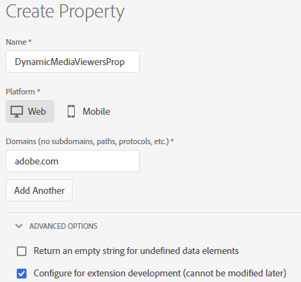

# Integration von Dynamic Media Viewern mit Adobe Analytics und Experience Platform Launch {#integrating-dynamic-media-viewers-with-adobe-analytics-and-adobe-launch}

## Was ist die Integration von Dynamic Media Viewers mit Adobe Analytics und Experience Platform Launch? {#what-is-dynamic-media-viewers-integration-with-adobe-analytics-and-adobe-launch}

Mit der neuen Erweiterung *Dynamic Media Viewers* für Experience Platform Launch und der kürzlich veröffentlichten Version von Dynamic Media Viewers 5.13 können Kunden von Dynamic Media, Adobe Analytics und Experience Platform Launch Ereignis und Daten verwenden, die für die Dynamic Media Viewer in ihrer Experience Platform Launch-Konfiguration spezifisch sind.

Diese Integration sorgt dafür, dass Sie die Nutzung von Dynamic Media-Viewern auf Ihrer Website mit Adobe Analytics verfolgen können. Gleichzeitig können Sie die von den Viewern angezeigten Ereignisse und Daten mit jeder anderen Launch-Erweiterung von Adobe oder einem anderen Drittanbieter verwenden.

Weitere Informationen zu Erweiterungen finden Sie unter [Adobe-Erweiterungen](https://experienceleague.adobe.com/docs/launch/using/extensions-ref/overview.html#adobe-extension) im Experience Platform Launch-Benutzerhandbuch.

**Zielgruppe dieser Dokumentation:** Site-Administratoren, Entwickler, die auf der AEM-Plattform entwickeln, und Betriebsexperten.

### Einschränkungen der Integration {#limitations-of-the-integration}

* Die Experience Platform Launch-Integration für Dynamic Media-Viewer funktioniert nicht im Autorenknoten AEM. Sie können keine Verfolgung einer WCM-Seite anzeigen, bis diese veröffentlicht wurde.
* Die Integration von Experience Platform Launchs in Dynamic Media-Viewer wird nicht für den Popup-Betriebsmodus unterstützt, bei dem die Viewer-URL über die Schaltfläche &quot;URL&quot;auf der Seite &quot;Asset-Details&quot;abgerufen wird.
* Die Integration von Experience Platform Launchs kann nicht gleichzeitig mit der Analytics-Integration älterer Viewer verwendet werden (über den Parameter `config2=`).
* Unterstützung für das Video-Tracking ist auf das Core-Wiedergabe-Tracking beschränkt, wie unter [Tracking-Übersicht](https://experienceleague.adobe.com/docs/media-analytics/using/sdk-implement/track-av-playback/track-core-overview.html#player-events) beschrieben. Insbesondere wird die Verfolgung von QoS, Anzeigen, Kapiteln/Segmenten oder Fehlern nicht unterstützt.
* Die Konfiguration der Speicherdauer für Datenelemente wird bei Datenelementen, die die Erweiterung *Dynamic Media-Viewer* verwenden, nicht unterstützt. Die Speicherdauer muss auf **[!UICONTROL Ohne]** eingestellt sein.

### Anwendungsbeispiele für die Integration {#use-cases-for-the-integration}

Der primäre Anwendungsfall für die Integration mit Experience Platform Launch sind Kunden, die sowohl AEM Assets als auch AEM Sites verwenden. In solchen Fällen können Sie eine Standardintegration zwischen Ihrem AEM Autorenknoten und Ihrem Experience Platform Launch einrichten und dann Ihre Sites-Instanz mit der Experience Platform Launch-Eigenschaft verknüpfen. Danach verfolgt jede Dynamic Media-WCM-Komponente, die einer Sites-Seite hinzugefügt wird, Daten und Ereignisse von Viewern.

Siehe [Informationen zum Verfolgen von Dynamic Media-Viewern in AEM Sites](https://wiki.corp.adobe.com/display/~oufimtse/Dynamic+Media+Viewers+integration+with+Adobe+Launch#DynamicMediaViewersintegrationwithAdobeLaunch-TrackingDynamicMediaViewersinAEMSites).

Ein sekundäres Anwendungsbeispiel, das die Integration unterstützt, sind Kunden, die nur AEM Assets oder Dynamic Media Classic verwenden. In solchen Fällen können Sie den Einbettungs-Code für Ihren Viewer abrufen und der Web-Seite hinzufügen. Rufen Sie dann die Produktions-URL der Experience Platform Launch-Bibliothek von Experience Platform Launch ab und fügen Sie sie manuell zum Webseitencode hinzu.

Siehe [Informationen zum Verfolgen von Dynamic Media-Viewern mit Einbettungs-Code](https://wiki.corp.adobe.com/display/~oufimtse/Dynamic+Media+Viewers+integration+with+Adobe+Launch#DynamicMediaViewersintegrationwithAdobeLaunch-TrackingDynamicMediaViewersusingEmbedcode).

## Funktionsweise der Daten- und Ereignisverfolgung in der Integration {#how-data-and-event-tracking-works-in-the-integration}

Die Integration nutzt zwei separate und unabhängige Typen der Verfolgung von Dynamic Media-Viewern: *Adobe Analytics* und *Adobe Analytics for Audio and Video*.

### Informationen zum Tracking mit Adobe Analytics {#about-tracking-using-adobe-analytics}

Mit Adobe Analytics können Sie Aktionen verfolgen, die vom Endbenutzer bei der Interaktion mit Dynamic Media-Viewern auf Ihrer Website ausgeführt werden. Mit Adobe Analytics können Sie außerdem Viewer-spezifische Daten verfolgen. Beispielsweise können Sie Ladeereignisse der Ansicht zusammen mit dem Asset-Namen, vorgenommenen Zoom-Aktionen, Videowiedergabeaktionen usw. verfolgen und aufzeichnen.

In Experience Platform Launch arbeiten die Konzepte von *Datenelemente* und *Regeln* zusammen, um die Adobe Analytics-Verfolgung zu ermöglichen.

#### Datenelemente in Experience Platform Launch {#about-data-elements-in-adobe-launch}

Ein Datenelement in Experience Platform Launch ist eine benannte Eigenschaft, deren Wert entweder statisch definiert oder basierend auf dem Status einer Webseite oder Dynamic Media Viewer-Daten dynamisch berechnet wird.

Die für eine Datenelementdefinition verfügbaren Optionen hängen von der Liste der Erweiterungen ab, die in der Experience Platform Launch-Eigenschaft installiert sind. Die Erweiterung „Core“ ist vorinstalliert und in jeder Konfiguration standardmäßig verfügbar. Mit dieser Erweiterung „Core“ können Sie ein Datenelement definieren, dessen Wert aus Cookies, JavaScript-Code, Abfragezeichenfolgen und vielen anderen Quellen stammen kann.

Für das Tracking mit Adobe Analytics müssen mehrere zusätzliche Erweiterungen installiert werden, wie unter [Installation und Einrichtung von Erweiterungen](#installing-and-setup-of-extensions) beschrieben. Die Erweiterung „Dynamic Media-Viewer“ bietet die Möglichkeit, ein Datenelement zu definieren, dessen Wert ein Argument des Dynamic Media-Viewer-Ereignisses ist. Beispielsweise können Sie auf den Viewer-Typ oder den Asset-Namen, der vom Viewer beim Laden gemeldet wird, auf den Zoom-Faktor, der beim Zoomen durch Endbenutzer gemeldet wird, und vieles mehr verweisen.

Die Erweiterung „Dynamic Media-Viewer“ sorgt dafür, dass die Werte der Datenelemente automatisch auf dem neuesten Stand sind.

Nachdem Sie es definiert haben, kann ein Datenelement an anderen Stellen der Benutzeroberfläche des Experience Platform Launchs mithilfe des Widgets &quot;Datenelementauswahl&quot;verwendet werden. Insbesondere wird von der Aktion „Variablen festlegen“ der Adobe Analytics-Erweiterung in Regel auf Datenelemente verwiesen, die für die Verfolgung von Dynamic Media-Viewern definiert werden (siehe unten).

Weitere Informationen dazu finden Sie unter [Datenelemente](https://experienceleague.adobe.com/docs/launch/using/reference/manage-resources/data-elements.html#reference) im Experience Platform Launch-Benutzerhandbuch.

#### Info zu Regeln in Experience Platform Launch {#about-rules-in-adobe-launch}

Eine Regel im Experience Platform Launch ist eine agnostische Konfiguration, die drei Regelbereiche definiert: *Ereignis*, *Conditions* und *Aktionen*:

* *Ereignis* (if) geben dem Experience Platform Launch an, wann eine Regel Trigger werden soll.
* *Bedingungen* (falls) teilen Experience Platform Launch mit, welche zusätzlichen Einschränkungen zulässig oder nicht zulässig sind, wenn eine Regel ausgelöst wird.
* *Mit Aktionen*  (dann) wird dem Experience Platform Launch mitgeteilt, wie er vorgehen soll, wenn eine Regel ausgelöst wird.

Die Optionen, die im Abschnitt &quot;Ereignis&quot;, &quot;Bedingungen&quot;und &quot;Aktionen&quot;verfügbar sind, hängen von den Erweiterungen ab, die in der Eigenschaft &quot;Experience Platform Launch&quot;installiert sind. Die Erweiterung *Core* ist vorinstalliert und in jeder Konfiguration standardmäßig verfügbar. Die Erweiterung bietet verschiedene Optionen für Ereignisse, wie zum Beispiel grundlegende Aktionen auf der Browser-Ebene, inklusive Fokuswechsel, Tastendruck, Formularübermittlung usw. Sie enthält zudem Optionen für Bedingungen, wie z. B. Cookie-Wert, Browser-Typ und mehr. Für Aktionen steht nur die Option „Benutzerspezifischer Code“ zur Verfügung.

Für das Tracking mit Adobe Analytics müssen mehrere zusätzliche Erweiterungen installiert werden, wie unter [Installation und Einrichtung von Erweiterungen](#installing-and-setup-of-extensions) beschrieben. Insbesondere gilt:

* Die Erweiterung „Dynamic Media-Viewer“ erweitert die Liste der unterstützten Ereignisse auf Ereignisse, die für Dynamic Media-Viewer spezifisch sind, z. B. Laden des Viewers, Austauschen von Assets, Vergrößern und Abspielen von Videos.
* Die Adobe Analytics-Erweiterung erweitert die Liste der unterstützten Aktionen um zwei Aktionen, die zum Senden von Daten an Tracking-Server erforderlich sind: *Variablen festlegen* und *Beacon senden*.

Bei der Verfolgung von Dynamic Media-Viewern ist es möglich, einen der folgenden Typen zu verwenden:

* Ereignisse aus der Erweiterung „Dynamic Media-Viewer“, der Core-Erweiterung oder einer anderen Erweiterung.
* Bedingungen in der Regeldefinition. Alternativ können Sie den Bedingungsbereich leer lassen.

Im Abschnitt „Aktionen“ müssen Sie über die Aktion *Variablen festlegen* verfügen. Diese Aktion teilt Adobe Analytics mit, wie Tracking-Variablen mit Daten ausgefüllt werden. Gleichzeitig sendet die Aktion *Variablen festlegen* nichts an den Tracking-Server.

Auf die Aktion *Variablen festlegen* muss eine Aktion vom Typ *Beacon senden* folgen. Mit der Aktion *Beacon senden* werden tatsächlich Daten an den Analytics-Tracking-Server gesendet. Beide Aktionen (*Variablen festlegen* und *Beacon senden*) kommen aus der Adobe Analytics-Erweiterung.

Weitere Informationen finden Sie unter [Regeln](https://experienceleague.adobe.com/docs/launch/using/reference/manage-resources/rules.html#reference) im Experience Platform Launch-Benutzerhandbuch.

#### Beispielkonfiguration {#sample-configuration}

Die folgende Beispielkonfiguration in Experience Platform Launch zeigt, wie ein Asset-Name beim Laden des Viewers verfolgt wird.

1. Definieren Sie auf der Registerkarte **[!UICONTROL Datenelemente]** ein Datenelement `AssetName`, das auf den `asset`-Parameter des `LOAD`-Ereignisses in der Erweiterung „Dynamic Media-Viewer“ verweist.

   

1. Definieren Sie auf der Registerkarte **[!UICONTROL Regeln]** eine Regel für *TrackAssetOnLoad*.

   In dieser Regel verwendet das Feld **[!UICONTROL Ereignis]** das **[!UICONTROL LOAD]**-Ereignis aus der Erweiterung „Dynamic Media-Viewer“.

   

1. Die Aktionskonfiguration umfasst zwei Aktionstypen aus der Adobe Analytics-Erweiterung:

   *Variablen festlegen*, wodurch eine Analytics-Variable Ihrer Wahl dem Wert des Datenelements `AssetName` zugeordnet wird;

   *Beacon senden*, wodurch Tracking-Daten an Adobe Analytics gesendet werden.

   

1. Die daraus resultierende Regelkonfiguration sieht wie folgt aus:

   

### Informationen zu Adobe Analytics for Audio and Video {#about-adobe-analytics-for-audio-and-video}

Wenn für die Verwendung von Adobe Analytics for Audio and Video ein Experience Cloud-Konto abonniert wird, reicht es, in den Einstellungen der Erweiterung *Dynamic Media-Viewer* das Video-Tracking zu aktivieren. Videometriken werden so in Adobe Analytics verfügbar. Video-Tracking ist auf die Erweiterung „Adobe Media Analytics for Audio and Video“ angewiesen.

Siehe [Installation und Einrichtung von Erweiterungen](#installing-and-setup-of-extensions).

Derzeit ist die Unterstützung für Video-Tracking auf das Tracking „Core-Wiedergabe“ beschränkt, wie in der [Tracking-Übersicht](https://experienceleague.adobe.com/docs/media-analytics/using/sdk-implement/track-av-playback/track-core-overview.html#player-events) beschrieben. Insbesondere wird die Verfolgung von QoS, Anzeigen, Kapiteln/Segmenten oder Fehlern nicht unterstützt.

## Verwenden der Erweiterung „Dynamic Media-Viewer“ {#using-the-dynamic-media-viewers-extension}

Wie unter [Anwendungsfälle für die Integration](#use-cases-for-the-integration) erwähnt, ist es möglich, Dynamic Media-Viewer mit der neuen Experience Platform Launch-Integration in AEM Sites und mithilfe von Einbettungscode zu verfolgen.

### Verfolgen von Dynamic Media-Viewern in AEM Sites {#tracking-dynamic-media-viewers-in-aem-sites}

Zur Verfolgung von Dynamic Media-Viewern in AEM Sites müssen alle Schritte ausgeführt werden, die im Abschnitt [Konfigurieren aller Integrationselemente](#configuring-all-the-integration-pieces) aufgeführt sind. Insbesondere müssen Sie die IMS-Konfiguration und die Experience Platform Launch Cloud-Konfiguration erstellen.

Nach ordnungsgemäßer Konfiguration verfolgt jeder Dynamic Media-Viewer, den Sie einer Sites-Seite mithilfe einer von Dynamic Media unterstützten WCM-Komponente hinzufügen, automatisch Daten für Adobe Analytics oder Adobe Analytics for Video oder beides.

Siehe [Hinzufügen von Dynamic Media-Assets zu Seiten mit Adobe Sites](/help/assets/dynamic-media/adding-dynamic-media-assets-to-pages.md).

### Verfolgen von Dynamic Media-Viewern mit Einbettungs-Code {#tracking-dynamic-media-viewers-using-embed-code}

Kunden, die AEM Sites nicht verwenden oder Dynamic Media-Viewer nicht in Webseiten außerhalb von AEM Sites oder beides einbetten, können weiterhin die Experience Platform Launch-Integration verwenden.

Sie müssen die Konfigurationsschritte in den Abschnitten [Konfigurieren von Adobe Analytics](#configuring-adobe-analytics-for-the-integration) und [Konfigurieren von Experience Platform Launch](#configuring-adobe-launch-for-the-integration) ausführen. AEM-bezogene Konfigurationsschritte sind jedoch nicht erforderlich.

Nach ordnungsgemäßer Konfiguration können Sie einer Webseite mit einem Dynamic Media-Viewer Experience Platform Launch-Unterstützung hinzufügen.

Weitere Informationen zur Verwendung des Einbettungscodes in der Experience Platform Launch-Bibliothek finden Sie unter [Hinzufügen Einbettungscode starten](https://experienceleague.adobe.com/docs/launch-learn/implementing-in-websites-with-launch/configure-launch/launch-add-embed.html#configure-launch).

Weitere Informationen zur Verwendung der Einbettungs-Code-Funktion von AEM Dynamic Media finden Sie unter [Einbetten des Video- oder Bild-Viewers auf einer Web-Seite](/help/assets/dynamic-media/embed-code.md) .

**So verfolgen Sie Dynamic Media-Viewer mit Einbettungs-Code**

1. Verwenden Sie eine Web-Seite, die bereit zum Einbetten eines Dynamic Media-Viewers ist.
1. Rufen Sie den Einbettungscode für die Experience Platform Launch-Bibliothek ab, indem Sie sich zuerst bei Experience Platform Launch anmelden (siehe [Experience Platform Launch konfigurieren](#configuring-adobe-launch-for-the-integration)).
1. Klicken Sie auf **[!UICONTROL Eigenschaften]** und dann auf die Registerkarte **[!UICONTROL Umgebungen]**.
1. Wählen Sie die für die Umgebung der Web-Seite relevante Umgebungsebene aus. Klicken Sie dann in der Spalte **[!UICONTROL Installieren]** auf das Kontrollkästchen.
1. **[!UICONTROL Kopieren Sie im]** Dialogfeld &quot;Webinstallationsanweisungen&quot;den Einbettungscode der gesamten Experience Platform Launch-Bibliothek zusammen mit den umliegenden  `<script/>` Tags.

## Referenzhandbuch für die Erweiterung „Dynamic Media-Viewer“ {#reference-guide-for-the-dynamic-media-viewers-extension}

### Über die Konfiguration der Dynamic Media-Viewer {#about-the-dynamic-media-viewers-configuration}

Die Dynamic Media Viewer Extension wird automatisch in die Experience Platform Launch-Bibliothek integriert, wenn alle folgenden Bedingungen erfüllt sind:

* Globales Experience Platform Launch-Bibliotheksobjekt ( `_satellite`) ist auf der Seite vorhanden.
* Die Erweiterungsfunktion für „Dynamic Media-Viewer“ `_dmviewers_v001()` ist für `_satellite` definiert.

* Der Viewer-Parameter `config2=` wurde nicht angegeben. Das bedeutet, dass der Viewer keine ältere Analytics-Integration verwendet.

Darüber hinaus gibt es die Möglichkeit, die Integration von Experience Platform Launchs im Viewer explizit zu deaktivieren, indem Sie in der Viewer-Konfiguration den Parameter `launch=0` angeben. Der Standardwert dieses Parameters ist `1`.

### Konfigurieren der Erweiterung „Dynamic Media-Viewer“ {#configuring-the-dynamic-media-viewers-extension}

Die einzige Konfigurationsoption für die Erweiterung „Dynamic Media-Viewer“ ist **[!UICONTROL Adobe Media Analytics for Audio and Video aktivieren]**.

Wenn Sie diese Option aktivieren und die Erweiterung Adobe Media Analytics for Audio and Video installiert sowie ordnungsgemäß konfiguriert haben, werden Videowiedegabemetriken an die Lösung Adobe Analytics for Audio and Video gesendet. Durch Deaktivieren dieser Option wird das Video-Tracking deaktiviert.

Wenn Sie diese Option aktivieren, *ohne* die Erweiterung Adobe Media Analytics for Audio and Video installiert zu haben, hat diese Option keine Auswirkungen.

### Datenelemente in der Erweiterung „Dynamic Media-Viewer“ {#about-data-elements-in-the-dynamic-media-viewers-extension}

Der einzige Datenelementtyp, den die Erweiterung „Dynamic Media-Viewer“ bietet, ist **[!UICONTROL Viewer-Ereignis]** aus der Dropdown-Liste **[!UICONTROL Datenelementtyp]**.

Wenn diese Option aktiviert ist, rendert der Datenelement-Editor ein Formular mit zwei Feldern:

* **[!UICONTROL Ereignisdatentyp DM-Viewer]** – eine Dropdown-Liste, die alle Viewer-Ereignisse identifiziert, die von der Erweiterung „Dynamic Media-Viewer“ unterstützt werden und Argumente sowie ein spezielles **[!UICONTROL COMMON]**-Element aufweisen. Ein **[!UICONTROL COMMON]**-Element stellt eine Liste von Ereignisparametern dar, die allen von den Viewern gesendeten Ereignistypen gemein sind.
* **[!UICONTROL Tracking-Parameter]** – ein Argument des ausgewählten Dynamic Media-Viewer-Ereignisses.

Eine Liste der unterstützten Ereignisse nach Viewer-Typ finden Sie im [Dynamic Media-Viewer-Referenzhandbuch](https://experienceleague.adobe.com/docs/dynamic-media-developer-resources/library/viewers-aem-assets-dmc/c-html5-s7-aem-asset-viewers.html). Konsultieren Sie den Abschnitt zum gewünschten Viewer und klicken Sie auf den Unterabschnitt „Support für Tracking mit Adobe Analytics“. Derzeit sind Ereignisargumente im Referenzhandbuch für Dynamic Media-Viewer nicht dokumentiert.

Betrachten wir nun den Lebenszyklus des *Datenelements* von „Dynamic Media-Viewer“. Der Wert dieses Datenelements wird ausgefüllt, nachdem das entsprechende Dynamic Media-Viewers-Ereignis auf der Seite eintritt. Wenn das Datenelement beispielsweise auf das **[!UICONTROL LOAD]**-Ereignis und dessen „asset“-Argument verweist, erhält der Wert dieses Datenelements gültige Daten, sobald der Viewer das LOAD-Ereignis zum ersten Mal ausführt. Wenn das Datenelement auf das **[!UICONTROL ZOOM]**-Ereignis und das zugehörige „scale“-Argument verweist, bleibt der Wert dieses Datenelements leer, bis der Viewer zum ersten Mal ein **[!UICONTROL ZOOM]**-Ereignis sendet.

Gleichermaßen werden die Werte von Datenelementen automatisch aktualisiert, wenn der Viewer ein entsprechendes Ereignis auf der Seite sendet. Der Wert wird auch dann aktualisiert, wenn das betreffende Ereignis nicht in der Regelkonfiguration angegeben ist. Wenn das Datenelement **[!UICONTROL ZoomScale]** beispielsweise für den „scale“-Parameter des ZOOM-Ereignisses definiert ist, die einzige in der Regelkonfiguration vorhandene Regel jedoch vom **[!UICONTROL LOAD]**-Ereignis ausgelöst wird, wird der Wert von **[!UICONTROL ZoomScale]** dennoch jedes Mal aktualisiert, wenn ein Benutzer im Viewer den Zoom verwendet.

Jeder Dynamic Media-Viewer verfügt auf der Web-Seite über eine eindeutige Kennung. Das Datenelement verfolgt den Wert selbst und auch den Viewer, der den Wert ausgefüllt hat. Das bedeutet, dass bei mehreren Viewern auf derselben Seite und einem Datenelement **[!UICONTROL AssetName]**, das auf das **[!UICONTROL LOAD]**-Ereignis und das „asset“-Argument verweist, das Datenelement **[!UICONTROL AssetName]** eine Sammlung von Asset-Namen pflegt, die den einzelnen auf der Seite geladenen Viewern zugeordnet sind.

Der jeweilige vom Datenelement zurückgegebene Wert hängt vom Kontext ab. Wenn das Datenelement in einer Regel angefordert wird, die durch ein Dynamic Media-Viewer-Ereignis ausgelöst wurde, wird der Datenelementwert für den Viewer zurückgegeben, der die Regel initiiert hat. Wenn das Datenelement in einer Regel angefordert wird, die durch ein Ereignis aus einer anderen Experience Platform Launch-Erweiterung ausgelöst wurde, dann ist der Wert des Datenelements der Wert des Viewers, der als letzter dieses Datenelement aktualisiert hat.

**Betrachten Sie die folgende Beispieleinrichtung**:

* eine Web-Seite mit zwei Dynamic Media-Zoom-Viewern; wir werden sie als *Viewer1* und *Viewer2* bezeichnen.

* Das Datenelement **[!UICONTROL ZoomScale]** verweist auf das **[!UICONTROL ZOOM]**-Ereignis und das zugehörige „scale“-Argument.
* **[!UICONTROL TrackPan]**-Regel mit folgenden Eigenschaften:

   * Verwendet das Dynamic Media-Viewer-Ereignis **[!UICONTROL PAN]** als Auslöser.
   * Sendet den Wert des **[!UICONTROL ZoomScale]**-Datenelements an Adobe Analytics.

* **[!UICONTROL TrackKey]**-Regel mit folgenden Eigenschaften:

   * Verwendet das Ereignis der Tastenpresse aus der Core Experience Platform Launch Extension als Trigger.
   * Sendet den Wert des **[!UICONTROL ZoomScale]**-Datenelements an Adobe Analytics.

Nehmen wir nun an, dass der Endbenutzer die Web-Seite mit beiden Viewern lädt. In *Viewer1* zoomt er auf eine Skalierung von 50 %. In *Viewer2* zoomt er dann auf eine Skalierung von 25 %. In *Viewer1* schwenkt er das Bild und drückt schließlich eine Taste auf der Tastatur.

Die Aktivitäten des Endbenutzers führen dazu, dass die folgenden beiden Tracking-Aufrufe an Adobe Analytics gesendet werden:

* Der erste Aufruf erfolgt, weil die **[!UICONTROL TrackPan]**-Regel ausgelöst wird, wenn der Benutzer in *Viewer1* schwenkt. Dieser Aufruf sendet 50 % als Wert des **[!UICONTROL ZoomScale]**-Datenelements, da das Datenelement weiß, dass die Regel von *Viewer1* ausgelöst wird, und den entsprechenden Skalierungswert abruft.
* Der zweite Aufruf erfolgt, weil die **[!UICONTROL TrackKey]**-Regel ausgelöst wird, wenn der Benutzer eine Taste auf der Tastatur drückt. Bei diesem Aufruf werden 25 % als Wert des **[!UICONTROL ZoomScale]**-Datenelements gesendet, da die Regel nicht vom Viewer ausgelöst wurde. Daher gibt das Datenelement den aktuellsten Wert zurück.

Das oben aufgestellte Beispiel wirkt sich auch auf die Lebensdauer des Datenelementwerts aus. Der Wert des vom Dynamic Media Viewer verwalteten Datenelements wird auch dann im Experience Platform Launch-Bibliothekscode gespeichert, wenn der Viewer selbst auf der Webseite abgelegt wird. Wenn es also eine Regel gibt, die von einer Nicht-Dynamic Media-Viewer-Erweiterung ausgelöst wird und auf ein solches Datenelement verweist, gibt das Datenelement den letzten bekannten Wert zurück, selbst wenn der Viewer auf der Web-Seite nicht mehr vorhanden ist.

In jedem Fall werden die von Dynamic Media Viewern angetriebenen Datenelementwerte nicht auf der lokalen Datenspeicherung oder auf dem Server gespeichert. Sie werden stattdessen nur in der clientseitigen Experience Platform Launch-Bibliothek gespeichert. Die Werte solcher Datenelemente verschwinden, wenn die Web-Seite neu geladen wird.

Im Allgemeinen unterstützt der Datenelement-Editor eine [Festlegung der Speicherdauer](https://experienceleague.adobe.com/docs/launch/using/reference/manage-resources/data-elements.html?lang=en#create-a-data-element). Datenelemente, die die Erweiterung „Dynamic Media-Viewer“ verwenden, unterstützen jedoch als Speicherdauer nur die Option **[!UICONTROL Ohne]**. Das Festlegen eines anderen Werts ist in der Benutzeroberfläche möglich, in diesem Fall wird jedoch das Verhalten des Datenelements nicht definiert. Die Erweiterung verwaltet den Wert des Datenelements selbst: das Datenelement, das den Wert des Viewer-Ereignisarguments während des gesamten Lebenszyklus des Viewers beibehält.

### Über Regeln in der Erweiterung „Dynamic Media-Viewer“ {#about-rules-in-the-dynamic-media-viewers-extension}

Im Regeleditor werden mit der Erweiterung neue Konfigurationsoptionen für den Ereigniseditor hinzugefügt. Darüber hinaus gibt es eine Option zum manuellen Verweisen auf Ereignisparameter im Aktionseditor als schnelle Alternative zur Nutzung vorkonfigurierter Datenelemente.

#### Über den Ereigniseditor {#about-the-events-editor}

Im Ereigniseditor wird mit der Erweiterung „Dynamic Media-Viewer“ ein neuer **[!UICONTROL Ereignistyp]** namens **[!UICONTROL Viewer-Ereignis]** hinzugefügt.

Wenn diese Option aktiviert ist, rendert der Ereigniseditor die Dropdown-Liste **[!UICONTROL Dynamic Media-Viewer-Ereignisse]** und listet alle verfügbaren Ereignisse auf, die von Dynamic Media-Viewern unterstützt werden.

#### Über den Aktionseditor {#about-the-actions-editor}

Mit der Erweiterung „Dynamic Media-Viewer“ können Sie Ereignisparameter von Dynamic Media-Viewern verwenden, um im Editor „Variablen festlegen“ der Adobe Analytics-Erweiterung Analysevariablen zuzuordnen.

Die einfachste Methode dazu besteht darin, den folgenden zweistufigen Vorgang durchzuführen:

* Definieren Sie zunächst ein oder mehrere Datenelemente, wobei jedes Datenelement einen Parameter eines Dynamic Media-Viewer-Ereignisses darstellt.
* Klicken Sie dann im Editor „Variablen festlegen“ der Adobe Analytics-Erweiterung auf das Symbol für die Datenelementauswahl (drei gestapelte Festplatten), um das Dialogfeld „Datenelement auswählen“ zu öffnen; wählen Sie dann ein Datenelement aus.

Es ist jedoch möglich, einen anderen Ansatz zu verwenden und die Erstellung von Datenelementen zu umgehen. Sie können auch direkt aus einem Dynamic Media-Viewer-Ereignis auf ein Argument verweisen, indem Sie den vollständig qualifizierten Namen des Ereignisarguments in das Eingabefeld **[!UICONTROL Wert]** der Analytics-Variablenzuweisung eingeben, umgeben von Prozentzeichen (%). Beispiel:

`%event.detail.dm.LOAD.asset%`

Beachten Sie, dass es einen wichtigen Unterschied zwischen der Verwendung von Datenelementen und dem direkten Verweis auf ein Ereignisargument gibt. Bei Datenelementen spielt es keine Rolle, welches Ereignis die Aktion „Variablen festlegen“ auslöst. Das Ereignis, das die Regel auslöst, muss nicht mit dem Dynamic Media-Viewer in Zusammenhang stehen (wie ein Mausklick auf die Web-Seite aus der Core-Erweiterung). Bei Verwendung eines direkten Argumentverweises muss jedoch sichergestellt werden, dass das Ereignis, das die Regel auslöst, dem Ereignisargument entspricht, auf das es verweist.

Wenn Sie beispielsweise auf `%event.detail.dm.LOAD.asset%` verweisen, wird der richtige Asset-Name zurückgegeben, wenn die Regel durch das **[!UICONTROL LOAD]**-Ereignis der Dynamic Media-Viewer-Erweiterung ausgelöst wird. Bei jedem anderen Ereignis wird jedoch ein leerer Wert zurückgegeben.

In der folgenden Tabelle sind die Dynamic Media-Viewer-Ereignisse sowie die unterstützten Argumente aufgeführt:

<table>
 <tbody>
  <tr>
   <td>Name des Viewer-Ereignisses</td>
   <td>Argumentverweis</td>
  </tr>
  <tr>
   <td><code>COMMON</code></td>
   <td><code>%event.detail.dm.objID%</code></td>
  </tr>
  <tr>
   <td> </td>
   <td><code>%event.detail.dm.compClass%</code></td>
  </tr>
  <tr>
   <td> </td>
   <td><code>%event.detail.dm.instName%</code></td>
  </tr>
  <tr>
   <td> </td>
   <td><code>%event.detail.dm.timeStamp%</code></td>
  </tr>
  <tr>
   <td><code>BANNER</code> </td>
   <td><code>%event.detail.dm.BANNER.asset%</code></td>
  </tr>
  <tr>
   <td> </td>
   <td><code>%event.detail.dm.BANNER.frame%</code></td>
  </tr>
  <tr>
   <td> </td>
   <td><code>%event.detail.dm.BANNER.label%</code></td>
  </tr>
  <tr>
   <td><code>HREF</code></td>
   <td><code>%event.detail.dm.HREF.rollover%</code></td>
  </tr>
  <tr>
   <td><code>ITEM</code></td>
   <td><code>%event.detail.dm.ITEM.rollover%</code></td>
  </tr>
  <tr>
   <td><code>LOAD</code></td>
   <td><code>%event.detail.dm.LOAD.applicationname%</code></td>
  </tr>
  <tr>
   <td><strong> </strong></td>
   <td><code>%event.detail.dm.LOAD.asset%</code></td>
  </tr>
  <tr>
   <td><strong> </strong></td>
   <td><code>%event.detail.dm.LOAD.company%</code></td>
  </tr>
  <tr>
   <td><strong> </strong></td>
   <td><code>%event.detail.dm.LOAD.sdkversion%</code></td>
  </tr>
  <tr>
   <td><strong> </strong></td>
   <td><code>%event.detail.dm.LOAD.viewertype%</code></td>
  </tr>
  <tr>
   <td><strong> </strong></td>
   <td><code>%event.detail.dm.LOAD.viewerversion%</code></td>
  </tr>
  <tr>
   <td><code>METADATA</code></td>
   <td><code>%event.detail.dm.METADATA.length%</code></td>
  </tr>
  <tr>
   <td> </td>
   <td><code>%event.detail.dm.METADATA.type%</code></td>
  </tr>
  <tr>
   <td><code>MILESTONE</code></td>
   <td><code>%event.detail.dm.MILESTONE.milestone%</code></td>
  </tr>
  <tr>
   <td><code>PAGE</code></td>
   <td><code>%event.detail.dm.PAGE.frame%</code></td>
  </tr>
  <tr>
   <td> </td>
   <td><code>%event.detail.dm.PAGE.label%</code></td>
  </tr>
  <tr>
   <td><code>PAUSE</code></td>
   <td><code>%event.detail.dm.PAUSE.timestamp%</code></td>
  </tr>
  <tr>
   <td><code>PLAY</code></td>
   <td><code>%event.detail.dm.PLAY.timestamp%</code></td>
  </tr>
  <tr>
   <td><code>SPIN</code></td>
   <td><code>%event.detail.dm.SPIN.framenumber%</code></td>
  </tr>
  <tr>
   <td><code>STOP</code></td>
   <td><code>%event.detail.dm.STOP.timestamp%</code></td>
  </tr>
  <tr>
   <td><code>SWAP</code></td>
   <td><code>%event.detail.dm.SWAP.asset%</code></td>
  </tr>
  <tr>
   <td><code>SWATCH</code></td>
   <td><code>%event.detail.dm.SWATCH.frame%</code></td>
  </tr>
  <tr>
   <td> </td>
   <td><code>%event.detail.dm.SWATCH.label%</code></td>
  </tr>
  <tr>
   <td><code>TARG</code></td>
   <td><code>%event.detail.dm.TARG.frame%</code></td>
  </tr>
  <tr>
   <td> </td>
   <td><code>%event.detail.dm.TARG.label%</code></td>
  </tr>
  <tr>
   <td><code>ZOOM</code></td>
   <td><code>%event.detail.dm.ZOOM.scale%</code></td>
  </tr>
 </tbody>
</table>

## Konfigurieren aller Integrationselemente {#configuring-all-the-integration-pieces}

**Voraussetzungen**

Wenn Sie es noch nicht getan haben, empfiehlt Adobe, vor diesem Abschnitt die gesamte Dokumentation sorgfältig zu prüfen, damit Sie die komplette Integration verstehen.

In diesem Abschnitt werden die Konfigurationsschritte erläutert, die zur Integration von Dynamic Media-Viewern mit Adobe Analytics und Adobe Analytics for Audio and Video erforderlich sind. Auch wenn die Dynamic Media Viewer-Erweiterung für andere Zwecke im Experience Platform Launch verwendet werden kann, werden solche Szenarien in dieser Dokumentation nicht behandelt.

Sie werden die Integration in folgenden Adobe-Produkten konfigurieren:

* Adobe Analytics – Sie konfigurieren Tracking-Variablen und Berichte.
* Experience Platform Launch: Sie definieren eine Eigenschaft, eine oder mehrere Regeln und ein oder mehrere Datenelemente, um die Viewer-Verfolgung zu aktivieren.

Wenn diese Integrationslösung mit AEM Sites verwendet wird, muss außerdem die folgende Konfiguration durchgeführt werden:

* Adobe I/O Console - Die Integration wird für den Experience Platform Launch erstellt.
* AEM Autorenknoten - IMS-Konfiguration und Experience Platform Launch-Cloud-Konfiguration.

Vergewissern Sie sich, dass Sie im Rahmen der Konfiguration Zugriff auf eine Firma in Adobe Experience Cloud haben, für die Adobe Analytics und Experience Platform Launch bereits aktiviert sind.

## Konfigurieren von Adobe Analytics für die Integration {#configuring-adobe-analytics-for-the-integration}

Nach der Konfiguration von Adobe Analytics wird Folgendes für die Integration eingerichtet:

* Eine Report Suite ist vorhanden und ausgewählt.
* Analytics-Variablen stehen zum Empfang von Verfolgungsdaten zur Verfügung.
* Es gibt Berichte zur Anzeige der in Adobe Analytics erfassten Daten.

Siehe auch [Analytics-Implementierungshandbuch](https://experienceleague.adobe.com/docs/analytics/implementation/home.html).

**So konfigurieren Sie Adobe Analytics für die Integration**:

1. Beginnen Sie, indem Sie über die Experience Cloud-[Startseite](https://exc-home.experiencecloud.adobe.com/exc-home/home.html#/) auf Adobe Analytics zugreifen. Klicken Sie in der Menüleiste auf das Symbol „Lösungen“ (eine Tabelle mit drei mal drei Punkten) oben rechts auf der Seite und klicken Sie dann auf **[!UICONTROL Analytics]**.

   

   Wählen Sie jetzt eine Report Suite aus.

### Auswählen einer Report Suite {#selecting-a-report-suite}

1. Wählen Sie rechts oben auf der Seite „Adobe Analytics“ rechts neben dem Feld **[!UICONTROL Berichte durchsuchen]** die gewünschte Report Suite aus der Dropdown-Liste. Wenn mehrere Report Suites verfügbar sind und Sie nicht sicher sind, welche verwendet werden soll, wenden Sie sich an Ihren Adobe Analytics-Administrator, um sich bei der Auswahl der zu verwendenden Report Suite helfen zu lassen.

   In der folgenden Abbildung hat ein Benutzer eine Report Suite mit dem Namen *DynamicMediaViewersExtensionDoc* erstellt und aus der Dropdown-Liste ausgewählt. Der Name der Report Suite dient nur zur Veranschaulichung. Der Name der Report Suite, die Sie letztendlich auswählen, wird anders lauten.

   Wenn keine Report Suite verfügbar ist, müssen Sie oder Ihr Adobe Analytics-Administrator eine erstellen, bevor Sie mit der Konfiguration fortfahren können.

   Siehe [Berichte und Report Suites](https://experienceleague.adobe.com/docs/analytics/admin/manage-report-suites/report-suites-admin.html#manage-report-suites) und [Report Suite erstellen](https://experienceleague.adobe.com/docs/analytics/admin/admin-console/create-report-suite.html#admin-console).

   In Adobe Analytics werden Report Suites unter **[!UICONTROL Admin > Report Suites]** verwaltet.

   

   Nun richten Sie Adobe Analytics-Variablen ein.

### Einrichten von Adobe Analytics-Variablen {#setting-up-adobe-analytics-variables}

1. Sie bestimmen jetzt eine oder mehrere Adobe Analytics-Variablen, die Sie zur Verfolgung des Verhaltens von Dynamic Media-Viewern auf der Web-Seite verwenden möchten.

   Es lassen sich beliebige Variablentypen verwenden, die von Adobe Analytics unterstützt werden. Die Entscheidung über den Variablentyp (z. B. Custom Traffic [props] und Konversion [eVar]) sollte von spezifischen Anforderungen Ihrer Analytics-Implementierung abhängen.

   Siehe [Übersicht über props und eVars](https://experienceleague.adobe.com/docs/analytics/implementation/vars/page-vars/evar.html#vars).

   Für die Zwecke dieser Dokumentation wird nur eine Variable „Custom Traffic (props)“ verwendet, da diese in einem Analytics-Bericht innerhalb weniger Minuten nach dem Ausführen einer Aktion auf einer Web-Seite verfügbar ist.

   Um eine neue Custom Traffic-Variable zu aktivieren, klicken Sie in Adobe Analytics in der Symbolleiste auf **[!UICONTROL Admin > Report Suites]**.

1. Wählen Sie auf der Seite **[!UICONTROL Report Suite Manager]** den gewünschten Bericht aus und klicken Sie dann in der Symbolleiste auf **[!UICONTROL Einstellungen bearbeiten > Traffic > Traffic-Variablen]**.
1. Hier wählen Sie eine nicht verwendete Variable, geben ihr einen beschreibenden Namen (**[!UICONTROL Viewer-Asset (prop 30)]**) und setzen das Kombinationsfeld in der Spalte „Aktiviert“ auf „Aktiviert“.

   Der folgende Screenshot ist ein Beispiel für eine Custom Traffic-Variable ( **[!UICONTROL prop30]**) zur Verfolgung eines vom Viewer verwendeten Asset-Namens:

   

1. Klicken Sie unten in der Variablenliste auf **[!UICONTROL Speichern]**.

### Einrichten eines Berichts {#setting-up-a-report}

1. Im Allgemeinen wird die Einrichtung eines Berichts in Adobe Analytics von den jeweiligen Projektanforderungen bestimmt. Die Einrichtung detaillierter Berichte ist daher für diese Integration nicht relevant.

   Es ist ausreichend zu wissen, dass Custom Traffic-Berichte automatisch in Adobe Analytics verfügbar werden, nachdem Sie unter **[Einrichten von Adobe Analytics-Variablen](#setting-up-adobe-analytics-variables)** Custom Traffic-Variablen eingerichtet haben.

   Beispielsweise ist der Bericht für **[!UICONTROL Viewer-Asset (prop 30)]** im Menü „Berichte“ unter **[!UICONTROL Custom Traffic > Custom Traffic 21-30 > Viewer-Asset (prop 30)]** verfügbar.

   Beim Aufrufen dieses Berichts direkt nach der Erstellung von **[!UICONTROL Viewer-Asset (prop 30)]** werden keine Daten angezeigt; das ist an diesem Punkt der Integration zu erwarten.

   

## Konfigurieren von Experience Platform Launch für die Integration {#configuring-adobe-launch-for-the-integration}

Nach der Konfiguration von Experience Platform Launch wird Folgendes für die Integration eingerichtet:

* Erstellung einer neuen Eigenschaft, um alle Konfigurationen zusammenzuhalten.
* Installation und Einrichtung von Erweiterungen. Der Client-seitige Code aller in der Eigenschaft installierten Erweiterungen wird in einer Bibliothek kompiliert. Diese Bibliothek wird später von der Web-Seite verwendet.
* Konfiguration von Datenelementen und Regeln. Diese Konfiguration bestimmt darüber, welche Daten von den Dynamic Media-Viewern erfasst werden, wann die Tracking-Logik ausgelöst wird und wohin die Daten des Viewers in Adobe Analytics gesendet werden.
* Veröffentlichen der Bibliothek.

**So konfigurieren Sie den Experience Platform Launch für die Integration**:

1. Beginn durch Zugriff auf Experience Platform Launch aus dem Experience Cloud [Startseite](https://exc-home.experiencecloud.adobe.com/exc-home/home.html#/). Klicken Sie in der Menüleiste auf das Symbol „Lösungen“ (eine Tabelle mit drei mal drei Punkten) oben rechts auf der Seite und klicken Sie dann auf **[!UICONTROL Launch]**.

   Sie können auch [Experience Platform Launch direkt öffnen](https://launch.adobe.com/).

   

### Erstellen einer Eigenschaft in Experience Platform Launch {#creating-a-property-in-adobe-launch}

Eine Eigenschaft in Experience Platform Launch ist eine benannte Konfiguration, die alle Einstellungen zusammenhält. Es wird eine Bibliothek der Konfigurationseinstellungen erstellt und in verschiedenen Umgebungsebenen (Entwicklung, Staging und Produktion) veröffentlicht.

Siehe auch [Eine Starteigenschaft erstellen](https://experienceleague.adobe.com/docs/launch-learn/implementing-in-mobile-android-apps-with-launch/configure-launch/launch-create-a-property.html#configure-launch).

1. Klicken Sie in Experience Platform Launch auf **[!UICONTROL Neue Eigenschaft]**.
1. Geben Sie im Dialogfeld **[!UICONTROL Eigenschaft erstellen]** im Feld **[!UICONTROL Name]** einen beschreibenden Namen ein, z. B. den Titel Ihrer Website. Beispiel: `DynamicMediaViewersProp.`
1. Geben Sie im Feld **[!UICONTROL Domänen]** die Domäne Ihrer Website ein.
1. Aktivieren Sie in der Dropdown-Liste **[!UICONTROL Erweiterte Optionen]** die Option **[!UICONTROL Für Erweiterungsentwicklung konfigurieren (kann später nicht mehr geändert werden)]**, falls die gewünschte Erweiterung (in diesem Fall *Dynamic Media-Viewer*) noch nicht veröffentlicht wurde.

   

1. Klicken Sie auf **[!UICONTROL Speichern]**.

   Klicken Sie auf die neu erstellte Eigenschaft und fahren Sie dann mit der *Installation und Einrichtung von Erweiterungen* fort.

### Installation und Einrichtung von Erweiterungen {#installing-and-setup-of-extensions}

Alle verfügbaren Erweiterungen in Experience Platform Launch werden unter **[!UICONTROL Erweiterungen > Katalog]** aufgelistet.

Um eine Erweiterung zu installieren, klicken Sie auf **[!UICONTROL Installieren]**. Führen Sie bei Bedarf eine einmalige Erweiterungskonfiguration durch und klicken Sie dann auf **[!UICONTROL Speichern]**.

Wenn erforderlich, müssen die folgenden Erweiterungen installiert und konfiguriert werden:

* (Erforderlich) *Experience Cloud ID Service*-Erweiterung

Es ist keine zusätzliche Konfiguration erforderlich; akzeptieren Sie die vorgeschlagenen Werte. Wenn Sie fertig sind, klicken Sie auf **[!UICONTROL Speichern]**.

Siehe [Experience Cloud ID Service-Erweiterung](https://experienceleague.adobe.com/docs/launch/using/extensions-ref/adobe-extension/id-service-extension/overview.html#extensions-ref).

* (Erforderlich) *Adobe Analytics*-Erweiterung

Um diese Erweiterung zu konfigurieren, benötigen Sie zunächst die Report Suite-ID aus Adobe Analytics, die Sie unter **[!UICONTROL Admin > Report Suite]** unter der Spaltenüberschrift **[!UICONTROL Report Suite-ID]** finden können.

(Die Report Suite-ID der Report Suite **[!UICONTROL DynamicMediaViewersExtensionDoc]** wird in den folgenden Screenshots nur zu Demonstrationszwecken verwendet. Diese ID wurde unter [Auswählen einer Report Suite](#selecting-a-report-suite) zuvor erstellt und eingesetzt.)

Geben Sie auf der Seite „Erweiterung installieren“ die Report Suite-ID in das Feld **[!UICONTROL Report Suites Entwicklung]**, das Feld **[!UICONTROL Report Suites Staging]** und das Feld **[!UICONTROL Report Suites Produktion]** ein.

*Konfigurieren Sie das folgende Element nur, wenn Sie Video-Tracking verwenden möchten:*

Erweitern Sie auf der Seite **[!UICONTROL Erweiterung installieren]** den Eintrag **[!UICONTROL Allgemein]** und geben Sie dann den Tracking-Server an. Der Tracking-Server folgt der Vorlage `<trackingNamespace>.sc.omtrdc.net`, wobei `<trackingNamespace>` die in der Bereitstellungs-E-Mail abgerufene Information darstellt.

Klicken Sie auf **[!UICONTROL Speichern]**.

Siehe [Adobe Analytics-Erweiterung](https://experienceleague.adobe.com/docs/launch/using/extensions-ref/adobe-extension/analytics-extension/overview.html#extensions-ref).

* (Optional; nur erforderlich, wenn Video-Tracking benötigt wird) Erweiterung *Adobe Media Analytics for Audio and Video*

Füllen Sie das Feld für den Tracking-Server aus. Der Tracking-Server für die Erweiterung *Adobe Media Analytics for Audio and Video* unterscheidet sich von dem für Adobe Analytics verwendeten Tracking-Server. Er folgt der Vorlage `<trackingNamespace>.hb.omtrdc.net`, wobei `<trackingNamespace>` die Information aus der Bereitstellungs-E-Mail darstellt.

Alle anderen Felder sind optional.

Siehe [Erweiterung Adobe Media Analytics for Audio and Video](https://experienceleague.adobe.com/docs/launch/using/extensions-ref/adobe-extension/media-analytics-extension/overview.html#extensions-ref).

* (Erforderlich) Erweiterung *Dynamic Media-Viewer*

Wählen Sie **[!UICONTROL Adobe Analytics for Video aktivieren]**, um das Video-Heartbeat-Tracking zu aktivieren (einzuschalten).

Beachten Sie, dass die Erweiterung *Dynamic Media Viewers* zum Zeitpunkt des Schreibens nur verfügbar ist, wenn die Experience Platform Launch-Eigenschaft für die Entwicklung erstellt wurde.

Siehe [Erstellen einer Eigenschaft in Experience Platform Launch](#creating-a-property-in-adobe-launch).

Nachdem die Erweiterungen installiert und eingerichtet wurden, werden im Bereich „Erweiterungen“ > „Installiert“ mindestens die folgenden fünf Erweiterungen aufgeführt (vier, wenn Sie kein Video-Tracking nutzen).

### Einrichten von Datenelementen und Regeln {#setting-up-data-elements-and-rules}

Erstellen Sie in Experience Platform Launch Datenelemente und Regeln, die zur Verfolgung von Dynamic Media-Viewern erforderlich sind.

Eine Übersicht über die Verfolgung mit Experience Platform Launch finden Sie unter [Funktionsweise der Daten- und Ereignis-Verfolgung in der Integration](#how-data-and-event-tracking-works-in-the-integration).

Eine Beispielkonfiguration in Experience Platform Launch finden Sie unter [Beispielkonfiguration](#sample-configuration), die zeigt, wie ein Asset-Name beim Laden des Viewers verfolgt wird.

Detaillierte Informationen zu den Funktionen der Erweiterung finden Sie unter [Konfigurieren der Erweiterung „Dynamic Media-Viewer“](#configuring-the-dynamic-media-viewers-extension).

### Veröffentlichen einer Bibliothek {#publishing-a-library}

Um Änderungen an der Konfiguration des Experience Platform Launchs vorzunehmen (einschließlich Eigenschaften, Erweiterungen, Regeln und Datenelemente eingerichtet), müssen Sie *diese Änderungen veröffentlichen*. Die Veröffentlichung in Experience Platform Launch erfolgt über die Registerkarte &quot;Veröffentlichen&quot;unter der Eigenschaftenkonfiguration.

Experience Platform Launch können über mehrere Development-Umgebung, eine Staging-Umgebung und eine Production-Umgebung verfügen. Standardmäßig verweist die Experience Platform Launch Cloud-Konfiguration in AEM auf den Knoten &quot;AEM Autor&quot;auf die Umgebung &quot;Stage&quot;von Experience Platform Launch und auf den Knoten &quot;AEM veröffentlichen&quot;auf die Umgebung &quot;Produktion&quot;von Experience Platform Launch. Diese Vorgehensweise bedeutet, dass die Experience Platform Launch-Bibliothek mit den Standardeinstellungen für AEM in der Staging-Umgebung veröffentlicht werden muss, damit sie in AEM Authoring verwendet werden kann, und dann in der Production-Umgebung veröffentlicht werden kann, damit sie in AEM Veröffentlichung verwendet werden kann.

Weitere Informationen zu Experience Platform Launch-Umgebung finden Sie unter [Umgebung](https://experienceleague.adobe.com/docs/launch/using/reference/publish/environments/environments.html#environment-types).

Das Veröffentlichen einer Bibliothek umfasst die folgenden zwei Schritte:

* Hinzufügen und Erstellen einer neuen Bibliothek, indem alle erforderlichen Änderungen (neue und Aktualisierungen) in die Bibliothek aufgenommen werden.
* Verschieben der Bibliothek durch die verschiedenen Umgebungsebenen (von „Entwicklung“ über „Staging“ zu „Produktion“)

#### Hinzufügen und Erstellen einer neuen Bibliothek {#adding-and-building-a-new-library}

1. Wenn Sie die Registerkarte &quot;Veröffentlichung&quot;in Experience Platform Launch zum ersten Mal öffnen, ist die Liste &quot;Bibliothek&quot;leer.

   Klicken Sie in der linken Spalte auf **[!UICONTROL Neue Bibliothek hinzufügen]**.

   

1. Geben Sie auf der Seite „Neue Bibliothek erstellen“ im Feld **[!UICONTROL Name]** einen beschreibenden Namen für die neue Bibliothek ein. Beispiel:

   *DynamicMediaViewersLib*

   Wählen Sie in der Dropdown-Liste „Umgebung“ die Umgebungsebene aus. Zunächst steht nur die Entwicklungsebene zur Auswahl zur Verfügung. Klicken Sie unten links auf der Seite auf **[!UICONTROL Alle geänderten Ressourcen hinzufügen]**.

   

1. Klicken Sie in der rechten oberen Ecke auf **[!UICONTROL Für Entwicklung speichern und erstellen]**.

   In wenigen Minuten ist die Bibliothek erstellt und einsatzbereit.

   

   >[!NOTE]
   >
   >Wenn Sie das nächste Mal Änderungen an Ihrer Experience Platform Launch-Konfiguration vornehmen, wechseln Sie zur Registerkarte **[!UICONTROL Veröffentlichung]** unter **[!UICONTROL Eigenschaft]** und klicken Sie dann auf Ihre zuvor erstellte Bibliothek.
   >
   >
   >Klicken Sie im Bildschirm zur Bibliotheksveröffentlichung auf **[!UICONTROL Alle geänderten Ressourcen hinzufügen]** und klicken Sie dann auf **[!UICONTROL Für Entwicklung speichern und erstellen]**.

#### Verschieben einer Bibliothek durch Umgebungsebenen {#moving-a-library-up-through-environment-levels}

1. Nachdem Sie eine neue Bibliothek hinzugefügt haben, befindet sich diese zunächst in der Entwicklungsumgebung. Um sie auf die Ebene der Staging-Umgebung (was der Spalte „Gesendet“ entspricht) zu verschieben, klicken Sie im Dropdown-Menü der Bibliothek auf **[!UICONTROL Zur Genehmigung senden]**.

   

1. Klicken Sie im Bestätigungsdialogfeld auf **[!UICONTROL Senden]**.

   Nachdem die Bibliothek in die Spalte „Gesendet“ verschoben wurde, klicken Sie im Dropdown-Menü der Bibliothek auf **[!UICONTROL Für Staging erstellen]**.

   

1. Gehen Sie ähnlich vor, um die Bibliothek aus der Staging-Umgebung in die Produktionsumgebung (Spalte „Veröffentlicht“) zu verschieben.

   Klicken Sie zunächst im Dropdown-Menü auf **[!UICONTROL Veröffentlichung genehmigen]**.

   

1. Klicken Sie im Dropdown-Menü auf **[!UICONTROL Für Produktion erstellen und veröffentlichen]**.

   

   Weitere Informationen zum Veröffentlichungsprozess in Experience Platform Launch finden Sie unter [Veröffentlichung](https://experienceleague.adobe.com/docs/launch/using/reference/publish/overview.html#reference).

## Konfigurieren von Adobe Experience Manager für die Integration {#configuring-adobe-experience-manager-for-the-integration}

<!-- Prerequisites list below should be verified by Sasha -->

Voraussetzungen:

* AEM führt sowohl die Autoren- als auch die Veröffentlichungsinstanz aus.
* Der AEM-Autorenknoten wurde in Dynamic Media eingerichtet. <!-- Scene7 run mode (dynamicmedia_s7) -->
* WCM-Komponenten für Dynamic Media sind in AEM Sites aktiviert.

Die AEM-Konfiguration besteht aus den folgenden zwei Hauptschritten:

* Konfiguration von AEM IMS.
* Konfiguration der Experience Platform Launch Cloud.

### Konfigurieren von AEM IMS {#configuring-aem-ims}

1. Klicken Sie im AEM-Autorenknoten auf das Symbol „Tools“ (Hammer) und dann auf **[!UICONTROL Sicherheit > Adobe IMS-Konfigurationen]**.

   

1. Klicken Sie auf der Seite „Adobe IMC-Konfigurationen“ links oben auf **[!UICONTROL Erstellen]**.
1. Klicken Sie auf der Seite **[!UICONTROL Adobe IMS Technical Account Configuration]** in der Dropdown-Liste **[!UICONTROL Cloud Solution]** auf **[!UICONTROL Experience Platform Launch]**.
1. Aktivieren Sie **[!UICONTROL Neues Zertifikat erstellen]** und geben Sie dann in das Textfeld einen beliebigen aussagekräftigen Wert für das Zertifikat ein. Beispiel: *AdobeLaunchIMSCert*. Klicken Sie auf **[!UICONTROL Zertifikat erstellen]**.

   Die folgende Informationsmeldung wird angezeigt:

   *Um ein gültiges Zugriffs-Token abzurufen, muss der öffentliche Schlüssel des neuen Zertifikats zum technischen Konto in Adobe I/O hinzugefügt werden*.

   Klicken Sie auf **[!UICONTROL OK]**, um das Dialogfeld „Informationen“ zu schließen.

   

1. Klicken Sie auf **[!UICONTROL Öffentlichen Schlüssel herunterladen]**, um eine Public-Key-Datei (`*.crt`) auf Ihr lokales System herunterzuladen.

   >[!NOTE]
   >
   >Lassen Sie ***jetzt*** die Seite **[!UICONTROL Technische Kontokonfiguration für Adobe IMS]** geöffnet; schließen Sie die Seite ***nicht*** und klicken Sie nicht auf ***Weiter***. Sie werden später in den Schritten noch zu dieser Seite zurückkehren.

   

1. Navigieren Sie mit einer neuen Browser-Registerkarte zur [Adobe I/O Console](https://console.adobe.io/integrations).

1. Klicken Sie auf der Seite **[!UICONTROL Adobe I/O Console-Integrationen]** rechts oben auf **[!UICONTROL Neue Integration]**.
1. Vergewissern Sie sich, dass im Dialogfeld **[!UICONTROL Neue Integration erstellen]** die Optionsschaltfläche **[!UICONTROL Zugriff auf API]** ausgewählt ist, und klicken Sie dann auf **[!UICONTROL Weiter]**.

   

1. Aktivieren Sie auf der zweiten Seite von **[!UICONTROL Neue Integration erstellen]** die Optionsschaltfläche **[!UICONTROL Experience Platform Launch-API]**. Klicken Sie in der rechten unteren Ecke der Seite auf **[!UICONTROL Weiter]**.

   

1. Gehen Sie auf der dritten Seite von **[!UICONTROL Neue Integration erstellen]** wie folgt vor:

   * Geben Sie im Feld **[!UICONTROL Name]** einen beschreibenden Namen ein. Beispielsweise *DynamicMediaViewersIO*.

   * Geben Sie im Feld **[!UICONTROL Beschreibung]** eine Beschreibung für die Integration ein.

   * Laden Sie im Bereich **[!UICONTROL Public-Key-Zertifikate]** Ihre Public-Key-Datei (`*.crt`) hoch, die Sie in den Schritten zuvor heruntergeladen haben.

   * Wählen Sie unter der Überschrift **[!UICONTROL Rolle für Experience Platform Launch-API auswählen]** die Option **[!UICONTROL Admin]**.

   * Wählen Sie unter der Überschrift **[!UICONTROL Ein oder mehrere Produktprofile für die Experience Platform Launch-API auswählen]** das Produktprofil **[!UICONTROL Launch – &lt;Name_Ihrer_Firma>]**.

   

1. Klicken Sie auf **[!UICONTROL Integration erstellen]**.
1. Klicken Sie auf der Seite **[!UICONTROL Integration erstellt]** auf **[!UICONTROL Weiter zu Integrationsdetails]**.

   

1. Es wird eine Seite mit Integrationsdetails (ähnlich der folgenden) angezeigt:

   >[!NOTE]
   >
   >***Lassen Sie die Seite mit Integrationsdetails geöffnet***. In wenigen Augenblicken benötigen Sie verschiedene Informationen aus den Registerkarten **[!UICONTROL Übersicht]** und **[!UICONTROL JWT]**.

   
   _Seite „Integrationsdetails“_

1. Kehren Sie zur Seite **[!UICONTROL Technische Kontokonfiguration für Adobe IMS]** zurück, die Sie zuvor offen gelassen haben. Klicken Sie in der rechten oberen Ecke der Seite auf **[!UICONTROL Weiter]**, um die Seite **[!UICONTROL Konto]** im Fenster **[!UICONTROL Technische Kontokonfiguration für Adobe IMS]** zu öffnen.

   Wenn Sie die Seite zuvor versehentlich geschlossen haben, kehren Sie zum AEM-Autorenknoten zurück und klicken Sie auf **[!UICONTROL Tools > Sicherheit > Adobe IMS-Konfigurationen]**. Klicken Sie auf **[!UICONTROL Erstellen]**. Wählen Sie in der Dropdown-Liste **[!UICONTROL Cloud-Lösung]** **[!UICONTROL Experience Platform Launch]**. Wählen Sie in der Dropdown-Liste **[!UICONTROL Zertifikat]** den Namen des zuvor erstellten Zertifikats aus.

   
   _Technische Kontokonfiguration für Adobe IMS – Zertifikatsseite_

1. Die Seite **[!UICONTROL Konto]** enthält fünf Felder, in denen Sie Informationen aus der Seite „Integrationsdetails“ (vorheriger Schritt) ausfüllen müssen.

   
   _Technische Kontokonfiguration für Adobe IMS – Kontoseite_

1. Füllen Sie auf der Seite **[!UICONTROL Konto]** die folgenden Felder aus:

   * **[!UICONTROL Titel]**: Geben Sie einen beschreibenden Kontonamen ein.
   * **[!UICONTROL Autorisierungs-Server]**: Kehren Sie zur Seite mit den Integrationsdetails zurück, die Sie zuvor geöffnet haben. Klicken Sie auf die Registerkarte **[!UICONTROL JWT]**. Kopieren Sie den Server-Namen – ohne Pfad – wie unten hervorgehoben.

(Der Beispiel-Server-Name dient nur zu Veranschaulichungszwecken.)   Kehren Sie zur Seite **[!UICONTROL Konto]** zurück und fügen Sie den Namen in das entsprechende Feld ein.
Beispiel: `https://ims-na1.adobelogin.com/`(Der Beispiel-Server-Name dient nur zu Veranschaulichungszwecken.)

   
   _Seite mit Integrationsdetails - Registerkarte „JWT“_

1. **[!UICONTROL API-Schlüssel]**: Kehren Sie zur Seite „Integrationsdetails“ zurück. Klicken Sie auf die Registerkarte **[!UICONTROL Übersicht]** und dann rechts neben dem Feld **[!UICONTROL API-Schlüssel (Client-ID)]** auf **[!UICONTROL Kopieren]**.

   Kehren Sie zur Seite **[!UICONTROL Konto]** zurück und fügen Sie dann den Schlüssel in das entsprechende Feld ein.

   
   _Seite „Integrationsdetails“_

1. **[!UICONTROL Client-Geheimnis]**: Kehren Sie zur Seite „Integrationsdetails“ zurück. Klicken Sie auf der Registerkarte **[!UICONTROL Übersicht]** auf **[!UICONTROL Client-Geheimnis abrufen]**. Klicken Sie rechts neben dem Feld **[!UICONTROL Client-Geheimnis]** auf **[!UICONTROL Kopieren]**.

   Kehren Sie zur Seite **[!UICONTROL Konto]** zurück und fügen Sie dann den Schlüssel in das entsprechende Feld ein.

1. **[!UICONTROL Payload]**: Kehren Sie zur Seite „Integrationsdetails“ zurück. Kopieren Sie auf der Registerkarte **[!UICONTROL JWT]** im Feld „JWT-Payload“ den gesamten JSON-Objekt-Code.

   Kehren Sie zur Seite **[!UICONTROL Konto]** zurück und fügen Sie den Code in das entsprechende Feld ein.

   
   _Seite mit Integrationsdetails – Registerkarte „JWT“_

   Die Kontoseite mit allen ausgefüllten Feldern sieht wie folgt aus:

   

1. Tippen Sie oben rechts neben **[!UICONTROL Konto]** auf **[!UICONTROL Erstellen]**.

   Wenn AEM IMS konfiguriert ist, befindet sich jetzt unter **[!UICONTROL Adobe IMS-Konfigurationen]** ein neues IMS-Konto.

   

## Konfigurieren der Experience Platform Launch Cloud für die Integration {#configuring-adobe-launch-cloud-for-the-integration}

1. Klicken Sie in AEM Autorenzeile links oben auf das Symbol Tools (Hammer) und dann auf **[!UICONTROL Cloud Services > Experience Platform Launch Configurations]**.

   

1. Wählen Sie auf der Seite **[!UICONTROL Experience Platform Launch-Konfigurationen]** im linken Bereich eine AEM Site aus, für die Sie Ihre Experience Platform Launch-Konfiguration anwenden möchten.

   Die Site **[!UICONTROL We.Retail]** ist im folgenden Screenshot nur zur Veranschaulichung ausgewählt.

   

1. Klicken Sie links oben auf der Seite auf **[!UICONTROL Erstellen]**.
1. Füllen Sie auf der Seite **[!UICONTROL Allgemein]** (1/3 Seiten) des Fensters **[!UICONTROL Konfiguration des Experience Platform Launchs erstellen]** die folgenden Felder aus:

   * **[!UICONTROL Titel]** – Geben Sie einen beschreibenden Konfigurationsnamen ein. Beispiel: `We.Retail Launch cloud configuration`.

   * **[!UICONTROL Zugewiesene Adobe IMS-Konfiguration]** – Wählen Sie die IMS-Konfiguration, die Sie zuvor unter [Konfigurieren von AEM IMS](#configuring-aem-ims) erstellt haben.

   * **[!UICONTROL Firma]** – Wählen Sie aus der Dropdown-Liste **[!UICONTROL Firma]** Ihre Experience Cloud-Firma aus. Die Liste wird automatisch ausgefüllt.

   * **[!UICONTROL Eigenschaft]** : Wählen Sie in der Dropdown-Liste &quot;Eigenschaft&quot;die Eigenschaft &quot;Experience Platform Launch&quot;aus, die Sie zuvor erstellt haben. Die Liste wird automatisch ausgefüllt.
   Nachdem Sie alle Felder ausgefüllt haben, sieht Ihre Seite **[!UICONTROL Allgemein]** wie folgt aus:

   

1. Klicken Sie links oben auf **[!UICONTROL Weiter]**.
1. Füllen Sie auf der Seite **[!UICONTROL Staging]** (2/3 Seiten) des Fensters **[!UICONTROL Konfiguration des Experience Platform Launchs erstellen]** das folgende Feld aus:

   Überprüfen Sie im Feld **[!UICONTROL Bibliotheks-URI]** den Speicherort der Staging-Version Ihrer Experience Platform Launch-Bibliothek. AEM füllt dieses Feld automatisch aus.

   Nur zu Veranschaulichungszwecken werden in diesem Schritt Experience Platform Launch-Bibliotheken verwendet, die in Adobe CDN bereitgestellt werden.

   >[!NOTE]
   >
   >Vergewissern Sie sich, dass der automatisch ausgefüllte Bibliotheks-URI (Uniform Resource Identifier) nicht fehlerhaft ist. Korrigieren Sie ihn ggf. so, dass der URI einen protokollrelativen URI darstellt. Das heißt, er beginnt mit einem doppelten Schrägstrich.
   >
   >
   >Beispiel: `//assets.adobetm.com/launch-xxxx`.

   Ihre **[!UICONTROL Staging]**-Seite sollte in etwa wie folgt aussehen: Beachten Sie, dass die Optionen **[!UICONTROL Archiv]** und **[!UICONTROL Bibliothek asynchron laden]** hier ***nicht*** festgelegt sind:

   

1. Klicken Sie in der rechten oberen Ecke auf **[!UICONTROL Weiter]**.
1. Korrigieren Sie auf der Seite **[!UICONTROL Produktion]** (3/3 Seiten) des Fensters **[!UICONTROL Konfiguration des Experience Platform Launchs erstellen]** bei Bedarf den automatisch ausgefüllten Produktions-URI ähnlich dem auf der vorherigen Seite **[!UICONTROL Staging]**.
1. Klicken Sie in der rechten oberen Ecke auf **[!UICONTROL Erstellen]**.

   Ihre neue Experience Platform Launch-Cloud-Konfiguration wird jetzt erstellt und neben Ihrer Website aufgelistet.

1. Wählen Sie die neue Experience Platform Launch Cloud-Konfiguration aus (bei Auswahl wird links neben dem Konfigurationstitel ein Häkchen angezeigt). Klicken Sie in der Symbolleiste auf **[!UICONTROL Veröffentlichen]**.

   

Derzeit unterstützt AEM Autor die Integration von Dynamic Media Viewern mit Experience Platform Launch nicht.

Sie wird jedoch im AEM-Veröffentlichungsknoten unterstützt. Bei Verwendung der Standardeinstellungen der Experience Platform Launch Cloud-Konfiguration verwendet AEM Veröffentlichen die Umgebung der Produktion von Experience Platform Launch. Daher ist es erforderlich, während des Tests die Experience Platform Launch-Bibliotheksaktualisierungen von der Entwicklungsumgebung auf die Produktions-Umgebung zu verschieben.

Sie können diese Einschränkung umgehen, indem Sie die Entwicklungs- oder Staging-URL der Experience Platform Launch-Bibliothek in der Experience Platform Launch Cloud-Konfiguration für AEM oben veröffentlichte Veröffentlichung angeben. Dadurch verwendet der AEM Veröffentlichungsknoten die Entwicklungs- oder Staging-Version der Experience Platform Launch-Bibliothek.

Weitere Informationen zum Einrichten der Experience Platform Launch Cloud-Konfiguration finden Sie unter [Experience Platform Launch und Experience Manager integrieren](https://experienceleague.adobe.com/docs/experience-manager-learn/sites/integrations/experience-platform-launch/overview.html#integrations).