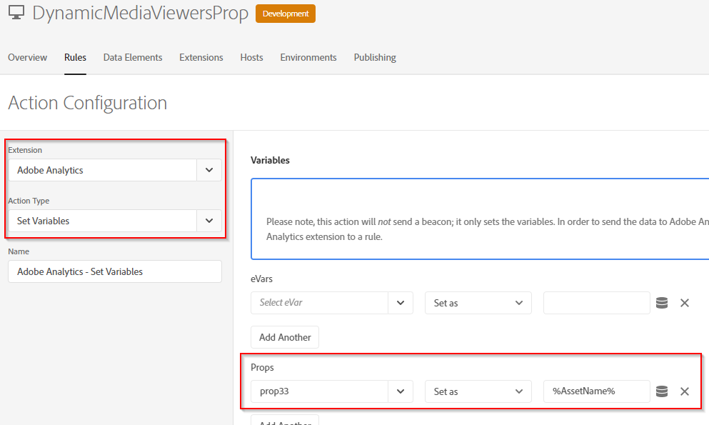
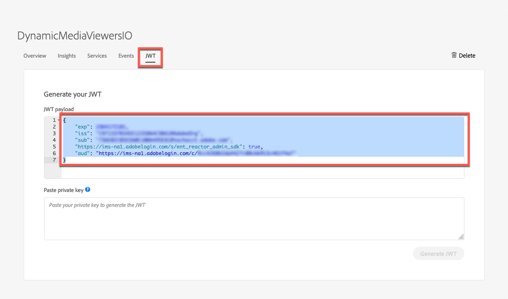
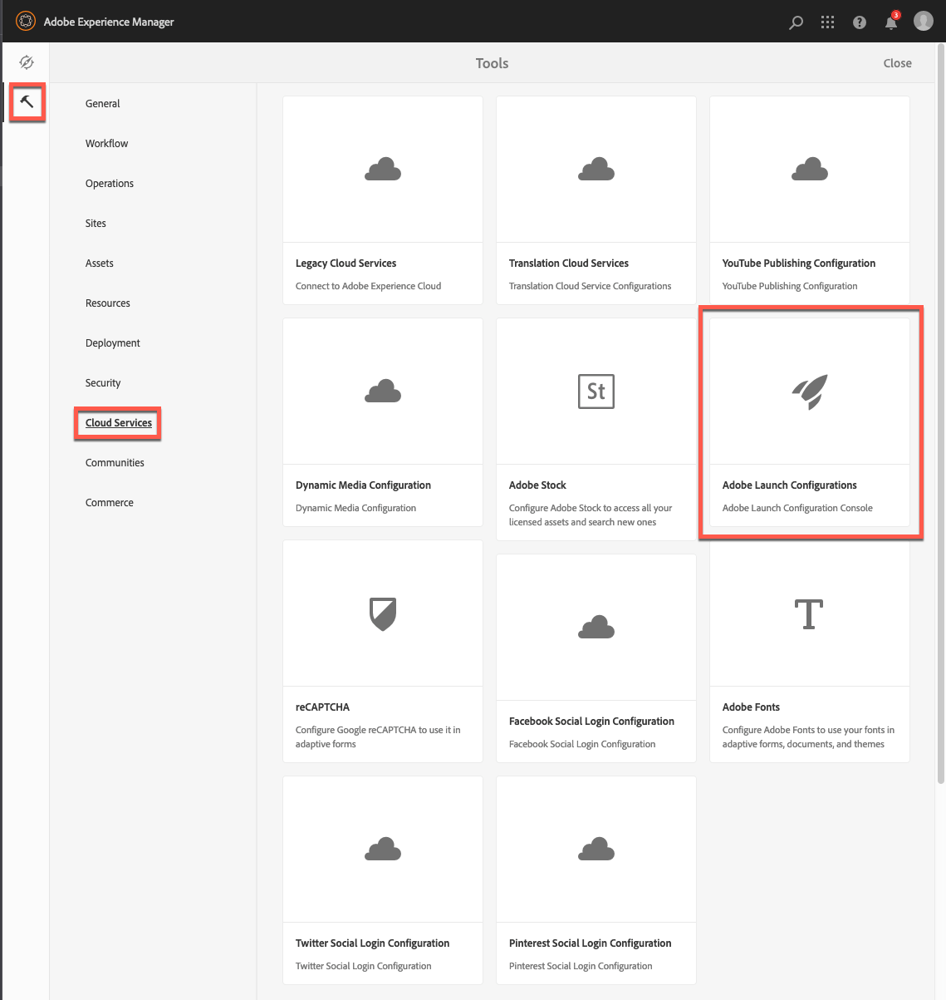

# Integration von Dynamic Media Viewern mit Adobe Analytics und Experience Platform Launch {#integrating-dynamic-media-viewers-with-adobe-analytics-and-adobe-launch}

## Was ist die Integration von Dynamic Media Viewers mit Adobe Analytics und Experience Platform Launch? {#what-is-dynamic-media-viewers-integration-with-adobe-analytics-and-adobe-launch}

<!-- Leave this hidden path here; it points to the topic source from Sasha https://wiki.corp.adobe.com/pages/viewpage.action?spaceKey=~oufimtse&title=Dynamic+Media+Viewers+integration+with+Adobe+Launch -->

Mit der neuen Erweiterung *Dynamic Media Viewers* für Platform launch und Dynamic Media Viewers 5.13 können Kunden von Adobe Analytics und Platform launch Ereignis und Daten, die für die Viewer spezifisch sind, in ihrer Platform launch-Konfiguration verwenden.

Diese Integration sorgt dafür, dass Sie die Nutzung von Dynamic Media-Viewern auf Ihrer Website mit Adobe Analytics verfolgen können. Gleichzeitig können Sie die von den Viewern offen gelegten Ereignis und Daten mit jeder anderen Platform launch-Erweiterung verwenden, die von der Adobe oder einem Drittanbieter stammt.

Weitere Informationen zu Erweiterungen finden Sie unter [Adobe-Erweiterungen](https://experienceleague.adobe.com/docs/launch/using/extensions-ref/overview.html?lang=de#adobe-extension) im Experience Platform Launch-Benutzerhandbuch.

**Dieses Thema ist für folgende Zwecke gedacht:** Site-Administratoren, Entwickler auf der Adobe Experience Manager-Plattform und Mitarbeiter im Betrieb.

### Einschränkungen der Integration {#limitations-of-the-integration}

* Die Experience Platform Launch-Integration für Dynamic Media-Viewer funktioniert nicht im Experience Manager-Autorenknoten. Sie können keine Verfolgung einer WCM-Seite anzeigen, bis diese veröffentlicht wurde.
* Die Integration von Experience Platform Launchs in Dynamic Media-Viewer wird nicht für den Popup-Betriebsmodus unterstützt, bei dem die Viewer-URL über die Schaltfläche &quot;URL&quot;auf der Seite &quot;Asset-Details&quot;abgerufen wird.
* Die Integration von Experience Platform Launchs kann nicht gleichzeitig mit der Analytics-Integration älterer Viewer verwendet werden (über den Parameter `config2=`).
* Unterstützung für das Video-Tracking ist auf das Core-Wiedergabe-Tracking beschränkt, wie unter [Tracking-Übersicht](https://experienceleague.adobe.com/docs/media-analytics/using/sdk-implement/track-av-playback/track-core-overview.html?lang=de#player-events) beschrieben. Insbesondere wird die Verfolgung von QoS, Anzeigen, Kapiteln/Segmenten oder Fehlern nicht unterstützt.
* Die Konfiguration der Speicherdauer für Datenelemente wird bei Datenelementen, die die Erweiterung *Dynamic Media-Viewer* verwenden, nicht unterstützt. Die Speicherdauer muss auf **[!UICONTROL Ohne]** eingestellt sein.

### Anwendungsbeispiele für die Integration {#use-cases-for-the-integration}

Der primäre Anwendungsfall für die Integration mit Experience Platform Launch sind Kunden, die sowohl Experience Manager-Assets als auch Experience Manager-Sites verwenden. In solchen Fällen können Sie eine Standardintegration zwischen dem Autorenknoten und dem Experience Platform Launch Ihres Experience Managers einrichten und dann Ihre Sites-Instanz mit der Experience Platform Launch-Eigenschaft verknüpfen. Danach verfolgt jede Dynamic Media-WCM-Komponente, die einer Sites-Seite hinzugefügt wird, Daten und Ereignisse von Viewern.

Siehe [Verfolgen von Dynamic Media-Viewern in Experience Manager-Sites](#tracking-dynamic-media-viewers-in-aem-sites).

Ein sekundärer Anwendungsfall, den die Integration unterstützt, sind diejenigen Kunden, die nur Experience Manager Assets oder Dynamic Media Classic verwenden. In solchen Fällen können Sie den Einbettungs-Code für Ihren Viewer abrufen und der Web-Seite hinzufügen. Rufen Sie dann die Produktions-URL der Experience Platform Launch-Bibliothek von Experience Platform Launch ab und fügen Sie sie manuell zum Webseitencode hinzu.

Siehe [Verfolgen von Dynamic Media-Viewern mit Einbettungscode](#tracking-dynamic-media-viewers-using-embed-code).

## Funktionsweise der Daten- und Ereignisverfolgung in der Integration {#how-data-and-event-tracking-works-in-the-integration}

Die Integration nutzt zwei separate und unabhängige Typen der Verfolgung von Dynamic Media-Viewern: *Adobe Analytics* und *Adobe Analytics for Audio and Video*.

### Informationen zum Tracking mit Adobe Analytics {#about-tracking-using-adobe-analytics}

Mit Adobe Analytics können Sie Aktionen verfolgen, die vom Endbenutzer bei der Interaktion mit Dynamic Media-Viewern auf Ihrer Website ausgeführt werden. Mit Adobe Analytics können Sie außerdem Viewer-spezifische Daten verfolgen. Sie können beispielsweise Ansichten-Ladeaktionen mit dem Asset-Namen, ggf. eingetretene Zoomaktionen und Videowiedergabeaktionen verfolgen und aufzeichnen.

In Experience Platform Launch arbeiten die Konzepte von *Datenelemente* und *Regeln* zusammen, um die Adobe Analytics-Verfolgung zu ermöglichen.

#### Datenelemente in Experience Platform Launch {#about-data-elements-in-adobe-launch}

Ein Datenelement in Experience Platform Launch ist eine benannte Eigenschaft, deren Wert entweder statisch definiert oder basierend auf dem Status einer Webseite oder Dynamic Media Viewer-Daten dynamisch berechnet wird.

Die für eine Datenelementdefinition verfügbaren Optionen hängen von der Liste der Erweiterungen ab, die in der Experience Platform Launch-Eigenschaft installiert sind. Die Erweiterung „Core“ ist vorinstalliert und in jeder Konfiguration standardmäßig verfügbar. Mit dieser &quot;Core&quot;-Erweiterung können Sie ein Datenelement definieren, das aus Cookies, JavaScript-Code, Abfragen-Zeichenfolge und vielen anderen Quellen stammt.

Für die Adobe Analytics-Verfolgung müssen mehrere weitere Erweiterungen installiert werden, wie unter [Installation und Einrichtung von Erweiterungen](#installing-and-setup-of-extensions) beschrieben. Die Erweiterung „Dynamic Media-Viewer“ bietet die Möglichkeit, ein Datenelement zu definieren, dessen Wert ein Argument des Dynamic Media-Viewer-Ereignisses ist. Beispielsweise können Sie auf den Viewer-Typ oder den Asset-Namen verweisen, der vom Viewer beim Laden gemeldet wird, auf den Zoomgrad, der beim Zoomen des Endbenutzers gemeldet wird, und vieles mehr.

Die Dynamic Media Viewer-Erweiterung hält die Werte der Datenelemente automatisch auf dem neuesten Stand.

Nachdem Sie es definiert haben, kann ein Datenelement an anderen Stellen der Benutzeroberfläche des Experience Platform Launchs mithilfe des Widgets &quot;Datenelementauswahl&quot;verwendet werden. Insbesondere werden Datenelemente, die für die Verfolgung von Dynamic Media-Viewern definiert wurden, in der Regel unter &quot;Variablenaktion von Adobe Analytics-Erweiterung festlegen&quot;referenziert (siehe unten).

Siehe [Datenelemente](https://experienceleague.adobe.com/docs/launch/using/reference/manage-resources/data-elements.html?lang=de#reference) im Experience Platform Launch-Benutzerhandbuch.

#### Info zu Regeln in Experience Platform Launch {#about-rules-in-adobe-launch}

Eine Regel im Experience Platform Launch ist eine agnostische Konfiguration, die drei Regelbereiche definiert: *Ereignis*, *Conditions* und *Aktionen*:

* *Ereignis* (if) geben dem Experience Platform Launch an, wann eine Regel Trigger werden soll.
* *Bedingungen* (falls) geben dem Experience Platform Launch an, welche anderen Einschränkungen beim Auslösen einer Regel zulässig oder nicht zulässig sind.
* *Mit Aktionen*  (dann) wird dem Experience Platform Launch mitgeteilt, wie er vorgehen soll, wenn eine Regel ausgelöst wird.

Die Optionen, die im Abschnitt &quot;Ereignis&quot;, &quot;Bedingungen&quot;und &quot;Aktionen&quot;verfügbar sind, hängen von den Erweiterungen ab, die in der Eigenschaft &quot;Experience Platform Launch&quot;installiert sind. Die Erweiterung *Core* ist vorinstalliert und in jeder Konfiguration standardmäßig verfügbar. Die Erweiterung bietet mehrere Optionen für Ereignisse wie grundlegende Aktionen auf Browserebene, die Fokusänderung, Tastendruck und Formularübermittlungen umfassen. Sie enthält zudem Optionen für Bedingungen, wie z. B. Cookie-Wert, Browser-Typ und mehr. Für Aktionen steht nur die Option „Benutzerspezifischer Code“ zur Verfügung.

Für die Adobe Analytics-Verfolgung müssen mehrere weitere Erweiterungen installiert werden, wie unter [Installation und Einrichtung von Erweiterungen](#installing-and-setup-of-extensions) beschrieben. Insbesondere gilt:

* Die Erweiterung „Dynamic Media-Viewer“ erweitert die Liste der unterstützten Ereignisse auf Ereignisse, die für Dynamic Media-Viewer spezifisch sind, z. B. Laden des Viewers, Austauschen von Assets, Vergrößern und Abspielen von Videos.
* Die Adobe Analytics-Erweiterung erweitert die Liste der unterstützten Aktionen um zwei Aktionen, die zum Senden von Daten an Tracking-Server erforderlich sind: *Variablen festlegen* und *Beacon senden*.

Zur Verfolgung von Dynamic Media-Viewern können Sie jeden der folgenden Typen verwenden:

* Ereignisse aus der Erweiterung „Dynamic Media-Viewer“, der Core-Erweiterung oder einer anderen Erweiterung.
* Bedingungen in der Regeldefinition. Alternativ können Sie den Bedingungsbereich leer lassen.

Im Abschnitt „Aktionen“ müssen Sie über die Aktion *Variablen festlegen* verfügen. Diese Aktion teilt Adobe Analytics mit, wie Tracking-Variablen mit Daten ausgefüllt werden. Gleichzeitig sendet die Aktion *Variablen festlegen* nichts an den Tracking-Server.

Auf die Aktion *Variablen festlegen* muss eine Aktion vom Typ *Beacon senden* folgen. Mit der Aktion *Beacon senden* werden tatsächlich Daten an den Analytics-Tracking-Server gesendet. Beide Aktionen (*Variablen festlegen* und *Beacon senden*) kommen aus der Adobe Analytics-Erweiterung.

Siehe [Rules](https://experienceleague.adobe.com/docs/launch/using/reference/manage-resources/rules.html?lang=de#reference) im Experience Platform Launch-Benutzerhandbuch.

#### Beispielkonfiguration {#sample-configuration}

Die folgende Beispielkonfiguration in Experience Platform Launch zeigt, wie ein Asset-Name beim Laden des Viewers verfolgt wird.

1. Definieren Sie auf der Registerkarte **[!UICONTROL Datenelemente]** ein Datenelement `AssetName`, das auf den `asset`-Parameter des `LOAD`-Ereignisses in der Erweiterung „Dynamic Media-Viewer“ verweist.

   

1. Definieren Sie auf der Registerkarte **[!UICONTROL Regeln]** eine Regel für *TrackAssetOnLoad*.

   In dieser Regel verwendet das Feld **[!UICONTROL Ereignis]** das **[!UICONTROL LOAD]**-Ereignis aus der Erweiterung „Dynamic Media-Viewer“.

   

1. Die Aktionskonfiguration umfasst zwei Aktionstypen aus der Adobe Analytics-Erweiterung:

   *Variablen festlegen*, wodurch eine Analytics-Variable Ihrer Wahl dem Wert des Datenelements `AssetName` zugeordnet wird;

   *Beacon senden*, wodurch Tracking-Daten an Adobe Analytics gesendet werden.

   

1. Die daraus resultierende Regelkonfiguration sieht wie folgt aus:

   

### Informationen zu Adobe Analytics for Audio and Video {#about-adobe-analytics-for-audio-and-video}

Wenn für die Verwendung von Adobe Analytics for Audio and Video ein Experience Cloud-Konto abonniert wird, reicht es, in den Einstellungen der Erweiterung *Dynamic Media-Viewer* das Video-Tracking zu aktivieren. Videometriken werden so in Adobe Analytics verfügbar. Video-Tracking ist auf die Erweiterung „Adobe Media Analytics for Audio and Video“ angewiesen.

Siehe [Installation und Einrichtung von Erweiterungen](#installing-and-setup-of-extensions).

Derzeit ist die Unterstützung für Video-Tracking auf das Tracking „Core-Wiedergabe“ beschränkt, wie in der [Tracking-Übersicht](https://experienceleague.adobe.com/docs/media-analytics/using/sdk-implement/track-av-playback/track-core-overview.html#player-events) beschrieben. Insbesondere wird die Verfolgung von QoS, Anzeigen, Kapiteln/Segmenten oder Fehlern nicht unterstützt.

## Verwenden der Erweiterung „Dynamic Media-Viewer“ {#using-the-dynamic-media-viewers-extension}

Wie unter [Anwendungsfälle für die Integration](#use-cases-for-the-integration) erwähnt, ist es möglich, Dynamic Media-Viewer mit der neuen Experience Platform Launch-Integration in Experience Manager-Sites und mithilfe von Einbettungscode zu verfolgen.

### Verfolgen von Dynamic Media-Viewern in Experience Manager-Sites {#tracking-dynamic-media-viewers-in-aem-sites}

Zur Verfolgung von Dynamic Media-Viewern auf Experience Manager-Sites müssen alle unter [Konfigurieren aller Integrationselemente](#configuring-all-the-integration-pieces) aufgeführten Schritte ausgeführt werden. Insbesondere müssen Sie die IMS-Konfiguration und die Experience Platform Launch Cloud-Konfiguration erstellen.

Nach ordnungsgemäßer Konfiguration verfolgt jeder Dynamic Media-Viewer, den Sie einer Sites-Seite mithilfe einer von Dynamic Media unterstützten WCM-Komponente hinzufügen, automatisch Daten für Adobe Analytics oder Adobe Analytics for Video oder beides.

Siehe [Hinzufügen von Dynamic Media-Assets zu Seiten mit Adobe Sites](/help/assets/dynamic-media/adding-dynamic-media-assets-to-pages.md).

### Verfolgen von Dynamic Media-Viewern mit Einbettungs-Code {#tracking-dynamic-media-viewers-using-embed-code}

Kunden, die keine Experience Manager-Sites verwenden oder Dynamic Media-Viewer in Webseiten außerhalb von Experience Manager-Sites oder beides einbetten, können weiterhin die Experience Platform Launch-Integration verwenden.

Führen Sie die Konfigurationsschritte aus den Abschnitten [Adobe Analytics](#configuring-adobe-analytics-for-the-integration) konfigurieren und [Experience Platform Launch](#configuring-adobe-launch-for-the-integration) konfigurieren aus. Es sind jedoch keine Konfigurationsschritte im Zusammenhang mit dem Experience Manager erforderlich.

Nach ordnungsgemäßer Konfiguration können Sie einer Webseite mit einem Dynamic Media-Viewer Experience Platform Launch-Unterstützung hinzufügen.

Weitere Informationen zur Verwendung des Einbettungscodes in der Experience Platform Launch-Bibliothek finden Sie unter [Hinzufügen Experience Platform Launch-Einbettungscode](https://experienceleague.adobe.com/docs/launch-learn/implementing-in-websites-with-launch/configure-launch/launch-add-embed.html?lang=de#configure-launch).

Weitere Informationen zur Verwendung der Einbettungscode-Funktion von Experience Manager Dynamic Media finden Sie unter [Einbetten des Video- oder Bild-Viewers auf einer Webseite](/help/assets/dynamic-media/embed-code.md).

**So verfolgen Sie Dynamic Media-Viewer mit Einbettungs-Code**:

1. Verwenden Sie eine Web-Seite, die bereit zum Einbetten eines Dynamic Media-Viewers ist.
1. Rufen Sie den Einbettungscode für die Experience Platform Launch-Bibliothek ab, indem Sie sich zuerst bei Experience Platform Launch anmelden (siehe [Experience Platform Launch konfigurieren](#configuring-adobe-launch-for-the-integration)).
1. Klicken Sie auf **[!UICONTROL Eigenschaften]** und dann auf die Registerkarte **[!UICONTROL Umgebungen]**.
1. Wählen Sie die für die Umgebung der Web-Seite relevante Umgebungsebene aus. Klicken Sie dann in der Spalte **[!UICONTROL Installieren]** auf das Kontrollkästchen.
1. **[!UICONTROL Kopieren Sie im]** Dialogfeld &quot;Webinstallationsanweisungen&quot;den Einbettungscode der gesamten Experience Platform Launch-Bibliothek zusammen mit den umliegenden  `<script/>` Tags.

## Referenzhandbuch für die Erweiterung „Dynamic Media-Viewer“ {#reference-guide-for-the-dynamic-media-viewers-extension}

### Über die Konfiguration der Dynamic Media-Viewer {#about-the-dynamic-media-viewers-configuration}

Die Dynamic Media Viewer-Erweiterung wird automatisch in die Experience Platform Launch-Bibliothek integriert, wenn die folgenden Bedingungen erfüllt sind:

* Globales Experience Platform Launch-Bibliotheksobjekt ( `_satellite`) ist auf der Seite vorhanden.
* Die Erweiterungsfunktion für „Dynamic Media-Viewer“ `_dmviewers_v001()` ist für `_satellite` definiert.

* Der Viewer-Parameter `config2=` wurde nicht angegeben. Das bedeutet, dass der Viewer keine ältere Analytics-Integration verwendet.

Außerdem gibt es die Möglichkeit, die Integration von Experience Platform Launchs im Viewer explizit zu deaktivieren, indem Sie in der Viewer-Konfiguration den Parameter `launch=0` angeben. Der Standardwert dieses Parameters ist `1`.

### Konfigurieren der Erweiterung „Dynamic Media-Viewer“ {#configuring-the-dynamic-media-viewers-extension}

Die einzige Konfigurationsoption für die Erweiterung „Dynamic Media-Viewer“ ist **[!UICONTROL Adobe Media Analytics for Audio and Video aktivieren]**.

Wenn Sie diese Option aktivieren (aktivieren) und die Adobe Mediums Analytics for Audio and Video-Erweiterung installiert und konfiguriert ist, werden Videowiedergabemetriken für die Audio- und Videolösung an das Adobe Analytics gesendet. Durch Deaktivieren dieser Option wird das Video-Tracking deaktiviert.

Wenn Sie diese Option *aktivieren, ohne die Erweiterung &quot;Adobe Mediums Analytics for Audio and Video&quot;installiert zu haben, hat diese Option keine Auswirkungen.*

### Datenelemente in der Erweiterung „Dynamic Media-Viewer“ {#about-data-elements-in-the-dynamic-media-viewers-extension}

Der einzige Datenelementtyp, den die Erweiterung „Dynamic Media-Viewer“ bietet, ist **[!UICONTROL Viewer-Ereignis]** aus der Dropdown-Liste **[!UICONTROL Datenelementtyp]**.

Wenn diese Option aktiviert ist, rendert der Datenelement-Editor ein Formular mit zwei Feldern:

* **[!UICONTROL Ereignisdatentyp DM-Viewer]** – eine Dropdown-Liste, die alle Viewer-Ereignisse identifiziert, die von der Erweiterung „Dynamic Media-Viewer“ unterstützt werden und Argumente sowie ein spezielles **[!UICONTROL COMMON]**-Element aufweisen. Ein **[!UICONTROL COMMON]**-Element stellt eine Liste von Ereignisparametern dar, die allen von den Viewern gesendeten Ereignistypen gemein sind.
* **[!UICONTROL Tracking-Parameter]** – ein Argument des ausgewählten Dynamic Media-Viewer-Ereignisses.

Die Liste der unterstützten Ereignis nach Viewer-Typ finden Sie im Referenzhandbuch [Dynamic Media Viewer](https://experienceleague.adobe.com/docs/dynamic-media-developer-resources/library/viewers-aem-assets-dmc/c-html5-s7-aem-asset-viewers.html?lang=de). Rufen Sie den Abschnitt zu einem bestimmten Viewer auf und klicken Sie dann auf Support für Adobe Analytics-Tracking-Unterabschnitt. Derzeit sind Ereignisargumente im Referenzhandbuch für Dynamic Media-Viewer nicht dokumentiert.

Betrachten wir nun den Lebenszyklus des *Datenelements* von „Dynamic Media-Viewer“. Der Wert dieses Datenelements wird ausgefüllt, nachdem das entsprechende Dynamic Media-Viewers-Ereignis auf der Seite eintritt. Angenommen, das Datenelement verweist auf das Ereignis **[!UICONTROL LOAD]** und das zugehörige &quot;asset&quot;-Argument. Der Wert dieses Datenelements empfängt gültige Daten, nachdem der Viewer das LOAD-Ereignis zum ersten Mal ausführt. Wenn das Datenelement auf das **[!UICONTROL ZOOM]**-Ereignis und das zugehörige &quot;scale&quot;-Argument verweist, bleibt der Wert dieses Datenelements leer, bis der Viewer zum ersten Mal ein **[!UICONTROL ZOOM]**-Ereignis sendet.

Gleichermaßen werden die Werte von Datenelementen automatisch aktualisiert, wenn der Viewer ein entsprechendes Ereignis auf der Seite sendet. Der Wert wird auch dann aktualisiert, wenn das betreffende Ereignis nicht in der Regelkonfiguration angegeben ist. Angenommen, das Datenelement **[!UICONTROL ZoomScale]** wird für den Parameter &quot;scale&quot;des ZOOM-Ereignisses definiert. Die einzige in der Regelkonfiguration vorhandene Regel wird jedoch durch das Ereignis **[!UICONTROL LOAD]** ausgelöst. Der Wert von **[!UICONTROL ZoomScale]** wird immer noch aktualisiert, wenn ein Benutzer im Viewer Zoom ausführt.

Jeder Dynamic Media-Viewer verfügt auf der Web-Seite über eine eindeutige Kennung. Das Datenelement verfolgt den Wert selbst und den Viewer, der den Wert ausgefüllt hat. Angenommen, es gibt mehrere Viewer auf derselben Seite und ein **[!UICONTROL AssetName]**-Datenelement, das auf das **[!UICONTROL LOAD]**-Ereignis und das zugehörige &quot;asset&quot;-Argument verweist. Das Datenelement **[!UICONTROL AssetName]** verwaltet eine Sammlung von Asset-Namen, die mit jedem auf der Seite geladenen Viewer verknüpft sind.

Der jeweilige vom Datenelement zurückgegebene Wert hängt vom Kontext ab. Wenn das Datenelement in einer Regel angefordert wird, die durch ein Dynamic Media-Viewer-Ereignis ausgelöst wurde, wird der Datenelementwert für den Viewer zurückgegeben, der die Regel initiiert hat. Und das Datenelement wird in einer Regel angefordert, die durch ein Ereignis einer anderen Platform launch-Erweiterung ausgelöst wurde. An diesem Punkt stammt der Wert des Datenelements aus dem Viewer, der zuletzt dieses Datenelement aktualisiert hat.

**Betrachten Sie die folgende Beispieleinrichtung**:

* Eine Webseite mit zwei Dynamic Media-Zoom-Viewern: *viewer1* und *viewer2*.

* Das Datenelement **[!UICONTROL ZoomScale]** verweist auf das **[!UICONTROL ZOOM]**-Ereignis und das zugehörige „scale“-Argument.
* **[!UICONTROL TrackPan]**-Regel mit folgenden Eigenschaften:

   * Verwendet das Dynamic Media-Viewer-Ereignis **[!UICONTROL PAN]** als Auslöser.
   * Sendet den Wert des **[!UICONTROL ZoomScale]**-Datenelements an Adobe Analytics.

* **[!UICONTROL TrackKey]**-Regel mit folgenden Eigenschaften:

   * Verwendet das Ereignis der Tastenpresse aus der Core Experience Platform Launch Extension als Trigger.
   * Sendet den Wert des **[!UICONTROL ZoomScale]**-Datenelements an Adobe Analytics.

Nehmen wir nun an, dass der Endbenutzer die Web-Seite mit beiden Viewern lädt. In *Viewer1* zoomt er auf eine Skalierung von 50 %. In *Viewer2* zoomt er dann auf eine Skalierung von 25 %. In *Viewer1* schwenkt er das Bild und drückt schließlich eine Taste auf der Tastatur.

Die Aktivitäten des Endbenutzers führen dazu, dass die folgenden beiden Tracking-Aufrufe an Adobe Analytics gesendet werden:

* Der erste Aufruf erfolgt, weil die **[!UICONTROL TrackPan]**-Regel ausgelöst wird, wenn der Benutzer in *Viewer1* schwenkt. Dieser Aufruf sendet 50 % als Wert des Datenelements **[!UICONTROL ZoomScale]**, da das Datenelement weiß, dass die Regel von *viewer1* ausgelöst wird, und den entsprechenden Skalierungswert abrufen;
* Der zweite Aufruf erfolgt, weil die **[!UICONTROL TrackKey]**-Regel ausgelöst wird, wenn der Benutzer eine Taste auf der Tastatur drückt. Bei diesem Aufruf werden 25 % als Wert des **[!UICONTROL ZoomScale]**-Datenelements gesendet, da die Regel nicht vom Viewer ausgelöst wurde. Daher gibt das Datenelement den aktuellsten Wert zurück.

Das oben aufgestellte Beispiel wirkt sich auch auf die Lebensdauer des Datenelementwerts aus. Der Wert des vom Dynamic Media Viewer verwalteten Datenelements wird auch dann im Experience Platform Launch-Bibliothekscode gespeichert, wenn der Viewer selbst auf der Webseite abgelegt wird. Diese Funktion bedeutet, dass das Datenelement den letzten bekannten Wert zurückgibt, wenn es eine Regel gibt, die von einer Nicht-Dynamic Media-Viewer-Erweiterung ausgelöst wird und auf dieses Datenelement verweist. Auch wenn der Viewer nicht mehr auf der Webseite vorhanden ist.

In jedem Fall werden die von Dynamic Media Viewern angetriebenen Datenelementwerte nicht auf der lokalen Datenspeicherung oder auf dem Server gespeichert. Sie werden stattdessen nur in der clientseitigen Experience Platform Launch-Bibliothek gespeichert. Die Werte solcher Datenelemente verschwinden, wenn die Web-Seite neu geladen wird.

Im Allgemeinen unterstützt der Datenelement-Editor eine [Festlegung der Speicherdauer](https://experienceleague.adobe.com/docs/launch/using/reference/manage-resources/data-elements.html?lang=de#create-a-data-element). Datenelemente, die die Dynamic Media Viewer-Erweiterung verwenden, unterstützen jedoch nur die Option für die Datenspeicherung von **[!UICONTROL Keine]**. Das Festlegen eines anderen Werts ist in der Benutzeroberfläche möglich, in diesem Fall wird jedoch das Verhalten des Datenelements nicht definiert. Die Erweiterung verwaltet den Wert des Datenelements selbst: das Datenelement, das den Wert des Viewer-Ereignisarguments während des gesamten Lebenszyklus des Viewers beibehält.

### Über Regeln in der Erweiterung „Dynamic Media-Viewer“ {#about-rules-in-the-dynamic-media-viewers-extension}

Im Regeleditor werden mit der Erweiterung neue Konfigurationsoptionen für den Ereigniseditor hinzugefügt. Außerdem bietet der Editor eine Option zum manuellen Referenzieren von Ereignis-Parametern im Action-Editor als Kurzoption, anstatt vorkonfigurierte Datenelemente zu verwenden.

#### Über den Ereigniseditor {#about-the-events-editor}

Im Ereignis-Editor fügt die Dynamic Media Viewer-Erweiterung einen **[!UICONTROL Ereignistyp]** mit dem Namen **[!UICONTROL Viewer-Ereignis]** hinzu.

Wenn diese Option aktiviert ist, rendert der Ereigniseditor die Dropdown-Liste **[!UICONTROL Dynamic Media-Viewer-Ereignisse]** und listet alle verfügbaren Ereignisse auf, die von Dynamic Media-Viewern unterstützt werden.

#### Über den Aktionseditor {#about-the-actions-editor}

Mit der Erweiterung „Dynamic Media-Viewer“ können Sie Ereignisparameter von Dynamic Media-Viewern verwenden, um im Editor „Variablen festlegen“ der Adobe Analytics-Erweiterung Analysevariablen zuzuordnen.

Die einfachste Methode dazu besteht darin, den folgenden zweistufigen Vorgang durchzuführen:

* Definieren Sie zunächst ein oder mehrere Datenelemente, wobei jedes Datenelement einen Parameter eines Dynamic Media-Viewer-Ereignisses darstellt.
* Klicken Sie dann im Editor „Variablen festlegen“ der Adobe Analytics-Erweiterung auf das Symbol für die Datenelementauswahl (drei gestapelte Festplatten), um das Dialogfeld „Datenelement auswählen“ zu öffnen; wählen Sie dann ein Datenelement aus.

Es ist jedoch möglich, einen anderen Ansatz zu verwenden und die Erstellung von Datenelementen zu umgehen. Sie können direkt auf ein Argument aus einem Dynamic Media Viewer-Ereignis verweisen. Geben Sie im Eingabefeld **[!UICONTROL value]** der Analytics-Variablenzuweisung den vollständig qualifizierten Namen des Ereignis-Arguments ein. Stellen Sie sicher, dass Sie die Prozentzeichen (%) eintragen. Beispiel:

`%event.detail.dm.LOAD.asset%`

Es gibt einen wichtigen Unterschied zwischen der Verwendung von Datenelementen und der Referenz zu direkten Ereignissen. Bei Datenelementen spielt es keine Rolle, welches Ereignis die Aktion &quot;Variablen festlegen&quot;Trigger. Das Ereignis, dass die Regel Trigger des dynamischen Viewers sein kann (z. B. Klicken auf die Webseite in der Core-Erweiterung). Bei Verwendung eines direkten Argumentverweises muss jedoch sichergestellt werden, dass das Ereignis, das die Regel auslöst, dem Ereignisargument entspricht, auf das es verweist.

Wenn Sie beispielsweise auf `%event.detail.dm.LOAD.asset%` verweisen, wird der richtige Asset-Name zurückgegeben, wenn die Regel durch das **[!UICONTROL LOAD]**-Ereignis der Dynamic Media-Viewer-Erweiterung ausgelöst wird. Bei jedem anderen Ereignis wird jedoch ein leerer Wert zurückgegeben.

In der folgenden Tabelle sind die Dynamic Media-Viewer-Ereignisse sowie die unterstützten Argumente aufgeführt:

<table>
 <tbody>
  <tr>
   <td>Name des Viewer-Ereignisses</td>
   <td>Argumentverweis</td>
  </tr>
  <tr>
   <td><code>COMMON</code></td>
   <td><code>%event.detail.dm.objID%</code></td>
  </tr>
  <tr>
   <td> </td>
   <td><code>%event.detail.dm.compClass%</code></td>
  </tr>
  <tr>
   <td> </td>
   <td><code>%event.detail.dm.instName%</code></td>
  </tr>
  <tr>
   <td> </td>
   <td><code>%event.detail.dm.timeStamp%</code></td>
  </tr>
  <tr>
   <td><code>BANNER</code> </td>
   <td><code>%event.detail.dm.BANNER.asset%</code></td>
  </tr>
  <tr>
   <td> </td>
   <td><code>%event.detail.dm.BANNER.frame%</code></td>
  </tr>
  <tr>
   <td> </td>
   <td><code>%event.detail.dm.BANNER.label%</code></td>
  </tr>
  <tr>
   <td><code>HREF</code></td>
   <td><code>%event.detail.dm.HREF.rollover%</code></td>
  </tr>
  <tr>
   <td><code>ITEM</code></td>
   <td><code>%event.detail.dm.ITEM.rollover%</code></td>
  </tr>
  <tr>
   <td><code>LOAD</code></td>
   <td><code>%event.detail.dm.LOAD.applicationname%</code></td>
  </tr>
  <tr>
   <td><strong> </strong></td>
   <td><code>%event.detail.dm.LOAD.asset%</code></td>
  </tr>
  <tr>
   <td><strong> </strong></td>
   <td><code>%event.detail.dm.LOAD.company%</code></td>
  </tr>
  <tr>
   <td><strong> </strong></td>
   <td><code>%event.detail.dm.LOAD.sdkversion%</code></td>
  </tr>
  <tr>
   <td><strong> </strong></td>
   <td><code>%event.detail.dm.LOAD.viewertype%</code></td>
  </tr>
  <tr>
   <td><strong> </strong></td>
   <td><code>%event.detail.dm.LOAD.viewerversion%</code></td>
  </tr>
  <tr>
   <td><code>METADATA</code></td>
   <td><code>%event.detail.dm.METADATA.length%</code></td>
  </tr>
  <tr>
   <td> </td>
   <td><code>%event.detail.dm.METADATA.type%</code></td>
  </tr>
  <tr>
   <td><code>MILESTONE</code></td>
   <td><code>%event.detail.dm.MILESTONE.milestone%</code></td>
  </tr>
  <tr>
   <td><code>PAGE</code></td>
   <td><code>%event.detail.dm.PAGE.frame%</code></td>
  </tr>
  <tr>
   <td> </td>
   <td><code>%event.detail.dm.PAGE.label%</code></td>
  </tr>
  <tr>
   <td><code>PAUSE</code></td>
   <td><code>%event.detail.dm.PAUSE.timestamp%</code></td>
  </tr>
  <tr>
   <td><code>PLAY</code></td>
   <td><code>%event.detail.dm.PLAY.timestamp%</code></td>
  </tr>
  <tr>
   <td><code>SPIN</code></td>
   <td><code>%event.detail.dm.SPIN.framenumber%</code></td>
  </tr>
  <tr>
   <td><code>STOP</code></td>
   <td><code>%event.detail.dm.STOP.timestamp%</code></td>
  </tr>
  <tr>
   <td><code>SWAP</code></td>
   <td><code>%event.detail.dm.SWAP.asset%</code></td>
  </tr>
  <tr>
   <td><code>SWATCH</code></td>
   <td><code>%event.detail.dm.SWATCH.frame%</code></td>
  </tr>
  <tr>
   <td> </td>
   <td><code>%event.detail.dm.SWATCH.label%</code></td>
  </tr>
  <tr>
   <td><code>TARG</code></td>
   <td><code>%event.detail.dm.TARG.frame%</code></td>
  </tr>
  <tr>
   <td> </td>
   <td><code>%event.detail.dm.TARG.label%</code></td>
  </tr>
  <tr>
   <td><code>ZOOM</code></td>
   <td><code>%event.detail.dm.ZOOM.scale%</code></td>
  </tr>
 </tbody>
</table>

## Konfigurieren aller Integrationselemente {#configuring-all-the-integration-pieces}

**Voraussetzungen**

Adobe empfiehlt, dass Sie die gesamte Dokumentation vor diesem Abschnitt gründlich überprüfen, damit Sie die vollständige Integration verstehen.

In diesem Abschnitt werden die Konfigurationsschritte erläutert, die zur Integration von Dynamic Media-Viewern mit Adobe Analytics und Adobe Analytics for Audio and Video erforderlich sind. Auch wenn die Dynamic Media Viewer-Erweiterung für andere Zwecke im Experience Platform Launch verwendet werden kann, werden solche Szenarien in dieser Dokumentation nicht behandelt.

Sie verwenden die folgenden Adoben zur Konfiguration Ihrer Integration:

* Adobe Analytics - zur Konfiguration von Verfolgungsvariablen und Berichten.
* Experience Platform Launch: Dient zum Definieren einer Eigenschaft, einer oder mehrerer Regeln und eines oder mehrerer Datenelemente, um die Viewer-Verfolgung zu aktivieren.

Wenn diese Integrationslösung mit Experience Manager-Sites verwendet wird, muss die folgende Konfiguration durchgeführt werden:

* Adobe I/O Console - Die Integration wird für den Experience Platform Launch erstellt.
* Experience Manager-Autorenknoten - IMS-Konfiguration und Experience Platform Launch-Cloud-Konfiguration.

Vergewissern Sie sich, dass Sie im Rahmen der Konfiguration Zugriff auf eine Firma in Adobe Experience Cloud haben, für die Adobe Analytics und Experience Platform Launch bereits aktiviert sind.

## Konfigurieren von Adobe Analytics für die Integration {#configuring-adobe-analytics-for-the-integration}

Nach der Konfiguration von Adobe Analytics wird Folgendes für die Integration eingerichtet:

* Eine Report Suite ist vorhanden und ausgewählt.
* Analytics-Variablen stehen zum Empfang von Verfolgungsdaten zur Verfügung.
* Es gibt Berichte zur Anzeige der in Adobe Analytics erfassten Daten.

Siehe auch [Analytics-Implementierungshandbuch](https://experienceleague.adobe.com/docs/analytics/implementation/home.html?lang=de).

**So konfigurieren Sie Adobe Analytics für die Integration**:

1. Beginnen Sie, indem Sie über die Experience Cloud-[Startseite](https://exc-home.experiencecloud.adobe.com/exc-home/home.html#/) auf Adobe Analytics zugreifen. Klicken Sie in der Menüleiste auf das Symbol „Lösungen“ (eine Tabelle mit drei mal drei Punkten) oben rechts auf der Seite und klicken Sie dann auf **[!UICONTROL Analytics]**.

   

   Wählen Sie jetzt eine Report Suite aus.

### Auswählen einer Report Suite {#selecting-a-report-suite}

1. Wählen Sie rechts oben auf der Seite „Adobe Analytics“ rechts neben dem Feld **[!UICONTROL Berichte durchsuchen]** die gewünschte Report Suite aus der Dropdown-Liste. Wenn mehrere Report Suites verfügbar sind und Sie nicht sicher sind, welche verwendet werden soll, wenden Sie sich an Ihren Adobe Analytics-Administrator, um sich bei der Auswahl der zu verwendenden Report Suite helfen zu lassen.

   In der folgenden Abbildung hat ein Benutzer eine Report Suite mit dem Namen *DynamicMediaViewersExtensionDoc* erstellt und aus der Dropdown-Liste ausgewählt. Der Name der Report Suite dient nur zur Veranschaulichung. Der Name der Report Suite, die Sie letztendlich auswählen, liegt bei Ihnen.

   Wenn keine Report Suite verfügbar ist, müssen Sie oder Ihr Adobe Analytics-Administrator eine erstellen, bevor Sie mit der Konfiguration fortfahren können.

   Siehe [Berichte und Report Suites](https://experienceleague.adobe.com/docs/analytics/admin/manage-report-suites/report-suites-admin.html?lang=de#manage-report-suites) und [Report Suite erstellen](https://experienceleague.adobe.com/docs/analytics/admin/admin-console/create-report-suite.html#admin-console).

   In Adobe Analytics werden Report Suites unter **[!UICONTROL Admin > Report Suites]** verwaltet.

   

   Richten Sie jetzt Adobe Analytics-Variablen ein.

### Einrichten von Adobe Analytics-Variablen {#setting-up-adobe-analytics-variables}

1. Legen Sie eine oder mehrere Adobe Analytics-Variablen fest, die Sie zur Verfolgung des Dynamic Media-Viewer-Verhaltens auf der Webseite verwenden möchten.

   Es lassen sich beliebige Variablentypen verwenden, die von Adobe Analytics unterstützt werden. Die Entscheidung über den Variablentyp (z. B. Custom Traffic [props], Conversion [eVar]) wird von spezifischen Anforderungen Ihrer Analytics-Implementierung bestimmt.

   Siehe [Übersicht über props und eVars](https://experienceleague.adobe.com/docs/analytics/implementation/vars/page-vars/evar.html?lang=de#vars).

   Für die Zwecke dieser Dokumentation wird nur eine Eigenschaftsvariable (Custom Traffic) verwendet, da sie in einem Analytics-Bericht innerhalb weniger Minuten nach dem Auftreten einer Aktion auf einer Webseite verfügbar ist.

   Um eine neue Custom Traffic-Variable zu aktivieren, klicken Sie in Adobe Analytics in der Symbolleiste auf **[!UICONTROL Admin > Report Suites]**.

1. Wählen Sie auf der Seite **[!UICONTROL Report Suite Manager]** den gewünschten Bericht aus und klicken Sie dann in der Symbolleiste auf **[!UICONTROL Einstellungen bearbeiten > Traffic > Traffic-Variablen]**.
1. Wählen Sie dort eine nicht verwendete Variable aus, geben Sie ihr einen beschreibenden Namen ( **[!UICONTROL Viewer-Asset (prop 30)]**) und ändern Sie das Kombinationsfeld in der Spalte Aktiviert in &quot;Aktiviert&quot;.

   Der folgende Screenshot ist ein Beispiel für eine Custom Traffic-Variable ( **[!UICONTROL prop30]**) zur Verfolgung eines vom Viewer verwendeten Asset-Namens:

   

1. Klicken Sie unten in der Variablenliste auf **[!UICONTROL Speichern]**.

### Einrichten eines Berichts {#setting-up-a-report}

1. Im Allgemeinen wird die Einrichtung eines Berichts in Adobe Analytics von den jeweiligen Projektanforderungen bestimmt. Die Einrichtung detaillierter Berichte ist daher für diese Integration nicht relevant.

   Es ist jedoch ausreichend zu wissen, dass die Berichte zum benutzerdefinierten Traffic in Adobe Analytics automatisch verfügbar werden, nachdem Sie unter **[Einrichten von Adobe Analytics-Variablen](#setting-up-adobe-analytics-variables)** benutzerdefinierte Traffic-Variablen eingerichtet haben.

   Beispielsweise ist der Bericht für **[!UICONTROL Viewer-Asset (prop 30)]** im Menü „Berichte“ unter **[!UICONTROL Custom Traffic > Custom Traffic 21-30 > Viewer-Asset (prop 30)]** verfügbar.

   Beim Aufrufen dieses Berichts direkt nach der Erstellung von **[!UICONTROL Viewer-Asset (prop 30)]** werden keine Daten angezeigt; das ist an diesem Punkt der Integration zu erwarten.

   

## Konfigurieren von Experience Platform Launch für die Integration {#configuring-adobe-launch-for-the-integration}

Nach der Konfiguration von Experience Platform Launch wird Folgendes für die Integration eingerichtet:

* Erstellung einer neuen Eigenschaft, um alle Konfigurationen zusammenzuhalten.
* Installation und Einrichtung von Erweiterungen. Der Client-seitige Code aller in der Eigenschaft installierten Erweiterungen wird in einer Bibliothek kompiliert. Diese Bibliothek wird später von der Web-Seite verwendet.
* Konfiguration von Datenelementen und Regeln. Diese Konfiguration bestimmt darüber, welche Daten von den Dynamic Media-Viewern erfasst werden, wann die Tracking-Logik ausgelöst wird und wohin die Daten des Viewers in Adobe Analytics gesendet werden.
* Veröffentlichen der Bibliothek.

**So konfigurieren Sie den Experience Platform Launch für die Integration**:

1. Beginn durch Zugriff auf Experience Platform Launch aus dem Experience Cloud [Startseite](https://exc-home.experiencecloud.adobe.com/exc-home/home.html#/). Klicken Sie in der Menüleiste auf das Symbol „Lösungen“ (eine Tabelle mit drei mal drei Punkten) oben rechts auf der Seite und klicken Sie dann auf **[!UICONTROL Launch]**.

   Sie können auch [Experience Platform Launch direkt öffnen](https://launch.adobe.com/).

   

### Erstellen einer Eigenschaft in Experience Platform Launch {#creating-a-property-in-adobe-launch}

Eine Eigenschaft in Experience Platform Launch ist eine benannte Konfiguration, die alle Einstellungen zusammenhält. Es wird eine Bibliothek der Konfigurationseinstellungen erstellt und in verschiedenen Umgebungsebenen (Entwicklung, Staging und Produktion) veröffentlicht.

Siehe auch [Erstellen einer Experience Platform Launch-Eigenschaft](https://experienceleague.adobe.com/docs/launch-learn/implementing-in-mobile-android-apps-with-launch/configure-launch/launch-create-a-property.html?lang=de#configure-launch).

1. Klicken Sie in Experience Platform Launch auf **[!UICONTROL Neue Eigenschaft]**.
1. Geben Sie im Dialogfeld **[!UICONTROL Eigenschaft erstellen]** im Feld **[!UICONTROL Name]** einen beschreibenden Namen ein, z. B. den Titel Ihrer Website. Beispiel: `DynamicMediaViewersProp.`
1. Geben Sie im Feld **[!UICONTROL Domains]** die Domain Ihrer Website ein.
1. Aktivieren Sie in der Dropdown-Liste **[!UICONTROL Erweiterte Optionen]** die Option **[!UICONTROL Für Erweiterungsentwicklung konfigurieren (kann später nicht mehr geändert werden)]**, falls die gewünschte Erweiterung (in diesem Fall *Dynamic Media-Viewer*) noch nicht veröffentlicht wurde.

   

1. Klicken Sie auf **[!UICONTROL Speichern]**.

   Klicken Sie auf die neu erstellte Eigenschaft und fahren Sie dann mit *Installation und Einrichtung von Erweiterungen* fort.

### Installation und Einrichtung von Erweiterungen {#installing-and-setup-of-extensions}

Alle verfügbaren Erweiterungen in Experience Platform Launch werden unter **[!UICONTROL Erweiterungen > Katalog]** aufgelistet.

Um eine Erweiterung zu installieren, klicken Sie auf **[!UICONTROL Installieren]**. Führen Sie bei Bedarf eine einmalige Erweiterungskonfiguration durch und klicken Sie dann auf **[!UICONTROL Speichern]**.

Wenn erforderlich, müssen die folgenden Erweiterungen installiert und konfiguriert werden:

* (Erforderlich) *Experience Cloud ID Service*-Erweiterung

Es ist keine zusätzliche Konfiguration erforderlich; akzeptieren Sie die vorgeschlagenen Werte. Wenn Sie fertig sind, klicken Sie auf **[!UICONTROL Speichern]**.

Siehe [Experience Cloud ID Service-Erweiterung](https://experienceleague.adobe.com/docs/launch/using/extensions-ref/adobe-extension/id-service-extension/overview.html?lang=de#extensions-ref).

* (Erforderlich) *Adobe Analytics*-Erweiterung

Zum Konfigurieren dieser Erweiterung benötigen Sie die Report Suite-ID in Adobe Analytics unter **[!UICONTROL Admin > Report Suite]** unter der Spaltenüberschrift **[!UICONTROL Report Suite-ID]**.

(Nur zu Demonstrationszwecken wird die Report Suite-ID der **[!UICONTROL DynamicMediaViewersExtensionDoc]** Report Suite in den folgenden Screenshots verwendet. Diese ID wurde unter [Auswählen einer Report Suite](#selecting-a-report-suite) zuvor erstellt und eingesetzt.)

Geben Sie auf der Seite „Erweiterung installieren“ die Report Suite-ID in das Feld **[!UICONTROL Report Suites Entwicklung]**, das Feld **[!UICONTROL Report Suites Staging]** und das Feld **[!UICONTROL Report Suites Produktion]** ein.

*Konfigurieren Sie das folgende Element nur, wenn Sie Video-Tracking verwenden möchten:*

Erweitern Sie auf der Seite **[!UICONTROL Erweiterung installieren]** den Eintrag **[!UICONTROL Allgemein]** und geben Sie dann den Tracking-Server an. Der Tracking-Server folgt der Vorlage `<trackingNamespace>.sc.omtrdc.net`, wobei `<trackingNamespace>` die in der Bereitstellungs-E-Mail abgerufene Information darstellt.

Klicken Sie auf **[!UICONTROL Speichern]**.

Siehe [Adobe Analytics-Erweiterung](https://experienceleague.adobe.com/docs/launch/using/extensions-ref/adobe-extension/analytics-extension/overview.html?lang=de#extensions-ref).

* (Optional; nur erforderlich, wenn Video-Tracking benötigt wird) Erweiterung *Adobe Media Analytics for Audio and Video*

Füllen Sie das Feld für den Tracking-Server aus. Der Tracking-Server für die Erweiterung *Adobe Media Analytics for Audio and Video* unterscheidet sich von dem für Adobe Analytics verwendeten Tracking-Server. Er folgt der Vorlage `<trackingNamespace>.hb.omtrdc.net`, wobei `<trackingNamespace>` die Information aus der Bereitstellungs-E-Mail darstellt.

Alle anderen Felder sind optional.

Siehe [Erweiterung Adobe Media Analytics for Audio and Video](https://experienceleague.adobe.com/docs/launch/using/extensions-ref/adobe-extension/media-analytics-extension/overview.html?lang=de#extensions-ref).

* (Erforderlich) Erweiterung *Dynamic Media-Viewer*

Wählen Sie **[!UICONTROL Adobe Analytics for Video aktivieren]**, um das Video-Heartbeat-Tracking zu aktivieren (einzuschalten).

Nach dieser Veröffentlichung ist die Erweiterung *Dynamic Media Viewers* nur verfügbar, wenn die Experience Platform Launch-Eigenschaft für die Entwicklung erstellt wurde.

Siehe [Erstellen einer Eigenschaft in Experience Platform Launch](#creating-a-property-in-adobe-launch).

Nachdem die Erweiterungen installiert und eingerichtet wurden, werden im Bereich „Erweiterungen“ > „Installiert“ mindestens die folgenden fünf Erweiterungen aufgeführt (vier, wenn Sie kein Video-Tracking nutzen).

### Einrichten von Datenelementen und Regeln {#setting-up-data-elements-and-rules}

Erstellen Sie in Experience Platform Launch Datenelemente und Regeln, die zur Verfolgung von Dynamic Media-Viewern erforderlich sind.

Eine Übersicht über die Verfolgung mit Experience Platform Launch finden Sie unter [Funktionsweise der Daten- und Ereignis-Verfolgung in der Integration](#how-data-and-event-tracking-works-in-the-integration).

Eine Beispielkonfiguration in Experience Platform Launch finden Sie unter [Beispielkonfiguration](#sample-configuration), die zeigt, wie ein Asset-Name beim Laden des Viewers verfolgt wird.

Detaillierte Informationen zu den Funktionen der Erweiterung finden Sie unter [Konfigurieren der Erweiterung „Dynamic Media-Viewer“](#configuring-the-dynamic-media-viewers-extension).

### Veröffentlichen einer Bibliothek {#publishing-a-library}

Um die Konfiguration des Experience Platform Launchs zu ändern (einschließlich Eigenschaften, Erweiterungen, Regeln und Datenelemente einrichten), müssen Sie *publish*-Änderungen vornehmen. Die Veröffentlichung in Experience Platform Launch erfolgt über die Registerkarte &quot;Veröffentlichen&quot;unter der Eigenschaftenkonfiguration.

platform launch kann potenziell über mehrere Development-Umgebung, eine Staging-Umgebung und eine Production-Umgebung verfügen. Standardmäßig verweist die Platform launch Cloud-Konfiguration in Experience Manager den Knoten &quot;Experience Manager-Autor&quot;auf die Umgebung &quot;Phase&quot;von Platform launch. Der Veröffentlichungsknoten des Experience Managers verweist auf die Umgebung Produktion von Platform launch. Diese Vorgehensweise bedeutet, dass bei den Standardeinstellungen für Experience Manager die Platform launch-Bibliothek in der Staging-Umgebung veröffentlicht werden muss. Auf diese Weise können Sie es im Experience Manager-Autor verwenden. Sie können sie dann in der Produktions-Umgebung veröffentlichen, damit sie in der Veröffentlichung von Experience Managern verwendet werden kann.

Weitere Informationen zu Experience Platform Launch-Umgebung finden Sie unter [Umgebung](https://experienceleague.adobe.com/docs/launch/using/reference/publish/environments/environments.html?lang=de#environment-types).

Das Veröffentlichen einer Bibliothek umfasst die folgenden zwei Schritte:

* Hinzufügen und Erstellen einer neuen Bibliothek, indem alle erforderlichen Änderungen (neue und Aktualisierungen) in die Bibliothek aufgenommen werden.
* Die Bibliothek wird durch die verschiedenen Ebenen der Umgebung (von &quot;Entwicklung&quot; bis &quot;Staging&quot;und &quot;Produktion&quot;) hochgeladen.

#### Hinzufügen und Erstellen einer neuen Bibliothek {#adding-and-building-a-new-library}

1. Wenn Sie die Registerkarte &quot;Veröffentlichung&quot;in Experience Platform Launch zum ersten Mal öffnen, ist die Liste &quot;Bibliothek&quot;leer.

   Klicken Sie in der linken Spalte auf **[!UICONTROL Neue Bibliothek hinzufügen]**.

   

1. Geben Sie auf der Seite „Neue Bibliothek erstellen“ im Feld **[!UICONTROL Name]** einen beschreibenden Namen für die neue Bibliothek ein. Beispiel:

   *DynamicMediaViewersLib*

   Wählen Sie in der Dropdown-Liste „Umgebung“ die Umgebungsebene aus. Zunächst steht nur die Entwicklungsebene zur Auswahl zur Verfügung. Klicken Sie unten links auf der Seite auf **[!UICONTROL Alle geänderten Ressourcen hinzufügen]**.

   

1. Klicken Sie in der rechten oberen Ecke auf **[!UICONTROL Für Entwicklung speichern und erstellen]**.

   In wenigen Minuten wird die Bibliothek erstellt und einsatzbereit.

   

   >[!NOTE]
   >
   >Wenn Sie das nächste Mal Ihre Experience Platform Launch-Konfiguration ändern, wechseln Sie zur Registerkarte **[!UICONTROL Veröffentlichung]** unter **[!UICONTROL Eigenschaft]** und klicken Sie dann auf Ihre zuvor erstellte -Konfiguration.
   >
   >
   >Klicken Sie im Bildschirm zur Bibliotheksveröffentlichung auf **[!UICONTROL Alle geänderten Ressourcen hinzufügen]** und klicken Sie dann auf **[!UICONTROL Für Entwicklung speichern und erstellen]**.

#### Eine Umgebung durch die Ebenen {#moving-a-library-up-through-environment-levels} hochbewegen

1. Nachdem eine neue Bibliothek hinzugefügt wurde, befindet sie sich in der Development-Umgebung. Um sie auf die Ebene der Staging-Umgebung (was der Spalte „Gesendet“ entspricht) zu verschieben, klicken Sie im Dropdown-Menü der Bibliothek auf **[!UICONTROL Zur Genehmigung senden]**.

   

1. Klicken Sie im Bestätigungsdialogfeld auf **[!UICONTROL Senden]**.

   Nachdem die Bibliothek in die Spalte „Gesendet“ verschoben wurde, klicken Sie im Dropdown-Menü der Bibliothek auf **[!UICONTROL Für Staging erstellen]**.

   

1. Um die Bibliothek von der Staging-Umgebung in die Produktions-Umgebung (die Spalte &quot;Veröffentlicht&quot;) zu verschieben, führen Sie einen ähnlichen Vorgang aus.

   Klicken Sie zunächst im Dropdown-Menü auf **[!UICONTROL Veröffentlichung genehmigen]**.

   

1. Klicken Sie im Dropdown-Menü auf **[!UICONTROL Für Produktion erstellen und veröffentlichen]**.

   

   Weitere Informationen zum Veröffentlichungsprozess in Experience Platform Launch finden Sie unter [Veröffentlichung](https://experienceleague.adobe.com/docs/launch/using/reference/publish/overview.html?lang=de#reference).

## Konfigurieren von Adobe Experience Manager für die Integration {#configuring-adobe-experience-manager-for-the-integration}

<!-- Prerequisites list below should be verified by Sasha -->

Voraussetzungen:

* In Experience Manager werden die Instanzen im Autorenmodus und im Veröffentlichungsmodus ausgeführt.
* Experience Manager-Autorenknoten wird in Dynamic Media eingerichtet. <!-- Scene7 run mode (dynamicmedia_s7) -->
* Dynamic Media WCM-Komponenten sind in Experience Manager-Sites aktiviert.

Die Konfiguration des Experience Managers umfasst die folgenden zwei Hauptschritte:

* Konfiguration von Experience Manager IMS.
* Konfiguration der Experience Platform Launch Cloud.

### Konfigurieren von Experience Manager IMS {#configuring-aem-ims}

1. Klicken Sie im Autorenmodus auf das Symbol Tools (Hammer) und dann auf **[!UICONTROL Sicherheit > Adobe IMS Configurations]**.

   

1. Klicken Sie auf der Seite „Adobe IMC-Konfigurationen“ links oben auf **[!UICONTROL Erstellen]**.
1. Klicken Sie auf der Seite **[!UICONTROL Adobe IMS Technical Account Configuration]** in der Dropdown-Liste **[!UICONTROL Cloud Solution]** auf **[!UICONTROL Experience Platform Launch]**.
1. Aktivieren Sie **[!UICONTROL Neues Zertifikat erstellen]** und geben Sie dann in das Textfeld einen beliebigen aussagekräftigen Wert für das Zertifikat ein. Beispiel: *AdobeLaunchIMSCert*. Klicken Sie auf **[!UICONTROL Zertifikat erstellen]**.

   Die folgende Informationsmeldung wird angezeigt:

   *Um ein gültiges Zugriffstoken abzurufen, muss der öffentliche Schlüssel des neuen Zertifikats auf Adobe I/O dem technischen Konto hinzugefügt werden!*

   Um das Dialogfeld &quot;Info&quot;zu schließen, klicken Sie auf **[!UICONTROL OK]**.

   

1. Klicken Sie auf **[!UICONTROL Öffentlichen Schlüssel herunterladen]**, um eine Public-Key-Datei (`*.crt`) auf Ihr lokales System herunterzuladen.

   >[!NOTE]
   >
   >Lassen Sie ***jetzt*** die Seite **[!UICONTROL Technische Kontokonfiguration für Adobe IMS]** geöffnet; schließen Sie die Seite ***nicht*** und klicken Sie nicht auf ***Weiter***. Sie kehren später in den Schritten zu dieser Seite zurück.

   

1. Navigieren Sie mit einer neuen Browser-Registerkarte zur [Adobe I/O Console](https://console.adobe.io/integrations).

1. Klicken Sie auf der Seite **[!UICONTROL Adobe I/O Console-Integrationen]** rechts oben auf **[!UICONTROL Neue Integration]**.
1. Vergewissern Sie sich, dass im Dialogfeld **[!UICONTROL Neue Integration erstellen]** die Optionsschaltfläche **[!UICONTROL Zugriff auf API]** ausgewählt ist, und klicken Sie dann auf **[!UICONTROL Weiter]**.

   

1. Aktivieren Sie auf der zweiten Seite von **[!UICONTROL Neue Integration erstellen]** die Optionsschaltfläche **[!UICONTROL Experience Platform Launch-API]**. Klicken Sie in der rechten unteren Ecke der Seite auf **[!UICONTROL Weiter]**.

   

1. Gehen Sie auf der dritten Seite von **[!UICONTROL Neue Integration erstellen]** wie folgt vor:

   * Geben Sie im Feld **[!UICONTROL Name]** einen beschreibenden Namen ein. Beispielsweise *DynamicMediaViewersIO*.

   * Geben Sie im Feld **[!UICONTROL Beschreibung]** eine Beschreibung für die Integration ein.

   * Laden Sie im Bereich **[!UICONTROL Public-Key-Zertifikate]** Ihre Public-Key-Datei (`*.crt`) hoch, die Sie in den Schritten zuvor heruntergeladen haben.

   * Wählen Sie unter der Überschrift **[!UICONTROL Rolle für Experience Platform Launch-API auswählen]** die Option **[!UICONTROL Admin]**.

   * Wählen Sie unter der Überschrift **[!UICONTROL Ein oder mehrere Produktprofile für die Experience Platform Launch-API auswählen]** das Produktprofil **[!UICONTROL Launch – &lt;Name_Ihrer_Firma>]**.

   

1. Klicken Sie auf **[!UICONTROL Integration erstellen]**.
1. Klicken Sie auf der Seite **[!UICONTROL Integration erstellt]** auf **[!UICONTROL Weiter zu Integrationsdetails]**.

   

1. Es wird eine Seite mit Integrationsdetails (ähnlich der folgenden) angezeigt:

   >[!NOTE]
   >
   >***Lassen Sie die Seite mit Integrationsdetails geöffnet***. Sie benötigen in Kürze verschiedene Informationen aus den Registerkarten **[!UICONTROL Übersicht]** und **[!UICONTROL JWT]**.

   
   _Seite „Integrationsdetails“_

1. Kehren Sie zur Seite **[!UICONTROL Technische Kontokonfiguration für Adobe IMS]** zurück, die Sie zuvor offen gelassen haben. Klicken Sie in der rechten oberen Ecke der Seite auf **[!UICONTROL Weiter]**, um die Seite **[!UICONTROL Konto]** im Fenster **[!UICONTROL Technische Kontokonfiguration für Adobe IMS]** zu öffnen.

   (Wenn Sie die Seite zuvor geschlossen haben, kehren Sie zum Autor des Experience Managers zurück und klicken Sie dann auf **[!UICONTROL Tools > Sicherheit > Adobe IMS Konfigurationen]**. Klicken Sie auf **[!UICONTROL Erstellen]**. Wählen Sie in der Dropdown-Liste **[!UICONTROL Cloud-Lösung]** **[!UICONTROL Experience Platform Launch]**. Wählen Sie in der Dropdown-Liste **[!UICONTROL Zertifikat]** den Namen des zuvor erstellten Zertifikats aus.

   
   _Technische Kontokonfiguration für Adobe IMS – Zertifikatsseite_

1. Die Seite **[!UICONTROL Konto]** enthält fünf Felder, in denen Sie Informationen aus der Seite &quot;Integrationsdetails&quot;des vorherigen Schritts ausfüllen müssen.

   
   _Technische Kontokonfiguration für Adobe IMS – Kontoseite_

1. Füllen Sie auf der Seite **[!UICONTROL Konto]** die folgenden Felder aus:

   * **[!UICONTROL Titel]**: Geben Sie einen beschreibenden Kontonamen ein.
   * **[!UICONTROL Autorisierungs-Server]**: Kehren Sie zur Seite mit den Integrationsdetails zurück, die Sie zuvor geöffnet haben. Klicken Sie auf die Registerkarte **[!UICONTROL JWT]**. Kopieren Sie den Server-Namen – ohne Pfad – wie unten hervorgehoben.

(Der Beispiel-Server-Name dient nur zu Veranschaulichungszwecken.)   Kehren Sie zur Seite **[!UICONTROL Konto]** zurück und fügen Sie den Namen in das entsprechende Feld ein.
Beispiel: `https://ims-na1.adobelogin.com/`(Der Beispiel-Server-Name dient nur zu Veranschaulichungszwecken.)

   
   _Seite mit Integrationsdetails - Registerkarte „JWT“_

1. **[!UICONTROL API-Schlüssel]**: Kehren Sie zur Seite „Integrationsdetails“ zurück. Klicken Sie auf die Registerkarte **[!UICONTROL Übersicht]** und dann rechts neben dem Feld **[!UICONTROL API-Schlüssel (Client-ID)]** auf **[!UICONTROL Kopieren]**.

   Kehren Sie zur Seite **[!UICONTROL Konto]** zurück und fügen Sie dann den Schlüssel in das entsprechende Feld ein.

   
   _Seite „Integrationsdetails“_

1. **[!UICONTROL Client-Geheimnis]**: Kehren Sie zur Seite „Integrationsdetails“ zurück. Klicken Sie auf der Registerkarte **[!UICONTROL Übersicht]** auf **[!UICONTROL Client-Geheimnis abrufen]**. Klicken Sie rechts neben dem Feld **[!UICONTROL Client-Geheimnis]** auf **[!UICONTROL Kopieren]**.

   Kehren Sie zur Seite **[!UICONTROL Konto]** zurück und fügen Sie dann den Schlüssel in das entsprechende Feld ein.

1. **[!UICONTROL Payload]**: Kehren Sie zur Seite „Integrationsdetails“ zurück. Kopieren Sie auf der Registerkarte **[!UICONTROL JWT]** im Feld „JWT-Payload“ den gesamten JSON-Objekt-Code.

   Kehren Sie zur Seite **[!UICONTROL Konto]** zurück und fügen Sie den Code in das entsprechende Feld ein.

   
   _Seite mit Integrationsdetails – Registerkarte „JWT“_

   Die Seite &quot;Konto&quot;mit allen ausgefüllten Feldern sieht wie folgt aus:

   

1. Tippen Sie oben rechts neben **[!UICONTROL Konto]** auf **[!UICONTROL Erstellen]**.

   Wenn Experience Manager-IMS konfiguriert ist, haben Sie jetzt ein neues IMSAccount unter **[!UICONTROL Adobe IMS Konfigurationen]** aufgelistet.

   

## Konfigurieren der Experience Platform Launch Cloud für die Integration {#configuring-adobe-launch-cloud-for-the-integration}

1. Klicken Sie im Experience Manager-Autor in der oberen linken Ecke auf das Extras-Symbol (Hammer) und dann auf **[!UICONTROL Cloud Services > Experience Platform Launch Configurations]**.

   

1. Wählen Sie auf der Seite **[!UICONTROL Experience Platform Launch-Konfigurationen]** im linken Bereich eine Experience Manager-Site aus, für die Sie Ihre Experience Platform Launch-Konfiguration anwenden möchten.

   Die Site **[!UICONTROL We.Retail]** ist im folgenden Screenshot nur zur Veranschaulichung ausgewählt.

   

1. Klicken Sie links oben auf der Seite auf **[!UICONTROL Erstellen]**.
1. Füllen Sie auf der Seite **[!UICONTROL Allgemein]** (1/3 Seiten) des Fensters **[!UICONTROL Konfiguration des Experience Platform Launchs erstellen]** die folgenden Felder aus:

   * **[!UICONTROL Titel]** – Geben Sie einen beschreibenden Konfigurationsnamen ein. Beispiel: `We.Retail Launch cloud configuration`.

   * **[!UICONTROL Zugeordnete Adobe IMS-Konfiguration]** : Wählen Sie die IMS-Konfiguration aus, die Sie zuvor unter  [Experience Manager-IMS](#configuring-aem-ims) konfigurieren erstellt haben.

   * **[!UICONTROL Firma]** – Wählen Sie aus der Dropdown-Liste **[!UICONTROL Firma]** Ihre Experience Cloud-Firma aus. Die Liste wird automatisch ausgefüllt.

   * **[!UICONTROL Eigenschaft]** : Wählen Sie in der Dropdown-Liste &quot;Eigenschaft&quot;die Eigenschaft &quot;Experience Platform Launch&quot;aus, die Sie zuvor erstellt haben. Die Liste wird automatisch ausgefüllt.
   Nachdem Sie alle Felder ausgefüllt haben, sieht Ihre Seite **[!UICONTROL Allgemein]** wie folgt aus:

   

1. Klicken Sie links oben auf **[!UICONTROL Weiter]**.
1. Füllen Sie auf der Seite **[!UICONTROL Staging]** (2/3 Seiten) des Fensters **[!UICONTROL Konfiguration des Experience Platform Launchs erstellen]** das folgende Feld aus:

   Überprüfen Sie im Feld **[!UICONTROL Bibliotheks-URI]** den Speicherort der Staging-Version Ihrer Experience Platform Launch-Bibliothek. Experience Manager füllt dieses Feld automatisch aus.

   Nur zu Veranschaulichungszwecken werden in diesem Schritt Experience Platform Launch-Bibliotheken verwendet, die in Adobe CDN bereitgestellt werden.

   >[!NOTE]
   >
   >Vergewissern Sie sich, dass der automatisch ausgefüllte Bibliotheks-URI (Uniform Resource Identifier) nicht fehlerhaft ist. Korrigieren Sie ihn ggf. so, dass der URI einen protokollrelativen URI darstellt. Das heißt, er beginnt mit einem doppelten Schrägstrich.
   >
   >
   >Beispiel: `//assets.adobetm.com/launch-xxxx`.

   Ihre **[!UICONTROL Staging]**-Seite wird wahrscheinlich ähnlich wie die folgende angezeigt. Die Optionen **[!UICONTROL Archiv]** und **[!UICONTROL Bibliothek asynchron]** laden sind ***nicht*** eingestellt:

   

1. Klicken Sie in der rechten oberen Ecke auf **[!UICONTROL Weiter]**.
1. Korrigieren Sie auf der Seite **[!UICONTROL Produktion]** (3/3 Seiten) des Fensters **[!UICONTROL Konfiguration des Experience Platform Launchs erstellen]** bei Bedarf den automatisch ausgefüllten Produktions-URI ähnlich dem auf der vorherigen Seite **[!UICONTROL Staging]**.
1. Klicken Sie in der rechten oberen Ecke auf **[!UICONTROL Erstellen]**.

   Ihre neue Experience Platform Launch-Cloud-Konfiguration wird jetzt erstellt und neben Ihrer Website aufgelistet.

1. Wählen Sie die neue Experience Platform Launch Cloud-Konfiguration aus (bei Auswahl wird links neben dem Konfigurationstitel ein Häkchen angezeigt). Klicken Sie in der Symbolleiste auf **[!UICONTROL Veröffentlichen]**.

   

Derzeit unterstützt der Experience Manager-Autor die Integration von Dynamic Media Viewern mit Experience Platform Launch nicht.

Sie wird jedoch vom Veröffentlichungsknoten des Experience Managers unterstützt. Bei Verwendung der Standardeinstellungen der Experience Platform Launch Cloud-Konfiguration verwendet die Veröffentlichung von Experience Managern die Umgebung der Produktion von Experience Platform Launch. Daher ist es erforderlich, während des Tests die Experience Platform Launch-Bibliotheksaktualisierungen von der Entwicklungsumgebung auf die Produktions-Umgebung zu verschieben.

Es ist möglich, diese Einschränkung zu umgehen. Geben Sie die Entwicklungs- oder Staging-URL der Experience Platform Launch-Bibliothek in der Experience Platform Launch Cloud-Konfiguration für die Veröffentlichung auf dem Experience Manager oben an. Dadurch verwendet der Veröffentlichungsknoten des Experience Managers die Entwicklungs- oder Staging-Version der Experience Platform Launch-Bibliothek.

Weitere Informationen zum Einrichten der Experience Platform Launch Cloud-Konfiguration finden Sie unter [Experience Platform Launch und Experience Manager integrieren](https://experienceleague.adobe.com/docs/experience-manager-learn/sites/integrations/experience-platform-launch/overview.html#integrations).
