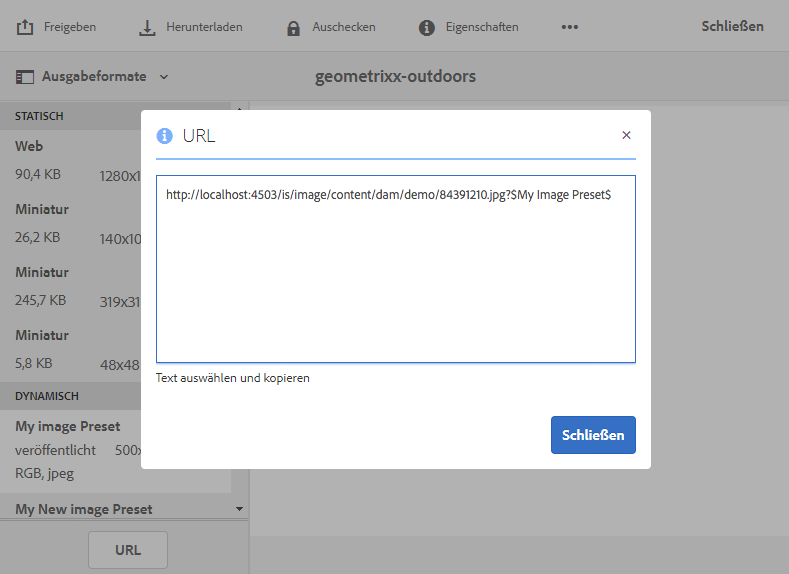
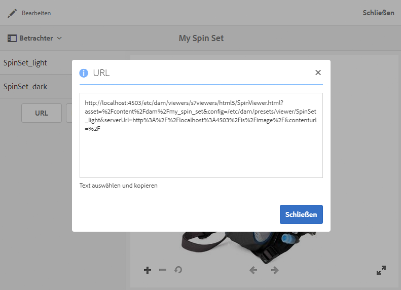

# Verknüpfen von URLs mit einer Web-Anwendung {#linking-urls-to-your-web-application}

<table>
    <tr>
        <td>
            <i>Neu</i> <a href="/help/assets/dynamic-media/dm-prime-ultimate.md"><b>Dynamic Media Prime und Ultimate</b></a>
        </td>
        <td>
            <i>Neu</i> <a href="/help/assets/assets-ultimate-overview.md"><b>AEM Assets Ultimate</b></a>
        </td>
        <td>
            <i>Neu</i> <a href="/help/assets/integrate-aem-assets-edge-delivery-services.md"><b>AEM Assets-Integration mit Edge Delivery Services</b></a>
        </td>
        <td>
            <i>Neu</i> <a href="/help/assets/aem-assets-view-ui-extensibility.md"><b>Erweiterbarkeit der Benutzeroberfläche</b></a>
        </td>
          <td>
            <i>Neu</i> <a href="/help/assets/dynamic-media/enable-dynamic-media-prime-and-ultimate.md"><b>Aktivieren von Dynamic Media Prime und Ultimate</b></a>
        </td>
    </tr>
    <tr>
        <td>
            <a href="/help/assets/search-best-practices.md"><b>Best Practices für die Suche</b></a>
        </td>
        <td>
            <a href="/help/assets/metadata-best-practices.md"><b>Best Practices für Metadaten</b></a>
        </td>
        <td>
            <a href="/help/assets/product-overview.md"><b>Content Hub</b></a>
        </td>
        <td>
            <a href="/help/assets/dynamic-media-open-apis-overview.md"><b>Dynamic Media mit OpenAPI-Funktionen</b></a>
        </td>
        <td>
            <a href="https://developer.adobe.com/experience-cloud/experience-manager-apis/"><b>Entwicklerdokumentation zu AEM Assets</b></a>
        </td>
    </tr>
</table>

Ihre Websites und Programme greifen über URL-Aufrufe auf Dynamic Media-Services zu. Wenn Sie ein Asset veröffentlichen, wird eine URL-Zeichenfolge, die auf das Asset verweist, von „Dynamic Media“ aktiviert. Sie können diese URLs zum Testen in einen Webbrowser einfügen.

Sie verknüpfen nur dann zu URLs, wenn Sie Adobe Experience Manager *nicht* als Ihren WCM verwenden. Die Verknüpfung – im Gegensatz zur Einbettung – wird verwendet, wenn Sie einen Video-Player als Popup oder modales Fenster übermitteln möchten. Wenn Sie Experience Manager als Ihr WCM verwenden, [fügen Sie die Assets direkt zu Ihrer Seite hinzu](adding-dynamic-media-assets-to-pages.md).

Um diese URL-Zeichenfolgen auf Ihren Web-Seiten und in Ihren Programmen zu platzieren, müssen Sie sie aus Dynamic Media kopieren.

>[!NOTE]
>
>URL-Zeichenfolgen sind nur für dynamische Ausgabedarstellungen von Assets verfügbar. Sie sind derzeit nicht für statische Assets verfügbar, die im DAM und nicht auf dem Dynamic Media-Server gespeichert sind. Für statische Ausgabedarstellungen wird die URL-Schaltfläche nicht angezeigt.

Siehe auch [Einbetten des Video- oder Bild-Viewers auf einer Web-Seite](embed-code.md).

Siehe auch [Verknüpfen von YouTube-URLs mit einer Web-Anwendung](video.md).

Siehe auch [Bereitstellen von optimierten Bildern für eine responsive Website](responsive-site.md).

Siehe auch [Hochladen von Assets](/help/assets/manage-digital-assets.md#uploading-assets).

## Abrufen einer URL für ein Asset {#obtaining-a-url-for-an-asset}

Sie können eine URL-Zeichenfolge abrufen, die von einer Bildvorgabe oder einer Viewer-Vorgabe generiert wird. Wenn Sie die URL kopieren, wird sie in der Zwischenablage abgelegt, sodass Sie sie nach Bedarf in Seiten einer Website oder einem Programm einfügen können.

>[!NOTE]
>
>Die URL kann erst kopiert werden, wenn Sie das gewählte Asset veröffentlicht haben. Darüber hinaus müssen Sie die Viewer-Vorgabe oder die Bildvorgabe veröffentlichen.
>
>Siehe [Veröffentlichen von Assets](publishing-dynamicmedia-assets.md).
>
>Siehe [Veröffentlichen von Viewer-Vorgaben](managing-viewer-presets.md#publishing-viewer-presets).
>
>Siehe [Veröffentlichen von Bildvorgaben](managing-image-presets.md#publishing-image-presets).

Es gibt mehrere Möglichkeiten, eine URL-Zeichenfolge zu erhalten. Die folgenden Schritte zeigen Ihnen jedoch nur eine der Methoden, die Sie verwenden können.

**So rufen Sie eine URL für ein Asset ab:**

1. Gehen Sie zum *veröffentlichten* Asset, dessen Bildvorgaben-URL oder Viewer-Vorgaben-URL Sie kopieren möchten, und klicken Sie auf das Asset, um es zu öffnen.

   Denken Sie daran, dass URLs erst kopiert werden können, *nachdem* Sie die Assets *veröffentlicht* haben. Darüber hinaus müssen die Viewer-Vorgabe oder die Bildvorgabe ebenfalls veröffentlicht werden.

   Siehe [Veröffentlichen von Assets](publishing-dynamicmedia-assets.md).

   Siehe [Veröffentlichen von Viewer-Vorgaben](managing-viewer-presets.md#publishing-viewer-presets).

   Siehe [Veröffentlichen von Bildvorgaben](managing-image-presets.md#publishing-image-presets).

1. Führen Sie je nach gewähltem Asset eine der folgenden Aktionen aus:

   * Wenn Sie ein Bild im Dropdown-Menü ausgewählt haben, klicken Sie auf **[!UICONTROL Ausgabedarstellungen]**.

     Klicken Sie unter der Überschrift **[!UICONTROL Dynamisch]** auf einen Vorgabennamen, um die zugehörige Ausgabedarstellung im rechten Rahmen anzuzeigen. Führen Sie bei Bedarf einen Bildlauf in der Liste „Ausgabedarstellungen“ durch, um die Überschrift „Dynamisch“ anzuzeigen.

     Klicken Sie unten in der linken Seitenleiste auf **[!UICONTROL URL]**.

     

   * Wenn Sie ein Rotationsset, Bildset, Karussellset oder Video ausgewählt haben, wählen Sie im Dropdown-Menü **[!UICONTROL Viewer]** aus.

     Wählen Sie in der linken Leiste den Namen einer Viewer-Vorgabe aus. Eine Vorschau des Sets oder Videos wird auf einer separaten Seite geöffnet.

     Klicken Sie auf der linken Leiste unten auf **[!UICONTROL URL]**.

     

1. Um das Asset in der Vorschau anzuzeigen oder zu Ihrer Web-Inhaltsseite hinzuzufügen, wählen Sie den Text aus und kopieren ihn in Ihren Webbrowser.

   Um das URL-Fenster zu verlassen, klicken Sie auf das **[!UICONTROL X]** oder auf **[!UICONTROL Schließen]**.

## Abrufen einer URL für ein statisches Asset {#obtaining-a-url-for-a-static-asset}

Dynamic Media unterstützt die Bereitstellung von statischen Assets, bei denen es sich neben Bildern und Videos um zusätzliche Assets handelt. Folgende unterstützte Formate von statischen Assets sind für die Bereitstellung verfügbar:

* 3D-Dateien
* Animiertes GIF
* Audiodateien
* CSS
* JavaScript (wenn das Unternehmen mit einer eigenen Domain konfiguriert wurde)
* PDF
* SVG
* XML
* ZIP

**So rufen Sie eine URL für ein statisches Asset ab:**

1. Gehen Sie zum *veröffentlichten* statischen Asset, dessen URL Sie kopieren möchten, und klicken Sie auf das Asset, um es zu öffnen.

   Beachten Sie, dass URLs erst kopiert werden können, *nachdem* Sie das statische Asset *veröffentlicht* haben.

   Siehe [Veröffentlichen von Assets](publishing-dynamicmedia-assets.md).

1. Verwenden Sie eine der folgenden Methoden, um die URL für das veröffentlichte statische Asset abzurufen:

   * `The URL of the published static is the following:`

      * `https://*<server_name>*/is/content/*<company_name>*/*<static_asset_filename>*.*<extension>*`

        Beispiel: `https://aem.com/is/content/adobe/image.gif`.

   * Klicken Sie auf **[!UICONTROL Asset]** > **[!UICONTROL Dynamische Ausgabedarstellungen]** und klicken Sie dann auf eine dynamische Ausgabedarstellung des statischen Assets und kopieren Sie die URL.

     Ändern Sie die kopierte URL, um `is/content` anstelle von `is/image/` im Pfad zu verwenden.

## Abrufen einer Video-URL für eine veröffentlichte Videoausgabedarstellung {#obtaining-a-video-url-for-a-published-video-rendition}

1. Gehen Sie in Adobe Experience Manager zu **[!UICONTROL Tools]** > **[!UICONTROL Bereitstellung]** > **[!UICONTROL Cloud]** > **[!UICONTROL Cloud Services]**.
1. Scrollen Sie auf der Seite **[!UICONTROL Cloud Services]** nach unten zur Überschrift **[!UICONTROL Dynamic Media Cloud Services]** und klicken Sie dann auf **[!UICONTROL Konfigurationen anzeigen]**.
1. Wählen Sie unter **[!UICONTROL Verfügbare Konfigurationen]** den Namen der gewünschten Konfiguration.

1. Kopieren Sie auf der Seite **[!UICONTROL Cloud-Einstellungen für Dynamic Media]** unter **[!UICONTROL Videodienst-URL]** den gesamten URL-Pfad. Der kopierte URL-Pfad wird in nachfolgenden Schritten benötigt.

   Der URL-Pfad kann zum Beispiel folgendermaßen aussehen:

   `https://s7athens.macromedia.com:9090/DMGateway/`

   (Der oben angegebene Pfad dient nur zur Veranschaulichung. Es handelt sich nicht um den Pfad, den Sie kopieren.)

1. Kopieren Sie unter **[!UICONTROL Registrierungs-ID]** den Kundennamen im letzten Teil der ID.

   Beispiel: Für die Registrierungs-ID `87654321|MyCompany` lautet der Name des Kunden `MyCompany`.

1. Klicken Sie links oben auf der Seite auf **[!UICONTROL Cloud Services]** und dann auf das Adobe Experience Manager-Symbol. Gehen Sie anschließend zu **[!UICONTROL Allgemein]** > **[!UICONTROL CRXDE Lite]**.
1. Kopieren Sie den gesamten Pfad für die Videoausgabedarstellung aus dem JCR (Java™ Content Repository).

   Der Pfad für die Videoausgabedarstellung kann zum Beispiel folgendermaßen aussehen:

   `/_renditions_/0bd/0bd28743-a616-4fe6-92aa-6eae7c2112f/avs/Momentum_1080-0x720-2600k.mp4`

   (Der oben angegebene Pfad dient nur zur Veranschaulichung. Es handelt sich nicht um den Pfad, den Sie kopieren.)

1. Um einen vollständigen URL-Pfad zu erstellen, ordnen Sie die kopierten Informationen in der folgenden Reihenfolge an:

   `<Video_Service_URL>/public/<Customer_name_from_Registration_ID>/<Video_rendition_path>`

   Wenn Sie den Beispielpfad und den Beispiel-Kundennamen der vorherigen Schritte verwenden, sieht der vollständige Pfad folgendermaßen aus:

   `https://s7athens.macromedia.com:9090/DMGateway/public/MyCompany/_renditions_/0bd/0bd28743-a616-4fe6-92aa-6eae7c2112ff/avs/Momentum_1080-0x720-2600k.mp4`

   Dieser Pfad ist die vollständige Video-URL für eine veröffentlichte Videoausgabedarstellung.

## Abrufen einer Video-URL für Streaming mit adaptiver Bit-Rate (HLS) {#obtaining-a-video-url-for-adaptive-streaming-hls}

1. Gehen Sie in Adobe Experience Manager zu **[!UICONTROL Tools]** > **[!UICONTROL Bereitstellung]** > **[!UICONTROL Cloud]** > **[!UICONTROL Cloud Services]**.
1. Scrollen Sie auf der Seite **[!UICONTROL Cloud Services]** nach unten zur Überschrift **[!UICONTROL Dynamic Media Cloud Services]** und klicken Sie dann auf **[!UICONTROL Konfigurationen anzeigen]**.
1. Wählen Sie unter **[!UICONTROL Verfügbare Konfigurationen]** den Namen der gewünschten Konfiguration.
1. Gehen Sie auf der Seite **[!UICONTROL Cloud Services-Einstellungen für Dynamic Media]** wie folgt vor:

   * Unter **[!UICONTROL Videodienst-URL]** kopieren Sie den gesamten URL-Pfad. Der kopierte URL-Pfad wird in diesen Schritten benötigt. Der URL-Pfad kann zum Beispiel folgendermaßen aussehen:

   `https://gateway-na.assetsadobe.com/DMGateway/`

   (Der oben angegebene Pfad dient nur zur Veranschaulichung. Es handelt sich nicht um den Pfad, den Sie kopieren.)

   * Kopieren Sie unter **[!UICONTROL Registrierungs-ID]** den Kundennamen im letzten Teil der ID. Sie benötigen den kopierten Kundennamen später bei diesen Schritten.

     Beispiel: Für die Registrierungs-ID `87654321|demoCo` lautet der Name des Kunden, den Sie kopieren, `demoCo`.

1. Je nachdem, welches Videobereitstellungsprotokoll Sie verwenden möchten, kopieren Sie den entsprechenden Protokollselektor. Der kopierte Protokollselektor wird in den nachfolgenden Schritten benötigt.

   <table>
    <tbody>
      <tr>
      <td><strong>Von Ihnen verwendetes Videobereitstellungsprotokoll</strong></td>
      <td><strong>Zu verwendender Protokollselektor</strong></td>
      </tr>
      <tr>
      <td>
HTTP
 
Wenn Sie HTTP (nicht sichere Videobereitstellung) verwenden, müssen Sie in der Videodienst-URL, die Sie zuvor kopiert haben, <code>https</code> in <code>http</code> ändern.
 </td>
      <td><code>public/</code></td>
      </tr>
      <tr>
      <td>HTTPS</td>
      <td><code>public-ssl/</code></td>
      </tr>
    </tbody>
   </table>

1. Kopieren Sie den vollständigen Video-Asset-Pfad in Adobe Experience Manager, wie mit Dynamic Media verarbeitet. Der kopierte Video-Asset-Pfad wird in den nachfolgenden Schritten benötigt.

   Beispiel:

   `/content/dam/marketing/MyVideo.mp4`

1. Kombinieren Sie alle Teile, die Sie zuvor kopiert haben, um eine Zeichenfolge in der folgenden Reihenfolge zu erstellen:

   &lt; `video service URL`>&lt; `protocol selector`>&lt; `customer name`>&lt; `video asset path`>

   Unter Verwendung der kopierten Informationen aus den obigen Beispielen würde die Zeichenfolge wie folgt aussehen:

   `https://gateway-na.assetsadobe.com/DMGateway/public-ssl/demoCo/content/dam/marketing/MyVideo.mp4`

1. Vervollständigen Sie die URL, indem Sie am Ende der Zeichenfolge `.m3u8` anhängen. Wenn beispielsweise `.m3u8` aus dem vorherigen Schritt an die Zeichenfolge angehängt wird, würde der vollständige URL-Pfad wie folgt aussehen:

   `https://gateway-na.assetsadobe.com/DMGateway/public-ssl/demoCo/content/dam/marketing/MyVideo.mp4.m3u8`

## Verwenden von HTTP/2 zur Bereitstellung von Dynamic Media-Assets {#using-http-to-deliver-your-dynamic-media-assets}

HTTP/2 ist das neue, aktualisierte Web-Protokoll, das die Kommunikation zwischen Browser und Servern verbessert. Es beschleunigt die Übertragung von Informationen und reduziert die erforderliche Prozessorleistung. Die Bereitstellung von Dynamic Media-Assets kann über HTTP/2 erfolgen, das schnellere Antwort- und Ladezeiten bietet.

Siehe [Bereitstellung von Inhalt über HTTP/2](http2faq.md), um ausführliche Informationen zu den ersten Schritten mit HTTP/2 mit Ihrem Dynamic Media-Konto zu erhalten.
