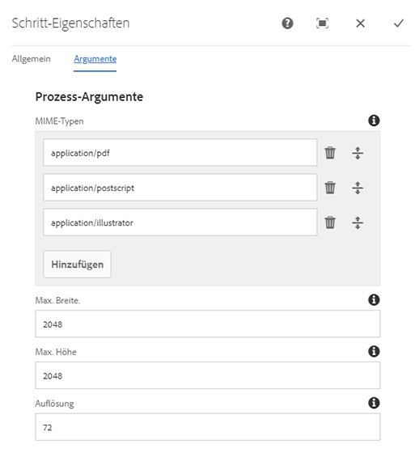
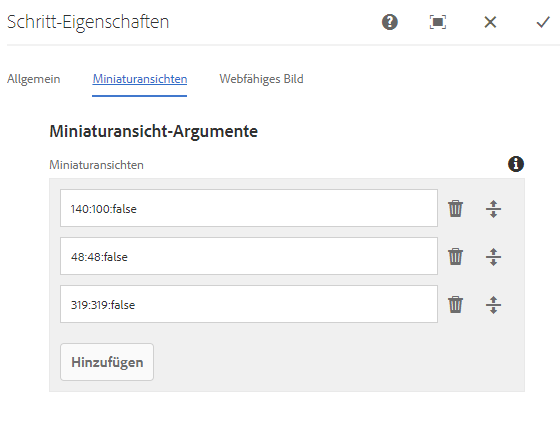
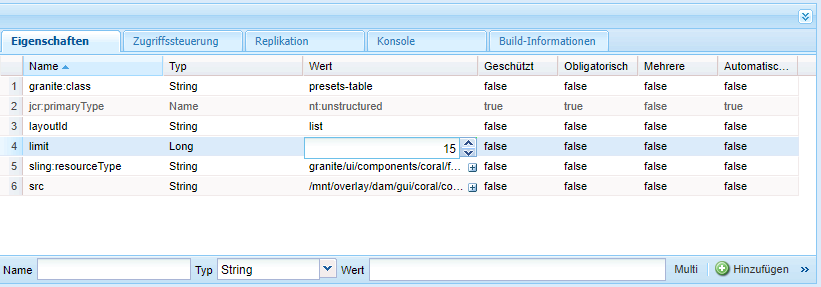
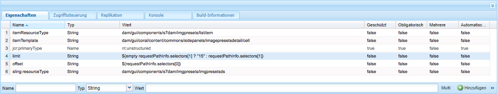
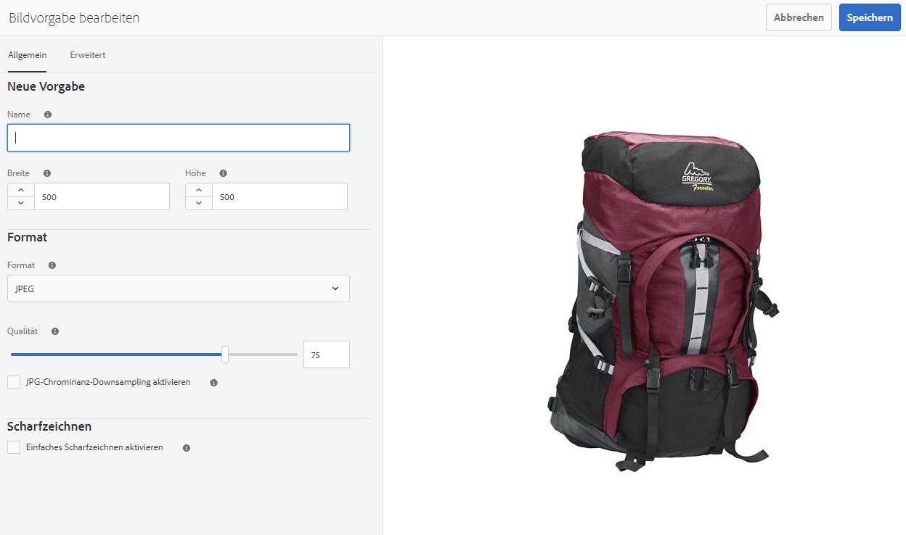
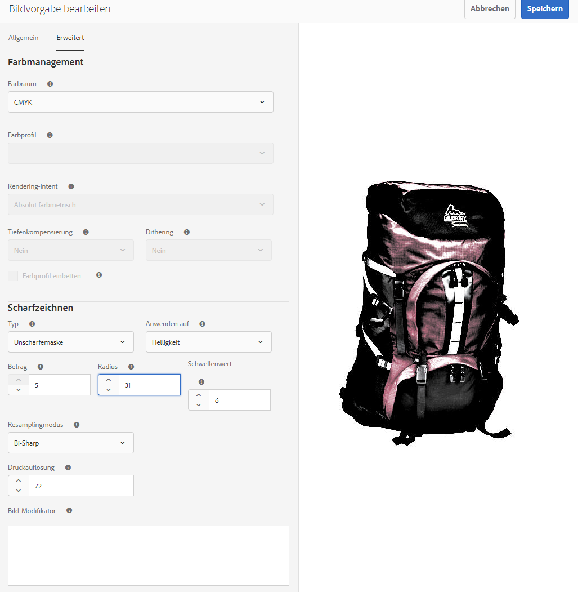
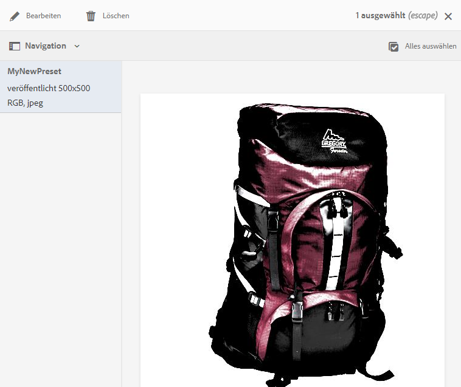

# Verwalten von Bildvorgaben{#managing-image-presets}

Anhand von Bildvorgaben kann Adobe Experience Manager Assets Bilder mit unterschiedlichen Größen, Formaten oder Bildeigenschaften dynamisch bereitstellen. Jede Bildvorgabe stellt eine vordefinierte Sammlung von Größenangaben und Formatierungsbefehlen für die Anzeige von Bildern dar. Wenn Sie eine Bildvorgabe erstellen, wählen Sie eine Größe für die Bildbereitstellung aus. Sie wählen auch Formatierungsbefehle, damit das Erscheinungsbild des Bildes optimiert wird, wenn das Bild zur Anzeige bereitgestellt wird.

Admins können Vorgaben für den Asset-Export erstellen. Benutzer können eine Vorgabe auswählen, wenn sie Bilder exportieren, sodass die Bilder entsprechend den Spezifikationen des Administrators umformatiert werden.

Sie können auch responsive Bildvorgaben erstellen. Wenn Sie eine responsive Bildvorgabe auf Assets anwenden, werden diese je nach Gerät oder Bildschirmgröße bei der Anzeige geändert. Sie können Bildvorgaben konfigurieren, um im Farbraum zusätzlich zu RGB oder Graustufen auch CMYK zu verwenden.

In diesem Abschnitt wird beschrieben, wie Bildvorgaben erstellt, geändert und allgemein verwaltet werden. Sie können bei der Vorschau eines Bildes jederzeit eine Bildvorgabe darauf anwenden. Siehe [Anwenden von Bildvorgaben](/help/assets/dynamic-media/image-presets.md).

>[!NOTE]
>
>Die intelligente Bildbearbeitung arbeitet mit bestehenden Bildvorgaben und reduziert im letzten Moment abhängig vom Browser oder der Geschwindigkeit der Netzverbindung die Größe der Bilddatei intelligent noch weiter. Weitere Informationen finden Sie unter [Intelligente Bildbearbeitung](/help/assets/dynamic-media/imaging-faq.md).

## Informationen zu Bildvorgaben {#understanding-image-presets}

Wie ein Makro ist eine Bildvorgabe eine vordefinierte Sammlung aus Größenangaben und Formatierungsbefehlen, die unter einem Namen gespeichert wird. Stellen Sie sich folgendes Szenario vor, um ein besseres Verständnis von Bildvorgaben zu erlangen: Für Ihre Website muss jedes Produktbild in unterschiedlichen Größen, Formaten und Kompressionsraten auf Desktop- und Mobilgeräten angezeigt werden.

Sie können zwei Bildvorgaben erstellen: eine mit 500 x 500 Pixel für die Desktop-Version und die andere mit 150 x 150 Pixel für Mobilgeräte. Sie können zwei Bildvorgaben erstellen: `Enlarge` (Vergrößern) dient der Anzeige von Bildern mit einer Auflösung von 500 x 500 Pixel und `Thumbnail` (Miniatur) der Anzeige von Bildern mit einer Auflösung von 150 x 150 Pixel. Zum Übermitteln von Bildern mit der Größe `Enlarge` und `Thumbnail` sucht Adobe Experience Manager nach der Definition von `Enlarge Image Preset` und `Thumbnail Image Preset`. Experience Manager generiert anschließend dynamisch ein Bild anhand der Größen- und Formatierungsspezifikationen der jeweiligen Bildvorgabe.

Bilder, die bei der dynamischen Bereitstellung verkleinert werden, können an Schärfe und Detailgenauigkeit verlieren. Aus diesem Grund enthält jede Bildvorgabe Formatierungssteuerelemente zum Optimieren eines Bildes, wenn es in einer bestimmten Größe bereitgestellt wird. Dadurch wird sichergestellt, dass die Bilder scharf und deutlich auf der Website oder im Programm angezeigt werden.

Admins können Bildvorgaben erstellen. Sie können völlig neue Bildvorgaben erstellen oder eine vorhandene Vorgabe bearbeiten und unter einem neuen Namen speichern.

## Verwalten von Bildvorgaben {#managing-image-presets-1}

Sie können Bildvorgaben in Experience Manager verwalten, indem Sie auf das Adobe Experience Manager-Logo klicken, um auf die globale Navigationskonsole zuzugreifen. Klicken Sie dann auf das Werkzeugsymbol und gehen Sie zu **[!UICONTROL Assets]** > **[!UICONTROL Bildvorgaben]**.


>[!NOTE]
>
>Alle erstellten Bildvorgaben sind auch als dynamische Ausgabedarstellungen verfügbar, wenn Sie eine Vorschau von Assets anzeigen oder Assets bereitstellen.
>
>Sie müssen Bildvorgaben *nicht* veröffentlichen, da die Veröffentlichung von Bildvorgaben automatisch erfolgt.
>
>Siehe [Veröffentlichen von Bildvorgaben](#publishing-image-presets).

>[!NOTE]
>
>Das System zeigt verschiedene Ausgabedarstellungen, wenn Sie **[!UICONTROL Ausgabedarstellungen]** in der Detailansicht eines Assets auswählen. Sie können die Anzahl der angezeigten Bildvorgaben erhöhen oder verringern. Siehe [Erhöhen der Anzahl der angezeigten Bildvorgaben](#increasing-or-decreasing-the-number-of-image-presets-that-display).

## Beziehung zwischen Bildvorgaben und Ausgabedarstellungen {#how-image-presets-relate-to-renditions}

Bildvorgaben definieren, wie Dynamic Media Bilder bereitstellt, einschließlich Größe, Formatierung, Komprimierung und andere Anzeigeparameter. Vorgaben generieren keine Ausgabedarstellungen selbst. Stattdessen sind sie auf Ausgabedarstellungen angewiesen, die bei der Verarbeitung von Assets erstellt werden.

### Generieren von Ausgabedarstellungen in AEM as a Cloud Service{#rendition-generation-in-aemaacs}

In AEM as a Cloud Service werden Ausgabedarstellungen mithilfe von [Asset-Microservices](https://experienceleague.adobe.com/de/docs/experience-manager-cloud-service/content/assets/manage/asset-microservices-configure-and-use#) generiert. Der Workflow DAM-Update-Asset kann in Cloud Service nicht angepasst werden.

Zu den wichtigen Überlegungen gehören die folgenden:

* Ausgabedarstellungen werden beim Hochladen generiert.
* Änderungen an einem Verarbeitungsprofil betreffen neu hochgeladene Assets. Vorhandene Assets müssen erneut verarbeitet werden, wenn neue Ausgabedarstellungen erforderlich sind.
* Die Anpassung von Workflow-Modellen wird in AEM as a Cloud Service zur Erzeugung von Ausgabedarstellungen nicht unterstützt.

Bildvorgaben verweisen auf verfügbare Ausgabedarstellungen zum Zeitpunkt der Bereitstellung. Stellen Sie sicher, dass die erforderlichen Ausgabedarstellungen vorhanden sind, bevor Sie Bildvorgaben konfigurieren oder verwenden.

**So steuern Sie, welche Ausgabedarstellungen generiert werden:**

1. Erstellen oder bearbeiten Sie [Verarbeitungsprofil](https://experienceleague.adobe.com/de/docs/experience-manager-cloud-service/content/assets/manage/asset-microservices-configure-and-use#).
2. Konfigurieren Sie die erforderlichen Ausgabedarstellungsdefinitionen.
3. Wenden Sie das Verarbeitungsprofil auf den entsprechenden Ordner an.

Wenn Assets in einen Ordner hochgeladen werden, auf den ein Verarbeitungsprofil angewendet wurde, generieren die Asset-Microservices automatisch die definierten Ausgabedarstellungen.

<!--
### Adobe Illustrator (AI), PostScript&reg; (EPS), and PDF file formats {#adobe-illustrator-ai-postscript-eps-and-pdf-file-formats}

If you intend to support the ingestion of AI, EPS, and PDF files so that you can generate dynamic renditions of these file formats, review the following information before you create Image Presets.

Adobe Illustrator's file format is a variant of PDF. The main differences, in the context of Experience Manager Assets, are the following:

* Adobe Illustrator documents consist of a single page with multiple layers. Each layer is extracted as a PNG subasset under the main Illustrator asset.
* PDF documents consist of one or more pages. Each page is extracted as a single page PDF subasset under the main multi-page PDF document.

The `Create Sub Asset process` component creates the subassets within the overall `DAM Update Asset` workflow. To see this process component within the workflow, navigate to **[!UICONTROL Tools]** > **[!UICONTROL Workflow]** > **[!UICONTROL Models]** > **[!UICONTROL DAM Update Asset]** > **[!UICONTROL Edit]**.

See also [Viewing pages of a multi-page file](/help/assets/manage-linked-subassets.md#view-pages-of-a-multi-page-file).

You can view the subassets or the pages when you open the asset, select the Content menu, and select **[!UICONTROL Subassets]** or **[!UICONTROL Pages]**. The subassets are real assets. The `Create Sub Asset` workflow component extracts the PDF pages. They are then stored as `page1.pdf`, `page2.pdf`, and so on, below the main asset. After they are stored, the `DAM Update Asset` workflow processes them.

To use Dynamic Media to preview and generate dynamic renditions for AI, EPS or PDF files, the following processing steps are required:

1. In the `DAM Update Asset` workflow, the `Rasterize PDF/AI Image Preview Rendition` process component rasterizes the first page of the original asset &ndash; using the configured resolution &ndash; into a `cqdam.preview.png` rendition.

1. The `Dynamic Media Process Image Assets` process component within the workflow optimizes the `cqdam.preview.png` rendition into a PTIFF.

>[!NOTE]
>
>In the DAM Update Asset workflow, the **[!UICONTROL EPS thumbnails]** step generates thumbnails for EPS files.

#### PDF/AI/EPS asset metadata properties {#pdf-ai-eps-asset-metadata-properties}

| **Metadata property** |**Description** |
|---|---|
| `dam:Physicalwidthininches` |Document width in inches. |
| `dam:Physicalheightininches` |Document height in inches. |

You access `Rasterize PDF/AI Image Preview Rendition` process component options by way of the `DAM Update Asset` workflow.

Select Adobe Experience Manager in the upper left, the click **[!UICONTROL Tools]** > **[!UICONTROL Workflow]** > **[!UICONTROL Models]**. On the Workflow Models page, select **[!UICONTROL DAM Update Asset]**, then on the toolbar select **[!UICONTROL Edit]**. On the DAM Update Asset workflow page, double-select the `Rasterize PDF/AI Image Preview Rendition` process component to open its Step Properties dialog box.

#### Rasterize PDF/AI Image Preview Rendition options {#rasterize-pdf-ai-image-preview-rendition-options}



Arguments to rasterize PDF or AI workflow

|Process Argument | Default setting | Description |
|---|---|---|
| Mime Types | application/pdf<br>application/postscript<br>application/illustrator| List of document mime-types that are considered to be PDF or Illustrator documents. |
| Max Width | 2048 | Maximum width of the generated preview rendition, in pixels.|
| Max Height | 2048| Maximum height of the generated preview rendition, in pixels. |
| Resolution | 72 | Resolution to rasterize the first page, in ppi (pixels per inch). |

Using the default process arguments, the first page of a PDF/AI document is rasterized at 72 ppi and the generated preview image is sized at 2048 x 2048 pixels. For a typical deployment, you can increase the resolution to a minimum of 150 ppi or more. For example, a US letter size document at 300 ppi requires a maximum width and height of 2550 x 3300 pixels, respectively.

Max Width and Max Height limit the resolution at which to rasterize. For example, if the maximums are unchanged, and Resolution is set to 300 ppi, a US Letter document is rasterized at 186 ppi. That is, the document is 1581 x 2046 pixels.

The `Rasterize PDF/AI Image Preview Rendition` process component has a maximum defined to ensure that it does not create overly large images in memory. Such large images can overflow the memory provided to the JVM (Java&trade; Virtual Machine). Care must be taken to provide the JVM with enough memory to manage the configured number of parallel workflows, with each having the potential to create an image at the maximum configured size. -->

<!--
### InDesign (INDD) file format {#indesign-indd-file-format}

If you intend to support the ingestion of INDD files so that you can generate dynamic rendition of this file format, review the following information before you create Image Presets.

For InDesign files, sub assets are extracted only if the Adobe InDesign Server is integrated with Experience Manager. Referenced assets are linked based on their metadata. InDesign Server is not required for linking. However, the referenced assets must be present within Experience Manager before the InDesign files are processed for the links to be created between the InDesign files and the referenced assets.

See [Integrate Experience Manager Assets with InDesign Server](/help/assets/indesign.md).

The Media Extraction process component in the `DAM Update Asset` workflow runs several pre-configured Extend Scripts to process InDesign files.


The ExtendScript paths in the arguments of the Media Extraction process component in the DAM Update Asset workflow.

The following scripts are used by Dynamic Media integration:


|ExtendScript name | Default | Description |
|---|---|---|
| ThumbnailExport.jsx | Yes  | Generates a 300 PPI `thumbnail.jpg` rendition that is optimized and turned into a PTIFF rendition by `Dynamic Media Process Image Assets` process component.  |
| JPEGPagesExport.jsx | Yes | Generates a 300 PPI JPEG subasset for each page. The JPEG subasset is a real asset stored under the InDesign asset. The `DAM Update Asset` workflow optimizes and converts it into a PTIFF. |
| PDFPagesExport.jsx | No | Generates a PDF subasset for each page. The PDF subasset gets processed as described earlier. Because the PDF contains a single page only, no subassets are generated. |
-->

<!--
### Configure the image thumbnail size {#configuring-image-thumbnail-size}

You can configure the size of thumbnails by configuring those settings in the **[!UICONTROL DAM Update Asset]** workflow. There are two steps in the workflow where you can configure the thumbnail size of image assets. One (**[!UICONTROL Dynamic Media Process Image Assets]**) is used for dynamic image assets. The other (**[!UICONTROL Process Thumbnails]**) is used for static thumbnail generation or when all other processes fail to generate thumbnails. Regardless, *both* must have the same settings.

The **[!UICONTROL Dynamic Media Process Image Assets]** step uses the image server to generate thumbnails, independently of the configuration applied to the **[!UICONTROL Process Thumbnails]** step. Generating thumbnails through the **[!UICONTROL Process Thumbnails]** step is the slowest and most memory intensive way to create thumbnails.

Thumbnail sizing is defined in the following format: **[!UICONTROL width:height:center]**, for example, `80:80:false`. The width and height determine the size in pixels of the thumbnail. The center value is either false or true. If set to true, it indicates that the thumbnail image has exactly the size given in the configuration. If the resized image is smaller, it is centered within the thumbnail.

>[!NOTE]
>
>* Thumbnail sizes for EPS files are configured in the **[!UICONTROL EPS thumbnails]** step, in the **[!UICONTROL Arguments]** tab under Thumbnails.
>
>* Thumbnail sizes for videos are configured in the **[!UICONTROL FFmpeg thumbnails]** step, in the **[!UICONTROL Process]** tab under **[!UICONTROL Arguments]**.
>

**To configure the image thumbnail size:**

1. Navigate to **[!UICONTROL Tools]** > **[!UICONTROL Workflow]** > **[!UICONTROL Models]** > **[!UICONTROL DAM Update Asset]** > **[!UICONTROL Edit]**.
1. Select the **[!UICONTROL Dynamic Media Process Image Assets]** step and select the **[!UICONTROL Thumbnails]** tab. Change the thumbnail size, as needed, then select **[!UICONTROL OK]**.

   

1. Select the **[!UICONTROL Process Thumbnails]** step, then select the **[!UICONTROL Thumbnails]** tab. Change the thumbnail size, as needed, then select **[!UICONTROL OK]**.

   >[!NOTE]
   >
   >The values in the thumbnails argument in the **[!UICONTROL Process Thumbnails]** step must match the thumbnails argument in the **[!UICONTROL Dynamic Media Process Image Assets]** step.

1. Select **[!UICONTROL Save]** to save the changes to the workflow.
-->

## Erhöhen oder Verringern der Anzahl angezeigter Bildvorgaben {#increasing-or-decreasing-the-number-of-image-presets-that-display}

Erstellte Bildvorgaben sind auch als dynamische Ausgabedarstellungen verfügbar, wenn Sie eine Vorschau von Assets anzeigen. Experience Manager zeigt verschiedene dynamische Ausgabedarstellungen an, wenn ein Asset über **[!UICONTROL Detailansicht > Ausgabedarstellungen]** angezeigt wird. Sie können die Anzahl der angezeigten Ausgabedarstellungen erhöhen oder verringern.

**So erhöhen oder verringern Sie die Anzahl angezeigter Bildvorgaben:**

1. https://localhost Navigieren Sie zu CRXDE Lite ([:4502/crx/de](https://localhost:4502/crx/de)).
1. Navigieren Sie zum Knoten für die Bildvorgabenliste unter `/libs/dam/gui/coral/content/commons/sidepanels/imagepresetsdetail/imgagepresetslist`.

   

1. Ändern Sie für die Eigenschaft **[!UICONTROL limit]** den **[!UICONTROL Wert]**, für den standardmäßig 15 festgelegt ist, in einen höheren Wert.
1. Navigieren Sie zur Datenquelle der Bildvorgabe unter `/libs/dam/gui/coral/content/commons/sidepanels/imagepresetsdetail/imgagepresetslist/datasource`

   

1. Ändern Sie in der Eigenschaft „limit“ den Wert auf die gewünschte Zahl, z. B. `{empty requestPathInfo.selectors[1] ? "20" : requestPathInfo.selectors[1]}`.
1. Klicken Sie auf **[!UICONTROL Alle speichern]**.

## Erstellen von Bildvorgaben {#creating-image-presets}

Erstellen Sie Bildvorgaben, damit Sie bei der Vorschau oder Veröffentlichung Einstellungen konsistent auf alle Bilder anwenden können.

>[!NOTE]
>
>Bei Verwendung von Internet Explorer 9 wird die Erstellung einer Vorgabe nicht sofort nach dem Speichern in der Vorgabenliste angezeigt. Um dieses Problem zu umgehen, deaktivieren Sie den Cache für IE9.

Wenn Sie die Aufnahme von AI-, PDF- und EPS-Dateien unterstützen möchten, um aus diesen Dateiformaten dynamische Ausgabedarstellungen zu generieren, lesen Sie die folgenden Informationen, bevor Sie Bildvorgaben erstellen.

Siehe [Dateiformate Adobe Illustrator (AI), PostScript® (EPS) und PDF](#adobe-illustrator-ai-postscript-eps-and-pdf-file-formats).

Wenn Sie die Aufnahme von INDD-Dateien unterstützen möchten, um aus diesem Dateiformat dynamische Ausgabedarstellungen zu generieren, lesen Sie die folgenden Informationen, bevor Sie Bildvorgaben erstellen.

Siehe [Dateiformat InDesign (INDD)](#indesign-indd-file-format).

**So erstellen Sie Bildvorgaben:**

1. Klicken Sie in Experience Manager auf das Adobe Experience Manager-Logo, um auf die globale Navigationskonsole zuzugreifen, und dann auf **[!UICONTROL Tools]** > **[!UICONTROL Assets]** > **[!UICONTROL Bildvorgaben]**.
1. Wählen Sie **[!UICONTROL Erstellen]**.

   

   >[!NOTE]
   >
   >Damit diese Bildvorgabe responsiv wird, löschen Sie die Werte in den Feldern **[!UICONTROL Breite]** und **[!UICONTROL Höhe]** und lassen Sie sie leer.

1. Geben Sie auf der Seite **[!UICONTROL Bildvorgabe bearbeiten]** auf den Registerkarten **[!UICONTROL Allgemein]** und **[!UICONTROL Erweitert]** die entsprechenden Werte (einschließlich eines Namens) ein. Die Optionen werden unter [Bildvorgaben-Optionen](#image-preset-options) beschrieben. Vorgaben werden im linken Bereich angezeigt und können nur zusammen mit anderen Assets verwendet werden.

   

1. Wählen Sie **[!UICONTROL Speichern]** aus.

## Erstellen einer responsiven Bildvorgabe {#creating-a-responsive-image-preset}

Um eine responsive Bildvorgabe zu erstellen, führen Sie die im Abschnitt [Erstellen von Bildvorgaben](#creating-image-presets) beschriebenen Schritte durch. Löschen Sie die Werte für Höhe und Breite im Fenster **[!UICONTROL Bildvorgabe bearbeiten]** und lassen Sie sie leer.

Dadurch wird diese Bildvorgabe in Experience Manager als responsiv erkannt. Sie können die anderen Werte nach Bedarf anpassen.

>[!NOTE]
>
>Um die Schaltflächen **[!UICONTROL URL]** und **[!UICONTROL RESS]** beim Anwenden einer Bildvorgabe auf ein Asset anzuzeigen, muss das Asset veröffentlicht werden.
>
>
>
>Die Bildvorgaben und Bild-Assets werden automatisch veröffentlicht.

### Optionen für Bildvorgaben {#image-preset-options}

Die in diesem Abschnitt beschriebenen Optionen sind beim Erstellen oder Bearbeiten von Bildvorgaben verfügbar. Adobe empfiehlt zudem für den Anfang als Best Practice die Auswahl der folgenden Optionen:

* **[!UICONTROL Format]** (Registerkarte **[!UICONTROL Allgemein]**) – Wählen Sie **[!UICONTROL JPEG]** oder ein anderes Format, das Ihren Anforderungen entspricht. Alle Webbrowser unterstützen das JPEG-Bildformat; es bietet eine gute Balance zwischen Dateigröße und Bildqualität. Bilder im JPEG-Format nutzen jedoch ein verlustbehaftetes Komprimierungsschema, das unerwünschte Bildartefakte hervorrufen kann, wenn die Komprimierungseinstellung zu niedrig ist. Aus diesem Grund empfiehlt Adobe, die Komprimierungsqualität auf 75 einzustellen. Diese Einstellung bietet einen angemessenen Ausgleich zwischen Bildqualität und kleiner Dateigröße.

* **[!UICONTROL Einfaches Scharfzeichnen aktivieren]**: Aktivieren Sie nicht die Option **[!UICONTROL Einfaches Scharfzeichnen aktivieren]** (dieser Scharfzeichnungsfilter bietet weniger Kontrolle als die Einstellungen für „Unschärfemaske“).

* **[!UICONTROL Scharfzeichnen: Resampling-Modus]**: Wählen Sie **[!UICONTROL Scharf2]** aus.

### Optionen auf der Registerkarte „Standard“ {#basic-tab-options}

| Feld | Beschreibung |
| --- | --- |
| **Name** | Geben Sie einen aussagekräftigen Namen ohne Leerzeichen ein. Um den Benutzern die Identifizierung dieser Bildvorgabe zu erleichtern, nehmen Sie die Angabe der Bildgröße in den Namen auf. |
| **Breite und Höhe** | Geben Sie die Größe in Pixel ein, in der das Bild übermittelt wird. Breite und Höhe müssen größer als 0 Pixel sein. Wenn einer der beiden Werte 0 ist, wird keine Vorgabe erstellt. Wenn beide Werte leer sind, wird eine responsive Bildvorgabe erstellt. |
| **Format** | Wählen Sie im Menü ein Format aus.<br>Bei Auswahl von **JPEG** stehen die folgenden anderen Optionen zur Verfügung:<br>• **Qualität**: Die JPEG-Qualitätsskala ist 1–100. Die Skala ist sichtbar, wenn Sie den Schieberegler bewegen.<br>• **PG-Chrominanz-Downsampling aktivieren**: Da das menschliche Auge weniger empfindlich gegenüber hochfrequenten Farbinformationen als gegenüber hochfrequenter Luminanz ist, teilen JPEG-Bilder die Bildinformationen in Luminanz- und Farbkomponenten auf. Wenn ein JPEG-Bild komprimiert wird, bleibt die Luminanzkomponente in der vollen Auflösung erhalten, während bei den Farbkomponenten ein Downsampling anhand einer Durchschnittsbildung von Pixelgruppen erfolgt. Durch Downsampling wird das Datenvolumen auf die Hälfte oder ein Drittel reduziert, wobei die wahrgenommene Qualität nur minimal beeinträchtigt wird. Das Downsampling ist nicht auf Graustufenbilder anwendbar. Mit dieser Methode wird der Komprimierungsgrad für Bilder mit hohem Kontrast (z. B. Bilder mit überlagertem Text) reduziert.<br><br>Wenn Sie **GIF** oder **GIF mit Alpha** auswählen, erhalten Sie die folgenden zusätzlichen Optionen für die **GIF-Farbquantifizierungsoptionen**:<br>• **Typ**: Wählen Sie **Adaptiv** (Standard), **Web** oder **Macintosh** aus. Wenn Sie **GIF mit Alpha** auswählen, ist die Option „Macintosh“ nicht verfügbar.<br>• **Dithering**: Wählen Sie **Diffus** oder **Aus**.<br>• **Anzahl Farben**: Geben Sie eine Zahl von 2 bis 256 ein.<br>• **Farbliste**: Geben Sie eine kommagetrennte Liste ein. Geben Sie beispielsweise für Weiß, Grau und Schwarz „`000000,888888,ffffff`“ ein.<br><br>Wenn Sie **PDF**, **TIFF** oder **TIFF mit Alpha** auswählen, erhalten Sie die folgende zusätzliche Option:<br>• **Komprimierung**: Wählen Sie einen Komprimierungsalgorithmus. Die Algorithmusoptionen für PDF lauten **Kein**, **ZIP** und **JPEG**. Für TIFF lauten sie **Kein**, **LZW**, **JPEG** und **ZIP**. Für TIFF mit Alpha lauten sie **Kein**, **LZW** und **ZIP**.<br><br>Die Auswahl **PNG**, **PNG mit Alpha** oder **EPS** ergibt keine zusätzlichen Optionen. |
| **Scharfzeichnen** | Wählen Sie die Option **Einfaches Scharfzeichnen aktivieren**, um einen einfachen Scharfzeichnungsfilter auf das Bild anzuwenden, nachdem die Skalierung abgeschlossen wurde. Mit der Scharfzeichnung können Sie unter Umständen Weichzeichnung kaschieren, die durch die Anzeige eines Bildes in einer anderen Größe entsteht. |

### Optionen auf der Registerkarte „Erweitert“ {#advanced-tab-options}

<table>
 <tbody>
  <tr>
   <td><strong>Feld</strong></td>
   <td><strong>Beschreibung</strong></td>
  </tr>
  <tr>
   <td><strong>Farbraum</strong></td>
   <td>Wählen Sie <strong>RGB, CMYK</strong> oder <strong>Graustufen</strong> als Farbraum aus.</td>
  </tr>
  <tr>
   <td><strong>Farbprofil</strong></td>
   <td>Wählen Sie das Profil des Ausgabefarbraums aus, in den das Asset konvertiert werden soll, sofern dieser sich von dem des Arbeitsprofils unterscheidet.</td>
  </tr>
  <tr>
   <td><strong>Rendering-Intent</strong></td>
   <td>Sie können den standardmäßigen Rendering-Intent überschreiben. Der Rendering-Intent legt fest, was mit Farben passiert, die im Farbprofil des Ziels nicht wiedergegeben werden können (außerhalb der Farbskala). Der Rendering-Intent wird ignoriert, wenn er nicht mit dem ICC-Profil kompatibel ist.
    <ul>
     <li>Wählen Sie <strong>Wahrnehmungsoptimiert</strong> aus, damit die gesamte Farbskala von einem Farbraum in einen anderen Farbraum komprimiert wird, wenn eine oder mehrere Farben im Originalbild außerhalb der Farbskala des Zielfarbraums liegen.</li>
     <li>Wählen Sie <strong>Relativ farbmetrisch</strong> aus, wenn eine Farbe im aktuellen Farbraum im Zielfarbraum außerhalb der Farbskala liegt. Und Sie solltten sie dem nächsten Zielfarbraum zuordnen, ohne andere Farben zu verändern. </li>
     <li>Wählen Sie <strong>Sättigung</strong> aus, um die Sättigung des Originalbilds beim Konvertieren in den Zielfarbraum zu übernehmen. </li>
     <li>Wählen Sie <strong>Absolut farbmetrisch</strong> aus, um Farben exakt und ohne Weißpunkt- oder Schwarzpunktanpassung abzubilden, wodurch die Helligkeit verändert würde.</li>
    </ul> </td>
  </tr>
  <tr>
   <td><strong>Tiefenkompensierung</strong></td>
   <td>Wählen Sie diese Option aus, wenn das Ausgabeprofil diese Funktion unterstützt. Die Tiefenkompensierung wird ignoriert, wenn sie nicht mit dem angegebenen ICC-Profil kompatibel ist.</td>
  </tr>
  <tr>
   <td><strong>Dithering</strong></td>
   <td>Wählen Sie diese Option aus, um Farbstreifen-Artefakte möglichst zu vermeiden oder zu reduzieren. </td>
  </tr>
  <tr>
   <td><strong>Scharfzeichnungstyp</strong></td>
   <td><p>Wählen Sie <strong>Kein</strong>, <strong>Scharfzeichnen</strong> oder <strong>Unschärfemaske</strong> aus. </p>
    <ul>
     <li>Wählen Sie <strong>Kein</strong> aus, wenn Sie das Scharfzeichnen deaktivieren möchten.</li>
     <li>Aktivieren Sie <strong>Scharfzeichnen</strong>, um einen einfachen Scharfzeichnungsfilter auf das Bild anzuwenden, nachdem die Skalierung abgeschlossen ist. Mit der Scharfzeichnung können Sie unter Umständen Weichzeichnung kaschieren, die durch die Anzeige eines Bildes in einer anderen Größe entsteht. </li>
     <li>Wählen Sie <strong>Unscharf maskieren</strong> aus, um einen Scharfzeichnungsfiltereffekt für das endgültige Bild nach dem Downsampling zu optimieren. Sie können die Intensität des Effekts, den Radius des Effekts (gemessen in Pixel) und einen Schwellenwert festlegen, ab dem der Kontrast ignoriert werden soll. Dieser Effekt verwendet dieselben Optionen wie der Photoshop-Filter „Unscharf maskieren“.</li>
    </ul> <p>In <strong>Unschärfemaske</strong> sind die folgenden Optionen verfügbar:</p>
    <ul>
     <li><strong>Betrag</strong>: Steuert den auf die Kantenpixel angewendeten Kontrastwert. Der Standardwert für die reelle Zahl ist 1,0. Bei hochauflösenden Bildern können Sie ihn auf bis zu 5,0 erhöhen. Der Wert dient hierbei als ein Maß für die Filterintensität.</li>
     <li><strong>Radius</strong>: Bestimmt die Anzahl der Pixel um die Kantenpixel, die sich auf die Scharfzeichnung auswirken. Geben Sie bei hochauflösenden Bildern eine reale Zahl zwischen 1 und 2 ein. Mit einem niedrigeren Wert werden nur die Kantenpixel scharfgezeichnet, während mit einem höheren Wert mehr Pixel scharfgezeichnet werden. Der richtige Wert hängt von der Bildgröße ab.</li>
     <li><strong>Schwellenwert</strong>: Bestimmt den Kontrastbereich, der bei Anwendung des Filters „Unscharf maskieren“ ignoriert werden soll. Mit anderen Worten: Diese Option definiert, wie viele scharf gezeichnete Pixel sich vom Umgebungsbereich unterscheiden müssen, um als Kantenpixel eingestuft und scharf gezeichnet zu werden. Um Rauschen zu vermeiden, experimentieren Sie mit Ganzzahlwerten von 2 bis 20. </li>
     <li><strong>Anwenden auf</strong>: Bestimmt, ob die Unscharfzeichnung für jede Farbe oder Helligkeit gilt.</li>
    </ul>
    <div>
      Scharfzeichnen wird im Video
     <a href="https://experienceleague.adobe.com/de/docs/experience-manager-learn/assets/dynamic-media/images/dynamic-media-image-sharpening-feature-video-use#dynamic-media">Verwenden des Scharfzeichnens von Bildern mit Experience Manager Dynamic Media</a>, im Online-Hilfethema <a href="https://experienceleague.adobe.com/de/docs/dynamic-media-classic/using/master-files/sharpening-image#master-files">Scharfzeichnen eines Bildes</a> und im herunterladbaren PDF <a href="https://experienceleague.adobe.com/docs/dynamic-media-classic/assets/s7_sharpening_images.pdf?lang=de">Best Practices zum Scharfzeichnen von Bildern in Dynamic Media Classic</a>.
    </div> </td>
  </tr>
  <tr>
   <td><strong>Resampling-Modus</strong></td>
   <td>Wählen Sie eine Option für den <strong>Resampling-Modus</strong>. Diese Optionen sorgen dafür, dass das Bild beim Neuberechnen scharf bleibt:
    <ul>
     <li><strong>Bilinear</strong>: Die schnellste Resampling-Methode. Einige Aliasing-Artefakte sind sichtbar.</li>
     <li><strong>Bikubisch</strong>: Erhöht die CPU-Auslastung, bietet jedoch schärfere Bilder mit weniger deutlichen Aliasing-Artefakten.</li>
     <li><strong>Scharf2</strong>: Kann im Vergleich zu „Bikubisch“ etwas schärfere Ergebnisse erzeugen, ist jedoch CPU-intensiver.</li>
     <li><strong>Bi-Sharp</strong>: Wählt den Standard-Resampler in Photoshop zum Reduzieren der Bildgröße aus, was in Adobe Photoshop als <strong>bikubisch schärfer</strong> bezeichnet wird.</li>
     <li><strong>Jede Farbe</strong> und <strong>Helligkeit</strong> – jede Methode kann auf Farbe oder Helligkeit basieren. Standardmäßig ist <strong>Jede Farbe</strong> ausgewählt.</li>
    </ul> </td>
  </tr>
  <tr>
   <td><strong>Druckauflösung</strong></td>
   <td>Wählen Sie eine Auflösung für den Druck dieses Bildes. Der Standardwert beträgt 72 Pixel.</td>
  </tr>
  <tr>
   <td><strong>Bildmodifikator</strong></td>
   <td><p>Neben den allgemeinen Bildeinstellungen in der Benutzeroberfläche unterstützt Dynamic Media zahlreiche erweiterte Bearbeitungsoptionen für Bilder, die Sie im Feld <strong>Bild-Modifikatoren</strong> festlegen können. Diese Parameter werden in der <a href="https://experienceleague.adobe.com/de/docs/dynamic-media-developer-resources/image-serving-api/image-serving-api/http-protocol-reference/syntax-and-features/image-serving-http/c-command-overview">Befehlsreferenz für das Image Server-Protokoll</a> definiert.</p> <p>Wichtig: Die folgenden in der API aufgelisteten Funktionen werden nicht unterstützt:</p>
    <ul>
     <li>Grundlegende Befehle zur Vorlagenerstellung und Textdarstellung: <code>text= textAngle= textAttr= textFlowPath= textFlowXPath= textPath=</code> und <code>textPs=</code></li>
     <li>Lokalisierungsbefehle: <code>locale=</code> und <code>req=xlate</code></li>
     <li><code>req=set</code> ist nicht für die allgemeine Anwendung verfügbar.</li>
     <li><code>req=mbrset</code></li>
     <li><code>req=saveToFile</code></li>
     <li><code>req=targets</code></li>
     <li><code>template=</code></li>
     <li>Dynamic Media-Neben-Services: SVG, Rendering von Bildern und Web-to-Print</li>
    </ul> </td>
  </tr>
 </tbody>
</table>

## Definieren von Bildvorgabenoptionen mit Bildmodifikatoren {#defining-image-preset-options-with-image-modifiers}

Zusätzlich zu den auf den Registerkarten „Allgemein“ und „Erweitert“ verfügbaren Optionen können Sie Bildmodifikatoren definieren, damit Sie beim Definieren von Bildvorgaben über mehr Optionen verfügen. Das Rendern von Bildern basiert auf der Dynamic Media Image Rendering-API und wird ausführlich in der [HTTP-Protokollreferenz](https://experienceleague.adobe.com/de/docs/dynamic-media-developer-resources/image-serving-api/image-rendering-api/http-protocol-reference/c-ir-introduction#image-rendering-api) beschrieben.

Im Folgenden finden Sie einige einfache Beispiele für die Nutzung von Bild-Modifikatoren.

>[!NOTE]
>
>Einige Bildmodifikatoren [können nicht in Experience Manager verwendet werden](#advanced-tab-options).

* [op_invert](https://experienceleague.adobe.com/de/docs/dynamic-media-developer-resources/image-serving-api/image-serving-api/http-protocol-reference/command-reference/r-op-invert): Invertiert jede Farbkomponente für einen negativen Bildeffekt.

  ```xml {.line-numbers}
  &op_invert=1
  ```

  

* [op_blur](https://experienceleague.adobe.com/de/docs/dynamic-media-developer-resources/image-serving-api/image-serving-api/http-protocol-reference/command-reference/r-op-blur): Wendet einen Weichzeichenfilter auf das Bild an.

  ```xml {.line-numbers}
  &op_blur=7
  ```

  

* Kombinierte Befehle - op_blur und op-invert

  ```xml {.line-numbers}
  &op_invert=1&op_blur=7
  ```

  

* [Op_brightness](https://experienceleague.adobe.com/de/docs/dynamic-media-developer-resources/image-serving-api/image-serving-api/http-protocol-reference/command-reference/r-op-brightness): Verringert oder erhöht die Helligkeit.

  ```xml {.line-numbers}
  &op_brightness=58
  ```

  

* [opac](https://experienceleague.adobe.com/de/docs/dynamic-media-developer-resources/image-serving-api/image-serving-api/http-protocol-reference/command-reference/r-opac): Passt die Bilddeckkraft an. Ermöglicht das Reduzieren der Vordergrunddeckkraft.

  ```xml {.line-numbers}
  opac=29
  ```

  

## Bearbeiten von Bildvorgaben {#modifying-image-presets}

1. Klicken Sie in Experience Manager auf das Adobe Experience Manager-Logo, um auf die globale Navigationskonsole zuzugreifen, und dann auf **[!UICONTROL Tools]** > **[!UICONTROL Assets]** > **[!UICONTROL Bildvorgaben]**.

   

1. Wählen Sie eine Vorgabe aus und klicken Sie dann auf **[!UICONTROL Bearbeiten]**. Das Fenster **[!UICONTROL Bildvorgabe bearbeiten]** wird geöffnet.
1. Nehmen Sie Änderungen vor und klicken Sie auf **[!UICONTROL Speichern]**, um die Änderungen zu speichern, oder auf **[!UICONTROL Abbrechen]**, um sie zu verwerfen.

## Veröffentlichen von Bildvorgaben {#publishing-image-presets}

Bildvorgaben werden automatisch veröffentlicht.

## Löschen von Bildvorgaben {#deleting-image-presets}

1. Klicken Sie in Experience Manager auf das Adobe Experience Manager-Logo, um auf die globale Navigationskonsole zuzugreifen, und klicken Sie dann auf das Werkzeugsymbol.
1. Gehen Sie zu **[!UICONTROL Assets]** > **[!UICONTROL Bildvorgaben]**.
1. Wählen Sie eine Vorgabe aus und klicken Sie dann auf **[!UICONTROL Löschen]**. Dynamic Media bestätigt Ihre Löschabsicht. Klicken Sie auf **[!UICONTROL Löschen]**, um sie zu entfernen oder auf **[!UICONTROL Abbrechen]**, um zu den Bildvorgaben zurückzukehren.
