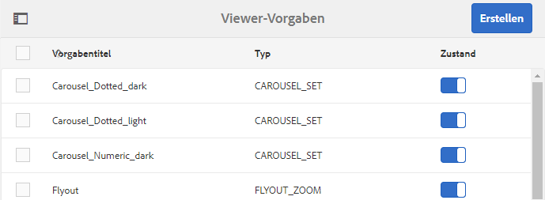

# Viewer-Vorgaben verwalten{#managing-viewer-presets}

Eine Viewer-Vorgabe ist eine Sammlung aus Einstellungen, die bestimmen, wie Benutzer Rich-Media-Assets auf ihren Computer-Bildschirmen und Mobilgeräten anzeigen. Viewer-Vorgaben können von Administratoren erstellt werden. Einstellungen sind für eine Vielzahl an Viewer-Konfigurationsoptionen verfügbar. Sie können beispielsweise die Viewer-Anzeigegröße oder das Zoom-Verhalten ändern.

<!-- OBSOLETE SDK withdrawn from public view. Available internally only at `http://staging.scene7.com/s7sdk/3.8/docs/jsdoc/symbols/_s7sdk.html` 

For instructions on creating and customizing your own HTML5 viewer presets, see the *Adobe Scene7 HTML5 Viewer SDK*. The SDK is available on the IS publish server embedded in the SDK itself. Each library version has its own SDK documentation included.

Path: `<scene7_domain>/s7sdk/<library_version>/docs/jsdocs/index.html`.
For example, 3.5 SDK: [https://s7d1.scene7.com/s7sdk/3.5/docs/jsdoc/index.html](https://s7d1.scene7.com/s7sdk/3.5/docs/jsdoc/index.html)

-->

Siehe auch das [Dynamic Media Viewers-Referenzhandbuch](https://experienceleague.adobe.com/docs/dynamic-media-developer-resources.html?lang=de).

In diesem Abschnitt wird beschrieben, wie Viewer-Vorgaben erstellt, bearbeitet und verwaltet werden. Sie können jederzeit bei der Vorschau eines Assets eine Viewer-Vorgabe darauf anwenden. Siehe [Anwenden von Viewer-Vorgaben](#applying-a-viewer-preset-to-an-asset).

>[!NOTE]
>
>Die Bearbeitung von *vordefinierten, standardmäßig vorhandenen Viewer-Vorgaben* wird als Szenario nicht unterstützt. Wenn Sie versuchen, eine standardmäßig vorhandene Viewer-Vorgabe zu bearbeiten, werden Sie aufgefordert, die Viewer-Vorgabe unter einem neuen Namen zu speichern.

## Möglichkeit des Zugriffs auf die Tastatur im Viewer {#keyboard-accessibility-for-viewers}

Alle standardmäßigen Viewer unterstützen den Zugriff auf die Tastatur.

Weitere Informationen finden Sie unter [Tastaturzugriff und Navigation](https://experienceleague.adobe.com/docs/dynamic-media-developer-resources/library/c-keyboard-accessibility.html?lang=de).

## Viewer-Vorgaben verwalten {#managing-viewer-presets-1}

Sie können Viewer-Vorgaben in Adobe Experience Manager hinzufügen, bearbeiten, löschen, veröffentlichen sowie Veröffentlichungen aufheben und eine Vorschau anzeigen, indem Sie zu **[!UICONTROL Tools]** (Hammersymbol) > **[!UICONTROL Assets] > [!UICONTROL Viewer-Vorgaben]** gehen.

>[!NOTE]
>
>Standardmäßig zeigt das System 15 Viewer-Vorgaben, wenn Sie in einer Detailansicht eines Assets „Viewer“ auswählen. Sie können diese Grenze erhöhen. Siehe [Erhöhen der Anzahl angezeigter Viewer-Vorgaben](#increasing-the-number-of-viewer-presets-that-display).

### Viewer-Unterstützung für Web-Seiten mit responsivem Design {#viewer-support-for-responsive-designed-web-pages}

Unterschiedliche Web-Seiten haben unterschiedliche Anforderungen. Mitunter möchten Sie vielleicht, dass eine Web-Seite über einen Link verfügt, der den HTML5-Viewer in einem separaten Browser-Fenster öffnet. In anderen Fällen ist es erforderlich, den HTML5-Viewer direkt auf der Host-Seite einzubetten. In letzterem Fall weist die Web-Seite ein statisches Layout auf. Oder sie ist „responsiv“ und wird auf verschiedenen Geräten oder in verschieden großen Browser-Fenstern anders angezeigt. Um diesen Anforderungen gerecht zu werden, unterstützen alle vordefinierten, sofort einsatzbereiten HTML5-Viewer, die mit Dynamic Media geliefert werden, sowohl statische Web-Seiten als auch responsiv gestaltete Web-Seiten.

Weitere Informationen zum Einbetten responsiver Viewer auf Web-Seiten finden Sie unter [Bibliothek responsiver und statischer Bilder](https://experienceleague.adobe.com/docs/dynamic-media-developer-resources/image-serving-api/image-serving-api/responsive-static-image-library/c-about-responsive-static-image-library.html?lang=de#about-responsive-image-library) in der *Hilfe zur Dynamic Media Image Serving and Rendering-API*.

>[!NOTE]
>
>Veröffentlichen Sie alle standardmäßigen Viewer, bevor Sie sie zum ersten Mal verwenden.
>Siehe [Veröffentlichen von Viewer-Vorgaben](#publishing-viewer-presets).

### Systemkompatibilität der Viewer-Vorgaben  {#viewer-preset-system-compatibility}

Alle standardmäßig vorhandenen Viewer-Vorgaben, die mit Dynamic Media bereitgestellt werden, sind mit den folgenden Systemen vollständig kompatibel:

* Desktops
* Apple iPhones
* Apple iPads
* Android™-Smartphone
* Android™-Tablet
<!-- OUTDATED 2/25/22 * For video, extra support for MP4 playback is provided for [BlackBerry&reg;](https://developer.blackberry.com/devzone/develop/supported_media/bb_media_support_at_a_glance.html#kba1328730952678) and [Windows&reg; Phone](https://docs.microsoft.com/en-us/windows/uwp/audio-video-camera/supported-codecs). -->

### Rich-Media-Typen für Viewer-Vorgaben {#rich-media-types-for-viewer-presets}

Administratoren können bei der Erstellung von Viewer-Vorgaben die folgenden Rich-Media-Typen hinzufügen und anpassen.

<table>
 <tbody>
  <tr>
   <td><strong>Karussellset</strong>  </td>
   <td>
Hotspots, Imagemaps oder beide werden zu einer Serie von mindestens zwei Bildern hinzugefügt. Kunden können einen Bildschwenk nach links oder rechts durchführen und dann auf einen Hotspot auf einem Bild klicken, um weitere Details aufzurufen oder direkt über eine Landingpage, Kategorieseite oder Homepage einer Website zu kaufen.
 </td>
  </tr>
    <tr>
   <td><strong>Dimensional</strong>  </td>
   <td>
Zeigt 3D-Szenen an, mit denen Sie Ihre Kamera drehen, schwenken, zoomen oder neu zentrieren können.
 </td>
  </tr>
  <tr>
   <td><strong>Flyout-Zoom</strong></td>
   <td>
Zeigt ein zweites Bild des gezoomten Bereichs neben dem Originalbild an. Es gibt dazu keine Steuerelemente, sondern die Auswahl muss über den Bereich verschoben werden, der angezeigt werden soll.
 
Beachten Sie bei der Bestimmung der vollständigen Bandbreitennutzung für diesen Viewer, dass sowohl das Hauptbild als auch das Flyout-Bild im Viewer angezeigt werden. Die Größe des Hauptbilds (Stage-Breite und -Höhe) und der Zoom-Faktor bestimmen die Größe des Flyout-Bildes. Damit die Flyout-Datei nicht zu groß wird, sollten Sie diese beiden Werte ausgleichen: Wenn Sie eine große Hauptbildgröße haben, senken Sie den Wert des Zoom-Faktors. (Die Flyout-Breite und Flyout-Höhe bestimmen die Größe des Flyout-Fensters, jedoch nicht die Größe des Flyout-Bildes, das für den Viewer bereitgestellt wird.)
 
Wenn die Größe des Hauptbilds beispielsweise 350 x 350 Pixel bei einem Zoom-Faktor von 3 beträgt, misst das resultierende Flyout-Bild 1050 x 1050 Pixel. Wenn die Größe des Hauptbilds 300 x 300 Pixel bei einem Zoomfaktor von 4 beträgt, umfasst das Flyout-Bild 1200 x 1200 Pixel. Je nach JPEG-Qualitätseinstellung (empfohlene Einstellungen sind zwischen 80 und 90) können Sie die Dateigröße erheblich verringern. Je nach Größe des Hauptbilds werden Zoom-Faktoren von 2,5 bis 4 empfohlen.
 </td>
  </tr>
  <tr>
   <td><strong>Inline-Zoom</strong></td>
   <td>Zeigt ein Bild des gezoomten Bereichs im Original-Viewer an. Es stehen keinerlei Steuerelemente zur Verfügung. Benutzer verschieben vielmehr die Auswahl über den Bereich, der angezeigt werden soll.</td>
  </tr>
  <tr>
   <td><strong>Bildset</strong></td>
   <td>Im Bildset-Viewer können Benutzer unterschiedliche Ansichten oder Farbvariationen eines Elements sehen, indem sie auf eine Miniatur klicken. Dieser Viewer bietet auch Zoomtools, mit denen Bilder genauer untersucht werden können.</td>
  </tr>
  <tr>
   <td><strong>Interaktives Bild</strong></td>
   <td>Hotspots werden zu Teilmengen eines Bildes hinzugefügt, auf die ein Kunde anschließend klicken kann, um mehr Informationen zu erhalten oder den Kauf direkt über eine Landingpage, Kategorieseite oder Homepage einer Website vorzunehmen.</td>
  </tr>
  <tr>
   <td><strong>Interaktives Video</strong></td>
   <td>Miniaturen werden Zeitleistensegmenten in einem Video hinzugefügt, auf die ein Kunde anschließend klicken kann, um mehr Informationen zu erhalten oder den Kauf direkt über eine Landingpage, Kategorieseite oder Homepage einer Website vorzunehmen.</td>
  </tr>
  <tr>
   <td><strong>Gemischte Medien</strong></td>
   <td>Zeigt unterschiedliche Medientypen in einem Viewer an. Dort können Sie Rotationssets, Bildsets, Bilder und Videos aufnehmen.</td>
  </tr>
  <tr>
   <td><strong>Panoramabild</strong></td>
   <td>
Die Viewer für Panoramabilder und PanoramaVR rendern kugelförmige Panoramabilder, um ein 360°-Zuschauererlebnis eines Raums, einer Eigenschaft, eines Standorts oder einer Landschaft zu erzielen.
 
Damit ein hochgeladenes Bild als Kugelpanorama gilt, muss es entweder eine oder beide der folgenden Eigenschaften aufweisen:

    <ul>
     <li>Ein Seitenverhältnis von 2:1.</li>
     <li>Mit den Keywords <code>equirectangular</code> oder <code>spherical</code> und <code>panorama</code> oder <code>spherical </code> und <code>panoramic</code> als Tags versehen. Weitere Informationen finden Sie unter <a href="/help/sites-cloud/authoring/sites-console/tags.md">Verwenden von Tags</a>.</li>
    </ul> 
Sowohl das Kriterium für das Seitenverhältnis als auch das für die Keywords gelten für Panorama-Assets für die Asset-Detailseite und die WCM-Komponente für „Panoramamedien“.
</td>
  </tr>
    <tr>
   <td><strong>Smartes Zuschneiden von Videos</strong>  </td>
   <td>
Verwenden Sie diesen Viewer, um den Fokus in einem Videos automatisch zu erkennen und das Video entsprechend zuzuschneiden.
 </td>
  </tr>
  <tr>
   <td><strong>Rotationsset</strong></td>
   <td>Stellt mehrere Ansichten eines Bildes bereit, sodass Benutzer den Gegenstand drehen können, um ihn von allen Seiten zu betrachten.</td>
  </tr>
  <tr>
   <td><strong>360-Grad-Video</strong></td>
   <td>
Verwenden Sie den 360/VR-Video-Viewer, um ein Panoramavideo für eine interaktive Anzeige eines Raums, einer Eigenschaft, eines Standorts, einer Landschaft oder eines medizinischen Verfahrens zu rendern.
 
Bei der Wiedergabe auf einem Flachbildschirm hat der Benutzer die Kontrolle über den Anzeigewinkel. Die Wiedergabe auf Mobilgeräten erfolgt mit den integrierten gyroskopischen Steuerelementen.
 
Der Viewer bietet native Unterstützung für die Bereitstellung von 360-Grad-Video-Assets. Standardmäßig ist keine weitere Konfiguration für die Anzeige oder die Wiedergabe erforderlich. 360-Grad-Videos werden mit Standardvideoerweiterungen wie .mp4, .mkv und .mov bereitgestellt. Der häufigste Codec ist H.264.
 </td>
  </tr>
  <tr>
   <td><strong>Video</strong></td>
   <td>
Gibt Videos mit progressivem oder adaptivem Bit-Rate-Streaming wieder. Beim adaptiven Bit-Rate-Streaming wird automatisch eine Geräte- und Bandbreitenerkennung durchgeführt, um das richtige Video in der richtigen Qualität und im richtigen Format bereitzustellen.
 </td>
  </tr>
  <tr>
   <td><strong>Vertikaler Zoom</strong></td>
   <td>
Mit dem Viewer für vertikalen Zoom können Sie das Anzeigeerlebnis von Produktbildern maximieren, um Ihrem Publikum die bestmögliche Darstellung eines Produkts zu bieten. Die vertikale Position von Farbfeldern bewirkt Folgendes:

    <ul>
     <li>Stellt sicher, dass sich Farbfelder „oberhalb der Falte“ befinden.  Bei horizontalen Farbfeldern sind die Farbfelder je nach Bildschirmgröße erst sichtbar, wenn die Benutzerin oder der Benutzer die Seite nach unten scrollt. Durch die vertikale Platzierung der Farbfelder im Viewer wird sichergestellt, dass sie unabhängig von der Bildschirmgröße der Benutzenden sichtbar sind.</li>
     <li>Maximiert die Größe des Hauptbilds.  Bei horizontalen Farbfeldern muss Platz auf der Seite eingeplant werden, um sicherzustellen, dass sie sichtbar sind. Durch diese Positionierung wird die Größe des Hauptbilds verringert. Bei einem vertikalen Farbfeld-Layout ist das Einplanen dieses Bereichs jedoch nicht erforderlich. Daher können Sie die Größe des Hauptbilds maximieren.</li>
    </ul> </td>
  </tr>
  <tr>
   <td><strong>Zoom</strong></td>
   <td>Damit können Benutzer den Bereich durch Klicken ein- und auszoomen. Benutzer können auf Steuerelemente klicken, um ein- und auszuzoomen und das Bild auf seine Standardgröße zurückzusetzen.</td>
  </tr>
 </tbody>
</table>

### Liste standardmäßig vorhandener Viewer-Vorgaben {#list-of-out-of-the-box-viewer-presets}

In der folgenden Tabelle werden alle vordefinierten, standardmäßig vorhandenen Viewer-Vorgaben, die mit Dynamic Media bereitgestellt werden, aufgeführt.

Siehe auch [Live-Demos](https://landing.adobe.com/en/na/dynamic-media/ctir-2755/live-demos.html).

Informationen zu unterstützten Webbrowsern und Betriebssystemversionen für Viewer finden Sie in den Viewer-Versionshinweisen.

Weitere Informationen finden Sie in den Viewer-Versionshinweisen im Inhaltsverzeichnis des [Viewers-Referenzhandbuchs](https://experienceleague.adobe.com/docs/dynamic-media-developer-resources.html?lang=de).

>[!NOTE]
>
>Alle vorkonfigurierten Viewer-Vorgaben in Dynamic Media sind aktiviert. Sie müssen sie allerdings noch veröffentlichen.
>Siehe [Veröffentlichen von Viewer-Vorgaben](#publishing-viewer-presets).
>
>Alle neuen Viewer-Vorgaben, die Sie erstellen und hinzufügen, müssen aktiviert *und* veröffentlicht werden.
>Siehe [Aktivieren oder Deaktivieren von Viewer-Vorgaben](#activating-or-deactivating-viewer-presets) und [Veröffentlichen von Viewer-Vorgaben](#publishing-viewer-presets).

<table>
 <tbody>
  <tr>
   <td><strong>Viewer-Vorgabentitel</strong></td>
   <td><strong>Typ</strong></td>
   <td><strong>CSS-Dateiname</strong>  </td>
  </tr>
  <tr>
   <td>Carousel_Dotted_dark</td>
   <td>Carousel_Set</td>
   <td><code>html5_carouselviewer_dotted_dark.css</code></td>
  </tr>
  <tr>
   <td>Carousel_Dotted_light</td>
   <td>Carousel_Set</td>
   <td><code>html5_carouselviewer_dotted_light.css</code></td>
  </tr>
  <tr>
   <td>Carousel_Numeric_dark</td>
   <td>Carousel_Set</td>
   <td><code>html5_carouselviewer_numeric_dark.css</code></td>
  </tr>
  <tr>
   <td>Carousel_Numeric_light</td>
   <td>Carousel_Set</td>
   <td><code>html5_carouselviewer_numeric_light.css</code></td>
  </tr>
  <tr>
   <td>Flyout</td>
   <td>Flyout_Zoom</td>
   <td><code>html5_flyoutviewer.css</code></td>
  </tr>
  <tr>
   <td>ImageSet_dark</td>
   <td>Bildset</td>
   <td><code>html5_zoomviewer_dark.css</code></td>
  </tr>
  <tr>
   <td>ImageSet_light</td>
   <td>Bildset</td>
   <td><code>html5_zoomviewer_light.css</code></td>
  </tr>
  <tr>
   <td>InlineMixedMedia_dark</td>
   <td>Mixed_Media</td>
   <td><code>html5_inlinemixedmediaviewer_dark.css</code></td>
  </tr>
  <tr>
   <td>InlineMixedMedia_light</td>
   <td>Mixed_Media</td>
   <td><code>html5_inlinemixedmediaviewer_light.css</code></td>
  </tr>
  <tr>
   <td>InlineZoom</td>
   <td>Flyout_Zoom</td>
   <td><code>html5_inlinezoomviewer.css</code></td>
  </tr>
  <tr>
   <td>MixedMedia_dark</td>
   <td>Mixed_Media</td>
   <td><code>html5_mixedmediaviewer_dark.css</code></td>
  </tr>
  <tr>
   <td>MixedMedia_light</td>
   <td>Mixed_Media</td>
   <td><code>html5_mixedmediaviewer_light.css</code></td>
  </tr>
  <tr>
   <td>PanoramicImage</td>
   <td>Panoramic_image</td>
   <td><code>html5_panoramicimage.css</code></td>
  </tr>
  <tr>
   <td>PanoramicImageVR</td>
   <td>Panoramic_image</td>
   <td><code>html5_panoramicimage.css</code></td>
  </tr>
  <tr>
   <td>Shoppable_Banner</td>
   <td>Interactive_Image</td>
   <td><code>html5_interactiveimage.css</code></td>
  </tr>
  <tr>
   <td>Shoppable_Video_dark</td>
   <td>Interactive_Video</td>
   <td><code>html5_interactivevideoviewer_dark.css</code></td>
  </tr>
  <tr>
   <td>Shoppable_Video_light</td>
   <td>Interactive_Video</td>
   <td><code>html5_interactivevideovewer_light.css</code></td>
  </tr>
  <tr>
   <td>SpinSet_dark</td>
   <td>Spin_Set</td>
   <td><code>html5_spinviewer_dark.css</code></td>
  </tr>
  <tr>
   <td>SpinSet_light</td>
   <td>Spin_Set</td>
   <td><code>html5_spinviewer_light.css</code></td>
  </tr>
  <tr>
   <td>
Video
 
(Enthält Unterstützung für verdeckte Untertitel)
 </td>
   <td>Video</td>
   <td><code>html5_videoviewer.css</code></td>
  </tr>
  <tr>
   <td>
Video360_social
 
(Enthält grundlegende Steuerelemente für die Videowiedergabe, das Video-Rendering erfolgt im Stereomodus, die manuelle Perspektivensteuerung ist deaktiviert, aber die gyroskopische Steuerung ist aktiviert, keine Social-Media-Funktionen)
 </td>
   <td>Video_360</td>
   <td><code>html5_video360viewersocial.css</code></td>
  </tr>
  <tr>
   <td>
Video360VR
 
(Für Endbenutzende konzipiert, die Virtual-Reality-Brillen verwenden. Enthält grundlegende Steuerelemente für die Videowiedergabe und Social-Media-Eigenschaften)
 </td>
   <td>Video_360</td>
   <td><code>html5_video360viewer.css</code></td>
  </tr>
  <tr>
   <td>
Video_social
 
(Enthält Unterstützung für verdeckte Untertitel und soziale Medien)
 </td>
   <td>Video</td>
   <td><code>html5_videoviewersocial.css</code></td>
  </tr>
  <tr>
   <td>Zoom_dark  </td>
   <td>Zoom  </td>
   <td><code>html5_basiczoomviewer_dark.css</code></td>
  </tr>
  <tr>
   <td>Zoom_light  </td>
   <td>Zoom</td>
   <td><code>html5_basiczoomviewer_light.css</code></td>
  </tr>
  <tr>
   <td>ZoomVertical_dark  </td>
   <td>Vertical_Zoom</td>
   <td><code>html5_zoomverticalviewer_dark.css</code></td>
  </tr>
  <tr>
   <td>ZoomVertical_light</td>
   <td>Vertical_Zoom</td>
   <td><code>html5_zoomverticalviewer_light.css</code></td>
  </tr>
 </tbody>
</table>

### Matrix unterstützter Mobile-Viewer-Gesten {#supported-mobile-viewers-gestures-matrix}

In der folgenden Tabelle werden die Mobile Viewer-Gesten aufgeführt, die auf iOS-, Android™ 2.x- und Android™ 3.x-Geräten unterstützt werden.

<table>
 <tbody>
  <tr>
   <td><strong>Geste</strong></td>
   <td><strong>Flyout-Zoom</strong></td>
   <td><strong>Zoom</strong></td>
   <td><strong>Drehung</strong></td>
  </tr>
  <tr>
   <td>
<strong>Ziehen</strong>
 </td>
   <td>
Schwenkt
 </td>
   <td>
Schwenkt
 </td>
   <td>
Schwenkt
 </td>
  </tr>
  <tr>
   <td>
<strong>Auswahl</strong>
 </td>
   <td>
Blendet Flyout-Fenster ein
 </td>
   <td>
Blendet die Benutzeroberfläche ein oder aus
 </td>
   <td>
Blendet die Benutzeroberfläche ein oder aus
 </td>
  </tr>
  <tr>
   <td>
<strong>Doppelt auswählen</strong>
 </td>
   <td>
Trifft nicht zu
 </td>
   <td>
Zoomt ein oder setzt zurück
 </td>
   <td>
Zoomt ein oder setzt zurück
 </td>
  </tr>
  <tr>
   <td>
<strong>Aufziehen</strong>
 </td>
   <td>
Trifft nicht zu
 </td>
   <td>
Zoomt ein (nur iOS und Android™ 3x)
 </td>
   <td>
Zoomt ein (nur iOS und Android™ 3x)
 </td>
  </tr>
  <tr>
   <td>
<strong>Zuziehen</strong>
 </td>
   <td>
Trifft nicht zu
 </td>
   <td>
Zoomt aus (nur iOS und Android™ 3x)
 </td>
   <td>
Zoomt aus (nur iOS und Android™ 3x)
 </td>
  </tr>
  <tr>
   <td>
<strong>Streichen</strong>
 </td>
   <td>
Scrollt Farbfeldleiste
 </td>
   <td>
Scrollt Bilder
 </td>
   <td>
Dreht
 </td>
  </tr>
  <tr>
   <td>
<strong>Schnippen</strong>
 </td>
   <td>
Scrollt Farbfeldleiste
 </td>
   <td>
Scrollt Bilder
 </td>
   <td>
Dreht
 </td>
  </tr>
 </tbody>
</table>

## Anzahl angezeigter Viewer-Vorgaben erhöhen {#increasing-the-number-of-viewer-presets-that-display}

Experience Manager zeigt viele verschiedene Viewer-Vorgaben, wenn Sie ein Asset unter **[!UICONTROL Detailansicht]** > **[!UICONTROL Viewer]** anzeigen. Sie können die Anzahl der angezeigten Viewer erhöhen oder verringern.

**So erhöhen Sie die Anzahl angezeigter Viewer-Vorgaben:**

1. Navigieren Sie zu CRXDE Lite ([https://localhost:4502/crx/de](https://localhost:4502/crx/de)).
1. Navigieren Sie zum Knoten mit der Viewer-Vorgabenliste unter `/libs/dam/gui/coral/content/commons/sidepanels/viewerpresets/viewerpresetslist`

   

1. Ändern Sie für die Eigenschaft **[!UICONTROL limit]** den **[!UICONTROL Wert]**, für den standardmäßig 15 festgelegt ist, in einen höheren Wert.
1. Navigieren Sie zur Datenquelle der Viewer-Vorgabe unter `/libs/dam/gui/coral/content/commons/sidepanels/viewerpresets/viewerpresetslist/datasource`

   

1. Ändern Sie den Wert in der Eigenschaft „Limit“ auf die gewünschte Zahl, z. B. `{empty requestPathInfo.selectors[1] ? "20" : requestPathInfo.selectors[1]}`.
1. Klicken Sie auf **[!UICONTROL Alle speichern]**.

## Erstellen von Viewer-Vorgaben {#creating-a-new-viewer-preset}

Durch Erstellen von Viewer-Vorgaben können Sie verschiedene Einstellungen anwenden, um Assets anzuzeigen und mit diesen zu interagieren. Sie müssen jedoch keine Viewer-Vorgaben erstellen. Wenn Sie dies bevorzugen, können Sie auch die bereits standardmäßig in Experience Manager Assets verfügbaren Viewer-Vorgaben verwenden.

Wenn Sie eine Viewer-Vorgabe erstellen möchten, wird nach deren Speicherung der Viewer-Status auf der Seite „Viewer-Vorgaben“ automatisch aktiviert (auf **[!UICONTROL Ein]** gesetzt). Dieser Status bedeutet, dass die Vorgabe in der Komponente für Dynamic Media und in der Komponente für interaktive Medien sowie bei jeder Bild- oder Videovorschau sichtbar ist.

Bestimmte Viewer-Vorgaben weisen exklusive Einstellungen auf, die die Nutzung und das Gesamtverhalten des Viewers beeinflussen können. Je nach der von Ihnen erstellten Viewer-Vorgabe sollten Sie diese besonderen Hinweise berücksichtigen.

Siehe [Besondere Hinweise zum Erstellen von Vorgaben für interaktive Viewer](#special-considerations-for-creating-an-interactive-viewer-preset).

Siehe [Besondere Hinweise zum Erstellen von Viewer-Vorgaben für Karussellbanner](#special-considerations-for-creating-a-carousel-banner-viewer-preset).

**So erstellen Sie Viewer-Vorgaben:**

1. Klicken Sie in der linken oberen Ecke von Experience Manager auf das Experience Manager-Logo und wählen Sie dann links in der Leiste **[!UICONTROL Tools]** (Hammersymbol) > **[!UICONTROL Assets]** > **[!UICONTROL Viewer-Vorgaben]**.

   

1. Wählen Sie auf der Seite „Viewer-Vorgaben“ in der Symbolleiste **[!UICONTROL Erstellen]**.
1. Geben Sie im Dialogfeld **[!UICONTROL Neue Viewer-Vorgabe]** in das Feld **[!UICONTROL Vorgabename]** den Namen der neuen Vorgabe ein. Achten Sie darauf, einen geeigneten Namen festzulegen, da dieser nach dem Klicken auf **[!UICONTROL Erstellen]** nicht mehr geändert werden kann.

   Wenn Sie die Vorgabe an späterer Stelle in diesen Schritten speichern, wird der Name auf der Seite „Viewer-Vorgaben“ unter der Spaltenüberschrift „Vorgabentitel“ angezeigt.

1. Wählen Sie aus dem Dropdown-Menü „Rich-Media-Typ“ den Typ der zu erstellenden Viewer-Vorgabe aus und klicken Sie dann oben rechts auf der Seite auf **[!UICONTROL Erstellen]**.

   Siehe [Rich-Media-Typen für Viewer-Vorgaben](#rich-media-types-for-viewer-presets).

1. Wählen Sie auf der Seite „Viewer-Vorgabe bearbeiten“ die Registerkarte **[!UICONTROL Erscheinungsbild]**.
1. Führen Sie einen der folgenden Schritte aus:

   * Wählen Sie aus dem Pulldown-Menü **[!UICONTROL Ausgewählter Typ]** eine Komponente aus, deren visuelles Design angepasst werden soll. Sie können auch auf ein beliebiges visuelles Element im Viewer klicken, um es zum Konfigurieren auszuwählen.

     Der Visual Editor zeigt Ihnen, wie sich eine bestimmte Eigenschaft auf einen Stil auswirkt. Legen Sie eine beliebige Eigenschaft fest bzw. passen Sie diese an, um sofort anhand des Beispiels auf der linken Seite des Editors zu sehen, wie sich dies auf den Viewer auswirkt.

     Die CSS-Stileigenschaften für alle Viewer-Vorgabetypen werden im Abschnitt „Anpassen des *`<viewer name>`*-Viewers“ in den Hilfethemen im [Viewers-Referenzhandbuch](https://experienceleague.adobe.com/docs/dynamic-media-developer-resources.html?lang=de) beschrieben. Wenn Sie z. B. eine Viewer-Vorgabe vom Typ `Mixed_Media` erstellen, finden Sie im Thema zum [Anpassen von Viewern für gemischte Medien](https://experienceleague.adobe.com/docs/dynamic-media-developer-resources/library/viewers-aem-assets-dmc/mixed-media/customing-mixed-media/c-html5-mixedmedia-viewer-customizingviewer.html?lang=de) eine Aufstellung und Beschreibung jeder Eigenschaft.

   * Wenn Stileinstellungen in einer separaten CSS-Datei definiert sind, können Sie die CSS-Datei in Experience Manager Assets hochladen. Um die hochgeladene CSS-Datei zu finden und sie mit der Viewer-Vorgabe zu verknüpfen, klicken Sie unter dem Pulldown-Menü **[!UICONTROL Ausgewählter Typ]** auf **[!UICONTROL CSS importieren]** (gegebenenfalls scrollen Sie im Visual Editor nach oben, um den Eintrag zu sehen).

     Beim Importieren einer CSS-Datei überprüft der Visual Editor, ob CSS die korrekten Viewer-Markierungen verwendet. Wenn Sie etwa einen Zoom-Viewer erstellen, müssen alle CSS-Regeln, die Sie importieren, mit dem zugehörigen Viewer-Klassennamen `.s7mixedmediaviewer` (definiert in einem übergeordneten Viewer-Element) festgelegt werden.

     Sie können beliebige, selbst definierte CSS-Dateien importieren, solange diese die CSS-Markierungen für den jeweiligen Viewer ordnungsgemäß definieren. (CSS-Markierungen werden im Hilfethema „Anpassen des *&lt;Viewer-Name>*-Viewers“ im [Viewers-Referenzhandbuch](https://experienceleague.adobe.com/docs/dynamic-media-developer-resources.html?lang=de) erläutert. Wenn Sie beispielsweise über CSS-Markierungen für den Zoom-Viewer lesen möchten, finden Sie weitere Informationen unter [Anpassen des Zoom-Viewers](https://experienceleague.adobe.com/docs/dynamic-media-developer-resources/library/viewers-aem-assets-dmc/zoom/customizing-zoom/c-html5-20-zoom-viewer-customizingviewer.html?lang=de).) Es ist jedoch möglich, dass der visuelle Editor einige CSS-Werte nicht versteht. In diesem Fall versucht der Visual Editor, die Fehler zu überschreiben, damit CSS nach wie vor verwendet werden kann.

   >[!NOTE]
   >
   >Wenn Sie CSS lieber direkt im Rohformat bearbeiten möchten, klicken Sie im Pulldown-Menü „Ausgewählter Typ“ auf **[!UICONTROL CSS ein-/ausblenden]** (Sie müssen ggf. im Visual Editor nach oben blättern, um diese Option anzuzeigen).
   >Wenn Sie eine Eigenschaft direkt in CSS ändern, können Sie wie im Visual Editor sofort sehen, wie sich dies auf das Viewer-Beispiel auswirkt. Außerdem wird zur gleichen Zeit genau diese Eigenschaft automatisch im Visual Editor aktualisiert. Daher können Sie entweder den CSS-Editor, den Visual Editor oder beide abwechselnd verwenden.

   >[!NOTE]
   >
   >Für Schaltflächengrafiken wählen Sie das 2x-Bild aus und laden Sie Grafiken mit hoher Auflösung hoch. Beim Arbeiten mit interaktiven Bildern und Bannern mit Einkaufsfunktion können Sie auch aus verschiedenen standardmäßig vorhandenen Hotspot-Schaltflächen wählen.

1. (Optional) Klicken Sie in der Nähe des oberen Bereichs der Seite „Viewer-Vorgabe bearbeiten“ auf **[!UICONTROL Desktop]**, **[!UICONTROL Tablet]** oder **[!UICONTROL Smartphone]**, um visuelle Stile für verschiedene Geräte- und Bildschirmtypen individuell zu definieren.
1. Wählen Sie auf der Seite „Viewer-Vorgaben-Editor“ die Registerkarte **[!UICONTROL Verhalten]**. Sie können auch auf ein beliebiges visuelles Element im Viewer klicken, um es zum Konfigurieren auszuwählen.
Zum Beispiel können Sie für den Typ *VideoPlayer* unter **[!UICONTROL Modifikatoren]** > **[!UICONTROL Wiedergabe]** eine von drei Optionen für das Streaming mit adaptiver Bitrate auswählen:

   * **[!UICONTROL dash]** – Videos werden nur als DASH gestreamt. Auf Safari-/iOS-Geräten müssen Sie jedoch stattdessen **[!UICONTROL hls]** als Typ auswählen.
   * **[!UICONTROL hls]** – Videos werden nur als HLS gestreamt.
   * **[!UICONTROL auto]** – Best Practice. Die Erstellung von DASH- und HLS-Streams ist speicheroptimiert. Daher empfiehlt Adobe, immer **[!UICONTROL Auto]** als Wiedergabetyp auszuwählen. Videos streamen als DASH, HLS oder progressiv, wie folgend dargestellt:
      * Wenn der Browser DASH unterstützt, wird zuerst DASH-Streaming verwendet.
      * Wenn der Browser DASH nicht unterstützt, wird an zweiter Stelle HLS-Streaming verwendet.
      * Wenn der Browser weder DASH noch HLS unterstützt, wird als letzte Option die progressive Wiedergabe verwendet.

   >[!NOTE]
   >
   >Um die **[!UICONTROL DASH]**-Option zu sehen und zu nutzen, muss sie zunächst vom technischen Adobe-Support für Ihr Konto aktiviert werden. Siehe [Aktivieren von DASH in Ihrem Konto](/help/assets/dynamic-media/video.md#enable-dash).

1. Wählen Sie im Pulldown-Menü **[!UICONTROL Ausgewählter Typ]** eine Komponente aus, deren Verhalten Sie ändern möchten.

   Viele Komponenten im Visual Editor sind mit einer detaillierten Beschreibung verknüpft. Diese Beschreibungen werden in blauen Feldern angezeigt, wenn Sie eine Komponente zum Anzeigen der mit ihr verknüpften Parameter einblenden.

   Einige Viewer-Typen verfügen über Komponenten, mit denen Sie Befehle zum Image Serving in einem **[!UICONTROL IS-Befehl]**-Textfeld angeben können. Eine Liste der verfügbaren Befehle finden Sie in der [Image Serving API-Referenz](https://experienceleague.adobe.com/docs/dynamic-media-developer-resources/image-serving-api/image-serving-api/c-is-home.html?lang=de).

   >[!NOTE]
   >
   >**Bei Nutzung eines Touch-Geräts, etwa eines Smartphones oder Tablets:**
   >
   >
   >Nachdem Sie einen Wert in das Textfeld eingegeben haben, klicken Sie auf eine andere Stelle in der Benutzeroberfläche, um die Änderung weiterzuleiten und die virtuelle Tastatur zu schließen. Wenn Sie auf die **[!UICONTROL Eingabetaste]** klicken, wird keine Aktion ausgeführt.

1. Klicken Sie oben rechts auf der Seite auf **[!UICONTROL Speichern]**.
1. Veröffentlichen Sie die neue Viewer-Vorgabe. Es ist notwendig, die Vorgabe zu veröffentlichen, damit Sie die daraus resultierende URL auf Ihrer Website verwenden können.

   Siehe [Veröffentlichen von Viewer-Vorgaben](#publishing-viewer-presets).

   >[!IMPORTANT]
   >
   >Bei alten Videos, die ein Streaming-Profil mit adaptiver Bit-Rate verwenden, wird die URL weiterhin wie gewohnt mit HLS-Streaming wiedergegeben, bis Sie die [Video-Assets erneut verarbeiten](/help/assets/dynamic-media/about-image-video-profiles.md#reprocessing-assets). Nach der erneuten Verarbeitung funktioniert dieselbe URL weiterhin, aber jetzt mit *beiden*, aktivierten DASH- und HLS-Streaming.

### Besondere Hinweise zum Erstellen von interaktiven Viewer-Vorgaben {#special-considerations-for-creating-an-interactive-viewer-preset}

**Wissenswertes über Anzeigemodi für Bildminiaturen im Anzeigefeld:**

Wenn Sie eine Viewer-Vorgabe für interaktive Videos erstellen oder bearbeiten, können Sie festlegen, welcher Anzeigemodus verwendet werden soll. Diese Auswahl erfolgt, wenn Sie `InteractiveSwatches` aus dem Pulldown-Menü **[!UICONTROL Ausgewählte Komponente]** auf der Registerkarte **[!UICONTROL Verhalten]** auswählen. Der von Ihnen gewählte Anzeigemodus beeinflusst, wie und wann Miniaturansichten während der Videowiedergabe angezeigt werden. Sie können entweder den Anzeigemodus `segment` (Standard) oder den Anzeigemodus `continuous` auswählen.

<table>
 <tbody>
  <tr>
   <td><strong>Anzeigemodus</strong></td>
   <td><strong>Beschreibung</strong></td>
  </tr>
  <tr>
   <td>Segment</td>
   <td>
<code>Segment </code>ist der Standardanzeigemodus für die vordefinierten Viewer-Vorgaben für interaktive Videos <code>Shoppable_Video_light</code> und <code>Shoppable_Video_dark</code> sowie alle Viewer-Vorgaben für interaktive Videos, die Sie selbst erstellen.
 
Angenommen, in diesem Modus sind einem Videosegment weniger Miniaturen zugewiesen als die Anzahl der sichtbaren Punkte im Anzeigefeld. In solchen Fällen werden Miniaturen aus den nächsten oder vorherigen Untersegmenten <i>nicht </i>eingezogen, um leere Stellen im Bedienfeld zu füllen. So bleibt die Anzeige von einem bestimmten Videosegment zugewiesenen Mustern erhalten.
 </td>
  </tr>
  <tr>
   <td>Kontinuierlich</td>
   <td>
Angenommen, im Anzeigemodus <code>continuous </code> ist die Anzahl der Miniaturen in einem Segment geringer als die Anzahl, die im Bedienfeld angezeigt wird. In solchen Fällen enthält der Viewer automatisch die Anzeige von Miniaturen des nächsten Segments oder des vorherigen Segments, in dem die letzte Miniatur angezeigt wird.
 
Das <a href="/help/assets/dynamic-media/interactive-videos.md">Video in diesem Thema</a> ist ein Beispiel für den Anzeigemodus <code>continuous </code>.
 </td>
  </tr>
 </tbody>
</table>

**Über den automatischen Bildlauf im interaktiven Video-Viewer:**

Das automatische Bildlaufverhalten von Miniaturen der Viewer-Funktionen für interaktive Videos erfolgt unabhängig vom gewählten Anzeigemodus.

Wenn Sie eine interaktive Video-Viewer-Voreinstellung erstellen oder bearbeiten, können Sie über die Registerkarte „Verhalten“ auf „Auto-Bildlauf“ zugreifen. Klicken Sie auf der Registerkarte „Verhalten“ im Dropdown-Menü **[!UICONTROL Ausgewählte Komponenten]** auf **[!UICONTROL InteractiveSwatches]**. Das Kontrollkästchen „Automatischer Bildlauf“ befindet sich unter dem Textfeld „IS-Befehl“.

Wenn Sie in der Viewer-Vorgabe bei der Videowiedergabe durch den Benutzer die Option **[!UICONTROL Automatischer Bildlauf]** deaktivieren (das Kontrollkästchen abwählen), wird im Feld während der gesamten Videodauer nur das erste Miniaturbild angezeigt. Allerdings kann der Benutzer ggf. mithilfe der Pfeilsymbole nach oben und nach unten einen manuellen Bildlauf durch die Miniaturen durchführen.

Wenn Sie während der Videowiedergabe die Option **[!UICONTROL Automatischer Bildlauf]** in der Viewer-Vorgabe aktivieren (auswählen), werden die Miniaturbilder, die einem Videosegment zugewiesen sind, zu Beginn eines Segments in die Ansicht verschoben. Es gibt jedoch Fälle, in denen bestimmte Miniaturen innerhalb eines Segments doppelt so lange angezeigt werden wie andere Miniaturen vor oder nach dem Segment. Dieses Verhalten tritt auf, weil die Anzahl der Miniaturen in einem Segment größer ist als die Zahl, die im Bedienfeld sichtbar ist, und diese nicht gleichmäßig teilbar ist.

Gehen wir zu Illustrationszwecken von einem 30 Sekunden langen Videosegment aus. Insgesamt gibt es neun Miniaturen, die im Laufe dieser 30 Sekunden angezeigt werden. Die Größe Ihres Browsers wird dergestalt geändert, dass vier verfügbare Miniaturpositionen im Anzeigefeld vorliegen. Das 30-sekündige Videozeitsegment ist in drei Untersegmente unterteilt. In der folgenden Tabelle wird die Aufschlüsselung darüber gezeigt, welche Miniaturen für ein bestimmtes Zeituntersegment angezeigt werden:

| **Videountersegment** | **Zeit des Untersegments in Sekunden** | **Im Feld sichtbare Miniaturen** |
|---|---|---|
| 1 | 0–10 | 1, 2, 3, 4 |
| 2 | 10-20 | 4, 5, 6, 7 |
| 3 | 20-30 | 6, 7, 8, 9 |

Das Videountersegment 3 wird nicht über die Miniaturen hinweg erweitert, die ihm zugewiesen sind. Beachten Sie, dass die Miniaturen 4, 6 und 7 im Anzeigefeld doppelt so lang sichtbar sind wie die anderen.

Die durch den Viewer zum Bestimmen der Anzahl der im seitlichen Bedienfeld angezeigten Miniaturen verwendete Logik basiert wie folgt auf der Anzahl der verfügbaren Positionen:

* Anzahl der Untersegmente = Aufrundung auf das nächste Untersegment (Anzahl der Miniaturen: Anzahl der sichtbaren Spots im Miniaturfeld, auf Grundlage der Browser-Fenstergröße)
Unter Verwendung des Beispiels in der obigen Tabelle ergibt 9 Miniaturen : 4 Slots = 2,25, was die Viewer-Logik auf drei Untersegmente aufrundet.

* Anzahl der Miniaturen = Aufrundung auf die nächste Miniatur (Anzahl der Miniaturen : Anzahl der Videountersegmente).
Unter Verwendung des Beispiels in der obigen Tabelle ergibt 9 Miniaturen : 3 Videountersegmente = 3 Miniaturen.

* Dauer des Untersegments = gesamte Videodauer : Anzahl der Videountersegmente.
Unter Verwendung des Beispiels in der obigen Tabelle ergibt 30 Sekunden: 3 Segmente = 10 Sekunden anhaltende Anzeige jedes Segments.

#### Besondere Hinweise zum Erstellen von Viewer-Vorgaben für Karussellbanner {#special-considerations-for-creating-a-carousel-banner-viewer-preset}

Beim Erstellen von Viewer-Vorgaben für Karussellbanner kann der Stil von Hotspots wie folgt geändert werden:

| | **Beschreibung** | **Aktionen** |
|---|---|---|
| **[!UICONTROL Hotspot-Symbol]** | Ändern des für Hotspots verwendeten Symbols | Um das Bild des Hotspot-Symbols zu ändern, klicken Sie auf der Registerkarte **[!UICONTROL Erscheinungsbild]** in **[!UICONTROL Ausgewählte Komponente]** auf **[!UICONTROL ImageMapEffect]**. Wählen Sie unter **[!UICONTROL Symbol]** die Option **[!UICONTROL Hintergrund]** und navigieren Sie im Feld **[!UICONTROL Bild]** zum gewünschten Hintergrundbild. |

## Aktivieren oder Deaktivieren von Viewer-Vorgaben {#activating-or-deactivating-viewer-presets}

Welche Viewer-Vorgaben in der Benutzeroberfläche verfügbar sind, hängt davon ab, welche im Autorenmodus aktiv sind. Nach dem Erstellen ist eine Viewer-Vorgabe standardmäßig auf „Ein“ eingestellt. Wenn Sie die Vorgabe deaktivieren möchten, wird sie nicht im Autorenmodus angezeigt. Wenn die Vorgabe veröffentlicht wird, wird sie immer veröffentlicht, unabhängig davon, ob sie aktiviert oder deaktiviert ist. Deaktivieren Sie Viewer-Vorgaben, wenn die Liste zu umfangreich wird oder wenn eine Viewer-Vorgabe nicht zur Verfügung gestellt werden soll.

**So aktivieren oder deaktivieren Sie Viewer-Vorgaben:**

1. Klicken Sie in der linken oberen Ecke von Experience Manager auf das Experience Manager-Logo und wählen Sie dann links in der Leiste **[!UICONTROL Tools]** (Hammersymbol) > **[!UICONTROL Assets]** > **[!UICONTROL Viewer-Vorgaben]**.
1. Klicken Sie auf der Seite „Viewer-Vorgabe“ unter der Spaltenüberschrift **[!UICONTROL Status]** auf die Umschaltfläche zum Aktivieren bzw. Deaktivieren einer Viewer-Vorgabe.

   Bei aktivierten Viewer-Vorgaben wird die Umschaltfläche rechts in einem blauen Feld angezeigt; bei deaktivierten Viewer-Vorgaben wird die Umschaltfläche links in einem hellgrauen Feld angezeigt.

## Veröffentlichen von Viewer-Vorgaben {#publishing-viewer-presets}

Wird der Status einer Viewer-Vorgabe aktiviert (auf „Ein“ gestellt), bedeutet dies, dass sie in der Dynamic Media-Komponente, in der Komponente für interaktive Medien und bei jeder Anzeige eines Assets sichtbar ist.

Um jedoch ein Asset mit einer Viewer-Vorgabe *bereitzustellen*, muss die Viewer-Vorgabe auch veröffentlicht werden. Alle Viewer-Vorgaben müssen aktiviert *und* veröffentlicht werden, um die URL oder den Einbettungs-Code für ein Asset zu beziehen. Aktivieren und veröffentlichen Sie alle im Lieferumfang von Dynamic Media enthaltenen vorkonfigurierten Viewer-Voreinstellungen. Benutzerdefinierte Viewer-Voreinstellungen, die Sie erstellen und hinzufügen, werden automatisch aktiviert, müssen aber auch veröffentlicht werden.

Siehe [Aktivieren oder Deaktivieren von Viewer-Vorgaben](#activating-or-deactivating-viewer-presets).

Weitere Informationen finden Sie unter [Vorschau von Assets](/help/assets/dynamic-media/previewing-assets.md).

**So veröffentlichen Sie Viewer-Vorgaben:**

1. Klicken Sie in der linken oberen Ecke von Experience Manager auf das Experience Manager-Logo und wählen Sie dann links in der Leiste **[!UICONTROL Tools]** (Hammersymbol) > **[!UICONTROL Assets] > [!UICONTROL Viewer-Vorgaben]**.
1. Wählen Sie eine oder mehrere Viewer-Vorgaben zum Veröffentlichen aus.
1. Klicken Sie in der Symbolleiste auf das Symbol **[!UICONTROL Veröffentlichen]**.

## Sortieren von Viewer-Vorgaben {#sorting-viewer-presets}

1. Klicken Sie in der linken oberen Ecke von Experience Manager auf das Experience Manager-Logo und wählen Sie dann links in der Leiste **[!UICONTROL Tools]** (Hammersymbol) > **[!UICONTROL Assets] > [!UICONTROL Viewer-Vorgaben]**.
1. Klicken Sie auf **[!UICONTROL Vorgabentitel]**, **[!UICONTROL Typ]**, **[!UICONTROL Veröffentlicht]** oder **[!UICONTROL Status]**, um nach dieser Spaltenüberschrift zu sortieren. Klicken Sie beispielsweise auf **[!UICONTROL Typ]**, um die Viewer-Vorgabentypen in alphabetischer oder in umgekehrt alphabetischer Reihenfolge zu sortieren.

## Viewer-Vorgaben bearbeiten {#editing-viewer-presets}

Die Bearbeitung von *vordefinierten, standardmäßig vorhandenen Viewer-Vorgaben* wird als Szenario nicht unterstützt. Wenn Sie eine standardmäßig vorhandene Viewer-Vorgabe bearbeiten, werden Sie aufgefordert, die Viewer-Vorgabe unter einem neuen Namen zu speichern.

**So bearbeiten Sie Viewer-Vorgaben:**

1. Klicken Sie in der linken oberen Ecke von Experience Manager auf das Experience Manager-Logo und wählen Sie dann links in der Leiste **[!UICONTROL Tools]** (Hammersymbol) > **[!UICONTROL Assets]** > **[!UICONTROL Viewer-Vorgaben]**.
1. Wählen Sie eine Vorgabe aus, indem Sie das Kontrollkästchen links neben dem Viewer-Vorgabentitel aktivieren.
1. Wählen Sie in der Symbolleiste die Option **[!UICONTROL Bearbeiten]** aus.
1. Nehmen Sie auf der Seite **[!UICONTROL Viewer-Vorgabe bearbeiten]** die gewünschten Änderungen an der Viewer-Vorgabe vor. Verwenden Sie dazu die Optionen auf den Registerkarten **[!UICONTROL Erscheinungsbild]** und **[!UICONTROL Verhalten]**.

   Klicken Sie auf der Registerkarte **[!UICONTROL Erscheinungsbild]** in der oberen linken Ecke der Seite „Viewer-Vorgaben-Editor“ auf **[!UICONTROL Desktop]**, **[!UICONTROL Tablet]** oder **[!UICONTROL Smartphone]**, um den Darstellungsmodus des Assets zu ändern.

1. Führen Sie in der oberen rechten Ecke der Seite eine der folgenden Aktionen aus:

   * Klicken Sie auf **[!UICONTROL Speichern]**, um Ihre Änderungen zu speichern und zur Seite „Viewer-Vorgabe“ zurückzukehren.
   * Klicken Sie auf **[!UICONTROL Abbrechen]**, um alle von Ihnen vorgenommenen Änderungen rückgängig zu machen und zur Seite „Viewer-Vorgaben“ zurückzukehren.

## Löschen benutzerdefinierter Viewer-Vorgaben {#deleting-custom-viewer-presets}

Sie können Viewer-Vorgaben löschen, die Sie erstellt und Dynamic Media hinzugefügt haben.

**So löschen Sie benutzerdefinierte Viewer-Vorgaben:**

1. Klicken Sie in der linken oberen Ecke von Experience Manager auf das Experience Manager-Logo und wählen Sie dann links in der Leiste **[!UICONTROL Tools]** (Hammersymbol) > **[!UICONTROL Assets] > [!UICONTROL Viewer-Vorgaben]**.
1. Wählen Sie auf der Seite „Viewer-Vorgaben“ einen Vorgabentitel aus und klicken Sie dann auf das Symbol **[!UICONTROL Papierkorb]**.
1. Wählen Sie **[!UICONTROL Löschen]** aus.

## Anwenden von Viewer-Vorgaben auf ein Asset {#applying-a-viewer-preset-to-an-asset}

Wenn Sie das Asset und den ausgewählten Viewer bereits veröffentlicht haben, werden nach Auswahl einer Viewer-Vorgabe die Schaltflächen **[!UICONTROL URL]** und **[!UICONTROL Einbetten]** angezeigt.

**So wenden Sie eine Viewer-Vorgabe auf ein Asset an:**

1. Öffnen Sie das Asset, klicken Sie in der Nähe des oberen linken Bereichs der Seite auf das Dropdown-Menü und wählen Sie **[!UICONTROL Viewer]** aus.

   >[!NOTE]
   >
   >Wenn Sie das Asset und den ausgewählten Viewer bereits veröffentlicht haben, werden nach Auswahl einer Viewer-Vorgabe die Schaltflächen **[!UICONTROL URL]** und **[!UICONTROL Einbetten]** angezeigt.

1. Wählen Sie im linken Bereich eine Viewer-Vorgabe aus, um sie auf das Asset anzuwenden.

   Sie können die [URL kopieren, um sie für andere Benutzer freizugeben](/help/assets/dynamic-media/linking-urls-to-yourwebapplication.md).

## Bereitstellen von Assets mit Viewer-Vorgaben {#delivering-assets-with-viewer-presets}

Informationen zum Abrufen der URLs für Viewer-Vorgaben finden Sie unter [Verknüpfen von URLs mit Ihrer Web-Anwendung](/help/assets/dynamic-media/linking-urls-to-yourwebapplication.md). Informationen hierzu finden Sie unter [Einbetten des Video-Viewers auf einer Web-Seite](/help/assets/dynamic-media/embed-code.md).

Wenn Sie Experience Manager als WCM verwenden, können Sie Assets mithilfe der Viewer-Vorgaben direkt auf der Seite hinzufügen. Siehe [Hinzufügen von Dynamic Media-Assets zu Seiten](/help/assets/dynamic-media/adding-dynamic-media-assets-to-pages.md).
