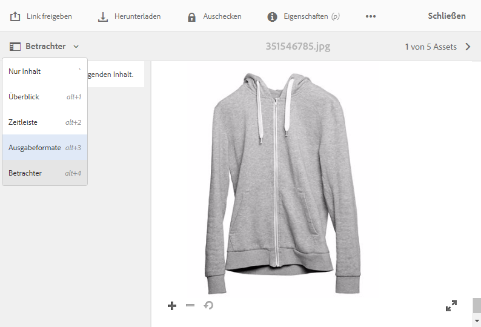
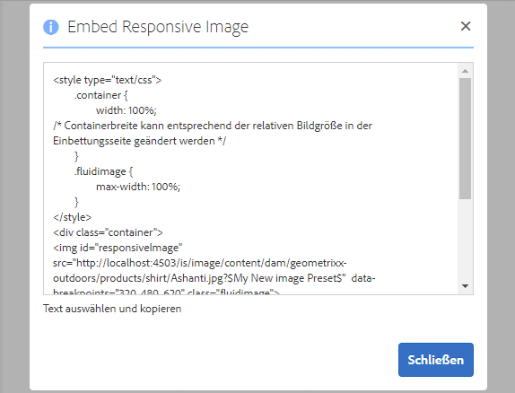

# Bereitstellen optimierter Bilder für eine responsive Website {#delivering-optimized-images-for-a-responsive-site}

<table>
    <tr>
        <td>
            <i>Neu</i> <a href="/help/assets/dynamic-media/dm-prime-ultimate.md"><b>Dynamic Media Prime und Ultimate</b></a>
        </td>
        <td>
            <i>Neu</i> <a href="/help/assets/assets-ultimate-overview.md"><b>AEM Assets Ultimate</b></a>
        </td>
        <td>
            <i>Neu</i> <a href="/help/assets/integrate-aem-assets-edge-delivery-services.md"><b>AEM Assets-Integration mit Edge Delivery Services</b></a>
        </td>
        <td>
            <i>Neu</i> <a href="/help/assets/aem-assets-view-ui-extensibility.md"><b>Erweiterbarkeit der Benutzeroberfläche</b></a>
        </td>
          <td>
            <i>Neu</i> <a href="/help/assets/dynamic-media/enable-dynamic-media-prime-and-ultimate.md"><b>Aktivieren von Dynamic Media Prime und Ultimate</b></a>
        </td>
    </tr>
    <tr>
        <td>
            <a href="/help/assets/search-best-practices.md"><b>Best Practices für die Suche</b></a>
        </td>
        <td>
            <a href="/help/assets/metadata-best-practices.md"><b>Best Practices für Metadaten</b></a>
        </td>
        <td>
            <a href="/help/assets/product-overview.md"><b>Content Hub</b></a>
        </td>
        <td>
            <a href="/help/assets/dynamic-media-open-apis-overview.md"><b>Dynamic Media mit OpenAPI-Funktionen</b></a>
        </td>
        <td>
            <a href="https://developer.adobe.com/experience-cloud/experience-manager-apis/"><b>Entwicklerdokumentation zu AEM Assets</b></a>
        </td>
    </tr>
</table>

Verwenden Sie die Funktion für responsiven Code, wenn Sie den Code für responsive Verarbeitung für Ihren Web-Entwickler freigeben möchten. Kopieren Sie den responsiven Code (**[!UICONTROL RESS]**) in die Zwischenablage, damit Sie ihn für Ihren Web-Entwickler freigeben können.

Verwenden Sie diese Funktion, wenn sich Ihre Website auf einem Drittanbieter-WCM befindet. Wenn sich Ihre Website jedoch in Adobe Experience Manager befindet, rendert ein Offsite-Image-Server das Bild und stellt es der Web-Seite bereit.

Siehe auch [Einbetten des Video-Viewers auf einer Web-Seite](embed-code.md).

Siehe auch [Verknüpfen von URLs mit einer Web-Anwendung](linking-urls-to-yourwebapplication.md).

**So stellen Sie optimierte Bilder für eine responsive Website bereit:**

1. Wechseln Sie zu dem Bild, für das Sie responsiven Code bereitstellen möchten, und wählen Sie im Dropdown-Menü **[!UICONTROL Ausgabedarstellungen]** aus.

   

1. Wählen Sie eine responsive Bildvorgabe aus. Die Schaltflächen **[!UICONTROL URL]** und **[!UICONTROL RESS]** werden angezeigt.

   

   >[!NOTE]
   >
   >Das ausgewählte Asset *und* die ausgewählte Bildvorgabe oder Viewer-Vorgabe müssen veröffentlicht werden, um die Schaltfläche **[!UICONTROL URL]** oder **[!UICONTROL RESS]** verfügbar zu machen.
   >
   >Bildvorgaben werden automatisch veröffentlicht.

1. Wählen Sie **[!UICONTROL RESS]** aus.

   

1. Wählen Sie im Dialogfeld **[!UICONTROL Responsive Bilder einbetten]** den responsiven Code-Text aus und fügen Sie ihn in Ihre Website ein, um auf das responsive Asset zuzugreifen.
1. Bearbeiten Sie die Standard-Breakpoints im Einbettungs-Code, damit sie denen der responsiven Website direkt im Code entsprechen. Testen Sie außerdem die verschiedenen Bildauflösungen bei verschiedenen Seiten-Breakpoints.

## Bereitstellen von Dynamic Media-Assets mit HTTP/2 {#using-http-to-delivery-your-dynamic-media-assets}

HTTP/2 ist das neue, aktualisierte Web-Protokoll, das die Kommunikation zwischen Browser und Servern verbessert. Es beschleunigt die Übertragung von Informationen und reduziert die erforderliche Prozessorleistung. Die Bereitstellung von Dynamic Media-Assets kann über HTTP/2 erfolgen, das schnellere Antwort- und Ladezeiten bietet.

Unter [Bereitstellung von Inhalten über HTTP/2](http2faq.md) finden Sie ausführliche Informationen zu den ersten Schritten mit HTTP/2 mit Ihrem Dynamic Media-Konto.
