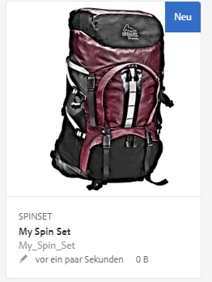
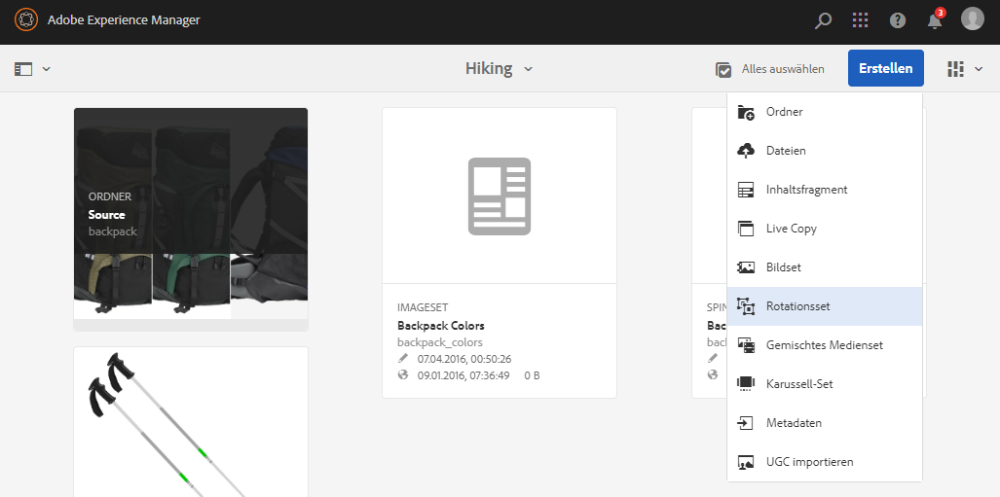
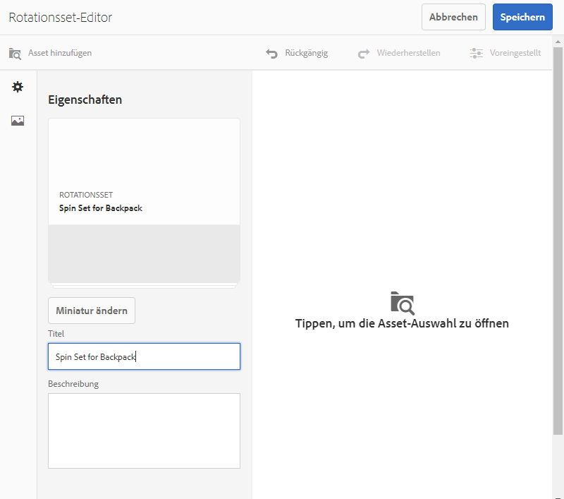
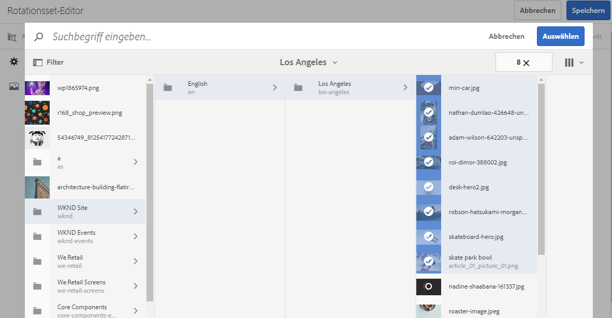
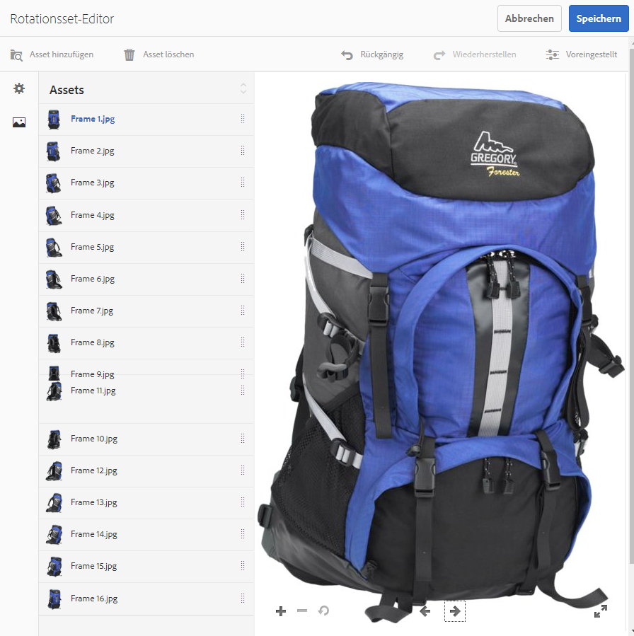
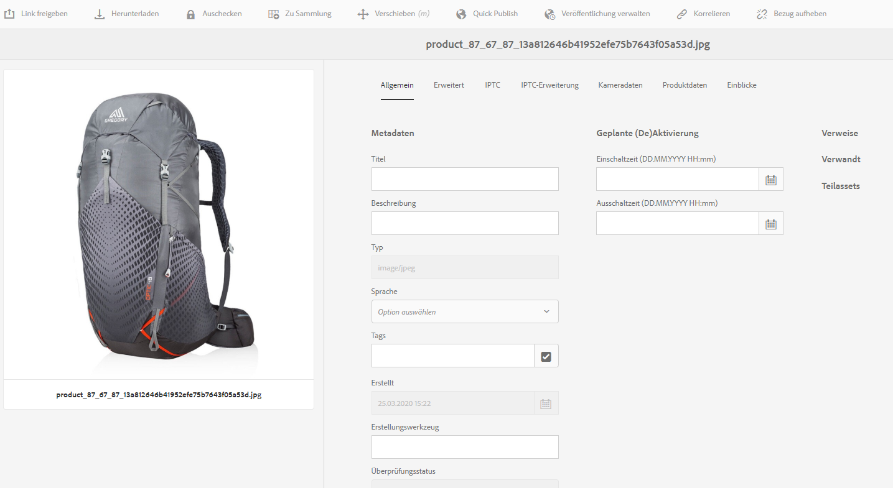
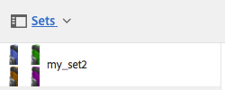
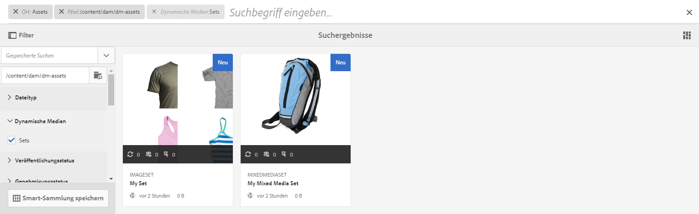

# Rotations-Sets{#spin-sets}

Ein Rotations-Set simuliert das Drehen eines Gegenstands zur genaueren Untersuchung. Mit Rotations-Sets können Artikel aus jedem Winkel betrachtet werden, um die wesentlichen visuellen Details von allen Seiten sehen zu können.

Ein Rotations-Set simuliert die 360-Grad-Anzeige. Dynamic Media bietet Rotations-Sets mit einer einzigen Achse, in denen ein Element gedreht werden kann. Darüber hinaus können Benutzende alle Ansichten mit nur wenigen Mausklicks frei zoomen und schwenken. So können Benutzende einen Artikel aus einem bestimmten Blickwinkel genauer untersuchen.

Rotations-Sets werden durch ein Banner mit dem Wort **[!UICONTROL SPINSET]** gekennzeichnet. Darüber hinaus wird bei veröffentlichten Rotations-Sets das Veröffentlichungsdatum (durch das **[!UICONTROL Welt]**-Symbol gekennzeichnet) zusammen mit dem Datum der letzten Änderung (durch das **[!UICONTROL Bleistift]**-Symbol gekennzeichnet) im Banner angezeigt.

>[!NOTE]
>
>Weitere Informationen zur Assets-Benutzeroberfläche finden Sie unter [Verwalten von Assets mit der Touch-Benutzeroberfläche](/help/assets/manage-digital-assets.md). Wenden Sie sie auf einen neuen Ordner an, in den die Bild-Set-Assets hochgeladen werden.

Beim Erstellen eines Rotations-Sets empfiehlt Adobe die folgenden Best Practices und setzt das folgende Limit um:

| Begrenzungstyp | Best Practice | Erzwungene Begrenzung |
| --- | --- | --- |
| Maximale Anzahl von Zeilen/Spalten pro 2D-Set | 12–18 Bilder pro Set | 1.000 |

Siehe auch [Dynamic Media-Beschränkungen](/help/assets/dynamic-media/limitations.md).

## Schnellstart: Rotations-Sets {#quick-start-spin-sets}

Führen Sie die folgenden Schritte aus, um sich schnell mit der Arbeit mit Rotations-Sets vertraut zu machen:

1. Optional. [Erstellen Sie eine Stapelsatzvorgabe](/help/assets/dynamic-media/batch-set-presets-dm.md) und wenden Sie sie auf einen neuen Asset-Ordner an.

   Eine Stapelsatzvorgabe kann Ihnen dabei helfen, die Erstellung Ihres Rotations-Sets zu automatisieren.

   >[!IMPORTANT]
   >
   >Stapelsätze werden vom IPS (Image Production System) bei der Asset-Erfassung erstellt.

1. [Laden Sie die Bilder für mehrere Ansichten hoch](#uploading-assets-for-spin-sets).

   Sie benötigen mindestens 8 bis 12 Aufnahmen eines Artikels für ein eindimensionales Rotations-Set und 16 bis 24 Aufnahmen für ein zweidimensionales Rotations-Set. Die Aufnahmen müssen in regelmäßigen Abständen gemacht werden, um den Eindruck zu erwecken, dass der Artikel gedreht wird. Beispiel: Wenn ein eindimensionales Rotations-Set 12 Aufnahmen umfasst, drehen Sie den Artikel für jede Aufnahme um 30 Grad (360/12).

   Unter [Dynamic Media – Unterstützte Rasterbildformate](/help/assets/file-format-support.md#image-support-dynamic-media) finden Sie eine Liste der Formate, die von Rotations-Sets unterstützt werden.

1. [Erstellen Sie Rotations-Sets](#creating-spin-sets).

   Zum Erstellen eines Rotations-Sets wählen Sie **[!UICONTROL Erstellen]** > **[!UICONTROL Rotations-Set]** und benennen Sie das Set, wählen Sie die Assets und wählen Sie die Reihenfolge der Bilder.

   Siehe [Arbeiten mit Selektoren](/help/assets/dynamic-media/working-with-selectors.md).

1. Richten Sie [Rotations-Set-Viewer-Voreinstellungen](/help/assets/dynamic-media/managing-viewer-presets.md) nach Bedarf ein.

   Administratoren können Rotations-Set-Viewer-Voreinstellungen erstellen oder ändern. Um das Rotations-Set mit einer Viewer-Vorgabe anzuzeigen, wählen Sie das Rotations-Set aus und Sie wählen im Dropdown-Menü der linken Seitenleiste die Option **Viewer**.

   Informationen zum Erstellen oder Bearbeiten von Viewer-Vorgaben finden Sie unter **[!UICONTROL Tools]** > **[!UICONTROL Assets]** > **[!UICONTROL Viewer-Vorgaben]**.

   Siehe [Hinzufügen und Bearbeiten von Viewer-Vorgaben](/help/assets/dynamic-media/managing-viewer-presets.md).

   Es gibt drei verschiedene Arten, über Stapelsatzvorgaben erstellte Sätze anzuzeigen und darauf zuzugreifen. (In der Benutzeroberfläche werden *keine* mit Stapelsatzvorgaben erstellten Sets angezeigt.)

1. [Zeigen Sie eine Vorschau der Rotations-Sets an](/help/assets/dynamic-media/previewing-assets.md).

   Wählen Sie das Rotations-Set aus, um dessen Vorschau anzuzeigen.  Drehen Sie das Rotations-Set.  Sie können verschiedene Viewer aus dem Menü **[!UICONTROL Viewer]** wählen, das Sie links in der Leiste über die Dropdown-Liste aufrufen können.

1. [Veröffentlichen Sie Rotations-Sets](/help/assets/dynamic-media/publishing-dynamicmedia-assets.md).

   Beim Veröffentlichen eines Rotations-Sets wird die URL- und Einbettungszeichenfolge aktiviert. Außerdem müssen Sie [die Viewer-Vorgabe veröffentlichen](/help/assets/dynamic-media/managing-viewer-presets.md).

1. [Verknüpfen Sie URLs mit einer Web-Anwendung](/help/assets/dynamic-media/linking-urls-to-yourwebapplication.md) oder [betten Sie den Video- oder Bild-Viewer ein](/help/assets/dynamic-media/embed-code.md).

   Adobe Experience Manager Assets erstellt URL-Aufrufe für Rotations-Sets und aktiviert diese, nachdem Sie die Rotations-Sets veröffentlicht haben. Sie können diese URLs während der Asset-Vorschau kopieren. Alternativ dazu können Sie sie in Ihre Website einbetten.

   Wählen Sie dazu das Rotations-Set aus und klicken Sie dann im Dropdown-Menü in der linken Seitenleiste auf **[!UICONTROL Viewer]**.

   Siehe [Verknüpfen von Rotations-Sets mit Web-Seiten](/help/assets/dynamic-media/linking-urls-to-yourwebapplication.md) und [Einbetten des Video- oder Bild-Viewers](/help/assets/dynamic-media/embed-code.md).

Bei Bedarf können Sie die [Rotations-Sets bearbeiten](#editing-spin-sets). Darüber hinaus können Sie die [Eigenschaften von Rotations-Sets](/help/assets/manage-digital-assets.md#editing-properties) anzeigen und ändern.

## Hochladen von Assets für Rotations-Sets {#uploading-assets-for-spin-sets}

Sie benötigen mindestens acht bis zwölf Aufnahmen eines Artikels für ein eindimensionales Rotations-Set. Die Aufnahmen müssen in regelmäßigen Abständen gemacht werden, um den Eindruck zu erwecken, dass der Artikel gedreht wird. Beispiel: Wenn ein eindimensionales Rotations-Set 12 Aufnahmen umfasst, drehen Sie den Artikel für jede Aufnahme um 30 Grad (360/12).

Unter [Dynamic Media – Unterstützte Rasterbildformate](/help/assets/file-format-support.md#image-support-dynamic-media) finden Sie eine Liste der Formate, die von Rotations-Sets unterstützt werden.

Bilder für Rotations-Sets können Sie [genauso wie alle anderen Elemente in Experience Manager Assets hochladen](/help/assets/manage-digital-assets.md).

### Richtlinien zum Erfassen von Bildern für ein Rotations-Set {#guidelines-for-shooting-spin-set-images}

Im Folgenden finden Sie einige Best Practices für Rotations-Set-Bilder.  Im Allgemeinen gilt: Je mehr Bilder ein Rotations-Set enthält, desto besser gelingt der Bildrotationseffekt.  Wenn Sie aber zahlreiche Bilder in das Set aufnehmen, dauert es auch länger, bis die Bilder geladen werden.  Adobe Experience Manager empfiehlt die folgenden Richtlinien für die Aufnahme von Bildern für Rotations-Sets:

* Verwenden Sie mindestens 8 bis 12 Bilder in einem eindimensionalen Rotations-Set und 16 bis 24 Bilder in einem zweidimensionalen Rotations-Set. Mindestens 8 Bilder sind erforderlich, um eine 360-Grad-Ansicht zu ermöglichen. Eindimensionale Rotations-Sets werden häufiger verwendet, da zweidimensionale Rotations-Sets sehr aufwendig zu erstellen sind.
* Verwenden Sie ein verlustfreies Format: TIFF und PNG werden empfohlen.
* Maskieren Sie alle Bilder so, dass der Artikel vor einem rein weißen oder kontrastreichen Hintergrund erscheint.  Fügen Sie optional Schatten hinzu.
* Stellen Sie sicher, dass die Produktdetails gut beleuchtet und fokussiert sind.
* Denken Sie z. B. an Rotationsbilder für Bekleidung an einer Schaufensterpuppe oder einem Modell.  Die Schaufensterpuppe ist häufig entweder maskiert (eine Schaufensterpuppe aus Glas) oder es wird eine stilisierte Schaufensterpuppe im Bild gezeigt. Sie können ein modellbezogenes Rotations-Set erstellen, indem Sie die Anzahl der Winkel definieren. Markieren Sie jeden Winkel mit Klebeband auf dem Boden, um dem Modell anzugeben, einen Schritt zu machen und in die Richtung der jeweiligen Aufnahme zu schauen.

## Erstellen von Rotations-Sets {#creating-spin-sets}

In diesem Abschnitt wird beschrieben, wie Sie Rotations-Sets erstellen.

>[!NOTE]
>
>Sie können Rotations-Sets auch automatisch über [Stapelsatzvorgaben](/help/assets/dynamic-media/config-dm.md) erstellen. **Wichtig:** Stapelsätze werden vom IPS (Image Production System) bei der Asset-Erfassung erstellt.
>
>Siehe „Erstellen von Batch-Satz-Vorgaben zum automatischen Erzeugen von Bild- und Rotations-Sets“ unter [Konfigurieren von Dynamic Media](/help/assets/dynamic-media/config-dm.md).

>[!NOTE]
>
>Die Reihenfolge der Bilder in einem Rotations-Set ist wichtig. Achten Sie darauf, sie so anzuordnen, dass die Rotation eine gleichmäßige 360-Grad-Ansicht ergibt.

Beim Erstellen eines Rotations-Sets empfiehlt Adobe die folgenden Best Practices und erzwingt die folgende Begrenzung:

| Begrenzungstyp | Best Practice | Erzwungene Begrenzung |
| --- | --- | --- |
| Maximale Anzahl von Zeilen/Spalten pro 2D-Set | 12–18 Bilder pro Set | 1.000 |

Siehe auch [Einschränkungen bei Dynamic Media](/help/assets/dynamic-media/limitations.md).

**So erstellen Sie Rotations-Sets:**

1. Navigieren Sie in Assets an die Stelle, an der Sie ein Rotations-Set erstellen möchten, wählen Sie **[!UICONTROL Erstellen]** und anschließend **[!UICONTROL Rotations-Set]** aus. Sie können das Set auch in einem Ordner erstellen, der die gewünschten Assets enthält.

   

1. Geben Sie im Rotations-Set-Editor im Feld **[!UICONTROL Titel]** einen Namen für das Rotations-Set ein. Der Name wird im Banner über dem Rotations-Set angezeigt.  Geben Sie optional eine Beschreibung ein.

   

   >[!NOTE]
   >
   >Beim Erstellen des Rotations-Sets können Sie die Miniatur des Rotations-Sets ändern oder zulassen, dass Adobe Experience Manager die Miniatur automatisch basierend auf den Assets im Rotations-Set auswählt. Um eine Miniatur auszuwählen, klicken Sie auf **[!UICONTROL Miniatur ändern]** und wählen Sie ein beliebiges Bild aus (Sie können auch zu anderen Ordnern gehen, um Bilder zu suchen). Wenn Sie eine Miniatur ausgewählt haben und möchten, dass Adobe Experience Manager eine Miniatur aus dem Rotations-Set generiert, wählen Sie **[!UICONTROL Zu automatischer Miniatur wechseln]** aus.

1. Führen Sie eine der folgenden Aktionen aus:

   * Wählen Sie oben links auf der Seite des Rotations-Set-Editors **[!UICONTROL Asset hinzufügen]** aus.

   * Wählen Sie in der Mitte des Rotations-Set-Editors **[!UICONTROL Wählen, um die Asset-Auswahl zu öffnen]** aus.

   Wählen Sie die gewünschten Assets, die Sie in Ihr Rotations-Set aufnehmen möchten. Die ausgewählten Assets sind mit einem Häkchen versehen. Wenn Sie fertig sind, wählen Sie in der oberen rechten Ecke der Seite **[!UICONTROL Auswählen]**.

   Mit dem Asset-Selektor können Sie nach Assets suchen, indem Sie ein Keyword eingeben und auf **[!UICONTROL Eingabe]** tippen. Sie können auch Filter anwenden, um Ihre Suchergebnisse genauer abzustimmen. Sie können nach Pfad, Sammlung, Dateityp und Tag filtern. Wählen Sie den Filter und klicken Sie in der Symbolleiste auf das Symbol **[!UICONTROL Filter]**. Ändern Sie die Ansicht, indem Sie das Symbol „Ansicht“ tippen und dann **[!UICONTROL Spaltenansicht]**, **[!UICONTROL Kartenansicht]** oder **[!UICONTROL Listenansicht]** wählen.

   Siehe [Arbeiten mit Selektoren](/help/assets/dynamic-media/working-with-selectors.md).

   

1. Assets, die Sie Ihrem Set hinzufügen, werden automatisch in alphanumerischer Reihenfolge hinzugefügt. Sie können die Anordnung oder Sortierung der Assets manuell ändern, nachdem sie hinzugefügt wurden.

   Ziehen Sie das Symbol zum Neuanordnen eines Assets ggf. rechts neben den Dateinamen des Assets, um Bilder in der Set-Liste nach oben oder unten zu bewegen.

   

   Ordnen Sie Frame 11 im Rotations-Set neu an, indem Sie ihn an eine neue Position ziehen.

1. (Optional) Führen Sie einen der folgenden Schritte aus:

   * Wenn Sie ein Bild löschen möchten, wählen Sie das Bild aus und klicken Sie auf **[!UICONTROL Asset löschen]**.

   * Wenn Sie eine Vorgabe anwenden möchten, wählen Sie oben rechts **[!UICONTROL Vorgabe]** aus. Wählen Sie anschließend eine Vorgabe aus, um sie auf alle Elemente gleichzeitig anzuwenden.

1. Wählen Sie **[!UICONTROL Speichern]** aus. Das erstellte Rotations-Set wird in dem Ordner angezeigt, in dem es erstellt wurde.

## Anzeigen von Rotations-Sets {#viewing-spin-sets}

Sie können Rotations-Sets in der Benutzeroberfläche oder automatisch über [Stapelsatzvorgaben](/help/assets/dynamic-media/config-dm.md) erstellen. Mit Stapelsatzvorgaben erstellte Sets werden jedoch *nicht* in der Benutzeroberfläche angezeigt. Sie haben drei Möglichkeiten, auf Sets zuzugreifen, die mit Stapelsatzvorgaben erstellt wurden. (Diese Methoden sind auch verfügbar, wenn Sie die Rotations-Sets in der Benutzeroberfläche erstellt haben.)

>[!NOTE]
>
>Sets können auch über die Benutzeroberfläche angezeigt werden, wie unter [Bearbeiten von Rotations-Sets](#editing-spin-sets) beschrieben.

**So zeigen Sie Rotations-Sets an:**

1. Beim Öffnen der Eigenschaften eines einzelnen Assets. Die Eigenschaften zeigen an, zu welchen Sets das ausgewählte Asset gehört (unter **[!UICONTROL Mitglied von Sets]**). Wählen Sie auf den Namen des Sets aus, um das gesamte Set anzuzeigen.

   

1. Von einem zugehörigen Bild eines beliebigen Sets. Wählen Sie das Menü **[!UICONTROL Sets]** aus, um die Sets anzuzeigen, denen das Asset angehört.

   

1. Über die Suche können Sie **[!UICONTROL Filter]** auswählen, dann **[!UICONTROL Dynamic Media]** erweitern und **[!UICONTROL Sets]** auswählen.

   Die Suche gibt als Ergebnis Sets zurück, die in der Benutzeroberfläche manuell oder mit Stapelsatzvorgaben automatisch erstellt wurden. Im Gegensatz zu Adobe Experience Manager-Suchen, die mit dem Suchkriterium `Contains` durchgeführt werden, wird die Suchabfrage für automatisierte Sets mithilfe des Suchkriteriums `Starts with` durchgeführt. Automatisierte Sets können nur durchsucht werden, wenn der Filter auf **[!UICONTROL Sets]** eingestellt ist.

   

## Bearbeiten von Rotations-Sets {#editing-spin-sets}

Sie können mehrere Bearbeitungsaufgaben für Rotations-Sets ausführen, z. B. die folgenden:

* Fügen Sie dem Rotations-Set Bilder hinzu.
* Ordnen Sie Bilder im Rotations-Set neu an.
* Löschen Sie Assets im Rotations-Set.
* Wenden Sie Viewer-Vorgaben an.
* Löschen Sie das Rotations-Set.

**So bearbeiten Sie Rotations-Sets:**

1. Führen Sie einen der folgenden Schritte aus:

   * Zeigen Sie mit der Maus auf ein Rotations-Set-Asset und wählen Sie **[!UICONTROL Bearbeiten]** (Stiftsymbol) aus.
   * Zeigen Sie mit der Maus auf ein Rotations-Set-Asset und wählen Sie in der Symbolleiste **[!UICONTROL Auswählen]** (Häkchensymbol) aus und dann **[!UICONTROL Bearbeiten]**.

   * Wählen Sie ein Rotations-Set-Asset aus und klicken Sie dann in der Symbolleiste auf **[!UICONTROL Bearbeiten]** (Bleistiftsymbol).

1. Führen Sie zum Bearbeiten des Rotations-Sets einen der folgenden Schritte aus:

   * Ziehen Sie ein Bild, wenn Sie es an einer neuen Position anordnen möchten (zum Verschieben von Elementen wählen Sie das Symbol zum Neuanordnen).
   * Um Elemente in auf- oder absteigender Reihenfolge zu sortieren, klicken Sie auf die Spaltenüberschrift.
   * Zum Hinzufügen oder Aktualisieren eines vorhandenen Assets klicken Sie auf **[!UICONTROL Asset hinzufügen]**. Gehen Sie zu einem Asset, wählen Sie es aus und klicken Sie in der oberen rechten Ecke auf **[!UICONTROL Auswählen]**.
Wenn Sie das in Experience Manager als Miniatur verwendete Bild löschen und durch ein anderes ersetzen, wird das Original-Asset weiterhin angezeigt.
   * Um ein Asset zu löschen, wählen Sie es aus und wählen Sie **[!UICONTROL Asset löschen]**.
   * Um eine Vorgabe anzuwenden, klicken Sie auf das Symbol „Vorgabe“ und wählen Sie eine Vorgabe aus.
   * Navigieren Sie zum Löschen eines ganzen Rotations-Sets zu diesem Rotations-Set, wählen Sie es aus und wählen Sie **[!UICONTROL Löschen]**.

   >[!NOTE]
   >
   >Sie können die Bilder in einem Rotations-Set bearbeiten, indem Sie zu diesem Set gehen, in der linken Seitenleiste **[!UICONTROL Mitglieder des Sets]** auswählen und dann auf das Stiftsymbol eines einzelnen Assets klicken, um das Bearbeitungsfenster zu öffnen.

1. Klicken Sie auf **[!UICONTROL Speichern]**, wenn Sie mit der Bearbeitung fertig sind.

## Anzeigen von Rotations-Sets in der Vorschau {#previewing-spin-sets}

Siehe [Anzeigen von Assets in der Vorschau](/help/assets/dynamic-media/previewing-assets.md).

## Veröffentlichen von Rotations-Sets {#publishing-spin-sets}

Siehe [Veröffentlichen von Assets](/help/assets/dynamic-media/publishing-dynamicmedia-assets.md).
