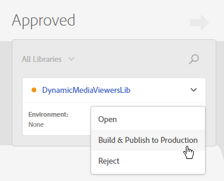
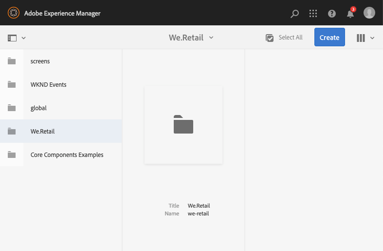

# Integrieren von Dynamic Media Viewers mit Adobe Analytics und Experience Platform Tags {#integrating-dynamic-media-viewers-with-adobe-analytics-and-adobe-launch}

## Worum geht es bei der Integration von Dynamic Media Viewers mit Adobe Analytics und Experience Platform Tags? {#what-is-dynamic-media-viewers-integration-with-adobe-analytics-and-adobe-launch}

<!-- Leave this hidden path here; it points to the topic source from Sasha https://wiki.corp.adobe.com/pages/viewpage.action?spaceKey=~oufimtse&title=Dynamic+Media+Viewers+integration+with+Adobe+Launch 

name used to be Experience Platform Launch. Changed to Experience Platform Data Collection-->

Die *Dynamic Media Viewers*-Erweiterung für Experience Platform Tags funktioniert mit Dynamic Media Viewers 5.13. Damit können Adobe Analytics- und Experience Platform-Tags-Kunden die Ereignisse und Daten von Dynamic Media Viewers in ihren Tag-Konfigurationen verwenden.

Diese Integration ermöglicht es Ihnen, die Nutzung von Dynamic Media Viewers auf Ihrer Website mit Adobe Analytics zu verfolgen. Gleichzeitig können Sie die von den Viewern angezeigten Ereignisse und Daten mit jeder anderen Experience Platform Tags-Erweiterung von Adobe oder einem Drittanbieter verwenden.

Weitere Informationen zu Erweiterungen von Adobe oder Drittanbietern finden Sie unter [Adobe-Erweiterungen](https://experienceleague.adobe.com/de/docs/experience-platform/tags/extensions/overview) im Benutzerhandbuch zu Experience Platform Tags.

**Dieses Thema richtet sich an:** Website-Administratoren, Entwickler für das Adobe Experience Manager-Programm und Anwender.

### Einschränkungen der Integration {#limitations-of-the-integration}

* Die Experience Platform Tags-Integration für Dynamic Media Viewers funktioniert nicht im Experience Manager-Autorenmodus. Sie können kein Tracking für eine WCM-Seite anzeigen, bevor diese veröffentlicht wurde.
* Die Experience Platform Tags-Integration für Dynamic Media-Viewer wird nicht im Popup-Betriebsmodus unterstützt, bei dem die Viewer-URL über die Schaltfläche „URL“ auf der Asset-Detailseite abgerufen wird.
* Die Experience Platform Tags-Integration kann nicht gleichzeitig mit der Analytics-Integration älterer Viewer verwendet werden (mit dem Parameter `config2=`).
* Unterstützung für das Video-Tracking ist auf das Core-Wiedergabe-Tracking beschränkt, wie unter [Tracking-Übersicht](https://experienceleague.adobe.com/de/docs/media-analytics/using/tracking/track-core-overview#player-events) beschrieben. Insbesondere werden QoS, Anzeigen, Kapitel/Segmente oder das Fehler-Tracking nicht unterstützt.
* Die Konfiguration der Speicherdauer für Datenelemente wird bei Datenelementen, die die Erweiterung *Dynamic Media Viewers* verwenden, nicht unterstützt. Die Speicherdauer muss auf **[!UICONTROL Ohne]** eingestellt sein.

### Anwendungsbeispiele für die Integration {#use-cases-for-the-integration}

Der primäre Anwendungsfall für die Integration mit Experience Platform Tags sind Kunden, die sowohl Experience Manager Assets als auch Experience Manager Sites verwenden. In solchen Fällen können Sie eine Standardintegration zwischen dem Autorenknoten von Experience Manager und Experience Platform Tags einrichten und dann Ihre Sites-Instanz mit der Experience Platform Tags-Eigenschaft verknüpfen. Danach verfolgt jede Dynamic Media-WCM-Komponente, die einer Sites-Seite hinzugefügt wird, Daten und Ereignisse von Viewern.

Siehe [Tracking von Dynamic Media-Viewern in Experience Manager Sites](#tracking-dynamic-media-viewers-in-aem-sites).

Ein sekundäres Anwendungsbeispiel, das die Integration unterstützt, sind Kunden, die nur Experience Manager Assets oder Dynamic Media Classic verwenden. In solchen Fällen können Sie den Einbettungs-Code für Ihren Viewer abrufen und der Web-Seite hinzufügen. Rufen Sie dann die Produktions-URL der Experience Platform Tags-Bibliothek aus Experience Platform Tags ab und fügen Sie sie manuell zum Web-Seiten-Code hinzu.

Siehe [Tracking von Dynamic Media-Viewern mit eingebettetem Code](#tracking-dynamic-media-viewers-using-embed-code).

## Funktionsweise der Daten- und Ereignisverfolgung in der Integration {#how-data-and-event-tracking-works-in-the-integration}

Die Integration nutzt zwei separate und unabhängige Typen des Tracking von Dynamic Media Viewers: *Adobe Analytics* und *Adobe Analytics for Audio and Video*.

### Informationen zum Tracking mit Adobe Analytics {#about-tracking-using-adobe-analytics}

Mit Adobe Analytics können Sie Aktionen verfolgen, die ein Benutzer bei der Interaktion mit Dynamic Media-Viewern auf Ihrer Website ausführt. Mit Adobe Analytics können Sie außerdem Viewer-spezifische Daten verfolgen. Beispielsweise können Sie Ladeereignisse der Ansicht zusammen mit dem Asset-Namen, vorgenommenen Zoom-Aktionen und Videowiedergabeaktionen verfolgen und aufzeichnen.

In Experience Platform Tags arbeiten die Konzepte *Datenelemente* und *Regeln* zusammen, um das Adobe Analytics-Tracking zu erlauben.

#### Datenelemente in Experience Platform Tags {#about-data-elements-in-adobe-launch}

Ein Datenelement in Experience Platform Tags ist eine benannte Eigenschaft, deren Wert entweder statisch definiert ist oder basierend auf dem Status einer Web-Seite bzw. von Dynamic Media Viewers-Daten dynamisch berechnet wird.

Optionen, die für eine Datenelementdefinition verfügbar sind, hängen von der Liste der Erweiterungen ab, die in der Experience Platform Tags-Eigenschaft installiert sind. Die Erweiterung „Core“ ist vorinstalliert und in jeder Konfiguration standardmäßig verfügbar. Mit der Erweiterung „Core“ können Sie ein Datenelement definieren, dessen Wert aus Cookies, JavaScript-Code, Abfragezeichenfolgen und vielen anderen Quellen stammen kann.

Für das Tracking mit Adobe Analytics müssen mehrere zusätzliche Erweiterungen wie unter [Installation und Einrichtung von Erweiterungen](#installing-and-setup-of-extensions) beschrieben installiert werden. Die Dynamic Media Viewers-Erweiterung bietet die Möglichkeit, ein Datenelement zu definieren, dessen Wert ein Argument des Dynamic Media Viewers-Ereignisses ist. Beispielsweise können Sie auf den Viewer-Typ oder den Asset-Namen, der vom Viewer beim Laden gemeldet wird, auf den Zoom-Faktor, der beim Zoomen durch den Endbenutzer gemeldet wird, und vieles mehr verweisen.

Die Dynamic Media Viewers-Erweiterung sorgt dafür, dass die Werte der Datenelemente automatisch auf dem neuesten Stand sind.

Nachdem Sie ein Datenelement definiert haben, können Sie es an anderen Stellen der Experience Platform Tags-Benutzeroberfläche verwenden. Nutzen Sie dazu das Widget zur Auswahl von Datenelementen. Die **Aktion „Variablen festlegen** der Adobe Analytics-Erweiterung in einer Regel verweist auf Datenelemente, die für das Tracking von Dynamic Media Viewers definiert sind (siehe unten).

Weitere Informationen dazu finden Sie unter [Datenelemente](https://experienceleague.adobe.com/de/docs/experience-platform/tags/ui/data-elements) im Experience Platform Tags-Benutzerhandbuch.

#### Info zu Regeln in Experience Platform Tags {#about-rules-in-adobe-launch}

Eine Regel in Experience Platform Tags ist eine agnostische Konfiguration, die drei Bereiche definiert, aus denen eine Regel besteht: *Ereignisse*, *Bedingungen* und *Aktionen*:

* *Ereignisse*: (wenn) teilen Experience Platform Tags mit, wann eine Regel ausgelöst werden soll.
* *Bedingungen*: (wenn) teilen Experience Platform Tags mit, welche zusätzlichen Einschränkungen beim Auslösen einer Regel zulässig oder nicht zulässig sind.
* *Aktionen*: (dann) teilen Experience Platform Tags mit, was zu tun ist, wenn eine Regel ausgelöst wird.

Die im Abschnitt „Ereignisse“, „Bedingungen“ und „Aktionen“ verfügbaren Optionen hängen von den Erweiterungen ab, die in der Experience Platform Tags-Eigenschaft installiert sind. Die Erweiterung *Core* ist vorinstalliert und in jeder Konfiguration standardmäßig verfügbar. Die Erweiterung bietet verschiedene Optionen für Ereignisse, wie zum Beispiel grundlegende Aktionen auf der Browser-Ebene, inklusive Fokuswechsel, Tastendruck und Formularübermittlung. Sie enthält zudem Optionen für Bedingungen, wie z. B. Cookie-Wert, Browser-Typ und mehr. Für Aktionen steht nur die Option „Benutzerspezifischer Code“ zur Verfügung.

Für das Tracking mit Adobe Analytics müssen mehrere zusätzliche Erweiterungen wie unter [Installation und Einrichtung von Erweiterungen](#installing-and-setup-of-extensions) beschrieben installiert werden. Insbesondere gilt:

* Die Dynamic Media Viewers-Erweiterung erweitert die Liste der unterstützten Ereignisse auf Ereignisse, die für Dynamic Media Viewers spezifisch sind, z. B. Laden des Viewers, Austauschen von Assets, Vergrößern und Abspielen von Videos.
* Die Adobe Analytics-Erweiterung erweitert die Liste der unterstützten Aktionen um zwei Aktionen, die zum Senden von Daten an Tracking-Server erforderlich sind: *Variablen festlegen* und *Beacon senden*.

Beim Tracking von Dynamic Media-Viewern ist es möglich, einen der folgenden Typen zu verwenden:

* Ereignisse aus der Dynamic Media Viewers-Erweiterung, der Core-Erweiterung oder einer anderen Erweiterung.
* Bedingungen in der Regeldefinition. Alternativ können Sie den Bedingungsbereich leer lassen.

Im Abschnitt „Aktionen“ müssen Sie über die Aktion *Variablen festlegen* verfügen. Diese Aktion teilt Adobe Analytics mit, wie Tracking-Variablen mit Daten ausgefüllt werden. Gleichzeitig sendet die Aktion *Variablen festlegen* nichts an den Tracking-Server.

Die Aktion **Beacon senden** muss der Aktion **Variablen festlegen** folgen. Mit der Aktion *Beacon senden* werden tatsächlich Daten an den Analytics-Tracking-Server gesendet. Beide Aktionen (*Variablen festlegen* und *Beacon senden*) kommen aus der Adobe Analytics-Erweiterung.

Siehe [Regeln](https://experienceleague.adobe.com/de/docs/experience-platform/tags/ui/rules) im Experience Platform Tags-Benutzerhandbuch.

#### Beispielkonfiguration {#sample-configuration}

Die folgende Beispielkonfiguration in Experience Platform Tags zeigt, wie sich ein Asset-Name beim Laden des Viewers verfolgen lässt.

1. Definieren Sie auf der **[!UICONTROL Datenelemente]** eine `AssetName`, die auf `asset` Parameter des `LOAD`-Ereignisses in der Dynamic Media-Viewers-Erweiterung verweist.

   

1. Definieren Sie auf der Registerkarte **[!UICONTROL Regeln]** eine Regel für *TrackAssetOnLoad*.

   In dieser Regel verwendet das Feld **[!UICONTROL Ereignis]** das **[!UICONTROL LOAD]**-Ereignis aus der Dynamic Media Viewers-Erweiterung-Erweiterung.

   

1. Die Aktionskonfiguration umfasst zwei Aktionstypen aus der Adobe Analytics-Erweiterung:

   *Variablen festlegen*, wodurch eine Analytics-Variable Ihrer Wahl dem Wert des Datenelements `AssetName` zugeordnet wird;

   *Beacon senden*, wodurch Tracking-Daten an Adobe Analytics gesendet werden.

   

1. Die daraus resultierende Regelkonfiguration sieht wie folgt aus:

   

### Informationen zu Adobe Analytics for Audio and Video {#about-adobe-analytics-for-audio-and-video}

Wenn für die Verwendung von Adobe Analytics for Audio and Video ein Experience Cloud-Konto abonniert wird, reicht es, in den Einstellungen der Erweiterung *Dynamic Media Viewers* das Video-Tracking zu aktivieren. Videometriken werden so in Adobe Analytics verfügbar. Video-Tracking ist auf die Erweiterung „Adobe Media Analytics for Audio and Video“ angewiesen.

Siehe [Installation und Einrichtung von Erweiterungen](#installing-and-setup-of-extensions).

Derzeit ist die Unterstützung für Video-Tracking auf das Tracking „Core-Wiedergabe“ beschränkt, wie in der [Tracking-Übersicht](https://experienceleague.adobe.com/de/docs/media-analytics/using/tracking/track-core-overview#player-events) beschrieben. Insbesondere werden QoS, Anzeigen, Kapitel/Segmente oder das Fehler-Tracking nicht unterstützt.

## Verwenden der Dynamic Media Viewers-Erweiterung {#using-the-dynamic-media-viewers-extension}

Wie unter [Anwendungsbeispiele für die Integration](#use-cases-for-the-integration) erwähnt, ist es möglich, Dynamic Media Viewers sowohl mit der neuen Experience Platform Tags-Integration in Experience Manager Sites als auch mithilfe von Einbettungs-Code zu verfolgen.

### Tracking von Dynamic Media-Viewern in Experience Manager Sites {#tracking-dynamic-media-viewers-in-aem-sites}

Zum Tracking von Dynamic Media-Viewern in Experience Manager Sites müssen alle Schritte ausgeführt werden, die im Abschnitt [Konfigurieren aller Integrationselemente](#configuring-all-the-integration-pieces) aufgeführt sind. Insbesondere müssen Sie die IMS-Konfiguration und die Experience Platform Tags Cloud-Konfiguration erstellen.

Nach ordnungsgemäßer Konfiguration verfolgt jeder Dynamic Media-Viewer, den Sie einer Sites-Seite mithilfe einer von Dynamic Media unterstützten WCM-Komponente hinzufügen, automatisch Daten für Adobe Analytics oder Adobe Analytics for Video oder beides.

Siehe [Hinzufügen von Dynamic Media-Assets zu Seiten mit Adobe Sites](/help/assets/dynamic-media/adding-dynamic-media-assets-to-pages.md).

### Tracking von Dynamic Media-Viewern mit Einbettungs-Code {#tracking-dynamic-media-viewers-using-embed-code}

Kunden, die kein Experience Manager Sites verwenden oder Dynamic Media Viewers in Web-Seiten außerhalb von Experience Manager Sites einbetten (oder beides), können weiterhin die Experience Platform Tags-Integration nutzen.

Sie müssen die Konfigurationsschritte im Abschnitt [Konfigurieren von Adobe Analytics](#configuring-adobe-analytics-for-the-integration) und [Konfigurieren von Experience Platform Tags](#configuring-adobe-launch-for-the-integration) ausführen. Experience Manager-bezogene Konfigurationsschritte sind jedoch nicht erforderlich.

Nach der ordnungsgemäßen Konfiguration können Sie Experience Platform Tags-Unterstützung zu einer Website mit einem Dynamic Media-Viewer hinzufügen.

Weitere [&#x200B; zur Verwendung des Einbettungs-Codes für die Experience Platform Tags](https://experienceleague.adobe.com/de/docs/platform-learn/implement-in-websites/configure-tags/add-embed-code)Bibliothek finden Sie unter „Hinzufügen des Einbettungs-Codes für Experience Platform Tags“.

Weitere Informationen zur Verwendung der Funktion für eingebetteten Code von Experience Manager Dynamic Media finden Sie unter [Einbetten des Video- oder Bild-Viewers auf einer Web-Seite](/help/assets/dynamic-media/embed-code.md).

**Tracking von Dynamic Media-Viewern mit eingebettetem Code:**

1. Verwenden Sie eine Website, die bereit zum Einbetten eines Dynamic Media-Viewers ist.
1. Rufen Sie den Einbettungs-Code für die Experience Platform Tags-Bibliothek ab, indem Sie sich zuerst bei Experience Platform Tags anmelden (siehe [Konfigurieren von Experience Platform Tags](#configuring-adobe-launch-for-the-integration)).
1. Wählen Sie **[!UICONTROL Eigenschaft]** aus und klicken Sie dann auf die Registerkarte **[!UICONTROL Umgebungen]**.
1. Wählen Sie die für die Umgebung der Web-Seite relevante Umgebungsebene aus. Klicken Sie dann in der Spalte **[!UICONTROL Installieren]** auf das Kontrollkästchen.
1. Kopieren Sie im Dialogfeld **[!UICONTROL Web-Installationsanweisungen]** den vollständigen Einbettungs-Code der Experience Platform Tags-Bibliothek zusammen mit den zugehörigen `<script/>`-Tags.

## Referenzhandbuch für die Dynamic Media Viewers-Erweiterung {#reference-guide-for-the-dynamic-media-viewers-extension}

### Über die Konfiguration von Dynamic Media Viewers {#about-the-dynamic-media-viewers-configuration}

Die Dynamic Media Viewers Erweiterung wird automatisch in die Experience Platform Tags-Bibliothek integriert, wenn alle folgenden Bedingungen erfüllt sind:

* Das globale Objekt (`_satellite`) der Experience Platform Tags-Bibliothek befindet sich auf der Seite.
* Die Funktion `_dmviewers_v001()` der Dynamic Media Viewers-Erweiterung ist für `_satellite` definiert.

* Der Viewer-Parameter `config2=` wurde nicht angegeben. Das bedeutet, dass der Viewer keine ältere Analytics-Integration verwendet.

Darüber hinaus gibt es eine Option, um die Experience Platform Tags-Integration explizit im Viewer zu deaktivieren, indem in der Viewer-Konfiguration `launch=0` Parameter angegeben wird. Der Standardwert dieses Parameters ist `1`.

### Konfigurieren der Dynamic Media Viewers-Erweiterung {#configuring-the-dynamic-media-viewers-extension}

Die einzige Konfigurationsoption für die Dynamic Media Viewers-Erweiterung ist **[!UICONTROL Adobe Media Analytics for Audio and Video aktivieren]**.

Wenn Sie diese Option aktivieren und die Erweiterung „Adobe Media Analytics for Audio and Video“ installiert sowie konfiguriert haben, werden Videowiedergabemetriken an die Lösung „Adobe Analytics for Audio and Video“ gesendet. Durch Deaktivieren dieser Option wird das Video-Tracking deaktiviert.

Wenn Sie diese Option aktivieren *ohne* Erweiterung „Adobe Media Analytics for Audio and Video“ installiert zu haben, hat diese Option keine Auswirkungen.

### Datenelemente in der Dynamic Media Viewers-Erweiterung {#about-data-elements-in-the-dynamic-media-viewers-extension}

Der einzige Datenelementtyp, den die Dynamic Media Viewers-Erweiterung bietet, ist **[!UICONTROL Viewer-Ereignis]** aus der Dropdown-Liste **[!UICONTROL Datenelementtyp]**.

Wenn diese Option aktiviert ist, rendert der Datenelement-Editor ein Formular mit zwei Feldern:

* **[!UICONTROL Ereignisdatentyp DM-Viewer]** - Eine Dropdown-Liste zeigt alle Viewer-Ereignisse mit Argumenten an, die von der Dynamic Media Viewers-Erweiterung unterstützt werden, sowie ein spezielles **[!UICONTROL COMMON]**-Element. Ein **[!UICONTROL COMMON]**-Element stellt eine Liste von Ereignisparametern dar, die allen von den Viewern gesendeten Ereignistypen gemein sind.
* **[!UICONTROL Tracking-Parameter]** – ein Argument des ausgewählten Dynamic Media Viewers-Ereignisses.

Eine Liste [&#x200B; unterstützten Ereignisse nach Viewer-Typ finden Sie &#x200B;](https://experienceleague.adobe.com/de/docs/dynamic-media-developer-resources/library/viewers-aem-assets-dmc/c-html5-s7-aem-asset-viewers) „Dynamic Media Viewers-Referenzhandbuch“. Konsultieren Sie den Abschnitt zum gewünschten Viewer und klicken Sie auf den Unterabschnitt „Support für Tracking mit Adobe Analytics&quot;. Derzeit sind Ereignisargumente im Referenzhandbuch für Dynamic Media Viewers nicht dokumentiert.

Betrachten wir nun den Lebenszyklus des *Datenelements* von Dynamic Media Viewers. Der Wert eines solchen Datenelements wird ausgefüllt, nachdem das entsprechende Dynamic Media-Viewer-Ereignis auf der Seite eintritt. Angenommen, das Datenelement verweist auf das Ereignis **[!UICONTROL LOAD]** und das zugehörige „asset“-Argument. Der Wert eines solchen Datenelements empfängt gültige Daten, nachdem der Viewer das LOAD -Ereignis zum ersten Mal ausführt. Wenn das Datenelement auf das **[!UICONTROL ZOOM]**-Ereignis und das zugehörige „scale“-Argument verweist, bleibt der Wert dieses Datenelements leer, bis der Viewer zum ersten Mal ein **[!UICONTROL ZOOM]**-Ereignis sendet.

Gleichermaßen werden die Werte von Datenelementen automatisch aktualisiert, wenn der Viewer ein entsprechendes Ereignis auf der Seite sendet. Der Wert wird auch dann aktualisiert, wenn das betreffende Ereignis nicht in der Regelkonfiguration angegeben ist. Angenommen, das Datenelement **[!UICONTROL ZoomScale]** wird für den Parameter „scale“ des ZOOM-Ereignisses definiert. Das **[!UICONTROL LOAD]**-Ereignis ist jedoch der einzige Trigger in der Regelkonfiguration. Der Wert von **[!UICONTROL ZoomScale]** wird dennoch immer dann aktualisiert, wenn ein Benutzer im Viewer einen Zoom ausführt.

Jeder Dynamic Media-Viewer verfügt auf der Website über eine eindeutige Kennung. Das Datenelement verfolgt den Wert selbst und auch den Viewer, der den Wert ausgefüllt hat. Angenommen, es gibt mehrere Viewer auf derselben Seite und ein **[!UICONTROL AssetName]**-Datenelement, das auf das **[!UICONTROL LOAD]**-Ereignis und das zugehörige „asset“-Argument verweist. Das Datenelement **[!UICONTROL AssetName]** verwaltet eine Sammlung von Asset-Namen, die mit jedem auf der Seite geladenen Viewer verknüpft sind.

Der jeweilige vom Datenelement zurückgegebene Wert hängt vom Kontext ab. Wenn eine von einem Dynamic Media-Viewer-Ereignis ausgelöste Regel das Datenelement anfordert, wird der Wert für den Viewer zurückgegeben, der die Regel initiiert hat. Wenn eine Regel, die durch ein Ereignis einer anderen Experience Platform Tags-Erweiterung ausgelöst wird, das Datenelement anfordert, folgt sie dem Kontext des entsprechenden Ereignisses. In diesem Fall kommt der Wert des Datenelements von dem Viewer, der dieses Datenelement zuletzt aktualisiert hat.

**Betrachten Sie das folgende Beispiel:**

* Eine Webseite mit zwei Dynamic Media-Zoom-Viewern: *viewer1* und *viewer2*.

* Das Datenelement **[!UICONTROL ZoomScale]** verweist auf das **[!UICONTROL ZOOM]**-Ereignis und das zugehörige „scale“-Argument.
* **[!UICONTROL TrackPan]**-Regel mit folgenden Eigenschaften:

   * Verwendet das Dynamic Media-Viewer-Ereignis **[!UICONTROL PAN]** als Auslöser.
   * Sendet den Wert des **[!UICONTROL ZoomScale]**-Datenelements an Adobe Analytics.

* **[!UICONTROL TrackKey]**-Regel mit folgenden Eigenschaften:

   * Verwendet das Tastendruckereignis der Experience Platform Tags-Core-Erweiterung als Auslöser.
   * Sendet den Wert des **[!UICONTROL ZoomScale]**-Datenelements an Adobe Analytics.

Nehmen wir nun an, dass die Benutzerin oder der Benutzer die Web-Seite mit beiden Viewern lädt. In *Viewer1* zoomt er auf eine Skalierung von 50 %. In *Viewer2* zoomt er dann auf eine Skalierung von 25 %. In *Viewer1* schwenkt er das Bild und drückt schließlich eine Taste auf der Tastatur.

Die Aktivitäten der Person führen dazu, dass die folgenden beiden Tracking-Aufrufe an Adobe Analytics gesendet werden:

* Der erste Aufruf erfolgt, weil die **[!UICONTROL TrackPan]**-Regel ausgelöst wird, wenn Benutzende in (*1)*. Dieser Aufruf sendet **50%** als Wert des **[!UICONTROL ZoomScale]**-Datenelements, da er erkennt, dass *viewer1* die Regel ausgelöst hat, und den entsprechenden Skalierungswert abruft.
* Der zweite Aufruf erfolgt, weil die Regel **[!UICONTROL TrackKey]** ausgelöst wird, wenn der Benutzer eine Taste auf der Tastatur gedrückt hat. Dieser Aufruf sendet 25 % als Wert des **[!UICONTROL ZoomScale]**-Datenelements, da der Viewer die Regel nicht Trigger hat. Daher gibt das Datenelement den aktuellsten Wert zurück.

Das oben aufgestellte Beispiel wirkt sich auch auf die Lebensdauer des Datenelementwerts aus. Der Wert des vom Dynamic Media-Viewer verwalteten Datenelements wird im Code der Experience Platform Tags-Bibliothek gespeichert, selbst wenn der Viewer selbst auf der Website beendet wird. Diese Funktion bedeutet, dass der letzte bekannte Wert zurückgegeben wird, wenn eine von einer nicht von Dynamic Media Viewers ausgelöste Regel auf das Datenelement verweist. Das gilt auch, wenn der Viewer nicht mehr auf der Website vorhanden ist.

In jedem Fall werden Werte von Datenelementen, die von Dynamic Media Viewers gesteuert werden, nicht im lokalen Speicher oder auf dem Server gespeichert. Sie werden stattdessen nur in der Client-seitigen Experience Platform Tags-Bibliothek gespeichert. Die Werte solcher Datenelemente verschwinden, wenn die Web-Seite neu geladen wird.

Im Allgemeinen unterstützt der Datenelement-Editor eine [Festlegung der Speicherdauer](https://experienceleague.adobe.com/de/docs/experience-platform/tags/ui/data-elements#create-a-data-element). Datenelemente, die die Dynamic Media Viewers-Erweiterung verwenden, unterstützen jedoch als Speicherdauer nur die Option **[!UICONTROL Ohne]**. Das Festlegen eines anderen Werts ist in der Benutzeroberfläche möglich, in diesem Fall wird jedoch das Verhalten des Datenelements nicht definiert. Die Erweiterung verwaltet den Wert des Datenelements selbst: das Datenelement, das den Wert des Viewer-Ereignisarguments während des gesamten Lebenszyklus des Viewers beibehält.

### Über Regeln in der Dynamic Media Viewers-Erweiterung {#about-rules-in-the-dynamic-media-viewers-extension}

Im Regeleditor werden mit der Erweiterung neue Konfigurationsoptionen für den Ereigniseditor hinzugefügt. Außerdem bietet der Editor eine Option zum manuellen Verweisen auf Ereignisparameter im Aktionseditor als schnelle Option anstelle der Verwendung vorkonfigurierter Datenelemente.

#### Über den Ereigniseditor {#about-the-events-editor}

Im Ereigniseditor wird mit der Dynamic Media Viewers-Erweiterung ein **[!UICONTROL Ereignistyp]** namens **[!UICONTROL Viewer-Ereignis]** hinzugefügt.

Wenn diese Option aktiviert ist, zeigt der Ereigniseditor die Dropdown **[!UICONTROL Liste „Dynamic Media-Viewer]** Ereignisse“ an, in der alle von Dynamic Media-Viewern unterstützten Ereignisse aufgelistet sind.

#### Über den Aktionseditor {#about-the-actions-editor}

Mit der Dynamic Media Viewers-Erweiterung können Sie Ereignisparameter von Dynamic Media Viewers verwenden, um im Editor „Variablen festlegen“ der Adobe Analytics-Erweiterung Analysevariablen zuzuordnen.

Die einfachste Methode dazu besteht darin, den folgenden zweistufigen Vorgang durchzuführen:

* Definieren Sie zunächst ein oder mehrere Datenelemente, wobei jedes Datenelement einen Parameter eines Dynamic Media-Viewer-Ereignisses darstellt.
* Klicken Sie dann im Editor „Variablen festlegen“ der Adobe Analytics-Erweiterung auf  **Datenelement** Auswahl, um das Dialogfeld „Datenelement auswählen“ zu öffnen. Klicken Sie dann auf ein Datenelement darin.

Es ist jedoch möglich, einen anderen Ansatz zu verwenden und die Erstellung von Datenelementen zu umgehen. Sie können direkt auf ein Argument in einem Dynamic Media Viewer-Ereignis verweisen. Geben Sie im Eingabefeld **[!UICONTROL value]** der Analytics-Variablenzuweisung den vollständig qualifizierten Namen des Ereignis-Arguments ein. Stellen Sie sicher, dass Prozentzeichen (%) umrandet sind. Beispiel:

`%event.detail.dm.LOAD.asset%`

Es gibt einen wichtigen Unterschied zwischen der Verwendung von Datenelementen und dem direkten Verweis auf ein Ereignisargument. Bei Datenelementen spielt es keine Rolle, welches Ereignis die Aktion „Variablen festlegen“ auslöst. Das Ereignis, dass die Regel auslöst, muss mit dem Dynamic Media Viewer nicht in Verbindung stehen (z. B. wenn die Website über die Core-Erweiterung angeklickt wird). Bei Verwendung eines direkten Argumentverweises muss jedoch sichergestellt werden, dass das Ereignis, das die Regel auslöst, dem Ereignisargument entspricht, auf das es verweist.

Trigger Wenn beispielsweise das **[!UICONTROL LOAD]**-Ereignis aus der Dynamic Media-Viewers-Erweiterung die Regel auslöst, wird durch die Referenzierung von `%event.detail.dm.LOAD.asset%` der richtige Asset-Name zurückgegeben.

Bei jedem anderen Ereignis wird jedoch ein leerer Wert zurückgegeben.

In der folgenden Tabelle sind die Dynamic Media Viewer-Ereignisse sowie die unterstützten Argumente aufgeführt:

<table>
 <tbody>
  <tr>
   <td>Name des Viewer-Ereignisses</td>
   <td>Argumentverweis</td>
  </tr>
  <tr>
   <td><code>COMMON</code></td>
   <td><code>%event.detail.dm.objID%</code></td>
  </tr>
  <tr>
   <td> </td>
   <td><code>%event.detail.dm.compClass%</code></td>
  </tr>
  <tr>
   <td> </td>
   <td><code>%event.detail.dm.instName%</code></td>
  </tr>
  <tr>
   <td> </td>
   <td><code>%event.detail.dm.timeStamp%</code></td>
  </tr>
  <tr>
   <td><code>BANNER</code>  </td>
   <td><code>%event.detail.dm.BANNER.asset%</code></td>
  </tr>
  <tr>
   <td> </td>
   <td><code>%event.detail.dm.BANNER.frame%</code></td>
  </tr>
  <tr>
   <td> </td>
   <td><code>%event.detail.dm.BANNER.label%</code></td>
  </tr>
  <tr>
   <td><code>HREF</code></td>
   <td><code>%event.detail.dm.HREF.rollover%</code></td>
  </tr>
  <tr>
   <td><code>ITEM</code></td>
   <td><code>%event.detail.dm.ITEM.rollover%</code></td>
  </tr>
  <tr>
   <td><code>LOAD</code></td>
   <td><code>%event.detail.dm.LOAD.applicationname%</code></td>
  </tr>
  <tr>
   <td><strong> </strong></td>
   <td><code>%event.detail.dm.LOAD.asset%</code></td>
  </tr>
  <tr>
   <td><strong> </strong></td>
   <td><code>%event.detail.dm.LOAD.company%</code></td>
  </tr>
  <tr>
   <td><strong> </strong></td>
   <td><code>%event.detail.dm.LOAD.sdkversion%</code></td>
  </tr>
  <tr>
   <td><strong> </strong></td>
   <td><code>%event.detail.dm.LOAD.viewertype%</code></td>
  </tr>
  <tr>
   <td><strong> </strong></td>
   <td><code>%event.detail.dm.LOAD.viewerversion%</code></td>
  </tr>
  <tr>
   <td><code>METADATA</code></td>
   <td><code>%event.detail.dm.METADATA.length%</code></td>
  </tr>
  <tr>
   <td> </td>
   <td><code>%event.detail.dm.METADATA.type%</code></td>
  </tr>
  <tr>
   <td><code>MILESTONE</code></td>
   <td><code>%event.detail.dm.MILESTONE.milestone%</code></td>
  </tr>
  <tr>
   <td><code>PAGE</code></td>
   <td><code>%event.detail.dm.PAGE.frame%</code></td>
  </tr>
  <tr>
   <td> </td>
   <td><code>%event.detail.dm.PAGE.label%</code></td>
  </tr>
  <tr>
   <td><code>PAUSE</code></td>
   <td><code>%event.detail.dm.PAUSE.timestamp%</code></td>
  </tr>
  <tr>
   <td><code>PLAY</code></td>
   <td><code>%event.detail.dm.PLAY.timestamp%</code></td>
  </tr>
  <tr>
   <td><code>SPIN</code></td>
   <td><code>%event.detail.dm.SPIN.framenumber%</code></td>
  </tr>
  <tr>
   <td><code>STOP</code></td>
   <td><code>%event.detail.dm.STOP.timestamp%</code></td>
  </tr>
  <tr>
   <td><code>SWAP</code></td>
   <td><code>%event.detail.dm.SWAP.asset%</code></td>
  </tr>
  <tr>
   <td><code>SWATCH</code></td>
   <td><code>%event.detail.dm.SWATCH.frame%</code></td>
  </tr>
  <tr>
   <td> </td>
   <td><code>%event.detail.dm.SWATCH.label%</code></td>
  </tr>
  <tr>
   <td><code>TARG</code></td>
   <td><code>%event.detail.dm.TARG.frame%</code></td>
  </tr>
  <tr>
   <td> </td>
   <td><code>%event.detail.dm.TARG.label%</code></td>
  </tr>
  <tr>
   <td><code>ZOOM</code></td>
   <td><code>%event.detail.dm.ZOOM.scale%</code></td>
  </tr>
 </tbody>
</table>

## Konfigurieren aller Integrationselemente {#configuring-all-the-integration-pieces}

**VORAUSSETZUNGEN**

Adobe empfiehlt, dass Sie die gesamte Dokumentation vor diesem Abschnitt gründlich durchlesen, damit Sie die vollständige Integration verstehen.

In diesem Abschnitt werden die Konfigurationsschritte erläutert, die zur Integration von Dynamic Media Viewern mit Adobe Analytics und Adobe Analytics for Audio and Video erforderlich sind. Zwar kann die Dynamic Media Viewer-Erweiterung in Experience Platform Tags auch für andere Zwecke verwendet werden, doch werden solche Szenarien in dieser Dokumentation nicht behandelt.

Für die Konfiguration Ihrer Integration verwenden Sie die folgenden Adobe-Produkte:

* Adobe Analytics – zum Konfigurieren von Tracking-Variablen und -Berichten.
* Experience Platform Tags – zum Definieren einer Eigenschaft, einer oder mehrerer Regeln und eines oder mehrerer Datenelemente, um das Viewer-Tracking zu ermöglichen.

Wenn diese Integrationslösung mit Experience Manager Sites verwendet wird, muss die folgende Konfiguration durchgeführt werden:

* [Adobe Developer Console](https://developer.adobe.com/console/home) – Erstellung der Integration für Experience Platform-Tags.
* Experience Manager-Autorenknoten - IMS-Konfiguration und Experience Platform Tags-Cloud-Konfiguration.

Vergewissern Sie sich, dass Sie bei der Konfiguration Zugriff auf eine Firma in Adobe Experience Cloud haben, für die Adobe Analytics und Experience Platform Tags bereits aktiviert sind.

## Konfigurieren von Adobe Analytics für die Integration {#configuring-adobe-analytics-for-the-integration}

Nachdem Sie Adobe Analytics konfiguriert haben, wird die Integration für Folgendes eingerichtet:

* Eine Report Suite ist vorhanden und ausgewählt.
* Analytics-Variablen stehen zum Empfang von Verfolgungsdaten zur Verfügung.
* Berichte sind verfügbar, um Daten anzuzeigen, die in Adobe Analytics erfasst wurden.

Siehe auch [Analytics-Implementierungshandbuch](https://experienceleague.adobe.com/de/docs/analytics/implementation/home).

**So konfigurieren Sie Adobe Analytics für die Integration:**

1. Beginnen Sie, indem Sie über die Experience Cloud-[Startseite](https://experience.adobe.com/#/home) auf Adobe Analytics zugreifen. Klicken Sie in der Menüleiste auf  **Lösungen** oben rechts auf der Seite und klicken Sie dann auf **[!UICONTROL Analytics]**.

   

   Wählen Sie jetzt eine Report Suite aus.

### Auswahl einer Report Suite {#selecting-a-report-suite}

1. Wählen Sie rechts oben auf der Seite „Adobe Analytics“ rechts neben dem Feld **[!UICONTROL Berichte durchsuchen]** die gewünschte Report Suite aus der Dropdown-Liste. Wenn mehrere Report Suites verfügbar sind und Sie sich nicht sicher sind, welche verwendet werden sollen, bitten Sie um Hilfe. Ihr Adobe Analytics-Administrator kann Sie bei der Auswahl der entsprechenden Report Suite unterstützen.

   In der folgenden Abbildung hat ein Benutzer eine Report Suite mit dem Namen *DynamicMediaViewersExtensionDoc* erstellt und aus der Dropdown-Liste ausgewählt. Der Name der Report Suite ist nur ein Beispiel. Sie entscheiden selbst, welchen Report Suite-Namen Sie auswählen.

   Wenn keine Report Suite verfügbar ist, müssen Sie oder Ihr Adobe Analytics-Administrator eine erstellen, bevor Sie mit der Konfiguration fortfahren können.

   Siehe [Berichte und Report Suites](https://experienceleague.adobe.com/de/docs/analytics/admin/admin-tools/manage-report-suites/report-suites-admin) und [Report Suite erstellen](https://experienceleague.adobe.com/de/docs/analytics/admin/admin-tools/manage-report-suites/c-new-report-suite/t-create-a-report-suite).

   In Adobe Analytics werden Report Suites unter **[!UICONTROL Admin]** > **[!UICONTROL Report Suites]** verwaltet.

   

   Richten Sie jetzt Adobe Analytics-Variablen ein.

### Einrichten von Adobe Analytics-Variablen {#setting-up-adobe-analytics-variables}

1. Bestimmen Sie eine oder mehrere Adobe Analytics-Variablen, die Sie zum Tracking des Verhaltens von Dynamic Media Viewers auf der Website verwenden möchten.

   Sie können jeden beliebigen Variablentyp verwenden, der von Adobe Analytics unterstützt wird. Ihre Analytics-Implementierungsanforderungen bestimmen den entsprechenden Variablentyp, z. B. Custom Traffic (`props`) oder Konversion (`eVar`).

   Siehe [Übersicht über props und eVars](https://experienceleague.adobe.com/de/docs/analytics/implementation/vars/page-vars/evar#vars).

   Für die Zwecke dieser Dokumentation wird nur eine Variable „Custom Traffic (props)“ verwendet, da diese in einem Analytics-Bericht innerhalb weniger Minuten nach dem Ausführen einer Aktion auf einer Web-Seite verfügbar ist.

   Um eine neue Custom Traffic-Variable zu aktivieren, klicken Sie in Adobe Analytics in der Symbolleiste auf **[!UICONTROL Admin]** > **[!UICONTROL Report Suites]**.

1. Wählen Sie auf **[!UICONTROL Seite Report Suite]** den richtigen Bericht aus.
1. Klicken Sie in der Symbolleiste auf **[!UICONTROL Einstellungen bearbeiten]** > **[!UICONTROL Traffic]** > **[!UICONTROL Traffic-Variablen]**.
1. Wählen Sie eine nicht verwendete Variable, geben Sie ihr einen beschreibenden Namen (**[!UICONTROL Viewer-Asset (prop 30)]**) und ändern Sie dann das Kombinationsfeld in der Spalte „Aktiviert“ in „Aktiviert“.

   Der folgende Screenshot ist ein Beispiel für eine Custom Traffic-Variable (**[!UICONTROL prop30]**) zum Tracking eines vom Viewer verwendeten Asset-Namens:

   

1. Klicken Sie unten in der Variablenliste auf **[!UICONTROL Speichern]**.

### Einrichten eines Berichts {#setting-up-a-report}

Im Allgemeinen bestimmen spezifische Projektanforderungen die Einrichtung eines Berichts in Adobe Analytics. Daher sprengt eine detaillierte Berichteinrichtung den Rahmen für diese Integration.

Es ist ausreichend zu wissen, dass Custom Traffic-Berichte automatisch in Adobe Analytics verfügbar werden, nachdem Sie unter **[Einrichten von Adobe Analytics-Variablen](#setting-up-adobe-analytics-variables)** Custom Traffic-Variablen eingerichtet haben.

Beispielsweise ist der Bericht für **[!UICONTROL Viewer-Asset (prop 30)]** im Menü „Berichte“ unter **[!UICONTROL Custom Traffic]** > **[!UICONTROL Custom Traffic 21-30]** > **[!UICONTROL Viewer-Asset (prop 30)]** verfügbar.

Beim Aufrufen dieses Berichts direkt nach der Erstellung von **[!UICONTROL Viewer-Asset (prop 30)]** werden keine Daten angezeigt; das ist an diesem Punkt der Integration zu erwarten.

## Konfigurieren von Experience Platform Tags für die Integration {#configuring-adobe-launch-for-the-integration}

Nachdem Sie Experience Platform Tags konfiguriert haben, werden die folgenden Elemente für die Integration eingerichtet:

* Erstellung einer neuen Eigenschaft, um alle Konfigurationen zusammenzuhalten.
* Installation und Einrichtung von Erweiterungen. Der Client-seitige Code aller in der Eigenschaft installierten Erweiterungen wird in einer Bibliothek kompiliert. Diese Bibliothek wird später von der Web-Seite verwendet.
* Konfiguration von Datenelementen und Regeln. Diese Konfiguration bestimmt darüber, welche Daten von den Dynamic Media Viewern erfasst werden, wann die Tracking-Logik ausgelöst wird und wohin die Daten des Viewers in Adobe Analytics gesendet werden.
* Veröffentlichen der Bibliothek.

**So konfigurieren Sie Experience Platform Tags für die Integration:**

1. Beginnen Sie, indem Sie über die Experience Cloud-[Startseite](https://experience.adobe.com/#/home) auf Experience Platform Tags zugreifen. Klicken Sie in der Menüleiste auf  Lösungen **Lösungen** oben rechts auf der Seite und klicken Sie dann auf **[!UICONTROL Tags]**.

   

### Erstellen einer Eigenschaft in Experience Platform Tags {#creating-a-property-in-adobe-launch}

Bei einer Eigenschaft in Experience Platform Tags handelt es sich um eine benannte Konfiguration, die alle Ihre Einstellungen zusammenhält. Es wird eine Bibliothek der Konfigurationseinstellungen erstellt und in verschiedenen Umgebungsebenen (Entwicklung, Staging und Produktion) veröffentlicht.

Siehe auch [Konfigurieren einer ausgewählten Eigenschaft](https://experienceleague.adobe.com/de/docs/platform-learn/implement-mobile-sdk/initial-configuration/configure-tags).

**So erstellen Sie eine Eigenschaft in Experience Platform Tags:**

1. Klicken Sie in Experience Platform Tags auf **[!UICONTROL Neue Eigenschaft]**.
1. Geben Sie im Dialogfeld **[!UICONTROL Eigenschaft erstellen]** im Feld **[!UICONTROL Name]** einen beschreibenden Namen ein, z. B. den Titel Ihrer Website. Beispiel: `DynamicMediaViewersProp.`
1. Geben Sie im Feld **[!UICONTROL Domains]** die Domain Ihrer Website ein.
1. Aktivieren Sie in **[!UICONTROL Dropdown]** Erweiterte Optionen“ die Option **[!UICONTROL Für Erweiterungsentwicklung konfigurieren (kann später nicht mehr geändert werden)]** falls die gewünschte Erweiterung (in diesem Fall *Dynamic Media Viewers*) noch nicht veröffentlicht wurde.

   

1. Wählen Sie **[!UICONTROL Speichern]** aus.

   Wählen Sie die erstellte Eigenschaft aus und fahren Sie dann mit der *Installation und Einrichtung von Erweiterungen* fort.

### Installieren und Einrichten von Erweiterungen {#installing-and-setup-of-extensions}

Alle verfügbaren Erweiterungen in Experience Platform Tags werden unter **[!UICONTROL Erweiterungen]** > **[!UICONTROL Katalog]** aufgeführt.

Um eine Erweiterung zu installieren, klicken Sie auf **[!UICONTROL Installieren]**. Führen Sie bei Bedarf eine einmalige Erweiterungskonfiguration durch und klicken Sie dann auf **[!UICONTROL Speichern]**.

Wenn erforderlich, müssen die folgenden Erweiterungen installiert und konfiguriert werden:

* (Erforderlich) *Experience Cloud ID Service*-Erweiterung

Mit Ausnahme der vorgeschlagenen Werte ist keine zusätzliche Konfiguration erforderlich. Wenn Sie fertig sind, klicken Sie auf **[!UICONTROL Speichern]**.

Siehe [Experience Cloud Identity Service-Erweiterung](https://experienceleague.adobe.com/de/docs/experience-platform/tags/extensions/client/id-service/overview).

* (Erforderlich) *Adobe Analytics*-Erweiterung

Um diese Erweiterung zu konfigurieren, benötigen Sie die Report Suite-ID aus Adobe Analytics, die Sie unter **[!UICONTROL Admin]** > **[!UICONTROL Report Suite]** unter der Spaltenüberschrift **[!UICONTROL Report Suite-ID]** finden können.

(Die Report Suite-ID der Report Suite **[!UICONTROL DynamicMediaViewersExtensionDoc]** wird in den folgenden Screenshots nur zu Demonstrationszwecken verwendet. Diese ID wurde unter [Auswählen einer Report Suite](#selecting-a-report-suite) zuvor erstellt und eingesetzt.)

Geben Sie auf der Seite „Erweiterung installieren“ die Report Suite-ID in das Feld **[!UICONTROL Report Suites Entwicklung]**, das Feld **[!UICONTROL Report Suites Staging]** und das Feld **[!UICONTROL Report Suites Produktion]** ein.

*Konfigurieren Sie das folgende Element nur, wenn Sie Video-Tracking verwenden möchten:*

Erweitern Sie auf der **[!UICONTROL Erweiterung installieren]** die Option **[!UICONTROL Allgemein]** und geben Sie dann den Tracking-Server an. Der Tracking-Server folgt dem `<trackingNamespace>.sc.omtrdc.net`, wobei `<trackingNamespace>` die Informationen sind, die in der Bereitstellungs-E-Mail abgerufen wurden.

Wählen Sie **[!UICONTROL Speichern]** aus.

Siehe [Adobe Analytics-Erweiterung](https://experienceleague.adobe.com/de/docs/experience-platform/tags/extensions/client/analytics/overview).

* (Optional; nur erforderlich, wenn Video-Tracking benötigt wird) Erweiterung *Adobe Media Analytics for Audio and Video*

Füllen Sie das Feld für den Tracking-Server aus. Der Tracking-Server für die Erweiterung *Adobe Media Analytics for Audio and Video* unterscheidet sich von dem für Adobe Analytics verwendeten Tracking-Server. Er folgt der Vorlage `<trackingNamespace>.hb.omtrdc.net`, wobei `<trackingNamespace>` die Information aus der Bereitstellungs-E-Mail darstellt.

Alle anderen Felder sind optional.

Siehe [Erweiterung Adobe Media Analytics for Audio and Video](https://experienceleague.adobe.com/de/docs/experience-platform/tags/extensions/client/media-analytics/overview).

* (Erforderlich) Erweiterung *Dynamic Media Viewer*

Wählen Sie **[!UICONTROL Adobe Analytics for Video aktivieren]**, um das Video-Heartbeat-Tracking zu aktivieren (einzuschalten).

Danach ist die Erweiterung *Dynamic Media Viewer* nur verfügbar, wenn die Experience Platform Tags-Eigenschaft für die Entwicklung erstellt wird.

Siehe [Erstellen einer Eigenschaft in Experience Platform Tags](#creating-a-property-in-adobe-launch).

Nachdem die Erweiterungen installiert und eingerichtet wurden, werden im Bereich „Erweiterungen“ > „Installiert“ mindestens die folgenden fünf Erweiterungen aufgeführt (vier, wenn Sie kein Video-Tracking nutzen).

### Einrichten von Datenelementen und Regeln {#setting-up-data-elements-and-rules}

Erstellen Sie in Experience Platform Tags Datenelemente und Regeln, die zum Tracking Dynamic Media-Viewern erforderlich sind.

Eine Übersicht über die Verfolgung mit Experience Platform Tags finden Sie unter [Funktionsweise der Daten- und Ereignisverfolgung in der Integration](#how-data-and-event-tracking-works-in-the-integration).

Unter [Beispielkonfiguration](#sample-configuration) finden Sie eine Beispielkonfiguration in Experience Platform Tags, die zeigt, wie ein Asset-Name beim Laden des Viewers verfolgt wird.

Detaillierte Informationen zu den Funktionen der Erweiterung finden Sie unter [Konfigurieren der Erweiterung „Dynamic Media Viewer“](#configuring-the-dynamic-media-viewers-extension).

### Bibliothek veröffentlichen {#publishing-a-library}

Um Änderungen an der Experience Platform Tags-Konfiguration vorzunehmen (einschließlich eingerichteter Eigenschaften, Erweiterungen, Regeln und Datenelemente), müssen Sie diese Änderungen *veröffentlichen*. Die Veröffentlichung in Experience Platform Tags erfolgt über die Registerkarte „Publishing“ unter der Eigenschaftskonfiguration.

Platform Tags kann über mehrere Entwicklungsumgebungen, eine Staging-Umgebung und eine Produktionsumgebung verfügen. Standardmäßig verweist die Platform Tags Cloud-Konfiguration in Experience Manager den Experience Manager-Autorenknoten auf die Staging-Umgebung von Platform Tags. Der Experience Manager-Veröffentlichungsknoten verweist auf die Produktionsumgebung von Experience Platform Tags. Deshalb muss mit den Standardeinstellungen für Experience Manager die Experience Platform Tags-Bibliothek in der Staging-Umgebung veröffentlicht werden. Auf diese Weise können Sie sie im Autorenmodus in Experience Manager verwenden. Sie können sie dann in der Produktionsumgebung veröffentlichen, damit sie im Veröffentlichungsknoten von Experience Manager verwendet werden kann.

Weitere Informationen zu Experience Platform Tags-Umgebungen finden Sie unter [Umgebungen](https://experienceleague.adobe.com/de/docs/experience-platform/tags/publish/environments/environments).

Das Veröffentlichen einer Bibliothek umfasst die folgenden zwei Schritte:

* Hinzufügen und Erstellen einer neuen Bibliothek, indem alle erforderlichen Änderungen (neue und Aktualisierungen) in die Bibliothek aufgenommen werden.
* Verschieben der Bibliothek durch die verschiedenen Umgebungsebenen (von „Entwicklung“ über „Staging“ zu „Produktion“)

#### Hinzufügen und Erstellen einer neuen Bibliothek {#adding-and-building-a-new-library}

1. Wenn Sie die Registerkarte „Publishing“ in Experience Platform Tags zum ersten Mal öffnen, ist die Bibliotheksliste leer.

   Klicken Sie in der linken Spalte auf **[!UICONTROL Neue Bibliothek hinzufügen]**.

   

1. Geben Sie auf der Seite Neue Bibliothek erstellen im Feld **[!UICONTROL Name]** den beschreibenden Namen für die neue Bibliothek ein. Beispiel:

   *DynamicMediaViewersLib*

   Wählen Sie in der Dropdown-Liste „Umgebung“ die Umgebungsebene aus. Zunächst steht nur die Entwicklungsebene zur Auswahl zur Verfügung. Klicken Sie unten links auf der Seite auf **[!UICONTROL Alle geänderten Ressourcen hinzufügen]**.

   

1. Klicken Sie in der rechten oberen Ecke auf **[!UICONTROL Für Entwicklung speichern und erstellen]**.

   In wenigen Minuten ist die Bibliothek erstellt und einsatzbereit.

   

   >[!NOTE]
   >
   >Wenn Sie das nächste Mal Änderungen an Ihrer Experience Platform Tags-Konfiguration vornehmen, wechseln Sie zur Registerkarte **[!UICONTROL Publishing]** unter der Konfiguration **[!UICONTROL Eigenschaft]** und klicken Sie auf Ihre zuvor erstellte Bibliothek.
   >
   >
   >Klicken Sie im Bildschirm zur Bibliotheksveröffentlichung auf **[!UICONTROL Alle geänderten Ressourcen hinzufügen]** und klicken Sie dann auf **[!UICONTROL Für Entwicklung speichern und erstellen]**.

#### Verschieben einer Bibliothek durch Umgebungsebenen {#moving-a-library-up-through-environment-levels}

1. Nachdem Sie eine neue Bibliothek hinzugefügt haben, befindet sich diese in der Entwicklungsumgebung. Um sie auf die Ebene der Staging-Umgebung (was der Spalte „Gesendet“ entspricht) zu verschieben, klicken Sie im Dropdown-Menü der Bibliothek auf **[!UICONTROL Zur Genehmigung senden]**.

   

1. Klicken Sie im Bestätigungsdialogfeld auf **[!UICONTROL Senden]**.

   Nachdem die Bibliothek in die Spalte „Gesendet“ verschoben wurde, klicken Sie im Dropdown-Menü der Bibliothek auf **[!UICONTROL Für Staging erstellen]**.

   

1. Um die Bibliothek von der Staging-Umgebung in die Produktionsumgebung (die Spalte „Veröffentlicht“) zu verschieben, führen Sie einen ähnlichen Vorgang aus.

   Klicken Sie zunächst im Dropdown-Menü auf **[!UICONTROL Veröffentlichung genehmigen]**.

   

1. Klicken Sie im Dropdown-Menü auf **[!UICONTROL Für Produktion erstellen und veröffentlichen]**.

   

   Weitere Informationen zum Veröffentlichungsverfahren in Experience Platform Tags finden Sie unter [Veröffentlichung](https://experienceleague.adobe.com/de/docs/experience-platform/tags/publish/overview).

## Konfigurieren von Adobe Experience Manager für die Integration {#configuring-adobe-experience-manager-for-the-integration}

<!-- Prerequisites list below should be verified by Sasha -->

Voraussetzungen:

* Experience Manager führt sowohl Instanzen des Autorenmodus als auch des Veröffentlichungsmodus aus.
* Der Experience Manager-Autorenknoten wurde in Dynamic Media eingerichtet. <!-- Scene7 run mode (dynamicmedia_s7) -->
* WCM-Komponenten für Dynamic Media sind in Experience Manager Sites aktiviert.

Die Experience Manager-Konfiguration besteht aus den folgenden zwei Hauptschritten:

* Konfiguration von Experience Manager IMS.
* Konfiguration der Experience Platform Tags Cloud.

### Experience Manager IMS konfigurieren {#configuring-aem-ims}

1. Klicken Sie im Experience Manager-Autorenknoten auf **Tools**, navigieren Sie dann zu **[!UICONTROL Sicherheit]** > **[!UICONTROL Adobe IMS-Konfigurationen]**.

   

1. Klicken Sie auf der Seite „Adobe IMC-Konfigurationen“ links oben auf **[!UICONTROL Erstellen]**.
1. Klicken Sie auf der Seite **[!UICONTROL Technische Kontokonfiguration für Adobe]**) in der Dropdown-Liste **[!UICONTROL Cloud]** auf **[!UICONTROL Experience Platform-]**.
1. Aktivieren Sie **[!UICONTROL Neues Zertifikat erstellen]** und geben Sie dann in das Textfeld einen beliebigen aussagekräftigen Wert für das Zertifikat ein. Beispiel: *AdobeLaunchIMSCert*. Klicken Sie auf **[!UICONTROL Zertifikat erstellen]**.

   Die folgende Informationsmeldung wird angezeigt:

   *Um ein gültiges Zugriffstoken abzurufen, muss der öffentliche Schlüssel des neuen Zertifikats zum technischen Konto in Adobe Developer hinzugefügt werden!*

   Um das Dialogfeld „Informationen“ zu schließen, klicken Sie auf **[!UICONTROL OK]**.

   

1. Klicken Sie auf **[!UICONTROL Öffentlichen Schlüssel herunterladen]**, um eine Public-Key-Datei (`*.crt`) auf Ihr lokales System herunterzuladen.

   >[!NOTE]
   >
   >Lassen Sie jetzt ***Seite*** Technische Kontokonfiguration für **[!UICONTROL Adobe IMS]** geöffnet; schließen ***schließen Sie*** die Seite und ***nicht*** klicken Sie auf **[!UICONTROL Weiter]**. Sie werden in den späteren Schritten noch zu dieser Seite zurückkehren.

   

1. Navigieren Sie auf einer neuen Browser-Registerkarte zur [Adobe Developer Console](https://developer.adobe.com/console/integrations).

1. Klicken Sie auf der Seite &lbrace;0 **Adobe Developer Console-Integrationen**&#x200B;[!UICONTROL &#x200B; rechts oben auf „Neue Integration &#x200B;]&#x200B;**.**
1. Vergewissern Sie sich, dass im Dialogfeld **[!UICONTROL Neue Integration erstellen]** die Optionsschaltfläche **[!UICONTROL Zugriff auf API]** ausgewählt ist, und klicken Sie dann auf **[!UICONTROL Weiter]**.

   

1. Aktivieren Sie auf der zweiten Seite von **[!UICONTROL Neue Integration erstellen]** das Optionsfeld **[!UICONTROL Experience Platform Tagd-API]**. Klicken Sie in der rechten unteren Ecke der Seite auf **[!UICONTROL Weiter]**.

   

1. Gehen Sie auf der dritten Seite von **[!UICONTROL Neue Integration erstellen]** wie folgt vor:

   * Geben Sie **[!UICONTROL Feld]** einen beschreibenden Namen ein. Beispielsweise *DynamicMediaViewersIO*.

   * Geben **[!UICONTROL im Feld]** eine Beschreibung für die Integration ein.

   * Laden Sie im Bereich **[!UICONTROL Public-Key-Zertifikate]** Ihre Public-Key-Datei (`*.crt`) hoch, die Sie in den Schritten zuvor heruntergeladen haben.

   * Klicken Sie unter **[!UICONTROL Überschrift „Rolle für Experience Platform Tags-]** auswählen“ auf **[!UICONTROL Admin]**.

   * Wählen Sie unter der Überschrift **[!UICONTROL Ein oder mehrere Produktprofile für die Experience Platform Tags-API auswählen]** das Produktprofil **[!UICONTROL Tags – &lt;your_company_name>]**.

   

1. Wählen Sie **[!UICONTROL Integration erstellen]** aus.
1. Klicken Sie auf der Seite **[!UICONTROL Integration erstellt]** auf **[!UICONTROL Weiter zu Integrationsdetails]**.

   

1. Es wird eine Seite mit Integrationsdetails (ähnlich der folgenden) angezeigt:

   >[!NOTE]
   >
   >***Lassen Sie die Seite mit Integrationsdetails geöffnet***. In wenigen Augenblicken benötigen Sie verschiedene Informationen aus den Registerkarten **[!UICONTROL Übersicht]** und **[!UICONTROL JWT]**.

   
   *Seite „Integrationsdetails“*

1. Kehren Sie zur Seite **[!UICONTROL Technische Kontokonfiguration für Adobe IMS]** zurück, die Sie zuvor offen gelassen haben. Klicken Sie in der rechten oberen Ecke der Seite auf **[!UICONTROL Weiter]**, um die Seite **[!UICONTROL Konto]** im Fenster **[!UICONTROL Technische Kontokonfiguration für Adobe IMS]** zu öffnen.

   Wenn Sie die Seite zuvor geschlossen haben, kehren Sie zum Experience Manager-Autorenknoten zurück und klicken Sie auf **[!UICONTROL Tools]** > **[!UICONTROL Sicherheit]** > **[!UICONTROL Adobe IMS-Konfigurationen]**. Wählen Sie **[!UICONTROL Erstellen]**. Klicken Sie in **[!UICONTROL Dropdown]** Liste „Cloud-Lösung“ auf **[!UICONTROL Experience Platform Tags]**. Klicken Sie in **[!UICONTROL Dropdown]** Liste Zertifikat auf den Namen des zuvor erstellten Zertifikats.

   
   *Technische Kontokonfiguration für Adobe IMS – Zertifikatsseite*

1. Die Seite **[!UICONTROL Konto]** enthält fünf Felder, in denen Sie Informationen aus der Seite „Integrationsdetails“ (vorheriger Schritt) ausfüllen müssen.

   
   *Technische Kontokonfiguration für Adobe IMS – Kontoseite*

1. Füllen Sie auf der Seite **[!UICONTROL Konto]** die folgenden Felder aus:

   * **[!UICONTROL Titel]**: Geben Sie einen beschreibenden Kontonamen ein.
   * **[!UICONTROL Autorisierungs-Server]**: Kehren Sie zur Seite mit den Integrationsdetails zurück, die Sie zuvor geöffnet haben. Klicken Sie auf die Registerkarte **[!UICONTROL JWT]**. Kopieren Sie den Servernamen – ohne Pfad – wie unten hervorgehoben.

   Kehren Sie zur Seite **[!UICONTROL Konto]** zurück und fügen Sie den Namen in das entsprechende Feld ein.
Beispiel: `https://ims-na1.adobelogin.com/`(Der Beispiel-Server-Name dient nur zu Veranschaulichungszwecken.)

   
   *Seite mit Integrationsdetails - Registerkarte „JWT“*

1. **[!UICONTROL API-Schlüssel]**: Kehren Sie zur Seite „Integrationsdetails“ zurück. Wählen Sie die **[!UICONTROL Übersicht]** aus und klicken Sie dann rechts neben dem Feld **[!UICONTROL API-Schlüssel (Client-ID)]** auf **[!UICONTROL Kopieren]**.

   Kehren Sie zur Seite **[!UICONTROL Konto]** zurück und fügen Sie dann den Schlüssel in das entsprechende Feld ein.

   
   *Seite „Integrationsdetails“*

1. **[!UICONTROL Client-Geheimnis]**: Kehren Sie zur Seite „Integrationsdetails“ zurück. Klicken Sie auf der Registerkarte **[!UICONTROL Übersicht]** auf **[!UICONTROL Client-Geheimnis abrufen]**. Klicken Sie rechts neben dem Feld **[!UICONTROL Client-Geheimnis]** auf **[!UICONTROL Kopieren]**.

   Kehren Sie zur Seite **[!UICONTROL Konto]** zurück und fügen Sie dann den Schlüssel in das entsprechende Feld ein.

1. **[!UICONTROL Payload]**: Kehren Sie zur Seite „Integrationsdetails“ zurück. Kopieren Sie auf der Registerkarte **[!UICONTROL JWT]** im Feld „JWT-Payload“ den gesamten JSON-Objekt-Code.

   Kehren Sie zur Seite **[!UICONTROL Konto]** zurück und fügen Sie den Code in das entsprechende Feld ein.

   
   *Seite mit Integrationsdetails – Registerkarte „JWT“*

   Die Kontoseite mit allen ausgefüllten Feldern sieht in etwa wie folgt aus:

   

1. Tippen Sie oben rechts neben **[!UICONTROL Konto]** auf **[!UICONTROL Erstellen]**.

   Wenn Experience Manager IMS konfiguriert ist, befindet sich jetzt unter **[!UICONTROL Adobe IMS-Konfigurationen]** ein neues IMS-Konto.

   

## Konfigurieren von Experience Platform Tags Cloud für die Integration {#configuring-adobe-launch-cloud-for-the-integration}

1. Klicken Sie im Experience Manager-Autorenmodus links oben auf  **tools** und navigieren Sie dann zu **[!UICONTROL Cloud Services]** > **[!UICONTROL Experience Platform Tags-Konfigurationen]**.

   

1. Wählen Sie auf der Seite **[!UICONTROL Experience Platform Tags-Konfigurationen]** im linken Bereich eine Experience Manager-Website aus, auf die Sie Ihre Experience Platform Tags-Konfiguration anwenden möchten.

   Die Website **`We.Retail`** ist im folgenden Screenshot nur zur Veranschaulichung ausgewählt.

   

1. Klicken Sie links oben auf der Seite auf **[!UICONTROL Erstellen]**.
1. Füllen Sie auf der Seite **[!UICONTROL Allgemein]** (1/3 Seiten) des Fensters **[!UICONTROL Experience Platform Tags-Konfiguration erstellen]** die folgenden Felder aus:

   * **[!UICONTROL Titel]** – Geben Sie einen beschreibenden Konfigurationsnamen ein. Beispiel: `We.Retail Tags cloud configuration`.

   * **[!UICONTROL Zugewiesene Adobe IMS-Konfiguration]** – Wählen Sie die IMS-Konfiguration aus, die Sie zuvor unter [Konfigurieren von Experience Manager IMS](#configuring-aem-ims) erstellt haben.

   * **[!UICONTROL Firma]** – Wählen Sie aus der Dropdown-Liste **[!UICONTROL Firma]** Ihre Experience Cloud-Firma aus. Die Liste wird automatisch ausgefüllt.

   * **[!UICONTROL Eigenschaft]** – Wählen Sie in der Dropdown-Liste „Eigenschaft“ die zuvor erstellte Experience Platform Tags-Eigenschaft aus. Die Liste wird automatisch ausgefüllt.

   Nachdem Sie alle Felder ausgefüllt haben, sieht Ihre Seite **[!UICONTROL Allgemein]** wie folgt aus:

   

1. Klicken Sie links oben auf **[!UICONTROL Weiter]**.
1. Füllen Sie auf der Seite **[!UICONTROL Staging]** (2/3 Seiten) des Fensters **[!UICONTROL Experience Platform Tags-Konfiguration erstellen]** die folgenden Felder aus:

   Überprüfen Sie im Feld **[!UICONTROL URI der Bibliothek]** (Uniform Resource Identifier) den Speicherort der Staging-Version Ihrer Experience Platform Tags-Bibliothek. Experience Manager füllt dieses Feld automatisch aus.

   Nur zu Veranschaulichungszwecken werden in diesem Schritt Experience Platform Tags-Bibliotheken verwendet, die in Adobe CDN bereitgestellt werden.

   >[!NOTE]
   >
   >Überprüfen Sie, ob der automatisch ausgefüllte Bibliotheks-URI (Uniform Resource Identifier) korrekt formatiert ist. Korrigieren Sie ihn ggf. so, dass der URI einen protokollrelativen URI darstellt. Das heißt, er beginnt mit einem doppelten Schrägstrich.
   >
   >
   >Beispiel: `//assets.adobetm.com/launch-xxxx`.

   Ihre **[!UICONTROL Staging]**-Seite sieht in etwa wie folgt aus: Die Optionen **[!UICONTROL Archiv]** und **[!UICONTROL Bibliothek asynchron laden]** sind hier ***nicht*** festgelegt:

   

1. Klicken Sie in der rechten oberen Ecke auf **[!UICONTROL Weiter]**.
1. Korrigieren Sie auf der Seite **[!UICONTROL Produktion]** (3/3 Seiten) des Fensters **[!UICONTROL Experience Platform Tags-Konfiguration erstellen]** bei Bedarf den automatisch ausgefüllten Produktions-URI ähnlich wie auf der vorherigen **[!UICONTROL Staging]**-Seite.
1. Klicken Sie in der rechten oberen Ecke auf **[!UICONTROL Erstellen]**.

   Ihre neue Experience Platform Tags Cloud-Konfiguration wird jetzt erstellt und neben Ihrer Website aufgeführt.

1. Wählen Sie Ihre neue Experience Platform Tags Cloud-Konfiguration aus (bei Auswahl wird links neben dem Konfigurationstitel ein Häkchen angezeigt). Klicken Sie in der Symbolleiste auf **[!UICONTROL Veröffentlichen]**.

   

Derzeit unterstützt der Experience Manager-Autorenknoten nicht die Integration von Dynamic Media Viewern mit Experience Platform Tags.

Sie wird jedoch im Experience Manager-Veröffentlichungsknoten unterstützt. Bei Verwendung der Standardeinstellungen der Experience Platform Tags Cloud-Konfiguration wird für den Experience Manager-Veröffentlichungsknoten die Produktionsumgebung von Experience Platform Tags verwendet. Daher müssen Experience Platform Tags-Bibliotheksaktualisierungen jedes Mal beim Test von der Entwicklungsumgebung in die Produktionsumgebung verschoben werden.

Es gibt eine Möglichkeit, diese Einschränkung zu umgehen. Geben Sie in der Experience Platform Tags Cloud-Konfiguration für die Experience Manager-Veröffentlichung oben die Entwicklungs- oder Staging-URL der Experience Platform Tags-Bibliothek an. Dadurch verwendet der Experience Manager-Veröffentlichungsknoten die Entwicklungs- oder Staging-Version der Experience Platform Tags-Bibliothek.

Weitere Informationen zum Einrichten der Experience Platform Tags Cloud-Konfiguration finden Sie unter [Integrieren von Experience Platform Tags und Experience Manager](https://experienceleague.adobe.com/de/docs/experience-manager-learn/sites/integrations/experience-platform-data-collection-tags/overview#integrations).
