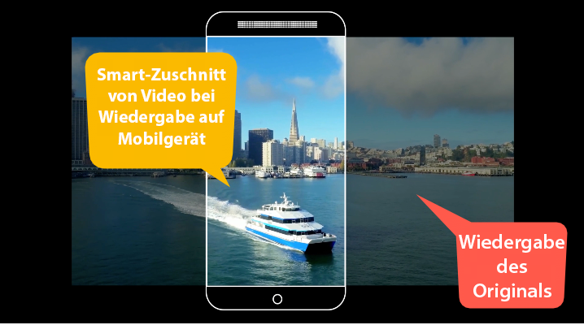
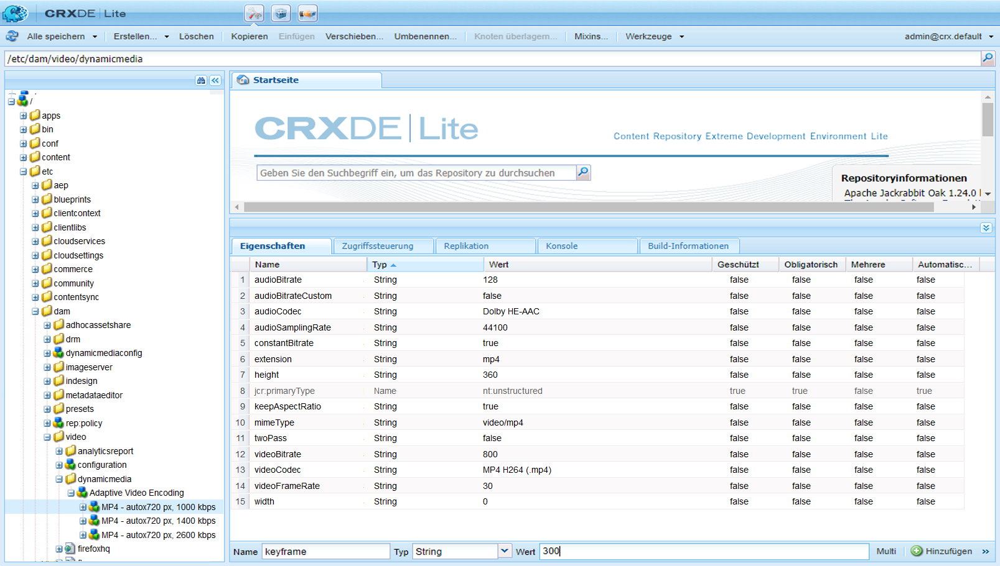
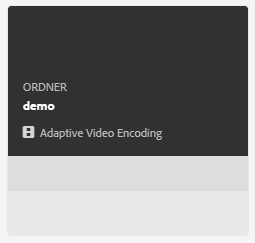
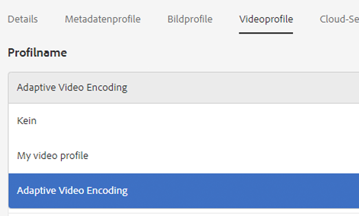
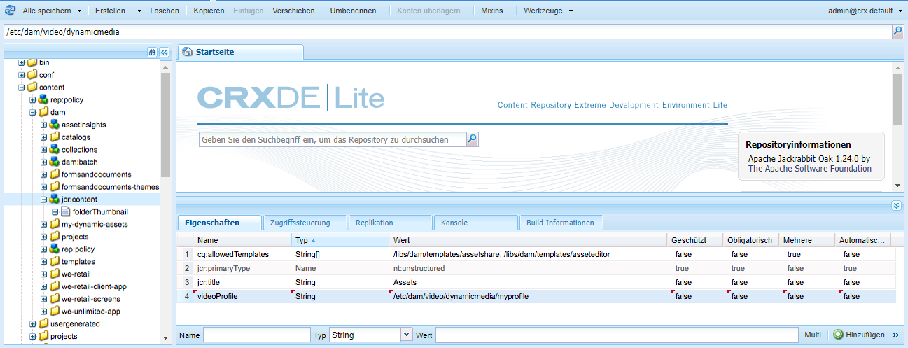

# Videoprofile{#video-profiles}

Dynamic Media enthält bereits das vordefinierte Profil „Adaptive Videoverschlüsselung“. Die Einstellungen in diesem vordefinierten Profil sind optimiert, um Ihren Kunden Ansichten in bestmöglicher Qualität bieten zu können. Beim Kodieren von Mastervideos mithilfe des Profils „Adaptive Videoverschlüsselung“ passt der Videoplayer während der Wiedergabe automatisch die Qualität des Videostreams auf Grundlage der Internetverbindungsgeschwindigkeit Ihrer Kunden an. Dies wird als adaptives Streaming bezeichnet.

Die folgenden weiteren Faktoren wirken sich auf die Qualität Ihrer Videos aus:

* **Auflösung des hochgeladenen Mastervideos**

   Wenn das MP4-Video mit einer niedrigeren Auflösung (z. B. 240p oder 360p) aufgezeichnet wurde, kann es nicht in hoher Auflösung gestreamt werden.

* **Videoplayer-Größe**

   Standardmäßig ist die &quot;Breite&quot;im Profil für die adaptive Videokodierung auf &quot;Auto&quot;eingestellt. Wie erwähnt wird je nach Größe des Players bei der Wiedergabe die bestmögliche Qualität verwendet.

See [Best Practices for Video Encoding](/help/assets/dynamic-media/video.md#best-practices-for-encoding-videos).

Informationen hierzu finden Sie auch im Thema über die [Best Practices für die Organisation Ihrer digitalen Assets zur Verwendung von Verarbeitungsprofilen](/help/assets/dynamic-media/best-practices-for-file-management.md).

>[!NOTE]
>
>Um die Metadaten eines Videos und die zugehörigen Videobildminiaturen zu generieren, muss das Video selbst den Kodierungsprozess in dynamischen Medien durchlaufen. In AEM, the **[!UICONTROL Dynamic Media Encode Video]** workflow encodes video if you have enabled dynamic media and set up video cloud services. Dieser Workflow erfasst Informationen zu Historie und Fehlern von Workflow-Prozessen. Siehe [Fortschritt von Videokodierung und YouTube-Veröffentlichung überwachen](/help/assets/dynamic-media/video.md#monitoring-video-encoding-and-youtube-publishing-progress). Wenn Sie Dynamic Media aktiviert und Video-Cloud-Services eingerichtet haben, wird der Workflow **[!UICONTROL Videokodierung Dynamic Media]** automatisch wirksam, wenn Sie ein Video hochladen. (Wenn Sie keine dynamischen Medien verwenden, gilt der Workflow **[!UICONTROL DAM-Update-Asset]**.)
>
>Metadaten sind nützlich, wenn Sie nach Assets suchen. Bei den Miniaturbildern handelt es sich um statische Videobilder, die während der Kodierung generiert werden. Sie werden vom AEM-System benötigt und in der Benutzeroberfläche verwendet, um Videos in der Ansicht Karten, Suchergebnisse und Asset-Liste visuell zu identifizieren. Sie können die generierten Miniaturansichten anzeigen, wenn Sie auf das Symbol &quot;Darstellungen&quot;(Palette eines Malers) eines kodierten Videos tippen.

Nach dem Erstellen des Videoprofils wenden Sie es auf einen Ordner oder mehrere Ordner an. See [Applying a video profile to folders.](#applying-a-video-profile-to-folders)

Informationen zur Definition von erweiterten Verarbeitungsparametern für andere Asset-Typen finden Sie unter [Konfigurieren der Asset-Verarbeitung](/help/assets/dynamic-media/config-dm.md#configuring-asset-processing).

See also [Profiles for Processing Metadata, Images, and Videos](/help/assets/dynamic-media/processing-profiles.md).

## Adaptive video encoding presets {#adaptive-video-encoding-presets}

In der folgenden Tabelle werden die empfohlenen Kodierungsprofile für das adaptive Video-Streaming auf Smartphones und Tablets sowie Desktop-Computern angegeben. Sie können diese Vorgaben für Videos mit jedem Seitenverhältnis verwenden.

<table>
 <tbody>
  <tr>
   <td><strong>Videoformat-Codec</strong></td>
   <td><strong>Videogröße – Breite (px) </strong></td>
   <td><strong>Videogröße – Höhe (px)</strong></td>
   <td><strong>Seitenverhältnis beibehalten?</strong></td>
   <td><strong>Video-Bitrate (kBit/s)</strong></td>
   <td><strong>Video-Framerate (fps)</strong></td>
   <td><strong>Audio-Codec</strong></td>
   <td><strong>Audiobitrate (Kbit/s)</strong></td>
  </tr>
  <tr>
   <td>
MP4 H.264 (mp4)
 </td>
   <td>auto</td>
   <td>360</td>
   <td>Ja</td>
   <td>730</td>
   <td>30</td>
   <td>Dolby HE-AAC</td>
   <td>128</td>
  </tr>
  <tr>
   <td>
MP4 H.264 (mp4)
 </td>
   <td>auto</td>
   <td>540</td>
   <td>Ja</td>
   <td>2000  </td>
   <td>30</td>
   <td>Dolby HE-AAC</td>
   <td>128</td>
  </tr>
  <tr>
   <td>
MP4 H.264 (mp4)
 </td>
   <td>auto</td>
   <td>720  </td>
   <td>Ja</td>
   <td>3000  </td>
   <td>30</td>
   <td>Dolby HE-AAC</td>
   <td>128</td>
  </tr>
 </tbody>
</table>

## Grundlagen zur Verwendung intelligenter Beschneidungen in Videoprofilen {#about-smart-crop-video}

Intelligente Beschneidung für Video - eine optionale Funktion, die in Videoprofilen verfügbar ist - ist ein Werkzeug, das die Leistung künstlicher Intelligenz in Adobe Sensei nutzt, um den Fokuspunkt in adaptiven Videos oder progressiven Videos, die Sie hochgeladen haben, unabhängig von der Größe automatisch zu erkennen und zu beschneiden.

Zu den unterstützten Videoformaten für das intelligente Beschneiden gehören MP4, MKV, MOV, AVI, FLV und WMV.

Die maximal unterstützte Videodateigröße für intelligente Beschneidung ist das folgende Kriterium:

* Dauer von fünf Minuten.
* 30 Bilder pro Sekunde (FPS).
* 300 MB Dateigröße.

Beachten Sie, dass Adobe Sensei derzeit auf 9000 Frames beschränkt ist. Das heißt, fünf Minuten bei 30 FPS. Wenn Ihr Video eine höhere FPS aufweist, verringert sich die maximal unterstützte Videodauer. Beispielsweise muss ein 60-FPS-Video zweieinhalb Minuten lang sein, damit es von Adobe Sensai und Smart Cards unterstützt werden kann.

>[!IMPORTANT]
>
>Damit die intelligente Beschneidung von Videos funktioniert, müssen Sie mindestens eine Videokodierungsvorgabe in Ihr Videoprofil einschließen.

Wenn Sie Smart-Zuschnitte für Videos verwenden möchten, erstellen Sie ein adaptives oder progressives Videokodierungsprofil. Verwenden Sie als Teil Ihres Profils das Werkzeug **[!UICONTROL für das intelligente Zuschnittverhältnis]** , um vordefinierte Seitenverhältnisse auszuwählen. Wenn Sie beispielsweise Ihre Videokodierungsvorgaben definieren, können Sie eine Definition für &quot;Mobiles Querformat&quot;mit einem Seitenverhältnis von 16 x 9 und eine Definition für &quot;Mobiles Hochformat&quot;mit einem Seitenverhältnis von 9 x 16 hinzufügen. Andere Seitenverhältnisse oder Zuschnittverhältnisse, aus denen Sie wählen können, sind 1x1, 4x3 und 4x5.

Beachten Sie, dass Sie mit dem Schieberegler rechts neben &quot; **[!UICONTROL Smart-Zuschnittverhältnis]** &quot;in der Benutzeroberfläche die Option &quot;Smart-Zuschneiden&quot;im Videoprofil aktivieren oder deaktivieren können.

Nachdem Sie Ihr Videoprofil erstellt und gespeichert haben, können Sie es auf die gewünschten Ordner anwenden.

Siehe [Anwenden von Videoprofilen auf bestimmte Ordner](#applying-video-profiles-to-specific-folders) oder [Globales](#applying-a-video-profile-globally)Anwenden eines Videoprofils.

Siehe auch [Intelligente Beschneidung für Bilder](image-profiles.md).

## Creating a video profile for adaptive streaming {#creating-a-video-encoding-profile-for-adaptive-streaming}

Dynamische Medien verfügen bereits über ein vordefiniertes adaptives Videokodierungsprofil - eine Gruppe von Video-Upload-Einstellungen für MP4 H.264-Format, das für eine optimale Darstellung optimiert wurde. Sie können dieses Profil beim Hochladen Ihrer Videos verwenden.

Wenn dieses vordefinierte Profil Ihre Anforderungen jedoch nicht erfüllt, können Sie ein eigenes Profil für die adaptive Videoverschlüsselung erstellen. When you use the setting **[!UICONTROL Encode for adaptive streaming]**–as a best practice–all encoding presets that you add to the profile are validated to ensure that all videos have the same aspect ratio. Darüber hinaus werden die kodierten Videos als Multi-Bitrate-Set für das Streaming behandelt.

Beim Erstellen des Videokodierungsprofils sehen Sie, dass die meisten Kodierungsoptionen mit empfohlenen Standardeinstellungen gefüllt sind, um Ihnen die Arbeit zu erleichtern. Wenn Sie allerdings einen anderen Wert als den empfohlenen Standard auswählen, müssen Sie bedenken, dass dies zu schlechter Videoqualität bei der Wiedergabe und zu anderen Leistungsproblemen führen kann.

Für alle MP4 H.264-Videokodierungsvorgaben im Profil werden also die folgenden Werte validiert, um sicherzustellen, dass diese über individuelle Kodierungsvorgaben hinweg identisch sind. Dadurch wird das adaptive Streaming ermöglicht:

* Videoformat-Codec – MP4 H.264 (.mp4)
* Audio-Codec
* Audiobitrate
* Seitenverhältnis beibehalten
* Kodierung mit zwei Durchgängen
* Konstante Bitrate
* H264-Profil
* Audio-Samplingrate

Wenn die Werte nicht identisch sind, können Sie das Profil durchaus im Istzustand erstellen. Denken Sie aber daran, dass das adaptive Streaming dann nicht möglich ist. Stattdessen wird das Einzel-Bitraten-Streaming durchgeführt. Es wird empfohlen, dass Sie die Kodierungseinstellungen so bearbeiten, dass dieselben Werte über individuelle Kodierungsvorgaben hinweg im Profil verwendet werden. (Beachten Sie, dass der Videoprofil-/Vorgabeneditor die Parität der adaptiven Videokodierungseinstellungen erzwingen soll, wenn die Einstellung „Für adaptives Streaming kodieren“ aktiviert ist.)

Siehe auch [Erstellen eines Videokodierungsprofils für progressives Streaming](#creating-a-video-encoding-profile-for-progressive-streaming).

Siehe auch [Best Practices für Videokodierung](/help/assets/dynamic-media/video.md#best-practices-for-encoding-videos).

Informationen zur Definition von erweiterten Verarbeitungsparametern für andere Asset-Typen finden Sie unter [Konfigurieren der Asset-Verarbeitung](/help/assets/dynamic-media/config-dm.md#configuring-asset-processing).

**So erstellen Sie ein Videoprofil für adaptives Streaming**:

1. Tap the AEM logo and navigate to **[!UICONTROL Tools]** > **[!UICONTROL Assets]** > **[!UICONTROL Video Profiles]**.
1. Click or tap **[!UICONTROL Create]** to add a new video profile.

1. Geben Sie einen Namen und eine Beschreibung für das Profil ein.
1. Tippen Sie auf der Seite &quot;Video-Kodierungsvorgaben erstellen/bearbeiten&quot;auf &quot;Video-Kodierungsvorgabe **[!UICONTROL hinzufügen&quot;]**.
1. Legen Sie auf der Registerkarte **[!UICONTROL Allgemein]** die Video- und Audiooptionen fest.
Tippen Sie auf das Informationssymbol neben den einzelnen Optionen, um zusätzliche Beschreibungen oder empfohlene Einstellungen auf Grundlage des ausgewählten Videoformat-Codecs anzuzeigen.
1. Stellen Sie unter der Überschrift „Videogröße“ sicher, dass **[!UICONTROL Seitenverhältnis beibehalten]** aktiviert ist.
1. Legen Sie die Videoframe-Auflösung in Pixeln fest. Verwenden Sie den Wert **[!UICONTROL Auto]**, um das Seitenverhältnis der Quelle anzupassen (Verhältnis von Breite zu Höhe).  Beispielsweise „Auto x 480“ oder „640 x Auto“.

1. Führen Sie einen der folgenden Schritte aus:

   * Geben Sie im Feld **[!UICONTROL Breite]** die Option **[!UICONTROL auto]** ein. Geben Sie im Feld **[!UICONTROL Höhe]** einen Wert in Pixeln ein.

   * Tippen Sie zum Visualisieren der Größe des Videos auf das Informationssymbol (i) rechts neben **[!UICONTROL Höhe]**, um die Seite mit der Größenberechnung zu öffnen. Legen Sie mit der **[!UICONTROL Größenberechnung]** die gewünschten Abmessungen des Videos fest (durch das blaue Feld dargestellt). Tippen Sie oben rechts auf **[!UICONTROL X]**, wenn Sie fertig sind.

1. (Optional) Tap the **[!UICONTROL Advanced]** tab and ensure the **[!UICONTROL Use Default Values]** check box is selected (recommended). Alternativ können Sie erweiterte Video- und Audioeinstellungen anpassen.
1. Tippen Sie oben rechts auf der Seite auf **[!UICONTROL Speichern]**, um die Vorgabe zu speichern.
1. Führen Sie einen der folgenden Schritte aus:
   * Wiederholen Sie Schritt 4 bis 10, um weitere Kodierungsvorgaben zu erstellen. (Das adaptive Videostreaming erfordert mehrere Videovorgaben.)
   * Fahren Sie mit dem nächsten Schritt fort.

1. (Optional) Gehen Sie wie folgt vor, um den Videos, auf die dieses Profil angewendet wird, eine intelligente Videobeschneidung hinzuzufügen:
   * Tippen Sie auf der Seite &quot;Videoprofil bearbeiten&quot;rechts neben der Überschrift &quot;Smart-Zuschneideverhältnis&quot;auf Neu **[!UICONTROL hinzufügen]**.
   * Geben Sie im Feld &quot;Name&quot;einen Namen für das Zuschnittverhältnis ein, damit Sie es leicht identifizieren können.
   * Wählen Sie aus der Dropdownliste **[!UICONTROL Beschneidungsgrad]** das Verhältnis aus, das Sie verwenden möchten.

1. Führen Sie einen der folgenden Schritte aus:

   * Fügen Sie bei Bedarf weitere Zuschnittanteile hinzu.
   * Fahren Sie mit dem nächsten Schritt fort.

1. Tippen Sie oben rechts auf der Seite erneut auf **[!UICONTROL Speichern]**, um das Profil zu speichern.

Sie können das Profil jetzt auf Ordner mit Videos anwenden. Siehe [Anwenden eines Videoprofils auf Ordner](#applying-a-video-profile-to-folders) oder [Globales](#applying-a-video-profile-globally)Anwenden eines Videoprofils.

## Creating a video profile for progressive streaming {#creating-a-video-encoding-profile-for-progressive-streaming}

Wenn Sie die Option **[!UICONTROL Für adaptives Streaming kodieren]** nicht verwenden, denken Sie daran, dass alle dem Profil hinzugefügten Kodierungsvorgaben als individuelle Videoausgabeformate für Einzel-Bitraten-Streaming oder progressive Videoübermittlung behandelt werden. Außerdem wird nicht sichergestellt, dass alle Videoausgabeformate dasselbe Seitenverhältnis aufweisen.

Die unterstützten Videoformat-Codecs sind H.264 (.mp4) und WebM.

Siehe auch [Erstellen eines Videokodierungsprofils für adaptives Streaming](#creating-a-video-encoding-profile-for-adaptive-streaming).

Siehe auch [Best Practices für Videokodierung](/help/assets/dynamic-media/video.md#best-practices-for-encoding-videos).

Informationen zur Definition von erweiterten Verarbeitungsparametern für andere Asset-Typen finden Sie unter [Konfigurieren der Asset-Verarbeitung](/help/assets/dynamic-media/config-dm.md#configuring-asset-processing).

**So erstellen Sie ein Videoprofil für progressives Streaming:**

1. Tap the AEM logo and navigate to **[!UICONTROL Tools]** > **[!UICONTROL Assets]** > **[!UICONTROL Video Profiles]**.
1. Tap **[!UICONTROL Create]** to add a new video profile.
1. Geben Sie einen Namen und eine Beschreibung für das Profil ein.
1. Tippen Sie auf der Seite &quot;Video-Kodierungsvorgaben erstellen/bearbeiten&quot;auf &quot;Video-Kodierungsvorgabe **[!UICONTROL hinzufügen&quot;]**.
1. Legen Sie auf der Registerkarte **[!UICONTROL Allgemein]** die Video- und Audiooptionen fest.
Tippen Sie auf das Informationssymbol neben den einzelnen Optionen, um zusätzliche Beschreibungen oder empfohlene Einstellungen auf Grundlage des ausgewählten Videoformat-Codecs anzuzeigen.
1. (Optional) Deaktivieren Sie unter der Überschrift „Videogröße“ das Kontrollkästchen **[!UICONTROL Seitenverhältnis beibehalten]**.
1. Gehen Sie folgendermaßen vor:
   * Geben Sie im Feld **[!UICONTROL Breite]** die Option **[!UICONTROL auto]** ein.
   * Geben Sie im Feld **[!UICONTROL Höhe]** einen Wert in Pixeln ein.
Um die Größe des Videos visualisieren zu können, tippen Sie auf das Symbol &quot;Höhe&quot;, um die Seite &quot; **[!UICONTROL Größenberechnung]** &quot;zu öffnen. Passen Sie die Größe des Videos auf der Seite **[!UICONTROL Größenberechnung]** wunschgemäß weiter an. Wenn Sie fertig sind, tippen Sie oben rechts im Dialogfeld auf **[!UICONTROL X]**.
1. (Optional) Führen Sie einen der folgenden Schritte aus:

   * Tap the **[!UICONTROL Advanced]** tab, and make sure the **[!UICONTROL Use Default Values]** check box is selected (recommended).

   * Clear the **[!UICONTROL Use Default Values]** check box and specify the video settings and audio settings you want.
Tippen Sie auf das Informationssymbol neben den einzelnen Optionen, um zusätzliche Beschreibungen oder empfohlene Einstellungen auf Grundlage des ausgewählten Videoformat-Codecs anzuzeigen.

1. Tippen Sie oben rechts auf der Seite auf **[!UICONTROL Speichern]**, um die Vorgabe zu speichern.
1. Führen Sie einen der folgenden Schritte aus:

   * Wiederholen Sie Schritt 4 bis 9, um weitere Kodierungsvorgaben zu erstellen.
   * Fahren Sie mit dem nächsten Schritt fort.

1. (Optional) Gehen Sie wie folgt vor, um den Videos, auf die dieses Profil angewendet wird, eine intelligente Videobeschneidung hinzuzufügen:

   * Tippen Sie auf der Seite &quot;Videoprofil bearbeiten&quot;rechts neben der Überschrift &quot;Smart-Zuschneideverhältnis&quot;auf Neu **[!UICONTROL hinzufügen]**.
   * Geben Sie im Feld &quot;Name&quot;einen Namen für das Zuschnittverhältnis ein, damit Sie es leicht identifizieren können.
   * Wählen Sie aus der Dropdownliste **[!UICONTROL Beschneidungsgrad]** das Verhältnis aus, das Sie verwenden möchten.

1. Führen Sie einen der folgenden Schritte aus:

   * Fügen Sie bei Bedarf weitere Zuschnittanteile hinzu.
   * Fahren Sie mit dem nächsten Schritt fort.

1. Tippen Sie oben rechts auf der Seite auf **[!UICONTROL Speichern]**, um das Profil zu speichern.

Sie können das Profil jetzt auf Ordner mit Videos anwenden. Siehe [Anwenden eines Videoprofils auf Ordner](#applying-a-video-profile-to-folders) oder [Globales](#applying-a-video-profile-globally)Anwenden eines Videoprofils.

## Verwenden von benutzerdefinierten Videokodierungsparametern {#using-custom-added-video-encoding-parameters}

Sie können vorhandene Videokodierungsprofile bearbeiten, um von erweiterten Parametern zur Videokodierung zu profitieren, die beim Erstellen oder Bearbeiten eines Videoprofils in AEM nicht in der Benutzeroberfläche vorhanden sind. Sie können Ihrem vorhandenen Profil einen oder mehrere erweiterte Parameter wie „minBitrate“ und „maxBitrate“ hinzufügen.

**So verwenden Sie benutzerdefinierte Videokodierungsparameter**:

1. Tap the AEM logo, then navigate to **[!UICONTROL Tools]** > **[!UICONTROL General]** > **[!UICONTROL CRXDE Lite]**.
1. Navigieren Sie auf der Seite „CRXDE Lite“ im linken Bereich des Explorers in das folgende Verzeichnis:

   `/conf/global/settings/dam/dm/presets/video/*name_of_video_encoding_profile_to_edit`

1. Geben Sie im Bereich rechts unten auf der Seite auf der Registerkarte „Eigenschaften“ **[!UICONTROL Namen]**, **[!UICONTROL Typ]** und **[!UICONTROL Wert]** des zu verwendenden Parameters an.

   Die folgenden erweiterten Parameter sind verfügbar:

<table>
 <tbody>
  <tr>
   <td><strong>Name</strong></td>
   <td><strong>Beschreibung</strong>  </td>
   <td><strong>Typ</strong>  </td>
   <td><strong>Wert</strong></td>
  </tr>
  <tr>
   <td><code>h264Level</code></td>
   <td>H.264-Level für die Kodierung. Normalerweise wird dieser Parameter basierend auf den Kodierungseinstellungen automatisch bestimmt.</td>
   <td><code>String</code></td>
   <td>
Stufe 10 * h264
 
Beispiel: 3.0 = 30, 1.3 = 13)
 
Kein Standardwert.
 </td>
  </tr>
  <tr>
   <td><code>keyframe</code></td>
   <td>Die Zielanzahl der Frames zwischen Keyframes. Berechnen Sie diesen Wert, um alle 2–10 Sekunden einen Keyframe zu generieren. Bei 30 Frames pro Sekunde sollte das Keyframe-Intervall zwischen 60 und 300 liegen.    Niedrigere Keyframe-Intervalle verbessern das Verhalten bei Stream-Suche und Stream-Wechsel für adaptive Videokodierungen und können auch die Qualität bei Videos mit viel Bewegung verbessern. Da die Keyframes die Größe einer Datei erhöhen, bewirkt ein niedrigeres Keyframe-Intervall in der Regel eine niedrigere Videogesamtqualität bei einer bestimmten Bitrate.</td>
   <td><code>String</code></td>
   <td>
Positive Zahl.
 
Der Standardwert ist 300.
 
Der empfohlene Wert für HLS (HTTP Live Streaming) ist 60–90.
 </td>
  </tr>
  <tr>
   <td><code>minBitrate</code></td>
   <td>
Minimale Bitrate, um Kodierungen mit variabler Bitrate in Kbit/s (Kilobit pro Sekunde) zu ermöglichen.
 
This parameter only applies when<strong> Use Constant Bitrate</strong> is deselected in the Advanced tab when you create or edit a video encoding profile.
 
Siehe auch <a href="/help/assets/dynamic-media/video.md#bitrate">Bitrate</a>.
 </td>
   <td><code>String</code></td>
   <td>
Positive Zahl in Kbit/s.
 
Kein Standardwert.
 </td>
  </tr>
  <tr>
   <td><code>maxBitrate</code></td>
   <td>
Maximale Bitrate, um Kodierungen mit variabler Bitrate in Kbit/s zu ermöglichen.
 
This parameter only applies when<strong> Use Constant Bitrate</strong> is deselected in the Advanced tab when you create or edit a video encoding profile.
 
Siehe auch <a href="/help/assets/dynamic-media/video.md#bitrate">Bitrate</a>.
 </td>
   <td><code>String</code></td>
   <td>
Positive Zahl in Kbit/s.
 
Kein Standardwert. Der empfohlene Wert entspricht jedoch bis zum Zweifachen der Kodierungsbitrate.
 </td>
  </tr>
  <tr>
   <td><code>audioBitrateCustom</code></td>
   <td>Legen Sie einen Wert fest, <code>true</code> um eine konstante Bitrate für den Audiostream zu erzwingen, sofern dieser vom Audio-Codec unterstützt wird.</td>
   <td><code>String</code></td>
   <td>
<code>true</code>/<code>false</code>
 
Der Standardwert ist <code>false</code>.
 
Recommended value for HLS (HTTP Live Streaming) is <code>false</code>.
 
 
 </td>
  </tr>
 </tbody>
</table>

1. Tippen Sie in der rechten unteren Ecke der Seite auf **[!UICONTROL Hinzufügen]**.
1. Führen Sie einen der folgenden Schritte aus:

   * Wiederholen Sie die Schritte 3 und 4, um Ihrem Videokodierungsprofil einen weiteren Parameter hinzuzufügen.
   * Tippen Sie in der oberen linken Ecke der Seite auf **[!UICONTROL Alle speichern]**.

1. Tippen Sie in der oberen linken Ecke der Seite „CRXDE Lite“ auf das Symbol **[!UICONTROL Zurück zur Startseite]**, um zu AEM zurückzukehren.

### Editing a video profile {#editing-a-video-encoding-profile}

Sie können jedes von Ihnen erstellte Videoprofil bearbeiten, um Video-Vorgaben in diesem Profil hinzuzufügen, zu bearbeiten oder zu löschen.

Die Bearbeitung des bereits in Dynamic Media integrierten Profils **[!UICONTROL Adaptive Videokodierung]** ist standardmäßig deaktiviert. Sie können das Profil einfach kopieren und dann unter einem neuen Namen speichern. Dann können Sie die gewünschten Vorgaben im kopierten Profil bearbeiten.

Siehe auch [Best Practices für Videokodierung](/help/assets/dynamic-media/video.md#best-practices-for-encoding-videos).

Informationen zur Definition von erweiterten Verarbeitungsparametern für andere Asset-Typen finden Sie unter [Konfigurieren der Asset-Verarbeitung](/help/assets/dynamic-media/config-dm.md#configuring-asset-processing).

**So bearbeiten Sie ein Videoprofil**:

1. Tap the AEM logo and navigate to **[!UICONTROL Tools]** > **[!UICONTROL Assets]** > **[!UICONTROL Video Profiles]**.
1. Aktivieren Sie auf der Seite „Videoprofile“ einen Videoprofilnamen.
1. Tippen Sie in der Symbolleiste auf **[!UICONTROL Bearbeiten]**.
1. Bearbeiten Sie den Namen und die Beschreibung nach Bedarf auf der Seite „Videokodierungsprofil“.
1. As a best practice, ensure that the **[!UICONTROL Encode for adaptive streaming]** check box is selected.
Tippen Sie auf das Informationssymbol, um eine Beschreibung des adaptiven Streaming zu erhalten. (Wenn Sie ein progressives Videoprofil nicht bearbeiten möchten, aktivieren Sie dieses Kontrollkästchen nicht.)
1. Unter der Überschrift „Videokodierungsvorgaben“ können Sie die Videokodierungsvorgaben des Profils hinzufügen, bearbeiten oder löschen.

   Tap the information icon next to each option on the **[!UICONTROL Basic]** and **[!UICONTROL Advanced]** tabs for additional descriptions or recommended settings based on the selected video format codec.

1. Tippen Sie in der rechten oberen Ecke der Seite auf **[!UICONTROL Speichern]**.

### Copying a video profile {#copying-a-video-encoding-profile}

1. Tap the AEM logo and navigate to **[!UICONTROL Tools]** > **[!UICONTROL Assets]** > **[!UICONTROL Video Profiles]**.
1. Aktivieren Sie auf der Seite „Videoprofile“ einen Videoprofilnamen.
1. On the toolbar, tap **[!UICONTROL Copy]**.
1. Geben Sie auf der Seite „Videokodierungsprofil“ einen neuen Namen für das Profil ein.
1. As a best practice, ensure that the **[!UICONTROL Encode for adaptive streaming]** check box is selected. Tippen Sie auf das Informationssymbol, um eine Beschreibung des adaptiven Streaming zu erhalten. (Wenn Sie ein progressives Videoprofil kopieren, aktivieren Sie dieses Kontrollkästchen nicht.)

   Wenn im Hybridmodus von Dynamic Video eine WebM-Videovoreinstellung Teil des Videoprofils ist, dann ist die Option **[!UICONTROL Für adaptives Streaming kodieren]** nicht möglich, da alle Vorgaben das MP4-Format aufweisen müssen.
1. Unter der Überschrift „Videokodierungsvorgaben“ können Sie die Videokodierungsvorgaben des Profils hinzufügen, bearbeiten oder löschen.

   Tippen Sie auf das Informationssymbol neben jeder Option auf den Registerkarten &quot;Einfach&quot;und &quot;Erweitert&quot;, um empfohlene Einstellungen und Beschreibungen anzuzeigen.

1. Tippen Sie in der rechten oberen Ecke der Seite auf **[!UICONTROL Speichern]**.

### Deleting a video profile {#deleting-a-video-encoding-profile}

1. Tap the AEM logo and navigate to **[!UICONTROL Tools]** > **[!UICONTROL Assets]** > **[!UICONTROL Video Profiles]**.
1. Aktivieren Sie auf der Seite „Videoprofile“ mindestens einen Videoprofilnamen.
1. Tippen Sie in der Symbolleiste auf **[!UICONTROL Löschen]**.
1. Tippen Sie auf **[!UICONTROL OK]**.

## Anwenden eines Videoprofils auf Ordner {#applying-a-video-profile-to-folders}

Wenn Sie ein Videoprofil einem Ordner zuweisen, erben automatisch alle Unterordner das Profil vom übergeordneten Ordner. Demzufolge können Sie einem Ordner nur ein Videoprofil zuweisen. Daher sollten Sie die Ordnerstruktur sorgfältig planen, in der Sie Assets hochladen, speichern, verwenden und archivieren.

Wenn Sie einem Ordner ein anderes Videoprofil zugewiesen haben, überschreibt das neue das vorherige Profil. Die zuvor vorhandenen Ordner-Assets verbleiben unverändert. Das neue Profil wird auf die Assets angewendet, die dem Ordner später hinzugefügt werden.

Ordner, denen ein Profil zugewiesen wurde, werden in der Benutzeroberfläche durch den Namen des Profils angegeben, der im Kartennamen angezeigt wird.

Sie können Videoprofile auf bestimmte Ordner oder global auf alle Assets anwenden.

Sie können Assets in einem Ordner neu verarbeiten, der bereits über ein vorhandenes Videoprofil verfügt, das Sie später geändert haben. Siehe [Neuverarbeitung von Assets in einem Ordner](/help/assets/dynamic-media/processing-profiles.md#reprocessing-assets).

### Applying a video profile to specific folders {#applying-video-profiles-to-specific-folders}

Die Anwendung von Videoprofilen auf Ordner erfolgt im Menü **[!UICONTROL Tools]** oder, wenn Sie sich im Ordner befinden, über **[!UICONTROL Eigenschaften]**. In diesem Abschnitt werden diese beiden Möglichkeiten beschrieben.

Ordner, denen bereits ein Profil zugewiesen wurde, sind dadurch gekennzeichnet, dass der Name des Profils direkt unterhalb des Ordnernamens angezeigt wird.

See also [Reprocessing assets in a folder after you have edited its processing profile](/help/assets/dynamic-media/processing-profiles.md#reprocessing-assets).

#### Applying a video profile to folders by way of the Profiles user interface {#applying-video-profiles-to-folders-by-way-of-the-profiles-user-interface}

1. Tap the AEM logo and navigate to **[!UICONTROL Tools]** > **[!UICONTROL Assets]** > **[!UICONTROL Video Profiles]**.
1. Wählen Sie ein Videoprofil aus, das Sie auf einen oder mehrere Ordner anwenden möchten.
1. Tap **[!UICONTROL Apply Profile to Folder(s)]** and select the folder or multiple folders you want use to receive the newly uploaded assets and tap **[!UICONTROL Apply]**. Folders that have a profile already assigned to it are indicated by the display of the profile&#39;s name directly below the folder name while in **[!UICONTROL Card View]**.
Sie können den Fortschritt eines Videoprofilverarbeitungsauftrags [überwachen](#monitoring-the-progress-of-an-encoding-job).

#### Anwenden eines Videoprofils auf Ordner aus Eigenschaften {#applying-video-profiles-to-folders-from-properties}

1. Tap or click the AEM logo and navigate to **[!UICONTROL Assets]** and then to the folder that you want to apply a video profile to.
1. On the folder, tap the check mark to select it and then tap **[!UICONTROL Properties]**.
1. Wählen Sie auf der Registerkarte **[!UICONTROL Videoprofile]** das Profil aus dem Dropdownmenü aus und klicken Sie auf **[!UICONTROL Speichern und schließen]**. Ordner, denen bereits ein Profil zugewiesen wurde, sind dadurch gekennzeichnet, dass der Name des Profils direkt unterhalb des Ordnernamens angezeigt wird.

   Sie können den Fortschritt eines Videoprofilverarbeitungsauftrags [überwachen](#monitoring-the-progress-of-an-encoding-job).

### Globales Anwenden eines Videoprofils {#applying-a-video-profile-globally}

Profile können nicht nur auf einzelne Ordner, sondern auch global angewendet werden. Dann wird allen Inhalten, die Sie in AEM-Assets in beliebigen Ordnern hochladen, das ausgewählte Profil zugeordnet.

Siehe auch [Neuverarbeitung von Assets in einem Ordner](/help/assets/dynamic-media/processing-profiles.md#reprocessing-assets).

**So wenden Sie ein Videoprofil global** an

* Navigate to CRXDE Lite to the following node: `/content/dam/jcr:content`. Fügen Sie die Eigenschaft hinzu `videoProfile:/libs/settings/dam/video/dynamicmedia/<name of video encoding profile>` und tippen Sie auf Alle **[!UICONTROL speichern]**.

   
* Sie können den Fortschritt eines Videoprofilverarbeitungsauftrags [überwachen](#monitoring-the-progress-of-an-encoding-job).

## Überwachen des Fortschritts eines Videoprofilverarbeitungsauftrags {#monitoring-the-progress-of-an-encoding-job}

Es wird eine Verarbeitungsanzeige (oder Fortschrittsleiste) angezeigt, mit der Sie den Fortschritt eines Videoprofilverarbeitungsauftrags visuell überwachen können.

You can also view the `error.log` file to monitor the progress of an encoding job, to see if encoding is finished, or to see any job errors. The `error.log` is found in the `logs` folder where your instance of AEM is installed.

## Entfernen eines Videoprofils aus Ordnern {#removing-a-video-profile-from-folders}

Wenn Sie ein Videoprofil aus einem Ordner entfernen, übernehmen alle Unterordner automatisch die Entfernung des Profils vom übergeordneten Ordner. Die Verarbeitung der Dateien, die in den Ordnern stattgefunden hat, verbleibt jedoch intakt.

You can remove a video profile from a folder from within the **[!UICONTROL Tools]** menu or if you are in the folder, from the **[!UICONTROL Folder Settings]**. This section describes how to remove video profiles from folders both ways.

### Removing a video profile from folders by way of the Profiles user interface {#removing-video-profiles-from-folders-by-way-of-the-profiles-user-interface}

1. Tap the AEM logo and navigate to **[!UICONTROL Tools]** > **[!UICONTROL Assets]** > **[!UICONTROL Video Profiles]**.
1. Wählen Sie das Videoprofil, das Sie aus einem oder mehreren Ordnern entfernen möchten.
1. Tap **[!UICONTROL Remove Profile from Folders]** and select the folder or multiple folders you want use to remove the profile from and tap **[!UICONTROL Remove]**.

   Sie können bestätigen, dass das Videoprofil nicht länger auf einen Ordner angewendet wird, da der Name in diesem Fall nicht mehr unter dem Ordner angezeigt wird.

### Removing a video profile from folders by way of Properties {#removing-video-profiles-from-folders-by-way-of-properties}

1. Tap or click the AEM logo and navigate to **[!UICONTROL Assets]** and then to the folder that you want to remove a video profile from.
1. On the folder, tap or click the check mark to select it and then tap or click **Properties]**.
1. Wählen Sie auf der Registerkarte **[!UICONTROL Videoprofile]** die Option **[!UICONTROL Keine]** aus dem Dropdownmenü aus und klicken Sie auf **[!UICONTROL Speichern und schließen]**. Ordner, denen bereits ein Profil zugewiesen wurde, sind dadurch gekennzeichnet, dass der Name des Profils direkt unterhalb des Ordnernamens angezeigt wird.

