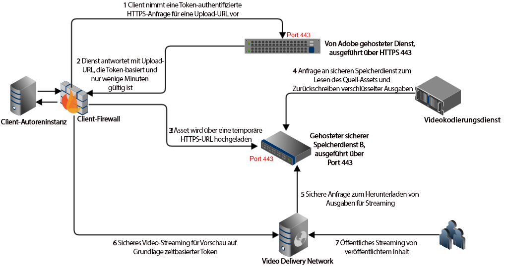
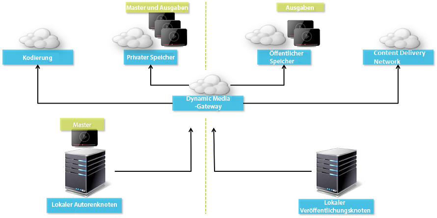

# Video {#video}

In diesem Abschnitt wird die Arbeit mit Videos in Dynamic Media beschrieben.

## Schnellstartanleitungen: Videos {#quick-start-videos}

Die folgende schrittweise Workflow-Beschreibung soll Ihnen den schnellen Einstieg in adaptive Videosets in Dynamic Media erleichtern. Nach jedem Schritt finden Sie Querverweise auf Themenüberschriften, unter denen Sie weitere Informationen erhalten.

>[!NOTE]
>
>Stellen Sie vor der Arbeit mit Videos in Dynamic Media sicher, dass der Adobe Experience Manager-Administrator Dynamic Media Cloud Services bereits aktiviert und konfiguriert hat.
>
>* Siehe [Konfiguration von Dynamic Media Cloud Services](/help/assets/dynamic-media/config-dm.md#configuring-dynamic-media-cloud-services) in „Konfigurieren von Dynamic Media“ und [Fehlerbehebung in Dynamic Media](/help/assets/dynamic-media/troubleshoot-dm.md).
>

1. **Laden Sie Videos in Dynamic Media** anhand der folgenden Schritte hoch:

   * Erstellen Sie Ihr eigenes Videokodierungsprofil. Sie können auch einfach das in Dynamic Media bereits integrierte vordefinierte Profil _Adaptive Videokodierung_ verwenden.

      * [Erstellen eines Videocodierungsprofils](/help/assets/dynamic-media/video-profiles.md#creating-a-video-encoding-profile-for-adaptive-streaming).
      * Die maximale Auflösung bei der Videoausgabekodierung beträgt 8.192 x 4.320 oder 4.320 x 8.192.
      * Erfahren Sie mehr über die [Best Practices für Videokodierung](#best-practices-for-encoding-videos).

   * Verknüpfen Sie das Videoverarbeitungsprofil mit den Ordnern, in die Sie die Primärvideos hochladen.

      * [Anwenden eines Videoprofils auf Ordner](/help/assets/dynamic-media/video-profiles.md#applying-a-video-profile-to-folders).
      * Weitere Informationen zum [Organisieren digitaler Assets](/help/assets/organize-assets.md)

   * Laden Sie die Primärvideos in die angegebenen Ordner hoch. Nach dem Hinzufügen werden die Videos gemäß dem diesem Ordner zugewiesenen Videoverarbeitungsprofil kodiert.

      * Dynamic Media unterstützt hauptsächlich Kurzvideos mit einer maximalen Länge von 30 Minuten und einer Mindestauflösung von mehr als 25 x 25.
      * Die maximal unterstützte Auflösung für das Eingangsvideo beträgt 16.384 x 16.384.
      * Sie können Videodateien mit bis zu 15 GB pro Datei hochladen.
      * [Videos hochladen](/help/assets/manage-video-assets.md#upload-and-preview-video-assets).
      * Weitere Informationen zu [Unterstützten Eingabedateiformaten](/help/assets/file-format-support.md).

   * [Fortschritt der Videokodierung](#monitoring-video-encoding-and-youtube-publishing-progress) in der Asset- oder Workflow-Ansicht überwachen.

1. **Verwalten Sie die Videos in Dynamic Media** anhand der folgenden Schritte:

   * Video-Assets organisieren und durchsuchen

      * [Organisieren von digitalen Assets](/help/assets/organize-assets.md)
      * [Nach Video-Assets suchen](/help/assets/search-assets.md#custompredicates) oder [Assets suchen](/help/assets/manage-digital-assets.md#search-assets)

   * Video-Assets vorab anzeigen und veröffentlichen

      * Zeigen Sie das Quellvideo und die kodierten Ausgabedarstellungen des Videos zusammen mit den zugehörigen Miniaturen an:
        [Vorschau von Videos anzeigen](/help/assets/manage-video-assets.md#upload-and-preview-video-assets) oder [Vorschau von Assets anzeigen](/help/assets/dynamic-media/previewing-assets.md)
        [Verwalten von Videoausgabedarstellungen](/help/assets/manage-digital-assets.md#managing-renditions)

      * [Verwalten von Viewer-Vorgaben](/help/assets/dynamic-media/managing-viewer-presets.md)
      * [Veröffentlichen von Assets](/help/assets/dynamic-media/publishing-dynamicmedia-assets.md)

   * Arbeiten mit Videometadaten

      * So bearbeiten Sie die Eigenschaften von Videos, beispielsweise Titel, Beschreibung, Tags und benutzerdefinierte Metadatenfelder:
        [Bearbeiten von Videoeigenschaften](/help/assets/manage-digital-assets.md#editing-properties)

      * [Verwalten von Metadaten für digitale Assets](/help/assets/manage-metadata.md)
      * [Metadatenschemata](/help/assets/metadata-schemas.md)

   * Videos prüfen, genehmigen und mit Anmerkungen versehen und die vollständige Versionskontrolle behalten

      * [Hinzufügen von Anmerkungen zu Videos](/help/assets/manage-video-assets.md#annotate-video-assets) oder [Hinzufügen von Anmerkungen zu Assets](/help/assets/manage-digital-assets.md#annotating)

      * [Erstellen einer Version](/help/assets/manage-digital-assets.md#asset-versioning)
      * [Starten eines Workflows für ein Asset](/help/assets/manage-digital-assets.md#starting-a-workflow-on-an-asset)

      * [Prüfen von Ordner-Assets](/help/assets/bulk-approval.md)
      * [Projekte](/help/sites-cloud/authoring/projects/overview.md)

1. **Veröffentlichen Sie die Videos in Dynamic Media** anhand der folgenden Schritte:

   * Wenn Sie Experience Manager als Web-Content-Management-System (WCM) verwenden, können Sie Ihren Web-Seiten direkt Videos hinzufügen.

      * [Hinzufügen von Videos zu Ihren Web-Seiten](/help/assets/dynamic-media/adding-dynamic-media-assets-to-pages.md).

   * Wenn Sie das WCM-System eines Drittanbieters verwenden, können Sie Videos mit Web-Seiten verknüpfen oder darin einbetten.

      * Integrieren von Videos mithilfe der URL:
        [Verknüpfen von URLs mit Ihrer Web-Anwendung](/help/assets/dynamic-media/linking-urls-to-yourwebapplication.md).

      * Integrieren von Videos mithilfe von Einbettungs-Code auf einer Website:
        [Einbetten des Video-Viewers auf einer Web-Seite](/help/assets/dynamic-media/embed-code.md).

   * [Erzeugen von Videoberichten](#viewing-video-reports).

   * [Hinzufügen mehrfacher Untertitel und Audiospuren zu einem Video](#about-msma).

## Arbeiten mit Video in Dynamic Media {#working-with-video-in-dynamic-media}

„Video“ in Dynamic Media ist eine durchgehende Lösung, die das Veröffentlichen von qualitativ hochwertigen adaptiven Videos für das Streaming auf mehreren Bildschirmen vereinfacht, einschließlich Desktop-PCs, Tablets und Mobilgeräten. Ein adaptives Video-Set umfasst Versionen desselben Videos, die mit unterschiedlichen Bit-Raten und Formaten codiert wurden, wie 400 kBit/s, 800 kBit/s und 1000 kBit/s. Der Desktop-Computer oder das Mobilgerät erkennt die verfügbare Bandbreite.

Auf einem iOS-Mobilgerät wird beispielsweise die Bandbreite erkannt, etwa 3G, 4G oder WLAN. Dann wird automatisch das richtig kodierte Video aus den verschiedenen Video-Bitraten im adaptiven Videoset ausgewählt. Das Video wird auf Desktops, Mobilgeräten oder Tablets gestreamt.

Außerdem wird die Videoqualität automatisch geändert, wenn sich die Netzwerkbedingungen am Desktop oder Mobilgerät ändern. Wenn eine Kundin oder ein Kunde an einem Desktop-Computer in den Vollbildmodus wechselt, verwendet das adaptive Video-Set eine höhere Auflösung und sorgt so für ein besseres Wiedergabeerlebnis. Adaptive Videosets bieten Ihnen das bestmögliche Anwendererlebnis für Kundinnen und Kunden, die ein Dynamic Media-Video auf unterschiedlichen Bildschirmen und Geräten wiedergeben.

Die Logik, mit der Video-Player bestimmen, welches kodierte Video wiedergegeben oder während der Wiedergabe ausgewählt werden soll, basiert auf dem folgenden Algorithmus:

1. Der Video-Player lädt das erste Videofragment auf Basis der Bitrate, die am nächsten an dem Wert liegt, der im Player selbst als „erste Bitrate“ festgelegt wurde.
1. Video-Player wechselt auf Basis von Änderungen an der Bandbreitengeschwindigkeit anhand der folgenden Kriterien:

   1. Der Player wählt den Stream mit der höchsten Bandbreite aus, die kleiner oder gleich der geschätzten Bandbreite ist.
   1. Der Player berücksichtigt nur 80 % der verfügbaren Bandbreite. Beim Wechseln nach oben ist der Player mit nur 70 % konservativer, um Überschätzungen zu vermeiden und sofort zurückzuwechseln.

Detaillierte technische Informationen zum Algorithmus finden Sie unter [https://android.googlesource.com/platform/frameworks/av/+/master/media/libstagefright/httplive/LiveSession.cpp](https://android.googlesource.com/platform/frameworks/av/+/master/media/libstagefright/httplive/LiveSession.cpp)

Beim Verwalten von einzelnen Videos und adaptiven Videosets wird Folgendes unterstützt:

* Hochladen von Videos aus zahlreichen unterstützten Video- und Audioformaten. Kodieren von Videos in das MP4 H.264-Format für die Wiedergabe auf mehreren Bildschirmen. Sie können vordefinierte adaptive Videovorgaben oder einzelne Videokodierungsvorgaben verwenden bzw. Ihre eigene Kodierung anpassen, um die Qualität und Größe der Videos zu steuern.

   * Wenn ein adaptives Videoset generiert wird, umfasst es MP4-Videos.
   * **Hinweis**: Primär-/Quellvideos werden einem adaptiven Videoset nicht hinzugefügt.

* Videountertitelung in allen HTML5-Video-Viewern
* Organisieren und Durchsuchen von Videos mit kompletter Metadatenunterstützung für die effiziente Verwaltung von Video-Assets
* Bereitstellen von adaptiven Videosets für das Internet und Desktop-PCs, Tablets und Mobilgeräte.

Das adaptive Video-Streaming wird auf verschiedenen iOS-Plattformen unterstützt. Siehe [Dynamic Media Viewers-Referenzhandbuch](https://experienceleague.adobe.com/de/docs/dynamic-media-developer-resources/library/viewers-aem-assets-dmc/video/c-html5-video-reference).

<!-- OUTDATED 2/28/22 BASED ON CQDOC-18692 Dynamic Media supports mobile video playback for MP4 H.264 video. You can find BlackBerry&reg; devices that support this video format at the following: [Supported video formats on BlackBerry&reg;](https://support.blackberry.com/kb/articleDetail?ArticleNumber=000005482).

OUTDATED 2/28/22 BASED ON CQDOC-18692 You can find Windows&reg; devices that support this video format at the following [Supported video formats on Windows&reg; Phone](https://docs.microsoft.com/en-us/windows/uwp/audio-video-camera/supported-codecs). -->

* Wiedergabe von Videos mit Video-Viewer-Vorgaben aus Dynamic Media, einschließlich der folgenden:

   * Einzelvideo-Viewer
   * Viewer für gemischte Medien, die sowohl Video- als auch Bildinhalte kombinieren

* Konfigurieren von Video-Playern entsprechend Ihren Branding-Anforderungen
* Integrieren von Videos in Websites, mobile Sites oder Mobile Apps mit einer einfachen URL oder mit Einbettungs-Code

<!-- GIVES a 404 See [Dynamic video playback](https://s7d9.scene7.com/s7/uvideo.jsp?asset=GeoRetail/Mop_AVS&config=GeoRetail/Universal_Video1&stageSize=640,480) sample. -->

Weitere Informationen über [Viewer für Experience Manager Assets und Dynamic Media Classic](https://experienceleague.adobe.com/de/docs/dynamic-media-developer-resources/library/viewers-aem-assets-dmc/c-html5-s7-aem-asset-viewers#viewers-aem-assets-dmc) und [Viewer nur für Experience Manager Assets](https://experienceleague.adobe.com/de/docs/dynamic-media-developer-resources/library/viewers-for-aem-assets-only/c-html5-aem-asset-viewers#viewers-for-aem-assets-only) finden Sie im [Dynamic Media Viewers-Referenzhandbuch](https://experienceleague.adobe.com/de/docs/dynamic-media-developer-resources).

## Best Practice: Verwenden des HTML5-Video-Viewers {#best-practice-using-the-html-video-viewer}

Die HTML5-Video-Viewer-Vorgaben aus „Dynamic Media“ stellen robuste Video-Player dar. Sie können diese verwenden, um zahlreiche häufig auftretende Probleme im Zusammenhang mit der Wiedergabe von HTML5-Videos und Mobilgeräten zu vermeiden. Beispiele dafür sind die fehlende Bereitstellung von adaptivem Bit-Rate-Streaming und die eingeschränkte Reichweite eines Desktop-Browsers.

Mithilfe standardmäßiger Webentwicklungs-Tools können Sie die Funktionen des Video-Players entwerfen. Sie können beispielsweise die Schaltflächen, die Steuerelemente und den benutzerdefinierten Poster-Hintergrund mit HTML5 und CSS entwerfen, um Ihre Kundinnen und Kunden mit einem angepassten Erscheinungsbild anzusprechen.

Bei der Wiedergabe wird die Videofähigkeit des Browsers automatisch erkannt. Das Video wird dann per HLS oder DASH, auch als adaptives Video-Streaming bekannt, bereitgestellt. Wenn diese Bereitstellungsmethoden nicht verfügbar sind, wird stattdessen der progressive HTML5-Download verwendet.

Sie können die Möglichkeit, die Wiedergabekomponenten mithilfe von HTML5 und CSS zu erstellen, in einen einzelnen Player integrieren. Je nach den verfügbaren Browser-Funktionen kann das Video eingebettete Wiedergabe bieten und adaptives und progressives Streaming verwenden. Dank dieser Funktion können Sie die Reichweite Ihrer Rich-Media-Inhalte sowohl auf Desktop- als auch auf Mobilgeräte ausdehnen und so ein optimiertes Videoerlebnis sicherstellen.

Siehe auch [Viewer nur für Experience Manager Assets](https://experienceleague.adobe.com/de/docs/dynamic-media-developer-resources/library/viewers-for-aem-assets-only/c-html5-aem-asset-viewers#viewers-for-aem-assets-only) im [Dynamic Media Viewers-Referenzhandbuch](https://experienceleague.adobe.com/de/docs/dynamic-media-developer-resources).


### Wiedergabe von Videos auf Desktops und mobilen Geräten mit dem HTML5-Video-Viewer {#playback-of-video-on-desktop-computers-and-mobile-devices-using-the-html-video-viewer}

Beim adaptiven Video-Streaming auf Desktop und Mobilgeräten basieren die für den Bit-Ratenwechsel verwendeten Videos auf allen MP4-Videos im adaptiven Videoset.

Die Videowiedergabe erfolgt entweder per HLS oder DASH oder als progressiver Video-Download. In früheren Versionen von Experience Manager, z. B. 6.0, 6.1 und 6.2, wurden Videos über HTTP gestreamt.

In Experience Manager 6.3 und neueren Versionen werden die Videos nun über HTTPS gestreamt (d. h. HLS oder DASH), da die DM-Gateway-Service-URL ebenfalls immer HTTPS verwendet. Beachten Sie, dass es bei diesem Standardverhalten keine Auswirkung auf die Kundinnen und Kunden gibt. Video-Streaming erfolgt immer über HTTPS, sofern der Browser dies unterstützt. Siehe folgende Tabelle.

Daher:

* Wenn Sie eine HTTPS-Website mit HTTPS-Video-Streaming haben, ist das Streaming gut.
* Wenn Sie eine HTTP-Website mit HTTPS-Video-Streaming haben, ist das Streaming gut und es gibt keine Probleme mit gemischten Inhalten im Webbrowser.

DASH ist der internationale Standard und HLS ist ein Apple-Standard. Beide werden für adaptives Video-Streaming verwendet. Außerdem passen beide Technologien die Wiedergabe automatisch an die Netzwerkbandbreite an. Darüber hinaus können Kundinnen und Kunden einen beliebigen Punkt im Video „suchen“, ohne auf den Download des restlichen Videos zu warten.

Progressives Video wird bereitgestellt, indem das Video lokal auf ein Desktop-System oder Mobilgerät einer Benutzerin bzw. eines Benutzers heruntergeladen und gespeichert wird.

Die folgende Tabelle beschreibt das Gerät, den Browser und die Wiedergabemethode für Videos auf Desktop-Computern und Mobilgeräten mit [Dynamic Media HTML5 Video Viewer](https://experienceleague.adobe.com/de/docs/dynamic-media-developer-resources/library/viewers-for-aem-assets-only/interactive-video/c-html5-aem-int-video#interactive-video).

<table>
 <tbody>
  <tr>
   <td><strong>Gerät</strong></td>
   <td><strong>Browser</strong></td>
   <td><strong>Videowiedergabemodus</strong></td>
  </tr>
  <tr>
   <td>Desktop</td>
   <td>Internet Explorer 9 und 10</td>
   <td>Progressiver Download.</td>
  </tr>
  <tr>
   <td>Desktop</td>
   <td>Internet Explorer 11+</td>
   <td>Unter Windows® 8 und Windows® 10 – HTTPS wird bei Anfragen von DASH oder HLS erzwungen. Bekannte Einschränkung: HTTP kann in dieser Kombination von Browser/Betriebssystem nicht mit DASH oder HLS verwendet werden<br /> <br /> Unter Windows® 7 – progressiver Download. Verwendet Standardlogik für das HTTP- vs. HTTPS-Protokoll.</td>
  </tr>
  <tr>
   <td>Desktop</td>
   <td>Firefox 23-44</td>
   <td>Progressiver Download.</td>
  </tr>
  <tr>
   <td>Desktop</td>
   <td>Firefox 45 oder höher</td>
   <td>HLS- oder DASH*-Streaming mit adaptiver Bit-Rate</td>
  </tr>
  <tr>
   <td>Desktop</td>
   <td>Chrome</td>
   <td>HLS- oder DASH*-Streaming mit adaptiver Bit-Rate</td>
  </tr>
  <tr>
   <td>Desktop</td>
   <td>Safari (Mac)</td>
   <td>HLS-Streaming mit adaptiver Bit-Rate</td>
  </tr>
  <tr>
   <td>Mobilgerät</td>
   <td>Chrome (Android™ 6 oder früher)</td>
   <td>Progressiver Download.</td>
  </tr>
  <tr>
   <td>Mobilgerät</td>
   <td>Chrome (Android 7™ oder neuer)</td>
   <td>HLS- oder DASH*-Streaming mit adaptiver Bit-Rate/td&gt;
  </tr>
  <tr>
   <td>Mobilgerät</td>
   <td>Android™ (Standard-Browser)</td>
   <td>Progressiver Download.</td>
  </tr>
  <tr>
   <td>Mobilgerät</td>
   <td>Safari (iOS)</td>
   <td>HLS-Streaming mit adaptiver Bit-Rate</td>
  </tr>
  <tr>
   <td>Mobilgerät</td>
   <td>Chrome (iOS)</td>
   <td>HLS-Streaming mit adaptiver Bit-Rate</td>
  </tr>
 </tbody>
</table>

<!--  THIS LINE WAS REMOVED FROM THE TABLE ABOVE ON FEB 28, 2022 BASED ON CQDOC 18692 -RSB <tr>
   <td>Mobile</td>
   <td>BlackBerry&reg;</td>
   <td>HLS or DASH</td>
  </tr>
 -->

## Architektur der Dynamic Media-Videolösung {#architecture-of-dynamic-media-video-solution}

Die folgende Grafik zeigt den allgemeinen Bearbeitungs-Workflow für Videos, die über DMGateway (im Hybridmodus von Dynamic Media) hochgeladen und kodiert sowie für die öffentliche Anzeige verfügbar gemacht werden.



## Hybride Veröffentlichungsarchitektur für Videos {#hybrid-publishing-architecture-for-videos}



## Best Practices für die Kodierung von Videos {#best-practices-for-encoding-videos}

Der Workflow für die **Dynamic Media-Videokodierung** kodiert Videos, wenn Dynamic Media aktiviert und Video-Cloud-Services eingerichtet sind. Dieser Workflow erfasst den Verlauf der Workflow-Prozesse und Informationen zu Fehlern. Wenn Sie Dynamic Media aktiviert und Video-Cloud-Services eingerichtet haben, wird der Workflow für die **[!UICONTROL Videokodierung mit Dynamic Media]** automatisch beim Hochladen eines Videos wirksam. (Wenn Sie Dynamic Media nicht verwenden, wird der Workflow **[!UICONTROL DAM Update Asset]** wirksam.)

Beachten Sie die folgenden Best Practice-Tipps für die Kodierung von Quellvideodateien.

<!-- For advice about video encoding, see the following:

* [Streaming 101: The Basics — Codecs, Bandwidth, Data Rate, and Resolution](https://www.adobe.com/go/learn_s7_streaming101_en).
* [Video Encoding Basics](https://www.adobe.com/go/learn_s7_encoding_de). -->

### Quellvideodateien {#source-video-files}

Verwenden Sie zum Kodieren einer Videodatei eine Quellvideodatei mit der höchstmöglichen Qualität. Verwenden Sie keine zuvor kodierten Videodateien, da diese Dateien bereits komprimiert wurden und die weitere Kodierung zu mangelhafter Videoqualität führen würde.

* Dynamic Media unterstützt hauptsächlich Kurzvideos mit einer maximalen Länge von 30 Minuten und einer Mindestauflösung von mehr als 25 x 25.
* Sie können Videodateien mit einer Größe von bis zu 15 GB als Primärquelle hochladen.

Die folgende Tabelle beschreibt die empfohlenen Werte für Größe, Seitenverhältnis und Mindest-Bitrate, die Quellvideos vor der Kodierung aufweisen sollten:

| Größe | Seitenverhältnis | Mindest-Bitrate |
|--- |--- |--- |
| 1024 x 768 | 4:3 | 4500 kBit/s für die meisten Videos |
| 1280 x 720 | 16:9 | 3000–6000 kBit/s, je nachdem, wie viel Bewegung im Video vorkommt |
| 1920 x 1080 | 16:9 | 6000–8000 kBit/s, je nachdem, wie viel Bewegung im Video vorkommt |

### Abrufen der Metadaten von Dateien {#obtaining-a-file-s-metadata}

Sie können die Metadaten einer Datei abrufen, indem Sie diese mit einem Bearbeitungs-Tool für Videos anzeigen oder eine Anwendung verwenden, die zum Abrufen von Metadaten entwickelt wurde. Im Folgenden wird die Nutzung von MediaInfo, einem Drittanbieterprogramm, zum Abrufen der Metadaten einer Videodatei beschrieben:

1. Gehen Sie zu [MediaInfo Download](https://mediaarea.net/de/MediaInfo/Download).
1. Wählen Sie das Installationsprogramm für die GUI-Version aus, laden Sie es herunter und befolgen Sie die Installationsanweisungen.
1. Klicken Sie nach der Installation mit der rechten Maustaste auf die Videodatei (nur Windows®) und wählen Sie MediaInfo oder öffnen Sie MediaInfo und ziehen Sie die gewünschte Videodatei in die Anwendung. Alle mit der Videodatei verknüpften Metadaten werden angezeigt, einschließlich Breite, Höhe und fps.

### Seitenverhältnis {#aspect-ratio}

Wenn Sie eine Videokodierungsvorgabe für die Primärvideodatei auswählen oder erstellen, achten Sie darauf, dass die Vorgabe dasselbe Seitenverhältnis aufweist. Dieser Ansatz stellt die Konsistenz mit der Primärvideodatei sicher. Das Seitenverhältnis ist das Verhältnis zwischen Breite und Höhe des Videos.

Um das Seitenverhältnis einer Videodatei zu ermitteln, rufen Sie die Metadaten der Datei ab. Notieren Sie die Breite und Höhe der Datei (siehe „Abrufen der Metadaten von Dateien“ oben). Ermitteln Sie das Seitenverhältnis dann anhand der folgenden Formel:

Breite/Höhe = Seitenverhältnis

Anhand der folgenden Tabelle können Sie die Formelergebnisse in gängige Seitenverhältnisoptionen umwandeln:

| Formelergebnis | Seitenverhältnis |
|--- |--- |
| 1,33 | 4:3 |
| 0,75 | 3:4 |
| 1,78 | 16:9 |
| 0,56 | 9:16 |

Beispiel: Ein Video mit einer Breite von 1440 und einer Höhe von 1080 hat ein Seitenverhältnis von 1440:1080 bzw. 1,33. In diesem Fall wählen Sie eine Videokodierungsvorgabe mit einem Seitenverhältnis von 4:3 aus, um die Videodatei zu kodieren.

### Bitrate {#bitrate}

Die Bitrate ist die kodierte Menge an Daten für eine Videowiedergabe von einer einzigen Sekunde Dauer. Die Bitrate wird in Kilobit pro Sekunde (kBit/s) gemessen.

>[!NOTE]
>
>Da alle Codecs verlustreiche Komprimierung verwenden, ist die Bitrate der wichtigste Faktor für die Videoqualität. Bei verlustreicher Komprimierung wird die Datenqualität schlechter, je mehr Sie eine Videodatei komprimieren. Wenn alle anderen Merkmale wie Auflösung, Framerate und Codec gleich sind, gilt daher, dass eine niedrigere Bitrate zu einer niedrigeren Qualität der komprimierten Datei führt.

Sie können zwischen zwei Arten der Bitraten-Kodierung wählen:

* **[!UICONTROL Konstante Bitraten-Kodierung]** (CBR): Während der CBR-Kodierung bleibt die Bitrate, d. h. die Anzahl der Bits pro Sekunde, während des Kodierungsvorgangs gleich. Die CBR-Kodierung speichert die festgelegte Datenrate für das gesamte Video in Ihrer Einstellung. Die CBR-Kodierung optimiert nicht die Qualität von Mediendateien, spart jedoch Speicherplatz.
Verwenden Sie CBR, wenn Ihr Video im gesamten Video ein ähnliches Bewegungsniveau enthält. CBR wird hauptsächlich zum Streaming von Videoinhalten verwendet. Siehe auch [Verwenden von benutzerdefinierten Videokodierungsparametern](/help/assets/dynamic-media/video-profiles.md#using-custom-added-video-encoding-parameters).

* **[!UICONTROL Variable Bit-Raten-Codierung]** (VBR): Bei der VBR-Codierung wird die Datenrate auf der Grundlage der vom Kompressor benötigten Daten nach unten und an die von Ihnen festgelegte Obergrenze angepasst. Diese Funktionalität bedeutet, dass die Bitrate der Mediendatei während eines VBR-Kodierungsprozesses je nach der benötigten Bitrate der Mediendateien dynamisch erhöht oder reduziert wird.
VBR benötigt mehr Zeit für die Kodierung, liefert jedoch die besten Ergebnisse. Die Qualität der Mediendatei ist besonders gut. VBR wird meist für die progressive HTTP-Übermittlung von Videoinhalten verwendet.

Verwendung von VBR vs. CRB
Wenn es um die Auswahl von VBR oder CBR geht, wird für Ihre Mediendateien meist VBR empfohlen. VBR bietet Dateien mit besserer Qualität bei wettbewerbsfähigen Bitraten. Verwenden Sie bei VBR auf jeden Fall eine Kodierung mit zwei Durchgängen und stellen Sie die maximale Bitrate so ein, dass sie 1,5-mal größer ist als die Ziel-Video-Bitrate.

Berücksichtigen Sie bei Auswahl einer Videokodierungsvorgabe unbedingt die Verbindungsgeschwindigkeit der Zielgruppenbenutzenden. Wählen Sie eine Vorgabe mit einer Datenrate, die 80 % dieser Geschwindigkeit beträgt. Beispiel: Wenn die Verbindungsgeschwindigkeit der Zielperson 1000 kBit/s beträgt, hat die optimale Vorgabe eine Videodatenrate von 800 kBit/s.

Diese Tabelle enthält die Datenraten von typischen Verbindungsgeschwindigkeiten.

| Geschwindigkeit (kBit/s) | Verbindungstyp |
|--- |--- |
| 256 | Einwahlverbindung |
| 800 | Typische Mobilverbindung Für diese Verbindung eignet sich eine Datenrate von 400 bis maximal 800 für 3G-Verbindungen. |
| 2.000 | Typische Breitband-Desktop-Verbindung. Für diese Verbindung eignet sich eine Datenrate zwischen 800 und 2.000 kBit/s, wobei die meisten Ziele im Durchschnitt zwischen 1.200 und 1.500 kBit/s aufweisen. |
| 5.000 | Typische Hochbreitband-Desktopverbindung Die Kodierung in diesem oberen Bereich wird nicht empfohlen, da die Videobereitstellung in dieser Geschwindigkeit für die meisten Benutzer nicht verfügbar ist. |

### Auflösung {#resolution}

Die **Auflösung** beschreibt die Höhe und Breite einer Videodatei in Pixeln. Die meisten Quellvideos werden mit hoher Auflösung gespeichert (z. B. 1920 x 1080). Zu Streaming-Zwecken werden Quellvideos in eine niedrigere Auflösung komprimiert (640 x 480 oder weniger).

Auflösung und Datenrate stellen zwei eng miteinander verknüpfte Faktoren der Videoqualität dar. Um dieselbe Videoqualität beizubehalten gilt: Je höher die Anzahl Pixel in einer Videodatei (also je höher die Auflösung), desto höher muss auch die Datenrate sein. Betrachten Sie z. B. die Anzahl Pixel pro Frame in einer Videodatei mit der Auflösung 320 x 240 und einer Datei mit der Auflösung 640 x 480:

| Auflösung | Pixel pro Frame |
|--- |--- |
| 320 x 240 | 76.800 |
| 640 x 480 | 307.200 |

Die Datei mit 640 x 480 enthält viermal so viele Pixel pro Frame. Um dieselbe Datenrate für diese beiden Beispielauflösungen zu erreichen, wenden Sie eine vierfache Komprimierung auf die Datei mit 640 x 480 an, was zu einer schlechteren Videoqualität führen kann. Daher führt eine Videodatenrate von 250 kBit/s zu einer hohen Anzeigequalität bei einer Auflösung von 320 x 240, aber nicht bei einer Auflösung von 640 x 480.

Im Allgemeinen gilt: Je höher die verwendete Datenrate, desto besser sieht das Video aus, und je höher die verwendete Auflösung, desto höher ist die benötigte Datenrate, um die Anzeigequalität aufrechtzuerhalten (im Vergleich zu niedrigeren Auflösungen).

Da Auflösung und Datenrate miteinander verknüpft sind, haben Sie beim Kodieren von Videos zwei Optionen:

* Wählen Sie eine Datenrate und kodieren Sie dann mit der höchsten Auflösung, die mit der gewählten Datenrate eine gute Qualität erzeugt.
* Wählen Sie eine Auflösung und kodieren Sie dann mit der erforderlichen Datenrate, um hohe Videoqualität mit der gewählten Auflösung zu erreichen.

Orientieren Sie sich beim Auswählen (oder Erstellen) einer Videokodierungsvorgabe für die Primär-Videodatei an der folgenden Tabelle, um die richtige Auflösung auszuwählen.

| Auflösung | Höhe (Pixel) | Bildschirmgröße |
|--- |--- |--- |
| 240p | 240 | Winziger Bildschirm |
| 300p | 300 | Kleiner Bildschirm, wie er bei Mobilgeräten typisch ist |
| 360p | 360 | Kleiner Bildschirm |
| 480p | 480 | Mittlerer Bildschirm |
| 720p | 720 | Großer Bildschirm |
| 1.080p | 1.080 | Großer Bildschirm mit High-Definition |

Die maximal unterstützte Auflösung für das Eingangsvideo beträgt 16.384 x 16.384. Die maximale Auflösung bei der Videoausgabekodierung beträgt 8.192 x 4.320 oder 4.320 x 8.192.

### Frames pro Sekunde (fps) {#fps-frames-per-second}

In den USA und Japan werden die meisten Videos mit 29,97 fps aufgenommen, in Europa mit 25 fps. Ein Film wird mit 24 fps aufgenommen.

Wählen Sie eine Videokodierungsvorgabe aus, die der fps-Rate der jeweiligen Primär-Videodatei entspricht. Wenn das Primärvideo beispielsweise 25 fps aufweist, wählen Sie eine Kodierungsvorgabe mit 25 fps. Standardmäßig wird bei jeder benutzerdefinierten Codierung der fps-Wert der Primär-Videodatei verwendet. Daher müssen Sie die fps-Einstellung nicht explizit angeben, wenn Sie eine Videokodierungsvorgabe erstellen.

### Abmessungen bei der Videokodierung {#video-encoding-dimensions}

Wählen Sie für optimale Ergebnisse Kodierungsabmessungen so aus, dass das Quellvideo ein ganzes Mehrfaches aller kodierten Videos ist.

Um dieses Verhältnis zu berechnen, teilen Sie die Quellbreite durch die kodierte Breite, um das Breitenverhältnis zu ermitteln. Dann teilen Sie die Quellhöhe durch die kodierte Höhe, um das Höhenverhältnis zu ermitteln.

Wenn das resultierende Verhältnis eine Ganzzahl ist, hat das Video die optimale Skalierung. Wenn das errechnete Verhältnis keine Ganzzahl ist, wird die Videoqualität beeinträchtigt, da übrig gebliebene Pixelartefakte auf der Anzeige verbleiben. Dieser Effekt ist am auffälligsten, wenn das Video Text enthält.

Im folgenden Beispiel hat das Quellvideo Abmessungen von 1920 x 1080. Die drei kodierten Videos in der folgenden Tabelle geben die optimalen Kodierungseinstellungen an.

| Videotyp | Breite x Höhe | Breitenverhältnis | Höhenverhältnis |
|--- |--- |--- |--- |
| Quelle | 1920 x 1080 | 1 | 1 |
| Kodiert | 960 x 540 | 2 | 2 |
| Kodiert | 640 x 360 | 3 | 3 |
| Kodiert | 480 x 270 | 4 | 4 |

### Kodiertes Videodateiformat {#encoded-video-file-format}

In Dynamic Media wird empfohlen, MP4 H.264-Videokodierungsvorgaben zu verwenden. Da MP4-Dateien den H.264-Video-Codec nutzen, erhalten Sie damit hohe Videoqualität, aber auch eine komprimierte Dateigröße.

## Anzeigen von Videoberichten {#viewing-video-reports}

>[!NOTE]
>
>Videoberichte sind nur verfügbar, wenn Sie Dynamic Media im Hybridmodus ausführen.

Videoberichte enthalten mehrere aggregierte Metriken für einen angegebenen Zeitaum, anhand derer Sie überwachen können, ob *veröffentlichte* individuelle und aggregierte Videos die erwartete Leistung zeigen. Die folgenden Top-Metrikdaten werden für alle veröffentlichten Videos auf der gesamten Website aggregiert:

* Videostarts
* Abschlussrate
* Durchschnittliche Zeit im Video
* Gesamtzeit im Video
* Videos pro Besuch

Eine Tabelle mit allen *veröffentlichten* Videos wird ebenfalls angezeigt, damit Sie die am häufigsten angezeigten Videos auf der Website basierend auf insgesamt gestarteten Videos verfolgen können.

Wenn Sie in der Liste einen Videonamen auswählen, wird der Bericht zur Zielgruppentreue (Abfallrate) in Form eines Liniendiagramms angezeigt. Das Diagramm enthält die Anzahl der Ansichten für jeden einzelnen Moment während der Videowiedergabe. Wenn Sie das Video wiedergeben, bewegt sich die vertikale Leiste synchron mit der Zeitanzeige im Player. Abfälle in den Liniendiagrammdaten geben an, wo die Zielgruppe das Video aus Desinteresse abbricht.

Wenn das Video außerhalb von Adobe Experience Manager für Dynamic Media kodiert wurde, sind das Diagramm zur Zielgruppentreue (Abbruch) und die Daten zur Wiedergabe in Prozent in der Tabelle nicht verfügbar.

>[!NOTE]
>
>Nachverfolgungs- und Berichtsdaten basieren ausschließlich auf der Nutzung des Video-Players von Dynamic Media und den zugehörigen Video-Player-Vorgaben. Daher können Sie keine Videos nachverfolgen und in Berichte aufnehmen, die mit anderen Video-Playern wiedergegeben werden.

Wenn Sie die Funktion „Videoberichte“ zum ersten Mal aufrufen, enthält der Bericht standardmäßig Videodaten für den Zeitraum vom ersten Tag des aktuellen Monats bis zum aktuellen Datum. Sie können den standardmäßigen Datumsbereich aber außer Kraft setzen, indem Sie Ihren eigenen Datumsbereich angeben. Beim nächsten Mal wird in „Videoberichte“ der angegebene Datumsbereich verwendet.

Damit Videoberichte ordnungsgemäß funktionieren, wird automatisch eine Report Suite-ID erstellt, wenn Dynamic Media Cloud Services konfiguriert wurde. Gleichzeitig wird die Report Suite-ID an den Veröffentlichungs-Server übergeben, damit sie für die Funktion „URL kopieren“ bei der Asset-Vorschau verfügbar ist. Dafür muss der Veröffentlichungs-Server aber bereits eingerichtet sein. Wenn der Veröffentlichungs-Server nicht eingerichtet ist, können Sie dennoch veröffentlichen, um den Videobericht anzuzeigen. Sie müssen jedoch zur Konfiguration von Dynamic Media Cloud zurückkehren und auf **[!UICONTROL OK]** klicken.

**So zeigen Sie Videoberichte an:**

1. Wählen Sie in Experience Manager in der oberen linken Ecke das Experience Manager-Logo aus. Klicken Sie in der linken Leiste auf  > **[!UICONTROL Assets]** > **[!UICONTROL Videoberichte]**.
1. Führen Sie auf der Seite „Videoberichte“ eine der folgenden Aktionen aus:

   * Klicken Sie in der Nähe der oberen rechten Ecke auf das Symbol **[!UICONTROL Videobericht aktualisieren]**.
Sie können ihn nur dann aktualisieren, wenn das Enddatum des Berichts der aktuelle Tag ist. Dadurch wird sichergestellt, dass Sie das Video-Tracking sehen können, das seit der letzten Ausführung des Berichts vorgenommen wurde.

   * Klicken Sie in der Nähe der oberen rechten Ecke auf das Symbol **[!UICONTROL Datumsauswahl]**.
Geben Sie den Anfang und das Ende des Datumsbereichs an, für den Sie Videodaten anzeigen möchten, und klicken Sie dann auf **[!UICONTROL Bericht ausführen]**.

   Im Gruppenfeld „Top-Metriken“ werden verschiedene aggregierte Messungen für alle *veröffentlichten* Videos auf der Site angegeben.

1. Wählen Sie in der Tabelle mit den am häufigsten veröffentlichten Videos einen Videonamen aus, um das Video abzuspielen und den Bericht zur Zielgruppentreue (Abfallrate) des Videos anzuzeigen.

<!-- OBSOLETE CONTENT OBSOLETE CONTENT - SDK ONLY AVAILABLE INTERNALLY NOW 
### Viewing video reports based on a video viewer that you created using the Dynamic Media HTML5 Viewer SDK {#viewing-video-reports-based-on-a-video-viewer-that-you-created-using-the-scene-hmtl-viewer-sdk}

If you are using an out-of-box video viewer provided by Dynamic Media, or if you created a custom viewer preset based off of an out-of-box video viewer, then no additional steps are required to view video reports. However, if you have created your own video viewer based off the Dynamic Media HTML5 Viewer SDK, then use the following steps to ensure the your video viewer is sending tracking events to Dynamic Media Video Reports.

Use the Dynamic Media Viewers Reference and the Dynamic Media HTML5 Viewers SDK to create your own video viewers.

See [Dynamic Media Viewers Reference Guide](https://experienceleague.adobe.com/docs/dynamic-media-developer-resources/library/home.html?lang=de).

Download the Scene7 HTML Viewer SDK from Adobe Developer Connection.

See [Adobe Developer Connection](https://help.adobe.com/en_US/scene7/using/WSef8d5860223939e2-43dedf7012b792fc1d5-8000.html).

**To view Video Reports based on a video viewer that you created using the Dynamic Media HTML5 Viewer SDK:**

1. Navigate to any published video asset.
1. Near the upper-left corner of the asset's page, from the drop-down list, select **[!UICONTROL Viewers]**.
1. Select any video viewer preset and copy the embed code.
1. In the embed code, find the line with the following:

   `videoViewer.setParam("config2", "<value>");`

   The `config2` parameter enables tracking in HTML5 Viewers. It is also a company-specific preset that contains the configuration information for Video Reporting, and for customer-specific Adobe Analytics configurations.

   The correct value for the config2 parameter is found in both the **[!UICONTROL Embed Code]** and in the copy **[!UICONTROL URL]** function. In the URL from the copy **[!UICONTROL URL]** command, the parameter to look for is `&config2=<value>` . The value is almost always `companypreset`, but in some instances it can also be `companypreset-1`, `companypreset-2`, and so forth.

1. In your custom video viewer code, add AppMeasurementBridge .jsp to the viewer page by doing the following:

    * First, determine if you need the `&preset` parameter.
      If the `config2` parameter is `companypreset`, you do *not *need `&preset=parameter`.
      If `config2` is anything else, set the preset parameter the same as the `config2` parameter. For example, if `config2=companypreset-2`, add `&param2=companypreset-2` to the AppMeasurmentBridge.jsp URL.

    * Then, add the AppMeasurementBridge.jsp script:
      `<script language="javascript" type="text/javascript" src="https://s7d1.scene7.com/s7viewers/AppMeasurementBridge.jsp?company=robindallas&preset=companypreset-2"></script>`

1. Create the TrackingManager component by doing the following:

    * After calling `s7sdk.Utils.init();` create a TrackingManager instance to track events by adding the following:
      `var trackingManager = new s7sdk.TrackingManager();`

    * Connect components to TrackingManager by doing the following:
      In the `s7sdk.Event.SDK_READY` event handler, attach the component you want to track to the TrackingManager.
      For example, if the component is `videoPlayer`, add
      `trackingManager.attach(videoPlayer);`
      to attach the component to the trackingManager. To track multiple viewers on a page, use multiple tracking mangaer components.

    * Create the AppMeasurementBridge object by adding the following:

      ```
      var appMeasurementBridge = new AppMeasurementBridge(); appMeasurementBridge.setVideoPlayer(videoPlayer);
      ```

    * Add the tracking function by adding the following:

      ```
      trackingManager.setCallback(appMeasurementBridge.track,
       appMeasurementBridge);
      ```

   The appMeasurementBridge object has a built-in track function. OBSOLETE However, you can provide your own to support multiple tracking systems or other functionality.

   For more information, see *Using the TrackingManager Component* in the *Scene7 HTML5 Viewer SDK User Guide* available for download from [Adobe Developer Connection](https://help.adobe.com/en_US/scene7/using/WSef8d5860223939e2-43dedf7012b792fc1d5-8000.html).
 -->

## Unterstützung für mehrfache Untertitel und Audiospuren bei Videos in Dynamic Media{#about-msma}

Mit der Funktion für mehrfache Untertitel und Audiospuren in Dynamic Media können Sie mühelos mehrfache Audiospuren hinzufügen. Sie können auch mehrere Untertiteldateien hinzufügen, indem Sie entweder Ihre eigenen `.vtt`-Dateien (Video Text Track) oder KI-generierte Untertiteldateien verwenden. KI-generierte Untertitel in Dynamic Media sollen die Videozugänglichkeit und -interaktion durch die automatische Generierung genauer und synchronisierter Untertitel verbessern. Diese Technologie verwendet fortschrittliche KI-Algorithmen, um gesprochene Inhalte in Text umzuwandeln, der dann als Untertitel im Video angezeigt wird. Zu den wichtigsten Merkmalen dieser Technologie zählen:

* **Automatische Transkription:** Das KI-System transkribiert gesprochene Wörter in Echtzeit in Text und stellt dabei sicher, dass Untertitel schnell und präzise generiert werden.
* **Mehrsprachige Unterstützung:** Untertitel können automatisch in mehr als 60 Sprachen bereitgestellt werden, wodurch das Erreichen einer globalen Zielgruppe erleichtert wird.
* **Verbesserte Barrierefreiheit:** Durch die Bereitstellung von Untertiteln werden Videos für Betrachtende, die taub oder schwerhörig sind, oder für Menschen, die Videos lieber ohne Ton sehen möchten, leichter zugänglich.
* **Verbesserte Interaktion:** Untertitel können dazu beitragen, die Aufmerksamkeit der Betrachtenden zu erhalten und das Verständnis zu verbessern, insbesondere in lauten Umgebungen oder wenn sich die Muttersprache der Betrachtenden von der Sprache des Videos unterscheidet.

Durch diese Funktionen werden KI-gestützte Untertitel zu einem wertvollen Tool für Erstellerinnen und Ersteller von Inhalten, die die Barrierefreiheit und Interaktion ihrer Videoinhalte verbessern möchten.


Für das Hinzufügen von mehrfachen Untertiteln und Audiospuren zu Ihrem primären Video sind unter anderem die folgenden Anwendungsfälle zu berücksichtigen:

| Typ | Anwendungsfall |
|--- |--- |
| **Untertitel** | Unterstützung mehrerer Sprachen |
|  | Beschreibender Text für Barrierefreiheit |
| **Audiospuren** | Unterstützung mehrerer Sprachen |
|  | Kommentarspuren |
|  | Beschreibendes Audio |

Alle [in Dynamic Media unterstützten Videoformate](/help/assets/file-format-support.md) und alle Dynamic Media-Video-Viewer – mit Ausnahme des Dynamic Media-Viewers *Video_360* – werden für die Verwendung mit mehrfachen Untertiteln und Audiospuren unterstützt.

### Hinzufügen mehrfacher Untertitel und Audiospuren zu Ihrem Video {#add-msma}

Bevor Sie Ihrem Video mehrfache Untertitel und Audiospuren hinzufügen, stellen Sie sicher, dass Folgendes bereits erfolgt ist:

* Dynamic Media ist in einer AEM-Umgebung eingerichtet.
* Ein [Dynamic Media-Videoprofil wurde auf den Ordner angewendet, in dem Ihre Videos aufgenommen werden](/help/assets/dynamic-media/video-profiles.md#applying-a-video-profile-to-folders).

Hinzugefügte Untertitel werden in den Formaten WebVTT und Adobe VTT unterstützt. Außerdem werden hinzugefügte Audiospurdateien mit dem MP3-Format unterstützt.

>[!IMPORTANT]
>
>Videos, die *vor* Aktivierung der Unterstützung für mehrfache Untertitel/Audiospuren in Ihrem Dynamic Media-Konto hochgeladen wurden, [müssen erneut verarbeitet werden](/help/assets/dynamic-media/about-image-video-profiles.md#reprocessing-assets). Der Schritt der erneuten Verarbeitung stellt sicher, dass diese Videos die Funktionen für mehrfache Untertitel/Audiospuren und KI-generierte Untertitel verwenden können. Die Video-URLs funktionieren nach der erneuten Verarbeitung weiterhin, und die Videos werden wie gewohnt wiedergegeben.

**So fügen Sie mehrfache Untertitel und Audiospuren zu Ihrem Video hinzu:**

1. [Laden Sie das primäre Video in einen Ordner hoch](/help/assets/manage-video-assets.md#upload-and-preview-video-assets), dem bereits ein Videoprofil zugewiesen ist.
1. Navigieren Sie zum hochgeladenen Video-Asset, zu dem Sie mehrfache Untertitel und Audiospuren hinzufügen möchten.
1. Wählen Sie im Asset-Auswahlmodus entweder über  (Kartenansicht) oder  (Listenansicht) das Video-Asset aus.
1. Klicken Sie in der Symbolleiste auf  Eigenschaften.
   *Ausgewähltes Video-Asset in der Kartenansicht*
1. Wählen Sie auf der Seite „Eigenschaften“ des Videos die Registerkarte **[!UICONTROL Beschriftungen und Audiospuren]** aus.

   >[!TIP]
   >Wenn Sie die Registerkarte **[!UICONTROL Beschriftungen und Audiospuren]** nicht sehen, gibt es zwei mögliche Gründe:
   >
   >* Dem Ordner, in dem sich das ausgewählte Video befindet, wurde kein Videoprofil zugewiesen. In diesem Fall siehe [Anwenden eines Videoprofils auf den Ordner](/help/assets/dynamic-media/video-profiles.md#applying-video-profiles-to-specific-folders)
   >* Oder Dynamic Media muss das Video erneut verarbeiten. In diesem Fall siehe [Erneutes Verarbeiten von Dynamic Media-Assets in einem Ordner](/help/assets/dynamic-media/about-image-video-profiles.md#reprocessing-assets).
   >
   >Wenn Sie eine der oben genannten Aufgaben abgeschlossen haben, kehren Sie zu diesen Schritten zurück.

   
   *Registerkarte „Untertitel und Audiospuren“ auf der Seite „Eigenschaften“ des Videos.*

1. Gehen Sie wie folgt vor, um einem Video eine oder mehrere Audiospuren hinzuzufügen:
   1. Wählen Sie **[!UICONTROL Audiospuren hochladen]** aus.
   1. Navigieren Sie zu .mp3-Dateien, wählen Sie eine oder mehrere .mp3-Dateien aus und öffnen Sie sie.
   1. Für Audiospuren, die in der Popup-Liste **[!UICONTROL Audio oder Beschriftung auswählen]** im Medien-Player angezeigt werden, müssen Sie für jede Audiospurdatei die erforderlichen Details hinzufügen. Dadurch wird sichergestellt, dass alle Audiospuren richtig aufgelistet werden und zugänglich sind. Klicken Sie auf  rechts neben dem Namen einer Audiospurdatei. Geben Sie im Dialogfeld **Audiospur bearbeiten** die folgenden erforderlichen Details ein:

      | Audiospur-Metadaten | Beschreibung |
      |--- |--- |
      | Dateiname | Der Standarddateiname wird aus dem Originaldateinamen abgeleitet. Der Dateiname kann nur beim Hochladen geändert werden und später nicht mehr. Die Zeichenanforderungen für Dateinamen entsprechen denen für AEM Assets.<br>Für zusätzliche Audiospurdateien oder Untertiteldateien darf nicht derselbe Name verwendet werden. |
      | Sprache | Wählen Sie die richtige Sprache der Audiospur aus. |
      | Typ | Wählen Sie den Typ der verwendeten Audiospur aus.<br>**Original**: Die Audiospur, die ursprünglich an das Video angehängt war und als `[Original]` im Label mit der standardmäßig ausgewählten Sprache `English` dargestellt wird. Zwar können **[!UICONTROL Titel]** und **[!UICONTROL Sprache]** im Dialogfeld **[!UICONTROL Audiospur bearbeiten]** geändert werden, doch werden standardmäßig die ursprünglichen Werte verwendet, wenn das primäre Video erneut verarbeitet wird.<br>**Standard**: Eine zusätzliche Audiospur für eine andere Sprache als die Originalsprache.<br>**Audiobeschreibung** – Eine Audiospur, die auch eine beschreibende Darstellung nichtverbaler Aktionen und Gesten im Video enthält, wodurch die Inhalte für Personen mit Sehbehinderungen leichter zugänglich gemacht werden. |
      | Label | Der Text, der im Medien-Player in der Popup-Liste **[!UICONTROL Audio oder Untertitel auswählen]** als Name der Audiospur angezeigt wird. Die Bezeichnung ist das, was eine Kundin oder ein Kunde sieht, und entspricht einer Audiospur. Zum Beispiel: `English [Original]`. Für die Bezeichnung der an ein Video angehängten Audiospur ist standardmäßig `[Original]` festgelegt. |

      Sie können diese Audiospur-Metadaten bei Bedarf später ändern oder bearbeiten. Bei Veröffentlichung des Videos werden diese Details in öffentlichen URLs in veröffentlichten Videos angezeigt.

   1. Klicken Sie in der oberen rechten Ecke der Seite in der Dropdown-Liste **[!UICONTROL Speichern und schließen]** auf die Option **[!UICONTROL Speichern]**.
   1. Führen Sie einen der folgenden Schritte aus:
      * Wiederholen Sie diesen Vorgang für jede Audiospur-Datei, die Sie hochladen.
      * Fahren Sie mit dem nächsten Schritt fort, um einem Video Untertitel hinzuzufügen.

1. Um einem Video eine oder mehrere Untertiteldateien hinzuzufügen, wählen Sie aus, welcher der folgenden Anwendungsfälle am besten zu Ihrem Szenario passt:

   |  | Anwendungsfall | Zu verwendende Option zur Untertitelung |
   | --- | --- | --- |
   | **Option 1** | Ich habe meine eigenen bereits vorhandenen Untertiteldateien in den Sprachen, die ich verwenden möchte.<br>Siehe **Option 1** unten. | **[!UICONTROL Dateien hochladen]** |
   | **Option 2** | Ich möchte, dass die KI meine Untertiteldateien in mehreren Sprachen generiert.<br>Siehe **Option 2** unten. | **[!UICONTROL Audiospuren konvertieren]** |
   | **Option 3** | Text in einer Untertiteldatei (`.vtt`) muss korrigiert und neu hochgeladen werden, um die alte `.vtt`-Datei zu ersetzen. Anschließend soll die KI die korrigierte Datei übersetzen.<br>Siehe **Option 3** unten. | **[!UICONTROL Untertitel übersetzen]** |

   
   *Das Dropdown-Menü „Untertitel erstellen“ bietet drei Optionen: „Dateien hochladen“, „Audiospuren konvertieren“ und „Untertitel übersetzen“.*

+++**Option 1:** *Ich habe meine eigenen bereits vorhandenen Untertiteldateien in den Sprachen, die ich verwenden möchte* (Option **[!UICONTROL Dateien hochladen]**).

   1. Klicken Sie oben rechts auf der Seite auf **[!UICONTROL Untertitel erstellen]** > **[!UICONTROL Dateien hochladen]**.
   1. Navigieren Sie zu einer oder mehreren Ihrer bereits vorhandenen `.vtt`-Dateien, wählen Sie sie aus und öffnen Sie sie.
   1. Damit Untertitel im Medien-Player angezeigt werden, *müssen* Sie die erforderlichen Details zu *jeder* Untertiteldatei hinzufügen, die Sie hochladen. Klicken Sie auf  rechts neben dem Namen einer Untertiteldatei. Geben Sie im Dialogfeld **Untertitel bearbeiten** die folgenden erforderlichen Details zur Datei ein:

      | Untertitelmetadaten | Beschreibung |
      |--- |--- |
      | Dateiname | Der Standarddateiname wird aus dem Originaldateinamen abgeleitet. Der Dateiname kann nur beim Hochladen geändert werden und später nicht mehr. Die Zeichenanforderungen für Dateinamen entsprechen denen für AEM Assets.<br>Derselbe Dateiname kann nicht für zusätzliche Untertiteldateien und Audiospurdateien verwendet werden. |
      | Sprache | Wählen Sie die Sprache des Untertitels aus. Nach der Verarbeitung einer Untertiteldatei ist dieses Sprachfeld nicht mehr bearbeitbar (abgeblendet). |
      | Typ | Wählen Sie den Typ des verwendeten Untertitels aus.<br>**Untertitel**: Der im Video angezeigte Untertiteltext, der den Dialog übersetzt oder transkribiert.<br>**Beschriftung**: Der Untertiteltext umfasst neben der Übersetzung oder Transkription des Dialogs auch Hintergrundgeräusche, Sprecherunterscheidung und andere relevante Informationen, wodurch die Zugänglichkeit für gehörlose oder schwerhörige Personen verbessert wird. |
      | Label | Der Text, der für den Namen des Untertitels in der Popup-Liste **[!UICONTROL Audio oder Beschriftung auswählen]** im Medien-Player angezeigt wird. Das Label ist das, was eine Kundin oder ein Kunde sieht, und entspricht einer Untertitel- oder Beschriftungsspur. Zum Beispiel: `English (CC)`. |

      Sie können Metadaten von Untertiteln später bei Bedarf ändern oder bearbeiten. Bei Veröffentlichung des Videos werden diese Details in öffentlichen URLs in veröffentlichten Videos angezeigt.

   1. Klicken Sie in der oberen rechten Ecke der Seite in der Dropdown-Liste **[!UICONTROL Speichern und schließen]** auf die Option **[!UICONTROL Speichern]**. Die Dateien werden hochgeladen und die Metadatenverarbeitung beginnt, wie in der Spalte **Status** der Benutzeroberfläche angezeigt.

      >[!NOTE]
      >
      >Basierend auf den Cache-Einstellungen Ihrer Instanz kann die Verarbeitung der Metadaten mehrere Minuten dauern, bis sie in der Vorschau und in veröffentlichten URLs erscheinen.

   1. Wenn Sie im vorherigen Schritt **[!UICONTROL Speichern und schließen]** statt **[!UICONTROL Speichern]** ausgewählt haben, können Sie dennoch den Verarbeitungsstatus der hochgeladenen Dateien anzeigen. Siehe [Anzeigen des Lebenszyklusstatus hochgeladener Untertitel- und Audiospurdateien](#lifecycle-status-video).
   1. Fahren Sie mit Schritt 8 fort.

+++

+++**Option 2:** *Ich möchte, dass die KI meine Untertiteldateien in mehreren Sprachen generiert.* (Option **[!UICONTROL Audiospuren konvertieren]**).

   1. Klicken Sie in der oberen rechten Ecke der Seite auf **[!UICONTROL Untertitel erstellen]** > **[!UICONTROL Dateien hochladen]**.

      
      *Das Dialogfeld „Audiospuren konvertieren“ verwendet KI, um Untertiteldateien in mehreren Sprachen zu generieren.*

   1. Legen Sie im Dialogfeld **Audiospuren konvertieren** die folgenden Optionen fest:

      | Option | Beschreibung |
      |--- |--- |
      | Audiospur zum Konvertieren | Klicken Sie auf  und wählen Sie dann die hochgeladene Audiospurdatei aus, aus der mithilfe von KI Untertitel erstellt werden sollen. |
      | Ausgabesprachen | Klicken Sie auf  und wählen Sie dann mindestens eine Sprache aus, in der die Untertiteldatei angezeigt werden soll.<br>Um eine ausgewählte Sprache zu entfernen, klicken Sie auf .<br>Während der Videowiedergabe wird die Liste der Sprachen im Medien-Player in der Reihenfolge angezeigt, in der Sie sie hier auswählen. |

   1. Klicken Sie auf **[!UICONTROL Fertig]**.
   1. Klicken Sie in der oberen rechten Ecke der Seite in der Dropdown-Liste **[!UICONTROL Speichern und schließen]** auf die Option **[!UICONTROL Speichern]**.
   1. Klicken Sie erneut auf die Registerkarte **[!UICONTROL Untertitel und Audiospuren]**. Eine oder mehrere Untertiteldateien werden erstellt und die Verarbeitung beginnt, wie in der Spalte **Status** der Schnittstelle zu sehen ist. Siehe auch [Anzeigen des Lebenszyklusstatus hochgeladener Untertitel- und Audiospurdateien](#lifecycle-status-video).

      >[!NOTE]
      >
      >Basierend auf den Cache-Einstellungen Ihrer Instanz kann die Verarbeitung der Metadaten mehrere Minuten dauern, bis sie in der Vorschau und in veröffentlichten URLs erscheinen.

   1. (Optional) Klicken Sie auf  rechts neben dem Namen einer Untertiteldatei. Im Dialogfeld **Untertitel bearbeiten** können Sie die folgenden Details zur Datei bearbeiten:

      | Untertitelmetadaten | Beschreibung |
      | --- | --- |
      | Typ | Wählen Sie den Typ des verwendeten Untertitels aus.<br>**Untertitel**: Der im Video angezeigte Untertiteltext, der den Dialog übersetzt oder transkribiert.<br>**Beschriftung**: Der Untertiteltext enthält Hintergrundgeräusche und Sprachunterschiede. Er enthält auch andere relevante Informationen sowie die Übersetzung oder Transkription des Dialogs. Dieser Ansatz erleichtert den Zugang zu Inhalten für Personen, die taub oder schwerhörig sind. |
      | Label | Der Text, der für den Namen des Untertitels in der Popup-Liste **[!UICONTROL Audio oder Beschriftung auswählen]** im Medien-Player angezeigt wird. Das Label ist das, was eine Kundin oder ein Kunde sieht, und entspricht einer Untertitel- oder Beschriftungsspur. Zum Beispiel: `English (CC)`. |

      Sie können Metadaten von bestimmten Untertiteln später bei Bedarf ändern oder bearbeiten. Bei Veröffentlichung des Videos werden diese Metadatendetails in öffentlichen URLs in veröffentlichten Videos angezeigt.
   1. Fahren Sie mit Schritt 8 fort.

+++

+++**Option 3:** *Text in einer Untertiteldatei (`.vtt`) muss korrigiert und neu hochgeladen werden, um die alte `.vtt`-Datei zu ersetzen. Anschließend soll die KI die korrigierte Datei übersetzen* (Option **[!UICONTROL Untertitel übersetzen]**).

   1. Klicken Sie auf **[!UICONTROL Untertitel erstellen]** > **[!UICONTROL Untertitel übersetzen]**. Diese Option ist verfügbar, wenn eine oder mehrere Untertiteldateien bereits hinzugefügt und verarbeitet wurden.

      
      *Im Dialogfeld „Untertitel übersetzen“ können Sie eine vorhandene Untertiteldatei verwenden, damit die KI neue Untertiteldateien in mehreren Sprachen generiert.*

   1. Legen Sie im Dialogfeld **Untertitel übersetzen** die folgenden Optionen fest:

      | Option | Beschreibung |
      |--- |--- |
      | Zu übersetzender Untertitel | Klicken Sie auf  und wählen Sie dann die Untertiteldatei aus, aus der mithilfe von KI Untertitel erstellt werden sollen. |
      | Ausgabesprachen | Klicken Sie auf  und wählen Sie dann mindestens eine Sprache aus, in der die Untertiteldatei angezeigt werden soll.<br>Um eine ausgewählte Sprache zu entfernen, klicken Sie auf .<br>Während der Videowiedergabe wird die Liste der Sprachen im Medien-Player in der Reihenfolge angezeigt, in der Sie sie hier auswählen. |

   1. Klicken Sie auf **[!UICONTROL Fertig]**.
   1. Klicken Sie in der oberen rechten Ecke der Seite in der Dropdown-Liste **[!UICONTROL Speichern und schließen]** auf die Option **[!UICONTROL Speichern]**.
   1. Klicken Sie erneut auf die Registerkarte **[!UICONTROL Untertitel und Audiospuren]**. Eine oder mehrere Untertiteldateien werden erstellt und die Verarbeitung beginnt, wie in der Spalte **Status** der Schnittstelle zu sehen ist. Siehe auch [Anzeigen des Lebenszyklusstatus hochgeladener Untertitel- und Audiospurdateien](#lifecycle-status-video).

      >[!NOTE]
      >
      >Basierend auf den Cache-Einstellungen Ihrer Instanz kann die Verarbeitung der Metadaten mehrere Minuten dauern, bis sie in der Vorschau und in veröffentlichten URLs erscheinen.

   1. (Optional) Klicken Sie auf  rechts neben dem Namen einer Untertiteldatei. Im Dialogfeld **Untertitel bearbeiten** können Sie die folgenden Details zur Datei bearbeiten:

      | Untertitelmetadaten | Beschreibung |
      | --- | --- |
      | Typ | Wählen Sie den Typ des verwendeten Untertitels aus.<br>**Untertitel**: Der im Video angezeigte Untertiteltext, der den Dialog übersetzt oder transkribiert.<br>**Beschriftung** Der Untertiteltext enthält außerdem Hintergrundgeräusche und Sprachunterschiede. Er enthält auch andere relevante Informationen sowie die Übersetzung oder Transkription des Dialogs. Dieser Ansatz erleichtert den Zugang zu Inhalten für Personen, die taub oder schwerhörig sind. |
      | Label | Der Text, der für den Namen des Untertitels in der Popup-Liste **[!UICONTROL Audio oder Beschriftung auswählen]** im Medien-Player angezeigt wird. Das Label ist das, was eine Kundin oder ein Kunde sieht, und entspricht einer Untertitel- oder Beschriftungsspur. Zum Beispiel: `English (CC)`. |

      Sie können Metadaten von bestimmten Untertiteln später bei Bedarf ändern oder bearbeiten. Bei Veröffentlichung des Videos werden diese Metadatendetails in öffentlichen URLs in veröffentlichten Videos angezeigt.

   1. Fahren Sie mit Schritt 8 fort.

+++

1. (Optional) Zeigen Sie vor der Veröffentlichung eine Vorschau des Videos an, um sicherzustellen, dass Untertitel und Audio erwartungsgemäß funktionieren. Siehe [Anzeigen eines Videos mit mehrfachen Untertiteln und Audiospuren in einer Vorschau](#preview-video-audio-subtitle).
1. Veröffentlichen Sie das Video. Siehe [Veröffentlichen von Assets](publishing-dynamicmedia-assets.md).

#### Grundlegendes zum Hinzufügen von Untertitel- und Audiospurdateien zu einem bereits veröffentlichten Video

Nach dem Hochladen zusätzlicher Untertitel- oder Audiospurdateien in ein veröffentlichtes Video weisen diese Dateien nach der Vorbereitung den Status `Processed` auf. Anschließend können Sie in Dynamic Media eine Vorschau des Videos anzeigen, um sich die neuen Dateien anzusehen oder anzuhören.

Nach der Vorschau müssen Sie das Video jedoch erneut *veröffentlichen*, damit die neu hinzugefügten Untertitel- oder Audiospurdateien ebenfalls veröffentlicht werden. Nach der Veröffentlichung sind die Untertitel oder Audioinhalte über die öffentliche Dynamic Media-URL verfügbar.

>[!NOTE]
>
>Je nach den Caching-Einstellungen Ihrer Instanz kann es mehrere Minuten dauern, bis die aktualisierten Metadaten in der Vorschau und in veröffentlichten URLs widergespiegelt werden.

Wenn Sie Dynamic Media für die sofortige Veröffentlichung konfiguriert haben, wird beim Hochladen zusätzlicher Untertitel- oder Audiodateien sofort eine Veröffentlichung des Videos ausgelöst, nachdem die Untertitel- oder Audiodateien hochgeladen wurden.

>[!CAUTION]
>
>Wenn Sie Untertitel- oder Audiodateien in ein Video hochladen, das entweder schon veröffentlicht ist oder dessen Veröffentlichung rückgängig gemacht wurde, werden die Dateien bei einer [*erneuten Verarbeitung*](/help/assets/dynamic-media/about-image-video-profiles.md#reprocessing-assets) des Videos gelöscht. Nur die ursprünglichen Audioinhalte des Videos bleiben intakt. In solchen Fällen müssen Sie die Untertitel- und Audiospurdateien erneut in das Video hochladen.

#### Hinzufügen mehrerer Untertitel zu einem Video mit vorhandener URL per Untertitelmodifikator

Dynamic Media unterstützt das Hinzufügen eines einzelnen Untertitels zu Videos per URL-Modifikator. Siehe [Hinzufügen von Untertiteln zu Videos](#adding-captions-to-video).

Mehrere Änderungen an einem Untertitel haben Vorrang vor einem Untertitel, der über einen URL-Modifikator für veröffentlichte Videos hinzugefügt wird.

**So fügen Sie einem Video mit vorhandener URL per Untertitelmodifikator mehrere Untertitel hinzu:**

1. Laden Sie die Datei mit dem Untertitel hoch, die dem Video bereits als Modifikator hinzugefügt wurde, damit Sie die Datei explizit verwalten können.
1. Laden Sie bei Bedarf weitere Dateien mit Untertiteln hoch.
1. Veröffentlichen Sie das Video wie gewohnt.
Die vorhandene URL mit dem Untertitelmodifikator kann nun mehrere Untertitel laden.


### Bearbeiten von Video-Untertiteln

Sie können Untertitel (Beschriftungen) für Video-Assets direkt in der Benutzeroberfläche von Dynamic Media bearbeiten. Mit dieser Funktion können Sie Untertiteldateien vom Typ `.vtt` bearbeiten, Aktualisierungen in der Vorschau anzeigen und Änderungen nahtlos veröffentlichen.

* Wenn Untertitel veröffentlicht werden, werden alle Änderungen synchronisiert und automatisch veröffentlicht.
* Falls Bearbeitungsfehler auftreten und Sie die Untertitel neu erstellen müssen, tun Sie Folgendes:
   * Löschen Sie die vorhandene Untertiteldatei.
   * Verwenden Sie Option 2 (Audiospuren konvertieren) in Schritt 7 von [Hinzufügen mehrfacher Untertitel und Audiospuren zu Ihrem Video](#add-msma).
   * Klicken Sie auf **Speichern** oder **Speichern und schließen**, um eine neue Untertiteldatei zu generieren.
* Die Untertitelvorschau im Editor dient nur zur Bearbeitung und spiegelt nicht wider, wie die Untertitel in der endgültigen Benutzeroberfläche der Videowiedergabe angezeigt werden.

**So bearbeiten Sie Videountertitel:**

1. Navigieren Sie zu dem Video-Asset, dessen Untertitel bearbeitet werden sollen.
1. Wählen Sie im Asset-Auswahlmodus entweder über  (Kartenansicht) oder  (Listenansicht) das Video-Asset aus.
1. Klicken Sie in der Symbolleiste auf  Eigenschaften.
1. Wählen Sie auf der Seite „Eigenschaften“ die Registerkarte **[!UICONTROL Beschriftungen und Audiospuren]** aus.
1. Klicken Sie unter der Überschrift **Beschriftungen** rechts neben dem Dateinamen einer Beschriftung auf .

   

1. Bearbeiten Sie im Dialogfeld **Untertitel bearbeiten** den Text in der WebVTT-Datei nach Bedarf.

   

1. Klicken Sie rechts unten im Dialogfeld auf **Speichern**.


### Anzeigen des Lebenszyklusstatus hochgeladener Untertitel- und Audiospurdateien {#lifecycle-status-video}

Sie können den Lebenszyklusstatus jeder Untertitel- oder Audiospurdatei einsehen, die in Ihr primäres Video hochgeladen wurde. Sie können dies über die Registerkarte **Beschriftungen und Audiospuren** unter **Eigenschaften** tun.

**So zeigen Sie den Lebenszyklusstatus eines Videos an:**

1. Navigieren Sie zu dem Video-Asset, dessen Lebenszyklusstatus angezeigt werden soll.
1. Wählen Sie im Asset-Auswahlmodus entweder über  (Kartenansicht) oder  (Listenansicht) das Video-Asset aus.
1. Klicken Sie in der Symbolleiste auf  Eigenschaften.
1. Wählen Sie auf der Seite **Eigenschaften** die Registerkarte **[!UICONTROL Beschriftungen und Audiospuren]** aus.
1. Der Status der jeweiligen Untertitel- oder Audiodatei wird in der Spalte **[!UICONTROL Status]** angezeigt.

| Status von Untertiteln und Audiospuren | Beschreibung |
| --- | --- |
| Verarbeitung | Wenn eine neue Untertitel- oder Audiospurdatei hinzugefügt und gespeichert wird, erhält sie den Status „Verarbeitung“. Dynamic Media verarbeitet die Datei, indem das Streaming-Manifest an das primäre Video angehängt wird. |
| Verarbeitet | Nach abgeschlossener Verarbeitung wird die Untertitel- oder Audiospurdatei bzw. die mit dem primären Video verknüpfte ursprüngliche Audiospur mit dem Status „Verarbeitet“ angezeigt. Sie können Untertitel- und Audiospurdateien, die als „Verarbeitet“ angezeigt werden, in einer Vorschau aufrufen, *bevor* Sie das Video live schalten. |
| Veröffentlicht | Der Status „Veröffentlicht“ steht für einen ähnlichen Status wie „Veröffentlicht“ für ein Hauptvideo. Assets werden veröffentlicht, wenn das Hauptvideo veröffentlicht wird, und sind über die öffentliche Dynamic Media-URL verfügbar. |
| Fehlgeschlagen | Der Status „Fehlgeschlagen“ bedeutet, dass die Verarbeitung einer Untertitel- oder einer Audiospurdatei nicht abgeschlossen wurde. Löschen Sie die Untertitel- oder die Audiospurdatei und laden Sie sie erneut hoch. |
| Unveröffentlicht | Wenn die Veröffentlichung eines veröffentlichten primären Videos explizit rückgängig gemacht wird, wird auch die Veröffentlichung aller Untertitel- oder Audiospurdateien, die Sie zum Video hinzugefügt haben, rückgängig gemacht. |


### Festlegen von Standardaudio für ein Video mit mehreren Audiospuren

Standardmäßig wird das ursprüngliche Audio eines Videos als Standardaudio festgelegt, das wiedergegeben werden soll.

Alle hochgeladenen Audiospurdateien können jedoch als Standardaudio festgelegt werden, das nach dem Laden eines Videos in den Viewer wiedergegeben wird. Auf der Benutzeroberfläche „Eigenschaften“ unter der Registerkarte **Beschriftungen und Audiospuren** wird rechts der Audiospurdatei für die Videowiedergabe das Label `Default` angewendet.

>[!NOTE]
>
>Die Standardaudiowiedergabe kann auch von den Einstellungen in den folgenden Browsern abhängen:
>
>* Chrome: Es wird das im Video festgelegte Standardaudio wiedergegeben.
>* Safari: Wenn in Safari die Standardsprache festgelegt ist, wird Audio mit der festgelegten Standardsprache wiedergegeben, sofern mit dem Manifest des Videos verfügbar. Andernfalls wird das Standardaudio wiedergegeben, das als Teil der Eigenschaften eines Videos festgelegt ist.

**So legen Sie das Standardaudio für ein Video mit mehreren Audiospuren fest:**

1. Navigieren Sie zum Video-Asset, dessen standardmäßige Audiospur festgelegt werden soll.
1. Wählen Sie im Asset-Auswahlmodus entweder über  (Kartenansicht) oder  (Listenansicht) das Video-Asset aus.
1. Klicken Sie in der Symbolleiste auf  Eigenschaften.
1. Wählen Sie auf der Seite „Eigenschaften“ die Registerkarte **[!UICONTROL Beschriftungen und Audiospuren]** aus.
1. Wählen Sie unter der Überschrift **Audiospuren** die Audiospurdatei aus, die als Standard für das Video festgelegt werden soll.
1. Klicken Sie auf  **[!UICONTROL Als Standard festlegen]**.
1. Klicken Sie im Dialogfeld **Als Standard festlegen** auf **[!UICONTROL Ersetzen]**.

   *Festlegen der standardmäßigen Audiospur für ein Video*

1. Klicken Sie oben rechts auf **[!UICONTROL Speichern und schließen]**.
1. Veröffentlichen Sie das Video. Siehe [Veröffentlichen von Assets](publishing-dynamicmedia-assets.md).

### Anzeigen eines Videos mit mehrfachen Untertiteln und Audiospuren in einer Vorschau {#preview-video-audio-subtitle}

Nachdem Untertiteldateien und Audiospur-Dateien in ein Video hochgeladen und verarbeitet wurden, können Sie mit dem Dynamic Media-Video-Viewer eine Vorschau aller verschiedenen Spuren anzeigen. Auf diese Weise können Sie sehen, wie Ihr Video aussieht und wie es für die Kundschaft klingt, und stellen sicher, dass es sich wie erwartet verhält.

Wenn Sie mit dem Video zufrieden sind, können Sie es mit einer der folgenden Methoden [veröffentlichen](publishing-dynamicmedia-assets.md).

Siehe [Einbetten des Video- oder Bild-Viewers auf einer Web-Seite](/help/assets/dynamic-media/embed-code.md).
Siehe [Verknüpfen von URLs mit einer Web-Anwendung](/help/assets/dynamic-media/linking-urls-to-yourwebapplication.md). Die URL-basierte Verknüpfungsmethode ist nicht möglich, wenn Ihr interaktiver Inhalt über Links mit relativen URLs verfügt, insbesondere über Links zu Seiten in Adobe Experience Manager Sites.
Siehe [Hinzufügen von Dynamic Media-Assets zu Seiten](/help/assets/dynamic-media/adding-dynamic-media-assets-to-pages.md).

>[!NOTE]
>
>Auf der Standardregisterkarte für die Vorschau von Experience Manager werden nicht mehr als eine Untertitel- und Audiospur angezeigt. Der Grund dafür ist, dass diese Spuren mit Dynamic Media verknüpft sind und nur mit der Vorschau des Dynamic Media-Viewers angezeigt werden können.

**So zeigen Sie ein Video mit mehrfachen Untertiteln und Audiospuren in einer Vorschau an:**

1. Navigieren Sie in **[!UICONTROL Assets]** zu einem vorhandenen Video, dem Sie mehrfache Untertitel und Audiospuren hinzugefügt haben.
1. Klicken Sie auf das Video-Asset, um es im Vorschaumodus zu öffnen.
1. Klicken Sie oben links auf der Vorschauseite auf   und wählen Sie dann **[!UICONTROL Betrachter]** aus.

   

1. Klicken Sie oben links auf der Vorschauseite auf  Betrachter  und wählen Sie dann einen Viewer aus, der für die Videovorschau verwendet werden soll.

1. Klicken Sie unten rechts auf der Seite auf das Sprechblasensymbol und wählen Sie dann die Audio- oder Untertitelinhalte aus, die Sie hören und/oder sehen möchten. 

   *Simulation einer Person, die Audio und Untertitel für die Videowiedergabe auswählt.*

1. Um die Wiedergabe zu starten, klicken Sie auf .
Klicken Sie ggf. auf , um das Anzeigefenster zu maximieren.
Beachten Sie die Schaltflächen **[!UICONTROL URL]** und **[!UICONTROL Einbetten]** unten links auf der Seite. Verwenden Sie diese Schaltflächen, um [die URL des Videos mit Ihrer Web-Anwendung zu verknüpfen](/help/assets/dynamic-media/linking-urls-to-yourwebapplication.md) bzw. [das Video auf einer Web-Seite einzubetten](/help/assets/dynamic-media/embed-code.md).
1. Klicken Sie rechts oben auf der Vorschauseite auf **[!UICONTROL Schließen]**.

### Löschen von Untertitel- oder Audiospurdateien aus einem Video

Sie können Untertitel- oder Audiospurdateien aus einem Video löschen. Das Löschen veröffentlichter Untertitel- oder Audiospurdateien wird automatisch in der veröffentlichten URL des Videos widergespiegelt.

Die ursprüngliche Audiospur, die aus einem primären Video extrahiert wurde, kann nicht gelöscht werden.

**So löschen Sie Untertitel- oder Audiospurdateien aus einem Video:**

1. Navigieren Sie zum Video-Asset, dessen standardmäßige Audiospur festgelegt werden soll.
1. Wählen Sie im Asset-Auswahlmodus entweder über  (Kartenansicht) oder  (Listenansicht) das Video-Asset aus.
1. Klicken Sie in der Symbolleiste auf  Eigenschaften.
1. Wählen Sie auf der Seite „Eigenschaften“ die Registerkarte **[!UICONTROL Beschriftungen und Audiospuren]** aus.
1. Führen Sie eine der folgenden Aktionen aus:

   * Untertitel: Wählen Sie unter der Überschrift **Untertitel** eine oder mehrere Untertiteldateien aus, die Sie aus dem Video löschen möchten, und klicken Sie dann auf  **[!UICONTROL Löschen]**.
   * Audiospuren: Wählen Sie unter der Überschrift **Audiospuren** eine oder mehrere Audiospurdateien aus, die sie aus dem Video löschen möchten, und klicken Sie dann auf  **[!UICONTROL Löschen]**.

1. Klicken Sie im Dialogfeld „Löschen“ auf die Option **[!UICONTROL OK]**.
1. Veröffentlichen Sie das Video.

### Herunterladen von Untertitel- oder Audiospurdateien, die in ein Video hochgeladen wurden

Sie können alle Untertitel- oder Audiospurdateien herunterladen, die Sie für ein Video hochgeladen haben. Sie haben die Möglichkeit, entweder alle ausgewählten Dateien als `.zip` herunterzuladen oder für jede Datei einen separaten Download-Ordner zu erstellen.

Die ursprüngliche Audiospur, die aus einer Primärvideodatei extrahiert wurde, kann nicht heruntergeladen werden.

**Anwendungsfall:** Das Herunterladen einer Untertiteldatei kann erforderlich sein, wenn in einer `.vtt`-Datei ein Fehler auftritt. Laden Sie einfach die falsche `.vtt`-Datei herunter, öffnen Sie sie in einem einfachen Texteditor und nehmen Sie Ihre Korrekturen vor. Laden Sie die `.vtt`-Datei nach dem Speichern erneut hoch. Verwenden Sie dann die Option **[!UICONTROL Untertitel übersetzen]**, um die korrigierte `.vtt`-Datei erneut zu übersetzen.

**So laden Sie in ein Video hochgeladene Untertitel- oder Audiospurdateien herunter:**

1. Navigieren Sie zum Video-Asset, dessen standardmäßige Audiospur festgelegt werden soll.
1. Wählen Sie im Asset-Auswahlmodus entweder über  (Kartenansicht) oder  (Listenansicht) das Video-Asset aus.
1. Klicken Sie in der Symbolleiste auf  Eigenschaften.
1. Wählen Sie auf der Seite **Eigenschaften** die Registerkarte **[!UICONTROL Beschriftungen und Audiospuren]** aus.
1. Führen Sie eine der folgenden Aktionen aus:

   * Untertitel: Wählen Sie unter der Überschrift **Untertitel** eine oder mehrere Untertiteldateien aus, die Sie aus dem Video herunterladen möchten, und klicken Sie dann auf  **[!UICONTROL Herunterladen]**.
   * Audiospuren: Wählen Sie unter der Überschrift **Audiospuren** eine oder mehrere Audiospurdateien aus, die Sie aus dem Video herunterladen möchten, und klicken Sie dann auf  **[!UICONTROL Herunterladen]**.

1. Legen Sie im Dialogfeld „Herunterladen“ die folgenden Optionen fest:

   | Download-Option | Beschreibung |
   |--- |--- |
   | Speichern unter | Verwenden Sie den im Textfeld „Speichern unter“ angegebenen Standarddateinamen oder geben Sie einen eigenen Namen an. |
   | Erstellen Sie einen separaten Ordner für jedes Asset | Erstellen Sie einen Ordner für jede Untertitel- oder Audiospurdatei, die Sie zum Herunterladen ausgewählt haben. |
   | E-Mail | Verwenden Sie Ihr Standard-E-Mail-Programm, um die .zip-Datei an eine angegebene E-Mail-Adresse zu senden. |
   | Assets | Hier werden die Anzahl der zum Herunterladen vorgesehenen Dateien und die Gesamtgröße aller ausgewählten Dateien angegeben. Wenn Sie diese Option deaktivieren, wird die Schaltfläche **[!UICONTROL Herunterladen]** abgeblendet, sodass Sie keine Dateien herunterladen können. |
   | Ausgabedarstellungen | Eine Ausgabedarstellung bezieht sich auf eine alternative Version oder eine Vorschau der Originaldatei, bei der es sich normalerweise um eine Version mit kleinerer oder niedrigerer Auflösung handelt. Wenn sie mit 0 B angezeigt wird, ist wahrscheinlich keine alternative Version verfügbar oder sie ist zu klein für eine Größenangabe. |

1. Wählen Sie **[!UICONTROL Herunterladen]** aus.
1. Veröffentlichen Sie das Video. Siehe [Veröffentlichen von Assets](publishing-dynamicmedia-assets.md).

<!-- ## About AI-generated captions for videos in Dynamic Media

AI-powered captions in Dynamic Media are designed to enhance video accessibility and engagement by automatically generating accurate and synchronized subtitles. This technology uses advanced AI algorithms to transcribe spoken content into text, which is then displayed as captions on the video. Here are some key features.

* **Automatic Transcription:** The AI system transcribes spoken words from an existing audio file into text in real-time, ensuring that captions are generated quickly and accurately.
* **Multilingual Support:** It supports more than 60 languages, making it easier to reach a global audience. You can even translate your existing captions to different languages.
* **Enhanced Accessibility:** By providing captions, videos become more accessible to viewers who are deaf or hard of hearing, as well as those who prefer to watch videos with the sound off.
* **Improved Engagement:** Captions can help retain viewer attention and improve comprehension, especially in noisy environments or when the viewer's native language is different from the video's language.

These features in Dynamic Media make AI-powered video aptions a valuable tool for content creators looking to enhance their video content's accessibility and engagement. -->

## Hinzufügen von verdeckten Untertiteln zu Videos {#adding-captions-to-video}

Sorgen Sie dafür, dass Ihre Videos Märkte auf der ganzen Welt erreichen, indem Sie Untertitel zu einzelnen Videos oder adaptiven Videosets hinzufügen. Wenn Sie verdeckte Untertitel hinzufügen, müssen Sie die Audiodaten nicht synchronisieren oder Muttersprachler bzw. Muttersprachlerinnen damit beauftragen, das Audio in einer anderen Sprache neu aufzuzeichnen. Das Video wird in der Sprache wiedergegeben, in der es aufgenommen wurde. Fremdsprachige Untertitel werden eingeblendet, sodass auch Personen anderer Sprachen den Audioteil verstehen können.

Geschlossene Untertitel ermöglichen auch einen besseren Zugang für Personen, die taub oder schwerhörig sind.

>[!NOTE]
>
>Der verwendete Video-Player muss die Anzeige von Untertiteln unterstützen.

Weitere Informationen finden Sie unter [Barrierefreiheit in Dynamic Media](/help/assets/dynamic-media/accessibility-dm.md).

Dynamic Media kann Untertiteldateien in das JSON-Format (JavaScript Object Notation) konvertieren. Diese Konvertierung bedeutet, dass Sie den JSON-Text als verborgenes, aber vollständiges Transkript des Videos einbetten können. Suchmaschinen können dann den Inhalt durchsuchen und indizieren, damit Kunden die Videos leichter finden können und zusätzliche Details zum Videoinhalt erhalten.

Weitere Informationen zur Verwendung der JSON-Funktion in einer URL erhalten Sie unter [Serving static (non-image) contents](https://experienceleague.adobe.com/de/docs/dynamic-media-developer-resources/image-serving-api/image-serving-api/c-serving-static-nonimage-contents#image-serving-api).

**Hinzufügen von Untertiteln zu einem Video:**

1. Verwenden Sie ein Drittanbieterprogramm bzw. einen Service, um Ihre Untertiteldatei für ein Video zu erstellen.

   Stellen Sie sicher, dass die erstellte Datei dem WebVTT-Standard (Web Video Text Track) entspricht. Die Erweiterung der Untertiteldatei lautet `.vtt`. Weitere Informationen zum WebVTT-Untertitelstandard erhalten Sie auf der folgenden Seite.

   Siehe [WebVTT: The Web Video Text Tracks format](https://w3c.github.io/webvtt/).

   Es gibt viele Websites, die sowohl kostenlose als auch Premium-Tools und -Services anbieten, die Sie verwenden können, um WebVTT-Untertiteldateien außerhalb von Dynamic Media zu erstellen.

Folgen Sie den Anweisungen auf dem Bildschirm von einer dieser Websites, um Ihre WebVTT-Datei zu erstellen und zu speichern. Wenn Sie fertig sind, kopieren Sie den Inhalt der Untertiteldatei und fügen Sie ihn in einen Texteditor ein. Speichern Sie ihn dann mit der Dateierweiterung .vtt.

>[!NOTE]
>
>Für globale Unterstützung von Videountertiteln in verschiedenen Sprachen ist zu beachten, dass der WebVTT-Standard separate `.vtt`-Dateien und Abrufe für jede Sprache benötigt, die Sie unterstützen möchten.

Im Allgemeinen sollte die `.vtt`-Datei denselben Namen haben wie die Videodatei, an den dann ein Kürzel für die Sprache wie -EN, -FR oder -DE angehängt wird. Dies kann Ihnen helfen, die Generierung von Video-URLs mit Ihrem vorhandenen WCM-System zu automatisieren.

1. Laden Sie in Experience Manager Ihre WebVTT-Untertiteldatei in das DAM hoch.
1. Navigieren Sie zum *veröffentlichten* Video-Asset, das Sie mit der hochgeladenen Untertiteldatei verbinden möchten.

   Denken Sie daran, dass URLs erst kopiert werden können, *nachdem* Sie die Assets *veröffentlicht* haben.

   Siehe [Veröffentlichen von Assets](/help/assets/dynamic-media/publishing-dynamicmedia-assets.md).

1. Führen Sie einen der folgenden Schritte aus:

   * Klicken Sie auf die Schaltfläche **[!UICONTROL URL]**, damit das Video in einem Popup-Fenster wiedergegeben wird. Wählen Sie im Dialogfeld „URL“ die URL aus, kopieren Sie sie in die Zwischenablage und fügen Sie sie dann in einen einfachen Texteditor ein. Hängen Sie die kopierte URL des Videos mit der folgenden Syntax an:

     `&caption=<server_path>/is/content/<path_to_caption.vtt_file,1>`

     Notieren Sie den Wert `,1` am Ende des Untertitelpfads. Unmittelbar im Anschluss an die Dateierweiterung VTT haben Sie bei der Angabe des Pfads die Möglichkeit, die Schaltfläche für Untertitel durch Festlegen von `,1` bzw. `,0` in der Video-Player-Leiste zu aktivieren oder zu deaktivieren.

   * Um das Video in einem eingebetteten Viewer anzuzeigen, klicken Sie auf **[!UICONTROL Einbettungs-Code]**. Wählen Sie im Dialogfeld „Einbettungs-Code“ den Einbettungs-Code aus, kopieren Sie den Code in die Zwischenablage und fügen Sie ihn dann in einen einfachen Texteditor ein. Hängen Sie den kopierten Einbettungs-Code mit der folgenden Syntax an:

     `videoViewer.setParam("caption","<path_to_caption.vtt_file,1>");`

     Achten Sie auf den Wert `,1` am Ende des Untertitelpfads. Unmittelbar im Anschluss an die Dateierweiterung VTT haben Sie bei der Angabe des Pfads die Möglichkeit, die Schaltfläche für Untertitel durch Festlegen von `,1` bzw. `,0` in der Video-Player-Leiste zu aktivieren oder zu deaktivieren.

## Hinzufügen von Kapitelmarken zu Videos {#adding-chapter-markers-to-video}

Um das Ansehen von und Navigieren in langformatigen Videos zu vereinfachen, können Sie einzelnen Videos oder adaptiven Video-Sets Kapitelmarken hinzufügen. Wenn ein Benutzer das Video abspielt, kann er auf die Kapitelmarken in der Video-Zeitleiste (auch als Video-Scrubber bezeichnet) klicken. Er kann einfach zu seinem Zielpunkt gehen oder sofort zu neuen Inhalten, Schulungen und Demonstrationen springen.

>[!NOTE]
>
>Der verwendete Video-Player muss die Verwendung von Kapitelmarken unterstützen. Dynamic Media-Video-Player unterstützen Kapitelmarken, Video-Player von Drittanbietern jedoch möglicherweise nicht.

<!-- OBSOLETE CONTENT OBSOLETE CONTENT If desired, you can create and brand your own custom video viewer with chapters instead of using a video viewer preset. For instructions on creating your own HTML5 viewer with chapter navigation, in the Adobe Scene7 Viewer SDK for HTML5 guide, reference the heading "Customizing Behavior Using Modifiers" under the classes `s7sdk.video.VideoPlayer` and `s7sdk.video.VideoScrubber`. The Adobe Scene7 Viewer SDK is available as a download from [Adobe Developer Connection](https://help.adobe.com/en_US/scene7/using/WSef8d5860223939e2-43dedf7012b792fc1d5-8000.html). -->

Die Kapitelliste für Videos wird auf die gleiche Weise erstellt wie Untertitel. Das heißt, Sie erstellen eine WebVTT-Datei. Diese Datei muss jedoch getrennt von der WebVTT-Untertiteldatei erstellt werden. Untertitel und Kapitel dürfen nicht in derselben WebVTT-Datei enthalten sein.

Orientieren Sie sich bei der Erstellung einer WebVTT-Datei mit Kapitelnavigation am Format des folgenden Beispiels:

### WebVTT-Datei mit Videokapitelnavigation {#webvtt-file-with-video-chapter-navigation}

```xml {.line-numbers}
WEBVTT
Chapter 1
00:00.000 --> 01:04.364
The bicycle store behind it all.
Chapter 2
01:04.364 --> 02:00.944
Creative Cloud.
Chapter 3
02:00.944 --> 03:02.937
Ease of management for a working solution.
Chapter 4
03:02.937 --> 03:35.000
Cost-efficient access to rapidly evolving technology.
```

Im obigen Beispiel ist `Chapter 1` der Cue-Point-Bezeichner. Diese Angabe ist optional. Die Cue-Point-Zeit `00:00:000 --> 01:04:364` gibt die Start- und Endzeit des Kapitels im Format `00:00:000` an. Die letzten drei Ziffern geben die Millisekunden an und können bei `000` belassen werden. Der Kapiteltitel `The bicycle store behind it all` ist die tatsächliche Beschreibung des Kapitelinhalts. Die Cue-Point-Kennung, die Cue-Point-Zeit und der Kapiteltitel werden im Video-Player in einem Popup-Fenster angezeigt, wenn Benutzer mit dem Mauszeiger auf einen visuellen Cue-Point in der Video-Zeitleiste zeigen.

Da Sie einen HTML5-Video-Viewer verwenden, stellen Sie sicher, dass die erstellte Kapiteldatei dem WebVTT (Web Video Text Tracks)-Standard entspricht. Die Erweiterung des Kapiteldateinamens lautet `.vtt`. Weitere Informationen zum WebVTT-Untertitelstandard erhalten Sie auf der folgenden Seite.

Siehe [WebVTT: The Web Video Text Tracks format](https://w3c.github.io/webvtt/).

**Hinzufügen von Kapitelmarken zu Videos:** 

1. Speichern Sie die `.vtt`-Datei mit UTF-8-Kodierung, um Problemen mit der Zeichendarstellung im Text der Kapiteltitel vorzubeugen.

   Grundsätzlich sollte die VTT-Datei der Kapitel denselben Namen haben wie die Videodatei und über den Dateinamenanhang „chapters“ verfügen. Dies kann Ihnen helfen, die Generierung von Video-URLs mit Ihrem vorhandenen WCM-System zu automatisieren.
1. Laden Sie die WebVTT-Kapiteldatei in Experience Manager hoch.

   Siehe [Hochladen von Assets](/help/assets/manage-digital-assets.md#uploading-assets).

1. Führen Sie einen der folgenden Schritte aus:

   <table>
     <tbody>
      <tr>
       <td>Zur Wiedergabe des Videos in einem Popup-Fenster</td>
       <td>
       <ol>
       <li>navigieren Sie zum <i>veröffentlichten</i> Video-Asset, das Sie mit der hochgeladenen Kapiteldatei verbinden möchten. Denken Sie daran, dass URLs erst kopiert werden können, <i>nachdem</i> Sie die Assets <i>veröffentlicht</i> haben. Siehe <a href="/help/assets/dynamic-media/publishing-dynamicmedia-assets.md">Veröffentlichen von Assets</a>.</li>
       <li>Wählen Sie dann aus dem Dropdown-Menü <strong>Viewer</strong> aus.</li>
       <li>Wählen Sie in der linken Leiste den Namen der Video-Viewer-Vorgabe aus. Auf einer separaten Seite wird eine Vorschau des Videos geöffnet.</li>
       <li>Klicken Sie in der linken Leiste unten auf <strong>URL</strong>.</li>
       <li>Wählen Sie im Dialogfeld „URL“ die URL aus, kopieren Sie sie in die Zwischenablage und fügen Sie sie dann in einen einfachen Texteditor ein.</li>
       <li>Hängen Sie die kopierte URL des Videos mit der folgenden Syntax an, um sie mit der kopierten URL Ihrer Kapiteldatei zu verknüpfen:<br /> <br /> <code>&navigation=<<i>full_copied_URL_path_to_chapter_file</i>.vtt></code><br /> </li>
       </ol> </td>
      </tr>
      <tr>
       <td>Für ein Erlebnis mit eingebettetem Video-Viewer<br /> </td>
       <td>
       <ol>
       <li>navigieren Sie zum <i>veröffentlichten</i> Video-Asset, das Sie mit der hochgeladenen Kapiteldatei verbinden möchten. Denken Sie daran, dass URLs erst kopiert werden können, <i>nachdem</i> Sie die Assets <i>veröffentlicht</i> haben. Siehe <a href="/help/assets/dynamic-media/publishing-dynamicmedia-assets.md">Veröffentlichen von Assets</a>.</li>
       <li>Wählen Sie dann aus dem Dropdown-Menü <strong>Viewer</strong> aus.</li>
       <li>Wählen Sie in der linken Leiste den Namen der Video-Viewer-Vorgabe aus. Auf einer separaten Seite wird eine Vorschau des Videos geöffnet.</li>
       <li>Klicken Sie in der linken Leiste unten auf <strong>Einbetten</strong>.</li>
       <li>Wählen Sie im Dialogfeld „Einbettungs-Code“ den Einbettungs-Code aus, kopieren Sie den gesamten Code in die Zwischenablage und fügen Sie ihn dann in einen einfachen Texteditor ein.</li>
       <li>Hängen Sie den Einbettungs-Code des Videos mit der folgenden Syntax an, um ihn mittels der kopierten URL mit Ihrer Kapiteldatei zu verknüpfen:<br /> <br /> <code>videoViewer.setParam("navigation","&lt;<i>full_copied_URL_path_to_chapter_file</i>.vtt>"</code></li>
       </ol> </td>
      </tr>
     </tbody>
   </table>


## Informationen zu Videominiaturen {#about-video-thumbnails}

Eine Videominiatur ist eine verkleinerte Version eines Video-Frames oder eines Bild-Assets, in dem das Video der Kundschaft vorgestellt wird. Das Miniaturbild dient als Anreiz für Kundinnen und Kunden, das Video auszuwählen.

Alle Videos in Experience Manager müssen eine zugehörige Miniaturansicht enthalten. Wenn Sie ein Video in Experience Manager hochladen, wird standardmäßig der erste Frame als Miniaturansicht verwendet. Sie können jedoch die Miniaturansicht anpassen, z. B. für Branding oder die visuelle Suche. Wenn Sie eine Videominiatur anpassen, können Sie das Video abspielen und bei dem Frame anhalten, den Sie verwenden möchten. Sie können aber auch ein Bild-Asset auswählen, das Sie bereits in Ihrem Digital Asset Manager hochgeladen und *veröffentlicht* haben.

Wenn die Miniaturansicht für ein Video geändert wird, wird die Erstellung von Miniaturbildern über den Asset Compute-Service bei der erneuten Verarbeitung des Videos übersprungen.

Die Möglichkeit, eine Videominiaturansicht anzupassen, ist erst verfügbar, nachdem Sie ein Videoprofil auf den Ordner angewendet haben, in dem sich das Video befindet.

### Hinzufügen einer benutzerdefinierten Videominiatur {#adding-a-custom-video-thumbnail}

1. Vergewissern Sie sich, dass Sie bereits Folgendes getan haben:

   * Ein Ordner für Ihre Video-Assets wurde erstellt.
   * [Auf den Ordner wurde ein Videoprofil angewendet](/help/assets/dynamic-media/video-profiles.md#applying-a-video-profile-to-folders).

   * [Ihre Videos wurden in den Ordner hochgeladen](/help/assets/manage-video-assets.md#upload-and-preview-video-assets).


1. Navigieren Sie zu einem hochgeladenen Video-Asset, dessen Miniaturbild Sie ändern möchten.
1. Wählen Sie im Asset-Auswahlmodus entweder über  (Kartenansicht) oder  (Listenansicht) das Video-Asset aus.
1. Klicken Sie in der Symbolleiste auf  Eigenschaften.
1. Klicken Sie auf der Seite „Eigenschaften“ des Videos auf **[!UICONTROL Miniatur ändern]**.
1. Führen Sie im Dialogfeld „Miniatur ändern“ einen der folgenden Schritte aus: 

   * So verwenden Sie einen Frame aus dem Video als neue Miniaturansicht:

      * Klicken Sie in der Symbolleiste auf die Registerkarte **[!UICONTROL Frame aus Video auswählen]**.
      * Klicken Sie auf das .
      * Klicken Sie auf das  in dem Frame, der als neue Miniatur des Videos verwendet werden soll.

   * So verwenden Sie ein Bild-Asset als neue Miniaturansicht:

      * Klicken Sie in der Symbolleiste auf **[!UICONTROL Miniatur aus Assets auswählen]**.
      * Klicken Sie auf die Schaltfläche **[!UICONTROL Miniatur auswählen]**.
      * Navigieren Sie zu einem zuvor hochgeladenen und veröffentlichten Bild-Asset, das Sie verwenden möchten. Das Asset wird automatisch skaliert, damit es als Miniaturbild für das Video verwendet werden kann.
      * Wählen Sie das Bild-Asset aus und klicken Sie dann auf **[!UICONTROL Auswählen]**.

1. Klicken Sie im Dialogfeld „Miniatur ändern“ auf **[!UICONTROL Änderung speichern]**.
1. Klicken Sie oben rechts auf der Seite „Eigenschaften“ des Videos auf **[!UICONTROL Speichern und schließen]** oder **[!UICONTROL Schließen]**.


<!--

## About video thumbnails in Dynamic Media Hybrid mode{#about-video-thumbnails-in-dynamic-media-hybrid-mode}

You can choose from one of ten thumbnail images automatically generated by Dynamic Media to add to your video. The video player displays your selected thumbnail when a video asset is used with the Dynamic Media component in the authoring environment of Experience Manager Sites, Experience Manager Mobile, or Experience Manager Screens. The thumbnail serves as a static picture that best represents the contents of your entire video and further encourages users to select the Play button.

Based on the total time of the video, Dynamic Media captures ten (default) thumbnail images at 1%, 11%, 21%, 31%, 41%, 51%, 61%, 71%, 81%, and 91% into the video. The ten thumbnails persist meaning that if you decide to choose a different thumbnail later on, you do not need to regenerate the series. You preview the ten thumbnail images and then select the one you want to use with your video. If you want to change to default you can use CRXDE Lite to configure the time interval that thumbnail images are generated. For example, if you only wanted to generate a series of four evenly spaced thumbnail images from your video, you can configure the interval time at 24%, 49%, 74%, and 99%.

Ideally, you can add a video thumbnail anytime after you upload your video but before you publish the video on your website.

If you prefer, you can choose to upload a custom thumbnail to represent your video instead of using a thumbnail generated by Dynamic Media. For example, you could create a custom thumbnail image that has the title of your video, an eye-catching opening image, or a very specific image captured from your video. The custom video thumbnail image that you upload should have a maximum resolution of 1280 &times; 720 pixels (minimum width of 640 pixels) and be no larger than 2MB.

See also [About video thumbnails](/help/assets/dynamic-media/video.md#about-video-thumbnails-in-dynamic-media-scene-mode).

-->

<!--

### Adding a video thumbnail {#adding-a-video-thumbnail}

1. Navigate to an uploaded video asset that you want to add a video thumbnail.
1. In asset selection mode either from the List View or the Card View, select the video asset.
1. On the toolbar, select the **[!UICONTROL View Properties]** icon (a circle with an "i" in it).
1. On the video's Properties page, select **[!UICONTROL Change Thumbnail]**.
1. On the Change Thumbnail page, on the toolbar, select **[!UICONTROL Select Frame]**.

   Dynamic Media generates a series thumbnail images from your video, based on the default time interval or time interval you customized.

1. Preview the generated thumbnail images, then select the one you want to add to your video.
1. Select **[!UICONTROL Save Change]**.

   The video's thumbnail image is updated to use the thumbnail you selected. If you later decide to change the thumbnail image, you can return to the **[!UICONTROL Change Thumbnail]** page and select a new one.

   If you configured new default time intervals, or you uploaded a new video to replace the existing video, you need to have Dynamic Media regenerate the thumbnails.

   See [Configuring the default time interval that video thumbnails are generated](#configuring-the-default-time-interval-that-video-thumbnails-are-generated).

-->

<!--

#### Configuring the default time interval that video thumbnails are generated {#configuring-the-default-time-interval-that-video-thumbnails-are-generated}

When you configure and save the new default time interval, your change automatically applies only to videos that you upload in the future. It does not automatically apply the new default to videos that you previously uploaded. For existing videos, you must regenerate the thumbnails.

See [Adding a video thumbnail](#adding-a-video-thumbnail).

**To configure the default time interval that video thumbnails are generated,**

1. In Experience Manager, navigate to **[!UICONTROL Tools]** > **[!UICONTROL General]** > **[!UICONTROL CRXDE Lite]**.

1. In the CRXDE Lite page, in the directory panel on the left, navigate t `o etc/dam/imageserver/configuration/jcr:content/settings.`

   if the directory panel is not visible, you may need to select the >> icon to the left of the Home tab.

1. On the lower-right panel, in the Properties tab, double-select `thumbnailtime`.
1. In the Edit thumbnailtime dialog box, use the text fields to enter interval values as percentages.

    * Select the plus sign (+) icon to add one or more interval value fields. You may need to scroll to the bottom of the dialog box to see the icon.
    * Select the minus sign (-) icon to the right of an interval value field to delete it from the list.
    * Select the up arrow icon and the down arrow icon to reorder the interval values.

1. Select **[!UICONTROL OK]** to return to the Properties tab.
1. Near the upper-left corner of the CRXDE Lite page, select **[!UICONTROL Save All]**, then select the Back Home icon in the upper-left corner to return to Experience Manager.

   See [Adding a video thumbnail](#adding-a-video-thumbnail).

-->

<!--

### Adding a custom video thumbnail {#adding-a-custom-video-thumbnail-1}

These steps apply only to Dynamic Media running in Hybrid mode.

T**o add a custom video thumbnail**,

1. Navigate to an uploaded video asset that you want to add a custom video thumbnail.
1. In asset selection mode either from the List View or the Card View, select the video asset.
1. On the toolbar, select the **[!UICONTROL View Properties]** icon (a circle with an "i" in it).
1. On the video's Properties page, select **[!UICONTROL Change Thumbnail]**.
1. On the Change Thumbnail page, on the toolbar, select **[!UICONTROL Upload New Thumbnail]**.
1. Navigate to a thumbnail image you want to use, select it, then select **[!UICONTROL Open]** to begin uploading the image into Experience Manager. Following the upload, be sure you publish the image.
1. After you have successfully uploaded and published the image, in the Change Thumbnail page, select **[!UICONTROL Save Changes]**.

   The custom thumbnail is added to your video.

-->

## Ändern der Dynamic Media-URL für Dynamic Media-Assets

Vorkonfigurierte Viewer können in Dynamic Media verarbeitete Videos wiedergeben. Sie können sie auch wiedergeben, indem Sie direkt auf die Manifest-URLs zugreifen und Ihre eigenen benutzerdefinierten Viewer verwenden. Im Folgenden finden Sie die API zum Abrufen von Manifest-URLs für ein Video.

### Über die getVideoManifestURI-API

Die `getVideoManifestURI`API wird über c bereitgestellt`q-scene7-api:com.day.cq.dam.scene7.api` und kann verwendet werden, um die folgenden Manifest-URLs zu generieren:

```java
/**   
* Returns the manifest url for videos 
* @param resource video resource 
* @param manifestType type of video streaming manifest being requested 
* @param onlyIfPublished return a manifest only if the video is published 
* @return the manifest url for videos 
* 
* @throws Exception 
*/
@Nullable 
String getVideoManifestURI(Resource resource, ManifestType manifestType, boolean onlyIfPublished) throws Exception;
```

#### getVideoManifestURI-API-Parameter

Diese API akzeptiert die drei folgenden Parameter:

| Parameter | Beschreibung |
| --- | --- |
| `resource` | Die Ressource, die dem Video entspricht, das von Dynamic Media aufgenommen wurde. |
| `manifestType` | Kann entweder `ManifestType.DASH` oder `ManifestType.HLS` sein |
| `onlyIfPublished` | Auf „true“ gesetzt, wenn der Manifest-URI nur generiert wird, wenn er veröffentlicht und auf der Bereitstellungsebene verfügbar ist. |

Um die Manifest-URLs für Videos mit der oben genannten Methode abzurufen, fügen Sie ein [Videocodierungsprofil](/help/assets/dynamic-media/video-profiles.md#creating-a-video-encoding-profile-for-adaptive-streaming) in den Ordner „Videos hochladen“ hinzu. Dynamic Media verarbeitet diese Videos basierend auf den Codierungen in der Videocodierungsdatei, die dem Ordner zugewiesen wurde. Jetzt können Sie die oben genannte API aufrufen, um Manifest-URLs für die hochgeladenen Videos abzurufen.

### Fehlerszenarien

Die API gibt bei Fehlern „null“ zurück. Ausnahmen werden in Experience Manager-Fehlerprotokollen verzeichnet. Alle solcherart protokollierten Fehler beginnen mit `Could not generate Video Manifest URI`. In den folgenden Szenarien können solche Fehler auftreten:

* Eine `IllegalArgumentException` wird für eine der folgenden Aktionen protokolliert:

   * Der übergebene Parameter `resource` ist „null“.
   * Der übergebene Parameter `resource` ist kein Video.
   * Der übergebene Parameter `manifestType` ist „null“.
   * Der Parameter `onlyIfPublished` wird als „true“ übergeben, aber das Video ist nicht veröffentlicht.
   * Das Video wurde nicht mit einem adaptiven Videoset aus Dynamic Media aufgenommen.

* `IOException` wird protokolliert, wenn ein Problem beim Herstellen einer Verbindung mit Dynamic Media besteht.
* `UnsupportedOperationException` wird protokolliert, wenn ein `manifestType` übergebener Parameter `ManifestType.DASH` ist, während das Video nicht im DASH-Format verarbeitet wurde.

<!-- THE REMAINING SECTION IS FOR 6.5 ONLY 

The following is an example of the above API using servlets written in *HTTPWhiteBoard* specification. Select each tab for the code syntax.

>[!BEGINTABS]

>[!TAB Add dependency in pom.xml]

+++**Add dependency in pom.xml** 

```java
dependency> 
     <groupId>com.day.cq.dam</groupId> 
     <artifactId>cq-scene7-api</artifactId> 
     <version>5.12.64</version> 
     <scope>provided</scope> 
</dependency> 
```

+++

>[!TAB Sample servlet]

+++**Sample servlet** 

```java
@Component
        service = Servlet.class 
) 
@HttpWhiteboardServletPattern(value = ManifestServlet.SERVLET_PATTERN) 
@HttpWhiteboardContextSelect(value = Constants.SERVLET_CONTEXT_SELECTOR) 
public class ManifestServlet extends HttpServlet { 

   private static final Logger LOGGER = LoggerFactory.getLogger(ManifestServlet.class); 

   private final ObjectMapper objectMapper; 

    @Reference 
    private Scene7Service scene7Service; 

   public static final String SERVLET_PATTERN = Constants.VIDEO_API_PREFIX + "/manifestUrl"; 

   public ManifestServlet() {
         this.objectMapper = new ObjectMapper(); 
         objectMapper.setSerializationInclusion(JsonInclude.Include.NON_NULL); 
   }

   @Override 

   protected void doGet(HttpServletRequest request, HttpServletResponse response) throws IOException {
        final ResourceResolver resolver = getResourceResolver(request); 
        String assetPath = request.getParameter("assetPath"); 
        String manifest = request.getParameter("manifestType"); 
        String onlyIfPublished = request.getParameter("onlyIfPublished"); 
        Resource resource = resolver.getResource(assetPath); 
        response.setCharacterEncoding(StandardCharsets.UTF_8.toString()); 
        response.setContentType("application/json"); 
        if(resource == null) { 
            LOGGER.info("could not retrieve the resource from JCR"); 
            error("could not retrieve the resource from JCR", response); 
            return; 
        }

        String manifestUri = null; 

        try{ 
            ManifestType manifestType =  ManifestType.DASH; 
            if(manifest != null) { 
                manifestType = ManifestType.valueOf(manifest); 
            } 
            manifestUri = scene7Service.getVideoManifestURI(resource, manifestType, onlyIfPublished != null); 
            objectMapper.writeValue(response.getWriter(), new ManifestUrl(manifestUri)); 
            response.setContentType("application/json"); 
        } catch (Exception e) { 
            LOGGER.error(e.getMessage(), e); 
            error(String.format("Unable to get the manifest url for %s. %s", assetPath, e.getMessage()), response); 
        } 
    } 

    private ResourceResolver getResourceResolver(HttpServletRequest request) { 
        Object rr = request.getAttribute(AuthenticationSupport.REQUEST_ATTRIBUTE_RESOLVER); 
        if (!(rr instanceof ResourceResolver)) { 
            throw new IllegalStateException( 
                    "The request does not seem to have been created via Apache Sling's authentication mechanism."); 
        } else { 
            return (ResourceResolver) rr; 
        } 
    } 

    private void error(String errorMessage, HttpServletResponse response) throws IOException { 
        ManifestUrl errorManifest = new ManifestUrl(null); 
        errorManifest.setErrorMessage(errorMessage); 
        response.setStatus(HttpServletResponse.SC_INTERNAL_SERVER_ERROR); 
        objectMapper.writeValue(response.getWriter(), errorManifest); 
    } 
} 
```

+++

>[!TAB Response Class for servlet]

+++**Response Class for servlet** 

```java
public class ManifestUrl extends VideoResponse { 
     String manifestUrl; 
     public ManifestUrl(String manifestUrl) { 
         this.manifestUrl = manifestUrl; 
     } 
     public String getManifestUrl() { 
         return manifestUrl; 
     } 
} 

public abstract class VideoResponse { 
     String errorString; 

     public String getErrorString() { 
         return errorString; 
     } 

     public void setErrorMessage(String errorString) { 
         this.errorString = errorString; 
     } 
} 
```

+++

>[!TAB Constants file referenced in servlet]

+++**Constants file referenced in servlet** 

```java
public final class Constants { 

     private Constants() { 
     } 

     public static final String VIDEO_API_PREFIX = "/dynamicmedia/video"; 
     public static final String SERVLET_CONTEXT_SELECTOR = "(" + HttpWhiteboardConstants.HTTP_WHITEBOARD_CONTEXT_NAME + "=" + 
             DMSampleApiHttpContext.CONTEXT_NAME + ")"; 

 } 
```

+++

>[!TAB ServletContext]

+++**ServletContext** 

Mount the above servlet using a `servletContext`. The following is an example of `servletContext`. 

```java
public class DMSampleApiHttpContext extends ServletContextHelper { 

 public static final String CONTEXT_NAME = "com.adobe.dmSample"; 
 public static final String CONTEXT_PATH = "/dmSample"; 

 private final MimeTypeService mimeTypeService; 

 private final AuthenticationSupport authenticationSupport; 

 /** 
  * Constructs a new context that will use the given dependencies. 
  * 
  * @param mimeTypeService Used when providing mime type of requests. 
  * @param authenticationSupport Used to authenticate requests with sling. 
  */ 
 @Activate 
 public DMSampleApiHttpContext(@Reference final MimeTypeService mimeTypeService, 
                               @Reference final AuthenticationSupport authenticationSupport) { 
     this.mimeTypeService = mimeTypeService; 
     this.authenticationSupport = authenticationSupport; 
 } 

 // ---------- HttpContext interface ---------------------------------------- 
 /** 
  * Returns the MIME type as resolved by the <code>MimeTypeService</code> or 
  * <code>null</code> if the service is not available. 
  */ 
 @Override 
 public String getMimeType(String name) { 
     MimeTypeService mtservice = mimeTypeService; 
     if (mtservice != null) { 
         return mtservice.getMimeType(name); 
     } 
     return null; 
 } 

 /** 
  * Returns the real context path that is used to mount this context. 
  * @param req servlet request 
  * @return the context path 
  */ 
 public static String getRealContextPath(HttpServletRequest req) { 
     final String path = req.getContextPath(); 
     if (path.equals(CONTEXT_PATH)) { 
         return ""; 
     } 
     return path.substring(CONTEXT_PATH.length()); 
 } 

 /** 
  * Returns a request wrapper that transforms the context path back to the original one 
  * @param req request 
  * @return the request wrapper 
  */ 
 public static HttpServletRequest createContextPathAdapterRequest(HttpServletRequest req) { 
     return new HttpServletRequestWrapper(req) { 

         @Override 
         public String getContextPath() { 
             return getRealContextPath((HttpServletRequest) getRequest()); 
         } 

     }; 

 } 

 /** 
  * Always returns <code>null</code> because resources are all provided 
  * through individual endpoint implementations. 
  */ 
 @Override 
 public URL getResource(String name) { 
     return null; 
 } 

 /** 
  * Tries to authenticate the request using the 
  * <code>SlingAuthenticator</code>. If the authenticator or the Repository 
  * is missing this method returns <code>false</code> and sends a 503/SERVICE 
  * UNAVAILABLE status back to the client. 
  */ 
 @Override 
 public boolean handleSecurity(HttpServletRequest request, 
                               HttpServletResponse response) throws IOException { 

     final AuthenticationSupport authenticator = this.authenticationSupport; 
     if (authenticator != null) { 
         return authenticator.handleSecurity(createContextPathAdapterRequest(request), response); 
     } 

     // send 503/SERVICE UNAVAILABLE, flush to ensure delivery 
     response.sendError(HttpServletResponse.SC_SERVICE_UNAVAILABLE, 
             "AuthenticationSupport service missing. Cannot authenticate request."); 
     response.flushBuffer(); 

     // terminate this request now 
     return false; 
 } 
}
```

+++

>[!ENDTABS]


### Use the sample servlet

You invoke the servlet by performing a `GET` operation at `/dmSample/dynamicmedia/video/manifestUrl`. The following query parameters are passed: 

| Query parameter | Description |
| --- | --- |
| `assetPath` | Mandatory. The path to the video for which `manifestUrl` is generated. |
| `manifestType` | Optional. Parameter can be DASH or HLS. If it is not passed, it defaults to DASH. |
| `onlyIfPublished` | Optional. If passed, the `manifestUrl` is returned only if the video is published.  |

In this example, let us assume the following setup: 

* The company is `samplecompany`.
* The authoring instance is `http://sample-aem-author.com`.
* The folder `/content/dam/video-example` has a video encoding profile applied to it. 
* The video `scenery.mp4` is uploaded to the folder `/content/dam/video-example`.

You can invoke the servlet in following ways: 
     
| Type | Description |
| :--- | --- |
| HLS | `http://sample-aem-author.com/dmSample/dynamicmedia/video/manifestUrl?manifestType=HLS&assetPath=/content/dam/video-example/scenery.mp4`<br><br>In case DASH delivery is enabled:<br>`{"manifestUrl":"https://s7d1.scene7.com/is/content/samplecompany/scenery-AVS.m3u8?packagedStreaming=true"}`<br><br>In case DASH delivery is disabled:<br>`{"manifestUrl":"https://s7d1.scene7.com/is/content/samplecompany/scenery-AVS.m3u8"}` |
| DASH | `http://sample-aem-author.com/dmSample/dynamicmedia/video/manifestUrl?manifestType=DASH&assetPath=/content/dam/video-example/scenery.mp4`<br><br>In case DASH delivery is enabled:<br>`{"manifestUrl":"https://s7d1.scene7.com/is/content/samplecompany/scenery-AVS.mpd"}`<br><br>In case DASH delivery is disabled:<br>`{}` |
| Error: asset path is wrong | `http://sample-aem-author.com/dmSample/dynamicmedia/video/manifestUrl?manifestType=DASH&assetPath=/content/dam/video-example/scennnnnnery.mp4`<br><br>`{"errorString":"could not retrieve the resource from JCR"}` |

-->


<!-- REMOVED THE FOLLOWING TOPIC AS PER EMAIL FROM RIYA MIDHA, WEDNESDAY, MARCH 5, 2025; TOPIC IS OBSOLETE/NO LONGER NEEDED BECAUSE THE FEATURES IT DESCRIBES ARE NOW GA WITHIN THE SOFTWARE

## Enable DASH, multi-captions and multi-audio tracks, and AI-generated captions support on your Dynamic Media account {#enable-dash}

You can enable support in Dynamic Media for:

* DASH
* Multi-captions and audio tracks
* AI-generated captions (Limited Availability)

By creating and submitting an Adobe Customer Support case. 

Enabling any of the above three capabilities, enables all of them. So, if you only want DASH enabled, you are actually enabling all three capabilities listed above.  

| Capability | Description |
| --- | --- |
| DASH | DASH (Digital Adaptive Streaming over HTTP) is the international standard for video streaming and is widely adopted across different video viewers. When DASH is enabled on your account, you get the option to choose from either DASH or HLS for adaptive video streaming. Or, you can opt for both with automatic switching between players when **[!UICONTROL auto]** is selected as the playback type in the Viewer preset.<br>Some key benefits from enabling DASH on your account include the following:<ul><li>Package DASH stream video for adaptive bitrate streaming. This method leads to higher efficiency of delivery. Adaptive streaming ensures the best viewing experience for your customers.</li><li>Browser optimized streaming with Dynamic Media players switches between HLS and DASH streaming to ensure the best quality of service. The video player auto-switches to HLS when a Safari browser is used.</li><li>You can configure your preferred streaming method (HLS or DASH) by editing the video viewer preset.</li><li>Optimized video encoding ensures that no additional storage is used while enabling DASH capability. A single set of video encodings is created for both HLS and DASH to optimize video storage costs.</li><li>Helps make video delivery more accessible for your customers.</li><li>Get the streaming URL by way of APIs, too.</li></ul>|
| Multi-captions and audio tracks | You can benefit from having multiple caption and audio track support automatically enabled. After enablement, all subsequent videos that you upload are processed with a new backend architecture that includes support for adding multiple caption and audio tracks to your videos. |
| AI-generated captions (Limited Availability) | Create captions for your videos powered by AI. Using AI, it creates the transcript of the video and converts it into captions. Even the timeline is defined, too. |

>[!IMPORTANT]
>
>Any videos that you uploaded *before* enabling multiple caption and audio track support on your Dynamic Media account, [must be reprocessed](/help/assets/dynamic-media/about-image-video-profiles.md#reprocessing-assets). This video reprocessing step is necessary so that multiple caption and audio track capability is available to them. The video URLs continue to work and play as usual, after reprocessing.

**To enable DASH, multi-captions and multi-audio tracks, and AI-generated captions support on your Dynamic Media account:** 

1. [Use the Admin Console to start the creation of a new support case](https://helpx.adobe.com/de/enterprise/using/support-for-experience-cloud.html).
1. To create a support case, follow the instructions while ensuring you provide the following information:

    * Primary contact name, email, phone.
    * Your Cloud Services environment (program ID and environment ID).
    * Your Dynamic Media company account name.
    * Your Dynamic Media region: North America (NA), Asia-Pacific (APAC), or Europe-Middle East-Asia (EMEA).
    * Specify that you want DASH, multi-captions and multi-audio tracks, and AI-generated captions (Limited Availability) support enabled on your Dynamic Media account, on AEM as a Cloud Service.
   
1. Adobe Customer Support adds you to the Customer Wait List based on the order in which requests are submitted.
1. When Adobe is ready to handle your request, Customer Support contacts you to coordinate and set a target date for enablement.
1. Adobe Customer Support notifies you after completion.
1. Now, do one or more of the following:

    * Create your [video viewer preset](/help/assets/dynamic-media/managing-viewer-presets.md#creating-a-new-viewer-preset) as usual.
    * Create your [video profile](/help/assets/dynamic-media/video-profiles.md) as usual.
    * [Add multiple captions and audio tracks](#add-msma) to your video. -->


<!-- 
## About multiple caption and audio track support for videos in Dynamic Media{#about-msma}

With multiple caption and audio track capability in Dynamic Media, you can easily add multiple captions and audio tracks to a primary video. This capability means that your videos are accessible to a global audience. You can customize a single, published primary video to a global audience in multiple languages and adhere with accessibility guidelines for different geographical regions. Authors can also manage the captions and audio tracks from a single tab in the user interface.

   


Some of the use cases to consider for adding multiple captions and audio tracks to your primary video include the following:

| Type | Use case | 
| --- | --- |
| Captions | Multiple language support<br>Descriptive text for accessibility |
| Audio tracks | Multiple language support<br>Commentary tracks<br>Descriptive audio |


All [video formats supported in Dynamic Media](/help/assets/file-format-support.md) and all Dynamic Media video viewers-except the Dynamic Media Video_360 viewer-are supported for use with multiple captions and audio tracks.

Multi-caption and multi-audio track capability is available for your Dynamic Media account by way of a feature toggle that must be enabled (turned on) by Adobe Customer Support.

### Add multiple captions and audio tracks to your video {#add-msma}

Before you add multiple caption and audio tracks to your video, be sure you already have the following in-place:

* Dynamic Media is set up in an AEM environment.
* A [Dynamic Media Video profile is applied to the folder where your videos are ingested](/help/assets/dynamic-media/video-profiles.md#applying-a-video-profile-to-folders).
* [Multi-caption, and multi-audio track is enabled on your Dynamic Media account](/help/assets/dynamic-media/video.md#enable-dash).

Added captions and captions are supported with WebVTT and Adobe VTT formats. And, added audio track files are supported with MP3 format.

>[!IMPORTANT]
>
>Any videos that you uploaded before enabling multiple caption and audio track support on your Dynamic Media account, [must be reprocessed](/help/assets/dynamic-media/about-image-video-profiles.md#reprocessing-assets). This video reprocessing step is necessary so that multiple caption and audio track capability is available to them. The video URLs continue to work and play as usual, after reprocessing.

**To add multiple captions and audio tracks to your video:**

1. [Upload your primary video to a folder](/help/assets/manage-video-assets.md#upload-and-preview-video-assets) that already has a video profile assigned to it.
1. Navigate to the uploaded video asset that you want to add multiple caption and audio tracks.
1. In asset selection mode, either from the List View or the Card View, select the video asset.
1. On the toolbar, select the Properties icon (a circle with an "i" in it). 

   *Selected video asset in Card View.*

1. On the video's Properties page, select the **[!UICONTROL Captions & Audio tracks]** tab.


   >[!TIP]
   >If you do not see the [!UICONTROL Captions & Audio tracks] tab, it means either one of two things:
   >* The folder in which the selected video resides does not have a video profile assigned to it. In which case, see [Apply a video profile to the folder](/help/assets/dynamic-media/video-profiles.md#applying-video-profiles-to-specific-folders)
   >* Or, Dynamic Media must reprocess the video. In which case, see [Reprocess Dynamic Media assets in a folder](/help/assets/dynamic-media/about-image-video-profiles.md#reprocessing-assets).

    When you have completed either one of the above tasks, return to these steps.

   *Captions and audio tracks tab on the video's Properties page.*

1. (Optional) To add one or more caption files to a video, do the following:

    * Select **[!UICONTROL Upload Captions]**.
    * Navigate to, and select, one or more `.vtt` (Video Text Tracks) files and open them.
    * For captions to be visible on the media player, you must add required details (metadata) about each caption file that you uploaded. Select the pencil icon to the right of a caption file name. In the Edit Caption dialog box, enter the following required details about the file, then select **[!UICONTROL Save]**. Repeat this process for each caption file that you uploaded:


    | Caption metadata | Description | 
    | --- | --- | 
    Filename | The default filename is derived from the original filename. The filename can be changed only while uploading and cannot be changed later. Filename character requirements are the same as for AEM Assets.<br>The same filename cannot be used for additional caption files and audio track files. |
    | Language | Select the language of the caption. |
    | Type | Select the type of caption that you are using.<br>**Subtitle** - The caption text displayed with the video that translates or transcribes the dialogue.<br>**Caption** - The caption text includes background noises and speaker identification. It also includes other relevant details alongside the translation or transcription of dialogue. This functionality makes the content more accessible to individuals who are deaf or hard of hearing. |
    | Label | The text that is displayed for the caption's name in the **[!UICONTROL Select audio or caption]** pop-up list in the media player. The label is what a customer sees that corresponds to a subtitle or caption track. For example, English (CC). |

    You can change or edit caption metadata later, if necessary. When the video is published, these details are reflected on public URLs in published videos.

1. (Optional) To add one or more audio tracks to a video, do the following:

    * Select **[!UICONTROL Upload Audio Tracks]**.
    * Navigate to, and select, one or more .mp3 files and open them.
    * To make audio tracks visible in the **[!UICONTROL Select audio or caption]** pop-up list on the media player, add the required details for each audio track file. Ensure you include all necessary information for proper display. Select the pencil icon to the right of an audio track file name. In the Edit Audio Track dialog box, enter the following required details, then select **[!UICONTROL Save]**. Repeat this process for each audio track file that you uploaded.

    | Audio Track metadata | Description |
    | --- | --- |
    | Filename | The default filename is derived from the original filename. The filename can be changed only while uploading and cannot be changed later. Filename character requirements are the same as for AEM Assets.<br>The same filename cannot be used for additional audio track files or caption files.| 
    | Language | Select the language of the audio track. |
    | Type | Select the type of audio track that you are using.<br>**Original** - The audio track originally attached to the video and represented as `[Original]` in the label with English language selected by default. While **[!UICONTROL Label]** and **[!UICONTROL Language]** can be changed in the **[!UICONTROL Edit Audio Track]** dialog box, it defaults to the original values if the primary video is reprocessed.<br>**Standard** - An add-on audio track for a language other than the original.<br>**Audio description** - An audio track that also includes a descriptive narration of non-verbal actions and gestures in the video, making content more accessible for individuals who are visually impaired. |
    | Label | The text that is displayed as the audio track's name in the **[!UICONTROL Select audio or caption]** pop-up list in the media player. The label is what a customer sees that corresponds to an audio track. For example, `English [Original]`. The label of audio attached to a video is set to `[Original]` by default. |

    You can change or edit this audio track metadata later, if necessary. When the video is published, these details are reflected on public URLs in published videos.

1. In the upper-right corner of the page, from the **[!UICONTROL Save & Close]** drop-down list, select **[!UICONTROL Save]**. The files are uploaded and metadata processing begins, as seen in the Status column of the interface.

    >[!NOTE]
    >
    >Based on the caching settings of your instance, the metadata processing can take several minutes before it is reflected in preview and in published URLs.

1. (Optional) If you selected **[!UICONTROL Save & Close]** in the previous step, instead of selecting **[!UICONTROL Save]**, you can still view the processing status of the uploaded files. See [View the lifecycle status of uploaded caption and audio track files](/help/assets/dynamic-media/video.md#lifecycle-status-video).

1. (Optional) Preview the video before publishing to ensure the captions and audio work as expected. See [Preview a video that has multiple captions and audio tracks](/help/assets/dynamic-media/video.md#preview-video-audio-subtitle).

1. Publish the video. See [Publish assets](/help/assets/dynamic-media/publishing-dynamicmedia-assets.md). -->


