# Video{#video}

In diesem Abschnitt wird die Arbeit mit Videos in Dynamic Media beschrieben.

## Schnellstartanleitungen: Videos  {#quick-start-videos}

Die folgende schrittweise Workflow-Beschreibung soll Ihnen dabei helfen, den schnellen Einstieg in adaptive Videosets in dynamischen Medien zu schaffen. Nach jedem Schritt sind Querverweise auf Themenüberschriften, in denen Sie weitere Informationen finden können.

>[!NOTE]
>
>Bevor Sie mit Videos in Dynamic Media arbeiten, stellen Sie sicher, dass Ihr Adobe Experience Manager-Administrator Dynamic Media-Cloud Services bereits aktiviert und konfiguriert hat.
>
>* Siehe [Konfiguration von Dynamic Media Cloud Services](/help/assets/dynamic-media/config-dm.md#configuring-dynamic-media-cloud-services) in „Konfigurieren von Dynamic Media“ und [Fehlerbehebung in Dynamic Media](/help/assets/dynamic-media/troubleshoot-dm.md).

>


1. **Konfigurieren Sie Videos in Dynamic Media** anhand der folgenden Schritte:

   * Erstellen Sie ein eigenes Videokodierungsprofil. Alternativ Sie können einfach das vordefinierte Profil für _adaptive Videoverschlüsselung_ verwenden, das mit Dynamic Media geliefert wird.

      * [Erstellen eines Videokodierungsprofils](/help/assets/dynamic-media/video-profiles.md#creating-a-video-encoding-profile-for-adaptive-streaming)
      * Erfahren Sie mehr über die [Best Practices für Videokodierung](#best-practices-for-encoding-videos).
   * Verknüpfen Sie das Videoverarbeitungsprofil mit den Ordnern, in die Sie die Primärvideos hochladen.

      * [Anwenden eines Videoprofils auf Ordner](/help/assets/dynamic-media/video-profiles.md#applying-a-video-profile-to-folders)
      * Erfahren Sie mehr über die [Best Practices für die Organisation Ihrer digitalen Assets zur Verwendung von Verarbeitungsprofilen](/help/assets/dynamic-media/best-practices-for-file-management.md).
      * Weitere Informationen zum [Organisieren digitaler Assets](/help/assets/organize-assets.md)
   * Laden Sie die Primärvideos in die Ordner hoch. Sie können Videodateien mit bis zu 15 GB pro Datei hochladen. Wenn Sie dem Ordner Videos hinzufügen, werden diese gemäß dem diesem Ordner zugewiesenen Videoverarbeitungsprofil kodiert.

      * [Videos hochladen](/help/assets/manage-video-assets.md#upload-and-preview-video-assets)
      * Weitere Informationen zu [Unterstützten Eingabedateiformaten](/help/assets/file-format-support.md)
   * [Fortschritt der Videokodierung](#monitoring-video-encoding-and-youtube-publishing-progress) in der Asset- oder Workflow-Ansicht überwachen


1. **Verwalten Sie die Videos in Dynamic Media** anhand der folgenden Schritte:

   * Video-Assets organisieren und durchsuchen

      * [Digitale Assets organisieren](/help/assets/organize-assets.md)
Weitere Informationen zu [Best Practices für die Organisation Ihrer digitalen Assets zur Verwendung von Verarbeitungsprofilen](/help/assets/dynamic-media/best-practices-for-file-management.md)

      * [Nach Video-Assets suchen](/help/assets/search-assets.md#custompredicates) oder [Assets suchen](/help/assets/manage-digital-assets.md#search-assets)
   * Video-Assets vorab anzeigen und veröffentlichen

      * Zeigen Sie das Quellvideo und die kodierten Ausgabedarstellungen des Videos zusammen mit den zugehörigen Miniaturansichten an:
         [Videos vorab anzeigen](/help/assets/manage-video-assets.md#upload-and-preview-video-assets) oder [Assets vorab anzeigen](/help/assets/dynamic-media/previewing-assets.md)
         [Videoausgabedarstellungen verwalten](/help/assets/manage-digital-assets.md#managing-renditions)


<!-- Commented video-renditions.md as the file is not published yet and will lead to broken link.
        * View the source video and encoded renditions of the video along with its associated thumbnails:
          [Previewing videos](/help/assets/manage-video-assets.md#upload-and-preview-video-assets) or [Previewing assets](/help/assets/dynamic-media/previewing-assets.md)
          [Viewing video renditions](/help/assets/video-renditions.md)
          [Managing video renditions](/help/assets/manage-digital-assets.md#managing-renditions) -->

    * [Verwalten von Viewer-Vorgaben](/help/assets/dynamic-media/managing-viewer-presets.md)
    * [Veröffentlichen von Assets](/help/assets/dynamic-media/publishing-dynamicmedia-assets.md)
    
    * Arbeiten mit Videometadaten

<!--      * View the properties of an encoded video rendition such as frame rate, audio and video bitrate, and codec:
          [Viewing video rendition properties](/help/assets/video-renditions.md) -->

    * Bearbeiten der Eigenschaften von Video wie Titel, Beschreibung und Tags, benutzerdefinierte Metadatenfelder:
    [Bearbeiten von Videoeigenschaften](/help/assets/manage-digital-assets.md#editing-properties)
    
    * [Verwalten von Metadaten für digitale Assets](/help/assets/manage-metadata.md)
    * [Metadatenschemata](/help/assets/metadata-schemas.md)
    
    * Videos überprüfen, genehmigen und kommentieren und Vollversion pflegen
    
    * [Anmerken von Videos](/help/assets/manage-video-assets.md#annotate-video-assets) oder [Anmerken von Assets](/help/assets/manage-digital-assets.md#annotating)
    
    * [Erstellen einer Version](/help/assets/manage-digital-assets.md#asset-versioning)
    * [Starten eines Workflows für ein Asset](/help/assets/manage-digital-assets.md#starting-a-workflow-on-an-an-asset)

<!-- Removing assets-workflow.md file link as it is not applicable anymore. Workflows are replaced by processing profiles.
        * [Creating a version](/help/assets/manage-digital-assets.md#asset-versioning)
        * [Applying workflows to assets](/help/assets/assets-workflow.md) or see [Starting a workflow on an asset](/help/assets/manage-digital-assets.md#starting-a-workflow-on-an-asset)
-->

    * [Überprüfen der Ordnerelemente](/help/assets/bulk-approval.md)
    * [Projekte](/help/sites-cloud/authoring/projects/overview.md)

1. **Veröffentlichen Sie die Videos in Dynamic Media** anhand der folgenden Schritte:

   * Wenn Sie Experience Manager als WCM-System (Web Content Management) verwenden, können Sie Ihren Webseiten direkt Videos hinzufügen.

      * [Fügen Sie Ihren Web-Seiten Videos hinzu](/help/assets/dynamic-media/adding-dynamic-media-assets-to-pages.md).
   * Wenn Sie das Web-Content-Management-System eines Drittanbieters verwenden, können Sie Videos mit Web-Seiten verknüpfen oder darin einbetten.

      * Integrieren von Videos mithilfe der URL:
         [Verknüpfen Sie URLs mit einer Web-Anwendung](/help/assets/dynamic-media/linking-urls-to-yourwebapplication.md).

      * Integrieren von Videos mithilfe von Einbettungs-Code auf der Web-Seite:
         [Betten Sie den Video-Viewer auf einer Web-Seite ein](/help/assets/dynamic-media/embed-code.md).
   * [Veröffentlichen Sie Videos auf YouTube](#publishing-videos-to-youtube).
   * [Generieren Sie Videoberichte](#viewing-video-reports).

   * [Hinzufügen von Untertiteln zu Videos](#adding-captions-to-video).


## Arbeiten mit Video in Dynamic Media  {#working-with-video-in-dynamic-media}

Video in Dynamic Media ist eine End-to-End-Lösung, mit der Sie hochwertige adaptive Videos für das Streaming auf mehreren Bildschirmen veröffentlichen können, darunter Desktop-, iOS-, Android™-, BlackBerry®- und Windows®-Mobilgeräte. Ein adaptives Videoset gruppiert Versionen desselben Videos, die mit unterschiedlichen Bitraten und Formaten kodiert sind, z. B. 400 kBit/s, 800 kBit/s und 1000 kBit/s. Der Desktop-Computer oder das Mobilgerät erkennt die verfügbare Bandbreite.

Auf einem iOS-Mobilgerät wird beispielsweise die Bandbreite 3G, 4G oder WLAN erkannt. Dann wird automatisch das richtig kodierte Video aus den verschiedenen Video-Bitraten im adaptiven Videoset ausgewählt. Das Video wird auf Desktops, Mobilgeräten oder Tablets gestreamt.

Außerdem wird die Videoqualität automatisch geändert, wenn sich die Netzwerkbedingungen am Desktop oder Mobilgerät ändern. Wenn ein Kunde auf einem Desktop in den Vollbildmodus wechselt, antwortet das adaptive Videoset mit einer besseren Auflösung, wodurch das Anzeigeerlebnis des Kunden verbessert wird. Adaptive Videosets bieten Ihnen bestmögliche Wiedergabe für Kunden, die das Dynamic Media-Video auf unterschiedlichen Bildschirmen und Geräten wiedergeben.

Die Logik, mit der Video-Player bestimmen, welches kodierte Video wiedergegeben oder während der Wiedergabe ausgewählt werden soll, basiert auf dem folgenden Algorithmus:

1. Video-Player lädt das erste Videofragment auf Basis der Bitrate, die am nächsten an dem Wert liegt, der im Player selbst als „erste Bitrate“ festgelegt wurde.
1. Video-Player wechselt auf Basis von Änderungen an der Bandbreitengeschwindigkeit anhand der folgenden Kriterien:

   1. Player wählt den höchsten Bandbreitenstrom aus, der kleiner als die geschätzte Bandbreite oder gleich dieser ist.
   1. Player berücksichtigt nur 80 % der verfügbaren Bandbreite. Beim Wechseln nach oben ist der Player mit nur 70 % konservativer, um Überschätzungen zu vermeiden und sofort zurückzuwechseln.

Detaillierte technische Informationen zum Algorithmus finden Sie unter [https://android.googlesource.com/platform/frameworks/av/+/master/media/libstagefright/httplive/LiveSession.cpp](https://android.googlesource.com/platform/frameworks/av/+/master/media/libstagefright/httplive/LiveSession.cpp)

Für das Verwalten von einzelnen Videos und adaptiven Videosets wird Folgendes unterstützt:

* Hochladen von Videos mit zahlreichen unterstützten Video- und Audioformaten und Kodieren von Videos in das MP4 H.264-Format für die Wiedergabe auf mehreren Bildschirmen Sie können vordefinierte adaptive Videovorgaben oder einzelne Videokodierungsvorgaben verwenden bzw. Ihre eigene Kodierung anpassen, um die Qualität und Größe der Videos zu steuern.

   * Wenn ein adaptives Videoset generiert wird, umfasst es MP4-Videos.
   * **Hinweis**: Primär-/Quellvideos werden einem adaptiven Videoset nicht hinzugefügt.

* Videountertitelung in allen HTML5-Video-Viewern
* Organisieren und Durchsuchen von Videos mit kompletter Metadatenunterstützung für die effiziente Verwaltung von Video-Assets
* Bereitstellen von adaptiven Videosets für das Web und die Desktops sowie für Mobilgeräte, einschließlich iPhone, iPad, Android™, BlackBerry® und Windows® Phone.

Das adaptive Video-Streaming wird auf verschiedenen iOS-Plattformen unterstützt. Siehe [Dynamic Media Viewers-Referenzhandbuch](https://experienceleague.adobe.com/docs/dynamic-media-developer-resources/library/viewers-aem-assets-dmc/video/c-html5-video-reference.html?lang=de).

Dynamic Media unterstützt die mobile Videowiedergabe für MP4 H.264-Videos. BlackBerry®-Geräte, die dieses Videoformat unterstützen, finden Sie hier: [Unterstützte Videoformate auf BlackBerry®](https://support.blackberry.com/kb/articleDetail?ArticleNumber=000005482).

Windows®-Geräte, die dieses Videoformat unterstützen, finden Sie unter: [Unterstützte Videoformate unter Windows® Phone](https://msdn.microsoft.com/library/windows/apps/ff462087%28v=vs.105%29.aspx)

* Wiedergabe von Videos mit Video-Viewer-Vorgaben aus Dynamic Media, einschließlich der folgenden:

   * Einzelvideo-Viewer
   * Viewer für gemischte Medien, die sowohl Video- als auch Bildinhalte kombinieren

* Konfigurieren von Video-Playern entsprechend Ihren Branding-Anforderungen
* Integrieren von Videos in Websites, mobile Sites oder Mobile Apps mit einer einfachen URL oder mit Integrations-Code

Sehen Sie das Beispiel für [Dynamische Videowiedergabe](https://s7d9.scene7.com/s7/uvideo.jsp?asset=GeoRetail/Mop_AVS&amp;config=GeoRetail/Universal_Video1&amp;stageSize=640,480) an.

Siehe auch [Viewer für Experience Manager Assets und Dynamic Media Classic](https://experienceleague.adobe.com/docs/dynamic-media-developer-resources/library/viewers-aem-assets-dmc/c-html5-s7-aem-asset-viewers.html?lang=de#viewers-aem-assets-dmc) und [Viewer nur für Experience Manager-Assets](https://experienceleague.adobe.com/docs/dynamic-media-developer-resources/library/viewers-for-aem-assets-only/c-html5-aem-asset-viewers.html?lang=de#viewers-for-aem-assets-only) im [Dynamic Media Viewer-Referenzhandbuch](https://experienceleague.adobe.com/docs/dynamic-media-developer-resources.html).

## Best Practice: Verwenden des HTML5-Video-Viewers {#best-practice-using-the-html-video-viewer}

Die HTML5-Video-Viewer-Vorgaben von Dynamic Media sind robuste Video-Player. Sie können sie verwenden, um viele häufige Probleme im Zusammenhang mit der HTML5-Videowiedergabe und mit Mobilgeräten verbundene Probleme zu vermeiden. Beispielsweise fehlende Bereitstellung von adaptivem Streaming und eingeschränkte Reichweite des Desktop-Browsers.

Auf der Entwurfsseite des Players können Sie die Funktionen des Video-Players mit standardmäßigen Webentwicklungstools entwerfen. Sie können beispielsweise die Schaltflächen, die Steuerelemente und den benutzerdefinierten Posterhintergrund mit HTML5 und CSS entwerfen, um Ihre Kunden mit einem angepassten Erscheinungsbild anzusprechen.

Auf der Wiedergabeseite des Viewers wird die Videofähigkeit des Browsers automatisch erkannt. Das Video wird dann per HLS (HTTP Live Streaming), also adaptives Videostreaming, bereitgestellt. Wenn diese Bereitstellungsmethoden nicht verfügbar sind, wird stattdessen der progressive HTML5-Download verwendet.

Sie können die Möglichkeit, die Wiedergabekomponenten mithilfe von HTML5 und CSS zu einem einzelnen Player zu erstellen, kombinieren. Es kann eingebettete Wiedergabe aufweisen und adaptives und progressives Streaming verwenden, je nach Browserfunktion. Dank dieser Funktion können Sie die Reichweite Ihrer Rich-Media-Inhalte sowohl auf Desktop- als auch auf Mobilgeräte ausdehnen und ein optimiertes Videoerlebnis sicherstellen.

Siehe auch [Viewer nur für Experience Manager-Assets](https://experienceleague.adobe.com/docs/dynamic-media-developer-resources/library/viewers-for-aem-assets-only/c-html5-aem-asset-viewers.html#viewers-for-aem-assets-only) im [Dynamic Media-Viewer-Referenzhandbuch](https://experienceleague.adobe.com/docs/dynamic-media-developer-resources.html).

### Wiedergabe von Videos auf Desktops und mobilen Geräten mit dem HTML5-Video-Viewer  {#playback-of-video-on-desktop-computers-and-mobile-devices-using-the-html-video-viewer}

Beim adaptiven Video-Streaming auf Desktop und Mobilgeräten basieren die für den Bit-Ratenwechsel verwendeten Videos auf allen MP4-Videos im adaptiven Videoset.

Die Videowiedergabe erfolgt entweder per HLS oder als progressiver Video-Download. In früheren Versionen von Experience Manager, z. B. 6.0, 6.1 und 6.2, wurden Videos über HTTP gestreamt.

In Experience Manager 6.3 und höher werden Videos jetzt jedoch über HTTPS gestreamt (d. h. HLS), da die DM-Gateway-Dienst-URL immer auch HTTPS verwendet. Dieses Standardverhalten hat keine Auswirkungen auf den Kunden. Video-Streaming wird immer über HTTPS ausgeführt, wenn es nicht durch den Browser unterstützt wird. (siehe folgende Tabelle). Daher:

* Wenn Sie eine HTTPS-Website mit HTTPS-Video-Streaming haben, ist das Streaming gut.
* Wenn Sie eine HTTP-Website mit HTTPS-Video-Streaming haben, ist das Streaming gut und es gibt keine Probleme mit gemischten Inhalten im Webbrowser.

HLS ist ein Apple-Standard für adaptives Video-Streaming, der die Wiedergabe automatisch an die Netzwerkbandbreitenkapazität anpasst. Darüber hinaus können Kunden einen beliebigen Punkt im Video „suchen“, ohne auf den Download des restlichen Videos zu warten.

Progressives Video wird bereitgestellt, indem das Video lokal auf ein Desktop-System oder Mobilgerät eines Anwenders heruntergeladen und gespeichert wird.

Die folgende Tabelle beschreibt das Gerät, den Browser und die Wiedergabemethode für Videos auf Desktop-Computern und Mobilgeräten mit [Dynamic Media HTML5 Video Viewer](https://experienceleague.adobe.com/docs/dynamic-media-developer-resources/library/viewers-for-aem-assets-only/interactive-video/c-html5-aem-int-video.html?lang=de#interactive-video).

<table>
 <tbody>
  <tr>
   <td><strong>Gerät</strong></td>
   <td><strong>Browser</strong></td>
   <td><strong>Videowiedergabemodus</strong></td>
  </tr>
  <tr>
   <td>Desktop</td>
   <td>Internet Explorer 9 und 10</td>
   <td>Progressiver Download.</td>
  </tr>
  <tr>
   <td>Desktop</td>
   <td>Internet Explorer 11+</td>
   <td>Windows® 8 und Windows® 10 - HTTPS bei Anforderung von HLS erzwingen. Bekannte Einschränkung: HTTP auf HLS funktioniert nicht in dieser Kombination aus Browser/Betriebssystem<br /> <br /> unter Windows® 7 - Progressiver Download. Verwendet Standardlogik zur Auswahl von HTTP vs. HTTPS.</td>
  </tr>
  <tr>
   <td>Desktop</td>
   <td>Firefox 23-44</td>
   <td>Progressiver Download.</td>
  </tr>
  <tr>
   <td>Desktop</td>
   <td>Firefox 45 oder höher</td>
   <td>HLS</td>
  </tr>
  <tr>
   <td>Desktop</td>
   <td>Chrome</td>
   <td>HLS</td>
  </tr>
  <tr>
   <td>Desktop</td>
   <td>Safari (Mac)</td>
   <td>HLS</td>
  </tr>
  <tr>
   <td>Mobilgerät</td>
   <td>Chrome (Android™ 6 oder früher)</td>
   <td>Progressiver Download.</td>
  </tr>
  <tr>
   <td>Mobilgerät</td>
   <td>Chrome (Android™ 7 oder höher)</td>
   <td>HLS</td>
  </tr>
  <tr>
   <td>Mobilgerät</td>
   <td>Android™ (Standardbrowser)</td>
   <td>Progressiver Download.</td>
  </tr>
  <tr>
   <td>Mobilgerät</td>
   <td>Safari (iOS)</td>
   <td>HLS</td>
  </tr>
  <tr>
   <td>Mobilgerät</td>
   <td>Chrome (iOS)</td>
   <td>HLS</td>
  </tr>
  <tr>
   <td>Mobilgerät</td>
   <td>BlackBerry®</td>
   <td>HLS</td>
  </tr>
 </tbody>
</table>

## Architektur der Dynamic Media-Videolösung  {#architecture-of-dynamic-media-video-solution}

Die folgende Grafik zeigt den allgemeinen Bearbeitungs-Workflow für Videos, die über DMGateway (im Hybridmodus von Dynamic Media) hochgeladen und kodiert sowie für die öffentliche Anzeige verfügbar gemacht werden.


## Hybride Veröffentlichungsarchitektur für Videos {#hybrid-publishing-architecture-for-videos}


## Best Practices für die Kodierung von Videos {#best-practices-for-encoding-videos}

Der Workflow **Dynamic Media-Videokodierung** kodiert Videos, wenn Sie Dynamic Media aktiviert und Video-Cloud Services eingerichtet haben. Dieser Workflow erfasst den Workflow-Prozess und Informationen zu Fehlern. Siehe [Überwachen der Videokodierung und des YouTube Publishing-Fortschritts](#monitoring-video-encoding-and-youtube-publishing-progress). Wenn Sie Dynamic Media aktiviert und Video-Cloud Services eingerichtet haben, wird der Workflow **[!UICONTROL Dynamic Media-Videokodierung]** automatisch beim Hochladen eines Videos wirksam. (Wenn Sie keine Dynamic Media verwenden, wird der Workflow **[!UICONTROL DAM Update Asset]** wirksam.)

Beachten Sie die folgenden Best Practice-Tipps für die Kodierung von Quellvideodateien.

<!-- For advice about video encoding, see the following:

* [Streaming 101: The Basics — Codecs, Bandwidth, Data Rate, and Resolution](https://www.adobe.com/go/learn_s7_streaming101_en).
* [Video Encoding Basics](https://www.adobe.com/go/learn_s7_encoding_en). -->

### Quellvideodateien {#source-video-files}

Verwenden Sie zum Kodieren einer Videodatei eine Quellvideodatei mit der höchstmöglichen Qualität. Verwenden Sie keine zuvor kodierten Videodateien, da diese Dateien bereits komprimiert wurden und die weitere Kodierung zu mangelhafter Videoqualität führen würde.

In der folgenden Tabelle werden die empfohlene Größe, das Seitenverhältnis und die minimale Bitrate beschrieben, die Ihre Quellvideodateien haben müssen, bevor Sie sie kodieren:

| Größe | Seitenverhältnis | Mindest-Bitrate |
|--- |--- |--- |
| 1.024 X 768 | 4:3 | 4500 kBit/s für die meisten Videos |
| 1.280 X 720 | 16:9 | 3000–6000 kBit/s, je nachdem, wie viel Bewegung im Video vorkommt |
| 1920 X 1080 | 16:9 | 6000–8000 kBit/s, je nachdem, wie viel Bewegung im Video vorkommt |

### Abrufen der Metadaten von Dateien {#obtaining-a-file-s-metadata}

Sie können die Metadaten einer Datei abrufen, indem Sie diese mit einem Videobearbeitungs-Tool anzeigen oder ein Programm verwenden, das zum Abrufen von Metadaten entwickelt wurde. Im Folgenden wird die Nutzung von MediaInfo, eines Drittanbieterprogramms, zum Abrufen der Metadaten einer Videodatei beschrieben:

1. Rufen Sie diese Web-Seite auf: [https://mediainfo.sourceforge.net/en/Download](https://mediainfo.sourceforge.net/en/Download).
1. Wählen Sie das Installationsprogramm für die GUI-Version aus, laden Sie es herunter und befolgen Sie die Installationsanweisungen.
1. Klicken Sie nach der Installation mit der rechten Maustaste auf die Videodatei (nur Windows®) und wählen Sie MediaInfo aus oder öffnen Sie MediaInfo und ziehen Sie die Videodatei in die Anwendung. Sie sehen alle mit Ihrer Videodatei verknüpften Metadaten, einschließlich Breite, Höhe und fps.

### Seitenverhältnis {#aspect-ratio}

Wenn Sie eine Videokodierungsvorgabe für die Primär-Videodatei auswählen oder erstellen, achten Sie darauf, dass die Vorgabe dasselbe Seitenverhältnis wie die Primär-Videodatei aufweist. Das Seitenverhältnis ist das Verhältnis zwischen Breite und Höhe des Videos.

Um das Seitenverhältnis einer Videodatei zu ermitteln, rufen Sie die Metadaten der Datei ab und notieren Sie die Breite und Höhe der Datei (siehe „Abrufen der Metadaten von Dateien“ oben). Ermitteln Sie das Seitenverhältnis dann anhand der folgenden Formel:

Breite/Höhe = Seitenverhältnis

Anhand der folgenden Tabelle können Sie die Formelergebnisse in gängige Seitenverhältnisoptionen umwandeln:

| Formelergebnis | Seitenverhältnis |
|--- |--- |
| 1,33 | 4:3 |
| 0,75 | 3:4 |
| 1,78 | 16:9 |
| 0,56 | 9:16 |

Beispiel: Ein Video mit einer Breite von 1440 x 1080 hat ein Seitenverhältnis von 1440/1080 oder 1,33. In diesem Fall wählen Sie eine Videokodierungsvorgabe mit einem Seitenverhältnis von 4:3, um die Videodatei zu kodieren.

### Bitrate {#bitrate}

Die Bitrate ist die kodierte Menge an Daten für eine Videowiedergabe von einer einzigen Sekunde Dauer. Die Bitrate wird in Kilobit pro Sekunde (kBit/s) gemessen.

>[!NOTE]
>
>Da alle Codecs verlustreiche Komprimierung verwenden, ist die Bitrate der wichtigste Faktor für die Videoqualität. Bei verlustreicher Komprimierung wird die Datenqualität schlechter, je mehr Sie eine Videodatei komprimieren. Wenn alle anderen Merkmale wie Auflösung, Framerate und Codec gleich sind, gilt daher, dass eine niedrigere Bitrate zu einer niedrigeren Qualität der komprimierten Datei führt.

Sie können zwischen zwei Arten der Bitraten-Kodierung wählen:

* **[!UICONTROL Konstante Bitratenkodierung]**  (CBR): Während der CBR-Kodierung wird die Bitrate oder die Anzahl der Bits pro Sekunde während des Kodierungsprozesses beibehalten. Die CBR-Kodierung speichert die festgelegte Datenrate für das gesamte Video in Ihrer Einstellung. Die CBR-Kodierung optimiert nicht die Qualität von Mediendateien, spart jedoch Speicherplatz.
Verwenden Sie CBR, wenn Ihr Video im gesamten Video ein ähnliches Bewegungsniveau enthält. CBR wird hauptsächlich zum Streaming von Videoinhalten verwendet. Siehe auch [Verwenden von benutzerdefinierten Videokodierungsparametern](/help/assets/dynamic-media/video-profiles.md#using-custom-added-video-encoding-parameters).

* **[!UICONTROL Variable Bit-Ratenkodierung]** (VBR): Die VBR-Kodierung passt die Datenrate nach unten und nach oben an die obere Grenze an. Als Basis dienen die vom Kompressor benötigten Daten. Diese Funktion bedeutet, dass während eines VBR-Kodierungsprozesses die Bitrate der Mediendatei je nach Bedarf der Mediendateien-Bitrate dynamisch erhöht oder verringert wird.
VBR benötigt mehr Zeit für die Kodierung, liefert jedoch die besten Ergebnisse. Die Qualität der Mediendatei ist besonders gut. VBR wird meist für die progressive HTTP-Übermittlung von Videoinhalten verwendet.

Wann verwenden Sie VBR oder CRB?
Bei der Auswahl von VBR im Vergleich zu CBR wird fast immer empfohlen, VBR für Ihre Mediendateien zu verwenden. VBR bietet Dateien mit höherer Qualität zu konkurrenzfähigen Bitraten. Verwenden Sie bei VBR auf jeden Fall eine Kodierung mit zwei Durchgängen und stellen Sie die maximale Bitrate so ein, dass sie 1,5-mal größer ist als die Ziel-Video-Bitrate.

Stellen Sie bei der Auswahl einer Videokodierungsvorgabe sicher, dass Sie die Verbindungsgeschwindigkeit des Zielendbenutzers berücksichtigen. Wählen Sie eine Vorgabe mit einer Datenrate, die 80 % dieser Geschwindigkeit beträgt. Beispiel: Wenn die Verbindungsgeschwindigkeit des Zielendbenutzers 1000 kBit/s beträgt, hat die optimale Vorgabe eine Videodatenrate von 800 kBit/s.

Diese Tabelle enthält die Datenraten von typischen Verbindungsgeschwindigkeiten.

| Geschwindigkeit (kBit/s) | Verbindungstyp |
|--- |--- |
| 256 | Einwahlverbindung |
| 800 | Typische Mobilverbindung Für diese Verbindung eignet sich eine Datenrate von 400 bis maximal 800 für 3G-Verbindungen. |
| 2.000 | Typische Breitband-Desktop-Verbindung. Für diese Verbindung eignet sich eine Datenrate zwischen 800 und 2.000 kBit/s, wobei die meisten Ziele im Durchschnitt zwischen 1.200 und 1.500 kBit/s aufweisen. |
| 5.000 | Typische Hochbreitband-Desktopverbindung Die Kodierung in diesem oberen Bereich wird nicht empfohlen, da die Videobereitstellung in dieser Geschwindigkeit für die meisten Benutzer nicht verfügbar ist. |

### Auflösung {#resolution}

Die **Auflösung** bezeichnet die Höhe und Breite einer Videodatei in Pixel. Die meisten Quellvideos werden mit hoher Auflösung gespeichert (z. B. 1920 x 1080). Zu Streaming-Zwecken werden Quellvideos in eine niedrigere Auflösung komprimiert (640 x 480 oder weniger).

Auflösung und Datenrate stellen zwei eng miteinander verknüpfte Faktoren der Videoqualität dar. Um dieselbe Videoqualität beizubehalten gilt: Je höher die Anzahl Pixel in einer Videodatei (also je höher die Auflösung), desto höher muss auch die Datenrate sein. Betrachten Sie z. B. die Anzahl Pixel pro Frame in einer Videodatei mit der Auflösung 320 x 240 und einer Datei mit der Auflösung 640 x 480:

| Auflösung | Pixel pro Frame |
|--- |--- |
| 320 x 240 | 76.800 |
| 640 x 480 | 307.200 |

Die Datei mit 640 x 480 enthält viermal so viele Pixel pro Frame. Um dieselbe Datenrate für diese beiden Auflösungen zu erreichen, wenden Sie eine vierfache Komprimierung auf die Datei mit 640 x 480 an, was zu einer schlechteren Videoqualität führen kann. Daher führt eine Videodatenrate von 250 kBit/s zu einer hohen Anzeigequalität bei einer Auflösung von 320 x 240, aber nicht bei einer Auflösung von 640 x 480.

Im Allgemeinen gilt: Je höher die verwendete Datenrate, desto besser wird Ihr Video angezeigt und desto höher die verwendete Auflösung. Je höher die Datenrate ist, desto höher muss die Anzeigequalität sein (im Vergleich zu niedrigeren Auflösungen).

Da Auflösung und Datenrate miteinander verknüpft sind, haben Sie beim Kodieren von Videos zwei Optionen:

* Wählen Sie eine Datenrate aus und kodieren Sie dann mit der höchsten Auflösung, die bei der gewählten Datenrate gut erscheint.
* Wählen Sie eine Auflösung und kodieren Sie dann mit der erforderlichen Datenrate, um hohe Videoqualität mit der gewählten Auflösung zu erreichen.

Orientieren Sie sich beim Auswählen (oder Erstellen) einer Videokodierungsvorgabe für die Primär-Videodatei an der folgenden Tabelle, um die richtige Auflösung auszuwählen.

| Auflösung | Höhe (Pixel) | Bildschirmgröße |
|--- |--- |--- |
| 240p | 240 | Winziger Bildschirm |
| 300p | 300 | Kleiner Bildschirm, wie er bei Mobilgeräten typisch ist |
| 360p | 360 | Kleiner Bildschirm |
| 480p | 480 | Mittlerer Bildschirm |
| 720p | 720 | Großer Bildschirm |
| 1.080p | 1.080 | Großer Bildschirm mit High-Definition |

### Fps (Frames pro Sekunde) {#fps-frames-per-second}

In den USA und Japan werden die meisten Videos mit 29,97 Frames pro Sekunde (fps) aufgenommen, in Europa mit 25 fps. Filme werden mit 24 fps aufgenommen.

Wählen Sie eine Videokodierungsvorgabe aus, die der fps-Rate der jeweiligen Primär-Videodatei entspricht. Wenn das Primärvideo beispielsweise 25 fps aufweist, wählen Sie eine Kodierungsvorgabe mit 25 fps. Standardmäßig wird bei jeder benutzerdefinierten Kodierung der fps-Wert der Primär-Videodatei verwendet. Daher müssen Sie die fps-Einstellung nicht explizit angeben, wenn Sie eine Videokodierungsvorgabe erstellen.

### Abmessungen bei der Videokodierung {#video-encoding-dimensions}

Wählen Sie für optimale Ergebnisse Kodierungsabmessungen so aus, dass das Quellvideo ein ganzes Mehrfaches aller kodierten Videos ist.

Um dieses Verhältnis zu berechnen, teilen Sie die Quellbreite durch die kodierte Breite, um das Breitenverhältnis zu ermitteln. Dann teilen Sie die Quellhöhe durch die kodierte Höhe, um das Höhenverhältnis zu ermitteln.

Wenn das resultierende Verhältnis eine Ganzzahl ist, hat das Video die optimale Skalierung. Wenn das errechnete Verhältnis keine Ganzzahl ist, wird die Videoqualität beeinträchtigt, da übrig gebliebene Pixelartefakte auf der Anzeige verbleiben. Dieser Effekt ist am auffälligsten, wenn das Video Text enthält.

Im folgenden Beispiel hat das Quellvideo Abmessungen von 1920 x 1080. Die drei kodierten Videos in der folgenden Tabelle geben die optimalen Kodierungseinstellungen an.

| Videotyp | Breite x Höhe | Breitenverhältnis | Höhenverhältnis |
|--- |--- |--- |--- |
| Quelle | 1920 x 1080 | 1 | 1 |
| Kodiert | 960 x 540 | 2 | 2 |
| Kodiert | 640 x 360 | 3 | 1 |
| Kodiert | 480 x 270 | 4 | 4 |

### Kodiertes Videodateiformat {#encoded-video-file-format}

In Dynamic Media wird empfohlen, MP4 H.264-Videokodierungsvorgaben zu verwenden. Da MP4-Dateien den H.264-Video-Codec nutzen, erhalten Sie damit hohe Videoqualität, aber auch eine komprimierte Dateigröße.

## Veröffentlichen von Videos auf YouTube  {#publishing-videos-to-youtube}

Sie können in Experience Manager Assets verwaltete Video-Assets direkt in einem YouTube-Kanal veröffentlichen, den Sie zuvor erstellt haben.

Um Video-Assets in YouTube zu veröffentlichen, taggen Sie Video-Assets in Experience Manager-Assets mit Tags. Diese Tags verknüpfen Sie mit einem YouTube-Kanal. Wenn das Tag eines Video-Assets mit dem Tag eines YouTube-Kanals übereinstimmt, wird das Video auf YouTube veröffentlicht. Die Veröffentlichung auf YouTube erfolgt neben einer normalen Veröffentlichung des Videos, solange ein entsprechendes Tag verwendet wird.

YouTube verwendet eine eigene Kodierung. Daher wird die Originalvideodatei, die in Experience Manager hochgeladen wurde, in YouTube veröffentlicht, anstatt in einer Videoausgabedarstellung, die mit der Kodierung von Dynamic Media erstellt wurde. Es ist zwar nicht erforderlich, Videos mit Dynamic Media zu verarbeiten, jedoch wird davon ausgegangen, dass dies der Fall ist, wenn eine Viewer-Vorgabe für die Wiedergabe erforderlich ist.

Wenn Sie das Videoverarbeitungsprofil umgehen und direkt in YouTube veröffentlichen, bedeutet dies einfach, dass Ihr Video-Asset in Experience Manager-Asset keine anzeigbare Miniaturansicht erhält. Das bedeutet auch, dass nicht kodierte Videos mit keinem der Dynamic Media-Asset-Typen funktionieren.

Das Veröffentlichen von Video-Assets auf YouTube-Servern umfasst die folgenden Aufgaben, um eine sichere Server-zu-Server-Verifizierung mit YouTube sicherzustellen:

1. [Konfigurieren von Google Cloud-Einstellungen](#configuring-google-cloud-settings)
1. [Erstellen eines YouTube-Kanals](#creating-a-youtube-channel)
1. [Hinzufügen von Tags zur Veröffentlichung](#adding-tags-for-publishing)
1. [Setting up YouTube in Experience Manager](#setting-up-youtube-in-aem)
1. [(Optional) Automatisieren der Einstellung von YouTube-Standardeigenschaften für hochgeladene Videos](#optional-automating-the-setting-of-default-youtube-properties-for-your-uploaded-videos)
1. [Veröffentlichen von Videos in Ihrem YouTube-Kanal](#publishing-videos-to-your-youtube-channel)
1. [(Optional) Überprüfen des auf YouTube veröffentlichten Videos](/help/assets/dynamic-media/video.md#optional-verifying-the-published-video-on-youtube)
1. [Verknüpfen von YouTube-URLs mit Ihrer Web-Anwendung](#linking-youtube-urls-to-your-web-application)

Sie können auch [die Veröffentlichung von Videos rückgängig machen, um diese von YouTube zu entfernen](#unpublishing-videos-to-remove-them-from-youtube).

### Konfigurieren von Google Cloud-Einstellungen {#configuring-google-cloud-settings}

Um Inhalte auf YouTube zu veröffentlichen, benötigen Sie ein Google-Konto. Wenn Sie über ein GMAIL-Konto verfügen, verfügen Sie bereits über ein Google-Konto. Wenn Sie kein Google-Konto haben, können Sie einfach eines erstellen. Sie benötigen das Konto, um Anmeldeinformationen für die Veröffentlichung von Video-Assets auf YouTube zu erhalten. Wenn Sie bereits ein Konto erstellt haben, überspringen Sie diese Aufgabe und fahren Sie direkt mit dem [Erstellen eines YouTube-Kanals](#creating-a-youtube-channel) fort.

Das mit Google Cloud verwendete Konto und das für YouTube verwendete Google-Konto müssen nicht übereinstimmen.

Google ändert regelmäßig seine Benutzeroberfläche. Daher können die Schritte zum Veröffentlichen von Videos in YouTube geringfügig von den unten beschriebenen Schritten abweichen. Dieser Hinweis gilt auch für YouTube, wenn Sie prüfen möchten, ob Videos hochgeladen wurden.

>[!NOTE]
>
>Zum Zeitpunkt der Veröffentlichung dieses Artikels waren die folgenden Schritte korrekt. Google aktualisiert jedoch regelmäßig ohne vorherige Ankündigung seine Websites. Daher können sich diese Schritte etwas unterscheiden.

**So konfigurieren Sie Google Cloud-Einstellungen:**

1. Erstellen Sie ein Google-Konto.
   [https://accounts.google.com/SignUp?service=mail](https://accounts.google.com/SignUp?service=mail)

   Wenn Sie bereits über ein Google-Konto verfügen, können Sie zum nächsten Schritt wechseln.

1. Rufen Sie [https://cloud.google.com/](https://cloud.google.com/) auf.
1. Klicken Sie auf der Google Cloud-Seite rechts oben auf **[!UICONTROL Konsole]**.

   Falls erforderlich, melden Sie sich mit Ihren Google-Kontoanmeldeinformationen **[!UICONTROL an, um die Option**[!UICONTROL  Konsole ]**anzuzeigen.]**

1. Klicken Sie auf der Dashboard-Seite rechts neben **[!UICONTROL Google Cloud Platform]** auf die Dropdown-Liste mit den Projekten, um das Dialogfeld zum Auswählen eines Projekts zu öffnen.
1. Tippen Sie im Dialogfeld zum Auswählen eines Projekts auf **[!UICONTROL Neues Projekt]**.

   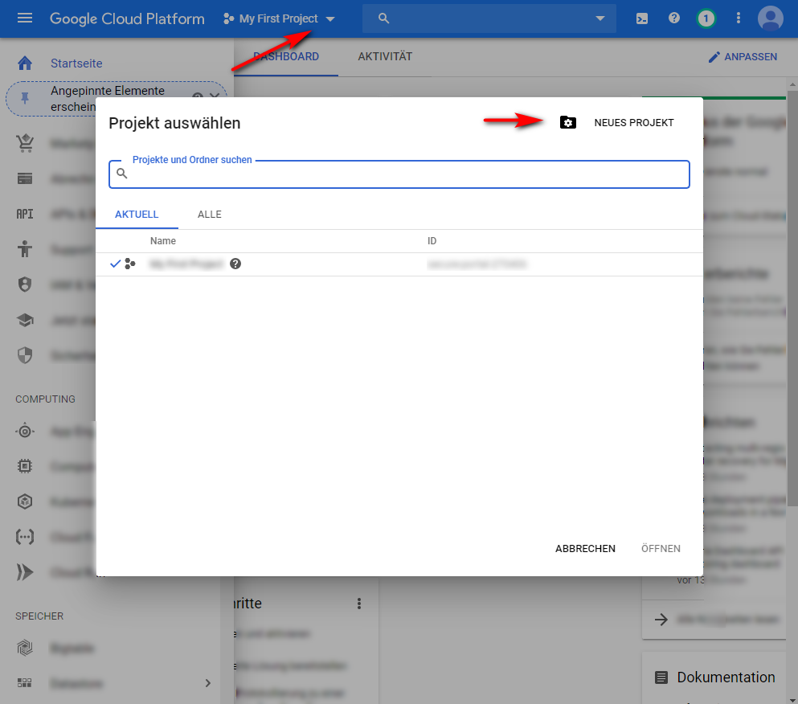

1. Geben Sie im Dialogfeld für das neue Projekt in das Feld für den Projektnamen den Namen Ihres neuen Projekts ein.

   Ihre Projekt-ID basiert auf Ihrem Projektnamen. Wählen Sie daher den Projektnamen sorgfältig. Er kann nach seiner Erstellung nicht geändert werden. Außerdem müssen Sie dieselbe Projekt-ID erneut eingeben, wenn Sie YouTube später in Experience Manager einrichten. Schreiben Sie es daher auf.

1. Klicken Sie auf **[!UICONTROL Erstellen]**.

1. Nehmen Sie eine der folgenden Aktionen vor:

   * Tippen Sie im Projektdashboard auf der Karte „Einstieg“ auf die Option zum **[!UICONTROL Entdecken und Aktivieren von APIs]**.
   * Tippen Sie im Projektdashboard auf der API-Karte auf die Option zum **[!UICONTROL Aufrufen der API-Übersicht]**.

   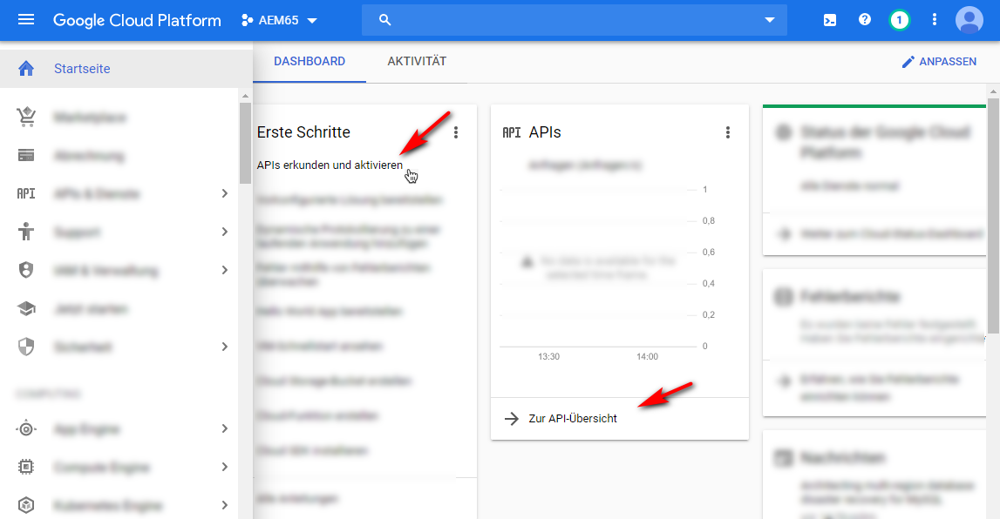

1. Tippen Sie oben auf der Seite mit den APIs und Services auf die Option zum **[!UICONTROL Aktivieren von APIs und Services]**.
1. Tippen Sie in der API-Bibliothek auf der linken Seite unter **[!UICONTROL Kategorie]** auf **[!UICONTROL YouTube]**. Tippen Sie rechts auf der Seite auf **[!UICONTROL YouTube-Daten-API]**.
1. Tippen Sie auf der Seite zur YouTube Data API v3 auf die Option **[!UICONTROL Aktivieren]**.

   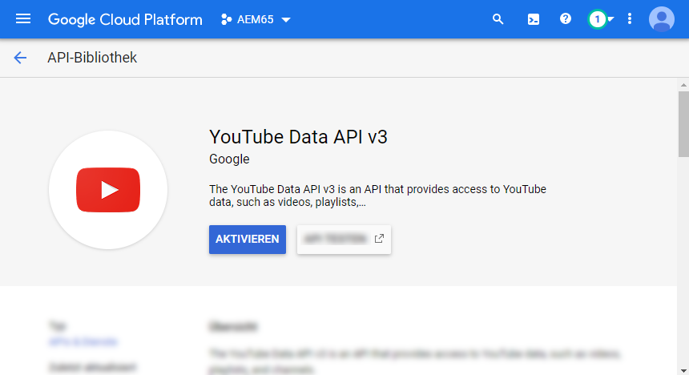

1. Zur Verwendung der API benötigen Sie Anmeldeinformationen. Klicken Sie bei Bedarf auf **[!UICONTROL Berechtigungen erstellen]**.

   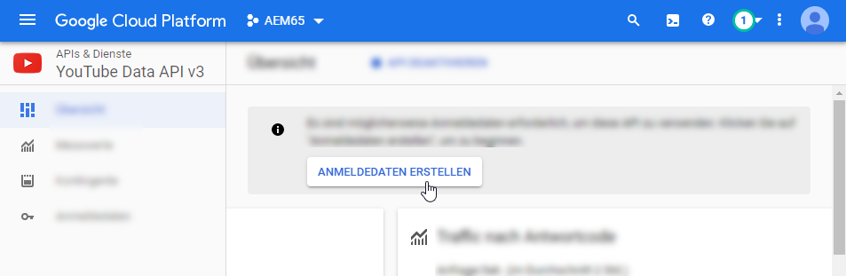

1. Gehen Sie auf der Seite zum **[!UICONTROL Anmeldedaten zu Projekt hinzufügen]** in Schritt 1 wie folgt vor:

   * Wählen Sie in der Dropdown-Liste **[!UICONTROL Welche API verwenden Sie?]** die Option **[!UICONTROL YouTube Data API v3]**.

   * Von **[!UICONTROL Wo rufen Sie die API auf?]** Wählen Sie in der Dropdown-Liste  **[!UICONTROL Webserver (z. B. node.js, Tomcat)]** aus.

   * Auf welche Daten greifen Sie über **[!UICONTROL zu?]** auf **[!UICONTROL Nutzerdaten]**.

   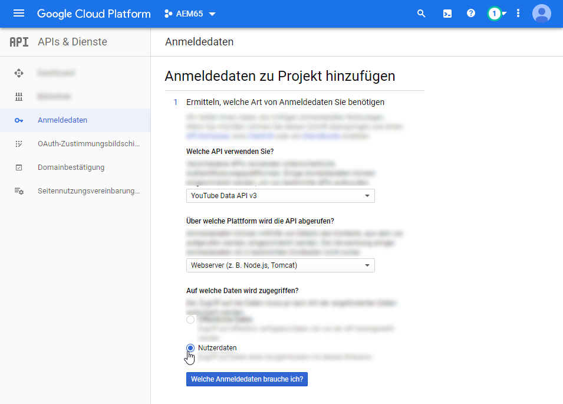

1. Tippen Sie auf **[!UICONTROL Welche Anmeldedaten brauche ich?]**
1. Geben Sie auf der Seite **[!UICONTROL Anmeldedaten zu Projekt hinzufügen]** in Schritt 2 unter der Überschrift **[!UICONTROL OAuth 2.0-Client-ID generieren]** im Feld „Name“ ggf. einen eindeutigen Namen ein. Sie können auch den von Google angegebenen Standardnamen verwenden.
1. Geben Sie unter der Überschrift **[!UICONTROL Autorisierte JavaScript™-Ursprünge]** im Textfeld den folgenden Pfad ein, ersetzen Sie Ihre eigene Domäne und Port-Nummer im Pfad und drücken Sie dann **[!UICONTROL Enter]** , um den Pfad zur Liste hinzuzufügen:

   `https://<servername.domain>:<port_number>`

   Beispiel: `https://1a2b3c.mycompany.com:4321`

   **Hinweis**: Die obigen Pfadbeispiele dienen nur zu Erklärungszwecken.

   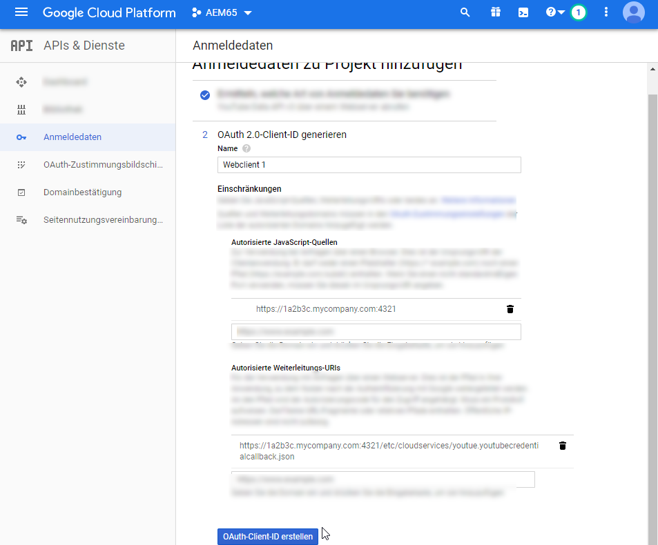

1. Geben Sie unter der Überschrift **[!UICONTROL Autorisierte Weiterleitungs-URIs]** im Textfeld den folgenden Pfad ein, ersetzen Sie Ihre eigene Domain und Port-Nummer im Pfad und drücken Sie dann die **[!UICONTROL Eingabetaste]**, um den Pfad der Liste hinzuzufügen:

   `https://<servername.domain>:<port_number>/etc/cloudservices/youtube.youtubecredentialcallback.json`

   Beispiel: `https://1a2b3c.mycompany.com:4321/etc/cloudservices/youtube.youtubecredentialcallback.json`

   **Hinweis**: Das obige Pfadbeispiel dient nur zu Erklärungszwecken.

1. Klicken Sie auf **[!UICONTROL OAuth Client-ID erstellen]**.
1. Wählen Sie auf der Seite **[!UICONTROL Anmeldeinformationen zu Projekt hinzufügen]** in Schritt 3 unter der Überschrift **[!UICONTROL OAuth 2.0-Einverständnisbildschirm einrichten]** die derzeit verwendete E-Mail-Adresse für Gmail aus.

   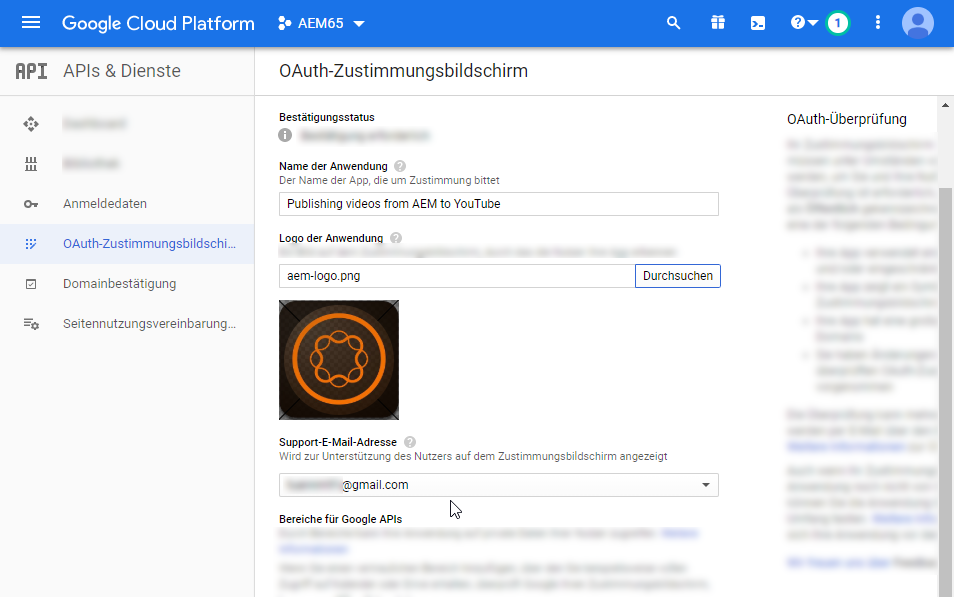

1. Geben Sie unter der Überschrift **[!UICONTROL Benutzern angezeigter Produktname]** im Textfeld ein, was Sie auf der Zustimmungsseite anzeigen möchten.

   Der Einverständnisbildschirm wird dem Experience Manager-Administrator angezeigt, wenn er sich bei YouTube authentifiziert. Experience Manager kontaktieren YouTube zur Erlaubnis.

1. Klicken Sie auf **[!UICONTROL Weiter]**.
1. Tippen Sie auf der Seite „Anmeldeinformationen zu Ihrem Projekt hinzufügen“ in Schritt 4 unter der Überschrift **[!UICONTROL Anmeldedaten herunterladen]** auf **[!UICONTROL Herunterladen]**.

   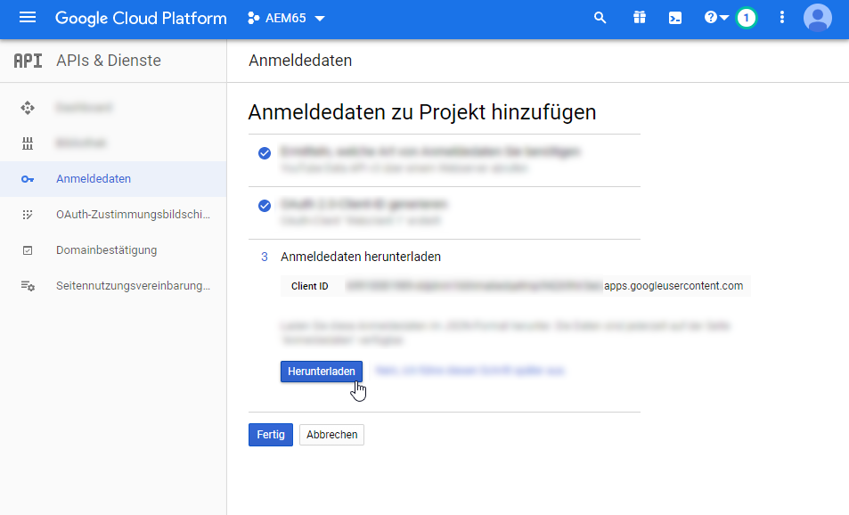

1. Speichern Sie die Datei `client_id.json`.

   Sie benötigen diese heruntergeladene JSON-Datei, wenn Sie YouTube später in Adobe Experience Manager einrichten.

1. Klicken Sie auf **[!UICONTROL Fertig]**.

   Melden Sie sich von Ihrem Google-Konto ab. Erstellen Sie jetzt einen YouTube-Kanal.

### Erstellen eines YouTube-Kanals {#creating-a-youtube-channel}

Für das Veröffentlichen von Videos auf YouTube benötigen Sie mindestens einen Kanal. Wenn Sie bereits einen YouTube-Kanal erstellt haben, können Sie diese Aufgabe überspringen und zur Aufgabe [Hinzufügen von Tags für die Veröffentlichung](/help/assets/dynamic-media/video.md#adding-tags-for-publishing) wechseln.

>[!CAUTION]
>
>Stellen Sie sicher, dass Sie in YouTube *bereits mindestens einen Kanal eingerichtet haben, bevor Sie* unter YouTube-Einstellungen in Experience Manager Kanäle hinzufügen (siehe [Einrichten von YouTube in Experience Manager](#setting-up-youtube-in-aem) unten). Wenn Sie den Kanal nicht einrichten, werden Sie nicht vor vorhandenen Kanälen gewarnt. Beim Hinzufügen eines Kanals wird die Google-Überprüfung jedoch weiterhin durchgeführt. Es gibt jedoch keine Option, um festzulegen, welcher Kanal das Video gesendet wird.

**So erstellen Sie einen YouTube-Kanal:**

1. Rufen Sie [https://www.youtube.com](https://www.youtube.com/) auf und melden Sie sich mithilfe Ihrer Google-Kontoanmeldeinformationen an.
1. Klicken Sie in der rechten oberen Ecke der YouTube-Seite auf Ihr Profilbild (es kann auch als Buchstabe in einem farbigen Kreis angezeigt werden) und tippen Sie dann auf **[!UICONTROL YouTube settings]** (Zahnradsymbol).
1. Tippen Sie auf der Seite Übersicht unter der Überschrift Zusätzliche Funktionen auf **[!UICONTROL Alle meine Kanäle anzeigen oder einen neuen Kanal erstellen]**.
1. Tippen Sie auf der Seite Kanäle auf **[!UICONTROL Neuen Kanal erstellen]**.
1. Geben Sie auf der Seite Markenkonto im Feld Name des Markenkontos einen Unternehmensnamen oder einen anderen Kanalnamen ein, den Sie für die Veröffentlichung der Video-Assets auswählen, und klicken Sie dann auf **[!UICONTROL Erstellen]**.

   Merken Sie sich den hier eingegebenen Namen; müssen Sie sie erneut eingeben, wenn Sie YouTube in Experience Manager einrichten müssen.

1. (Optional) Fügen Sie gegebenenfalls weitere Kanäle hinzu.

   Jetzt fügen Sie Tags zur Veröffentlichung hinzu.

### Hinzufügen von Tags zur Veröffentlichung {#adding-tags-for-publishing}

Um Videos in YouTube zu veröffentlichen, ordnet Experience Manager Tags einem oder mehreren YouTube-Kanälen zu. Informationen zum Hinzufügen von Tags für die Veröffentlichung finden Sie unter [Verwalten von Tags](/help/sites-cloud/authoring/features/tags.md).

Wenn Sie die Standard-Tags in Experience Manager verwenden möchten, können Sie diese Aufgabe überspringen und zu [Einrichten von YouTube in Experience Manager](#setting-up-youtube-in-aem) navigieren.

>[!NOTE]
>
>Nachdem der Cloud Service konfiguriert wurde, ist keine andere Konfiguration erforderlich, um den Agenten für die YouTube-Veröffentlichungsreplikation zu aktivieren. Der Grund dafür ist, dass sie beim Speichern der Cloud Service-Konfiguration aktiviert wurde.

<!-- ### Enabling the YouTube Publish replication agent {#enabling-the-youtube-publish-replication-agent}

After you enable the YouTube Publish replication agent, if you want to test the connection to the Google Cloud account, tap **[!UICONTROL Test Connection]**. A browser tab displays the connection results. If you have added YouTube Channels, then a listing of those is displayed as part of the test.

1. In the upper-left corner of Experience Manager, click the Experience Manager logo, then in the left rail, click **[!UICONTROL Tools]** > **[!UICONTROL Deployment]** > **[!UICONTROL Replication]** > **[!UICONTROL Agents on Author]**.
1. On the Agents of Author page, click **[!UICONTROL YouTube Publish (youtube)]**.
1. On the toolbar, to the right of Settings, click **[!UICONTROL Edit]**.
1. Select the **[!UICONTROL Enabled]** checkbox to turn on the replication agent.
1. Click **[!UICONTROL OK]**. -->

### Setting up YouTube in Experience Manager {#setting-up-youtube-in-aem}

Ab Experience Manager 6.4 wurde eine neue Touch-Benutzeroberflächenmethode eingeführt, um die YouTube-Veröffentlichung in Experience Manager einzurichten. Führen Sie je nach der installierten Instanz des von Ihnen verwendeten Experience Managers einen der folgenden Schritte aus:

* Informationen zum Konfigurieren von YouTube in Experience Manager vor 6.4 finden Sie unter [Einrichten von YouTube in Experience Manager vor 6.4](/help/assets/dynamic-media/video.md#setting-up-youtube-in-aem-before).
* Informationen zum Konfigurieren von YouTube in Experience Manager 6.4 oder höher finden Sie unter [Einrichten von YouTube in Experience Manager 6.4 und höher](#setting-up-youtube-in-aem-and-later).

#### Einrichten von YouTube in Experience Manager 6.4 und höher {#setting-up-youtube-in-aem-and-later}

1. Melden Sie sich als Administrator bei Ihrer Dynamic Media-Instanz an.
1. Tippen Sie oben links im Experience Manager auf das Experience Manager-Logo und tippen Sie dann in der linken Leiste auf **[!UICONTROL Tools]** (Hammersymbol) > **[!UICONTROL Cloud Services]** > **[!UICONTROL YouTube Publishing Configuration]**.
1. Tippen Sie auf **[!UICONTROL global]** (nicht auswählen).

1. Tippen Sie oben rechts auf der globalen Seite auf **[!UICONTROL Erstellen]**.
1. Geben Sie auf der Seite „YouTube-Veröffentlichungskonfiguration erstellen“ unter „Google Cloud Platform-Einstellungen“ im Feld **[!UICONTROL Anwendungsname]** die Google-Projekt-ID ein.

   Sie haben die Projekt-ID bereits während der Konfiguration der Google Cloud-Einstellungen angegeben.
Lassen Sie die Seite YouTube-Konfiguration erstellen geöffnet. Sie kehren gleich dazu zurück.

   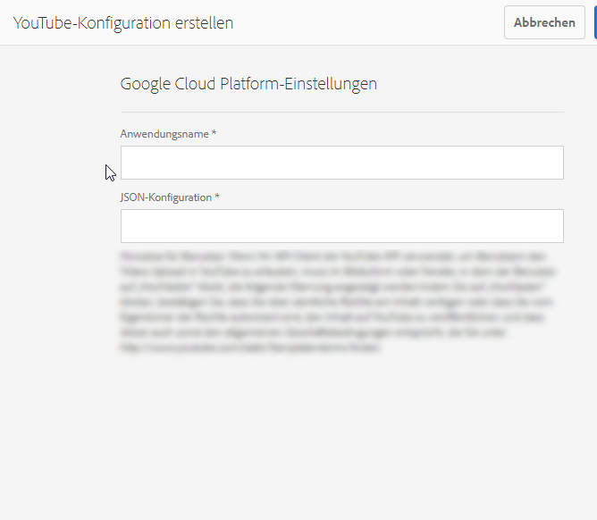

1. Öffnen Sie die in der vorherigen Aufgabe zum [Konfigurieren von Google Cloud-Einstellungen](/help/assets/dynamic-media/video.md#configuring-google-cloud-settings) heruntergeladene und gespeicherte JSON-Datei in einem Nur-Text-Editor.
1. Markieren und kopieren Sie den gesamten JSON-Text.
1. Kehren Sie zum Dialogfeld „YouTube-Kontoeinstellungen“ zurück. Fügen Sie im Feld **[!UICONTROL JSON-Konfiguration]** den JSON-Text ein.
1. Tippen Sie oben rechts auf **[!UICONTROL Speichern]**.

   Sie werden jetzt YouTube-Kanäle in Experience Manager einrichten.

1. Tippen Sie auf **[!UICONTROL Kanal hinzufügen]**.
1. Geben Sie im Dialogfeld „Kanalname“ den Namen des Kanals ein, den Sie zuvor in der Aufgabe zum **[!UICONTROL Hinzufügen von Kanälen zu YouTube]** erstellt haben.

   Sie können optional eine Beschreibung hinzufügen.

1. Tippen Sie auf **[!UICONTROL Hinzufügen]**.
1. Die YouTube-/Google-Verifizierung wird angezeigt. Wenn Sie nicht bereits beim Google Cloud-Konto angemeldet sind, überspringen Sie diesen Schritt.

   * Geben Sie den Google-Benutzernamen und das -Kennwort ein, der bzw. das mit der Google-Projekt-ID und dem obigen JSON-Text verknüpft ist.
   * In Abhängigkeit davon, über wie viele Kanäle Ihr Konto verfügt, werden mindestens zwei Elemente angezeigt. Wählen Sie einen Kanal aus. Wählen Sie keine E-Mail-Adresse aus, da es sich hierbei nicht um einen Kanal handelt.
   * Tippen Sie auf der nächsten Seite auf **[!UICONTROL Akzeptieren]**, um Zugriff auf diesen Kanal zu gewähren.

1. Tippen Sie auf **[!UICONTROL Zulassen]**.

   Richten Sie nun Tags für die Veröffentlichung ein.

1. **[!UICONTROL Festlegen von Tags für die Veröffentlichung]**: Tippen Sie auf der Seite „Cloud Services“ > „YouTube“ auf das Stiftsymbol, um die Liste der Tags zu bearbeiten, die Sie verwenden möchten.
1. Um die Liste der verfügbaren Tags in Experience Manager anzuzeigen, tippen Sie auf das Dropdownlisten-Symbol (umgekehrtes Caret).
1. Um sie hinzuzufügen, tippen Sie auf ein oder mehrere Tags.

   Wählen Sie zum Löschen eines von Ihnen hinzugefügten Tags das Tag aus und tippen Sie auf **[!UICONTROL X]**.

1. Wenn Sie alle gewünschten Tags hinzugefügt haben, tippen Sie auf **[!UICONTROL Speichern]**.

   Nun können Sie Videos in Ihrem YouTube-Kanal veröffentlichen.

#### Einrichten von YouTube in Experience Manager vor 6.4 {#setting-up-youtube-in-aem-before}

1. Melden Sie sich als Administrator bei Ihrer Dynamic Media-Instanz an.

1. Tippen Sie oben links im Experience Manager auf das Experience Manager-Logo und tippen Sie dann in der linken Leiste auf **[!UICONTROL Tools]** (Hammersymbol) > **[!UICONTROL Bereitstellung]** > **[!UICONTROL Cloud Services]**.
1. Tippen Sie unter der Überschrift &quot;Services von Drittanbietern&quot;unter YouTube auf **[!UICONTROL Jetzt konfigurieren]**.
1. Geben Sie im Dialogfeld „Konfiguration erstellen“ einen Titel (obligatorisch) und einen Namen (optional) in die entsprechenden Felder ein.
1. Tippen Sie auf **[!UICONTROL Erstellen]**.
1. Geben Sie im Dialogfeld „YouTube-Kontoeinstellungen“ im Feld **[!UICONTROL Anwendungsname]** die Google-Projekt-ID ein.

   Sie haben die Projekt-ID bereits während der [Konfiguration der Google Cloud-Einstellungen](/help/assets/dynamic-media/video.md#configuring-google-cloud-settings) angegeben.
Lassen Sie das Dialogfeld YouTube-Kontoeinstellungen geöffnet. Sie kehren gleich dazu zurück.

1. Öffnen Sie die in der vorherigen Aufgabe zum Konfigurieren von Google Cloud-Einstellungen heruntergeladene und gespeicherte JSON-Datei in einem Nur-Text-Editor.
1. Markieren und kopieren Sie den gesamten JSON-Text.
1. Kehren Sie zum Dialogfeld „YouTube-Kontoeinstellungen“ zurück. Fügen Sie im Feld **[!UICONTROL JSON-Konfiguration]** den JSON-Text ein.
1. Tippen Sie auf **[!UICONTROL OK]**.

   Sie werden jetzt YouTube-Kanäle in Experience Manager einrichten.

1. Tippen Sie rechts neben **[!UICONTROL Verfügbare Kanäle]** auf **+** (Pluszeichen).
1. Geben Sie im Dialogfeld „Einstellungen für YouTube-Kanal“ im Feld „Titel“ den Namen des Kanals ein, den Sie zuvor in der Aufgabe **[!UICONTROL Hinzufügen von Kanälen zu YouTube]** erstellt haben.

   Sie können optional eine Beschreibung hinzufügen.

1. Tippen Sie auf **[!UICONTROL OK]**.
1. Die YouTube-/Google-Verifizierung wird angezeigt. Wenn Sie nicht bereits beim Google Cloud-Konto angemeldet sind, überspringen Sie diesen Schritt.

   * Geben Sie den Google-Benutzernamen und das -Kennwort ein, der bzw. das mit der Google-Projekt-ID und dem obigen JSON-Text verknüpft ist.
   * In Abhängigkeit davon, über wie viele Kanäle Ihr Konto verfügt, werden mindestens zwei Elemente angezeigt. Wählen Sie einen Kanal aus. Wählen Sie keine E-Mail-Adresse aus, da es sich hierbei nicht um einen Kanal handelt.
   * Tippen Sie auf der nächsten Seite auf **[!UICONTROL Akzeptieren]**, um Zugriff auf diesen Kanal zu gewähren.

1. Tippen Sie auf **[!UICONTROL Zulassen]**.

   Richten Sie nun Tags für die Veröffentlichung ein.

1. **[!UICONTROL Festlegen von Tags für die Veröffentlichung]**: Tippen Sie auf der Seite „Cloud Services“ > „YouTube“ auf das Stiftsymbol, um die Liste der Tags zu bearbeiten, die Sie verwenden möchten.
1. Um die Liste der verfügbaren Tags in Experience Manager anzuzeigen, tippen Sie auf das Dropdownlisten-Symbol (umgekehrtes Caret).
1. Um sie hinzuzufügen, tippen Sie auf ein oder mehrere Tags.

   Wählen Sie zum Löschen eines von Ihnen hinzugefügten Tags das Tag aus und tippen Sie auf **X**.

1. Wenn Sie alle gewünschten Tags hinzugefügt haben, tippen Sie auf **[!UICONTROL OK]**.

   Nun können Sie Videos in Ihrem YouTube-Kanal veröffentlichen.

### (Optional) Automatisieren der Einstellung von YouTube-Standardeigenschaften für hochgeladene Videos {#optional-automating-the-setting-of-default-youtube-properties-for-your-uploaded-videos}

Sie können die Einstellung von YouTube-Eigenschaften beim Hochladen Ihrer Videos auch automatisieren. Erstellen Sie ein Metadaten-Verarbeitungsprofil in Experience Manager.

Um das Metadaten-Verarbeitungsprofil zu erstellen, kopieren Sie zunächst die Werte aus den Feldern **[!UICONTROL Feldbezeichnung]**, **[!UICONTROL Zuordnung zu Eigenschaft]** und **[!UICONTROL Auswahl]**, die alle in den Metadatenschemata für Videos enthalten sind. Anschließend erstellen Sie Ihr YouTube-Metadaten-Verarbeitungsprofil, indem Sie ihm diese Werte hinzufügen.

**So automatisieren Sie die Einstellung von YouTube-Standardeigenschaften für hochgeladene Videos:**

1. Klicken Sie oben links im Experience Manager auf das Experience Manager-Logo und dann in der linken Leiste auf **[!UICONTROL Tools]** (Hammersymbol) > **[!UICONTROL Assets]** > **[!UICONTROL Metadatenschemata]**.
1. Klicken Sie auf **[!UICONTROL Standard]**. (Aktiveren Sie nicht das Auswahlfeld links neben „Standard“.)
1. Aktivieren Sie auf der Seite **[!UICONTROL Standard]** das Kontrollkästchen links neben **[!UICONTROL Video]** und klicken Sie dann auf **[!UICONTROL Bearbeiten]**.
1. Klicken Sie auf der Seite „Metadatenschema-Editor“ auf die Registerkarte **[!UICONTROL Erweitert]**.
1. Klicken Sie unter der Überschrift „YouTube-Publishing“ auf **[!UICONTROL YouTube-Kategorie]**.
1. Führen Sie auf der Registerkarte **[!UICONTROL Einstellungen]** rechts auf der Seite folgende Schritte aus:

   * Wählen Sie den Wert im Textfeld **[!UICONTROL Zu Eigenschaft zuordnen]** aus und kopieren Sie ihn.
Fügen Sie den kopierten Wert in den geöffneten Texteditor ein. Sie benötigen diesen Wert später, wenn Sie das Metadaten-Verarbeitungsprofil erstellen. Lassen Sie den Texteditor geöffnet.

   * Wählen Sie unter **[!UICONTROL Wahlen]** den Standardwert aus, den Sie verwenden möchten (beispielsweise „Personen und Blogs“ oder „Wissenschaft und Technik“).
Fügen Sie den kopierten Wert in den geöffneten Texteditor ein. Sie benötigen diesen Wert später, wenn Sie das Metadaten-Verarbeitungsprofil erstellen. Lassen Sie den Texteditor geöffnet.

1. Klicken Sie unter der Überschrift „YouTube-Publishing“ auf **[!UICONTROL YouTube-Datenschutz]**.
1. Führen Sie auf der Registerkarte **[!UICONTROL Einstellungen]** rechts auf der Seite folgende Schritte aus:

   * Wählen Sie den Wert im Textfeld **[!UICONTROL Zu Eigenschaft zuordnen]** aus und kopieren Sie ihn.
Fügen Sie den kopierten Wert in den geöffneten Texteditor ein. Sie benötigen diesen Wert später, wenn Sie das Metadaten-Verarbeitungsprofil erstellen. Lassen Sie den Texteditor geöffnet.

   * Wählen Sie unter **[!UICONTROL Wahlen]** den Standardwert aus, den Sie verwenden möchten, und kopieren Sie ihn. Beachten Sie, dass unter „Wahlen“ Paare von jeweils zwei Werten vorliegen. Das untere Feld des Wertepaars ist der Standardwert, den Sie kopieren müssen, beispielsweise „Öffentlich“, „Nicht aufgeführt“ oder „Privat“.
Fügen Sie den kopierten Wert in den geöffneten Texteditor ein. Sie benötigen diesen Wert später, wenn Sie das Metadaten-Verarbeitungsprofil erstellen. Lassen Sie den Texteditor geöffnet.

1. Klicken Sie in der rechten oberen Ecke der Seite „Metadatenschema-Editor“ auf **[!UICONTROL Abbrechen]**.
1. Tippen Sie oben links im Experience Manager auf das Experience Manager-Logo und klicken Sie dann in der linken Leiste auf **[!UICONTROL Tools]** (Hammersymbol) > **[!UICONTROL Assets]** > **[!UICONTROL Metadatenprofile]**.

1. Klicken Sie auf der Seite „Metadatenprofile“ in der rechten oberen Ecke der Seite auf **[!UICONTROL Erstellen]**.
1. Geben Sie im Dialogfeld „Metadatenprofil hinzufügen“ im Textfeld **[!UICONTROL Profiltitel]** den Namen `YouTube Video` ein. Klicken Sie danach auf **[!UICONTROL Erstellen]**.
1. Klicken Sie auf der Seite „Metadatenprofil-Editor“ auf die Registerkarte **[!UICONTROL Erweitert]**.
1. Fügen Sie die kopierten YouTube-Publishing-Werte dem Profil hinzu, indem Sie folgende Schritte ausführen:

   * Klicken Sie rechts auf der Seite auf die Registerkarte **[!UICONTROL Formular erstellen]**.
   * (Optional) Ziehen Sie die Komponente mit der Beschriftung **[!UICONTROL Bereichs-Kopfzeile]** nach links und legen Sie sie im Formularbereich ab.
   * (Optional) Klicken Sie auf **[!UICONTROL Feldbezeichnung]**, um die Komponente auszuwählen.
   * (Optional) Geben Sie rechts auf der Seite auf der Registerkarte „Einstellungen“ im Textfeld „Feldbezeichnung“ den Text `YouTube Publishing` ein.
   * Klicken Sie auf die Registerkarte **[!UICONTROL Formular erstellen]**, ziehen Sie die Komponente mit der Bezeichnung **[!UICONTROL Mehrwerttext]** und legen Sie sie unter der Überschrift **[!UICONTROL YouTube Publishing]** ab, die Sie erstellt haben.

   * Um die Komponente auszuwählen, klicken Sie auf **[!UICONTROL Feldbezeichnung]**.
   * Fügen Sie die zuvor kopierten YouTube-Publishing-Werte („Feldbezeichnung“ und „Zu Eigenschaft zuordnen“) in die entsprechenden Felder des Formulars ein, das sich rechts auf der Seite „Formular bearbeiten“ auf der Registerkarte „Einstellungen“ befindet. Fügen Sie den Wert für „Wahlen“ in das Feld „Standardwert“ ein.

1. Fügen Sie die kopierten YouTube-Datenschutzwerte dem Profil hinzu, indem Sie folgende Schritte ausführen:

   * Klicken Sie rechts auf der Seite auf die Registerkarte **[!UICONTROL Formular erstellen]**.
   * (Optional) Ziehen Sie die Komponente mit der Beschriftung **[!UICONTROL Bereichs-Kopfzeile]** nach links und legen Sie sie im Formularbereich ab.
   * (Optional) Klicken Sie auf **[!UICONTROL Feldbezeichnung]**, um die Komponente auszuwählen.
   * (Optional) Geben Sie rechts auf der Seite auf der Registerkarte „Einstellungen“ im Textfeld „Feldbezeichnung“ den Text `YouTube Privacy` ein.
   * Klicken Sie auf die Registerkarte **[!UICONTROL Formular erstellen]**, ziehen Sie die Komponente mit der Bezeichnung **[!UICONTROL Mehrwerttext]** und legen Sie sie unter der Überschrift **[!UICONTROL YouTube-Datenschutz]** ab, die Sie erstellt haben.

   * Um die Komponente auszuwählen, klicken Sie auf **[!UICONTROL Feldbezeichnung]**.
   * Fügen Sie die zuvor kopierten YouTube-Publishing-Werte („Feldbezeichnung“ und „Zu Eigenschaft zuordnen“) in die entsprechenden Felder des Formulars ein, das sich rechts auf der Seite „Formular bearbeiten“ auf der Registerkarte „Einstellungen“ befindet. Fügen Sie den Wert für „Wahlen“ in das Feld „Standardwert“ ein.

1. Klicken Sie oben rechts auf der Seite auf **[!UICONTROL Speichern]**.
1. Wenden Sie das Metadatenprofil für YouTube Publishing auf die Ordner an, in die Sie Videos hochladen möchten. Sie müssen sowohl über das Metadatenprofil als auch über das Videoprofil verfügen.

   Siehe [Metadatenprofile](/help/assets/metadata-profiles.md) und [Videoprofile](/help/assets/dynamic-media/video-profiles.md).

### Veröffentlichen von Videos in Ihrem YouTube-Kanal  {#publishing-videos-to-your-youtube-channel}

Nun verknüpfen Sie die Tags, die Sie den Video-Assets zuvor hinzugefügt haben. Auf diese Weise erfahren Experience Manager, welche Assets in Ihrem YouTube-Kanal veröffentlicht werden sollen.

>[!NOTE]
>
>Die sofortige Veröffentlichung wird nicht automatisch in YouTube veröffentlicht. Beim Einrichten von Dynamic Media stehen zwei Veröffentlichungsoptionen zur Auswahl: **[!UICONTROL Sofort]** oder **[!UICONTROL Bei Aktivierung]**.
>
>**[!UICONTROL Sofort veröffentlichen]** bedeutet, dass das hochgeladene Asset nach dem Synchronisieren mit IPS automatisch im Bereitstellungssystem veröffentlicht wird. Das gilt zwar für Dynamic Media, aber nicht für YouTube. Um Inhalte in YouTube zu veröffentlichen, müssen Sie sie über die Experience Manager-Autoreninstanz veröffentlichen.

>[!NOTE]
Um Inhalte aus YouTube zu veröffentlichen, verwendet Experience Manager den Workflow **[!UICONTROL In YouTube veröffentlichen]** , mit dem Sie den Fortschritt überwachen und Fehlerinformationen anzeigen können.
Siehe [Überwachen der Videokodierung und des YouTube Publishing-Fortschritts](#monitoring-video-encoding-and-youtube-publishing-progress).
Ausführlichere Fortschrittsinformation können Sie dem YouTube-Protokoll unter „Replikation“ entnehmen. Hinweis: Für die Überwachung solcher Informationen benötigen Sie Administratorzugriff.

**So veröffentlichen Sie Videos in Ihrem YouTube-Kanal:**

1. Navigieren Sie in Experience Manager zu einem Video-Asset, das Sie in Ihrem YouTube-Kanal veröffentlichen möchten.
1. Wählen Sie das Video-Asset aus (das adaptive Videoset).
1. Klicken Sie in der Symbolleiste auf **[!UICONTROL Eigenschaften]**.
1. Klicken Sie auf der Registerkarte „Allgemein“ unter der Überschrift „Metadaten“ rechts neben dem Feld „Tags“ auf **[!UICONTROL Auswahl-Dialogfeld öffnen]**.
1. Navigieren Sie auf der Seite „Tags auswählen“ zu den Tags, die Sie verwenden möchten, und wählen Sie ein oder mehrere Tags aus.

   Denken Sie daran, dass die Tags mit dem YouTube-Kanal verknüpft werden müssen.

1. Klicken Sie oben rechts auf **[!UICONTROL Auswählen]**.
1. Klicken Sie in der rechten oberen Ecke der Seite „Eigenschaften“ auf **[!UICONTROL Speichern und schließen]**.
1. Klicken Sie in der Symbolleiste auf **[!UICONTROL Quick Publish]**.

   Siehe auch [Verwenden der Veröffentlichungsverwaltung mit Experience Manager-Sites](https://experienceleague.adobe.com/docs/experience-manager-learn/sites/page-authoring/publication-management-feature-video-use.html?lang=de#page-authoring).

   Optional können Sie das veröffentlichte Video in Ihrem YouTube-Kanal überprüfen.

### (Optional) Überprüfen des auf YouTube veröffentlichten Videos {#optional-verifying-the-published-video-on-youtube}

Sie können auch den Fortschritt der YouTube-Veröffentlichung (oder des Rückgängigmachens der Veröffentlichung) überwachen.

Siehe [Überwachen der Videokodierung und des YouTube Publishing-Fortschritts](#monitoring-video-encoding-and-youtube-publishing-progress).

Publishing-Zeiten können abhängig von zahlreichen Faktoren erheblich variieren, einschließlich Format des Primärvideos, Dateigröße und Upload-Datenverkehr. Der Publishing-Prozess kann einige Minuten bis zu mehrere Stunden dauern. Außerdem werden Formate mit höherer Auflösung viel langsamer gerendert. Beispielsweise dauert es bei 720p und 1080p länger, als 480p anzuzeigen.

Wenn nach acht Stunden immer noch eine Statusmeldung mit **[!UICONTROL Hochgeladen (Verarbeitung, bitte warten)]** angezeigt wird, versuchen Sie, das Video von Ihrer Site zu entfernen und es erneut hochzuladen.

### Verknüpfen von YouTube-URLs mit Ihrer Web-Anwendung {#linking-youtube-urls-to-your-web-application}

Sie können nach dem Veröffentlichen des Videos eine YouTube-URL-Zeichenfolge abrufen, die durch Dynamic Media generiert wird. Wenn Sie die YouTube-URL kopieren, wird sie in der Zwischenablage abgelegt, sodass Sie sie nach Bedarf in Seiten einer Website oder einem Programm einfügen können.

>[!NOTE]
Die YouTube-URL kann erst kopiert werden, wenn Sie das Video-Asset in YouTube veröffentlicht haben.

So verknüpfen Sie YouTube-URLs mit einer Web-Anwendung:

1. Navigieren Sie zum *auf YouTube veröffentlichten* Video-Asset, dessen URL Sie kopieren möchten, und wählen Sie es aus.

   Denken Sie daran, dass YouTube-URLs erst kopiert werden können, *nachdem* Sie die Video-Assets in YouTube *veröffentlicht* haben.

1. Klicken Sie in der Symbolleiste auf **[!UICONTROL Eigenschaften]**.
1. Klicken Sie auf die Registerkarte **[!UICONTROL Erweitert]**.
1. Wählen Sie unter der Überschrift &quot;YouTube Publishing&quot;in der YouTube-URL-Liste den URL-Text aus und kopieren Sie ihn in Ihren Webbrowser, um eine Vorschau des Assets anzuzeigen oder es der Web-Inhaltsseite hinzuzufügen.

### Rückgängigmachen der Veröffentlichung von Videos und Entfernen aus YouTube  {#unpublishing-videos-to-remove-them-from-youtube}

Wenn Sie die Veröffentlichung eines Video-Assets in Experience Manager rückgängig machen, wird das Video aus YouTube entfernt.

>[!CAUTION]
Wenn Sie ein Video direkt aus YouTube entfernen, ist der Experience Manager nicht informiert und verhält sich weiterhin so, als ob das Video noch in YouTube veröffentlicht wird. Machen Sie die Veröffentlichung eines Video-Assets über YouTube immer rückgängig.

>[!NOTE]
Um Inhalte aus YouTube zu entfernen, verwendet Experience Manager den Workflow **[!UICONTROL Veröffentlichung in YouTube rückgängig machen]** , mit dem Sie den Fortschritt überwachen und Fehlerinformationen anzeigen können.
Siehe [Überwachen der Videokodierung und des YouTube Publishing-Fortschritts](#monitoring-video-encoding-and-youtube-publishing-progress).

So machen Sie die Veröffentlichung von Videos rückgängig, um sie aus YouTube zu entfernen:

1. Navigieren Sie zu den Video-Assets, deren Veröffentlichung in Ihrem YouTube-Kanal Sie rückgängig machen möchten.
1. Wählen Sie in einem Asset-Auswahlmodus eines oder mehrere der veröffentlichten Video-Assets aus.
1. Klicken Sie in der Symbolleiste auf **[!UICONTROL Veröffentlichung verwalten]**. Tippen Sie ggf. auf das Symbol mit den drei Punkten (`. . .`) in der Symbolleiste, um **[!UICONTROL Veröffentlichung verwalten]** anzuzeigen.
1. Tippen Sie auf der Seite „Veröffentlichung verwalten“ auf **[!UICONTROL Veröffentlichung rückgängig machen]**.
1. Tippen Sie oben rechts auf der Seite auf **[!UICONTROL Weiter]**.
1. Tippen Sie oben rechts auf der Seite auf **[!UICONTROL Veröffentlichung rückgängig machen]**.

## Fortschritt von Videokodierung und YouTube-Veröffentlichung überwachen  {#monitoring-video-encoding-and-youtube-publishing-progress}

Wenn Sie ein neues Video in einen Ordner hochladen, auf den die Videokodierung angewendet wurde, oder das Video in YouTube veröffentlichen, überwachen Sie, wie die Videokodierung/YouTube-Veröffentlichung voranschreitet (oder fehlschlägt). Der tatsächliche Veröffentlichungsfortschritt von YouTube ist nur über die Protokolle verfügbar. Ob er jedoch scheitert oder erfolgreich ist, wird im folgenden Verfahren auf andere Weise beschrieben. Darüber hinaus erhalten Sie E-Mail-Benachrichtigungen, wenn ein YouTube-Veröffentlichungs-Workflow oder eine Videokodierung abgeschlossen oder unterbrochen wird.

### Fortschritt überwachen {#monitoring-progress}

**So überwachen Sie den Fortschritt, einschließlich fehlgeschlagener Kodierung/YouTube-Veröffentlichung:**

1. Fortschritt der Videokodierung in Ihrem Asset-Ordner anzeigen:

   * In der Kartenansicht wird der Fortschritt der Videokodierung in Prozent auf dem Asset angezeigt. Falls ein Fehler auftritt, werden diese Informationen ebenfalls für das Asset angezeigt.

   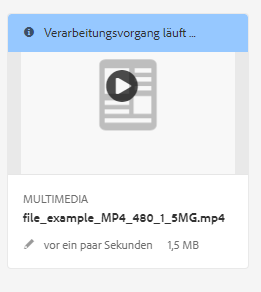

   * In der Listenansicht wird der Fortschritt der Videokodierung in der Spalte **[!UICONTROL Verarbeitungsstatus]** angezeigt. Bei einem Fehler wird die Nachricht in derselben Spalte angezeigt.

   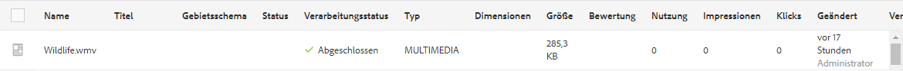

   Diese Spalte wird standardmäßig nicht angezeigt. Um die Spalte zu aktivieren, wählen Sie aus dem Dropdown-Menü **[!UICONTROL Anzeigeeinstellungen]** und fügen Sie die Spalte **[!UICONTROL Verarbeitungsstatus]** hinzu oder tippen bzw. klicken Sie auf **[!UICONTROL Aktualisieren]**.

   

1. Fortschritt in den Asset-Details anzeigen. Wenn Sie auf ein Asset tippen oder klicken, öffnen Sie das Dropdown-Menü und wählen Sie die Option **[!UICONTROL Zeitleistensegment]**. Um die Ergebnisse auf Workflow-Aktivitäten wie Kodierung oder YouTube-Veröffentlichung zu begrenzen, wählen Sie **[!UICONTROL Workflows]**.

   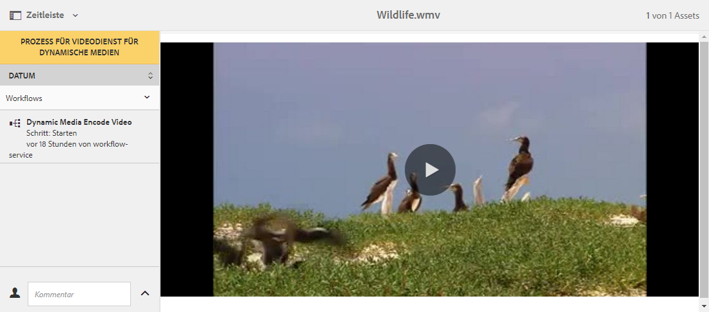

   Workflow-Informationen – z. B. zur Kodierung – werden in der Zeitleistensegment angezeigt. Bei YouTube-Veröffentlichungen enthält die Workflow-Zeitleistensegment auch den Namen des YouTube-Kanals und die URL zum YouTube-Video. In der Workflow-Zeitleistensegment werden Sie nach der Veröffentlichung auch über eventuelle Fehler benachrichtigt.

   >[!NOTE]
   Die endgültige Aufzeichnung von Fehler-/Fehlermeldungen kann länger dauern, da für **[!UICONTROL Wiederholungen]**, **[!UICONTROL Wiederholungsverzögerung]** und **[!UICONTROL Zeitüberschreitung]** von [https://localhost:4502/system/console/configMgr](https://localhost:4502/system/console/configMgr) mehrere Workflow-Konfigurationen vorliegen, z. B.:
   * Konfiguration der Warteschlange für Apache Sling-Aufträge
   * Handler für externe Prozessaufträge im Adobe Granite-Workflow
   * Granite-Workflow – Zeitlimit-Warteschlange

   Sie können die Eigenschaften **[!UICONTROL retries]**, **[!UICONTROL Wiederholungsverzögerung]** und **[!UICONTROL Zeitüberschreitung]** in diesen Konfigurationen anpassen.

1. Informationen zu gestarteten Workflows finden Sie anhand der Workflow-Instanzen unter **[!UICONTROL Tools]** > **[!UICONTROL Workflow]** > **[!UICONTROL Instanzen]**.

   >[!NOTE]
   Sie benötigen Administratorrechte, um auf das Menü **[!UICONTROL Tools]** zugreifen zu können.

   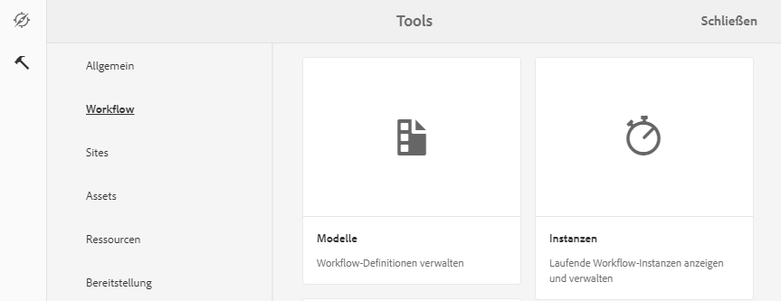

   Wählen Sie die Instanz aus und tippen oder klicken Sie auf **[!UICONTROL Offener Verlauf]**.

   

   Im Bereich „Workflow-Instanzen“ können Sie Workflows auch aussetzen, beenden oder umbenennen. Weitere Informationen finden Sie unter [Workflows verwalten](/help/sites-cloud/authoring/workflows/overview.md).

1. Fehlgeschlagene Aufträge finden Sie unter „Workflowfehler“ unter **[!UICONTROL Tools]** > **[!UICONTROL Workflow]** > **[!UICONTROL Fehler]**. Unter **[!UICONTROL Workflowfehler]** werden alle fehlgeschlagenen Workflowaktivitäten aufgelistet.

   >[!NOTE]
   Sie benötigen Administratorrechte, um auf das Menü **[!UICONTROL Tools]** zugreifen zu können.

   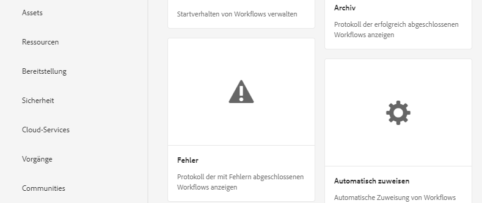

   >[!NOTE]
   Es kann lange dauern, bis die Fehlermeldung endlich aufgezeichnet wird, da für **[!UICONTROL Wiederholungen]**, **[!UICONTROL Wiederholungsverzögerung]** und **[!UICONTROL Zeitüberschreitung]** von [https://localhost:4502/system/console/configMgr](https://localhost:4502/system/console/configMgr) mehrere Workflow-Konfigurationen vorliegen, z. B.:
   * Konfiguration der Warteschlange für Apache Sling-Aufträge
   * Handler für externe Prozessaufträge im Adobe Granite-Workflow
   * Granite-Workflow – Zeitlimit-Warteschlange

   Sie können die Eigenschaften **[!UICONTROL retries]**, **[!UICONTROL Wiederholungsverzögerung]** und **[!UICONTROL Zeitüberschreitung]** in diesen Konfigurationen anpassen.

1. Informationen zu abgeschlossenen Workflows finden Sie im Workflow-Archiv, das unter **[!UICONTROL Tools]** > **[!UICONTROL Workflow]** > **[!UICONTROL Archiv]** zur Verfügung steht. Im **[!UICONTROL Workflow-Archiv]** sind alle abgeschlossenen Workflow-Aktivitäten aufgeführt.

   >[!NOTE]
   Sie benötigen Administratorrechte, um auf das Menü **[!UICONTROL Tools]** zugreifen zu können.

   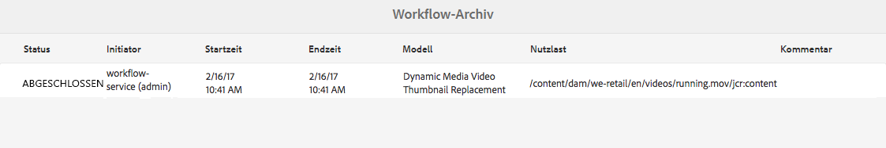

1. Sie erhalten E-Mail-Benachrichtigungen über abgebrochene oder fehlgeschlagene Workflow-Aufträge. Diese E-Mail-Benachrichtigungen können von einem Administrator konfiguriert werden. Weitere Informationen finden Sie unter [Konfigurieren von E-Mail-Benachrichtigungen](#configuring-e-mail-notifications).

<!-- EMAIL NOT AVAILABLE IN SKYLINE

#### Configuring e-mail notifications {#configuring-e-mail-notifications}

>[!NOTE]
>
>You may need administrative rights to access the **[!UICONTROL Tools]** menu.

How you configure notification depends on whether you want notifications for YouTube publishing jobs.

* For encoding jobs, you can access the configuration page for all Experience Manager workflow email notifications at **[!UICONTROL Tools]** > **[!UICONTROL Operations]** > **[!UICONTROL Web Console]** and by searching for **[!UICONTROL Day CQ Workflow Email Notification Service]**. You can select or clear the check boxes for **[!UICONTROL Notify on Abort]** or **[!UICONTROL Notify on Complete]** accordingly.

For YouTube publishing jobs, do the following:

1. In Experience Manager, tap **[!UICONTROL Tools]** > **[!UICONTROL Workflow]** > **[!UICONTROL Models]**.
1. On the Workflow Models page, select **[!UICONTROL Publish to YouTube]**, then tap **[!UICONTROL Edit]** on the toolbar.
1. Near the upper-right corner of the Publish to YouTube workflow page, tap **[!UICONTROL Edit]**.
1. Hover the mouse pointer on the YouTube Upload component, then tap once to display the inline toolbar.

   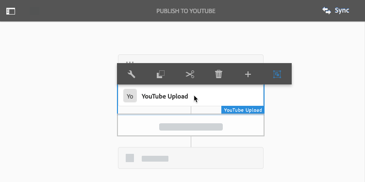

1. On the inline toolbar, tap the Configuration icon (wrench). Click the **[!UICONTROL Arguments]** tab.

   

1. In the YouTube Upload Process - Step Properties dialog box, tap the **[!UICONTROL Arguments]** tab.

   

1. You can select or clear the following check boxes:

    * Publish Start
    * Publish Failure
    * Publish Completion - includes information on channels and URLs

   Clearing a check box means that you will not receive the specified email notification from the YouTube Publish workflow.

   >[!NOTE]
   >
   >These emails are specific to YouTube and are in addition to the generic workflow email notifications. As a result, you may receive two sets of email notification - the generic notification available in the **[!UICONTROL Day CQ Workflow Email Notification Service]** and one specific to YouTube depending on your configuration settings.

1. When you are finished, near the upper-right corner of the dialog box, tap the **[!UICONTROL Done]** icon (check mark).
1. On the Publish to YouTube workflow page, near the upper-right corner, tap **[!UICONTROL Sync]**.

-->

## Anzeigen von Videoberichten {#viewing-video-reports}

>[!NOTE]
Videoberichte sind nur verfügbar, wenn Sie Dynamic Media im Hybridmodus ausführen.

Videoberichte zeigen mehrere aggregierte Metriken für einen bestimmten Zeitraum an, damit Sie überwachen können, dass *veröffentlichte* individuelle und aggregierte Videos die erwartete Leistung zeigen. Die folgenden Top-Metrikdaten werden für alle veröffentlichten Videos auf der gesamten Website aggregiert:

* Videostarts
* Abschlussrate
* Durchschnittliche Zeit im Video
* Gesamtzeit im Video
* Videos pro Besuch

Eine Tabelle mit allen *veröffentlichten* Videos wird ebenfalls angezeigt, damit Sie die am häufigsten angezeigten Videos auf der Website basierend auf insgesamt gestarteten Videos verfolgen können.

Wenn Sie auf einen Videonamen in der Liste tippen, wird der Bericht zur Zielgruppenerfassung (Abbruch) des Videos in Form eines Liniendiagramms angezeigt. Das Diagramm zeigt die Anzahl der Ansichten für einen bestimmten Zeitpunkt während der Videowiedergabe an. Beim Abspielen des Videos wird die vertikale Leiste mit der Zeitanzeige im Player synchronisiert. Drops in den Liniendiagrammdaten geben an, wo Ihre Zielgruppe aus Desinteresse abfällt.

Wenn das Video außerhalb von Adobe Experience Manager für Dynamic Media kodiert wurde, sind das Diagramm zur Zielgruppentreue (Abbruch) und die Daten zur Wiedergabe in Prozent in der Tabelle nicht verfügbar.

>[!NOTE]
Nachverfolgungs- und Berichtsdaten basierend ausschließlich auf der Nutzung des eigenen Video-Players und der zugehörigen Video-Player-Vorgabe von Dynamic Media. Daher können Sie keine Videos nachverfolgen und in Berichte aufnehmen, die mit anderen Video-Playern wiedergegeben werden.

Wenn Sie die Funktion „Videoberichte“ zum ersten Mal aufrufen, enthält der Bericht standardmäßig Videodaten für den Zeitraum vom ersten Tag des aktuellen Monats bis zum aktuellen Datum. Sie können den standardmäßigen Datumsbereich aber außer Kraft setzen, indem Sie Ihren eigenen Datumsbereich angeben. Wenn Sie „Videoberichte“ das nächste Mal aufrufen, wird der angegebene Datumsbereich verwendet.

Damit Videoberichte ordnungsgemäß funktionieren, wird automatisch eine Report Suite-ID erstellt, wenn Dynamic Media Cloud Services konfiguriert wurde. Gleichzeitig wird die Report Suite-ID an den Veröffentlichungs-Server übergeben, damit sie für die Funktion „URL kopieren“ bei der Asset-Vorschau verfügbar ist. Diese Funktion erfordert jedoch, dass der Veröffentlichungsserver bereits eingerichtet ist. Wenn der Veröffentlichungsserver nicht eingerichtet ist, können Sie dennoch veröffentlichen, um den Videobericht anzuzeigen. Sie müssen jedoch zur Dynamic Media Cloud-Konfiguration zurückkehren und auf **[!UICONTROL OK]** tippen.

So zeigen Sie Videoberichte an:

1. Tippen Sie oben links im Experience Manager auf das Experience Manager-Logo und tippen Sie dann in der linken Leiste auf **[!UICONTROL Tools]** (Hammersymbol) > **[!UICONTROL Assets]** > **[!UICONTROL Videoberichte]**.
1. Führen Sie auf der Seite „Videoberichte“ eine der folgenden Aktionen aus:

   * Tippen Sie in der Nähe der oberen rechten Ecke auf das Symbol **[!UICONTROL Videobericht aktualisieren.]**
Sie verwenden die Option Aktualisieren nur, wenn das Enddatum des Berichts der aktuelle Tag ist. Diese Funktion stellt sicher, dass Sie das Video-Tracking sehen, das seit der letzten Ausführung des Berichts erfolgt ist.

   * Tippen Sie oben rechts auf das Symbol **[!UICONTROL Datumsauswahl]**.
Geben Sie den Anfang und das Ende des Datumsbereichs an, für den Sie Videodaten anzeigen möchten, und tippen Sie dann auf **[!UICONTROL Bericht ausführen]**.

   Im Gruppenfeld „Top-Metriken“ werden verschiedene aggregierte Messungen für alle auf der Site *veröffentlichten *Videos angegeben.

1. Tippen Sie in der Tabelle mit den am häufigsten veröffentlichten Videos auf einen Videonamen, um das Video abzuspielen und den Bericht zur Zielgruppentreue (Abbruch) des Videos anzuzeigen.

<!-- OBSOLETE CONTENT OBSOLETE CONTENT - SDK ONLY AVAILABLE INTERNALLY NOW 
### Viewing video reports based on a video viewer that you created using the Dynamic Media HTML5 Viewer SDK {#viewing-video-reports-based-on-a-video-viewer-that-you-created-using-the-scene-hmtl-viewer-sdk}

If you are using an out-of-box video viewer provided by Dynamic Media, or if you created a custom viewer preset based off of an out-of-box video viewer, then no additional steps are required to view video reports. However, if you have created your own video viewer based off the Dynamic Media HTML5 Viewer SDK, then use the following steps to ensure the your video viewer is sending tracking events to Dynamic Media Video Reports.

Use the Dynamic Media Viewers Reference and the Dynamic Media HTML5 Viewers SDK to create your own video viewers.

See [Dynamic Media Viewers Reference Guide](https://experienceleague.adobe.com/docs/dynamic-media-developer-resources/library/home.html?lang=en).

Download the Scene7 HTML Viewer SDK from Adobe Developer Connection.

See [Adobe Developer Connection](https://help.adobe.com/en_US/scene7/using/WSef8d5860223939e2-43dedf7012b792fc1d5-8000.html).

**To view Video Reports based on a video viewer that you created using the Dynamic Media HTML5 Viewer SDK:**

1. Navigate to any published video asset.
1. Near the upper-left corner of the asset's page, from the drop-down list, select **[!UICONTROL Viewers]**.
1. Select any video viewer preset and copy the embed code.
1. In the embed code, find the line with the following:

   `videoViewer.setParam("config2", "<value>");`

   The `config2` parameter enables tracking in HTML5 Viewers. It is also a company-specific preset that contains the configuration information for Video Reporting, and for customer-specific Adobe Analytics configurations.

   The correct value for the config2 parameter is found in both the **[!UICONTROL Embed Code]** and in the copy **[!UICONTROL URL]** function. In the URL from the copy **[!UICONTROL URL]** command, the parameter to look for is `&config2=<value>` . The value is almost always `companypreset`, but in some instances it can also be `companypreset-1`, `companypreset-2`, and so forth.

1. In your custom video viewer code, add AppMeasurementBridge .jsp to the viewer page by doing the following:

    * First, determine if you need the `&preset` parameter.
      If the `config2` parameter is `companypreset`, you do *not *need `&preset=parameter`.
      If `config2` is anything else, set the preset parameter the same as the `config2` parameter. For example, if `config2=companypreset-2`, add `&param2=companypreset-2` to the AppMeasurmentBridge.jsp URL.

    * Then, add the AppMeasurementBridge.jsp script:
      `<script language="javascript" type="text/javascript" src="https://s7d1.scene7.com/s7viewers/AppMeasurementBridge.jsp?company=robindallas&preset=companypreset-2"></script>`

1. Create the TrackingManager component by doing the following:

    * After calling `s7sdk.Utils.init();` create a TrackingManager instance to track events by adding the following:
      `var trackingManager = new s7sdk.TrackingManager();`

    * Connect components to TrackingManager by doing the following:
      In the `s7sdk.Event.SDK_READY` event handler, attach the component you want to track to the TrackingManager.
      For example, if the component is `videoPlayer`, add
      `trackingManager.attach(videoPlayer);`
      to attach the component to the trackingManager. To track multiple viewers on a page, use multiple tracking mangaer components.

    * Create the AppMeasurementBridge object by adding the following:

      ```
      var appMeasurementBridge = new AppMeasurementBridge(); appMeasurementBridge.setVideoPlayer(videoPlayer);
      ```

    * Add the tracking function by adding the following:

      ```
      trackingManager.setCallback(appMeasurementBridge.track,
       appMeasurementBridge);
      ```

   The appMeasurementBridge object has a built-in track function. OBSOLETE However, you can provide your own to support multiple tracking systems or other functionality.

   For more information, see *Using the TrackingManager Component* in the *Scene7 HTML5 Viewer SDK User Guide* available for download from [Adobe Developer Connection](https://help.adobe.com/en_US/scene7/using/WSef8d5860223939e2-43dedf7012b792fc1d5-8000.html).
 -->

## Hinzufügen von Untertiteln zu Videos {#adding-captions-to-video}

Sorgen Sie dafür, dass Ihre Videos Märkte auf der ganzen Welt erreichen, indem Sie Untertitel zu einzelnen Videos oder adaptiven Videosets hinzufügen. Wenn Sie Untertitel hinzufügen, müssen Sie die Audiodaten nicht synchronisieren oder Muttersprachler damit beauftragen, Audio in einer anderen Sprache neu aufzuzeichnen. Das Video wird in der Sprache, in der es aufgenommen wurde, wiedergegeben. Fremdsprachliche Untertitel werden angezeigt, sodass auch Nutzer anderer Sprachen den Audioteil verstehen können.

Untertitel bieten zudem eine größere Barrierefreiheit, indem optional zuschaltbare Untertitel für Personen mit Hörbehinderung verwendet werden.

>[!NOTE]
Der verwendete Video-Player muss die Anzeige von Untertiteln unterstützen.

Dynamic Media kann Untertiteldateien in das JSON-Format (JavaScript™ Object Notation) konvertieren. Diese Konvertierung bedeutet, dass Sie den JSON-Text als verborgenes, aber vollständiges Transkript des Videos einfügen können. Suchmaschinen können dann den Inhalt durchsuchen/indizieren, um die Videos leichter auffindbar zu machen und Kunden mehr Details zum Videoinhalt zu geben.

Weitere Informationen zur Verwendung der JSON-Funktion in einer URL erhalten Sie unter [Serving static (non-image) contents](https://experienceleague.adobe.com/docs/dynamic-media-developer-resources/image-serving-api/image-serving-api/c-serving-static-nonimage-contents.html?lang=de#image-serving-api).

**So fügen Sie einem Video Untertitel hinzu:**

1. Verwenden Sie ein Drittanbieterprogramm bzw. einen Service, um Ihre Untertiteldatei für ein Video zu erstellen.

   Stellen Sie sicher, dass die erstellte Datei dem WebVTT-Standard (Web Video Text Tracks) entspricht. Die Erweiterung der Untertiteldatei lautet .VTT. Weitere Informationen zum WebVTT-Untertitelstandard erhalten Sie auf der folgenden Seite.

   Siehe [WebVTT: The Web Video Text Tracks format](https://w3c.github.io/webvtt/).

   Es gibt sowohl kostenlose als auch Premium-Tools und -Services, die Sie verwenden können, um Untertiteldateien außerhalb von Dynamic Media zu erstellen. Um beispielsweise eine Videountertiteldatei ohne Stile zu erstellen, können Sie das folgende kostenlose Online-Tool für die Erstellung und Bearbeitung von Untertiteln verwenden:

   [WebVTT Caption Maker](https://testdrive-archive.azurewebsites.net/Graphics/CaptionMaker/Default.html)

   Für optimale Ergebnisse verwenden Sie das Tool in Internet Explorer 9 oder höher, Google Chrome oder Safari.

   Fügen Sie im Tool im Feld **[!UICONTROL URL der Videodatei eingeben]** die kopierte URL Ihrer Videodatei ein und klicken Sie dann auf **[!UICONTROL Laden]**. Lesen Sie [Erhalten einer URL für ein Asset](/help/assets/dynamic-media/linking-urls-to-yourwebapplication.md#obtaining-a-url-for-an-asset), um die URL für die Videodatei zu erhalten, die Sie dann in das Feld **[!UICONTROL URL der Videodatei eingeben]** einfügen können. Internet Explorer, Chrome oder Safari können das Video dann nativ wiedergeben.

   Folgen Sie jetzt auf der Website den Anweisungen auf dem Bildschirm, um Ihre WebVTT-Datei zu erstellen und zu speichern. Wenn Sie fertig sind, kopieren Sie den Inhalt der Untertiteldatei und fügen Sie ihn in einen Texteditor ein. Speichern Sie ihn dann mit der VTT-Dateinamenerweiterung.

   >[!NOTE]
   Für die globale Unterstützung von Videountertiteln in mehreren Sprachen erfordert der WebVTT-Standard, dass Sie separate .vtt-Dateien und Aufrufe für jede Sprache erstellen, die Sie unterstützen möchten.

   Im Allgemeinen möchten Sie die VTT-Untertiteldatei mit demselben Namen wie die Videodatei benennen und sie mit dem Sprachgebietsschema wie -EN, -FR oder -DE anhängen. Dies kann Ihnen helfen, die Generierung von Video-URLs mit Ihrem vorhandenen Web-Content-Management-System zu automatisieren.

1. Laden Sie in Experience Manager Ihre WebVTT-Untertiteldatei in DAM hoch.
1. Navigieren Sie zum *veröffentlichten* Video-Asset, das Sie mit der hochgeladenen Untertiteldatei verbinden möchten.

   Denken Sie daran, dass URLs erst kopiert werden können, *nachdem* Sie die Assets *veröffentlicht* haben.

   Siehe [Veröffentlichen von Assets](/help/assets/dynamic-media/publishing-dynamicmedia-assets.md).

1. Führen Sie einen der folgenden Schritte aus:

   * Zur Wiedergabe des Videos in einem Popup-Fenstertippen Sie auf **[!UICONTROL URL]**. Wählen Sie im Dialogfeld „URL“ die URL aus, kopieren Sie sie in die Zwischenablage und fügen Sie sie dann in einen einfachen Texteditor ein. Hängen Sie die kopierte URL des Videos mit der folgenden Syntax an:

      `&caption=<server_path>/is/content/<path_to_caption.vtt_file,1>`

      Notieren Sie den Wert `,1` am Ende des Untertitelpfads. Unmittelbar nach der VTT-Dateinamenerweiterung im Pfad können Sie optional die Untertitelschaltfläche in der Video-Player-Leiste aktivieren (aktivieren) oder deaktivieren (deaktivieren), indem Sie die Einstellung auf `,1` bzw. `,0` festlegen.

   * Um das Video in einem eingebetteten Viewer anzuzeigen, tippen Sie auf **[!UICONTROL Einbettungs-Code]**. Wählen Sie im Dialogfeld &quot;Einbettungscode&quot;den Einbettungscode aus, kopieren Sie ihn in die Zwischenablage und fügen Sie ihn dann in einen einfachen Texteditor ein. Hängen Sie den kopierten Einbettungs-Code mit der folgenden Syntax an:

      `videoViewer.setParam("caption","<path_to_caption.vtt_file,1>");`

      Notieren Sie den Wert `,1` am Ende des Untertitelpfads. Unmittelbar nach der VTT-Dateinamenerweiterung im Pfad können Sie optional die Untertitelschaltfläche in der Video-Player-Leiste aktivieren (aktivieren) oder deaktivieren (deaktivieren), indem Sie die Einstellung auf `,1` bzw. `,0` festlegen.

## Hinzufügen von Kapitelmarken zu Videos {#adding-chapter-markers-to-video}

Um das Ansehen von und Navigieren in langformatigen Videos zu vereinfachen, können Sie einzelnen Videos oder adaptiven Videosets Kapitelmarken hinzufügen. Wenn ein Benutzer das Video abspielt, kann er auf die Kapitelmarken in der Video-Timeline (auch als Video-Scrubber bezeichnet) klicken. Sie können einfach zu ihrem Zielpunkt navigieren oder sofort zu neuen Inhalten, Schulungen und Demonstrationen springen.

>[!NOTE]
Der verwendete Video-Player muss die Verwendung von Kapitelmarken unterstützen. Dynamic Media-Videoplayer unterstützen Kapitelmarken, die Video-Player von Drittanbietern jedoch möglicherweise nicht.

<!-- OBSOLETE CONTENT OBSOLETE CONTENT If desired, you can create and brand your own custom video viewer with chapters instead of using a video viewer preset. For instructions on creating your own HTML5 viewer with chapter navigation, in the Adobe Scene7 Viewer SDK for HTML5 guide, reference the heading “Customizing Behavior Using Modifiers” under the classes `s7sdk.video.VideoPlayer` and `s7sdk.video.VideoScrubber`. The Adobe Scene7 Viewer SDK is available as a download from [Adobe Developer Connection](https://help.adobe.com/en_US/scene7/using/WSef8d5860223939e2-43dedf7012b792fc1d5-8000.html). -->

Die Kapitelliste für Videos wird auf die gleiche Weise erstellt wie Untertitel. Das heißt, Sie erstellen eine WebVTT-Datei. Beachten Sie jedoch, dass diese Datei von jeder WebVTT-Untertiteldatei getrennt sein muss. Sie können Untertitel und Kapitel nicht in einer WebVTT-Datei kombinieren.

Orientieren Sie sich bei der Erstellung einer WebVTT-Datei mit Kapitelnavigation am Format des folgenden Beispiels:

### WebVTT-Datei mit Videokapitelnavigation {#webvtt-file-with-video-chapter-navigation}

```xml
WEBVTT
Chapter 1
00:00.000 --> 01:04.364
The bicycle store behind it all.
Chapter 2
01:04.364 --> 02:00.944
Creative Cloud.
Chapter 3
02:00.944 --> 03:02.937
Ease of management for a working solution.
Chapter 4
03:02.937 --> 03:35.000
Cost-efficient access to rapidly evolving technology.
```

Im obigen Beispiel ist `Chapter 1` der Cue-Point-Bezeichner. Diese Angabe ist optional. Die Cue-Point-Zeit `00:00:000 --> 01:04:364` gibt die Start- und Endzeit des Kapitels im Format `00:00:000` an. Die letzten drei Ziffern geben die Millisekunden an und können bei `000` belassen werden. Der Kapiteltitel `The bicycle store behind it all` ist die tatsächliche Beschreibung des Kapitelinhalts. Die Cue-Point-ID, die Cue-Point-Zeit und der Kapiteltitel werden im Video-Player in einem Popup-Fenster angezeigt, wenn ein Benutzer den Mauszeiger über einen visuellen Cue-Punkt in der Timeline bewegt.

Da Sie einen HTML5-Video-Viewer verwenden, stellen Sie sicher, dass die erstellte Kapiteldatei dem WebVTT (Web Video Text Tracks)-Standard entspricht. Die Kapiteldateinamenerweiterung lautet .VTT. Weitere Informationen zum WebVTT-Untertitelstandard erhalten Sie auf der folgenden Seite.

Siehe [WebVTT: The Web Video Text Tracks format](https://w3c.github.io/webvtt/).

**So fügen Sie Kapitelmarken zu Videos hinzu:**

1. Speichern Sie die VTT-Datei in UTF8-Kodierung, um Probleme mit der Zeichendarstellung im Text des Kapiteltitels zu vermeiden.

   Grundsätzlich sollte die Kapitel-VTT-Datei denselben Namen haben wie die Videodatei und über den Dateinamenanhang „chapters“ verfügen. Dies kann Ihnen helfen, die Generierung von Video-URLs mit Ihrem vorhandenen Web-Content-Management-System zu automatisieren.
1. Laden Sie im Experience Manager Ihre WebVTT-Kapiteldatei hoch.

   Siehe [Hochladen von Assets](/help/assets/manage-digital-assets.md#uploading-assets).

1. Führen Sie einen der folgenden Schritte aus:

   <table>
     <tbody>
      <tr>
       <td>Zur Wiedergabe des Videos in einem Popup-Fenster</td>
       <td>
       <ol>
       <li>Navigieren Sie zum <i>veröffentlichten</i> Video-Asset, das Sie mit der hochgeladenen Kapiteldatei verbinden möchten. Denken Sie daran, dass URLs erst kopiert werden können, <i>nachdem</i> Sie die Assets <i>veröffentlicht</i> haben. Siehe <a href="/help/assets/dynamic-media/publishing-dynamicmedia-assets.md">Veröffentlichen von Assets</a>.</li>
       <li>Klicken oder tippen Sie im Dropdown-Menü auf <strong>Viewer</strong>.</li>
       <li>Tippen oder klicken Sie in der linken Leiste auf den Namen der Video-Viewer-Vorgabe. Auf einer separaten Seite wird eine Vorschau des Videos geöffnet.</li>
       <li>Klicken Sie in der linken Leiste unten auf <strong>URL</strong>.</li>
       <li>Wählen Sie im Dialogfeld „URL“ die URL aus, kopieren Sie sie in die Zwischenablage und fügen Sie sie dann in einen einfachen Texteditor ein.</li>
       <li>Hängen Sie die kopierte URL des Videos mit der folgenden Syntax an, damit Sie sie mit der kopierten URL Ihrer Kapiteldatei verknüpfen können:<br /> <br /> <code>&navigation=<<i>full_copied_URL_path_to_chapter_file</i>.vtt></code><br /> </li>
       </ol> </td>
      </tr>
      <tr>
       <td>Für ein Erlebnis mit eingebettetem Video-Viewer<br /> </td>
       <td>
       <ol>
       <li>Navigieren Sie zum <i>veröffentlichten</i> Video-Asset, das Sie mit der hochgeladenen Kapiteldatei verbinden möchten. Denken Sie daran, dass URLs erst kopiert werden können, <i>nachdem</i> Sie die Assets <i>veröffentlicht</i> haben. Siehe <a href="/help/assets/dynamic-media/publishing-dynamicmedia-assets.md">Veröffentlichen von Assets</a>.</li>
       <li>Klicken oder tippen Sie im Dropdown-Menü auf <strong>Viewer</strong>.</li>
       <li>Tippen oder klicken Sie in der linken Leiste auf den Namen der Video-Viewer-Vorgabe. Auf einer separaten Seite wird eine Vorschau des Videos geöffnet.</li>
       <li>Klicken Sie im unteren Bereich der linken Leiste auf <strong>Einbetten</strong>.</li>
       <li>Wählen Sie im Dialogfeld "Einbettungscode"den gesamten Code aus, kopieren Sie ihn in die Zwischenablage und fügen Sie ihn dann in einen einfachen Texteditor ein.</li>
       <li>Hängen Sie den Einbettungscode des Videos mit der folgenden Syntax an, damit Sie ihn mit der kopierten URL Ihrer Kapiteldatei verknüpfen können:<br /> <br /> <code>videoViewer.setParam("navigation","&lt;<i>full_copied_URL_path_to_chapter_file</i>.vtt>"</code></li>
       </ol> </td>
      </tr>
     </tbody>
   </table>

<!--

## About video thumbnails {#about-video-thumbnails}

A video thumbnail is a reduced-size version of a video frame or an image asset representing the video to the customer. The thumbnail should serve to encourage a customer to click on the video.

All videos in Experience Manager must have an associated thumbnail; you cannot delete a thumbnail without replacing it. By default, when you upload a video to Experience Manager, the first frame is used as the thumbnail. However, you can customize the thumbnail for branding purposes or visual search, for example. When you customize a video thumbnail, you can either play the video and pause on the frame you want to use, or you can select an image asset that you have already uploaded and *published* in your digital asset manager.

Note that a custom video thumbnail image that you select from a video is not extracted and saved in the DAM as a separate and distinct asset. However, a custom video thumbnail that you select from an existing image asset is saved to the JCR. The path of the selected asset gets stored under the video asset's node as in the following example path:

`/content/dam/*<folder_name*>/<*video_name*>/jcr:content/manualThumbnail`

The ability to customize a video thumbnail is only available after you have applied a video profile to the folder where the video is located.

### Adding a custom video thumbnail {#adding-a-custom-video-thumbnail}

1. Be sure you have already done the following:

    * Created a folder for your video assets.
    * [Applied a video profile to the folder](/help/assets/dynamic-media/video-profiles.md#applying-a-video-profile-to-folders).

    * [Uploaded your videos to the folder](/help/assets/manage-video-assets.md#upload-and-preview-video-assets).

1. Navigate to an uploaded video asset whose thumbnail image you want to change.
1. In asset selection mode either from **[!UICONTROL List View]** or **[!UICONTROL Card View]**, tap the video asset.
1. On the toolbar, tap the **[!UICONTROL Properties** icon (a circle with an "i" in it).
1. On the video's Properties page, tap **[!UICONTROL Change Thumbnail]**.
1. On the Change Thumbnail page, do one of the following:

    * To use a frame from the video as the new thumbnail:

        * On the toolbar, tap **[!UICONTROL Select Frame from video]**.
        * Tap the Play button, then tap the Pause button on the frame you want to capture as the video's new thumbnail.

    * To use an image asset as the new thumbnail:

        * On the toolbar, tap **[!UICONTROL Select Thumbnail from Assets]**.
        * Tap **[!UICONTROL Select Thumbnail]**.
        * Navigate to a previously uploaded and published image asset you want to use. Note that the asset will automatically be resized to serve as a thumbnail image for the video.
        * Select the image asset, then tap **[!UICONTROL Select]**.

1. On the Change Thumbnail page, tap **[!UICONTROL Save Change]**.
1. On the video's Properties page, in the upper-right corner, tap **[!UICONTROL Save & Close]**.

-->

<!--

## About video thumbnails in Dynamic Media Hybrid mode{#about-video-thumbnails-in-dynamic-media-hybrid-mode}

You can choose from one of ten thumbnail images automatically generated by Dynamic Media to add to your video. The video player displays your selected thumbnail when a video asset is used with the Dynamic Media component in the authoring environment of Experience Manager Sites, Experience Manager Mobile, or Experience Manager Screens. The thumbnail serves as a static picture that best represents the contents of your entire video and further encourages users to click the Play button.

Based on the total time of the video, Dynamic Media captures ten (default) thumbnail images at 1%, 11%, 21%, 31%, 41%, 51%, 61%, 71%, 81%, and 91% into the video. The ten thumbnails persist meaning that if you decide to choose a different thumbnail later on, you do not need to regenerate the series. You preview the ten thumbnail images and then select the one you want to use with your video. If you want to change to default you can use CRXDE Lite to configure the time interval that thumbnail images are generated. For example, if you only wanted to generate a series of four evenly spaced thumbnail images from your video, you can configure the interval time at 24%, 49%, 74%, and 99%.

Ideally, you can add a video thumbnail anytime after you upload your video but before you publish the video on your website.

If you prefer, you can choose to upload a custom thumbnail to represent your video instead of using a thumbnail generated by Dynamic Media. For example, you could create a custom thumbnail image that has the title of your video, an eye-catching opening image, or a very specific image captured from your video. The custom video thumbnail image that you upload should have a maximum resolution of 1280 x 720 pixels (minimum width of 640 pixels) and be no larger than 2MB.

See also [About video thumbnails](/help/assets/dynamic-media/video.md#about-video-thumbnails-in-dynamic-media-scene-mode).

-->

<!--

### Adding a video thumbnail {#adding-a-video-thumbnail}

1. Navigate to an uploaded video asset that you want to add a video thumbnail.
1. In asset selection mode either from the List View or the Card View, tap the video asset.
1. On the toolbar, tap the **[!UICONTROL View Properties]** icon (a circle with an "i" in it).
1. On the video's Properties page, tap **[!UICONTROL Change Thumbnail]**.
1. On the Change Thumbnail page, on the toolbar, tap **[!UICONTROL Select Frame]**.

   Dynamic Media generates a series thumbnail images from your video, based on the default time interval or time interval you customized.

1. Preview the generated thumbnail images, then select the one you want to add to your video.
1. Tap **[!UICONTROL Save Change]**.

   The video's thumbnail image is updated to use the thumbnail you selected. If you later decide to change the thumbnail image, you can return to the **[!UICONTROL Change Thumbnail]** page and select a new one.

   If you configured new default time intervals, or you uploaded a new video to replace the existing video, you will need to have Dynamic Media regenerate the thumbnails.

   See [Configuring the default time interval that video thumbnails are generated](#configuring-the-default-time-interval-that-video-thumbnails-are-generated).

-->

<!--

#### Configuring the default time interval that video thumbnails are generated {#configuring-the-default-time-interval-that-video-thumbnails-are-generated}

When you configure and save the new default time interval, your change automatically applies only to videos that you upload in the future. It does not automatically apply the new default to videos that you previously uploaded. For existing videos, you must regenerate the thumbnails.

See [Adding a video thumbnail](#adding-a-video-thumbnail).

**To configure the default time interval that video thumbnails are generated,**

1. In Experience Manager, tap **[!UICONTROL Tools]** > **[!UICONTROL General]** > **[!UICONTROL CRXDE Lite]**.

1. In the CRXDE Lite page, in the directory panel on the left, navigate t `o etc/dam/imageserver/configuration/jcr:content/settings.`

   if the directory panel is not visible, you may need to tap the >> icon to the left of the Home tab.

1. On the lower-right panel, in the Properties tab, double-tap `thumbnailtime`.
1. In the Edit thumbnailtime dialog box, use the text fields to enter interval values as percentages.

    * Tap the plus sign (+) icon to add one or more interval value fields. You may need to scroll to the bottom of the dialog box to see the icon.
    * Tap the minus sign (-) icon to the right of an interval value field to delete it from the list.
    * Tap the up arrow icon and the down arrow icon to reorder the interval values.

1. Tap **[!UICONTROL OK]** to return to the Properties tab.
1. Near the upper-left corner of the CRXDE Lite page, tap **[!UICONTROL Save All]**, then tap the Back Home icon in the upper-left corner to return to Experience Manager.

   See [Adding a video thumbnail](#adding-a-video-thumbnail).

-->

<!--

### Adding a custom video thumbnail {#adding-a-custom-video-thumbnail-1}

These steps apply only to Dynamic Media running in Hybrid mode.

T**o add a custom video thumbnail**,

1. Navigate to an uploaded video asset that you want to add a custom video thumbnail.
1. In asset selection mode either from the List View or the Card View, tap the video asset.
1. On the toolbar, tap the **[!UICONTROL View Properties]** icon (a circle with an "i" in it).
1. On the video's Properties page, tap **[!UICONTROL Change Thumbnail]**.
1. On the Change Thumbnail page, on the toolbar, tap **[!UICONTROL Upload New Thumbnail]**.
1. Navigate to a thumbnail image you want to use, select it, then tap **[!UICONTROL Open]** to begin uploading the image into Experience Manager. Following the upload, be sure you publish the image.
1. After you have successfully uploaded and published the image, in the Change Thumbnail page, tap **[!UICONTROL Save Changes]**.

   The custom thumbnail is added to your video.

-->
