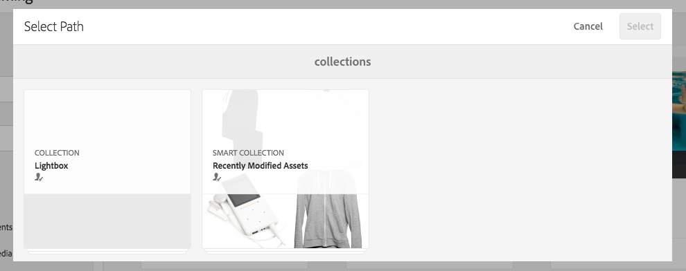

# Arbeiten mit Selektoren in Dynamic Media {#working-with-selectors}

<table>
    <tr>
        <td>
            <i>Neu</i> <a href="/help/assets/dynamic-media/dm-prime-ultimate.md"><b>Dynamic Media Prime und Ultimate</b></a>
        </td>
        <td>
            <i>Neu</i> <a href="/help/assets/assets-ultimate-overview.md"><b>AEM Assets Ultimate</b></a>
        </td>
        <td>
            <i>Neu</i> <a href="/help/assets/integrate-aem-assets-edge-delivery-services.md"><b>AEM Assets-Integration mit Edge Delivery Services</b></a>
        </td>
        <td>
            <i>Neu</i> <a href="/help/assets/aem-assets-view-ui-extensibility.md"><b>Erweiterbarkeit der Benutzeroberfläche</b></a>
        </td>
          <td>
            <i>Neu</i> <a href="/help/assets/dynamic-media/enable-dynamic-media-prime-and-ultimate.md"><b>Aktivieren von Dynamic Media Prime und Ultimate</b></a>
        </td>
    </tr>
    <tr>
        <td>
            <a href="/help/assets/search-best-practices.md"><b>Best Practices für die Suche</b></a>
        </td>
        <td>
            <a href="/help/assets/metadata-best-practices.md"><b>Best Practices für Metadaten</b></a>
        </td>
        <td>
            <a href="/help/assets/product-overview.md"><b>Content Hub</b></a>
        </td>
        <td>
            <a href="/help/assets/dynamic-media-open-apis-overview.md"><b>Dynamic Media mit OpenAPI-Funktionen</b></a>
        </td>
        <td>
            <a href="https://developer.adobe.com/experience-cloud/experience-manager-apis/"><b>Entwicklerdokumentation zu AEM Assets</b></a>
        </td>
    </tr>
</table>

Beim Arbeiten mit einem interaktiven Bild, interaktiven Videos oder Karussellbannern wählen Sie Assets sowie Sites und Produkte für Hotspots und Imagemaps zum Verknüpfen aus. Wenn Sie mit Bildsets, Rotationssets und Multimediasets arbeiten, wählen Sie mit dem Asset-Selektor Assets aus.

Dieses Thema befasst sich damit, wie die Produkt-, Site- und Asset-Selektoren verwendet werden, einschließlich der Möglichkeit, in den Selektoren zu suchen, zu filtern und zu sortieren.

Sie greifen auf die Selektoren beim Erstellen von Karussellsets, beim Hinzufügen von Hotspots und Imagemaps und beim Erstellen interaktiver Videos und Bilder zu.

In diesem Karussellbanner verwenden Sie beispielsweise den Produktselektor, wenn Sie einen Hotspot oder eine Imagemap mit einer Schnellansichtsseite verknüpfen. Verwenden Sie den Website-Selektor, wenn Sie einen Hotspot oder eine Imagemap mit einem Hyperlink verknüpfen. Verwenden Sie den Asset-Selektor, wenn Sie eine Folie erstellen.

Wenn Sie auswählen (statt dies manuell einzugeben), wo sich Hotspots oder Imagemaps befinden sollen, verwenden Sie den Selektor. Der Website-Selektor funktioniert nur, wenn Sie [!DNL Adobe Experience Manager Sites]-Kunde sind. Der Produktselektor erfordert außerdem [!DNL Experience Manager Commerce].

## Auswählen von Produkten in Dynamic Media {#selecting-products}

Verwenden Sie den Produktselektor, um ein Produkt auszuwählen, wenn Sie möchten, dass ein Hotspot oder eine Imagemap eine Schnellansicht zu einem bestimmten Produkt in Ihrem Produktkatalog zur Verfügung zu stellt.

1. Gehen Sie zum Karussellset, interaktiven Bild oder interaktiven Video und wählen Sie die Registerkarte **[!UICONTROL Aktionen]** (nur verfügbar, wenn Sie einen Hotspot oder eine Imagemap definiert haben).

   Der Produktselektor befindet sich im Bereich **[!UICONTROL Aktionstyp]**.

   

1. Klicken Sie auf das Symbol **[!UICONTROL Produktselektor]** (Lupe) und gehen Sie zu einem Produkt im Katalog.

   

   Sie können auch nach Keyword oder Tag filtern, indem Sie auf **[!UICONTROL Filter]** tippen und Keywords eingeben und/oder Tags auswählen.

   

   Sie können ändern, wo [!DNL Experience Manager] nach Produktdaten sucht, indem Sie auf **[!UICONTROL Durchsuchen]** tippen und zu einem anderen Ordner gehen.

   

   Klicken Sie auf **[!UICONTROL Sortieren nach]**, um zu ändern, ob [!DNL Experience Manager] von neu nach alt oder von alt nach neu sortiert.

   

   Klicken Sie auf **[!UICONTROL Anzeigen als]**, um zu ändern, wie Sie Produkte anzeigen (**[!UICONTROL Listenansicht]** oder **[!UICONTROL Kartenansicht]**).

   

1. Nachdem das Produkt ausgewählt wurde, wird das Feld mit dem Produktminiaturbild und dem Namen ausgefüllt.

   

1. Im **[!UICONTROL Vorschaumodus]** können Sie den Hotspot oder die Imagemap wählen und sehen, wie die Schnellansicht aussieht.

   

## Auswählen von Websites in Dynamic Media {#selecting-sites}

Verwenden Sie den Website-Selektor, um eine Web-Seite auszuwählen, wenn Sie einen Hotspot oder eine Imagemap mit einer Web-Seite verknüpfen möchten, die in [!DNL Experience Manager] Sites verwaltet wird.

1. Gehen Sie zum Karussellset, interaktiven Bild oder interaktiven Video und wählen Sie die Registerkarte **[!UICONTROL Aktionen]** (nur verfügbar, wenn Sie einen Hotspot oder eine Imagemap definiert haben).

   Der Site-Selektor befindet sich im Bereich **[!UICONTROL Aktionstyp]**.

   

1. Klicken Sie auf das Symbol **[!UICONTROL Website-Selektor]** (Ordner mit Lupe) und gehen Sie zu einer Seite in [!DNL Experience Manager] Sites, mit der Sie den Hotspot oder die Imagemap verknüpfen möchten.

   

1. Nachdem die Site ausgewählt wurde, wird das Feld mit dem Pfad ausgefüllt.

   

1. Wenn Sie im **[!UICONTROL Vorschaumodus]** auf den Hotspot oder die Imagemap klicken, gehen Sie zur Seite der [!DNL Experience Manager]-Website, die Sie angegeben haben.

## Auswählen von Assets in Dynamic Media {#selecting-assets}

Verwenden Sie diesen Selektor, um Bilder zur Verwendung in Karussellbannern, interaktiven Videos, Bildsets, gemischten Mediensets und Rotationssets auszuwählen. In interaktiven Videos ist der Asset-Selektor verfügbar, wenn Sie auf **[!UICONTROL Assets auswählen]** auf der Registerkarte **[!UICONTROL Inhalt]** klicken. In Karussellsets ist der Asset-Selektor verfügbar, wenn Sie Folie erstellen. In Bildsets, gemischten Mediensets und Rotationssets ist der Asset-Selektor verfügbar, wenn Sie ein neues Bildset, gemischtes Medienset oder Rotationsset erstellen.

Weitere Informationen finden Sie unter [Asset-Auswahl](/help/assets/search-assets.md#asset-selector).

1. Gehen Sie zum Karussellset und erstellen Sie eine Folie. Gehen Sie alternativ zum interaktiven Video, zur Registerkarte **[!UICONTROL Inhalte]** und wählen Sie die Assets aus. Erstellen Sie alternativ ein gemischtes Medienset, Bildset oder Rotationsset.
1. Klicken Sie auf das Symbol **[!UICONTROL Asset-Selektor]** (Ordner mit Lupe) und gehen Sie zu einem Asset.

   

   Sie können auch nach Keyword oder Tag filtern, indem Sie auf **[!UICONTROL Filter]** tippen und Keywords und/oder Kriterien hinzufügen.

   

   Sie können den Ordner, in dem [!DNL Experience Manager] nach Assets suchen soll, angeben, indem Sie im Feld **[!UICONTROL Pfad]** zu einem anderen Ordner gehen.

   Klicken Sie auf **[!UICONTROL Sammlung]**, um nur in Sammlungen nach Assets zu suchen.

   

   Klicken Sie auf **[!UICONTROL Anzeigen als]**, um zu ändern, wie Sie Produkte anzeigen (**[!UICONTROL Listenansicht]**, **[!UICONTROL Spaltenansicht]** oder **[!UICONTROL Kartenansicht]**).

   

1. Um das Asset auszuwählen, klicken Sie auf das Häkchen. Das Asset wird angezeigt.

   -->
