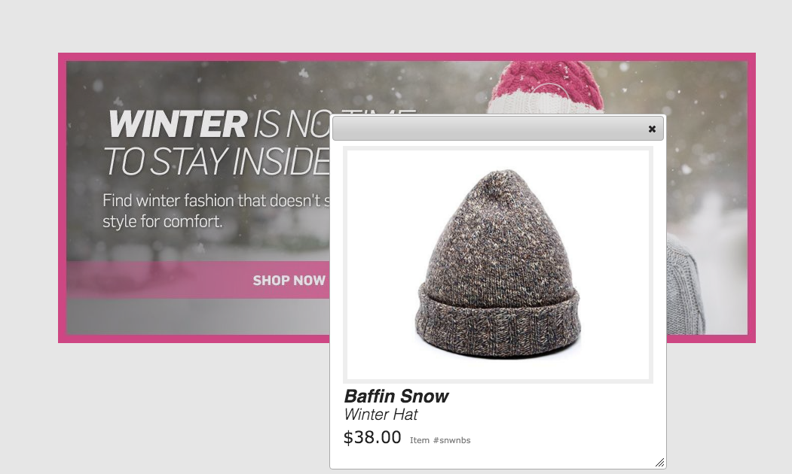
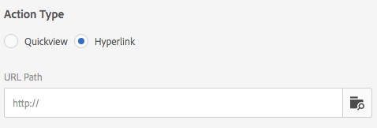

# Arbeiten mit Selektoren in Dynamic Media {#working-with-selectors}

Beim Arbeiten mit einem interaktiven Bild, interaktiven Videos oder Karussellbannern wählen Sie Assets sowie Sites und Produkte für Hotspots und Imagemaps zum Verknüpfen aus. Wenn Sie mit Bildsets, Rotationssets und Multimediasets arbeiten, wählen Sie mit dem Asset-Selektor Assets aus.

Dieses Thema befasst sich damit, wie die Produkt-, Site- und Asset-Selektoren verwendet werden, einschließlich der Möglichkeit, in den Selektoren zu suchen, zu filtern und zu sortieren.

Sie greifen auf die Selektoren beim Erstellen von Karussellsets, beim Hinzufügen von Hotspots und Imagemaps und beim Erstellen interaktiver Videos und Bilder zu.

Beispiel: In diesem Karussellbanner verwenden Sie den Produktselektor, wenn Sie einen Hotspot oder eine Imagemap mit einer Schnellansichtsseite verknüpfen, Sie verwenden den Site-Selektor, wenn Sie einen Hotspot oder eine Imagemap mit einem Hyperlink verknüpfen, und Sie verwenden den Asset-Selektor, wenn Sie eine neue Folie erstellen.

Wenn Sie auswählen (statt dies manuell einzugeben), wo sich Hotspots oder Imagemaps befinden sollen, verwenden Sie den Selektor. Der Site-Selektor funktioniert nur, wenn Sie AEM Sites-Kunde sind. Der Produktselektor erfordert außerdem AEM Commerce.

## Auswählen von Produkten in Dynamic Media {#selecting-products}

Verwenden Sie den Produktselektor, um ein Produkt auszuwählen, wenn Sie möchten, dass ein Hotspot oder eine Imagemap eine Schnellansicht zu einem bestimmten Produkt in Ihrem Produktkatalog zur Verfügung zu stellt.

1. Gehen Sie zum Karussellset, interaktiven Bild oder interaktiven Video und tippen oder klicken Sie auf die Registerkarte **[!UICONTROL Aktionen]** (nur verfügbar, wenn Sie einen Hotspot oder eine Imagemap definiert haben).

   Der Produktselektor befindet sich im Bereich **[!UICONTROL Aktionstyp]**.

   

1. Tippen Sie auf das Symbol **[!UICONTROL Produktselektor]** (Lupe) und gehen Sie zu einem Produkt im Katalog.

   

   Sie können auch nach Keyword oder Tag filtern, indem Sie auf **[!UICONTROL Filter]** tippen und Keywords eingeben und/oder Tags auswählen.

   

   Sie können ändern, wo AEM nach Produktdaten sucht, indem Sie auf **[!UICONTROL Durchsuchen]** tippen und zu einem anderen Ordner gehen.

   

   Tippen Sie auf **[!UICONTROL Sortieren nach]**, um zu ändern, ob AEM von neu nach alt oder von alt nach neu sortiert.

   

   Tippen Sie auf **[!UICONTROL Anzeigen als]**, um zu ändern, wie Sie Produkte anzeigen (**[!UICONTROL Listenansicht]** oder **[!UICONTROL Kartenansicht]**).

   

1. Nachdem das Produkt ausgewählt wurde, wird das Feld mit dem Produktminiaturbild und dem Namen ausgefüllt.

   

1. Im **[!UICONTROL Vorschaumodus]** können Sie auf den Hotspot oder die Imagemap tippen und sehen, wie die Schnellansicht aussieht.

   

## Auswählen von Sites in Dynamic Media {#selecting-sites}

Verwenden Sie den Site-Selektor, um eine Web-Seite auszuwählen, wenn Sie einen Hotspot oder eine Imagemap mit einer Website verknüpfen möchten, die in AEM Sites verwaltet wird.

1. Gehen Sie zum Karussellset, interaktiven Bild oder interaktiven Video und tippen oder klicken Sie auf die Registerkarte **[!UICONTROL Aktionen]** (nur verfügbar, wenn Sie einen Hotspot oder eine Imagemap definiert haben).

   Der Site-Selektor befindet sich im Bereich **[!UICONTROL Aktionstyp]**.

   

1. Tippen Sie auf das Symbol **[!UICONTROL Site-Selektor]** (Ordner mit Lupe) und gehen Sie zu einer Seite in Ihren AEM Sites, mit der Sie den Hotspot oder die Imagemap verknüpfen möchten.

   

1. Nachdem die Site ausgewählt wurde, wird das Feld mit dem Pfad ausgefüllt.

   

1. Wenn Sie im **[!UICONTROL Vorschaumodus]** auf den Hotspot oder die Imagemap tippen, gehen Sie zur Seite der AEM-Site, die Sie angegeben haben.

## Auswählen von Assets in Dynamic Media {#selecting-assets}

Verwenden Sie diesen Selektor, um Bilder zur Verwendung in Karussellbannern, interaktiven Videos, Bildsets, gemischten Mediensets und Rotationssets auszuwählen. In interaktiven Videos ist der Asset-Selektor verfügbar, wenn Sie auf **[!UICONTROL Assets auswählen]** auf der Registerkarte **[!UICONTROL Inhalt]** tippen. In Karussellsets ist der Asset-Selektor verfügbar, wenn Sie eine neue Folie erstellen. In Bildsets, gemischten Mediensets und Rotationssets ist der Asset-Selektor verfügbar, wenn Sie ein neues Bildset, gemischtes Medienset oder Rotationsset erstellen.

Weitere Informationen finden Sie unter [Asset-Auswahl](/help/assets/search-assets.md#assetselector).

1. Gehen Sie zum Karussellset und erstellen Sie eine neue Folie. Gehen Sie alternativ zum interaktiven Video, zur Registerkarte **[!UICONTROL Inhalt]** und wählen Sie die Assets aus. Erstellen Sie alternativ ein gemischtes Medienset, Bildset oder Rotationsset.
1. Tippen Sie auf das Symbol **[!UICONTROL Asset-Selektor]** (Ordner mit Lupe) und gehen Sie zu einem Asset.

   

   Sie können auch nach Keyword oder Tag filtern, indem Sie auf **[!UICONTROL Filter]** tippen und Keywords und/oder Kriterien hinzufügen.

   

   Sie können den Ordner, in dem AEM nach Assets suchen soll, angeben, indem Sie im Feld **[!UICONTROL Pfad]** zu einem anderen Ordner navigieren.

   Tippen Sie auf **[!UICONTROL Sammlung]**, um nur in Sammlungen nach Assets zu suchen.

   

   Tippen Sie auf **[!UICONTROL Anzeigen als]**, um zu ändern, wie Sie Produkte anzeigen (**[!UICONTROL Listenansicht]**, **[!UICONTROL Spaltenansicht]** oder **[!UICONTROL Kartenansicht]**).

   

1. Tippen Sie auf das Häkchen, um das Asset auszuwählen. Das Asset wird angezeigt.

   -->
