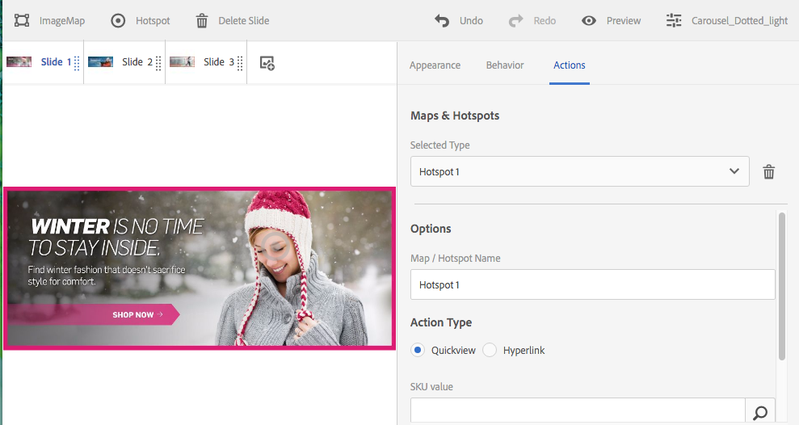

# Arbeiten mit Selektoren in Dynamic Media {#working-with-selectors}

Beim Arbeiten mit einem interaktiven Bild, interaktiven Videos oder Karussellbannern wählen Sie Assets sowie Sites und Produkte für Hotspots und Imagemaps zum Verknüpfen aus. Wenn Sie mit Bildsets, Rotationssets und Multimediasets arbeiten, wählen Sie mit dem Asset-Selektor Assets aus.

Dieses Thema befasst sich damit, wie die Produkt-, Site- und Asset-Selektoren verwendet werden, einschließlich der Möglichkeit, in den Selektoren zu suchen, zu filtern und zu sortieren.

Sie greifen auf die Selektoren beim Erstellen von Karussellsets, beim Hinzufügen von Hotspots und Imagemaps und beim Erstellen interaktiver Videos und Bilder zu.

In diesem Karussellbanner verwenden Sie beispielsweise den Produktselektor, wenn Sie einen Hotspot oder eine Imagemap mit einer Schnellansichtsseite verknüpfen. Verwenden Sie den Website-Selektor, wenn Sie einen Hotspot oder eine Imagemap mit einem Hyperlink verknüpfen. Verwenden Sie den Asset-Selektor, wenn Sie eine Folie erstellen.

Wenn Sie auswählen (statt dies manuell einzugeben), wo sich Hotspots oder Imagemaps befinden sollen, verwenden Sie den Selektor. Der Site-Selektor funktioniert nur, wenn Sie ein [!DNL Adobe Experience Manager Sites]-Kunde sind. Für den Produktselektor ist auch [!DNL Experience Manager Commerce] erforderlich.

## Produkte in Dynamic Media auswählen {#selecting-products}

Verwenden Sie den Produktselektor, um ein Produkt auszuwählen, wenn Sie möchten, dass ein Hotspot oder eine Imagemap eine Schnellansicht zu einem bestimmten Produkt in Ihrem Produktkatalog zur Verfügung zu stellt.

1. Navigieren Sie zum Karussellset, interaktiven Bild oder interaktiven Video und wählen Sie die Registerkarte **[!UICONTROL Aktionen]** aus (nur verfügbar, wenn Sie einen Hotspot oder eine Imagemap definiert haben).

   Der Produktselektor befindet sich im Bereich **[!UICONTROL Aktionstyp]**.

   

1. Wählen Sie das Symbol **[!UICONTROL Produktselektor]** (Lupe) aus und navigieren Sie zu einem Produkt im Katalog.

   

   Sie können auch nach Keyword oder Tag filtern, indem Sie auf **[!UICONTROL Filter]** tippen und Keywords eingeben und/oder Tags auswählen.

   

   Sie können ändern, wo [!DNL Experience Manager] nach Produktdaten sucht, indem Sie auf **[!UICONTROL Durchsuchen]** tippen und zu einem anderen Ordner navigieren.

   

   Wählen Sie **[!UICONTROL Sortieren nach]** aus, um zu ändern, ob [!DNL Experience Manager] von neu nach alt oder von alt nach neu sortiert wird.

   

   Wählen Sie **[!UICONTROL Als]** anzeigen , um die Ansicht der Produkte zu ändern - entweder **[!UICONTROL Listenansicht]** oder **[!UICONTROL Kartenansicht]**.

   

1. Nachdem das Produkt ausgewählt wurde, wird das Feld mit dem Produktminiaturbild und dem Namen ausgefüllt.

   

1. Im Modus **[!UICONTROL Vorschau]** können Sie den Hotspot oder die Imagemap auswählen und sehen, wie die Schnellansicht angezeigt wird.

   

## Sites in Dynamic Media auswählen {#selecting-sites}

Verwenden Sie den Site-Selektor, um eine Webseite auszuwählen, wenn ein Hotspot oder eine Imagemap mit einer Webseite verknüpft werden soll, die innerhalb von [!DNL Experience Manager] Sites verwaltet wird.

1. Navigieren Sie zum Karussellset, interaktiven Bild oder interaktiven Video und wählen Sie die Registerkarte **[!UICONTROL Aktionen]** aus (nur verfügbar, wenn Sie einen Hotspot oder eine Imagemap definiert haben).

   Der Site-Selektor befindet sich im Bereich **[!UICONTROL Aktionstyp]**.

   

1. Wählen Sie das Symbol **[!UICONTROL Site-Selektor]** (Ordner mit Lupe) und navigieren Sie zu einer Seite in Ihren [!DNL Experience Manager]-Sites, mit der Sie den Hotspot oder die Imagemap verknüpfen möchten.

   

1. Nachdem die Site ausgewählt wurde, wird das Feld mit dem Pfad ausgefüllt.

   

1. Wenn Sie im Modus **[!UICONTROL Vorschau]** den Hotspot oder die Imagemap auswählen, navigieren Sie zur von Ihnen angegebenen Seite [!DNL Experience Manager] .

## Auswählen von Assets in Dynamic Media {#selecting-assets}

Verwenden Sie diesen Selektor, um Bilder zur Verwendung in Karussellbannern, interaktiven Videos, Bildsets, gemischten Mediensets und Rotationssets auszuwählen. Im interaktiven Video ist der Asset-Selektor verfügbar, wenn Sie auf der Registerkarte **[!UICONTROL Inhalt]** die Option **[!UICONTROL Assets auswählen]** auswählen. In Karussellsets ist der Asset-Selektor verfügbar, wenn Sie Folie erstellen. In Bildsets, gemischten Mediensets und Rotationssets ist der Asset-Selektor verfügbar, wenn Sie ein neues Bildset, gemischtes Medienset oder Rotationsset erstellen.

Weitere Informationen finden Sie unter [Asset-Auswahl](/help/assets/search-assets.md#asset-selector).

1. Gehen Sie zum Karussellset und erstellen Sie eine Folie. Gehen Sie alternativ zum interaktiven Video, zur Registerkarte **[!UICONTROL Inhalte]** und wählen Sie die Assets aus. Erstellen Sie alternativ ein gemischtes Medienset, Bildset oder Rotationsset.
1. Wählen Sie das Symbol **[!UICONTROL Asset-Auswahl]** (Ordner mit Lupe) und navigieren Sie zu einem Asset.

   

   Sie können auch nach Keyword oder Tag filtern, indem Sie auf **[!UICONTROL Filter]** tippen und Keywords und/oder Kriterien hinzufügen.

   

   Sie können ändern, wo [!DNL Experience Manager] nach Assets sucht, indem Sie zu einem anderen Ordner im Feld **[!UICONTROL Pfad]** navigieren.

   Wählen Sie **[!UICONTROL Sammlung]** aus, um nur in Sammlungen nach Assets zu suchen.

   

   Wählen Sie **[!UICONTROL Als]** anzeigen , um die Ansicht der Produkte zu ändern - entweder **[!UICONTROL Listenansicht]**, **[!UICONTROL Spaltenansicht]** oder **[!UICONTROL Kartenansicht]**.

   

1. Um das Asset auszuwählen, wählen Sie das Häkchen aus. Das Asset wird angezeigt.

   -->
