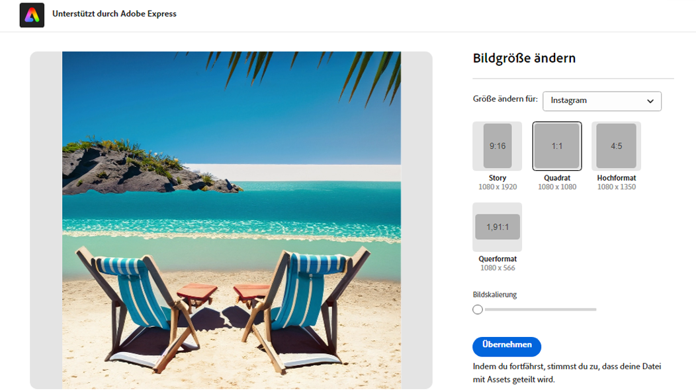
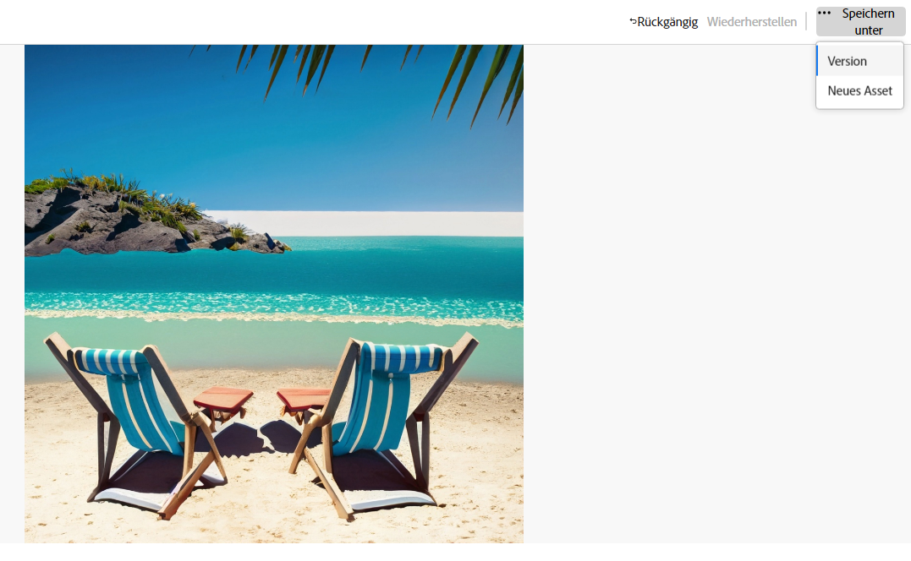
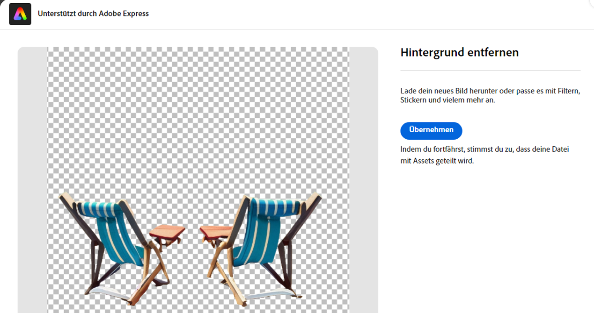
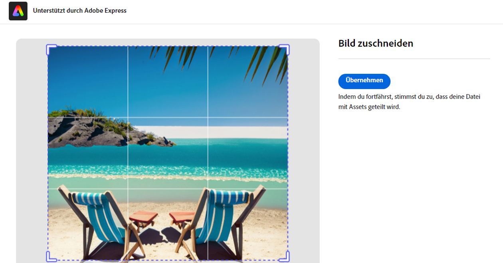
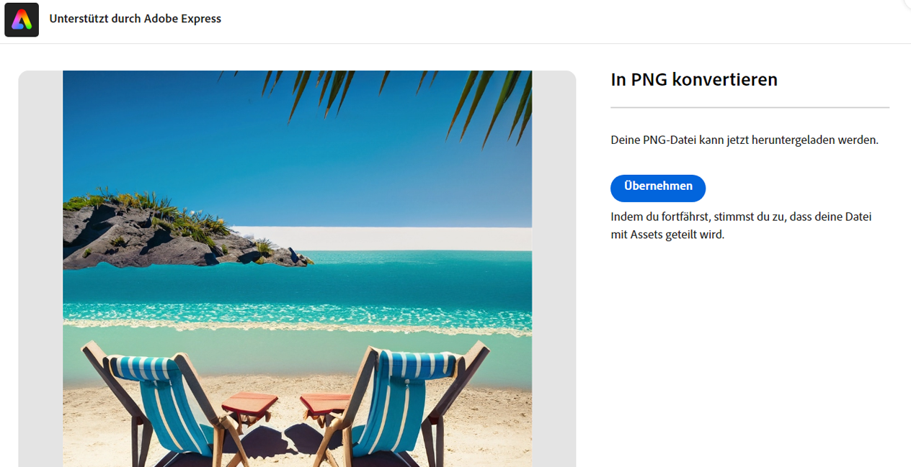
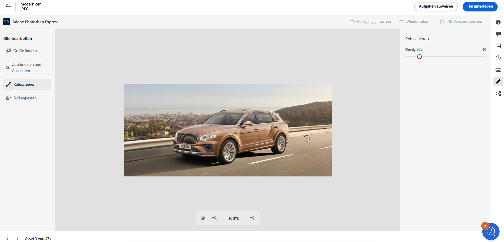
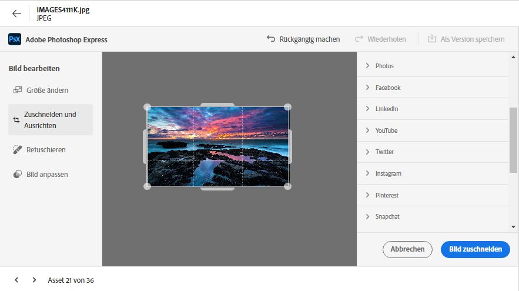
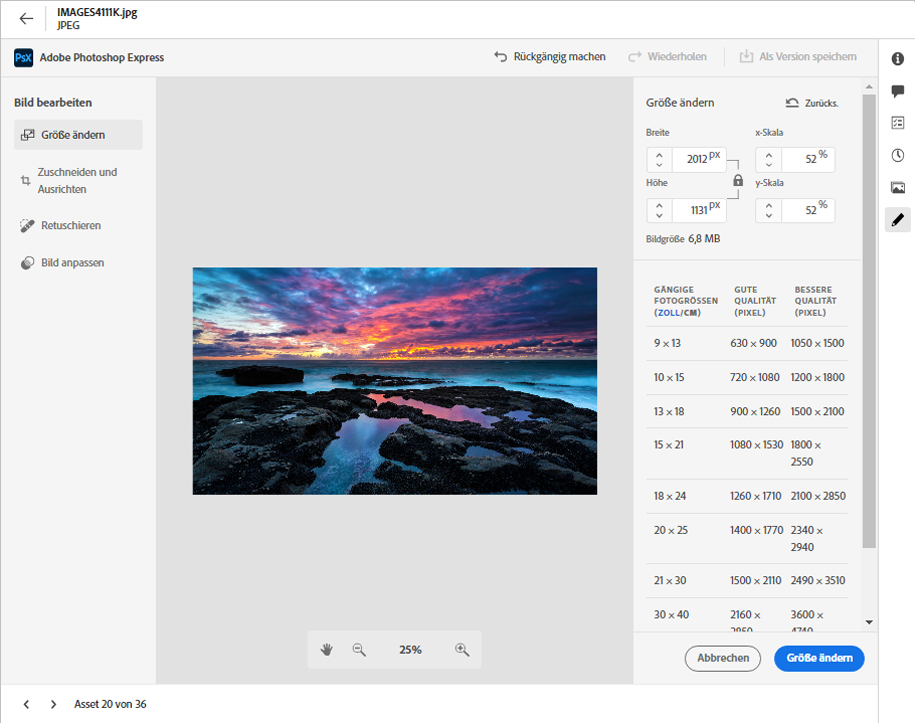
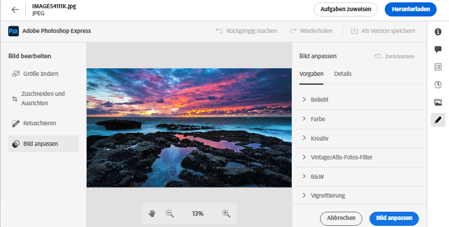

# Bearbeiten von Bildern in [!DNL Assets view] {#edit-images}

[!DNL Assets view] bietet benutzerfreundliche Bearbeitungsoptionen, die von [!DNL Adobe Express] und [!DNL Adobe Photoshop Express] unterstützt werden. Die Bearbeitungsaktionen, die mit [!DNL Adobe Express] verfügbar sind, sind „Bildgröße ändern“, „Hintergrund entfernen“, „Bild zuschneiden“ und „JPEG in PNG konvertieren“.

Nachdem Sie ein Bild bearbeitet haben, können Sie das neue Bild als neue Version speichern. Mit der Versionierung können Sie bei Bedarf später zum Original-Asset zurückkehren. Um ein Bild zu bearbeiten, [öffnen Sie seine Vorschau](/help/assets/navigate-assets-view.md) und klicken Sie auf **[!UICONTROL Bild bearbeiten]**.

>[!NOTE]
>
>Sie können mit [!DNL Adobe Express] Bilder vom Dateityp PNG und JPEG bearbeiten.

<!--The editing actions that are available are Spot healing, Crop and straighten, Resize image, and Adjust image.-->

## Bearbeiten von Bildern mit Adobe Express {#edit-using-express}

>[!CONTEXTUALHELP]
>id="assets_express_integration"
>title="Integration mit Adobe Express"
>abstract="Einfache und intuitive Bildbearbeitungs-Tools von Adobe Express, die direkt in AEM Assets verfügbar sind, um die Wiederverwendung von Inhalten zu steigern und die Geschwindigkeit der Inhaltswiedergabe zu beschleunigen."

### Ändern der Bildgröße {#resize-image-using-express}

Ein beliebtes Anwendungsbeispiel ist die Größenanpassung eines Bildes auf eine bestimmte Größe. [!DNL Assets view] ermöglicht es Ihnen, die Größe des Bildes schnell an die gängigen Bildgrößen anzupassen, indem es vorab berechnete neue Auflösungen für bestimmte Bildgrößen bereitstellt. Um die Bildgröße mit [!DNL Assets view] zu ändern, führen Sie die folgenden Schritte aus:

1. Wählen Sie ein Bild aus und klicken Sie auf **Bearbeiten**.
2. Klicken Sie in den Schnellaktionen im linken Bereich auf **[!DNL Resize Image]**.
3. Wählen Sie die entsprechende Social-Media-Plattform aus der Dropdown-Liste **[!UICONTROL Größe ändern für]** aus und wählen Sie die Bildgröße aus den angezeigten Optionen aus.
4. Skalieren Sie das Bild bei Bedarf mithilfe des **[!UICONTROL Bildskala]** -Feld.
5. Klicken Sie auf **[!DNL Apply]**, um Ihre Änderungen anzuwenden.
   

   Ihr bearbeitetes Bild kann heruntergeladen werden. Sie können das bearbeitete Asset entweder als neue Version desselben Assets oder als neues Asset speichern.
   

### Entfernen des Hintergrunds {#remove-background-using-express}

Sie können den Hintergrund aus einem Bild in einigen einfachen Schritten entfernen, wie unten beschrieben:

1. Wählen Sie ein Bild aus und klicken Sie auf **Bearbeiten**.
2. Klicken Sie in den Schnellaktionen im linken Bereich auf **[!DNL Remove Background]**. Experience Manager Assets zeigt das Bild ohne Hintergrund an.
3. Klicken Sie auf **[!DNL Apply]**, um Ihre Änderungen anzuwenden.
   

   Ihr bearbeitetes Bild kann heruntergeladen werden. Sie können das bearbeitete Asset entweder als neue Version desselben Assets oder als neues Asset speichern.

### Zuschneiden eines Bildes {#crop-image-using-express}

Das Umwandeln eines Bildes in eine perfekte Größe ist einfach mit den eingebetteten Schnellaktionen von [!DNL Adobe Express].

1. Wählen Sie ein Bild aus und klicken Sie auf **Bearbeiten**.
2. Klicken Sie in den Schnellaktionen im linken Bereich auf **[!DNL Crop Image]**.
3. Ziehen Sie die Griffe an den Ecken des Bildes, um den gewünschten Zuschnitt zu erstellen.
4. Klicken Sie auf **[!DNL Apply]**.
   
Das zugeschnittene Bild kann heruntergeladen werden. Sie können das bearbeitete Asset entweder als neue Version desselben Assets oder als neues Asset speichern.

### JPEG in PNG konvertieren {#convert-jpeg-to-png-using-express}

Mithilfe von Adobe Express können Sie schnell ein JPEG-Bild in ein PNG-Format konvertieren. Führen Sie die folgenden Schritte aus:

1. Wählen Sie ein Bild aus und klicken Sie auf **Bearbeiten**.
2. Klicken Sie in den Schnellaktionen im linken Bereich auf **[!DNL JPEG to PNG]**.
   
3. Klicken Sie auf **[!UICONTROL Herunterladen]**.

### Einschränkungen {#limitations-adobe-express}

* Unterstützte Bildauflösung: Minimum – 50 Pixel, Maximum – 6000 Pixel pro Dimension

* Maximale Dateigröße: 17 MB

## Bilder mit dem eingebetteten Adobe Expreß-Editor bearbeiten {#edit-using-embedded-editor}

Benutzer mit Zugriff auf Express verfügen jetzt über integrierte Bildbearbeitungs- und -erstellungs-Tools von Adobe Expreß und Adobe Firefly, die direkt in AEM Assets verfügbar sind, um die Wiederverwendung von Inhalten zu verbessern und die Content-Geschwindigkeit zu beschleunigen. Sie können auch vordefinierte Elemente verwenden, um Ihr Asset atemberaubend aussehen zu lassen oder durch schnelle Aktionen Ihr Bild mit nur wenigen Klicks zu bearbeiten.

So bearbeiten Sie Bilder mit [!DNL Adobe Express] Führen Sie die folgenden Schritte aus:

1. Wählen Sie ein Bild aus Ihrem [!DNL Experience Manager] Assets-Repository.
1. Klicks **[!UICONTROL In Adobe Expreß öffnen]**.

   

   Sie können die Funktionen von [!DNL Adobe Express] zum Ausführen aller Bildbearbeitungsaktionen, z. B. [Größenanpassung des Bildes](https://helpx.adobe.com/in/express/using/resize-image.html), [Hintergrundfarbe entfernen oder ändern](https://helpx.adobe.com/in/express/using/remove-background.html), [Zuschneiden des Bildes](https://helpx.adobe.com/in/express/using/crop-image.html)und vieles mehr.

1. Nachdem Sie die Bildbearbeitung abgeschlossen haben, können Sie ein Asset als neues Asset herunterladen oder es als neue Version speichern.

## Erstellen neuer Assets mit Adobe Expreß {#create-new-embedded-editor}

[!DNL Assets view] bietet Funktionen zum Erstellen einer neuen Vorlage mit [!DNL Adobe Express] eingebetteter Editor. So erstellen Sie ein neues Asset mit [!DNL Adobe Express]führen Sie die folgenden Schritte aus:

1. Navigieren Sie zu **[!UICONTROL Mein Arbeitsbereich]** und klicken **[!UICONTROL Erstellen]** im Adobe Expreß-Banner, das über dem [!UICONTROL Schnellzugriff] Abschnitt. [!DNL Adobe Express] leere Arbeitsfläche wird in der [!DNL Assets view] -Benutzeroberfläche.
1. Erstellen Sie Inhalt mit [Vorlagen](https://helpx.adobe.com/in/express/using/work-with-templates.html). Navigieren Sie andernfalls zu **[!UICONTROL Ihr Stuff]** , um vorhandenen Inhalt zu ändern.
1. Klicken Sie nach Abschluss der Bearbeitung auf **[!UICONTROL Als neues Asset speichern]**.
1. Geben Sie den Zielpfad für das erstellte Asset an und klicken Sie auf **[!UICONTROL Speichern]**.

>[!NOTE]
>
>* Sie können nur Bilder von `JPEG` und `PNG` Formattypen.
>* Die Größe des Assets muss kleiner als 14 MB sein.
>* Sie können ein Bild in `PDF`, `JPEG`oder `PNG` -Formaten.

## Bearbeiten von Bildern mit [!DNL Adobe Photoshop Express] {#edit-using-photoshop-express}

<!--
After editing an image, you can save the new image as a new version. Versioning helps you to revert to the original asset later, if needed. To edit an image, [open its preview](//help/navigate-assets-view.md#preview-assets) and click **[!UICONTROL Edit Image]**  from the rail on the right.

*Figure: The options to edit images are powered by [!DNL Adobe Photoshop Express].*
-->

### Bereichsreparatur von Bildern {#spot-heal-images-using-photoshop-express}

Wenn ein Bild kleine Flecken oder Objekte aufweist, können Sie die Flecken mithilfe der von Adobe Photoshop bereitgestellten Funktion zur Bereichsreparatur bearbeiten und entfernen.

Der Pinsel nimmt den retuschierten Bereich auf und lässt die reparierten Pixel nahtlos in den Rest des Bildes einfließen. Verwenden Sie eine Pinselgröße, die nur geringfügig größer ist als die Stelle, die Sie reparieren möchten.

<!-- 
TBD: See if we should give backlinks to PS docs for these concepts.
For more information about how Spot Healing works in Photoshop, see [retouching and repairing photos](https://helpx.adobe.com/photoshop/using/retouching-repairing-images.html). 
-->

### Bilder zuschneiden und gerade ausrichten {#crop-straighten-images-using-photoshop-express}

Mit der Option „Zuschneiden und gerade ausrichten“ können Sie das Bild einfach zuschneiden, drehen, horizontal oder vertikal drehen und es auf für beliebte Social-Media-Websites geeignete Abmessungen zuschneiden.

Um Ihre Änderungen zu speichern, klicken Sie auf **[!UICONTROL Bild zuschneiden]**. Nach der Bearbeitung können Sie das neue Bild als Version speichern.

Mit vielen Standardoptionen können Sie Ihr Bild auf die besten Proportionen zuschneiden, die für verschiedene Social-Media-Profile und -Posts geeignet sind.

### Ändern der Bildgröße {#resize-image-using-photoshop-express}

Sie können die gebräuchlichen Bildgrößen in Zentimetern oder Zoll anzeigen, um die Abmessungen zu erfahren. Standardmäßig behält die Methode zur Größenanpassung das Seitenverhältnis bei. Um das Seitenverhältnis manuell zu überschreiben, klicken Sie auf .

Geben Sie die Dimensionen ein und klicken Sie auf **[!UICONTROL Bildgröße ändern]**, um die Bildgröße zu ändern. Bevor Sie die Änderungen als Version speichern, können Sie entweder alle vor dem Speichern vorgenommenen Änderungen rückgängig machen, indem Sie auf [!UICONTROL Rückgängig] klicken, oder Sie können den spezifischen Schritt im Bearbeitungsvorgang ändern, indem Sie auf [!UICONTROL Wiederherstellen] klicken.

### Anpassen von Bildern {#adjust-image-using-photoshop-express}

Mit [!DNL Assets view] können Sie die Farbe, den Ton, den Kontrast und mehr mit nur wenigen Klicks anpassen. Klicken Sie im Bearbeitungsfenster auf **[!UICONTROL Bild anpassen]**. Die folgenden Optionen sind in der rechten Seitenleiste verfügbar:

* **Beliebt**: [!UICONTROL Hoher Kontrast und Detail], [!UICONTROL Entsättigter Kontrast], [!UICONTROL Gealtertes Foto], [!UICONTROL S/W Soft] und [!UICONTROL S/W Sepia-Ton].
* **Farbe**: [!UICONTROL Natur], [!UICONTROL Hell], [!UICONTROL Hoher Kontrast], [!UICONTROL Hoher Kontrast und Detail], [!UICONTROL Lebhaft] und [!UICONTROL Matt].
* **Kreativ**: [!UICONTROL Entsättigter Kontrast], [!UICONTROL Kühles Licht], [!UICONTROL Türkis und Rot], [!UICONTROL Softnebel], [!UICONTROL Vintage Instant], [!UICONTROL Warmer Kontrast], [!UICONTROL Flach und Grün], [!UICONTROL Roter Lift Matt], [!UICONTROL Warme Schatten] und [!UICONTROL Gealtertes Foto].
* **S/W**: [!UICONTROL S/W Querformat], [!UICONTROL S/W Hoher Kontrast], [!UICONTROL S/W Punch], [!UICONTROL S/W Niedriger Kontrast], [!UICONTROL S/W Flach], [!UICONTROL S/W Soft], [!UICONTROL S/W Infrarot], [!UICONTROL S/W Selen-Ton], [!UICONTROL S/W Sepia-Ton] und [!UICONTROL S/W Split-Ton].
* **Vignettierung**: [!UICONTROL Keine], [!UICONTROL Licht], [!UICONTROL Mittel] und [!UICONTROL Stark].

<!--
TBD: Insert a video of the available social media options.
-->

### Nächste Schritte {#next-steps}

* Geben Sie Produkt-Feedback über die Option [!UICONTROL Feedback] in der Benutzeroberfläche der Assets-Ansicht

* Geben Sie Feedback zur Dokumentation durch  über die Option [!UICONTROL Diese Seite bearbeiten] oder durch  über die Option [!UICONTROL Problem protokollieren] in der rechten Seitenleiste

* Kontaktieren Sie die [Kundenunterstützung](https://experienceleague.adobe.com/?support-solution=General&amp;lang=de#support)

>[!MORELIKETHIS]
>
>* [Anzeigen des Versionsverlaufs eines Assets](/help/assets/navigate-assets-view.md)
