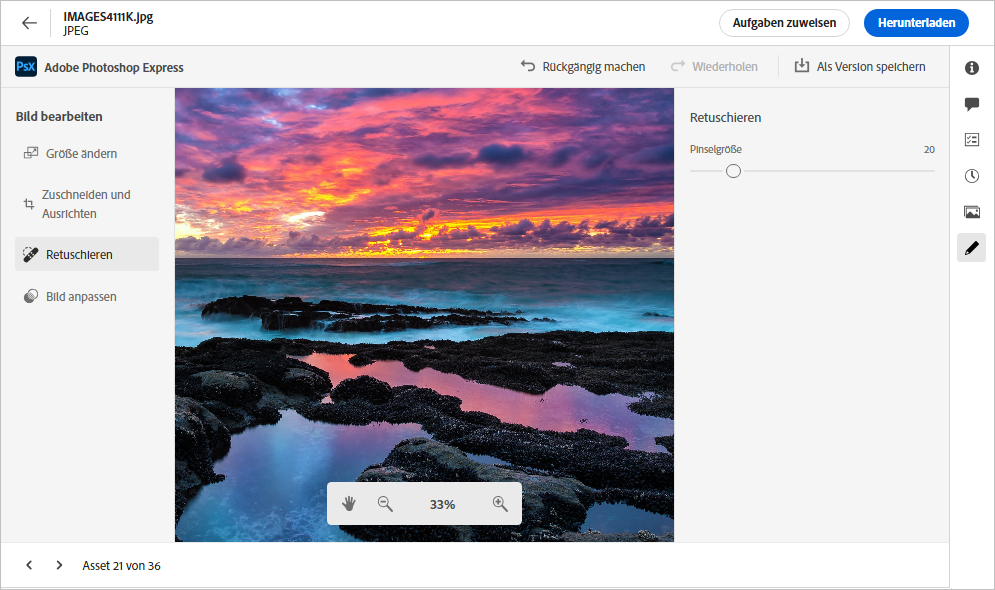

# Bearbeiten von Bildern in [!DNL Assets view] {#edit-images}

[!DNL Assets view] bietet benutzerfreundliche Bearbeitungsoptionen, die von [!DNL Adobe Express] unterstützt werden. Die Bearbeitungsaktionen, die bei [!DNL Adobe Express] verfügbar sind, sind „Bildgröße ändern“, „Hintergrund entfernen“, „Bild zuschneiden“ und „JPEG in PNG konvertieren“ oder umgekehrt.

Nachdem Sie ein Bild bearbeitet haben, können Sie das neue Bild als neue Version speichern. Mit der Versionierung können Sie bei Bedarf später zum Original-Asset zurückkehren. Darüber hinaus ist die Versionierung nur für die PNG-Dateitypen verfügbar. Wenn Sie also versuchen, einen Hintergrund aus einem JPG-Dateityp zu entfernen, wird JPG automatisch in PNG konvertiert. Um ein Bild zu bearbeiten, [öffnen Sie seine Vorschau](navigate-assets-view.md) und klicken Sie auf **[!UICONTROL Bild bearbeiten]**.

>[!NOTE]
>
>Sie können mit [!DNL Adobe Express] Bilder vom Dateityp PNG und JPEG bearbeiten.

<!--The editing actions that are available are Spot healing, Crop and straighten, Resize image, and Adjust image.-->

## Bearbeiten von Bildern mit Adobe Express {#edit-using-express}

>[!CONTEXTUALHELP]
>id="assets_express_integration"
>title="Integration mit Adobe Express"
>abstract="Einfache und intuitive Bildbearbeitungs-Tools von Adobe Express, die direkt in AEM Assets verfügbar sind, um die Wiederverwendung von Inhalten zu steigern und die Geschwindigkeit der Inhaltswiedergabe zu beschleunigen."

### Ändern der Bildgröße {#resize-image-using-express}

Ein beliebtes Anwendungsbeispiel ist die Größenanpassung eines Bildes auf eine bestimmte Größe. [!DNL Assets view] ermöglicht es Ihnen, die Größe des Bildes schnell an die gängigen Bildgrößen anzupassen, indem es vorab berechnete neue Auflösungen für bestimmte Bildgrößen bereitstellt. Um die Bildgröße mit [!DNL Assets view] zu ändern, führen Sie die folgenden Schritte aus:

1. Wählen Sie ein Bild aus Ihrem [!DNL Experience Manager]-Assets-Repository und klicken Sie auf **Bearbeiten**.
2. Klicken Sie auf **[!UICONTROL Bildgröße ändern]** in den Schnellaktionen im linken Bereich.
3. Wählen Sie die entsprechende Social-Media-Plattform aus der Dropdown-Liste **[!UICONTROL Größe ändern für]** aus und wählen Sie die Bildgröße aus den angezeigten Optionen aus.
4. Falls erforderlich, skalieren Sie das Bild mithilfe des Feldes **[!UICONTROL Bildskala]**.
5. Klicken Sie auf **[!UICONTROL Anwenden]**, um Ihre Änderungen anzuwenden.
   

   Ihr bearbeitetes Bild kann heruntergeladen werden. Sie können das bearbeitete Asset entweder als neue Version desselben Assets oder als neues Asset speichern.
   

### Entfernen des Hintergrunds {#remove-background-using-express}

Sie können den Hintergrund aus einem Bild in einigen einfachen Schritten entfernen, wie unten beschrieben:

1. Wählen Sie ein Bild aus Ihrem [!DNL Experience Manager]-Assets-Repository und klicken Sie auf **Bearbeiten**.
2. Klicken Sie in den Schnellaktionen im linken Bereich auf **[!UICONTROL Hintergrund entfernen]**. Experience Manager Assets zeigt das Bild ohne Hintergrund an.
3. Klicken Sie auf **[!UICONTROL Anwenden]**, um Ihre Änderungen anzuwenden.
   

### Zuschneiden eines Bildes {#crop-image-using-express}

Das Umwandeln eines Bildes in eine perfekte Größe ist einfach mit den eingebetteten Schnellaktionen von [!DNL Adobe Express].

1. Wählen Sie ein Bild aus Ihrem [!DNL Experience Manager]-Assets-Repository und klicken Sie auf **Bearbeiten**.
2. Klicken Sie auf **[!UICONTROL Bild zuschneiden]** in den Schnellaktionen im linken Bereich.
3. Ziehen Sie die Griffe an den Ecken des Bildes, um den gewünschten Zuschnitt zu erstellen.
4. Klicken Sie auf **[!UICONTROL Übernehmen]**.
   
Das zugeschnittene Bild kann heruntergeladen werden. Sie können das bearbeitete Asset entweder als neue Version desselben Assets oder als neues Asset speichern.

### JPEG in PNG konvertieren {#convert-jpeg-to-png-using-express}

Mithilfe von Adobe Express können Sie schnell ein JPEG-Bild in ein PNG-Format konvertieren. Führen Sie die folgenden Schritte aus:

1. Wählen Sie ein Bild aus Ihrem [!DNL Experience Manager]-Assets-Repository und klicken Sie auf **Bearbeiten**.
2. Klicken Sie in den Schnellaktionen im linken Bereich auf **[!UICONTROL In PNG konvertieren]**.
   <!---->
3. Klicken Sie auf **[!UICONTROL Übernehmen]**.
4. Navigieren Sie oben rechts zu **[!UICONTROL Speichern unter]** und klicken Sie auf **[!UICONTROL Als neues Asset speichern]**.

### Konvertieren von PNG in JPEG {#convert-png-to-jpeg-using-express}

Mithilfe von Adobe Express können Sie schnell ein PNG-Bild in ein JPEG-Format konvertieren. Führen Sie die folgenden Schritte aus:

1. Wählen Sie ein Bild aus Ihrem [!DNL Experience Manager]-Assets-Repository und klicken Sie auf **Bearbeiten**.
2. Klicken Sie in den Schnellaktionen im linken Bereich auf **[!UICONTROL In JPEG konvertieren]**.
3. Klicken Sie auf **[!UICONTROL Übernehmen]**.
4. Navigieren Sie oben rechts zu **[!UICONTROL Speichern unter]** und klicken Sie auf **[!UICONTROL Als neues Asset speichern]**.

### Einschränkungen {#limitations-adobe-express}

* Unterstützte Bildauflösung: Minimum – 50 Pixel, Maximum – 6000 Pixel pro Dimension.

* Maximal unterstützte Dateigröße: 17 MB.

## Bildbearbeitung mit dem integrierten Adobe Express-Editor {#edit-using-embedded-editor}

Organisationen mit Zugriff auf Adobe Express verfügen jetzt über integrierte Tools von Adobe Express und Adobe Firefly zur Bildbearbeitung und -erstellung, die direkt in der Assets-Anzeige verfügbar sind, um die Wiederverwendung von Inhalten zu verbessern und die Geschwindigkeit von Inhalten zu beschleunigen. Sie können auch vordefinierte Elemente verwenden, um Ihr Asset atemberaubend aussehen zu lassen oder Ihr Bild mit nur wenigen Klicks schnell und bequem zu bearbeiten.

Gehen Sie wie folgt vor, um Bilder mit dem in [!DNL Adobe Express] integrierten Editor zu bearbeiten:

1. Wählen Sie ein Bild aus Ihrem [!DNL Experience Manager]-Assets-Repository.
1. Klicken Sie auf **[!UICONTROL In Adobe Express öffnen]**.

   

   Sie können die Funktionen von [!DNL Adobe Express] zum Ausführen aller Bildbearbeitungsaktionen nutzen, z. B. [Bildgröße ändern](https://helpx.adobe.com/de/express/using/resize-image.html), [Hintergrundfarbe entfernen oder ändern](https://helpx.adobe.com/de/express/using/remove-background.html), [Bild beschneiden](https://helpx.adobe.com/de/express/using/crop-image.html) und vieles mehr.

1. Nachdem Sie die Bildbearbeitung abgeschlossen haben, können Sie ein Asset als neues Asset herunterladen oder es als neue Version speichern.

## Erstellen neuer Assets in Adobe Express {#create-new-embedded-editor}

In [!DNL Assets view] können Sie mithilfe des in [!DNL Adobe Express] integrierten Editors eine komplett neue Vorlage erstellen. Gehen Sie wie folgt vor, um in [!DNL Adobe Express] ein neues Asset zu erstellen:

1. Navigieren Sie zu **[!UICONTROL Mein Arbeitsbereich]** und klicken Sie im Adobe Express-Banner ganz oben auf **[!UICONTROL Erstellen]**. [!DNL Adobe Express] leere Arbeitsfläche wird in der [!DNL Assets view]-Benutzeroberfläche angezeigt.
1. Erstellen Sie Inhalte mithilfe von [Vorlagen](https://helpx.adobe.com/de/express/using/work-with-templates.html). Navigieren Sie andernfalls zu **[!UICONTROL Ihr Inhalt]**, um vorhandene Inhalte zu ändern.
1. Klicken Sie nach Abschluss der Bearbeitung auf **[!UICONTROL Als neues Asset speichern]**.
1. Geben Sie einen Zielpfad für das erstellte Asset ein und klicken Sie auf **[!UICONTROL Speichern]**.

>[!NOTE]
>
>* Sie können nur Bilder mit den Formattypen `JPEG` und `PNG` ändern.
>* Das Asset muss kleiner als 17 MB sein.
>* Sie können ein Bild im `PDF`-, `JPEG`- oder `PNG`-Format verwenden. Wenn mehrere Seiten vorhanden sind, können Sie sie als `PDF` speichern.

<!--
## Edit images using [!DNL Adobe Photoshop Express] {#edit-using-photoshop-express}

<!--
After editing an image, you can save the new image as a new version. Versioning helps you to revert to the original asset later, if needed. To edit an image, [open its preview](navigate-assets-view.md#preview-assets) and click **[!UICONTROL Edit Image]**  from the rail on the right.

*Figure: The options to edit images are powered by [!DNL Adobe Photoshop Express].*
-->
<!--
### Touch up images {#spot-heal-images-using-photoshop-express}

If there are minor spots or small objects on an image, you can edit and remove the spots using the spot healing feature provided by Adobe Photoshop.

The brush samples the retouched area and makes the repaired pixels blend seamlessly into the rest of the image. Use a brush size that is only slightly larger than the spot you want to fix.

<!-- 
TBD: See if we should give backlinks to PS docs for these concepts.
For more information about how Spot Healing works in Photoshop, see [retouching and repairing photos](https://helpx.adobe.com/photoshop/using/retouching-repairing-images.html). 
-->
<!-- 
### Crop and straighten images {#crop-straighten-images-using-photoshop-express}

Using the crop and straighten option that you can do basic cropping, rotate image, flip it horizontally or vertically, and crop it to dimensions suitable for popular social media websites.

To save your edits, click **[!UICONTROL Crop Image]**. After editing, you can save the new image as a version.

Many default options let you crop your image to the best proportions that fit various social media profiles and posts.

### Resize image {#resize-image-using-photoshop-express}

You can view the common photo sizes in centimeters or inches to know the dimensions. By default, the resizing method retains the aspect ratio. To manually override the aspect ratio, click .

Enter the dimensions and click **[!UICONTROL Resize Image]** to resize the image. Before you save the changes as a version, you can either undo all the changes done before saving by clicking [!UICONTROL Undo] or you can change the specific step in the editing process by clicking [!UICONTROL Revert].

### Adjust image {#adjust-image-using-photoshop-express}

[!DNL Assets view] lets you adjust the color, tone, contrast, and more, with just a few clicks. Click **[!UICONTROL Adjust image]** in the edit window. The following options are available in the right sidebar:

* **Popular**: [!UICONTROL High Contrast & Detail], [!UICONTROL Desaturated Contrast], [!UICONTROL Aged Photo], [!UICONTROL B&W Soft], and [!UICONTROL B&W Sepia Tone].
* **Color**: [!UICONTROL Natural], [!UICONTROL Bright], [!UICONTROL High Contrast], [!UICONTROL High Contrast & Detail], [!UICONTROL Vivid], and [!UICONTROL Matte].
* **Creative**: [!UICONTROL Desaturated Contrast], [!UICONTROL Cool Light], [!UICONTROL Turquoise & Red], [!UICONTROL Soft Mist], [!UICONTROL Vintage Instant], [!UICONTROL Warm Contrast], [!UICONTROL Flat & Green], [!UICONTROL Red Lift Matte], [!UICONTROL Warm Shadows], and [!UICONTROL Aged Photo].
* **B&W**: [!UICONTROL B&W Landscape], [!UICONTROL B&W High Contrast], [!UICONTROL B&W Punch], [!UICONTROL B&W Low Contrast], [!UICONTROL B&W Flat], [!UICONTROL B&W Soft], [!UICONTROL B&W Infrared], [!UICONTROL B&W Selenium Tone], [!UICONTROL B&W Sepia Tone], and [!UICONTROL B&W Split Tone].
* **Vignetting**: [!UICONTROL None], [!UICONTROL Light], [!UICONTROL Medium], and [!UICONTROL Heavy].

<!--
TBD: Insert a video of the available social media options.
-->

### Nächste Schritte {#next-steps}

* Geben Sie Produkt-Feedback über die Option [!UICONTROL Feedback] in der Benutzeroberfläche der Assets-Ansicht

* Geben Sie Feedback zur Dokumentation durch  über die Option [!UICONTROL Diese Seite bearbeiten] oder durch  über die Option [!UICONTROL Problem protokollieren] in der rechten Seitenleiste

* Kontaktieren Sie die [Kundenunterstützung](https://experienceleague.adobe.com/?support-solution=General&amp;lang=de#support)

>[!MORELIKETHIS]
>
>* [Schnellaktionen in Adobe Express](https://helpx.adobe.com/de/express/using/resize-image.html)
>* [Anzeigen des Versionsverlaufs eines Assets](navigate-assets-view.md)
